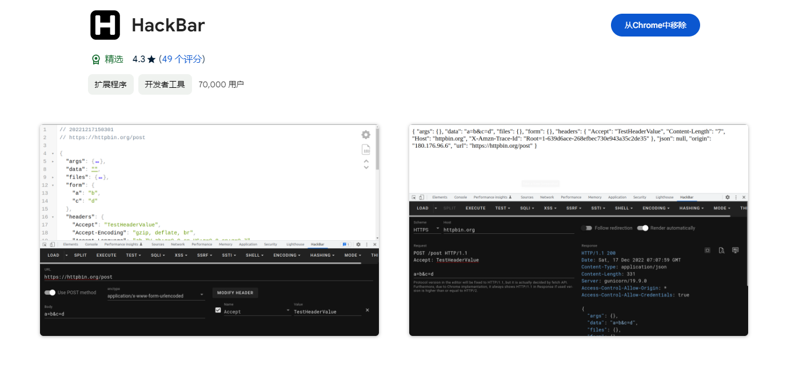
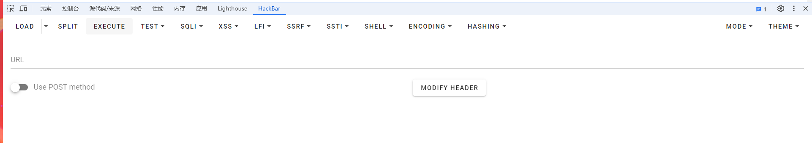
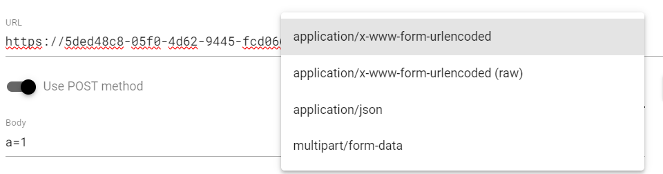
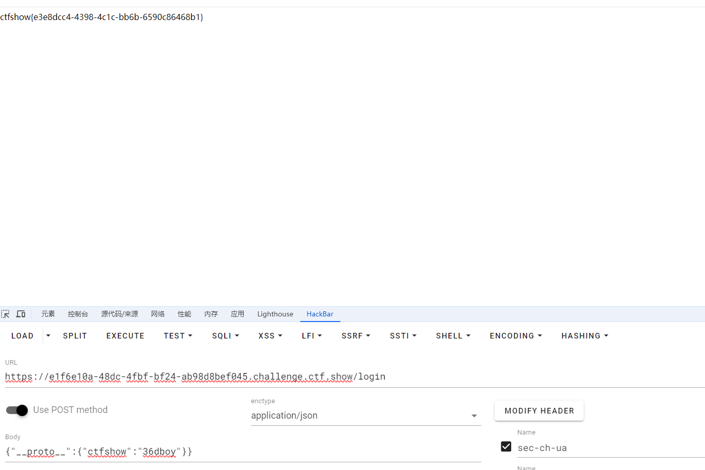
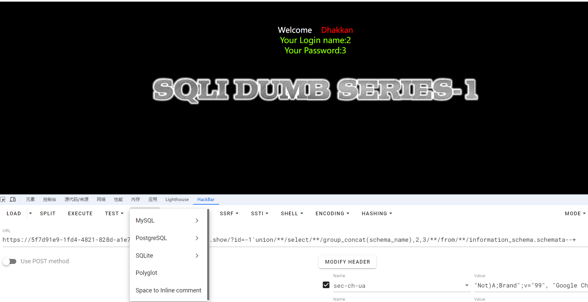
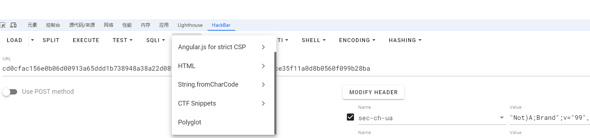
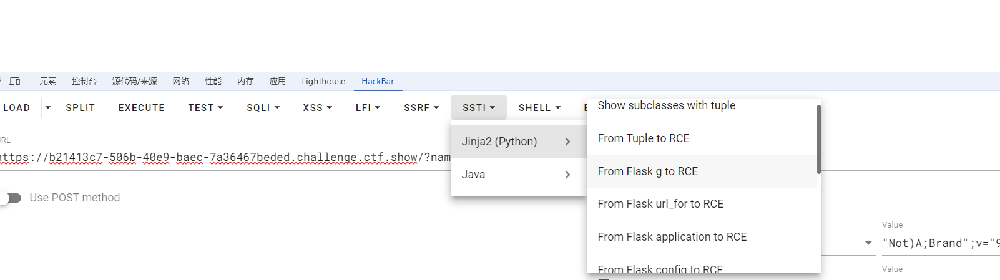
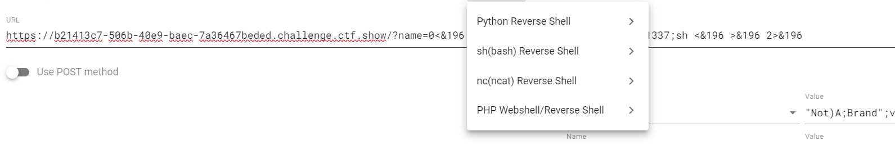
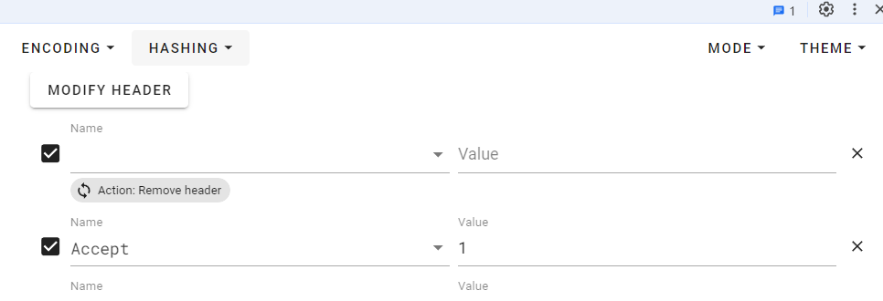

+++
title = "浅谈hackbar"
slug = "hackbar-brief-introduction"
description = "新手最喜欢的"
date = "2024-08-08T11:53:28"
lastmod = "2024-08-08T11:53:28"
image = ""
license = ""
categories = ["talk"]
tags = ["工具"]
+++

# 0x01 前言

这个工具，想必大家是都知道的，但是鉴于hackbar有部分偷懒功能，而且之前学习nodejs污染的时候有师傅说，"hackbar的POST不能传json只可以传键值对"，所以我觉得还是有必要一说

# 0x02 安装

鉴于安装过程相当简单，那我就顺便讲讲吧

首先进入`chrome`，然后进入插件商店，选择这一款，不要钱，而且功能也算齐全



安装等再到可以使用`hackbar`的网页即可`F12`使用了

# 0x03 基础使用

## GET传参



可以看到是什么都没有的空娃娃

```
LOAD:载入当前的url

SPLIT:对url后面我们传入的参数进行切片

EXECUTE:发包
```

```
例子：
https://5ded48c8-05f0-4d62-9445-fcd0666ca1d3.challenge.ctf.show/?c=system("ls");
在url后面加一个?,然后传入键值对，这种传参方式好像是只能传入键值对了
```

## POST传参



首先选择传入参数的`content-type`

诶，那么确实这是hackbar比bp少的一点，那就是不能改包文件，只能传字符串

但是前言中所提到的json传参污染nodejs，这里很明显是可以做到的，如下图



也是传参成功了

## test模块

这个模块是来看密码本中的后台根据status来验证是否存在网页，但是鉴于dirsearch等扫后台工具的流行，这个模块基本没用过(不对是除了今天写文章都没用过)

## sql模块



这个模块提供了三种数据库的注入语句写法，并且有最基本的盲注`payload`以及`/**/`绕过空格,对于正在攻克靶场，但是很多`payload`基本上都是大同小异，稍微改改就行，所以还是比较方便的

## ssrf模块

只是一个小小的payload用来进行vps穿透打入环境,还可以

## LFI模块

filter协议的`payload`,但是遗憾的是只有base64，不过改改编码方式，对于各位大手子还是比较ez的吧？

## xss模块

也是渗透测试中常见的payload,但是有个很吸引人(wo)的点就是专门设立了一个`CTF区块`



也是相当的方便

## SSTI模块



里面包含`jinja和java`两种模版，我反正挺喜欢`jinja`的哈哈，简单的SSTI，但是要去找可用类，可用方法确实非常麻烦，直接一键`getshell`,如果不对的话，还是修改一下payload即可,而且其中涉及的payload相当多，好用

## shell模块

其实一般本地环境难以getshell的时候，常常会考虑到反弹shell，但是bash诸如此类的命令那是相当的长，我是记不住的😫



很方便

## encoding模块

其中包括常见姿势所用到的大多数编码,Unicode\hex\base64\url(全编码)\url(半编码)

## hashing模块

有些CTF题目会考察将shell写入文件名为原文件名的MD5的文件,那么这里就是非常有用了

虽然不能像某些网站一样依靠大量的数据去破解hash,又或者是自己写脚本来碰撞,但是我认为已经足够了

## header头

差点忘记说这个了,这个那是硬通货

其中包含很多,应该是全部涵盖了,而且有些师傅容易**粗细达意**/(ㄒoㄒ)/~~

没错又是我，之前初学的时候伪造本地IP，xff头，但是其中的冒号应该是英文的而我写成了中文，但是用hackbar就不会有这种类似的问题



`MODIFY HEADER `既是添加也是清空，必须将添加的header输入相对应的值之后才能进行第二次的添加，以此类推

# 0x04 小结

由于学习`nodejs`的污染看其他师傅的`wp`有感而发，其中很多模块我之前都没有使用过，今天一一尝试，也是一种进步了，若本文有错误地方，还望各位师傅斧正哇！！

