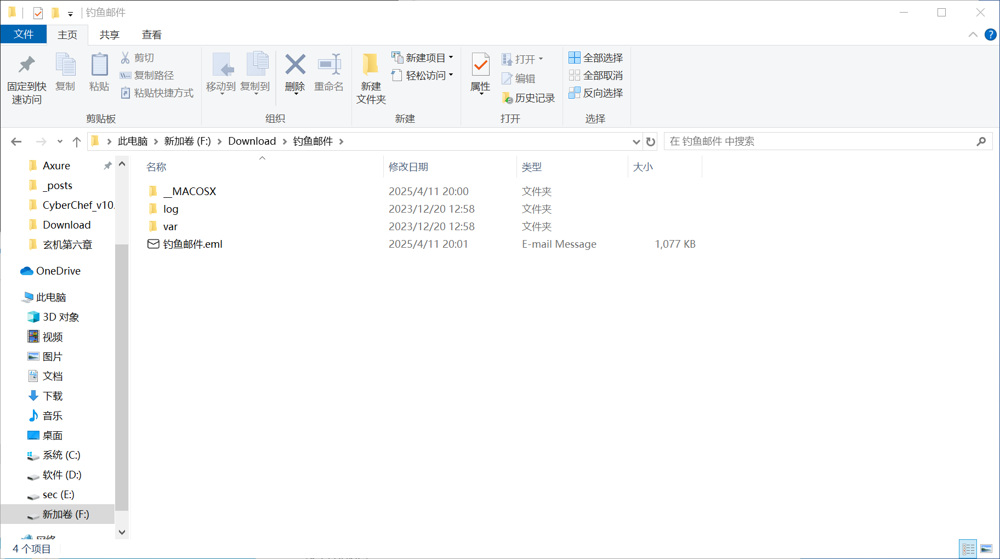
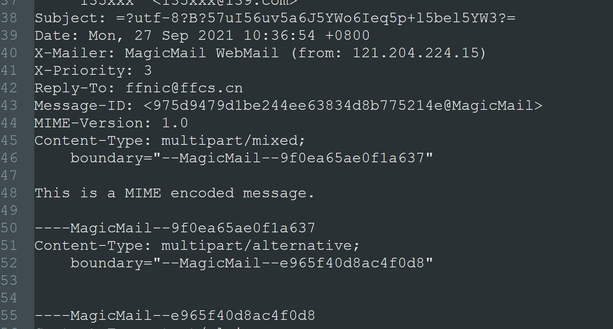
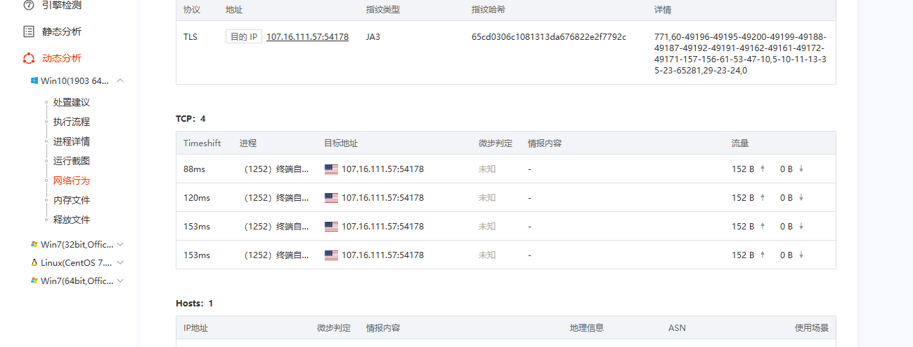

+++
title = "玄机第七章"
slug = "xuanji-chapter-7"
description = "刷"
date = "2025-04-11T19:58:45"
lastmod = "2025-04-11T19:58:45"
image = ""
license = ""
categories = []
tags = []
+++

## 第七章 常见攻击事件分析--钓鱼邮件

给了一个附件，里面有



其中`__MACOSX`是mac打包Zip的隐藏文件夹，不用管，然后就是我们熟悉的两个文件夹，还有eml文件，这是邮件消息文件格式

### flag1

首先我们直接打开这个`eml`文件，



`flag{121.204.224.15}`

### flag2

看到还有很多base64的内容，并且给了压缩包密码为`2021@123456`，本来想把压缩包保存下来之后再放进云沙箱的，但是发现可以直接把邮件丢进云沙箱



`flag{107.16.111.57}`

### flag3

查杀webshell，看到有目录直接放到D盾里面，得到`flag{/var/www/html/admin/ebak/ReData.php}`，看了一下木马没啥好讲的，他就是插入了一点代码罢了

### flag4

这种文件大部分要么在`tmp`，要么在进程，要么在网站根目录，一看发现根本不用找，

```
[common]
server_addr=178.102.115.17:52329
conn_type=tcp
vkey=6bHW7m4SMvy
auto_reconnection=true
max_conn=1000
flow_limit=1000
rate_limit=1000

# username and password of http and socks5 proxy
# basic_username=11
# basic_password=3
# web_username=user
# web_password=1234
crypt=true
compress=true
```

`socks5`很明显啊，得到`flag{/var/tmp/proc/mysql}`
