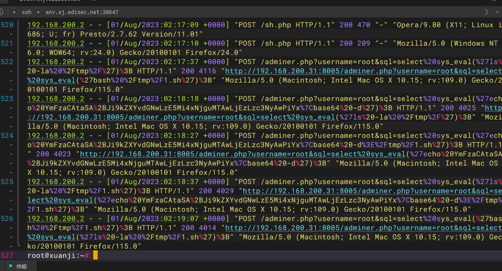
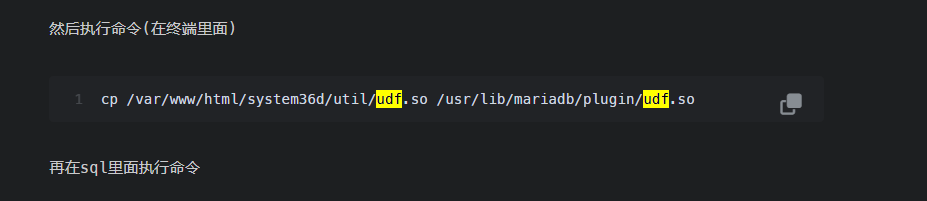
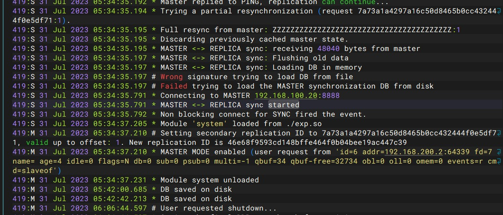
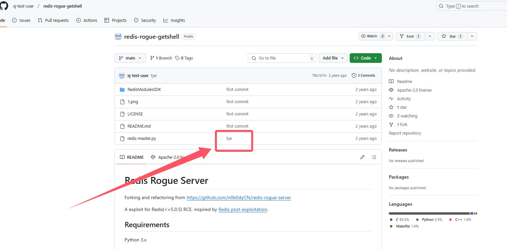
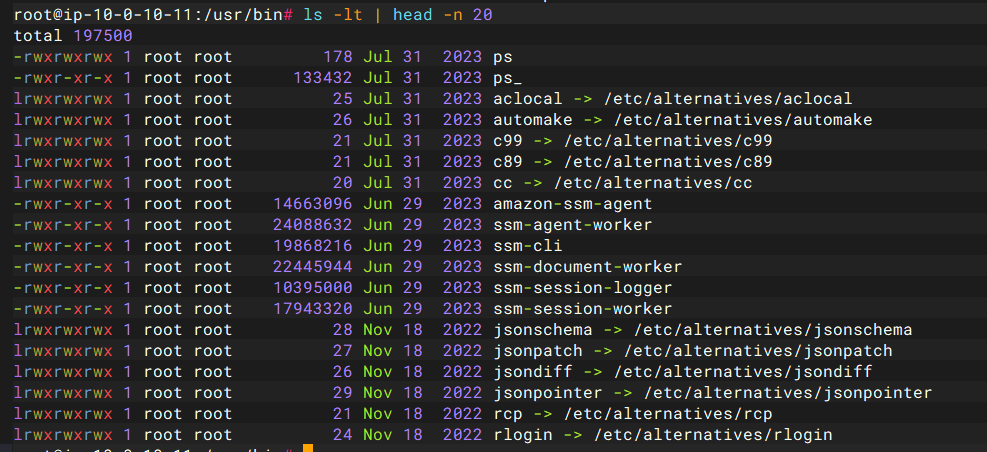

+++
title = "玄机第二章"
slug = "xuanji-chapter-2"
description = "刷"
date = "2025-03-14T12:52:06"
lastmod = "2025-03-14T12:52:06"
image = ""
license = ""
categories = [""]
tags = ["日志分析", "应急响应"]
+++

## 第二章日志分析-apache日志分析

直接把Apache的日志导出来

```
/var/log/apache2/access.log.1
```

### f1

但是这个日志已经有好几千行代码了，但是可以看到日志结构和`auth.log`，是不太一样的，IP在第一位，我们直接把IP导出来

```
cat access.log.1 | awk '{print $1}' | sort | uniq -c
```

```
flag{192.168.200.2}
```

### f2

指纹就是UA头，我们已经知道了黑客IP所以直接写命令

```
cat access.log.1 | grep -Ea "192.168.200.2"| sort | uniq -c
```

知道是

```
Mozilla/5.0 (Windows NT 10.0; Win64; x64) AppleWebKit/537.36 (KHTML, like Gecko) Chrome/87.0.4280.88 Safari/537.36

flag{2d6330f380f44ac20f3a02eed0958f66}
```

### f3

计数已经计算不出来了，这里我们计算行数

```
cat access.log.1 | grep -Ea "/index.php"| sort | wc -l
```

`flag{27}`

### f4

```
cat access.log.1 | grep -Ea "192.168.200.2"| wc -l
```

但是不对，后面发现给误差算了，所以正则增强一下

```
cat access.log.1 | grep -Ea "192.168.200.2 - -"| wc -l
```

`flag{6555}`

### f5

查看有多少IP访问，其实我这个问题没有看太懂，就是总共的访问次数？

```
cat access.log.1 | grep -Ea "^[0-9]+.*+03/Aug/2023:[08|09]"|awk '{print $1}'| uniq -c

cat access.log.1 | grep -Ea "^[0-9]+.*+03/Aug/2023:[08|09]"|awk '{print $1}'| uniq -c | wc -l
```

最后交的是IP数，奇怪的语文问题`flag{5}`

## 第二章日志分析-mysql应急响应

### f1

先把目录导出来，放D盾里面，有一个文件里面什么的都有，不管他，而`sh.php`是一句话，所以直接交

```
flag{ccfda79e-7aa1-4275-bc26-a6189eb9a20b}
```

### f2

反弹shell的IP，看看日志就好了，`/var/log/apache2/access.log`



发现了命令什么的，写入到了`/tmp/1.sh`，并且发现他是使用的UDF提权，

```
flag{192.168.100.13}
```

## f3

UDF提权使用的文件是`/usr/lib/mariadb/plugin/udf.so`，这里是吃老本了



发现不对，区别就是mysql

```
/usr/lib/mysql/plugin/udf.so

flag{b1818bde4e310f3d23f1005185b973e7}
```

### f4

获取到的权限直接执行命令就知道了，在`common.php`中知道了密码

```php
<?php
$conn=mysqli_connect("localhost","root","334cc35b3c704593","cms","3306");
if(!$conn){
echo "数据库连接失败";
}
```

```
mysql -uroot -p334cc35b3c704593
select * from mysql.func;
select sys_eval("whoami");
```

`flag{mysql}`

## 第二章日志分析-redis应急响应

### f1&&f3

```
cat /var/log/redis.log
```

发现是个低版本但是我们只要IP所以提取一下

```
cat /var/log/redis.log | grep -oE '[0-9]+\.[0-9]+\.[0-9]+\.[0-9]+' | sort | uniq -c | sort -nr
```

有四个IP，再挨个看看这些IP行

```
cat /var/log/redis.log | grep -Ea "192.168.100.13"

cat /var/log/redis.log | grep -Ea "192.168.100.20"| sort | uniq -c

cat /var/log/redis.log | grep -Ea "192.168.31.55"| sort | uniq -c
```

发现这三个IP都有成功链接的标志

```
flag{192.168.100.13}
flag{192.168.100.20}
```

### f2



```
find / -name "exp.so"
```

给他下载下来，直接打开就有flag

```
flag{XJ_78f012d7-42fc-49a8-8a8c-e74c87ea109b}
```

也可以看看定时任务

```
crontab -l
```

发现有在定时反弹shell

### f4

找用户名，可以看看ssh，发现用户名`xj-test-user`，搜索



```
flag{xj-test-user-wow-you-find-flag}
```

### f5

查看篡改的命令，命令一般都在`/usr/bin`，看看最近修改的命令

```
ls -lt | head -n 20
```



有个`ps`

```
flag{c195i2923381905517d818e313792d196}
```

