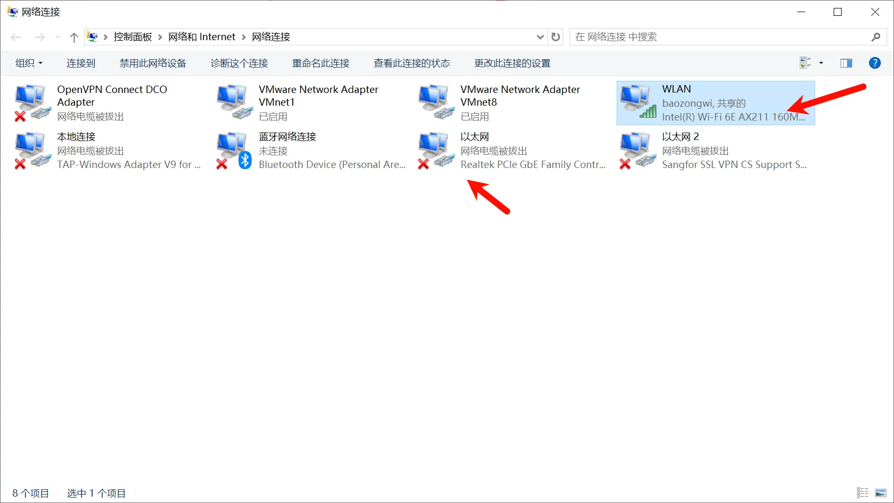
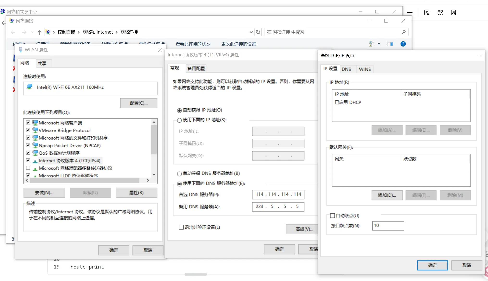

+++
title= "线下出网配置"
slug= "internal-network-egress"
description= "请求支援"
date= "2025-10-28T19:42:35+08:00"
lastmod= "2025-10-28T19:42:35+08:00"
image= ""
license= ""
categories= ["talk"]
tags= [""]

+++

当比赛可以出网的时候，我们可以同时插着网线，以及链接WIFI使用，只需要进行一个设置。

分别对以太网和 WiFi 进行跃点设置，值越小越优先。





同时，有时候靶机不在同一个网段，我们需要添加静态路由，

```bash
# 保证靶机能连
C:\Windows\system32>route add 173.30.0.0 mask 255.255.0.0 174.35.20.254
 操作完成!

C:\Windows\system32>ping 173.30.4.13

正在 Ping 173.30.4.13 具有 32 字节的数据:
来自 173.30.4.13 的回复: 字节=32 时间=1ms TTL=63
来自 173.30.4.13 的回复: 字节=32 时间=1ms TTL=63

173.30.4.13 的 Ping 统计信息:
    数据包: 已发送 = 2，已接收 = 2，丢失 = 0 (0% 丢失)，
往返行程的估计时间(以毫秒为单位):
    最短 = 1ms，最长 = 1ms，平均 = 1ms
Control-C
^C

# 保证上平台
C:\Windows\system32>route add 10.2.65.1 mask 255.255.255.255 174.35.20.254

# 打印路由&&重置路由
route print
route -f
```

自己处理好静态路由之后，需要让队友能够链接网络

```bash
# 终端 1
.\gost.exe -L=socks5://:7777

# 服务器
./gost -L=rtcp://:27878 -L=tcp://:1080

# 终端 2
.\gost.exe -L=rtcp://localhost:7777/160.30.231.213:27878
```

这样 socks5代理就搭建成功了。当时有时候可能需要添加多个静态路由，添加即可，记得多打印，避免错误。

socks5 代理为 160.30.231.213:1080
