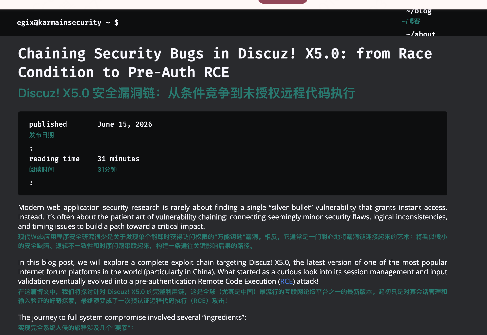

我相信很多人都和我一样，英文不好，至少来说，做不到通读英文文章，所以开始找翻译插件，随后找到了一个粉色的玩意，这东西随便勉强能用，但是其设施收费且占用极大，翻译速度也慢
后来蒙师傅告诉我了一个平替，**陪读蛙**
在 chrome 翻译插件里面就可以用了 https://www.readfrog.app/zh
配置好 DeepSeek 使用 v4flash 模型 再修改下样式就可以优雅的使用了

```css
[data-read-frog-custom-translation-style='custom'] {
  display: block !important;

  /* 位置：贴近原文，但不挤 */
  margin: 0.18em 0 0.55em 0 !important;
  padding: 0 !important;

  /* 去掉所有装饰，避免影响排版 */
  background: transparent !important;
  border: none !important;
  border-radius: 0 !important;
  box-shadow: none !important;

  /* 字体：不要继承网页的代码字体 */
  font-family: -apple-system, BlinkMacSystemFont, "Segoe UI",
    "PingFang SC", "Hiragino Sans GB", "Microsoft YaHei",
    Arial, sans-serif !important;

  /* 视觉：像字幕，不像高亮块 */
  font-size: 0.88em !important;
  line-height: 1.45 !important;
  font-weight: 500 !important;
  letter-spacing: 0.01em;

  /* 白色主题下清楚但不刺眼 */
  color: #28786f !important;

  word-break: break-word;
  overflow-wrap: anywhere;
}

/* 黑色主题 / 深色网页 */
@media (prefers-color-scheme: dark) {
  [data-read-frog-custom-translation-style='custom'] {
    color: #8fd8ce !important;
    opacity: 0.95;
    text-shadow: none !important;
  }
}
```


