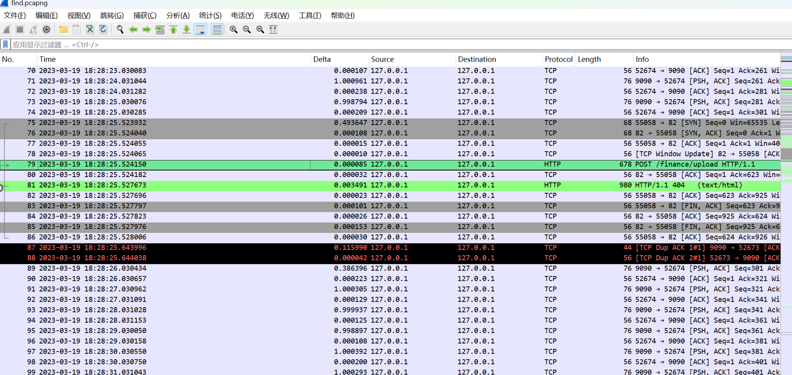
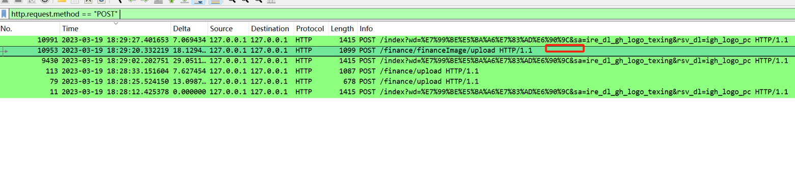
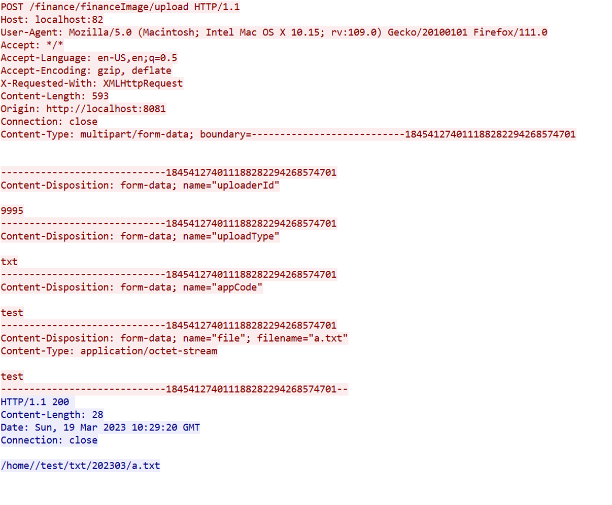
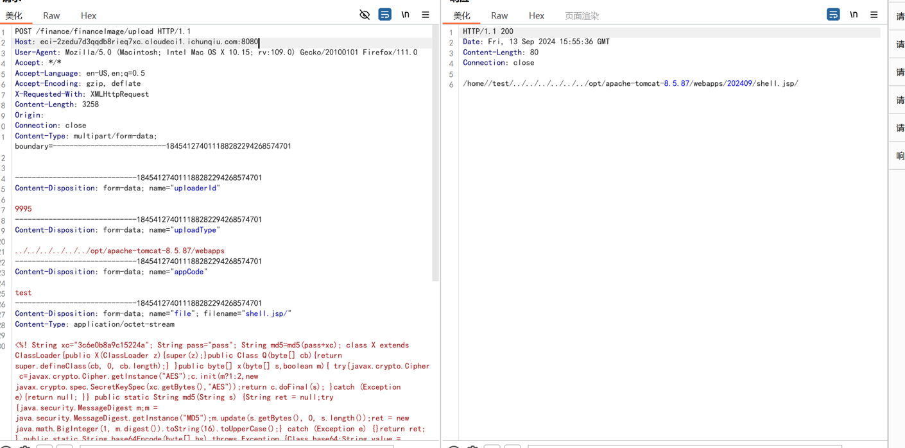

+++
title = "记一次文件上传"
slug = "file-upload-case-study"
description = ""
date = "2024-09-17T21:36:55"
lastmod = "2024-09-17T21:36:55"
image = ""
license = ""
categories = ["赛题"]
tags = ["流量分析"]
+++

# 0x01 前言

之前一般遇到的文件上传，仅仅考虑header等操作就可以了，但是前几天却遇到了一个与流量包相关联的，那么，让我想起了墨者杯，顺便也来记录一下

# 0x02 question

这道题目，是和一个师傅交流之后(由于没有电脑)，由那位师傅打通

## whereisfilepath

既然是文件上传而且给了流量包，我们先看看流量包，



貌似是没有发现什么,跟踪一下，

```
http.request.method == "POST"
```

文件上传是`POST`发包，这个众所周知吧



发现确实是有可疑流量包

跟进TCP流量



很明显看到了确实是进行了文件的上传，红色为发，蓝色为回，之前有道流量题(~~我还是了解的~~),但是这个路径如果用`url`的话怎么弄呢

算了先上传，由流量包找到了可上传路径这里我们打一个哥斯拉`jsp`进去



可以看到路径是在`webapps`下面

直接连接就可以了

```
http://eci-2zedu7d3qqdb8rieq7xc.cloudeci1.ichunqiu.com:8080/202409/shell.jsp

password:pass
```

然后`RCE`即可拿到`flag`

# 0x03 小结

在正常路径下拿不到文件成功上传，看看给的流量包进行追踪或许更有收获
